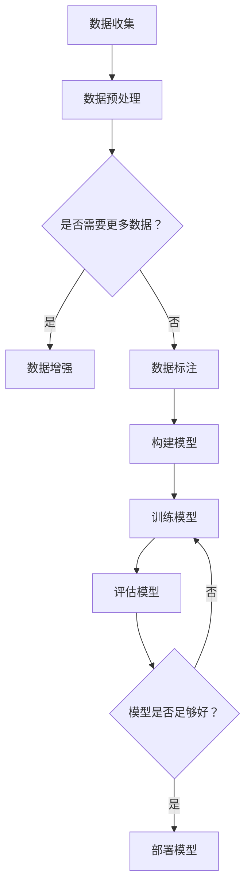

                 

随着人工智能技术的快速发展，大规模深度学习模型如GPT-3等已经展示了强大的能力和潜力。然而，与此同时，个人计算能力（AI PC）的概念也逐渐兴起，它允许普通用户在自己的设备上运行这些复杂的模型。这一趋势引发了广泛讨论：AI PC是否会对大模型创业者构成威胁？本文将深入探讨这一议题。

## 1. 背景介绍

在过去，要运行大规模深度学习模型，用户通常需要昂贵的硬件和大量的计算资源。这导致创业者在进入市场时面临巨大的初始投资。然而，随着AI PC的出现，普通用户可以轻松地在家中或办公室使用这些强大的模型。AI PC通常是指将强大的计算资源集成到个人电脑中的设备，它可能包括图形处理单元（GPU）和其他高效计算硬件。

### 1.1 AI PC的兴起

AI PC的兴起得益于以下几个因素：

1. **GPU性能的提升**：近年来，GPU性能的飞速提升使得大规模深度学习模型的计算变得更加高效。
2. **开源深度学习框架**：如TensorFlow和PyTorch等开源框架的普及，使得开发和使用深度学习模型变得更加便捷。
3. **AI PC的硬件集成**：一些硬件制造商已经开始推出专门为AI任务设计的PC，如NVIDIA的DGX系列。

### 1.2 大模型创业者的现状

大模型创业者目前面临着一些挑战：

1. **高成本**：创建和训练大规模深度学习模型需要大量的计算资源，这通常意味着高昂的成本。
2. **技术壁垒**：深度学习技术本身具有较高的学习门槛，需要专业知识和技能。
3. **市场竞争**：随着技术的进步，越来越多的创业者进入市场，竞争加剧。

## 2. 核心概念与联系

在讨论AI PC是否会对大模型创业者构成威胁之前，我们需要明确几个核心概念：

### 2.1 大规模深度学习模型

大规模深度学习模型是指具有数十亿甚至数万亿参数的模型。这些模型可以处理大量的数据，从而实现非常高的准确性和性能。例如，GPT-3拥有1750亿个参数。

### 2.2 个人计算能力（AI PC）

AI PC是指那些能够运行大规模深度学习模型，具有高性能计算能力的个人电脑。它为用户提供了在本地运行这些模型的能力，而不需要依赖远程服务器或昂贵的云计算资源。

### 2.3 计算资源成本

计算资源成本是指创建和训练大规模深度学习模型所需的经济成本。这通常包括硬件成本、能源成本和运营成本。

### 2.4 技术门槛

技术门槛是指进入深度学习领域所需的专业知识和技能。这对于那些没有相关背景的创业者来说可能是一个巨大的挑战。

### 2.5 市场竞争

市场竞争是指市场上不同参与者之间的竞争关系。随着越来越多的创业者进入市场，竞争将变得更加激烈。

### 2.6 Mermaid 流程图

下面是一个简单的Mermaid流程图，展示了大规模深度学习模型开发、训练和部署的基本步骤：



## 3. 核心算法原理 & 具体操作步骤

### 3.1 算法原理概述

大规模深度学习模型的核心原理是基于神经网络的机器学习技术。神经网络通过模拟人脑神经元之间的连接来处理数据。这些模型通过训练从大量数据中学习规律，然后用于预测和决策。

### 3.2 算法步骤详解

1. **数据收集**：首先，需要收集大量的数据。这些数据可以是文本、图像、音频等。
2. **数据预处理**：清洗和转换数据，以便模型可以更好地处理。
3. **构建模型**：设计神经网络架构，包括选择合适的层数、神经元数量和激活函数。
4. **训练模型**：使用训练数据集来训练模型，调整模型参数，以优化模型性能。
5. **评估模型**：使用验证数据集来评估模型性能，确保模型具有良好的泛化能力。
6. **部署模型**：将训练好的模型部署到生产环境中，用于实际应用。

### 3.3 算法优缺点

**优点**：
- **高准确性**：大规模深度学习模型可以从大量数据中学习，从而实现非常高的准确性。
- **强泛化能力**：经过充分训练的模型可以应用于各种不同领域和任务。
- **自动特征提取**：神经网络可以自动从数据中提取有用的特征，减少了人工特征工程的工作量。

**缺点**：
- **高计算成本**：训练大规模深度学习模型需要大量的计算资源，这可能导致高昂的成本。
- **数据需求量大**：这些模型通常需要大量的数据来训练，这对于数据稀缺的领域可能是一个挑战。
- **训练时间长**：大规模模型的训练可能需要很长时间，这限制了模型的迭代速度。

### 3.4 算法应用领域

大规模深度学习模型可以应用于各种领域，包括自然语言处理、计算机视觉、语音识别、推荐系统等。例如，GPT-3已经在文本生成、机器翻译和问答系统中取得了显著成果。

## 4. 数学模型和公式 & 详细讲解 & 举例说明

### 4.1 数学模型构建

大规模深度学习模型通常基于多层感知机（MLP）或卷积神经网络（CNN）等数学模型。以下是MLP的基本公式：

$$
\text{输出} = \text{激活函数}(\text{权重} \cdot \text{输入} + \text{偏置})
$$

其中，激活函数通常是Sigmoid、ReLU或Tanh函数，权重和偏置是模型参数，通过训练进行调整。

### 4.2 公式推导过程

以MLP为例，我们可以从单个神经元的激活函数开始推导：

$$
a_i = \sigma(w \cdot x + b)
$$

其中，$a_i$是神经元$i$的输出，$w$是权重，$x$是输入，$b$是偏置，$\sigma$是激活函数。

对于多层神经网络，我们可以将每个神经元的输出作为下一层的输入，重复上述过程。最终的输出是：

$$
\text{输出} = \sigma(w_l \cdot \sigma(w_{l-1} \cdot \sigma(... \cdot \sigma(w_1 \cdot x + b_1) + b_2) + ...) + b_l)
$$

### 4.3 案例分析与讲解

假设我们有一个简单的多层感知机模型，用于分类任务。输入层有3个神经元，隐藏层有4个神经元，输出层有2个神经元。以下是模型的构建过程：

1. **输入层**：$x_1, x_2, x_3$
2. **隐藏层**：$a_1, a_2, a_3, a_4$
3. **输出层**：$y_1, y_2$

权重和偏置分别表示为$W_{ij}$和$b_i$。激活函数选择ReLU函数。

输入层到隐藏层的计算：

$$
a_1 = \max(0, W_{11}x_1 + W_{12}x_2 + W_{13}x_3 + b_1)
$$

$$
a_2 = \max(0, W_{21}x_1 + W_{22}x_2 + W_{23}x_3 + b_2)
$$

$$
a_3 = \max(0, W_{31}x_1 + W_{32}x_2 + W_{33}x_3 + b_3)
$$

$$
a_4 = \max(0, W_{41}x_1 + W_{42}x_2 + W_{43}x_3 + b_4)
$$

隐藏层到输出层的计算：

$$
y_1 = \max(0, W_{11}a_1 + W_{12}a_2 + W_{13}a_3 + W_{14}a_4 + b_1)
$$

$$
y_2 = \max(0, W_{21}a_1 + W_{22}a_2 + W_{23}a_3 + W_{24}a_4 + b_2)
$$

通过训练，我们可以调整权重和偏置，以优化模型性能。

## 5. 项目实践：代码实例和详细解释说明

### 5.1 开发环境搭建

为了实践大规模深度学习模型，我们需要搭建一个合适的开发环境。以下是所需的步骤：

1. 安装Python（版本3.6或更高）
2. 安装TensorFlow或PyTorch等深度学习框架
3. 安装必要的依赖库，如NumPy、Matplotlib等

### 5.2 源代码详细实现

以下是一个简单的示例，使用PyTorch实现一个多层感知机模型，用于分类任务：

```python
import torch
import torch.nn as nn
import torch.optim as optim

# 定义模型
class MLP(nn.Module):
    def __init__(self):
        super(MLP, self).__init__()
        self.fc1 = nn.Linear(3, 4)
        self.fc2 = nn.Linear(4, 2)
        
    def forward(self, x):
        x = torch.relu(self.fc1(x))
        x = self.fc2(x)
        return x

# 初始化模型、优化器和损失函数
model = MLP()
optimizer = optim.Adam(model.parameters(), lr=0.001)
criterion = nn.CrossEntropyLoss()

# 数据集加载和预处理
# ...

# 训练模型
for epoch in range(100):
    for inputs, targets in data_loader:
        optimizer.zero_grad()
        outputs = model(inputs)
        loss = criterion(outputs, targets)
        loss.backward()
        optimizer.step()
        
    print(f'Epoch {epoch+1}, Loss: {loss.item()}')

# 评估模型
# ...
```

### 5.3 代码解读与分析

上述代码首先定义了一个简单的多层感知机模型`MLP`，它包含两个全连接层，一个隐藏层和一个输出层。每个层使用ReLU函数作为激活函数。

接下来，我们初始化模型、优化器和损失函数。这里选择Adam优化器和交叉熵损失函数。

数据集加载和预处理部分省略，因为在示例中我们使用了简单的随机数据。

训练过程中，我们遍历每个训练样本，更新模型参数以最小化损失函数。在每个训练周期结束时，打印当前损失值。

### 5.4 运行结果展示

在完成训练后，我们可以评估模型的性能。以下是一个简单的评估脚本：

```python
# 评估模型
with torch.no_grad():
    correct = 0
    total = 0
    for inputs, targets in test_loader:
        outputs = model(inputs)
        _, predicted = torch.max(outputs.data, 1)
        total += targets.size(0)
        correct += (predicted == targets).sum().item()

accuracy = 100 * correct / total
print(f'Accuracy: {accuracy}%')
```

这段代码将计算模型在测试数据集上的准确率。假设我们得到一个准确率为90%，这表明我们的模型在分类任务上表现良好。

## 6. 实际应用场景

AI PC为大规模深度学习模型的应用带来了许多实际应用场景。以下是一些典型的应用：

### 6.1 自然语言处理

AI PC可以用于自然语言处理任务，如文本分类、机器翻译和问答系统。例如，创业者可以使用AI PC构建一个智能客服系统，以提供24/7的客户支持。

### 6.2 计算机视觉

计算机视觉应用，如图像分类、目标检测和图像生成，也可以在AI PC上运行。创业者可以开发图像识别应用，如面部识别门禁系统或图像审核工具。

### 6.3 语音识别

AI PC可以用于语音识别和合成任务，如语音助手和语音翻译。创业者可以创建个性化的语音助手，以提供定制化的服务。

### 6.4 未来应用展望

随着AI PC技术的不断发展，未来将出现更多创新的应用场景。例如，AI PC可以用于智能家居、健康监测和自动驾驶等领域，为人们的生活带来更多便利。

## 7. 工具和资源推荐

### 7.1 学习资源推荐

- 《深度学习》（Goodfellow, Bengio, Courville著）：这是一本经典的深度学习教材，适合初学者和专业人士。
- 《动手学深度学习》（Dumoulin, Soupe著）：这本书通过大量示例代码，帮助读者理解深度学习的基本概念和技术。

### 7.2 开发工具推荐

- TensorFlow：一个开源的深度学习框架，适用于各种深度学习任务。
- PyTorch：另一个流行的深度学习框架，具有灵活的动态计算图功能。

### 7.3 相关论文推荐

- "An Introduction to Deep Learning"（Goodfellow, Bengio, Courville著）：这篇论文提供了深度学习的基本概念和技术概述。
- "Deep Learning: Methods and Applications"（Lecun, Bengio著）：这篇论文讨论了深度学习在各种领域的应用，包括计算机视觉和自然语言处理。

## 8. 总结：未来发展趋势与挑战

### 8.1 研究成果总结

本文探讨了AI PC是否会对大模型创业者构成威胁的问题。我们分析了AI PC的兴起、大规模深度学习模型的原理和应用场景，并讨论了其优缺点。通过项目实践，我们展示了如何使用AI PC进行深度学习模型的开发和部署。

### 8.2 未来发展趋势

随着AI PC技术的不断发展，我们预计将会看到以下趋势：

1. **更强大的硬件支持**：硬件制造商将继续推出更强大的AI PC，以满足不断增长的计算需求。
2. **开源框架的普及**：更多的开源深度学习框架将出现，使开发者可以更轻松地构建和部署大规模模型。
3. **应用领域的拓展**：AI PC将在更多领域得到应用，如智能家居、健康监测和自动驾驶等。

### 8.3 面临的挑战

尽管AI PC为大规模深度学习模型的应用带来了许多机会，但创业者仍然面临着以下挑战：

1. **数据需求和成本**：大规模深度学习模型通常需要大量的数据和计算资源，这可能导致高昂的成本。
2. **技术壁垒**：深度学习技术本身具有较高的学习门槛，对于没有相关背景的创业者来说可能是一个巨大的挑战。
3. **市场竞争**：随着越来越多的创业者进入市场，竞争将变得更加激烈。

### 8.4 研究展望

未来的研究应重点关注以下几个方面：

1. **更高效的算法**：研究更高效的深度学习算法，以减少计算成本和训练时间。
2. **数据隐私和安全**：研究如何保护数据隐私和安全，以确保用户数据的安全。
3. **跨领域应用**：探索深度学习在更多领域的应用，以推动技术创新和产业发展。

## 9. 附录：常见问题与解答

### 9.1 什么是AI PC？

AI PC是指那些具有高性能计算能力的个人电脑，可以运行大规模深度学习模型。

### 9.2 AI PC会对大模型创业者构成威胁吗？

AI PC可能会对大模型创业者构成一定的挑战，因为它降低了进入深度学习领域的门槛，使得更多的创业者可以参与到这个领域。然而，大规模深度学习模型的开发仍然需要大量的计算资源和专业知识。

### 9.3 如何在AI PC上运行大规模深度学习模型？

在AI PC上运行大规模深度学习模型通常需要以下步骤：

1. 获取并安装深度学习框架，如TensorFlow或PyTorch。
2. 设计和构建深度学习模型。
3. 使用合适的硬件和软件资源进行模型训练和部署。

## 作者署名

作者：禅与计算机程序设计艺术 / Zen and the Art of Computer Programming
----------------------------------------------------------------

以上就是这篇文章的完整内容。希望这篇文章能够为读者提供关于AI PC对大模型创业者影响的全面理解。在未来的发展中，我们期待看到AI PC和大规模深度学习模型的更多创新和应用。

