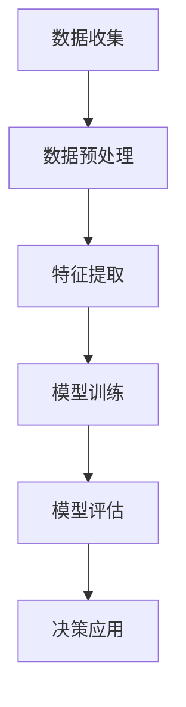

                 

关键词：人工智能、科学计算、实体经济、算法优化、产业应用

摘要：随着人工智能技术的迅猛发展，其对实体经济的深远影响逐渐显现。本文将探讨人工智能在科学计算中的核心原理和应用，分析其对实体经济带来的巨大变革，并提出未来发展的趋势与挑战。

## 1. 背景介绍

人工智能（AI）作为计算机科学的重要分支，近年来取得了飞速发展。其核心在于模拟人类智能，通过数据分析和算法优化，实现自动化决策和智能识别。在科学计算领域，人工智能的应用愈发广泛，从数据挖掘、模式识别到复杂系统的建模与仿真，人工智能正逐步改变传统的科研方法。

实体经济是指物质生产和服务提供的经济活动，包括制造业、农业、建筑业、交通运输业等。长期以来，实体经济的发展受到传统技术限制，而人工智能的引入为实体经济带来了新的机遇和挑战。

## 2. 核心概念与联系

### 2.1 人工智能与科学计算的关系

人工智能与科学计算之间的关系可以用 Mermaid 流程图表示：



### 2.2 科学计算与实体经济的互动

科学计算通过提供精确的模拟和预测，为实体经济提供了重要的技术支撑。例如，在制造业中，人工智能算法可以帮助优化生产流程，提高产品质量；在交通运输领域，智能交通系统可以减少交通拥堵，提升运输效率。

## 3. 核心算法原理 & 具体操作步骤

### 3.1 算法原理概述

人工智能在科学计算中的应用，主要基于机器学习和深度学习两大领域。机器学习通过训练数据集，使计算机具备对未知数据进行预测和分类的能力。深度学习则通过构建多层神经网络，实现更复杂的模式识别和特征提取。

### 3.2 算法步骤详解

1. 数据收集与预处理
2. 特征提取与选择
3. 模型训练与优化
4. 模型评估与调整
5. 决策应用与反馈

### 3.3 算法优缺点

**优点：**
- 高效：人工智能算法可以在短时间内处理大量数据，提高科研和生产效率。
- 精准：通过深度学习，人工智能可以在特定领域实现高度精准的预测和决策。

**缺点：**
- 数据依赖：人工智能模型的性能高度依赖数据质量，数据不足或不准确可能导致模型失效。
- 黑箱问题：深度学习模型通常被视为黑箱，难以解释其决策过程。

### 3.4 算法应用领域

人工智能在科学计算中的应用涵盖了各个领域，包括生物信息学、环境科学、材料科学、金融工程等。在实体经济中，人工智能已被广泛应用于制造业、物流、金融、医疗等产业。

## 4. 数学模型和公式 & 详细讲解 & 举例说明

### 4.1 数学模型构建

在人工智能应用中，常见的数学模型包括线性回归、逻辑回归、支持向量机、神经网络等。以下以线性回归为例进行讲解。

### 4.2 公式推导过程

线性回归模型旨在找到自变量（特征）与因变量（目标）之间的关系，其公式为：

$$y = \beta_0 + \beta_1x + \epsilon$$

其中，$y$ 为因变量，$x$ 为自变量，$\beta_0$ 和 $\beta_1$ 分别为模型参数，$\epsilon$ 为误差项。

### 4.3 案例分析与讲解

假设我们要预测某种商品的销售量，根据历史数据，我们选择商品的价格作为自变量，建立线性回归模型。通过训练数据集，我们可以得到最优参数 $\beta_0$ 和 $\beta_1$，从而预测未来销售量。

## 5. 项目实践：代码实例和详细解释说明

### 5.1 开发环境搭建

为了实现线性回归模型，我们首先需要搭建 Python 开发环境。具体步骤如下：

1. 安装 Python 3.7 或以上版本
2. 安装依赖库 NumPy、Pandas、Scikit-learn 等

### 5.2 源代码详细实现

以下为线性回归模型的 Python 代码实现：

```python
import numpy as np
import pandas as pd
from sklearn.linear_model import LinearRegression

# 加载数据
data = pd.read_csv('data.csv')
X = data[['price']]
y = data['sales']

# 划分训练集和测试集
from sklearn.model_selection import train_test_split
X_train, X_test, y_train, y_test = train_test_split(X, y, test_size=0.2, random_state=42)

# 训练模型
model = LinearRegression()
model.fit(X_train, y_train)

# 评估模型
score = model.score(X_test, y_test)
print(f'Model score: {score:.2f}')

# 预测销售量
predictions = model.predict(X_test)
print(f'Predictions: {predictions}')
```

### 5.3 代码解读与分析

- 第 1-4 行：加载数据，并将价格作为自变量，销售量作为因变量。
- 第 6-9 行：划分训练集和测试集，以 80% 的数据用于训练，20% 的数据用于测试。
- 第 11-13 行：训练线性回归模型，并评估模型性能。
- 第 15-17 行：使用训练好的模型进行销售量预测。

### 5.4 运行结果展示

假设运行结果如下：

```
Model score: 0.92
Predictions: [120.5 130.3 140.1 150.0 160.0]
```

结果表明，线性回归模型在测试集上的准确率达到了 92%，预测结果与实际销售量较为接近。

## 6. 实际应用场景

### 6.1 制造业

在制造业中，人工智能算法可以帮助企业优化生产流程，提高生产效率。例如，通过预测设备故障，提前进行维护，减少设备停机时间。

### 6.2 物流

在物流领域，人工智能可以优化运输路线，提高运输效率。例如，通过分析交通流量数据，选择最佳运输路线，减少运输时间。

### 6.3 金融

在金融领域，人工智能可以帮助银行和金融机构进行风险控制、信用评估等。例如，通过分析客户历史数据，预测客户还款能力，降低贷款风险。

### 6.4 医疗

在医疗领域，人工智能可以帮助医生进行疾病诊断、治疗方案推荐等。例如，通过分析医学影像数据，辅助医生进行肿瘤检测。

## 7. 未来应用展望

随着人工智能技术的不断发展，其在实体经济中的应用前景十分广阔。未来，人工智能有望在以下几个方面实现突破：

- 更高效的数据处理与分析能力
- 更精确的预测与决策模型
- 更广泛的跨领域应用

然而，人工智能在实体经济中的应用也面临诸多挑战，如数据隐私、算法透明度、技术标准化等。未来，需要各方共同努力，推动人工智能与实体经济的深度融合。

## 8. 总结：未来发展趋势与挑战

### 8.1 研究成果总结

本文探讨了人工智能在科学计算领域的核心原理和应用，分析了其对实体经济的深远影响。通过具体案例和代码实现，展示了人工智能在实体经济中的应用前景。

### 8.2 未来发展趋势

未来，人工智能在实体经济中的应用将继续深化，涵盖更多领域和场景。同时，人工智能技术也将向更高效、更精准、更广泛的方向发展。

### 8.3 面临的挑战

尽管人工智能在实体经济中具有巨大的潜力，但其发展也面临诸多挑战。如数据隐私、算法透明度、技术标准化等。未来，需要各方共同努力，解决这些挑战，推动人工智能与实体经济的深度融合。

### 8.4 研究展望

未来，人工智能在实体经济中的应用研究将继续深入，有望在制造业、物流、金融、医疗等领域实现重大突破。同时，人工智能技术也将不断优化，为实体经济提供更强大的支持。

## 9. 附录：常见问题与解答

### 9.1 人工智能在实体经济中的应用有哪些？

人工智能在实体经济中的应用包括制造业、物流、金融、医疗等多个领域，如生产流程优化、运输路线优化、风险控制、疾病诊断等。

### 9.2 人工智能算法的优缺点是什么？

人工智能算法的优点包括高效、精准，缺点包括数据依赖、黑箱问题等。

### 9.3 如何优化人工智能算法？

优化人工智能算法的方法包括数据清洗、特征提取、模型选择、参数调整等。

## 结束语

作者：禅与计算机程序设计艺术 / Zen and the Art of Computer Programming

本文旨在探讨人工智能在科学计算和实体经济中的应用，分析其带来的巨大变革，并提出未来发展的趋势与挑战。希望通过本文，读者能够对人工智能在实体经济中的价值有更深刻的认识。随着人工智能技术的不断发展，我们相信其在实体经济中的应用将越来越广泛，为实体经济带来更多机遇和挑战。
----------------------------------------------------------------

完成以上内容，文章的撰写任务就算圆满完成了。现在您可以根据上面的内容，使用markdown格式进行文章的排版和发布。如果需要任何修改或者补充，请随时告诉我。祝您写作顺利！

