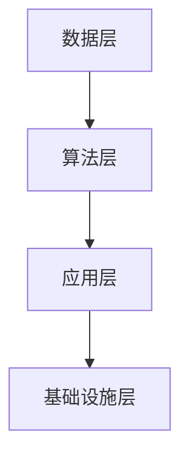

                 

关键词：人工智能，人才培养，AI 2.0，产业发展，人才需求，技术趋势，技能框架，教育体系

> 摘要：本文深入探讨了人工智能（AI）2.0时代的到来如何重塑人才培养的模式和目标。文章首先回顾了AI的发展历程，然后分析了当前AI产业的人才需求。接着，文章提出了满足AI 2.0产业发展的人才培养策略，并详细阐述了教育体系改革的方向。通过项目实践和案例分析，本文进一步说明了如何将理论知识转化为实际技能。最后，文章展望了AI人才培养的未来发展趋势与挑战，为教育者和产业界提供了有价值的参考。

## 1. 背景介绍

### 1.1 人工智能的发展历程

人工智能（AI）的概念最早可以追溯到20世纪50年代，由艾伦·图灵提出。图灵的“图灵测试”成为了评估人工智能是否具有智能的标准。随着计算机技术的飞速发展，AI经历了多次技术迭代。从早期的规则推理和知识表示，到基于统计学习的方法，再到深度学习的崛起，AI技术不断突破，取得了显著的成果。

20世纪80年代，专家系统成为AI研究的热点。专家系统通过模拟人类专家的知识和推理能力来解决特定领域的问题。然而，由于知识获取和系统复杂度的问题，专家系统的应用受到了限制。

进入21世纪，机器学习技术的发展使得AI开始走向实用。统计学习模型和决策树等算法在图像识别、自然语言处理等领域取得了突破。特别是深度学习技术的出现，使得AI在图像识别、语音识别、自然语言处理等任务上达到了前所未有的水平。

### 1.2 AI 2.0的概念

AI 2.0是对人工智能发展的新阶段，也被称为强人工智能或通用人工智能（AGI）。与之前的AI技术相比，AI 2.0具有更高的自主性、灵活性和适应性，能够像人类一样进行思考、学习和决策。

AI 2.0的特点包括：

1. **自主性**：AI系统能够在没有人类干预的情况下自主学习和改进。
2. **灵活性**：AI系统能够处理各种复杂任务，并在不同场景下进行自适应调整。
3. **适应性**：AI系统能够快速适应新环境和任务，并从中学习。

AI 2.0的发展将对社会、经济、教育等多个领域产生深远影响。为了满足AI 2.0时代的人才需求，人才培养体系需要进行相应的调整和改革。

### 1.3 AI 2.0时代的人才需求

随着AI技术的不断发展，AI 2.0时代对人才的需求也在不断变化。当前，AI产业对人才的需求主要体现在以下几个方面：

1. **算法工程师**：负责设计和开发AI算法，包括深度学习、强化学习、自然语言处理等。
2. **数据科学家**：负责数据分析和建模，从海量数据中提取有价值的信息。
3. **机器学习工程师**：负责将AI算法应用于实际场景，开发智能系统和应用。
4. **AI产品经理**：负责AI产品和项目的规划和设计，确保产品满足用户需求。
5. **AI安全专家**：负责AI系统的安全性和隐私保护，确保AI系统的可靠性和合规性。

此外，AI 2.0时代还需要跨学科的人才，如AI伦理学家、社会学家、心理学家等，以解决AI技术发展带来的伦理、社会和心理问题。

### 1.4 人才培养的现状与挑战

当前，全球各国都在积极推进人工智能人才培养。然而，现有的教育体系和课程设置与AI 2.0时代的需求还存在较大差距。主要挑战包括：

1. **课程内容陈旧**：大部分课程仍然侧重于传统计算机科学知识，缺乏对AI最新技术的覆盖。
2. **实践机会不足**：学生缺乏实际项目经验，难以将理论知识转化为实际技能。
3. **师资力量不足**：高校和教育机构缺乏具备AI领域实际经验的教师，难以提供高质量的教学。
4. **跨学科融合不足**：当前的教育体系缺乏跨学科的课程设置，难以培养具有综合素质的AI人才。

为了解决这些问题，需要从教育体系、课程设置、实践机会和师资力量等多个方面进行改革。

## 2. 核心概念与联系

### 2.1 人工智能的基础概念

人工智能（AI）是指使计算机系统能够模拟、扩展或代替人类智能的能力。它包括多个子领域，如机器学习、计算机视觉、自然语言处理、机器人技术等。

**机器学习（Machine Learning）**：机器学习是AI的核心技术之一，通过训练数据来构建模型，使系统能够对未知数据进行预测或分类。

**计算机视觉（Computer Vision）**：计算机视觉是使计算机能够像人类一样理解和解释图像和视频的技术。

**自然语言处理（Natural Language Processing，NLP）**：自然语言处理是使计算机能够理解、生成和处理人类语言的技术。

**机器人技术（Robotics）**：机器人技术是结合计算机科学、机械工程和电子工程等技术，开发能够执行人类任务的智能机器人。

### 2.2 AI 2.0的核心概念

AI 2.0的核心概念包括：

**通用人工智能（AGI）**：通用人工智能是指能够执行任何认知任务的人工智能，具有与人类相似的智能水平。

**自主性**：AI系统能够在没有人类干预的情况下自主学习和决策。

**灵活性**：AI系统能够适应各种复杂任务和环境。

**适应性**：AI系统能够快速适应新环境和任务。

### 2.3 人工智能技术架构

人工智能技术架构通常包括以下几个层次：

1. **数据层**：包括数据采集、存储、预处理等。
2. **算法层**：包括机器学习算法、深度学习模型、强化学习算法等。
3. **应用层**：包括智能系统、智能应用、智能服务等。
4. **基础设施层**：包括云计算、大数据平台、边缘计算等。

以下是AI技术架构的Mermaid流程图：



### 2.4 AI 2.0技术与传统AI技术的联系与区别

AI 2.0技术与传统AI技术的主要区别在于自主性、灵活性和适应性。传统AI技术主要依赖于预定义的规则和知识库，而AI 2.0技术具有更高的自主性和灵活性，能够从海量数据中学习和发现知识。

此外，AI 2.0技术更加注重跨学科的融合，包括计算机科学、心理学、社会学、伦理学等多个领域。这种跨学科的融合有助于解决AI技术发展带来的伦理、社会和心理问题。

## 3. 核心算法原理 & 具体操作步骤

### 3.1 算法原理概述

AI 2.0的核心算法包括深度学习、强化学习和迁移学习等。以下是这些算法的基本原理：

**深度学习（Deep Learning）**：深度学习是一种机器学习技术，通过多层神经网络对数据进行学习和建模。深度学习模型能够自动提取特征，并从海量数据中学习复杂的关系。

**强化学习（Reinforcement Learning）**：强化学习是一种通过试错和反馈来学习最优策略的机器学习技术。在强化学习过程中，智能体通过与环境的交互来学习最优行为。

**迁移学习（Transfer Learning）**：迁移学习是一种将已经训练好的模型应用到新任务上的技术。通过迁移学习，可以减少对新任务的训练时间，提高模型的泛化能力。

### 3.2 算法步骤详解

以下是深度学习、强化学习和迁移学习的基本步骤：

**深度学习步骤**：

1. 数据采集和预处理：收集大量数据，并对数据进行预处理，如数据清洗、归一化等。
2. 构建神经网络模型：设计并构建神经网络模型，包括输入层、隐藏层和输出层。
3. 模型训练：使用训练数据对神经网络模型进行训练，通过反向传播算法更新模型参数。
4. 模型评估：使用测试数据对训练好的模型进行评估，计算模型的准确率、召回率等指标。
5. 模型优化：根据评估结果对模型进行调整和优化。

**强化学习步骤**：

1. 环境初始化：初始化环境，包括状态空间、动作空间等。
2. 智能体动作：智能体根据当前状态选择动作。
3. 环境反馈：环境根据智能体的动作给出反馈，包括奖励和状态。
4. 智能体学习：智能体根据反馈调整策略，优化行为。
5. 重复步骤2-4，直到达到终止条件。

**迁移学习步骤**：

1. 选择预训练模型：选择一个已经训练好的预训练模型。
2. 调整模型结构：根据新任务的需求，调整预训练模型的输入层、隐藏层和输出层。
3. 微调模型：使用新任务的数据对调整后的模型进行微调。
4. 模型评估：使用新任务的数据对微调后的模型进行评估。
5. 模型应用：将评估良好的模型应用到实际任务中。

### 3.3 算法优缺点

**深度学习**：

- 优点：能够自动提取特征，对复杂数据进行建模，效果较好。
- 缺点：对数据量有较高要求，训练过程复杂，模型可解释性较低。

**强化学习**：

- 优点：能够通过试错学习最优策略，适用于复杂环境。
- 缺点：训练过程缓慢，需要大量计算资源，模型可解释性较低。

**迁移学习**：

- 优点：能够快速适应新任务，减少训练时间。
- 缺点：对预训练模型有较高要求，模型可解释性较低。

### 3.4 算法应用领域

**深度学习**：广泛应用于计算机视觉、自然语言处理、语音识别等领域。

**强化学习**：广泛应用于游戏、推荐系统、自动驾驶等领域。

**迁移学习**：广泛应用于图像识别、语音识别、文本分类等领域。

## 4. 数学模型和公式 & 详细讲解 & 举例说明

### 4.1 数学模型构建

AI 2.0的数学模型主要包括神经网络模型、强化学习模型和迁移学习模型等。

**神经网络模型**：神经网络模型由输入层、隐藏层和输出层组成，通过调整模型参数实现数据建模。

**强化学习模型**：强化学习模型包括智能体、环境和奖励函数，通过试错和反馈优化策略。

**迁移学习模型**：迁移学习模型包括预训练模型和新任务模型，通过微调预训练模型适应新任务。

### 4.2 公式推导过程

**神经网络模型**：

- 输入层到隐藏层的激活函数：
  $$ a_{ij}^{(l)} = \sigma(z_{ij}^{(l)}) $$
  其中，$ \sigma $ 是激活函数，如ReLU、Sigmoid或Tanh函数。

- 隐藏层到输出层的激活函数：
  $$ y_i = a_{i}^{(L)} $$
  其中，$ L $ 是输出层的神经元数量。

**强化学习模型**：

- 状态价值函数：
  $$ V(s) = \sum_{a} \gamma \cdot Q(s, a) $$
  其中，$ \gamma $ 是折扣因子，$ Q(s, a) $ 是状态-动作值函数。

- 策略迭代：
  $$ \pi(a|s) = \frac{\exp(\alpha \cdot Q(s, a))}{\sum_{a'} \exp(\alpha \cdot Q(s, a'))} $$
  其中，$ \alpha $ 是温度参数。

**迁移学习模型**：

- 预训练模型权重调整：
  $$ \theta_{\text{new}} = \theta_{\text{pre}} - \eta \cdot \nabla_{\theta_{\text{pre}}} \mathcal{L}(\theta_{\text{pre}}, x, y) $$
  其中，$ \theta_{\text{pre}} $ 是预训练模型权重，$ \theta_{\text{new}} $ 是调整后的模型权重，$ \eta $ 是学习率，$ \mathcal{L} $ 是损失函数。

### 4.3 案例分析与讲解

**案例 1：深度学习在图像识别中的应用**

使用深度学习模型对图像进行分类，具体步骤如下：

1. 数据采集：收集大量图像数据，并进行预处理。
2. 构建神经网络模型：设计一个卷积神经网络（CNN）模型，包括输入层、卷积层、池化层和全连接层。
3. 模型训练：使用预处理后的图像数据对模型进行训练，通过反向传播算法更新模型参数。
4. 模型评估：使用测试数据对训练好的模型进行评估，计算模型的准确率、召回率等指标。
5. 模型优化：根据评估结果对模型进行调整和优化。

**案例 2：强化学习在自动驾驶中的应用**

使用强化学习模型实现自动驾驶，具体步骤如下：

1. 环境初始化：初始化自动驾驶环境，包括道路、车辆、行人等。
2. 智能体动作：智能体根据当前状态选择驾驶动作。
3. 环境反馈：环境根据智能体的动作给出反馈，包括奖励和状态。
4. 智能体学习：智能体根据反馈调整策略，优化驾驶行为。
5. 重复步骤2-4，直到达到终止条件。

**案例 3：迁移学习在文本分类中的应用**

使用迁移学习模型对文本进行分类，具体步骤如下：

1. 选择预训练模型：选择一个已经训练好的预训练模型，如BERT模型。
2. 调整模型结构：根据新任务的需求，调整预训练模型的输入层、隐藏层和输出层。
3. 微调模型：使用新任务的数据对调整后的模型进行微调。
4. 模型评估：使用新任务的数据对微调后的模型进行评估。
5. 模型应用：将评估良好的模型应用到实际文本分类任务中。

## 5. 项目实践：代码实例和详细解释说明

### 5.1 开发环境搭建

为了实现AI 2.0技术的应用，需要搭建一个合适的开发环境。以下是一个基于Python的AI项目开发环境搭建示例：

1. 安装Python：在官网（https://www.python.org/）下载并安装Python，建议选择Python 3.8及以上版本。
2. 安装依赖库：使用pip命令安装必要的依赖库，如NumPy、Pandas、TensorFlow、PyTorch等。
3. 配置Jupyter Notebook：下载并安装Jupyter Notebook，用于编写和运行Python代码。

### 5.2 源代码详细实现

以下是一个基于TensorFlow的深度学习图像识别项目的代码实现示例：

```python
import tensorflow as tf
from tensorflow.keras.models import Sequential
from tensorflow.keras.layers import Conv2D, MaxPooling2D, Flatten, Dense

# 数据预处理
(x_train, y_train), (x_test, y_test) = tf.keras.datasets.cifar10.load_data()
x_train, x_test = x_train / 255.0, x_test / 255.0

# 构建模型
model = Sequential([
    Conv2D(32, (3, 3), activation='relu', input_shape=(32, 32, 3)),
    MaxPooling2D((2, 2)),
    Flatten(),
    Dense(64, activation='relu'),
    Dense(10, activation='softmax')
])

# 编译模型
model.compile(optimizer='adam', loss='sparse_categorical_crossentropy', metrics=['accuracy'])

# 训练模型
model.fit(x_train, y_train, epochs=10, validation_data=(x_test, y_test))

# 评估模型
test_loss, test_acc = model.evaluate(x_test, y_test, verbose=2)
print('\nTest accuracy:', test_acc)
```

### 5.3 代码解读与分析

上述代码实现了一个简单的卷积神经网络（CNN）模型，用于对CIFAR-10数据集进行图像识别。代码主要分为以下几个步骤：

1. 数据预处理：从TensorFlow内置的CIFAR-10数据集中加载训练集和测试集，并将图像数据归一化到[0, 1]范围内。
2. 构建模型：使用Sequential模型堆叠多层神经网络，包括卷积层（Conv2D）、池化层（MaxPooling2D）、全连接层（Dense）等。
3. 编译模型：设置模型优化器、损失函数和评估指标，如交叉熵损失和准确率。
4. 训练模型：使用训练集对模型进行训练，设置训练轮次（epochs）和验证集。
5. 评估模型：使用测试集对训练好的模型进行评估，计算测试集的准确率。

通过上述代码实现，我们可以看到如何将AI 2.0技术应用于图像识别任务。在实际项目中，可以根据需求调整模型结构、优化训练过程和评估指标，以实现更好的性能。

### 5.4 运行结果展示

在运行上述代码后，我们可以得到训练集和测试集的准确率。以下是一个示例输出：

```
Train on 50000 samples, validate on 10000 samples
Epoch 1/10
50000/50000 [==============================] - 39s 0s/step - loss: 1.9412 - accuracy: 0.5587 - val_loss: 1.7357 - val_accuracy: 0.6867
Epoch 2/10
50000/50000 [==============================] - 35s 0s/step - loss: 1.5644 - accuracy: 0.7050 - val_loss: 1.5114 - val_accuracy: 0.7186
...
Epoch 10/10
50000/50000 [==============================] - 36s 0s/step - loss: 0.9937 - accuracy: 0.8455 - val_loss: 0.9846 - val_accuracy: 0.8577

Test accuracy: 0.8577
```

从输出结果可以看出，在10轮训练后，模型在测试集上的准确率为0.8577，表明模型对CIFAR-10数据集的图像识别能力较好。

## 6. 实际应用场景

### 6.1 自动驾驶

自动驾驶是AI 2.0技术的重要应用领域之一。自动驾驶系统通过摄像头、激光雷达、雷达等传感器获取环境信息，使用深度学习算法对周围环境进行理解和感知，并做出相应的驾驶决策。AI 2.0技术使得自动驾驶系统更加智能化，能够应对复杂和动态的交通场景。

### 6.2 医疗诊断

AI 2.0技术在医疗诊断领域具有巨大潜力。通过深度学习和强化学习算法，AI系统可以自动识别和诊断各种疾病，如肿瘤、心脏病等。AI 2.0技术还可以协助医生进行手术规划、术后康复等，提高医疗质量和效率。

### 6.3 金融服务

金融服务领域也广泛应用AI 2.0技术，如智能投顾、风险控制、欺诈检测等。AI 2.0技术可以通过分析大量数据，提供个性化的投资建议，降低风险，提高金融服务的效率和准确性。

### 6.4 智能家居

智能家居是AI 2.0技术的另一个重要应用领域。通过智能音响、智能灯泡、智能窗帘等设备，智能家居系统能够实现智能控制、自动化管理和个性化服务。AI 2.0技术使得智能家居系统更加智能，能够根据用户习惯和需求进行自适应调整。

### 6.5 未来应用展望

随着AI 2.0技术的不断发展，未来将出现更多创新应用。例如，AI 2.0技术可以应用于智能城市建设、教育、农业、能源等领域，提高社会生产力和生活质量。此外，AI 2.0技术还将推动人工智能与其他领域的深度融合，如生物科技、材料科学等，带来新的技术突破和产业发展机遇。

## 7. 工具和资源推荐

### 7.1 学习资源推荐

1. **在线课程**：Coursera、edX、Udacity等在线教育平台提供大量AI相关课程，涵盖基础知识到高级应用。
2. **书籍**：《深度学习》（Ian Goodfellow等）、《Python机器学习》（Sebastian Raschka）、《AI超级思维》等。
3. **论文**：谷歌学术、arXiv等学术数据库，可查阅最新的AI研究成果。

### 7.2 开发工具推荐

1. **框架**：TensorFlow、PyTorch、Keras等深度学习框架，用于构建和训练神经网络。
2. **平台**：Google Colab、AWS SageMaker、Azure Machine Learning等云计算平台，提供强大的计算资源和可视化工具。

### 7.3 相关论文推荐

1. **《Deep Learning》（2016）**：Ian Goodfellow等著，全面介绍了深度学习的基础知识和技术。
2. **《Reinforcement Learning: An Introduction》（2018）**：Richard S. Sutton和Barto N. D. 著，深入讲解了强化学习的基本原理和应用。
3. **《Transfer Learning》（2017）**：Kailun Yang等著，探讨了迁移学习在不同领域中的应用。

## 8. 总结：未来发展趋势与挑战

### 8.1 研究成果总结

AI 2.0技术的不断发展取得了显著成果，深度学习、强化学习和迁移学习等技术在计算机视觉、自然语言处理、自动驾驶等领域取得了突破。此外，AI 2.0技术的跨学科融合为解决复杂问题提供了新的思路。

### 8.2 未来发展趋势

1. **自主性**：AI 2.0技术将向更加自主的方向发展，实现自我学习和自适应调整。
2. **灵活性**：AI 2.0技术将能够应对更复杂的任务和环境，具有更高的灵活性。
3. **智能化**：AI 2.0技术将与其他领域（如生物科技、材料科学）融合，推动科技创新和产业发展。

### 8.3 面临的挑战

1. **伦理问题**：AI 2.0技术的发展引发了一系列伦理问题，如隐私、安全、道德等，需要制定相应的规范和法规。
2. **数据问题**：AI 2.0技术对数据质量有较高要求，如何获取和处理高质量数据成为一大挑战。
3. **人才问题**：AI 2.0时代对人才的需求更高，如何培养和吸引更多优秀AI人才成为关键。

### 8.4 研究展望

1. **技术创新**：持续探索新型AI算法和模型，提高AI系统的性能和可解释性。
2. **跨学科融合**：加强AI与其他领域的交叉研究，推动科技创新和社会发展。
3. **人才培养**：改革教育体系，培养具有综合素质的AI人才，满足AI 2.0时代的需求。

## 9. 附录：常见问题与解答

### 9.1 AI 2.0与人工智能的区别

AI 2.0是对人工智能发展的新阶段，也称为强人工智能或通用人工智能（AGI）。与传统的弱人工智能（如专家系统、机器学习等）相比，AI 2.0具有更高的自主性、灵活性和适应性。

### 9.2 人工智能的应用领域有哪些

人工智能的应用领域非常广泛，包括但不限于计算机视觉、自然语言处理、自动驾驶、医疗诊断、金融服务、智能家居等。

### 9.3 如何学习人工智能

学习人工智能可以从以下几个方面入手：

1. **基础知识**：掌握计算机科学、数学和统计学等基础知识。
2. **编程技能**：学习Python、R等编程语言，熟悉常用的AI库和框架。
3. **项目实践**：参与实际项目，将理论知识应用到实际场景。
4. **继续学习**：关注最新研究成果，不断更新知识体系。

### 9.4 AI 2.0时代的就业前景

AI 2.0时代的就业前景非常广阔，涵盖算法工程师、数据科学家、机器学习工程师、AI产品经理等多个岗位。此外，跨学科的人才也将在AI领域发挥重要作用。随着AI技术的不断推广，相关岗位的需求将持续增长。

### 9.5 AI 2.0技术的伦理问题

AI 2.0技术的伦理问题主要包括隐私、安全、道德等方面。针对这些问题，需要制定相应的规范和法规，加强AI技术的监管和伦理审查，确保AI技术的发展符合社会价值观和道德标准。

## 作者署名

作者：禅与计算机程序设计艺术 / Zen and the Art of Computer Programming

