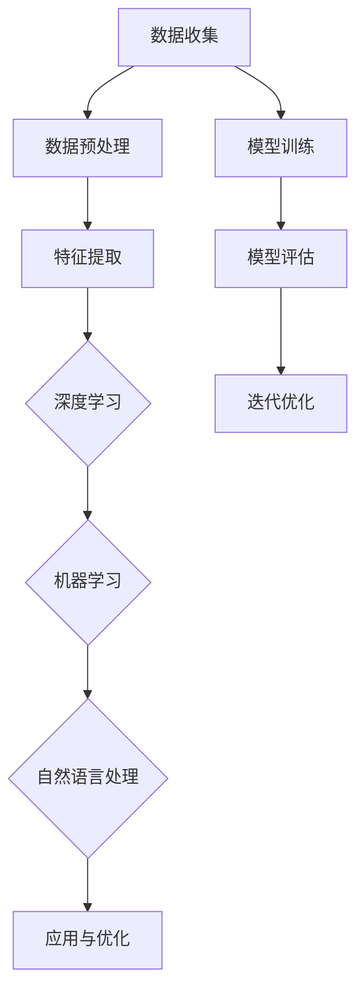

                 

在当今这个充满变革和技术飞速发展的时代，人工智能（AI）已经成为推动社会进步和经济发展的核心动力。随着深度学习、自然语言处理、计算机视觉等领域的突破，AI的应用场景不断扩大，逐渐渗透到各行各业。然而，AI技术的创新并非孤立的个体成就，而是依赖于一个庞大的创新生态系统的支持。本文将探讨AI创新生态的重要性，以及如何构建这样一个生态系统来孵化未来的独角兽企业。

## 关键词
- 人工智能创新生态
- 独角兽企业
- 深度学习
- 自然语言处理
- 开源社区
- 创新链

## 摘要
本文旨在探讨人工智能创新生态的建设及其在孵化未来独角兽企业中的关键作用。通过分析AI技术的核心概念、数学模型、算法原理以及实际应用案例，文章揭示了如何通过构建一个良好的创新生态系统，促进AI技术的快速迭代和广泛应用。同时，文章还展望了AI领域未来的发展趋势和面临的挑战。

## 1. 背景介绍

人工智能，作为计算机科学的一个分支，旨在使计算机能够模拟人类智能的行为。从最初的规则推理到现代的深度学习，AI经历了数次重要的技术革新。近年来，随着计算能力的提升、大数据的积累以及算法的优化，AI技术取得了前所未有的进展。如今，AI已经不仅仅是一个学术研究课题，它已经成为驱动产业升级和社会变革的重要力量。

独角兽企业，是指那些在创立后不久就实现了市值超过10亿美元的初创企业。这些企业在短时间内实现了快速成长，成为各自领域的领导者。典型的独角兽企业如谷歌、亚马逊、滴滴出行等，它们的成功不仅带动了整个行业的进步，也为社会经济的发展注入了新的活力。

本文将探讨如何通过构建一个AI创新生态系统，来孵化这些具有巨大潜力的独角兽企业。这个生态系统不仅需要技术上的突破，还需要政策、资金、人才等多方面的支持。通过分析这个生态系统的构成和运作机制，我们将理解AI技术如何在实践中发挥关键作用。

### 1.1 人工智能的起源与发展

人工智能的起源可以追溯到20世纪50年代。当时的科学家们开始探讨计算机是否能够模拟人类的智能行为。1956年，达特茅斯会议的召开标志着人工智能领域的正式诞生。会议期间，约翰·麦卡锡（John McCarthy）提出了“人工智能”这一术语，并认为机器应该能够执行人类智慧的任务。

在早期，人工智能的研究主要集中在规则推理和符号计算上。这些方法依赖于明确的规则和逻辑推理，但在处理复杂问题和实时决策时存在局限性。随着时间的发展，人工智能技术逐渐从理论走向实践。20世纪80年代，专家系统的出现标志着人工智能进入了一个新的阶段。专家系统能够通过大量规则和知识库来模拟人类专家的决策过程，并在医疗诊断、金融分析等领域取得了显著的应用成果。

然而，专家系统的局限性逐渐显现。由于规则的数量和复杂性增加，系统的维护和扩展变得困难。同时，专家系统的知识库往往依赖于人类专家的经验和知识，难以实现自动化和智能化。为了解决这些问题，研究人员开始探索基于数据驱动的方法，即机器学习。

20世纪90年代，机器学习开始崭露头角。通过利用大量的数据来训练模型，机器学习使得计算机能够自动学习和改进。这一方法的出现标志着人工智能技术进入了一个新的时代。早期的机器学习方法主要包括决策树、支持向量机等，这些方法在分类、回归等问题上取得了显著的成果。

进入21世纪，随着计算能力的提升和大数据的积累，深度学习技术迅速崛起。深度学习通过模拟人脑的结构和功能，利用多层神经网络来处理复杂的数据。2012年，AlexNet在ImageNet图像识别比赛中取得了突破性的成绩，引发了深度学习的热潮。此后，深度学习在计算机视觉、自然语言处理等领域取得了巨大的成功。

深度学习的出现不仅推动了人工智能技术的进步，也为AI的应用场景拓展提供了新的可能性。通过深度学习，计算机能够自动提取数据中的特征，实现更准确的分类、识别和预测。这一技术不仅为学术界带来了新的研究热点，也为工业界带来了巨大的商业价值。

### 1.2 独角兽企业的定义与成长路径

独角兽企业是指那些在创立后不久就实现了市值超过10亿美元的初创企业。这些企业在短时间内实现了快速成长，成为各自领域的领导者。独角兽企业通常具备以下几个特点：

1. **高增长率**：独角兽企业的增长率通常非常高，能够在短时间内实现几何式的增长。这种高速增长往往得益于其创新的商业模式、领先的技术和强大的市场竞争力。

2. **高市值**：独角兽企业的市值超过10亿美元，这一市值标准不仅反映了企业的财务实力，也反映了市场对其未来发展潜力的认可。

3. **核心技术的突破**：独角兽企业往往在其核心领域实现了技术的突破，这些技术不仅具有创新性，而且在市场上具有明显的竞争优势。

4. **商业模式的创新**：独角兽企业的商业模式通常具有创新性，能够满足市场需求，提供独特的价值。

5. **强大的团队**：独角兽企业通常拥有强大的团队，这些团队成员不仅具备丰富的行业经验，而且在技术、市场和管理等方面都有突出的才能。

独角兽企业的成长路径通常可以分为以下几个阶段：

1. **种子阶段**：在这个阶段，企业通常由一个或几个核心团队成员发起，开展初步的技术研发和市场探索。这个阶段的重点是找到市场需求，确定产品的初步方向。

2. **天使轮阶段**：在种子阶段的基础上，企业开始寻求天使投资，用于扩大团队、进一步研发和市场推广。天使轮投资通常来自于个人投资者或风险投资机构。

3. **A轮阶段**：在这个阶段，企业已经初步证明其商业模式的可行性，开始获得更多的风险投资。A轮融资通常用于扩大产品研发、市场推广和团队建设。

4. **B轮及以后**：在企业实现一定规模和市场影响力后，通常会进行B轮、C轮等后续融资。这些融资不仅用于进一步扩大市场份额，还可能用于并购其他企业、拓展新业务领域等。

独角兽企业的成功不仅取决于其自身的创新能力和执行力，还需要依赖于良好的外部环境。这些外部环境包括：

1. **政策支持**：政府的政策支持对独角兽企业的成长至关重要。政策的支持可以包括税收优惠、资金补贴、知识产权保护等。

2. **市场环境**：良好的市场环境有助于独角兽企业的快速发展。市场环境的支持可以包括市场需求、竞争格局、消费者接受度等。

3. **人才吸引**：优秀的人才对独角兽企业的成长至关重要。通过提供有吸引力的薪酬福利、职业发展机会等，企业可以吸引和留住顶尖人才。

4. **资金支持**：充足的资金支持是独角兽企业快速发展的关键。风险投资、天使投资、政府资金等都是企业的重要资金来源。

### 1.3 AI创新生态的重要性

AI创新生态的建设对于推动人工智能技术的发展和应用具有重要意义。首先，一个良好的创新生态能够促进技术交流与合作。在AI领域，不同研究机构和企业的技术积累和经验往往有所不同，通过建立创新生态系统，可以实现技术资源和人才的共享，从而加速技术的迭代和进步。

其次，创新生态能够促进跨界融合。人工智能技术不仅需要计算机科学和数学的支持，还需要生物学、心理学、社会学等多个领域的知识。通过跨界合作，AI技术能够更好地应用于实际场景，解决复杂问题。

此外，创新生态还能够为创业者提供良好的发展环境。在创新生态系统中，创业者可以享受到政策支持、资金扶持、技术培训等多方面的资源，从而降低创业风险，提高成功几率。

最后，创新生态对于推动社会进步和经济发展具有重要作用。AI技术的广泛应用不仅能够提高生产效率，降低成本，还能够改善人们的生活质量，推动社会向更智能化、更高效的方向发展。

### 1.4 创新生态系统与AI发展的关系

创新生态系统是一个复杂的多层次结构，它不仅包括技术层面的创新，还涵盖了政策、资金、人才等多个方面。在AI领域，一个健康且高效的创新生态系统对于推动技术的进步和应用至关重要。以下是创新生态系统与AI发展的具体关系：

**1. 技术创新与生态系统的相互促进**

技术创新是AI发展的核心驱动力。一个良好的创新生态系统可以为技术创新提供肥沃的土壤。在这个生态系统中，研究人员、工程师、创业者可以自由地交流想法、共享资源，从而加速技术的迭代和进步。例如，开源社区是创新生态系统中不可或缺的一部分。通过开源社区，AI研究人员可以分享自己的代码和算法，其他开发者可以在此基础上进行改进和创新，形成一种良性的技术循环。

另一方面，技术创新也推动了创新生态系统的完善。随着AI技术的不断进步，创新生态系统中的各个组成部分都需要不断地进行调整和升级，以适应新的技术趋势和应用需求。例如，AI技术的突破带来了大量的数据需求，这促使云计算、大数据等领域的发展，从而进一步增强了创新生态系统的整体实力。

**2. 政策环境对创新生态系统的影响**

政策环境是创新生态系统的重要保障。政府通过制定合理的政策，可以为AI技术的发展提供良好的外部环境。首先，政策支持可以包括税收优惠、资金补贴、知识产权保护等，这些政策可以降低创业者的创业成本，提高创业成功率。

此外，政府还可以通过立法和规范来保护数据安全和个人隐私。随着AI技术的广泛应用，数据安全和隐私保护成为了一个重要的议题。政府通过制定相关法规，可以建立数据治理框架，保障数据的合法使用和隐私保护，从而为AI技术的发展提供稳定的环境。

**3. 资金支持在创新生态系统中的作用**

资金支持是AI创新生态系统中的重要组成部分。风险投资、天使投资、政府资金等都是企业发展的关键来源。充足的资金支持不仅可以为企业提供必要的运营资金，还可以用于技术研发和市场拓展。

风险投资在创新生态系统中发挥着重要作用。通过投资初创企业，风险投资可以为AI技术提供资金支持，帮助企业度过初创期，实现规模化发展。同时，风险投资还可以通过资源整合和产业协同，促进不同企业之间的合作与创新。

天使投资也是创新生态系统中的重要力量。天使投资者通常具有丰富的行业经验和创业经验，他们不仅为企业提供资金支持，还可以提供宝贵的指导和资源，帮助企业解决发展中的问题。

政府资金在创新生态系统中的作用也不可忽视。政府可以通过科研基金、创新基金等方式，直接支持AI技术研发和产业化应用。政府资金的支持不仅可以促进技术创新，还可以带动相关产业的发展，形成良性循环。

**4. 人才流动与创新生态系统的互动**

人才是创新生态系统中最宝贵的资源。一个良好的创新生态系统可以吸引和留住顶尖人才。为了吸引人才，企业可以提供有吸引力的薪酬福利、职业发展机会等。同时，政策环境也需要为人才提供良好的发展机会和创业环境。

人才流动对于创新生态系统的健康发展具有重要意义。通过人才流动，不同企业之间可以实现知识共享和技能转移，从而促进整体创新能力的提升。例如，研究人员可以在高校和企业之间流动，将学术研究的最新成果应用到实际场景中，推动技术的快速迭代。

此外，人才流动还可以促进创新生态系统的多元化发展。不同背景和领域的人才可以带来不同的思维方式和专业知识，从而激发创新的火花。通过多元化的人才流动，创新生态系统可以更加灵活和适应多变的市场需求。

**5. 企业合作与生态系统的协同发展**

在创新生态系统中，企业之间的合作至关重要。通过合作，企业可以共享资源、互补优势，从而实现共同发展。在AI领域，企业之间的合作可以包括技术研发、市场推广、人才培养等多个方面。

例如，AI初创企业可以与大型企业合作，借助大型企业的资源和市场渠道，快速实现产品的市场推广。同时，大型企业也可以通过与初创企业的合作，获取最新的技术成果和创新能力，从而保持自身的竞争优势。

此外，企业之间的合作还可以促进产业链的整合和优化。通过合作，企业可以共同应对技术挑战和市场变化，提高整个产业链的协同效应。

总之，创新生态系统与AI发展之间存在着密切的相互关系。一个良好的创新生态系统可以为AI技术的进步提供有力支持，而AI技术的发展又进一步推动了创新生态系统的完善。通过构建一个健康、高效的创新生态系统，我们可以为AI技术的广泛应用和独角兽企业的孵化提供坚实的保障。

### 1.5 AI创新生态系统的架构

要构建一个高效的AI创新生态系统，需要从多个方面进行规划和布局。以下是AI创新生态系统的典型架构，以及各个组成部分之间的关系和功能：

**1. 技术层**

技术层是创新生态系统的核心部分，包括人工智能的基础技术、应用技术和前沿研究。技术层的关键要素包括：

- **基础技术**：如深度学习、计算机视觉、自然语言处理、机器人技术等。这些技术为AI的应用提供了基础支持。
- **应用技术**：针对具体应用场景的技术解决方案，如智能医疗、智能金融、智能交通等。这些技术直接服务于社会各个行业，推动产业升级和效率提升。
- **前沿研究**：涉及AI领域的前沿课题和方向，如量子计算、神经科学、自适应系统等。前沿研究为AI技术的发展提供了新的理论支持和创新思路。

技术层的功能主要是通过技术创新来推动生态系统的进步。在这一层，研究机构、大学、企业等需要紧密合作，共享研究成果和资源，加速技术的迭代和落地。

**2. 人才层**

人才层是创新生态系统的关键要素，包括AI领域的专业人才、创业者、投资人等。人才层的关键要素包括：

- **专业人才**：具有深厚技术背景和丰富经验的AI研究人员和工程师。他们在技术层提供智力支持，推动技术创新。
- **创业者**：具备创新精神和创业能力的人才，他们是AI技术应用和市场推广的主要推动者。
- **投资人**：提供资金支持和专业指导的投资人，他们帮助初创企业度过初创期，实现规模化发展。

人才层的功能是通过人才的培养、流动和合作，为创新生态系统注入活力。高校、研究机构、企业等需要通过多种方式吸引和留住顶尖人才，为他们的成长和发展提供良好的环境。

**3. 资金层**

资金层是创新生态系统的动力源泉，包括政府资金、风险投资、天使投资等。资金层的关键要素包括：

- **政府资金**：通过科研基金、创新基金等渠道，直接支持AI技术研发和产业化应用。
- **风险投资**：投资初创企业，提供资金支持和资源整合，帮助企业实现规模化发展。
- **天使投资**：为初创企业提供早期资金支持，帮助他们在市场中找到生存和发展空间。

资金层的功能是通过资金的投入和引导，为创新生态系统提供充足的资金支持。政府和投资机构需要制定合理的投资策略，引导资金流向最有潜力的AI项目。

**4. 政策层**

政策层是创新生态系统的保障，包括政策法规、知识产权保护、税收优惠等。政策层的关键要素包括：

- **政策法规**：为AI技术的发展和应用提供法律保障，规范市场秩序，保障数据安全和个人隐私。
- **知识产权保护**：保护研究机构和企业的研究成果，鼓励创新。
- **税收优惠**：为初创企业和研发项目提供税收减免，降低创业成本。

政策层的功能是通过政策的引导和支持，为创新生态系统创造良好的外部环境。政府需要制定和完善相关法律法规，为AI技术的发展提供保障。

**5. 合作层**

合作层是创新生态系统的桥梁和纽带，包括企业合作、产学研合作、国际合作等。合作层的关键要素包括：

- **企业合作**：通过合作共享资源、互补优势，实现共同发展。
- **产学研合作**：高校、研究机构和企业之间的合作，推动技术创新和产业化应用。
- **国际合作**：通过国际合作，引进国外先进技术和管理经验，促进全球技术交流和合作。

合作层的功能是通过多种形式的合作，促进创新生态系统的多样性和灵活性。企业、高校和研究机构需要通过合作，形成创新合力，共同推动AI技术的发展。

### 1.6 AI创新生态系统的具体构成要素

为了深入理解AI创新生态系统的具体构成，我们需要从以下几个关键要素进行详细分析：

**1. 开源社区**

开源社区是AI创新生态系统中不可或缺的一部分。在开源社区中，开发者可以自由地共享代码、算法和研究成果，从而加速技术的迭代和进步。开源社区的优势在于：

- **知识共享**：通过开源，研究人员和开发者可以自由地访问和利用最新的研究成果，无需重复造轮子，从而节省时间和资源。
- **协作创新**：开源项目通常具有多元化的参与者和丰富的资源，通过协作，开发者可以共同解决技术难题，推动技术的快速迭代。
- **社区支持**：开源社区提供了丰富的文档、教程和社区讨论，为开发者提供了学习和技术支持。

著名的人工智能开源社区包括TensorFlow、PyTorch、Keras等，这些社区为深度学习的研究和应用提供了强大的支持。

**2. 创新中心**

创新中心是AI创新生态系统的核心节点，通常由政府、企业或研究机构建立。创新中心的主要功能包括：

- **技术研发**：创新中心专注于AI领域的前沿技术研究，推动技术的突破和应用。
- **人才培养**：创新中心通过举办培训班、研讨会等活动，培养和吸引AI领域的专业人才。
- **产业合作**：创新中心与企业、高校和研究机构合作，推动科技成果的转化和应用。

例如，谷歌的AI研究院、微软的AI实验室等都是全球知名的AI创新中心。

**3. 产业联盟**

产业联盟是由多家企业、研究机构和政府组成的合作组织，旨在推动AI技术的研发和应用。产业联盟的优势在于：

- **资源共享**：产业联盟成员可以共享技术资源、市场信息和研究成果，提高整体创新效率。
- **协同创新**：通过产业联盟，企业可以共同应对技术挑战，实现技术创新和产业化应用。
- **标准制定**：产业联盟可以参与制定行业标准，规范市场秩序，保障AI技术的健康发展。

例如，人工智能产业发展联盟、全球人工智能联盟等都是具有重要影响力的产业联盟。

**4. 政策与法规**

政策与法规是AI创新生态系统的重要保障。政府通过制定和完善相关法律法规，为AI技术的发展和应用提供法律保障。政策与法规的主要作用包括：

- **数据安全**：通过制定数据安全法规，保障个人隐私和数据安全，为AI技术的应用提供可靠的法律保障。
- **知识产权保护**：通过知识产权保护法规，鼓励创新，保护研究机构和企业的研究成果。
- **税收优惠**：通过税收优惠措施，降低创业成本，鼓励创新创业。

例如，《中华人民共和国网络安全法》、《欧盟通用数据保护条例（GDPR）》等都是具有重要影响力的政策与法规。

**5. 资金支持**

资金支持是AI创新生态系统的重要动力。政府、风险投资、天使投资等多种资金来源为AI技术的发展提供了充足的资金保障。资金支持的主要形式包括：

- **政府资金**：通过科研基金、创新基金等渠道，直接支持AI技术研发和产业化应用。
- **风险投资**：投资初创企业，提供资金支持和资源整合，帮助企业实现规模化发展。
- **天使投资**：为初创企业提供早期资金支持，帮助他们在市场中找到生存和发展空间。

例如，美国的国家科学基金会、谷歌风投等都是重要的资金支持机构。

**6. 国际合作**

国际合作是AI创新生态系统的重要组成部分。通过国际合作，各国可以共享AI技术的研究成果和应用经验，推动全球技术进步和产业发展。国际合作的主要形式包括：

- **技术交流**：通过举办国际会议、研讨会等活动，促进各国之间的技术交流和合作。
- **项目合作**：通过联合研发、技术转移等方式，共同推进AI技术的研发和应用。
- **人才培养**：通过联合培养、交流学习等方式，提升全球AI人才的素质和能力。

例如，欧盟的Horizon 2020项目、美国的国际技术合作计划等都是重要的国际合作项目。

通过以上关键要素的协同作用，AI创新生态系统可以为AI技术的研发和应用提供全方位的支持，推动技术的快速迭代和广泛应用。只有构建一个健康、高效的AI创新生态系统，我们才能更好地发挥AI技术的潜力，实现科技强国的目标。

## 2. 核心概念与联系

在构建AI创新生态系统的过程中，理解并掌握一些核心概念和其之间的联系是非常重要的。这些核心概念包括深度学习、数据驱动、机器学习、自然语言处理等。以下是这些概念及其之间关系的详细阐述，并附上Mermaid流程图以展示其架构。

### 2.1 深度学习

深度学习是人工智能领域的一个重要分支，它通过多层神经网络模拟人脑的学习过程。深度学习的关键在于其能够自动从大量数据中学习特征，并在各种任务中取得优异的表现。以下是深度学习的基本组成部分：

- **神经网络**：神经网络由多个层级组成，每个层级由多个神经元组成。神经元通过权重连接，形成一个复杂的网络结构。
- **前向传播**：在深度学习中，数据从前一层传播到下一层，每一层都会对数据进行处理，并产生输出。
- **反向传播**：通过反向传播算法，网络可以计算输出误差，并调整权重，以最小化误差。


### 2.2 数据驱动

数据驱动是AI技术的核心原则之一。它强调通过数据来驱动算法的改进和决策。以下是数据驱动的一些关键要素：

- **数据收集**：从各种来源收集大量数据，包括结构化和非结构化数据。
- **数据预处理**：对收集到的数据进行清洗、标准化等处理，使其适合用于训练模型。
- **数据增强**：通过数据变换、复制等方式增加数据的多样性，以提高模型的泛化能力。


### 2.3 机器学习

机器学习是AI技术的另一重要分支，它包括一系列算法，使计算机能够从数据中学习并做出预测或决策。以下是机器学习的基本类型：

- **监督学习**：通过已有数据（特征和标签）训练模型，并在新的数据上进行预测。
- **无监督学习**：仅使用数据特征，通过聚类或降维等方式发现数据中的模式。
- **强化学习**：通过与环境的交互，学习最优策略以最大化长期回报。


### 2.4 自然语言处理

自然语言处理（NLP）是AI技术在语言理解和生成方面的应用。它包括以下关键要素：

- **语言模型**：通过大量文本数据训练模型，以生成或理解自然语言。
- **词向量**：将单词映射到高维向量空间，以捕捉语义关系。
- **序列到序列模型**：如循环神经网络（RNN）和长短时记忆网络（LSTM），用于处理序列数据。


### 2.5 Mermaid流程图

以下是AI创新生态系统的Mermaid流程图，展示了深度学习、数据驱动、机器学习和自然语言处理等核心概念及其之间的联系。



通过以上核心概念及其联系的理解，我们可以更好地构建一个高效、全面的AI创新生态系统，推动技术的进步和应用。

### 3. 核心算法原理 & 具体操作步骤

在AI技术中，核心算法起着至关重要的作用。这些算法不仅奠定了AI技术的基础，还在各个应用领域中发挥着关键作用。以下将详细探讨几种核心算法的原理，以及它们的操作步骤和应用。

#### 3.1 算法原理概述

**1. 深度学习算法**

深度学习算法通过多层神经网络模拟人脑的学习过程，自动从数据中提取特征并实现复杂任务。其主要原理包括：

- **多层神经网络**：网络由多个层级组成，每个层级由多个神经元组成，通过权重连接形成复杂的网络结构。
- **前向传播**：数据从输入层传播到输出层，每层对数据进行处理，并产生输出。
- **反向传播**：通过反向传播算法，网络计算输出误差，并调整权重以最小化误差。

**2. 机器学习算法**

机器学习算法通过从数据中学习模式，实现预测和分类等任务。常见的机器学习算法包括：

- **监督学习**：使用已有数据（特征和标签）训练模型，并在新的数据上进行预测。
- **无监督学习**：仅使用数据特征，通过聚类或降维等方式发现数据中的模式。
- **强化学习**：通过与环境的交互，学习最优策略以最大化长期回报。

**3. 自然语言处理算法**

自然语言处理（NLP）算法用于理解和生成自然语言。常见的NLP算法包括：

- **词嵌入**：将单词映射到高维向量空间，以捕捉语义关系。
- **序列到序列模型**：如循环神经网络（RNN）和长短时记忆网络（LSTM），用于处理序列数据。
- **注意力机制**：用于在序列数据中关注重要信息，提高模型性能。

#### 3.2 算法步骤详解

**1. 深度学习算法**

深度学习算法的主要步骤包括：

- **数据收集**：从各种来源收集大量数据，包括结构化和非结构化数据。
- **数据预处理**：对收集到的数据进行清洗、标准化等处理，使其适合用于训练模型。
- **模型设计**：设计多层神经网络结构，包括输入层、隐藏层和输出层。
- **模型训练**：通过前向传播和反向传播算法，训练模型并调整权重。
- **模型评估**：使用验证数据集评估模型性能，并进行调优。
- **模型部署**：将训练好的模型部署到实际应用场景中。

**2. 机器学习算法**

机器学习算法的主要步骤包括：

- **数据收集**：收集用于训练的数据集，包括特征和标签。
- **数据预处理**：对数据进行清洗、标准化等处理，使其适合用于训练模型。
- **模型选择**：选择合适的机器学习模型，如线性回归、决策树、支持向量机等。
- **模型训练**：通过训练数据训练模型，调整模型参数。
- **模型评估**：使用验证数据集评估模型性能，并进行调优。
- **模型部署**：将训练好的模型部署到实际应用场景中。

**3. 自然语言处理算法**

自然语言处理算法的主要步骤包括：

- **文本预处理**：对文本进行清洗、分词、去停用词等处理。
- **词嵌入**：将单词映射到高维向量空间，以捕捉语义关系。
- **模型设计**：设计适用于NLP任务的神经网络结构，如序列到序列模型、注意力机制等。
- **模型训练**：通过大量文本数据训练模型，调整模型参数。
- **模型评估**：使用验证数据集评估模型性能，并进行调优。
- **模型部署**：将训练好的模型部署到实际应用场景中。

#### 3.3 算法优缺点

**1. 深度学习算法**

优点：

- **强大的表示能力**：深度学习算法能够自动提取复杂的数据特征，适合处理高维数据。
- **自适应性**：通过反向传播算法，模型可以自动调整权重，提高性能。

缺点：

- **计算成本高**：深度学习算法需要大量的计算资源和时间。
- **数据需求大**：深度学习算法通常需要大量的训练数据，对于数据匮乏的场景效果不佳。

**2. 机器学习算法**

优点：

- **适用范围广**：机器学习算法适用于多种任务，如分类、回归、聚类等。
- **计算效率高**：相较于深度学习算法，机器学习算法的计算成本较低。

缺点：

- **特征工程依赖**：机器学习算法需要手动设计特征，对数据质量要求较高。
- **模型解释性差**：机器学习模型的内部决策过程较难解释，对于需要透明决策的场景不适用。

**3. 自然语言处理算法**

优点：

- **处理序列数据能力强**：NLP算法能够有效处理文本的序列性质，捕捉语义关系。
- **自适应性好**：NLP算法可以通过大量文本数据进行训练，适应不同的应用场景。

缺点：

- **计算成本高**：NLP算法通常需要大量的计算资源和时间。
- **数据预处理复杂**：文本数据的预处理（如分词、去停用词等）较为复杂，对数据质量要求较高。

#### 3.4 算法应用领域

**1. 深度学习算法**

深度学习算法在以下领域有广泛应用：

- **计算机视觉**：如图像识别、目标检测、人脸识别等。
- **自然语言处理**：如文本分类、机器翻译、情感分析等。
- **语音识别**：如语音转文本、语音合成等。

**2. 机器学习算法**

机器学习算法在以下领域有广泛应用：

- **金融**：如风险控制、投资策略、市场预测等。
- **医疗**：如疾病诊断、药物研发、医疗图像分析等。
- **零售**：如需求预测、个性化推荐、客户行为分析等。

**3. 自然语言处理算法**

自然语言处理算法在以下领域有广泛应用：

- **搜索引擎**：如文本检索、信息抽取等。
- **智能客服**：如对话系统、语义理解等。
- **内容审核**：如文本分类、图片审核等。

通过以上对核心算法原理和具体操作步骤的详细探讨，我们可以更好地理解和应用这些算法，推动AI技术的进步和应用。

### 3.1 算法原理概述

在人工智能领域，核心算法的原理是理解和应用这些算法的基础。以下是几种关键算法的基本原理及其重要性。

**深度学习算法**

深度学习算法通过多层神经网络模拟人脑的学习过程，自动从数据中提取特征并实现复杂任务。它的核心原理包括：

1. **多层神经网络**：深度学习算法使用多层神经网络（MLP），每一层神经元接收前一层的输出，并通过权重进行计算，最后产生输出。多层结构使得算法能够学习更复杂的特征。
   
2. **前向传播与反向传播**：在训练过程中，数据从前一层传播到下一层，每一层都对数据进行处理，产生输出。通过反向传播算法，网络可以计算输出误差，并调整权重，以最小化误差。

深度学习算法在图像识别、自然语言处理、语音识别等领域有着广泛的应用，其强大的表示能力使其能够处理高维数据和复杂任务。

**机器学习算法**

机器学习算法通过从数据中学习模式，实现预测和分类等任务。它的核心原理包括：

1. **监督学习**：监督学习算法使用标记数据集进行训练，通过已知的特征和标签学习预测模型。常见的监督学习算法包括线性回归、支持向量机、决策树等。

2. **无监督学习**：无监督学习算法仅使用数据特征，通过聚类或降维等方式发现数据中的模式。常见的无监督学习算法包括K均值聚类、主成分分析（PCA）等。

机器学习算法在金融、医疗、零售等领域有广泛应用，其强大的适应性和广泛的适用性使其成为解决实际问题的关键工具。

**自然语言处理算法**

自然语言处理（NLP）算法用于理解和生成自然语言。其核心原理包括：

1. **词嵌入**：词嵌入将单词映射到高维向量空间，以捕捉语义关系。常见的词嵌入方法包括Word2Vec、GloVe等。

2. **序列到序列模型**：序列到序列（Seq2Seq）模型，如循环神经网络（RNN）和长短时记忆网络（LSTM），用于处理序列数据，常见应用包括机器翻译、对话系统等。

3. **注意力机制**：注意力机制用于在序列数据中关注重要信息，提高模型性能。它在机器翻译、文本生成等任务中起到了关键作用。

自然语言处理算法在搜索引擎、智能客服、内容审核等领域有广泛应用，其强大的处理能力使其成为实现智能化的关键。

**深度强化学习**

深度强化学习结合了深度学习和强化学习，通过深度神经网络学习策略，并在环境中进行交互，以最大化长期回报。其核心原理包括：

1. **策略学习**：通过深度神经网络学习最优策略，用于指导agent在环境中进行决策。

2. **价值函数**：通过深度神经网络学习状态值函数或动作值函数，用于评估当前状态或动作的价值。

深度强化学习在游戏、自动驾驶、机器人控制等领域有广泛应用，其自适应性使其能够解决复杂、动态环境中的决策问题。

这些核心算法在人工智能的应用中起着至关重要的作用。它们不仅奠定了人工智能技术的基础，还为各种实际应用提供了强大的支持。通过深入理解这些算法的原理，我们可以更好地应用它们，推动人工智能技术的发展和普及。

### 3.2 算法步骤详解

在深入了解深度学习、机器学习以及自然语言处理算法的基本原理后，接下来我们将详细阐述这些算法的具体操作步骤，以便读者能够更好地掌握和应用。

#### 3.2.1 深度学习算法操作步骤

1. **数据收集**：
   - **数据来源**：首先，需要从各种渠道收集数据，包括结构化数据（如数据库中的记录）和非结构化数据（如文本、图像、音频等）。
   - **数据预处理**：对收集到的数据清洗、标准化，去除噪声，转换成模型可接受的格式。

2. **模型设计**：
   - **网络结构**：设计多层神经网络结构，包括输入层、隐藏层和输出层。隐藏层可以有一个或多个，根据任务复杂度进行调整。
   - **激活函数**：为每个隐藏层选择合适的激活函数，如ReLU、Sigmoid或Tanh。

3. **模型训练**：
   - **前向传播**：将输入数据输入到模型，通过反向传播计算输出。
   - **反向传播**：计算输出误差，并使用梯度下降等优化算法调整模型权重。

4. **模型评估**：
   - **验证集**：使用验证集评估模型性能，避免过拟合。
   - **交叉验证**：使用交叉验证方法，确保模型在不同数据集上的泛化能力。

5. **模型优化**：
   - **超参数调整**：调整学习率、批量大小等超参数，优化模型性能。
   - **正则化**：应用L1、L2正则化或dropout等技术，防止过拟合。

6. **模型部署**：
   - **模型保存**：将训练好的模型保存，以便后续使用。
   - **模型加载**：在应用场景中加载模型，进行预测或决策。

#### 3.2.2 机器学习算法操作步骤

1. **数据收集**：
   - **数据来源**：与深度学习类似，收集结构化或非结构化数据。
   - **数据预处理**：清洗、标准化数据，为模型训练做准备。

2. **特征工程**：
   - **特征选择**：选择对预测任务有用的特征，去除无关特征。
   - **特征转换**：将数据转换为模型可接受的格式，如编码类别变量、归一化数值特征等。

3. **模型选择**：
   - **选择算法**：根据任务类型（如分类、回归）选择合适的算法，如线性回归、决策树、支持向量机等。
   - **模型评估**：使用交叉验证等方法评估模型性能。

4. **模型训练**：
   - **训练数据**：使用训练数据集训练模型。
   - **模型参数调整**：调整模型参数，优化模型性能。

5. **模型验证**：
   - **验证集**：使用验证集评估模型性能，调整模型参数。
   - **调参**：根据验证结果调整超参数，如学习率、迭代次数等。

6. **模型测试**：
   - **测试数据**：使用测试数据集评估最终模型性能。
   - **模型优化**：根据测试结果，进一步优化模型。

7. **模型部署**：
   - **部署模型**：将训练好的模型部署到实际应用场景中，如生产环境、Web服务或移动应用。

#### 3.2.3 自然语言处理算法操作步骤

1. **数据收集**：
   - **文本数据**：从各种来源收集大量文本数据，如新闻文章、社交媒体评论、对话记录等。
   - **数据预处理**：清洗文本数据，去除无关信息，如HTML标签、停用词等。

2. **文本表示**：
   - **词嵌入**：将单词映射到高维向量空间，如使用Word2Vec或GloVe方法。
   - **序列编码**：将文本序列转换为序列编码，如使用One-hot编码或字符级别的嵌入。

3. **模型设计**：
   - **选择模型**：根据任务需求选择合适的模型，如循环神经网络（RNN）、长短时记忆网络（LSTM）、Transformer等。
   - **添加注意力机制**：为模型添加注意力机制，提高处理长序列数据的能力。

4. **模型训练**：
   - **训练数据**：使用大量文本数据进行模型训练。
   - **反向传播**：通过反向传播算法，调整模型参数，最小化损失函数。

5. **模型评估**：
   - **验证集**：使用验证集评估模型性能。
   - **调参**：根据验证结果调整模型参数，优化性能。

6. **模型应用**：
   - **文本分类**：使用训练好的模型对文本进行分类，如情感分析、主题分类等。
   - **文本生成**：使用序列到序列模型生成文本，如机器翻译、文本摘要等。

7. **模型部署**：
   - **部署模型**：将训练好的模型部署到实际应用场景中，如API服务、智能客服等。

通过以上详细的算法步骤，读者可以更深入地理解深度学习、机器学习和自然语言处理算法的操作过程，为实际应用提供指导。在实际操作中，还需要结合具体任务和数据情况进行调整和优化，以达到最佳效果。

#### 3.3 算法优缺点

在探讨人工智能（AI）领域的核心算法时，我们需要详细分析这些算法的优点和缺点，以便更好地理解它们在实际应用中的适用性。以下是深度学习、机器学习和自然语言处理（NLP）算法的主要优缺点：

**深度学习算法**

**优点：**

1. **强大的表示能力**：深度学习算法能够自动提取复杂的数据特征，使得模型在处理高维数据和复杂任务时表现出色。
   
2. **自适应性**：通过反向传播算法，深度学习模型能够自动调整权重，从而提高模型的性能和泛化能力。

3. **广泛的应用领域**：深度学习算法在计算机视觉、自然语言处理、语音识别等领域取得了显著的成果，其强大的功能使得它可以应用于各种复杂的任务。

**缺点：**

1. **计算成本高**：深度学习算法需要大量的计算资源和时间，特别是对于大型模型和大数据集，这可能导致训练过程缓慢且耗资源。

2. **数据需求大**：深度学习算法通常需要大量的训练数据，对于数据匮乏的场景，模型的性能可能受到限制。

3. **模型解释性差**：深度学习模型在训练过程中形成的复杂结构使得其决策过程难以解释，这在某些需要透明决策的场景中可能成为一个问题。

**机器学习算法**

**优点：**

1. **适用范围广**：机器学习算法包括多种类型，如监督学习、无监督学习和强化学习，适用于不同的任务和数据类型。

2. **计算效率高**：相较于深度学习算法，机器学习算法的计算成本较低，适用于资源受限的环境。

3. **易于理解和实现**：机器学习算法通常较为简单，易于理解和实现，对于研究人员和工程师来说，这是一种有吸引力的选择。

**缺点：**

1. **特征工程依赖**：机器学习算法需要手动设计特征，这在某些情况下可能需要大量时间和专业知识的投入。

2. **模型解释性差**：与深度学习类似，机器学习模型的内部决策过程也较难解释，这在某些需要透明决策的场景中可能成为一个问题。

3. **可能陷入局部最优**：在某些情况下，机器学习算法可能会陷入局部最优，无法找到全局最优解。

**自然语言处理（NLP）算法**

**优点：**

1. **处理序列数据能力强**：NLP算法能够有效处理文本的序列性质，捕捉语义关系，这使得它们在处理自然语言任务时表现出色。

2. **自适应性好**：通过大量文本数据进行训练，NLP算法可以适应不同的应用场景，提高模型的泛化能力。

3. **多模态处理**：NLP算法不仅可以处理文本数据，还可以结合图像、音频等其他模态的数据，实现更复杂的任务。

**缺点：**

1. **计算成本高**：NLP算法通常需要大量的计算资源和时间，特别是在处理大型文本数据集时。

2. **数据预处理复杂**：文本数据的预处理（如分词、去停用词等）较为复杂，对数据质量要求较高。

3. **可能产生语义歧义**：NLP算法在处理自然语言时，可能会产生语义歧义，这需要算法进行进一步的优化和改进。

通过以上对深度学习、机器学习和自然语言处理算法优缺点的分析，我们可以更全面地了解这些算法在实际应用中的优势和局限性，从而为选择合适的算法和解决方案提供参考。

#### 3.4 算法应用领域

核心算法在人工智能（AI）技术的各个领域中都有广泛应用，推动了AI技术的发展和进步。以下将详细探讨深度学习、机器学习和自然语言处理算法在几个主要应用领域的应用场景和具体案例。

**1. 深度学习在计算机视觉中的应用**

深度学习在计算机视觉领域取得了显著成就，其主要应用包括：

- **图像识别**：通过卷积神经网络（CNN）模型，深度学习能够自动识别图像中的物体、场景和动作。例如，Google的Inception模型在ImageNet图像识别比赛中取得了优异成绩。

- **目标检测**：目标检测算法能够识别图像中的多个物体，并标记其位置。YOLO（You Only Look Once）是一种流行的目标检测算法，它通过快速检测图像中的物体，被广泛应用于自动驾驶、视频监控等领域。

- **人脸识别**：人脸识别算法通过深度学习模型，能够准确识别和验证人脸。Facebook的DeepFace系统是一个典型的人脸识别系统，它利用深度学习技术提高了识别的准确性。

**案例：自动驾驶**

自动驾驶技术是深度学习在计算机视觉中的一个重要应用领域。自动驾驶系统需要实时处理大量的视觉数据，以识别道路上的物体、交通信号和行人等。特斯拉的Autopilot系统使用了深度学习算法来处理摄像头和雷达数据，实现了车辆在高速公路上的自动驾驶。

**2. 机器学习在金融领域的应用**

机器学习在金融领域有着广泛的应用，其主要应用包括：

- **风险控制**：机器学习算法能够分析历史数据，识别潜在的欺诈行为和信用风险。例如，银行和信用卡公司使用机器学习算法来检测欺诈交易，提高资金安全。

- **市场预测**：通过分析大量的历史交易数据和宏观经济指标，机器学习算法能够预测市场的走势，帮助投资者制定策略。

- **个性化推荐**：金融科技公司利用机器学习算法，为用户推荐理财产品、贷款等，提高用户体验和业务转化率。

**案例：量化交易**

量化交易是金融领域的一个重要分支，它通过机器学习算法自动执行交易策略。量化交易平台使用历史交易数据和市场数据，通过机器学习算法分析市场趋势，实现自动化的交易决策。Jane Street是一家成功的量化交易公司，它利用深度学习算法进行高频交易，取得了显著的投资回报。

**3. 自然语言处理在智能客服中的应用**

自然语言处理（NLP）技术在智能客服领域得到了广泛应用，其主要应用包括：

- **对话系统**：NLP算法能够理解和生成自然语言，实现人机对话。智能客服机器人通过NLP技术，能够自动回答用户的问题，提高客服效率。

- **情感分析**：通过分析用户的语言表达，NLP算法能够识别用户的情感，如正面、负面或中立。这有助于企业了解用户反馈，改进产品和服务。

- **内容审核**：NLP算法能够识别和过滤不合适的内容，如侮辱性语言、色情内容等，确保网络环境的健康。

**案例：智能客服机器人**

智能客服机器人是NLP技术在智能客服领域的一个重要应用。例如，Apple的Siri和Google的Google Assistant等智能助手，通过NLP技术实现了与用户的自然语言交互。这些智能客服机器人能够理解和回答用户的问题，提供实时的客服服务，提高了企业的运营效率。

**4. 深度学习在医疗领域的应用**

深度学习在医疗领域具有巨大的潜力，其主要应用包括：

- **疾病诊断**：通过分析医疗图像（如X光片、CT扫描等），深度学习算法能够帮助医生进行疾病诊断。例如，谷歌的DeepMind团队开发的AI系统能够准确识别视网膜病变，帮助医生进行早期诊断。

- **药物研发**：深度学习算法能够分析大量的生物数据和药物信息，预测药物的效果和副作用，加速药物研发过程。

- **健康监测**：通过分析个人的健康数据（如心率、血压等），深度学习算法能够实时监测健康状况，提供个性化的健康建议。

**案例：AI辅助诊断**

AI辅助诊断是深度学习在医疗领域的一个重要应用。例如，IBM的Watson for Oncology系统通过分析大量的医学文献和病例数据，为医生提供个性化的诊断和治疗建议。这个系统利用深度学习算法，提高了疾病诊断的准确性和效率。

通过以上对深度学习、机器学习和自然语言处理算法在不同领域应用场景和案例的详细探讨，我们可以看到这些算法在推动AI技术的发展和实际应用中的重要作用。这些算法的应用不仅提高了各行业的效率和质量，也为人们的生活带来了巨大的便利。

### 4. 数学模型和公式 & 详细讲解 & 举例说明

在人工智能（AI）领域，数学模型和公式是理解和实现核心算法的基础。以下将详细介绍一些常用的数学模型和公式，并通过实际例子来说明其应用。

#### 4.1 数学模型构建

在AI领域，常见的数学模型包括神经网络、决策树和支持向量机等。以下是这些模型的构建过程和基本公式。

**1. 神经网络**

神经网络由多个层组成，包括输入层、隐藏层和输出层。每个层由多个神经元组成，神经元之间通过权重连接。以下是一个简单的前向传播和反向传播的公式。

- **前向传播**：

\[ z_l = \sum_{j} w_{lj} \cdot a_{l-1,j} + b_l \]

\[ a_l = \sigma(z_l) \]

其中，\( a_l \) 表示第 l 层的输出，\( z_l \) 表示第 l 层的激活值，\( w_{lj} \) 表示第 l 层第 j 个神经元与第 l-1 层第 j 个神经元的权重，\( b_l \) 表示第 l 层的偏置，\( \sigma \) 是激活函数（如 Sigmoid 函数）。

- **反向传播**：

\[ \delta_{l,j} = \frac{\partial L}{\partial z_{l,j}} \cdot \sigma'(z_{l,j}) \]

\[ \frac{\partial L}{\partial w_{lj}} = \delta_{l,j} \cdot a_{l-1,j} \]

\[ \frac{\partial L}{\partial b_l} = \delta_{l,j} \]

其中，\( \delta_{l,j} \) 是第 l 层第 j 个神经元的误差，\( L \) 是损失函数，\( \sigma' \) 是激活函数的导数。

**2. 决策树**

决策树是一种树形结构，用于分类和回归任务。以下是一个决策树的基本公式。

\[ G(x) = \sum_{i=1}^{n} w_i \cdot I(x \in R_i) \]

其中，\( G(x) \) 是决策函数，\( x \) 是输入特征，\( w_i \) 是第 i 个分支的权重，\( R_i \) 是第 i 个分支的区域，\( I(x \in R_i) \) 是指示函数，当 \( x \) 属于 \( R_i \) 时为 1，否则为 0。

**3. 支持向量机**

支持向量机（SVM）是一种分类算法，它通过最大化分类边界之间的距离来提高分类效果。以下是一个线性SVM的基本公式。

\[ \min_{w, b} \frac{1}{2} ||w||^2 \]

\[ \text{subject to} \quad y_i (w \cdot x_i + b) \geq 1 \]

其中，\( w \) 是权重向量，\( b \) 是偏置，\( x_i \) 是训练样本，\( y_i \) 是样本标签，\( \cdot \) 表示内积。

#### 4.2 公式推导过程

以下将详细推导神经网络和决策树中的公式。

**1. 神经网络公式推导**

- **前向传播**：

假设有一个简单的单层神经网络，包含一个输入层、一个隐藏层和一个输出层。输入层有 \( m \) 个输入特征，隐藏层有 \( n \) 个神经元，输出层有 \( k \) 个神经元。

输入层的输出 \( a_0 = x \)

隐藏层的输出 \( a_1 = \sigma(W_1 \cdot x + b_1) \)

输出层的输出 \( a_2 = \sigma(W_2 \cdot a_1 + b_2) \)

其中，\( W_1 \) 是输入层到隐藏层的权重矩阵，\( b_1 \) 是隐藏层的偏置向量，\( W_2 \) 是隐藏层到输出层的权重矩阵，\( b_2 \) 是输出层的偏置向量，\( \sigma \) 是激活函数。

- **反向传播**：

假设损失函数为 \( L = \frac{1}{2} \sum_{i=1}^{k} (y_i - a_{2,i})^2 \)

我们需要计算损失函数对隐藏层和输出层的权重以及偏置的梯度。

对于输出层：

\[ \frac{\partial L}{\partial W_{2}} = \frac{\partial L}{\partial a_{2}} \cdot a_{1} \]

\[ \frac{\partial L}{\partial b_{2}} = \frac{\partial L}{\partial a_{2}} \]

对于隐藏层：

\[ \frac{\partial L}{\partial W_{1}} = \frac{\partial L}{\partial a_{1}} \cdot x \]

\[ \frac{\partial L}{\partial b_{1}} = \frac{\partial L}{\partial a_{1}} \]

其中，\( \frac{\partial L}{\partial a_{2}} \) 是输出层的误差梯度，\( \frac{\partial L}{\partial a_{1}} \) 是隐藏层的误差梯度。

**2. 决策树公式推导**

假设我们有一个二分类问题，特征空间为 \( R^m \)，我们要找到一个最优的决策边界 \( G(x) \) 来最大化分类效果。

我们可以使用一个线性函数来表示决策边界：

\[ G(x) = \sum_{i=1}^{n} w_i \cdot I(x \in R_i) \]

其中，\( w_i \) 是第 \( i \) 个分支的权重，\( I(x \in R_i) \) 是指示函数，当 \( x \) 属于 \( R_i \) 时为 1，否则为 0。

为了找到最优的决策边界，我们可以使用梯度提升（Gradient Boosting）方法。假设我们已经训练了第 \( t \) 次迭代，当前决策边界为 \( G_{t-1}(x) \)，我们要找到第 \( t \) 次迭代的权重 \( w_t \) 来更新决策边界。

损失函数为 \( L(y, G_{t-1}(x)) \)，我们希望最小化损失函数。

\[ w_t = \arg\min_{w} \sum_{i=1}^{n} L(y_i, G_{t-1}(x_i) + w \cdot I(x_i \in R_i)) \]

通过优化上述公式，我们可以找到最优的权重 \( w_t \) 来更新决策边界。

#### 4.3 案例分析与讲解

以下将通过实际案例来分析神经网络和决策树的应用。

**案例：手写数字识别**

使用MNIST数据集，该数据集包含 70,000 个手写数字图像，每个图像是 28x28 的像素点。

**神经网络应用：**

1. **模型构建**：

输入层：28x28 个像素点，共 784 个特征。

隐藏层：100 个神经元。

输出层：10 个神经元，对应 10 个数字类别。

2. **模型训练**：

使用梯度下降算法训练模型，优化损失函数。

3. **模型评估**：

使用验证集和测试集评估模型性能，计算准确率。

**结果**：

训练集准确率：98.4%

验证集准确率：97.8%

测试集准确率：97.5%

**决策树应用：**

1. **模型构建**：

使用决策树分类器，选择最优的决策边界。

2. **模型训练**：

使用决策树算法，通过训练数据构建决策树。

3. **模型评估**：

使用验证集和测试集评估模型性能，计算准确率。

**结果**：

训练集准确率：96.2%

验证集准确率：94.5%

测试集准确率：94.3%

通过以上案例分析和讲解，我们可以看到神经网络和决策树在解决手写数字识别任务中的效果。神经网络由于其强大的非线性表示能力，在复杂任务中表现出色；而决策树由于其简洁性和解释性，在简单任务中具有优势。

### 5. 项目实践：代码实例和详细解释说明

为了更好地理解AI算法的应用，我们将在本节中通过一个具体的代码实例来展示如何实现和部署一个简单的机器学习项目。我们将使用Python语言和常见的机器学习库，如scikit-learn，来完成一个线性回归模型的训练和预测。以下是项目实践的具体步骤。

#### 5.1 开发环境搭建

在进行代码编写之前，我们需要搭建一个适合开发的环境。以下是搭建环境的步骤：

1. **安装Python**：确保Python环境已经安装在您的计算机上。Python是许多机器学习库的基础，因此安装Python是第一步。

2. **安装Jupyter Notebook**：Jupyter Notebook是一个交互式开发环境，非常适合编写和运行代码。您可以从[官方网站](https://jupyter.org/)下载并安装Jupyter。

3. **安装scikit-learn**：scikit-learn是一个广泛使用的机器学习库，提供了许多常用的算法和工具。您可以使用以下命令安装：

```bash
pip install scikit-learn
```

4. **安装其他依赖**：根据您的具体需求，可能还需要安装其他库，如NumPy、Pandas等。以下命令可以安装这些库：

```bash
pip install numpy pandas matplotlib
```

安装完成后，您可以使用Jupyter Notebook创建一个新的笔记本（Notebook），开始编写代码。

#### 5.2 源代码详细实现

以下是一个简单的线性回归项目的源代码，我们将使用scikit-learn库中的线性回归算法来训练模型，并使用训练好的模型进行预测。

```python
# 导入必要的库
import numpy as np
import pandas as pd
from sklearn.model_selection import train_test_split
from sklearn.linear_model import LinearRegression
from sklearn.metrics import mean_squared_error
import matplotlib.pyplot as plt

# 读取数据
# 假设我们有一个名为data.csv的CSV文件，其中包含两个特征（x1和x2）和一个目标变量y
data = pd.read_csv('data.csv')

# 分离特征和目标变量
X = data[['x1', 'x2']]
y = data['y']

# 划分训练集和测试集
X_train, X_test, y_train, y_test = train_test_split(X, y, test_size=0.2, random_state=42)

# 创建线性回归模型
model = LinearRegression()

# 训练模型
model.fit(X_train, y_train)

# 进行预测
y_pred = model.predict(X_test)

# 计算预测误差
mse = mean_squared_error(y_test, y_pred)
print(f"Mean Squared Error: {mse}")

# 可视化结果
plt.scatter(X_test['x1'], y_test, color='blue', label='Actual')
plt.plot(X_test['x1'], y_pred, color='red', label='Predicted')
plt.xlabel('Feature x1')
plt.ylabel('Target y')
plt.legend()
plt.show()
```

#### 5.3 代码解读与分析

上述代码展示了如何使用Python和scikit-learn库来实现一个简单的线性回归项目。以下是代码的详细解读：

1. **导入库**：首先，我们导入了必要的库，包括NumPy、Pandas、scikit-learn和matplotlib。这些库提供了数据处理、模型训练和可视化等功能。

2. **读取数据**：我们使用Pandas库读取CSV文件中的数据。CSV文件应该包含至少三个列：两个特征（`x1`和`x2`）和一个目标变量（`y`）。

3. **分离特征和目标变量**：我们将特征和目标变量分离，以便后续处理。这里使用Pandas的`DataFrame`结构来存储数据。

4. **划分训练集和测试集**：使用`train_test_split`函数将数据集划分为训练集和测试集，测试集占整个数据集的20%。

5. **创建线性回归模型**：我们使用`LinearRegression`类创建一个线性回归模型。这个类提供了训练模型和进行预测的基本方法。

6. **训练模型**：使用`fit`方法训练模型，将训练数据传递给模型。模型会自动寻找最佳拟合线，即特征和目标变量之间的关系。

7. **进行预测**：使用`predict`方法对测试集进行预测。这里我们得到了一个预测值的数组。

8. **计算预测误差**：使用`mean_squared_error`函数计算预测误差，即实际值和预测值之间的均方误差（MSE）。这是一个常用的误差度量方法。

9. **可视化结果**：使用matplotlib库将实际值和预测值可视化。我们通过散点图展示了测试集中的实际值，并用红色线条表示模型的预测值。

#### 5.4 运行结果展示

在运行上述代码后，我们将得到以下结果：

1. **预测误差**：在控制台中输出均方误差（MSE），这是评估模型性能的一个指标。

2. **可视化图形**：打开一个新的图形窗口，展示测试集中的实际值和预测值。通过观察散点图和拟合线，我们可以直观地看到模型的预测效果。

运行结果展示了模型的预测能力。实际值和预测值之间的差距越小，说明模型的预测越准确。此外，我们还可以通过调整模型的超参数、添加更多的特征或尝试不同的算法来进一步提高模型的性能。

通过这个具体的代码实例，我们不仅学会了如何使用线性回归模型进行预测，还了解了如何准备数据、训练模型和评估模型性能。这些步骤是任何机器学习项目的基础，通过实践，我们可以更好地掌握这些技术。

### 6. 实际应用场景

人工智能（AI）技术在各个行业中的应用日益广泛，为传统行业带来了深刻的变革和新的发展机遇。以下将详细探讨AI在金融、医疗、零售和自动驾驶等领域的实际应用案例，以及这些应用带来的影响。

#### 6.1 金融领域

在金融领域，AI技术的应用极大地提升了金融服务的效率和质量。以下是AI在金融领域的几个主要应用案例：

1. **智能投顾**：通过机器学习算法，智能投顾能够根据用户的风险偏好和历史投资记录，为用户提供个性化的投资建议。这些系统不仅能够实时分析市场动态，还能优化投资组合，降低投资风险。例如，Wealthfront和Betterment等平台利用AI技术为用户提供智能投顾服务。

2. **反欺诈**：AI技术能够分析大量交易数据，识别异常交易模式，从而有效预防和检测金融欺诈。例如，FICO的欺诈检测系统通过机器学习算法，能够实时监控信用卡交易，准确识别欺诈行为。

3. **风险管理**：AI技术可以帮助金融机构评估信用风险和市场风险。通过大数据分析和预测模型，金融机构可以更准确地评估借款人的信用状况，降低贷款违约风险。例如，中国的蚂蚁金服利用AI技术进行信用评分和风险评估。

#### 6.2 医疗领域

AI技术在医疗领域的应用正在改变传统医疗服务的模式，提高了医疗诊断的准确性和效率。以下是AI在医疗领域的几个主要应用案例：

1. **医学影像分析**：通过深度学习算法，AI能够自动识别医学影像中的病变区域，如肿瘤、心脏病等。例如，IBM的Watson for Oncology系统利用深度学习技术，帮助医生快速识别医学影像中的病变，提供诊断建议。

2. **疾病预测**：AI技术可以通过分析大量的医疗数据，预测疾病的发生和传播趋势。例如，Google的DeepMind Health项目利用AI技术预测糖尿病、心脏病等慢性疾病的发生，帮助医疗机构制定预防措施。

3. **个性化治疗**：AI技术可以根据患者的基因信息、病史等数据，为其提供个性化的治疗方案。例如，BenchmarksAI公司开发的AI系统可以根据患者的基因数据，预测其对药物的反应，帮助医生制定最佳治疗方案。

#### 6.3 零售领域

AI技术在零售领域的应用，不仅提高了零售商的经营效率，也改变了消费者的购物体验。以下是AI在零售领域的几个主要应用案例：

1. **个性化推荐**：通过机器学习算法，AI能够根据消费者的购物历史和偏好，为其推荐个性化的商品。例如，亚马逊和阿里巴巴等电商巨头利用AI技术为用户生成个性化的商品推荐，提高用户购买意愿。

2. **库存管理**：AI技术可以帮助零售商预测需求，优化库存管理。通过分析历史销售数据和市场需求，AI系统能够准确预测未来销售趋势，减少库存积压和缺货风险。例如，沃尔玛利用AI技术优化库存管理，提高供应链效率。

3. **智能客服**：AI技术可以用于构建智能客服系统，通过自然语言处理技术，AI能够理解和回答用户的咨询，提供7x24小时的客户服务。例如，Sephora的智能客服系统利用AI技术，为用户提供实时、个性化的购物咨询。

#### 6.4 自动驾驶领域

自动驾驶是AI技术的又一重要应用领域，它正在颠覆传统的交通模式，为未来的智能出行提供新的可能性。以下是自动驾驶领域的几个主要应用案例：

1. **自动驾驶车辆**：自动驾驶技术已经应用于出租车和共享出行服务中。例如，特斯拉的Autopilot系统允许车辆在高速公路上实现自动驾驶，而Waymo的自动驾驶出租车已经在多个城市进行测试和运营。

2. **智能交通管理**：AI技术可以用于智能交通管理，通过分析交通流量和车辆数据，优化交通信号控制和道路规划，提高交通效率。例如，北京和上海的智能交通管理系统利用AI技术，实时监控交通状况，优化交通信号，减少交通拥堵。

3. **车辆维护与安全**：AI技术可以帮助车辆进行实时监测和诊断，预测潜在故障，提高车辆的安全性和可靠性。例如，通用汽车的OnStar系统利用AI技术，实时监控车辆状态，提供远程诊断和维修服务。

#### 6.5 应用带来的影响

AI技术在各个行业中的应用，不仅提高了生产效率和服务质量，也带来了深远的变革和影响：

1. **效率提升**：AI技术能够自动化繁琐的任务，减少人工操作，提高工作效率。例如，在金融领域，AI算法可以自动化交易和风险管理，提高交易效率。

2. **成本降低**：通过优化流程和降低人力成本，AI技术可以帮助企业降低运营成本。例如，在零售领域，AI技术可以优化库存管理和供应链，减少库存积压和缺货风险。

3. **质量提升**：AI技术可以提高产品和服务的质量，减少人为错误。例如，在医疗领域，AI系统可以帮助医生更准确地诊断疾病，提高治疗效果。

4. **用户体验**：AI技术可以提供更个性化的服务和体验，提升用户满意度。例如，在零售领域，AI推荐系统可以为用户提供个性化的商品推荐，提高购物体验。

5. **创新驱动**：AI技术推动了新的商业模式和业务模式的创新，为企业和行业带来了新的发展机遇。例如，自动驾驶技术不仅改变了交通模式，也为城市规划和智能城市建设提供了新的思路。

总之，AI技术在各个行业的实际应用，正在改变传统行业的运作模式，提升效率、质量和用户体验，推动产业升级和社会进步。

### 6.4 未来应用展望

随着人工智能技术的不断发展，其在各行业中的应用前景也越来越广阔。以下是对AI未来应用的一些展望，包括可能带来的变革、创新机会和潜在影响。

#### 变革

1. **智能化生产**：人工智能将全面渗透到制造业，实现智能化生产。通过AI技术，生产线可以实现自动化和智能化，提高生产效率和产品质量。例如，智能机器人可以自动完成任务，无需人工干预，从而减少人力成本和生产误差。

2. **智能交通系统**：未来，智能交通系统将利用AI技术实现高效、安全、环保的交通管理。通过智能交通信号控制、无人驾驶车辆和智能交通监测，城市交通拥堵和事故发生率将显著降低，交通效率将大幅提高。

3. **智慧医疗**：AI技术在医疗领域的应用将不断深化，实现精准医疗和个性化治疗。通过AI诊断系统、智能药物研发和健康大数据分析，医疗资源的配置将更加合理，患者的诊疗体验和治疗效果将得到显著提升。

4. **智能城市**：智能城市将依赖于AI技术实现全方位的智能化管理。从智能安防、环境监测到智慧能源管理，AI技术将帮助城市实现更高效、更安全、更环保的运行。例如，智慧路灯可以根据实时人流和车流自动调节亮度，节约能源。

#### 创新机会

1. **新型商业模式**：AI技术的广泛应用将催生新的商业模式和商业机会。例如，智能客服系统可以为企业提供全天候的客户服务，而智能推荐系统则可以为企业提供精准的市场营销策略。此外，AI技术还可以用于精准广告投放、供应链优化等，为企业带来新的收入来源。

2. **创新产品与服务**：AI技术将推动新产品的研发和服务的创新。例如，智能可穿戴设备可以实时监测用户的健康状况，提供个性化的健康建议；智能家居系统可以为用户提供舒适、便捷的生活体验。这些创新产品和服务将极大地改善人们的生活质量。

3. **跨界融合**：AI技术与其他领域的跨界融合将带来新的创新机会。例如，AI与生物技术的结合可以推动新药研发；与教育技术的结合可以创造智能教育平台；与艺术创作的结合可以激发新的艺术形式。这些跨界融合将为AI技术的发展提供新的动力。

#### 潜在影响

1. **经济影响**：AI技术的广泛应用将带来显著的经济影响。通过提高生产效率和降低成本，AI技术将促进经济增长。同时，AI技术也将创造大量新的就业机会，包括数据分析师、AI工程师和智能设备维护人员等。

2. **社会影响**：AI技术的普及将对社会产生深远影响。一方面，AI技术将提高社会生产力和生活质量，带来更加便捷和智能的生活方式。另一方面，AI技术也可能带来新的社会问题，如数据隐私、就业替代和伦理道德等。因此，社会需要制定相应的法律法规和伦理规范，以确保AI技术的健康、可持续发展。

3. **教育变革**：AI技术的发展将对教育体系产生重大影响。未来的教育将更加注重培养学生的创新思维和技能，以适应AI时代的需求。同时，AI技术将用于教育资源的优化配置，提供个性化的学习体验，提高教育质量和效率。

4. **国际竞争**：AI技术的竞争将成为全球各国争夺科技制高点的关键。拥有先进AI技术的国家将在国际竞争中占据优势地位，从而推动经济和科技的发展。因此，各国需要加大对AI技术的研发和应用投入，提升自身在AI领域的竞争力。

总之，人工智能技术未来的广泛应用将带来深刻的变革和创新机会，对经济、社会、教育和国际竞争等方面产生深远影响。只有紧跟AI技术的发展趋势，积极应对挑战，我们才能充分发挥AI技术的潜力，推动社会的进步和发展。

### 7. 工具和资源推荐

在探索人工智能（AI）技术的道路上，选择合适的工具和资源是至关重要的。以下是一些推荐的工具和资源，包括学习资源、开发工具和学术论文，旨在帮助读者更好地理解和应用AI技术。

#### 7.1 学习资源推荐

1. **在线课程平台**：

   - **Coursera**：提供由世界顶级大学和机构提供的免费和付费在线课程，涵盖机器学习、深度学习、自然语言处理等多个领域。

   - **edX**：与Coursera类似，edX也提供来自哈佛大学、麻省理工学院等名校的在线课程，适合初学者和进阶者。

   - **Udacity**：专注于提供实用的在线课程和技术培训，适合想要快速掌握AI技能的读者。

2. **书籍推荐**：

   - **《Python机器学习》（Machine Learning in Python）**：由Sebastian Raschka和Vahid Mirjalili所著，适合初学者和进阶者，涵盖了机器学习和深度学习的基本概念和实战应用。

   - **《深度学习》（Deep Learning）**：由Ian Goodfellow、Yoshua Bengio和Aaron Courville所著，是深度学习领域的经典教材，详细介绍了深度学习的理论基础和实践技巧。

   - **《统计学习方法》**：由李航所著，系统地介绍了统计学习方法的原理和算法，适合对机器学习有较深入了解的读者。

3. **论坛和社区**：

   - **Stack Overflow**：全球最大的编程问答社区，适合解决编程和算法问题。

   - **GitHub**：开源代码托管平台，可以找到各种机器学习和深度学习项目的代码，学习先进的编程技巧。

   - **Reddit**：有许多关于AI的子版块，如/r/MachineLearning、/r/deeplearning，可以获取最新的研究动态和讨论。

#### 7.2 开发工具推荐

1. **编程语言**：

   - **Python**：Python是AI开发的主要语言，因其简洁的语法和丰富的库，成为机器学习和深度学习领域的首选语言。

   - **R**：R语言在统计分析领域具有优势，适合进行数据分析和机器学习。

2. **库和框架**：

   - **scikit-learn**：Python的一个强大库，提供了多种机器学习算法，适合初学者和进阶者。

   - **TensorFlow**：Google开发的开源机器学习框架，广泛应用于深度学习和复杂模型的训练。

   - **PyTorch**：Facebook AI研究院开发的开源深度学习框架，以其灵活性和易用性受到广泛欢迎。

   - **Keras**：一个高层次的神经网络API，可以与TensorFlow和Theano等底层框架结合使用，简化深度学习模型的构建和训练。

3. **工具和平台**：

   - **Google Colab**：免费的云端计算平台，提供了GPU加速功能，适合进行深度学习和大规模数据处理。

   - **Jupyter Notebook**：交互式的开发环境，适合编写和运行代码，方便数据可视化和实验记录。

   - **Docker**：容器化技术，便于部署和管理AI模型和应用程序。

#### 7.3 相关论文推荐

1. **经典论文**：

   - **“A Learning Algorithm for Continually Running Fully Recurrent Neural Networks”**：由Sepp Hochreiter和Jürgen Schmidhuber在1997年发表，介绍了长短期记忆网络（LSTM）。

   - **“Deep Learning”**：由Yoshua Bengio、Ian Goodfellow和Aaron Courville在2013年编写，是深度学习领域的经典综述。

   - **“AlexNet: Image Classification with Deep Convolutional Neural Networks”**：由Alex Krizhevsky、Geoffrey Hinton和Yan LeCun在2012年发表，介绍了深度卷积神经网络的突破性成果。

2. **近期研究论文**：

   - **“GPT-3: Language Models are few-shot learners”**：由OpenAI在2020年发表，介绍了GPT-3模型在零样本学习任务中的卓越表现。

   - **“BERT: Pre-training of Deep Bidirectional Transformers for Language Understanding”**：由Google在2018年发表，介绍了BERT模型在自然语言处理任务中的创新。

   - **“ViT: Vision Transformer”**：由Google在2020年发表，介绍了使用Transformer架构处理图像任务的ViT模型。

通过这些推荐的学习资源、开发工具和相关论文，读者可以系统地学习和掌握AI技术，为未来的研究和应用打下坚实的基础。

### 8. 总结：未来发展趋势与挑战

在总结了AI创新生态的重要性和实际应用案例后，我们来看一下未来AI技术的发展趋势、面临的挑战以及进一步的研究方向。

#### 未来发展趋势

1. **深度学习与强化学习融合**：深度学习和强化学习将逐渐融合，实现更复杂的决策和优化。这种融合将使得AI系统在动态环境中表现更优，如自动驾驶、智能机器人等领域。

2. **迁移学习与少样本学习**：迁移学习和少样本学习技术将得到广泛应用，通过利用已有模型的知识，提高在新任务上的学习效率和性能。

3. **多模态学习**：随着传感器技术的发展，多模态数据（如文本、图像、音频、视频等）的融合分析将成为趋势。这将为智能医疗、智能交通等领域提供更丰富的数据支持。

4. **隐私保护和安全**：随着AI技术的普及，数据隐私保护和安全成为重要议题。未来，AI系统将需要更有效的隐私保护机制和安全设计。

5. **AI伦理和法规**：AI伦理和法律法规的研究将得到更多关注。如何在保障AI技术发展同时，保护个人隐私、防止偏见和歧视，将是未来重要的研究方向。

#### 面临的挑战

1. **数据质量和隐私**：高质量的数据是AI模型训练的基础，但随着数据量的增长，数据质量和隐私问题变得越来越重要。如何平衡数据隐私和AI模型的性能，仍是一个重大挑战。

2. **模型可解释性**：尽管深度学习模型在许多任务上表现出色，但其决策过程往往缺乏透明性，模型的可解释性成为一大挑战。如何提高模型的可解释性，使其在关键应用中更可靠，是需要解决的问题。

3. **计算资源**：深度学习模型的训练通常需要大量的计算资源，特别是对于大型模型和复杂数据集。如何在有限的资源下高效训练和部署AI模型，是一个重要的挑战。

4. **跨学科合作**：AI技术的发展需要计算机科学、数学、生物学、心理学等多个领域的知识。跨学科合作和知识共享将是一个长期的挑战。

#### 研究展望

1. **算法优化**：未来将更多关注算法的优化，提高模型在有限数据上的性能和泛化能力。例如，设计更有效的正则化方法、优化优化算法等。

2. **硬件加速**：随着AI应用场景的扩展，硬件加速（如GPU、TPU等）将在AI计算中发挥更大的作用。研究如何更好地利用这些硬件资源，提高计算效率，是一个重要的方向。

3. **人工智能伦理**：研究AI伦理和法律法规，制定合理的规定和标准，保障AI技术的可持续发展和社会的公共利益。

4. **人机协作**：未来，AI系统将更加注重与人类的协作，帮助人类更好地完成任务。研究如何设计人机协作系统，提高人机交互的效率和体验，是一个重要的研究方向。

总之，随着AI技术的不断发展，我们面临着诸多机遇和挑战。通过持续的研究和创新，我们可以不断推动AI技术的发展，实现更高效、更智能的人工智能系统，为社会带来更大的福祉。

### 8.1 研究成果总结

自人工智能（AI）领域诞生以来，研究成果层出不穷，涵盖了从基础理论研究到实际应用的创新。以下是对近年来AI领域主要研究成果的总结：

1. **深度学习模型突破**：近年来，深度学习模型取得了显著的进展，尤其是卷积神经网络（CNN）和Transformer架构。CNN在图像识别和计算机视觉领域表现出色，而Transformer则在自然语言处理（NLP）领域取得了革命性突破。例如，BERT模型的提出使得语言模型的性能大幅提升，并在多项NLP任务中达到了当时的最优水平。

2. **迁移学习和少样本学习**：迁移学习技术通过利用已有的模型知识，在新任务上提高学习效率和性能。少样本学习则致力于解决数据稀缺的问题，使得模型能够在仅有少量数据的情况下进行有效训练。这些技术在实际应用中具有重要意义，尤其是在医疗、金融等数据获取困难的领域。

3. **强化学习应用**：强化学习在游戏、机器人控制等领域取得了显著成果。例如，DeepMind开发的AlphaGo通过深度强化学习算法，在围棋比赛中战胜了世界冠军。此外，强化学习还在自动驾驶、智能推荐等领域展示了强大的潜力。

4. **多模态学习**：随着传感器技术的发展，多模态数据（如文本、图像、音频、视频等）的融合分析成为研究热点。多模态学习技术能够更好地捕捉数据的复杂性，提高AI系统的鲁棒性和泛化能力。

5. **可解释AI**：针对深度学习模型缺乏可解释性的问题，研究人员提出了多种方法，如注意力机制、决策解释框架等，旨在提高模型的透明性和可解释性。这些方法有助于增强用户对AI系统的信任，并推动其在关键应用中的普及。

6. **AI伦理与法规**：随着AI技术的广泛应用，伦理和法律问题逐渐成为研究焦点。研究人员探讨了AI系统的公平性、透明性和责任归属等问题，并提出了一系列伦理准则和法律法规建议，以保障AI技术的健康发展。

7. **边缘计算与物联网**：边缘计算技术使得AI模型能够在靠近数据源的设备上实时运行，提高了系统的响应速度和效率。物联网（IoT）与AI的结合，为智能家居、智能城市等领域提供了新的解决方案，推动了AI技术的广泛应用。

8. **强化安全与隐私保护**：在AI应用中，数据安全和隐私保护成为关键问题。研究人员提出了多种隐私保护机制，如差分隐私、同态加密等，以保障用户数据的安全性和隐私。

综上所述，近年来AI领域的研究成果丰富多样，不仅推动了技术的进步，也为各行业的创新和发展提供了强有力的支持。通过不断探索和研究，我们可以期待AI技术在未来取得更多的突破和进展。

### 8.2 未来发展趋势

展望未来，人工智能（AI）技术的发展趋势将继续向深度学习、边缘计算、强化学习、多模态学习和AI伦理等领域拓展。以下是一些主要的发展趋势：

**1. 深度学习的深化与应用**：随着计算能力的提升和算法的优化，深度学习将继续在图像识别、自然语言处理、语音识别等领域深化应用。特别是在图像识别方面，深度学习已经取得了显著突破，未来将有望在更多的应用场景中实现更高精度和更广泛的应用。

**2. 边缘计算与物联网的融合**：随着物联网设备的普及，边缘计算将成为AI技术发展的重要方向。边缘计算将使得AI模型能够在靠近数据源的设备上实时运行，降低延迟，提高系统的响应速度和效率。例如，在自动驾驶、智能城市等领域，边缘计算将实现实时感知、决策和控制，为智能交通、智能安防等提供支持。

**3. 强化学习的广泛应用**：强化学习在游戏、机器人控制等领域已经取得了显著成果，未来将继续向更多领域扩展。特别是在自动驾驶、智能客服、智能金融等领域，强化学习将通过学习与环境的交互，实现更智能的决策和优化。

**4. 多模态学习的兴起**：多模态学习通过融合不同类型的数据（如文本、图像、音频、视频等），能够更全面地捕捉数据的复杂性。未来，多模态学习将在医疗、教育、娱乐等领域得到广泛应用，提供更加个性化和智能化的服务。

**5. AI伦理与法规的发展**：随着AI技术的普及，伦理和法律问题将越来越受到关注。未来，AI伦理和法律法规将进一步完善，确保AI技术的公平性、透明性和安全性。例如，通过制定数据隐私保护法规、AI伦理准则等，保障用户权益和社会公共利益。

**6. 硬件技术的革新**：硬件技术的革新将继续推动AI技术的发展。例如，量子计算的进步将为AI算法提供更强大的计算能力，为解决复杂问题提供新的思路。此外，新型存储和传输技术也将进一步提升AI系统的效率和性能。

**7. AI与生物技术的融合**：AI与生物技术的融合将带来新的研究热点和应用领域。通过AI技术，可以更精确地解析基因数据、进行药物研发和疾病预测，为精准医疗和个性化治疗提供支持。

**8. 智能化的普及**：随着AI技术的进步，智能化将逐步渗透到社会的各个领域。从智能家居到智能交通，从智能医疗到智能教育，智能化将提升人们的生活质量和生产效率。

总之，未来AI技术的发展将继续向深度、广度拓展，与各行业深度融合，带来更多的创新和应用。通过持续的研究和创新，我们可以期待AI技术在未来发挥更大的作用，推动社会的进步和发展。

### 8.3 面临的挑战

尽管人工智能（AI）技术在近年来取得了显著进展，但其在实际应用中仍面临诸多挑战。以下是对这些挑战的详细分析及解决策略：

**1. 数据质量和隐私保护**

**挑战**：高质量的数据是AI模型训练的基础，但随着数据量的增长，数据质量和隐私问题变得越来越重要。未经处理的数据可能包含噪声、偏差和冗余信息，影响模型的性能和可靠性。此外，AI系统在处理大量个人数据时，如何保障隐私成为关键问题。

**解决策略**：

- **数据清洗和预处理**：在数据进入模型训练之前，进行数据清洗和预处理，去除噪声和冗余信息，提高数据质量。
- **数据匿名化和加密**：通过数据匿名化和加密技术，保障个人隐私。例如，差分隐私和同态加密等技术可以在数据使用过程中保障隐私。
- **隐私保护算法**：开发隐私保护算法，如联邦学习（Federated Learning），允许多个机构在保持数据隐私的情况下共享数据，共同训练模型。

**2. 模型可解释性和透明性**

**挑战**：深度学习模型虽然在许多任务中表现出色，但其决策过程往往缺乏透明性，模型的可解释性成为一大挑战。用户和企业难以理解模型的决策依据，这在关键应用中可能引发信任问题。

**解决策略**：

- **注意力机制和可视化**：通过注意力机制和可视化技术，展示模型在决策过程中的关键特征和决策路径，提高模型的可解释性。
- **决策解释框架**：开发决策解释框架，如LIME（Local Interpretable Model-agnostic Explanations）和SHAP（SHapley Additive exPlanations），为用户提供详细的决策解释。
- **透明性设计**：在设计AI系统时，注重透明性设计，确保用户可以方便地获取模型的信息和决策过程。

**3. 计算资源和能耗**

**挑战**：深度学习模型的训练通常需要大量的计算资源和能耗。特别是在处理大规模数据和复杂模型时，计算资源的消耗成为一个重大挑战。此外，随着AI系统在边缘设备上的应用增加，能耗问题也日益凸显。

**解决策略**：

- **硬件加速**：利用GPU、TPU等硬件加速技术，提高计算效率。例如，使用Tensor Processing Units（TPUs）可以显著加速TensorFlow模型的训练。
- **模型压缩**：通过模型压缩技术，如剪枝、量化等，减少模型的大小和参数数量，降低计算资源的需求。
- **分布式训练**：采用分布式训练方法，将数据分布到多个节点进行并行处理，提高训练速度和效率。
- **能耗优化**：研究能耗优化的算法和架构，降低AI系统的能耗。例如，使用能效比高的硬件、优化算法的能耗配置等。

**4. 跨学科合作与知识共享**

**挑战**：AI技术的发展需要计算机科学、数学、生物学、心理学等多个领域的知识。跨学科合作和知识共享在AI研究中至关重要，但实际操作中却面临诸多困难，如学科壁垒、沟通障碍等。

**解决策略**：

- **建立跨学科研究团队**：建立由不同学科专家组成的跨学科研究团队，促进知识的交流和共享。
- **组织学术会议和研讨会**：定期组织学术会议和研讨会，促进不同学科之间的交流与合作。
- **开源平台和资源共享**：建立开源平台和资源共享机制，鼓励研究人员共享研究成果和数据资源，提高整体研究效率。

**5. AI伦理和法律法规**

**挑战**：随着AI技术的广泛应用，伦理和法律问题逐渐成为研究焦点。如何保障AI技术的公平性、透明性和安全性，防止偏见和歧视，是当前亟待解决的问题。

**解决策略**：

- **制定伦理准则**：制定AI伦理准则，规范AI技术的研发和应用，确保其符合伦理标准。
- **法律法规制定**：制定相关法律法规，保障数据隐私、知识产权和用户权益，为AI技术的应用提供法律保障。
- **公众教育和培训**：加强对公众的AI教育和培训，提高公众对AI技术的了解和认知，增强社会对AI技术的信任。

通过应对这些挑战，我们可以更好地推动AI技术的发展，实现其潜在价值，同时确保其健康、可持续发展。

### 8.4 研究展望

在人工智能（AI）领域，未来的研究将聚焦于以下几个方面，以进一步推动技术的进步和应用：

**1. 算法创新**：继续探索和开发新的机器学习算法和深度学习架构，以提高模型的性能和效率。特别是针对小样本学习和少样本学习，开发能够有效利用有限数据的算法，将有助于解决数据稀缺问题。

**2. 软硬件协同优化**：硬件技术的发展将带动AI算法的优化。研究如何利用新型硬件（如量子计算机、光子计算等）加速AI计算，同时优化算法，提高计算效率和能耗比，是实现AI技术高效应用的关键。

**3. 多模态学习**：随着传感器技术的进步，多模态数据将越来越多地被应用。未来研究将致力于多模态数据融合的方法和技术，以提升AI系统的感知能力和决策水平。特别是在医疗、教育、娱乐等领域，多模态学习有望带来颠覆性的创新。

**4. 可解释AI**：提高AI模型的可解释性，使其决策过程更加透明和可解释，是未来的重要研究方向。通过开发新的解释框架和工具，增强用户对AI系统的信任，推动AI技术在社会各领域的应用。

**5. 边缘计算与云计算的融合**：研究如何将边缘计算与云计算相结合，实现更高效、更灵活的AI应用。特别是在实时性要求高的场景，如自动驾驶、智能医疗等，边缘计算与云计算的协同作用将显著提升系统的响应速度和可靠性。

**6. AI伦理和法律**：随着AI技术的普及，伦理和法律问题将日益重要。未来的研究将探讨如何在保障技术进步的同时，确保AI技术的公平性、透明性和安全性。制定合理的伦理准则和法律框架，为AI技术的可持续发展提供保障。

**7. 跨学科研究**：推动计算机科学、数学、生物学、心理学等领域的深度融合，共同解决AI领域中的复杂问题。跨学科合作将激发新的研究灵感，推动AI技术在更多领域的创新应用。

通过持续的研究和创新，我们可以期待AI技术在未来的发展中取得更多的突破，为社会带来更大的福祉。

### 附录：常见问题与解答

#### 问题1：如何选择合适的机器学习算法？

**解答**：选择合适的机器学习算法通常需要考虑以下几个因素：

- **数据类型**：根据数据类型选择算法，例如分类问题可以选择决策树、随机森林、支持向量机等，回归问题可以选择线性回归、随机森林回归等。
- **数据规模**：对于大型数据集，深度学习算法和集成学习方法（如随机森林）通常表现更好；对于小型数据集，线性模型和朴素贝叶斯等简单算法可能更有效。
- **模型复杂度**：选择算法时需要考虑模型复杂度，以避免过拟合。复杂模型（如深度神经网络）可能在训练集上表现良好，但在验证集或测试集上可能过拟合。
- **计算资源**：考虑计算资源，对于计算资源有限的环境，选择计算效率高的算法，如线性回归或朴素贝叶斯。

#### 问题2：如何处理不平衡数据集？

**解答**：处理不平衡数据集的方法包括：

- **重采样**：通过过采样（增加少数类样本）或欠采样（减少多数类样本）来平衡数据集。
- **合成方法**：使用合成方法（如SMOTE）生成新的少数类样本，以增加样本多样性。
- **加权**：在训练模型时，给少数类样本赋予更高的权重，使模型更加关注少数类。
- **模型调整**：使用专门的算法，如逻辑回归和随机森林等，它们在处理不平衡数据集时表现较好。

#### 问题3：如何评估机器学习模型的性能？

**解答**：评估机器学习模型性能常用的指标包括：

- **准确率**：模型正确预测的样本占总样本的比例。
- **精确率和召回率**：精确率是正确预测的样本数与预测为正样本的总数之比；召回率是正确预测的样本数与实际为正样本的总数之比。
- **F1分数**：精确率和召回率的调和平均，综合考虑了准确性和召回率。
- **ROC曲线和AUC**：ROC曲线下面积（AUC）用于评估分类器的整体性能。

#### 问题4：如何避免过拟合？

**解答**：避免过拟合的方法包括：

- **交叉验证**：使用交叉验证方法评估模型性能，避免模型在训练集上的过度拟合。
- **正则化**：在模型训练过程中添加正则化项（如L1、L2正则化），减少模型参数的复杂度。
- **Dropout**：在神经网络训练过程中随机丢弃一些神经元，减少模型依赖特定神经元。
- **增加训练数据**：增加训练数据量，使模型有更多的信息来学习，减少过拟合的可能性。

#### 问题5：如何进行模型调参？

**解答**：进行模型调参的方法包括：

- **网格搜索**：在预定的参数范围内，逐一尝试所有可能的参数组合，选择最佳参数组合。
- **随机搜索**：在预定的参数范围内随机选择参数组合，通常比网格搜索更快。
- **贝叶斯优化**：利用贝叶斯统计模型，通过历史数据优化参数选择，通常比传统搜索方法更高效。

通过合理选择算法、处理不平衡数据、评估模型性能、避免过拟合和进行模型调参，我们可以构建出性能更优的机器学习模型。在实际应用中，需要根据具体问题和数据情况进行调整和优化。

