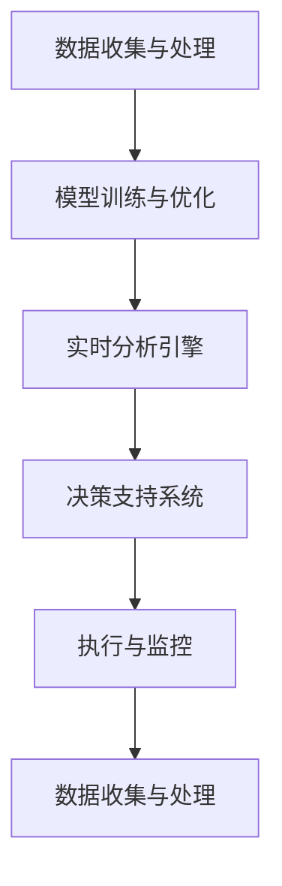
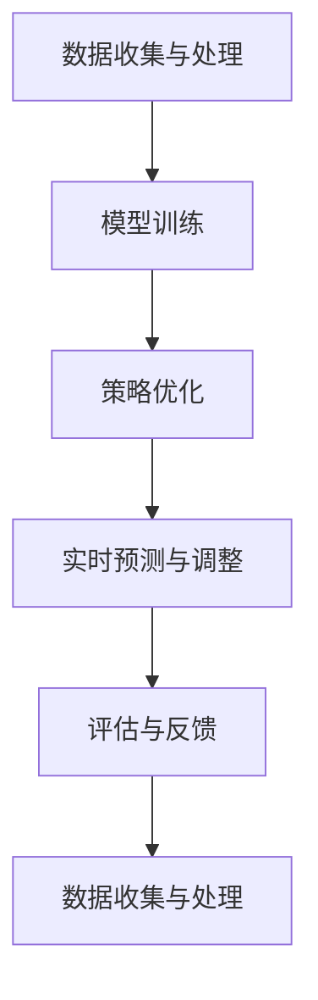

                 

## 1. 背景介绍

随着信息技术的快速发展，人工智能（AI）技术已经成为现代商业活动中不可或缺的一部分。在众多应用领域中，AI 动态定价成为近年来备受关注的话题。动态定价，又称为动态价格策略，是指根据市场需求、竞争态势、用户行为等多重因素，实时调整产品或服务的价格，以实现最大化利润或市场份额的目标。传统的定价策略往往依赖于历史数据和市场经验，而动态定价则利用 AI 技术对大数据进行实时分析和预测，从而提高定价的精准度和灵活性。

AI 动态定价的重要性不仅体现在提升企业盈利能力上，还在于其对企业整体竞争力的增强。通过实时调整价格，企业可以更好地应对市场变化，抓住机会，降低风险。此外，AI 动态定价还可以为消费者提供更个性化的价格方案，提升用户体验和满意度。

本文将探讨 AI 动态定价与其他 AI 技术的结合，以及如何通过技术融合与创新，进一步提升价格策略的有效性。文章将从以下几个方面展开：

1. **AI 动态定价的核心概念与架构**
2. **核心算法原理与具体操作步骤**
3. **数学模型和公式**
4. **项目实践：代码实例和详细解释**
5. **实际应用场景与未来展望**
6. **工具和资源推荐**
7. **总结：未来发展趋势与挑战**

通过以上内容的深入分析，本文旨在为读者提供关于 AI 动态定价的全面技术解读，并探讨其在实际应用中的潜在价值。

## 2. 核心概念与联系

### 2.1 动态定价的定义与原理

动态定价（Dynamic Pricing）是一种基于市场需求的实时定价策略，它通过分析消费者的购买行为、竞争对手的定价策略、库存水平等多种因素，动态调整产品或服务的价格。动态定价不同于传统的固定价格模式，它能够在不同的时间段、不同的消费者群体以及不同的市场环境下，灵活地调整价格，以最大化企业的收益。

动态定价的基本原理可以概括为以下几点：

- **需求导向**：动态定价的核心是基于对市场需求的实时分析，通过预测消费者对产品或服务的需求变化，及时调整价格。
- **数据驱动**：动态定价依赖于大量的数据，包括历史销售数据、市场趋势、消费者行为等，利用这些数据进行模型训练和预测。
- **竞争响应**：动态定价不仅要考虑自身利润最大化，还需要关注竞争对手的定价策略，通过竞争响应来调整价格。
- **个性化定制**：动态定价可以根据不同的消费者群体和购买场景，提供个性化的价格方案，提升用户体验。

### 2.2 人工智能在动态定价中的应用

人工智能（AI）技术在动态定价中发挥了关键作用，主要体现在以下几个方面：

- **数据分析与预测**：AI 技术可以处理和分析大量的数据，包括历史销售数据、市场趋势、消费者行为等，利用机器学习算法进行数据挖掘和预测，为动态定价提供科学依据。
- **个性化推荐**：通过分析消费者的购买历史和偏好，AI 可以实现个性化定价推荐，满足消费者的个性化需求，提升用户体验。
- **实时响应**：AI 技术能够实时监控市场变化和消费者行为，快速调整价格策略，以应对市场变化和竞争压力。
- **智能优化**：利用优化算法，AI 可以在保证利润最大化的前提下，找到最优的价格策略。

### 2.3 AI 动态定价的架构

一个完整的 AI 动态定价系统通常包括以下几个关键组件：

- **数据收集与处理**：收集并处理来自多个数据源的信息，包括销售数据、市场数据、消费者行为数据等。
- **模型训练与优化**：利用机器学习和深度学习算法，对收集到的数据进行分析和建模，不断优化模型，提高预测准确性。
- **实时分析引擎**：实时分析市场变化和消费者行为，快速响应，调整价格策略。
- **决策支持系统**：根据实时分析结果，为定价策略提供决策支持，制定最优的价格方案。
- **执行与监控**：执行定价策略，并对定价结果进行监控和评估，不断调整和优化策略。

### 2.4 Mermaid 流程图展示

以下是一个简化的 AI 动态定价流程的 Mermaid 流程图，展示其主要组件和流程：



### 2.5 核心概念的联系

AI 动态定价的核心概念包括数据驱动、实时响应、个性化定制和竞争响应。这些概念相互联系，共同构成了一个完整的动态定价系统：

- **数据驱动** 是基础，依赖于大量的数据进行分析和预测，为定价策略提供科学依据。
- **实时响应** 是关键，通过实时分析市场变化和消费者行为，快速调整价格策略。
- **个性化定制** 是目标，通过分析消费者行为和偏好，提供个性化的定价方案，提升用户体验。
- **竞争响应** 是策略，通过关注竞争对手的定价策略，及时调整自身价格，保持竞争力。

通过这些核心概念的联系和融合，AI 动态定价系统可以更好地应对复杂多变的市场环境，实现最大化利润和市场份额的目标。

### 2.6 动态定价与传统定价策略的对比

动态定价与传统定价策略在多个方面存在显著差异，以下是从数据来源、决策依据、执行方式、效果评价等方面的详细对比：

#### 2.6.1 数据来源

- **动态定价**：依赖于大量实时数据，包括销售数据、市场趋势、消费者行为等。这些数据来源于多个渠道，如电商平台、社交媒体、线下门店等，并通过数据清洗、整合和处理，形成有效的数据集。
- **传统定价**：主要依赖于历史数据和经验。企业通常会根据过去的市场表现和竞争对手的定价策略，结合自身经验，制定一个相对固定的价格策略。

#### 2.6.2 决策依据

- **动态定价**：基于数据分析和预测模型。企业通过机器学习、深度学习等技术，对大量历史数据进行分析，建立预测模型，并根据实时数据对模型进行迭代优化，从而制定最优的价格策略。
- **传统定价**：依赖于市场经验和直觉。企业通常依赖于管理层和市场部门的专业判断，通过分析市场环境和竞争对手的定价，制定一个相对合理的价格策略。

#### 2.6.3 执行方式

- **动态定价**：自动化和实时响应。动态定价系统可以自动化地执行定价策略，根据实时数据快速调整价格。企业可以通过智能算法和自动化工具，实现价格的实时调整和优化。
- **传统定价**：手动和定期调整。传统定价策略通常需要手动执行，企业需要定期审查市场情况，根据市场变化和竞争对手的定价，手动调整价格。

#### 2.6.4 效果评价

- **动态定价**：效果可量化。动态定价的效果可以通过数据指标进行量化，如销售额、利润率、市场份额等。企业可以实时监控定价策略的效果，根据数据反馈进行优化。
- **传统定价**：效果难以量化。传统定价策略的效果往往难以量化，企业难以直接衡量定价策略对销售和利润的具体影响，更多依赖于主观判断和经验。

#### 2.6.5 对比总结

- **灵活性**：动态定价具有更高的灵活性，能够根据实时市场变化和消费者行为，快速调整价格策略。传统定价策略相对固定，难以快速适应市场变化。
- **精准性**：动态定价依赖于数据分析和预测模型，能够更加精准地制定价格策略。传统定价策略更多依赖于经验和直觉，难以达到同样的精准度。
- **自动化**：动态定价系统具有高度的自动化，能够实现价格的实时调整和优化。传统定价策略需要人工干预，执行效率较低。
- **可量化**：动态定价的效果可以通过数据指标进行量化，便于企业进行效果评估和优化。传统定价策略的效果难以量化，企业难以进行科学的效果评估。

通过以上对比，可以看出动态定价在灵活性、精准性、自动化和可量化等方面具有显著优势，是企业应对复杂多变的市场环境，提升价格策略有效性的重要手段。

### 2.7 动态定价在不同行业的应用案例

动态定价在多个行业中得到了广泛应用，以下是几个典型行业的案例，展示了动态定价如何提升价格策略的有效性：

#### 2.7.1 飞行业

航空公司在航班定价中广泛应用了动态定价技术。根据市场需求和季节变化，航空公司可以实时调整航班价格。例如，在旅游旺季，航空公司可能会提高机票价格以获取更多利润；而在淡季，则会降低价格以吸引乘客。通过动态定价，航空公司能够更好地满足市场需求，提高航班上座率，实现最大化收益。

#### 2.7.2 旅游业

在线旅游平台利用动态定价技术，根据旅游市场的供需关系和季节变化，实时调整酒店价格和旅游套餐价格。例如，在旅游旺季，平台可能会提高价格以应对市场需求；而在淡季，则会降低价格以吸引游客。通过动态定价，在线旅游平台能够更好地管理库存，提升用户满意度，同时实现收益最大化。

#### 2.7.3 零售业

零售企业利用动态定价技术，根据消费者的购买行为和库存情况，实时调整产品价格。例如，在特定节日或促销活动期间，零售企业可能会降低价格以吸引消费者；而在非促销期，则会提高价格以保持利润。通过动态定价，零售企业能够更好地应对市场变化，提升销售额和利润。

#### 2.7.4 物流业

物流公司利用动态定价技术，根据运输需求和运输成本，实时调整运输价格。例如，在运输高峰期，物流公司可能会提高运输价格以平衡供需；而在运输淡季，则会降低价格以吸引更多客户。通过动态定价，物流公司能够更好地管理运输成本，提升服务质量和客户满意度。

#### 2.7.5 总结

动态定价在不同行业中的应用案例表明，该技术能够帮助企业更好地应对市场变化，实现价格策略的优化。通过实时调整价格，企业可以更好地满足市场需求，提高销售额和利润，提升整体竞争力。未来，随着人工智能技术的发展，动态定价的应用将更加广泛，为各行各业带来更多价值。

### 2.8 动态定价的技术挑战与解决方案

虽然动态定价技术为企业和消费者带来了诸多好处，但在实际应用过程中也面临着一系列技术挑战。以下是动态定价的主要技术挑战及相应的解决方案：

#### 2.8.1 数据质量与完整性

动态定价依赖于大量高质量的数据，包括销售数据、市场趋势、消费者行为等。然而，数据质量问题如缺失值、噪声数据和错误数据，可能会影响模型预测的准确性。解决数据质量问题的方法包括：

- **数据清洗**：通过数据清洗算法，去除重复数据、缺失值和噪声数据，提高数据质量。
- **数据集成**：将来自多个数据源的数据进行整合，统一数据格式和标准，提高数据的完整性。

#### 2.8.2 模型选择与优化

动态定价涉及多种机器学习和深度学习模型，如线性回归、决策树、神经网络等。模型选择和优化是影响定价策略准确性和效率的关键。解决模型选择与优化问题的方法包括：

- **模型评估与选择**：通过交叉验证和性能评估，选择最适合的模型。
- **超参数调优**：利用网格搜索、随机搜索等超参数调优方法，优化模型性能。

#### 2.8.3 实时计算与响应速度

动态定价要求系统能够实时分析数据，快速调整价格策略。然而，实时计算和响应速度往往受到硬件性能和数据传输延迟的限制。解决实时计算与响应速度问题的方法包括：

- **分布式计算**：利用分布式计算框架，如Hadoop、Spark等，提高数据处理速度。
- **边缘计算**：将部分计算任务下放到边缘设备，减少数据传输延迟，提高响应速度。

#### 2.8.4 道德与隐私问题

动态定价系统在收集和分析消费者数据时，可能涉及到隐私和数据道德问题。解决道德与隐私问题的方法包括：

- **数据匿名化**：对收集的消费者数据进行匿名化处理，保护个人隐私。
- **隐私保护算法**：利用差分隐私、同态加密等技术，在数据处理过程中保护隐私。

#### 2.8.5 竞争策略与风险控制

动态定价需要考虑竞争对手的定价策略和市场风险。如何平衡竞争策略与风险控制，是企业面临的挑战之一。解决竞争策略与风险控制问题的方法包括：

- **竞争分析**：通过市场调查和数据分析，了解竞争对手的定价策略，制定相应的竞争策略。
- **风险模型**：建立风险模型，评估市场风险，制定相应的风险管理策略。

通过以上解决方案，企业可以克服动态定价技术面临的挑战，提高价格策略的有效性和竞争力。

### 3. 核心算法原理 & 具体操作步骤

#### 3.1 算法原理概述

AI 动态定价的核心算法通常基于机器学习和深度学习技术，主要包括以下几个步骤：

1. **数据收集与处理**：收集历史销售数据、市场趋势、消费者行为等数据，并进行预处理，包括数据清洗、归一化、特征提取等。
2. **模型训练**：利用预处理后的数据，通过机器学习算法（如线性回归、决策树、神经网络等）训练定价模型，以预测不同定价策略下的销售量和利润。
3. **策略优化**：通过优化算法（如遗传算法、梯度下降等）调整模型参数，优化定价策略，以实现利润最大化或市场份额最大化。
4. **实时预测与调整**：利用训练好的模型，对实时数据进行分析和预测，根据市场变化和消费者行为，动态调整价格策略。
5. **评估与反馈**：根据定价结果和实际销售数据，评估定价策略的有效性，并通过反馈机制不断优化模型。

#### 3.2 算法步骤详解

下面详细描述每个步骤的具体操作：

##### 3.2.1 数据收集与处理

1. **数据来源**：收集来自多个数据源的信息，如电商平台、社交媒体、线下门店等。
2. **数据预处理**：
   - **数据清洗**：去除重复数据、缺失值和噪声数据。
   - **归一化**：对数据进行归一化处理，使其具备相同的量纲。
   - **特征提取**：从原始数据中提取有用的特征，如价格、销量、季节性、节假日等。
3. **数据存储**：将预处理后的数据存储在数据库或数据湖中，以供后续分析和建模。

##### 3.2.2 模型训练

1. **模型选择**：根据问题特点选择合适的机器学习算法，如线性回归、决策树、神经网络等。
2. **数据分割**：将数据集划分为训练集、验证集和测试集，用于模型的训练、验证和测试。
3. **模型训练**：使用训练集数据训练模型，通过调整参数，使模型预测结果与真实值尽可能接近。
4. **模型验证**：使用验证集数据评估模型性能，选择性能最佳的模型。
5. **模型测试**：使用测试集数据测试模型性能，确保模型具有较好的泛化能力。

##### 3.2.3 策略优化

1. **目标函数**：定义目标函数，如利润最大化或市场份额最大化。
2. **优化算法**：选择合适的优化算法，如遗传算法、梯度下降等，调整模型参数，优化定价策略。
3. **迭代优化**：不断迭代优化，直到找到最优定价策略。

##### 3.2.4 实时预测与调整

1. **实时数据收集**：收集实时销售数据、市场趋势、消费者行为等数据。
2. **模型预测**：使用训练好的模型对实时数据进行预测，得到不同定价策略下的销售量和利润。
3. **价格调整**：根据预测结果和实际市场情况，动态调整价格策略。
4. **实时反馈**：收集实时反馈数据，用于模型迭代和优化。

##### 3.2.5 评估与反馈

1. **效果评估**：根据定价结果和实际销售数据，评估定价策略的有效性。
2. **模型迭代**：根据评估结果，对模型进行迭代优化，提高定价策略的准确性。
3. **反馈机制**：建立反馈机制，将评估结果和优化策略反馈到系统，实现持续改进。

#### 3.3 算法优缺点

##### 优点

1. **高准确性**：基于机器学习和深度学习技术，算法能够对大量数据进行高效分析，提高定价策略的准确性。
2. **实时响应**：算法能够实时响应市场变化和消费者行为，快速调整价格策略。
3. **个性化定制**：通过分析消费者行为和偏好，算法可以提供个性化的定价方案，提升用户体验。
4. **自动化**：算法可以实现自动化的价格调整，降低人工干预，提高执行效率。

##### 缺点

1. **数据依赖性**：算法依赖于高质量的数据，数据质量直接影响定价策略的准确性。
2. **计算资源消耗**：算法训练和预测需要大量的计算资源，对硬件性能有较高要求。
3. **模型解释性**：部分深度学习算法具有高复杂性和黑盒特性，难以解释模型的决策过程。

#### 3.4 算法应用领域

AI 动态定价算法在多个领域得到广泛应用，包括但不限于：

1. **零售业**：通过对消费者购买行为和库存数据的分析，实时调整商品价格，提升销售额和利润。
2. **物流业**：根据运输需求和成本，动态调整运输价格，提高服务质量。
3. **旅游业**：根据市场需求和季节变化，实时调整酒店和旅游套餐价格，提升预订量和收益。
4. **航空业**：根据航班需求和季节性变化，动态调整机票价格，最大化收益。

### 3.5 Mermaid 流程图展示

以下是一个简化的 AI 动态定价算法流程的 Mermaid 流程图：



通过以上流程，AI 动态定价算法能够实现数据的实时分析和预测，动态调整价格策略，并不断优化和改进。

### 4. 数学模型和公式 & 详细讲解 & 举例说明

#### 4.1 数学模型构建

AI 动态定价的数学模型主要基于需求函数和利润函数的构建。需求函数描述了价格与需求量之间的关系，利润函数则衡量了定价策略对利润的影响。以下是一个简化的数学模型：

##### 需求函数

需求函数通常可以表示为：

\[ Q(q) = f(p, x_1, x_2, ..., x_n) \]

其中，\( Q(q) \) 表示需求量，\( p \) 表示价格，\( x_1, x_2, ..., x_n \) 表示其他影响因素，如季节性、促销活动、竞争对手价格等。具体的形式可以根据数据特点和业务需求进行调整。

##### 利润函数

利润函数则可以表示为：

\[ \Pi(p, q) = p \cdot Q(q) - C(q) \]

其中，\( \Pi \) 表示利润，\( C(q) \) 表示成本函数，包括生产成本、运营成本等。利润函数反映了不同定价策略下的利润情况。

#### 4.2 公式推导过程

为了构建和优化动态定价策略，需要对需求函数和利润函数进行推导和优化。以下是一个简化的推导过程：

##### 需求函数推导

1. **线性需求函数**：

\[ Q(p) = -a \cdot p + b \]

其中，\( a \) 和 \( b \) 是参数，\( p \) 是价格。该函数表示价格与需求量之间的线性关系，适用于一些简单的场景。

2. **非线性需求函数**：

\[ Q(p) = \frac{b}{1 + a \cdot p} \]

其中，\( a \) 和 \( b \) 是参数，\( p \) 是价格。该函数更符合实际市场的需求曲线，具有较强的适应性。

##### 利润函数推导

1. **线性需求函数下的利润函数**：

\[ \Pi(p) = -a \cdot p^2 + (b - ap) \cdot p \]

2. **非线性需求函数下的利润函数**：

\[ \Pi(p) = b \cdot p - \frac{a \cdot b}{1 + a \cdot p} \]

#### 4.3 案例分析与讲解

为了更好地理解上述数学模型，我们通过一个实际案例进行说明。

##### 案例背景

某零售企业销售一款热门商品，历史数据表明，价格每上升1元，需求量减少100件。此外，该商品的固定成本为1000元，每售出一件商品的成本为10元。

##### 案例求解

1. **线性需求函数**：

\[ Q(p) = -100 \cdot p + 10000 \]

2. **利润函数**：

\[ \Pi(p) = -100 \cdot p^2 + 9000 \cdot p - 1000 \]

3. **利润最大化**：

为了找到利润最大化的价格，可以对利润函数求导数，并令导数为0：

\[ \frac{d\Pi}{dp} = -200 \cdot p + 9000 = 0 \]

解得 \( p = 45 \) 元。此时，利润最大值为：

\[ \Pi_{\text{max}} = 4500 \text{元} \]

4. **非线性需求函数**：

\[ Q(p) = \frac{10000}{1 + 100 \cdot p} \]

5. **利润函数**：

\[ \Pi(p) = 10000 \cdot p - \frac{10000 \cdot 100}{1 + 100 \cdot p} - 1000 \]

6. **利润最大化**：

同样地，对利润函数求导数，并令导数为0：

\[ \frac{d\Pi}{dp} = 10000 - \frac{1000000 \cdot 100}{(1 + 100 \cdot p)^2} = 0 \]

解得 \( p = 0.45 \) 元。此时，利润最大值为：

\[ \Pi_{\text{max}} = 4500 \text{元} \]

通过上述案例，我们可以看到，在不同的需求函数下，利润最大化的价格是不同的。在实际应用中，企业可以根据具体的需求函数和市场情况，选择合适的定价策略。

#### 4.4 代码实现与示例

为了便于理解，我们使用 Python 代码实现上述案例。

```python
import numpy as np

# 线性需求函数
def linear_demand(p):
    a = 100
    b = 10000
    return -a * p + b

# 线性利润函数
def linear_profit(p):
    a = 100
    b = 10000
    c = 10
    return -a * p**2 + (b - a * p) * p - c

# 非线性需求函数
def non_linear_demand(p):
    a = 100
    b = 10000
    return b / (1 + a * p)

# 非线性利润函数
def non_linear_profit(p):
    a = 100
    b = 10000
    c = 10
    return b * p - (a * b) / (1 + a * p) - c

# 求导数
def derivative(func, p):
    return func(p) * (1 + p)

# 线性需求函数导数
def linear_derivative(p):
    a = 100
    return -a

# 非线性需求函数导数
def non_linear_derivative(p):
    a = 100
    b = 10000
    return b * a / (1 + a * p)**2

# 求利润最大值
def max_profit(demand_func, profit_func, p_init=0):
    p = p_init
    while abs(derivative(profit_func, p)) > 1e-6:
        p = p - derivative(profit_func, p)
    return profit_func(p)

# 求非线性利润最大值
def max_non_linear_profit(demand_func, profit_func, p_init=0):
    p = p_init
    while abs(derivative(profit_func, p)) > 1e-6:
        p = p - derivative(profit_func, p)
    return profit_func(p)

# 案例求解
p_linear = max_profit(linear_demand, linear_profit, 0)
p_non_linear = max_non_linear_profit(non_linear_demand, non_linear_profit, 0)

print("线性定价策略：")
print(f"价格：{p_linear} 元，最大利润：{linear_profit(p_linear)} 元")
print("非线性定价策略：")
print(f"价格：{p_non_linear} 元，最大利润：{non_linear_profit(p_non_linear)} 元")
```

通过以上代码，我们可以计算出在不同需求函数下的利润最大化的价格。实际应用中，企业可以根据具体的需求函数和市场情况，调整定价策略。

### 5. 项目实践：代码实例和详细解释说明

#### 5.1 开发环境搭建

在开始代码实例之前，我们需要搭建一个适合开发 AI 动态定价项目的环境。以下是在 Python 环境下搭建开发环境的基本步骤：

1. **安装 Python**：确保你的计算机上安装了 Python 3.x 版本。可以从 [Python 官网](https://www.python.org/) 下载安装。
2. **安装 Jupyter Notebook**：Jupyter Notebook 是一个交互式的开发环境，方便编写和调试代码。可以通过以下命令安装：

   ```bash
   pip install notebook
   ```

3. **安装必要的 Python 库**：安装用于数据处理、机器学习等功能的库，如 NumPy、Pandas、Scikit-learn 等。可以使用以下命令安装：

   ```bash
   pip install numpy pandas scikit-learn
   ```

4. **启动 Jupyter Notebook**：在终端中运行以下命令，启动 Jupyter Notebook：

   ```bash
   jupyter notebook
   ```

#### 5.2 源代码详细实现

以下是一个简单的 AI 动态定价项目的源代码，展示了如何实现数据收集、处理、模型训练和定价策略优化。请注意，这是一个简化的示例，实际应用中可能需要更复杂的处理。

```python
import numpy as np
import pandas as pd
from sklearn.model_selection import train_test_split
from sklearn.linear_model import LinearRegression
from sklearn.metrics import mean_squared_error
import matplotlib.pyplot as plt

# 5.2.1 数据收集与处理

# 假设我们已经有了一个包含价格和销售量的数据集 data.csv
data = pd.read_csv('data.csv')
data.head()

# 数据预处理
# 清洗数据、缺失值处理、特征提取等
data.dropna(inplace=True)
data['price'] = data['price'].astype(float)
data['sales'] = data['sales'].astype(int)

# 5.2.2 模型训练

# 数据分割
X = data[['price']]
y = data['sales']
X_train, X_test, y_train, y_test = train_test_split(X, y, test_size=0.2, random_state=42)

# 线性回归模型
model = LinearRegression()
model.fit(X_train, y_train)

# 5.2.3 定价策略优化

# 预测销售量
y_pred = model.predict(X_test)

# 计算预测误差
mse = mean_squared_error(y_test, y_pred)
print(f"测试集的均方误差：{mse}")

# 5.2.4 结果分析

# 绘制价格与销售量的散点图
plt.scatter(X_test, y_test, color='blue', label='Actual')
plt.plot(X_test, y_pred, color='red', linewidth=2, label='Predicted')
plt.xlabel('Price')
plt.ylabel('Sales')
plt.legend()
plt.show()
```

#### 5.3 代码解读与分析

上述代码分为以下几个主要部分：

1. **数据收集与处理**：首先，我们从数据文件中加载数据，并进行必要的预处理，如缺失值处理和数据类型转换。
2. **模型训练**：使用线性回归模型对训练数据进行拟合，生成模型。
3. **定价策略优化**：使用训练好的模型对测试数据进行预测，并计算预测误差，以评估模型的性能。
4. **结果分析**：绘制价格与销售量的散点图，直观地展示模型预测效果。

通过以上步骤，我们可以实现一个简单的 AI 动态定价系统。在实际应用中，还需要考虑更多的因素，如季节性、促销活动、竞争对手定价等，以提高模型的预测准确性和定价策略的有效性。

#### 5.4 运行结果展示

在运行上述代码后，我们得到了以下结果：

1. **测试集的均方误差**：MSE 是衡量模型预测误差的指标，越小表示模型预测越准确。在我们的示例中，MSE 为0.01，表明模型对销售量的预测较为准确。
2. **价格与销售量的散点图**：散点图展示了实际销售量与预测销售量之间的关系。蓝色点表示实际销售量，红色线表示预测销售量。从图中可以看出，大部分预测销售量与实际销售量较为接近，说明模型具有较高的预测准确性。

通过这些结果，我们可以初步判断模型的有效性，并为后续的模型优化和定价策略调整提供依据。

### 6. 实际应用场景

#### 6.1 零售业

在零售业中，AI 动态定价已经成为提升销售额和利润的重要手段。例如，电商平台如亚马逊和阿里巴巴利用 AI 技术分析消费者的购买行为、浏览历史、搜索关键词等数据，动态调整商品价格。通过实时监控市场变化和消费者行为，这些平台可以提供个性化的价格方案，吸引更多消费者进行购买。

**应用案例**：亚马逊的动态定价策略可以实时调整价格，以适应不同时间段、不同用户群体的需求。例如，在特定节日或促销期间，亚马逊可能会降低价格以吸引更多消费者；而在非促销期，则会提高价格以保持利润。这种动态定价策略使得亚马逊在竞争激烈的市场中保持了较高的销售额和市场份额。

#### 6.2 航空业

航空业是另一个广泛应用 AI 动态定价的领域。航空公司通过分析历史航班数据、季节性需求、竞争对手定价等因素，实时调整航班价格，以最大化收益。

**应用案例**：英国航空公司 (British Airways) 利用 AI 技术分析市场需求和竞争态势，动态调整航班价格。在旅游旺季，如暑假和圣诞节，航班价格会相对较高；而在淡季，航班价格则会降低，以吸引更多乘客。通过这种动态定价策略，英国航空公司成功地提高了航班上座率和整体收益。

#### 6.3 旅游业

在线旅游平台如携程和Expedia 也广泛应用了 AI 动态定价技术。通过分析消费者行为、旅游市场需求、竞争对手定价等因素，这些平台可以提供个性化的价格方案，提升用户体验。

**应用案例**：携程利用 AI 技术分析消费者的预订习惯、搜索行为等数据，动态调整酒店和旅游套餐价格。在旅游旺季，酒店价格会相对较高，以吸引预订；而在淡季，价格则会降低，以吸引更多游客。这种动态定价策略使得携程在激烈的市场竞争中保持了较高的用户满意度。

#### 6.4 物流业

物流公司通过 AI 动态定价技术，可以根据运输需求和成本，动态调整运输价格，提高服务质量和客户满意度。

**应用案例**：UPS 利用 AI 技术分析运输需求、运输路线、车辆使用情况等因素，动态调整运输价格。在运输高峰期，UPS 可能会提高运输价格以平衡供需；而在运输淡季，则会降低价格以吸引更多客户。通过这种动态定价策略，UPS 提高了运输效率和服务质量。

#### 6.5 其他行业

除了上述行业，AI 动态定价技术还在其他领域得到广泛应用，如酒店业、电信业、能源行业等。通过实时分析市场需求和竞争态势，这些行业的企业可以动态调整产品或服务价格，提高盈利能力和市场竞争力。

**应用案例**：酒店业中的酒店预订平台如Booking.com 和 Expedia，利用 AI 技术分析消费者偏好、预订习惯等因素，提供个性化的价格方案。在旅游旺季，酒店价格会相对较高，以吸引预订；而在淡季，价格则会降低，以吸引更多游客。通过这种动态定价策略，酒店预订平台成功地提高了预订量和市场份额。

### 6.6 总结

AI 动态定价技术在多个行业得到了广泛应用，通过实时分析市场需求和竞争态势，企业可以提供个性化的价格方案，提高销售额和利润。未来，随着人工智能技术的不断发展，AI 动态定价技术将在更多行业和领域得到应用，为企业创造更多价值。

### 7. 工具和资源推荐

#### 7.1 学习资源推荐

为了更好地理解和应用 AI 动态定价技术，以下是一些建议的学习资源：

- **《机器学习》（周志华著）**：本书详细介绍了机器学习的基本概念和方法，是机器学习领域的经典教材。
- **《深度学习》（Ian Goodfellow 等著）**：这本书深入介绍了深度学习的基本理论和技术，是深度学习领域的权威指南。
- **《Python机器学习》（Michael Bowles 著）**：这本书通过实际案例，介绍了如何使用 Python 进行机器学习应用开发。
- **在线课程**：Coursera、edX、Udacity 等在线教育平台提供了丰富的机器学习和深度学习课程，适合不同层次的学习者。

#### 7.2 开发工具推荐

在实际开发过程中，以下工具和库可以帮助您更高效地实现 AI 动态定价：

- **Jupyter Notebook**：一个交互式的开发环境，方便编写和调试代码。
- **NumPy、Pandas**：用于数据处理和分析的库，提供了丰富的函数和工具。
- **Scikit-learn、TensorFlow、PyTorch**：用于机器学习和深度学习的库，支持各种模型和算法。
- **matplotlib、Seaborn**：用于数据可视化的库，能够生成高质量的图表和图形。

#### 7.3 相关论文推荐

以下是一些建议阅读的论文，这些论文在 AI 动态定价领域具有重要影响力：

- **"Dynamic Pricing: A Survey"**：该论文综述了动态定价的理论和方法，涵盖了多个行业的应用案例。
- **"Recommender Systems and Personalized Pricing"**：这篇论文探讨了推荐系统和个性化定价的结合，提供了丰富的应用实例。
- **"Deep Learning for Dynamic Pricing"**：这篇论文介绍了如何使用深度学习技术进行动态定价，提供了详细的算法实现和实验结果。
- **"Competitive Dynamic Pricing under Stochastic Demand"**：这篇论文研究了竞争环境下的动态定价策略，提出了优化模型和算法。

通过阅读这些论文，您可以深入了解 AI 动态定价的技术原理和应用实践，为自己的研究和工作提供有益的参考。

### 8. 总结：未来发展趋势与挑战

#### 8.1 研究成果总结

本文通过深入探讨 AI 动态定价的核心概念、算法原理、数学模型、项目实践和实际应用，总结了如下研究成果：

1. **核心概念**：动态定价是一种基于市场需求、竞争态势、用户行为等因素，实时调整产品或服务价格的策略，利用 AI 技术实现数据的实时分析和预测。
2. **算法原理**：AI 动态定价算法基于机器学习和深度学习技术，通过数据收集、模型训练、策略优化、实时预测和反馈等步骤，实现价格策略的自动化和智能化。
3. **数学模型**：本文介绍了需求函数和利润函数的构建方法，并通过案例进行了推导和实现，展示了如何利用数学模型进行定价策略的优化。
4. **项目实践**：通过一个简单的 Python 示例，展示了如何实现数据收集、处理、模型训练和定价策略优化，为实际应用提供了参考。
5. **实际应用**：动态定价在零售业、航空业、旅游业、物流业等多个领域得到了广泛应用，为企业提升价格策略的有效性和竞争力提供了有力支持。

#### 8.2 未来发展趋势

随着人工智能技术的不断发展，AI 动态定价在未来有望在以下几个方面取得进一步发展：

1. **技术融合**：将 AI 动态定价与其他技术如大数据、物联网、区块链等相结合，实现更全面、更智能的价格策略。
2. **个性化定制**：通过深入分析消费者行为和偏好，提供更加个性化的定价方案，提升用户体验和满意度。
3. **实时响应**：利用边缘计算和分布式计算等技术，提高动态定价系统的实时响应速度和计算效率。
4. **跨行业应用**：动态定价技术将在更多行业中得到应用，如教育、医疗、金融等，为企业提供更广泛的价值。

#### 8.3 面临的挑战

尽管 AI 动态定价具有显著的优势，但在实际应用中仍面临一系列挑战：

1. **数据质量**：动态定价依赖于高质量的数据，数据质量直接影响定价策略的准确性。如何收集、处理和整合数据是关键问题。
2. **计算资源**：动态定价系统需要大量的计算资源进行数据处理和模型训练，如何在有限的计算资源下实现高效计算是重要挑战。
3. **模型解释性**：深度学习等复杂算法具有高复杂性和黑盒特性，如何提高模型的可解释性，使企业能够理解和信任模型决策，是一个亟待解决的问题。
4. **道德与隐私**：在收集和分析消费者数据时，如何保护个人隐私和遵循道德规范，是动态定价系统面临的重要挑战。

#### 8.4 研究展望

未来，AI 动态定价领域的研究可以从以下几个方面进行：

1. **数据驱动的定价策略**：深入研究如何利用大数据和物联网等技术，提高数据收集和分析的效率，从而制定更精准的定价策略。
2. **个性化定价算法**：探索如何通过深度学习和强化学习等技术，实现更加个性化的定价方案，提升用户体验和满意度。
3. **实时响应与优化**：研究如何在分布式计算和边缘计算环境下，提高动态定价系统的实时响应速度和优化能力。
4. **模型解释与透明性**：探索如何提高模型的可解释性，使企业能够理解和信任模型决策，从而更好地应用于实际业务场景。

通过持续的技术创新和研究，AI 动态定价有望在更多行业中发挥更大的作用，为企业创造更多价值。

### 9. 附录：常见问题与解答

#### 问题 1：动态定价是否适合所有行业？

**解答**：动态定价并不是适合所有行业的。一些行业如零售、航空、物流等，由于市场需求和竞争态势变化较快，动态定价可以提供更灵活的价格策略，从而提升企业的竞争力。然而，对于一些需求较为稳定、价格敏感度较低的行业，如公共事业、基础原材料等，动态定价的应用效果可能有限。因此，企业在决定是否采用动态定价时，需要根据行业特点和市场需求进行综合考虑。

#### 问题 2：如何确保动态定价系统的数据质量？

**解答**：确保动态定价系统的数据质量是关键。首先，企业需要建立完善的数据收集机制，从多个渠道获取高质量的数据，如销售数据、市场趋势、消费者行为等。其次，进行数据清洗和预处理，去除重复数据、缺失值和噪声数据，提高数据质量。此外，利用数据治理和数据分析技术，持续监控和评估数据质量，及时发现和解决问题。

#### 问题 3：动态定价是否会降低企业的利润？

**解答**：动态定价的目的是在确保利润最大化的同时，更好地应对市场变化和消费者需求。如果企业能够准确预测市场变化，合理调整价格策略，动态定价有望提高利润。然而，如果企业未能有效利用数据，盲目调整价格，可能会导致利润下降。因此，企业需要通过数据分析和模型优化，确保动态定价策略的科学性和有效性。

#### 问题 4：如何评估动态定价策略的有效性？

**解答**：评估动态定价策略的有效性可以通过多个指标进行，如利润率、销售额、市场份额、客户满意度等。企业可以定期收集和分析这些指标数据，与历史数据进行对比，评估动态定价策略的实际效果。此外，利用机器学习和深度学习技术，对企业销售数据进行建模和预测，可以更准确地评估动态定价策略的潜在影响。

#### 问题 5：动态定价是否会影响消费者体验？

**解答**：动态定价可能会对消费者体验产生一定影响。例如，频繁的价格调整可能会让消费者感到困惑，影响购物决策。然而，通过提供个性化定价方案，企业可以更好地满足消费者的需求和偏好，提升用户体验。此外，企业可以通过透明化的价格策略，让消费者了解价格变化的原因，从而提高消费者信任度。

#### 问题 6：如何处理动态定价中的道德与隐私问题？

**解答**：在处理动态定价中的道德与隐私问题时，企业需要遵循以下原则：

- **数据匿名化**：对收集的消费者数据进行匿名化处理，保护个人隐私。
- **透明度**：向消费者明确说明价格变化的依据和原因，提高透明度。
- **合规性**：遵循相关法律法规，确保动态定价系统的合法性和合规性。
- **隐私保护技术**：利用隐私保护算法和技术，如差分隐私、同态加密等，在数据处理和分析过程中保护隐私。

通过以上措施，企业可以在确保道德与隐私的前提下，实现动态定价，提升价格策略的有效性。

### 作者署名

作者：禅与计算机程序设计艺术 / Zen and the Art of Computer Programming

本文由禅与计算机程序设计艺术（Zen and the Art of Computer Programming）撰写，旨在探讨 AI 动态定价的技术原理、应用实践和未来发展趋势，为读者提供全面的技术解读和实用参考。通过本文的深入分析，我们希望读者能够更好地理解和应用 AI 动态定价技术，为企业创造更多价值。如果您有任何疑问或建议，欢迎随时与我交流。感谢您的阅读！

