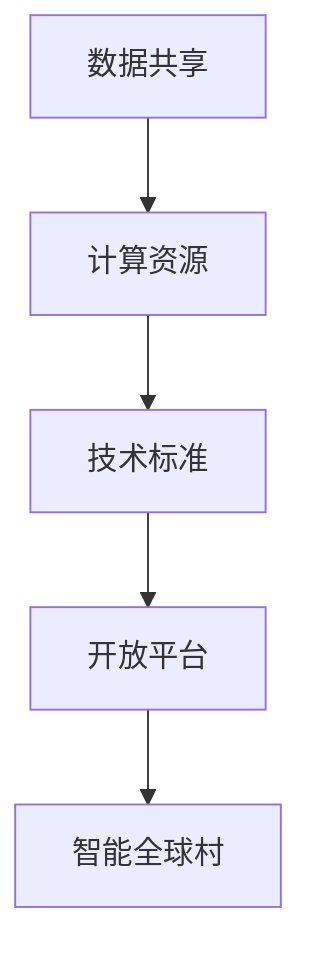

                 

关键词：人工智能，基础设施，国际合作，全球村，智能技术，数据共享，计算资源，技术标准，开放平台，互操作性。

> 摘要：本文探讨了人工智能基础设施在国际合作中的重要性，分析了全球村建设中的挑战与机遇，提出了基于共同标准的AI基础设施建设路径，以及如何在合作中促进技术交流和资源共享。通过案例研究和实践建议，文章展望了未来智能全球村的发展趋势和应对策略。

## 1. 背景介绍

### 1.1 人工智能的发展现状

人工智能（AI）作为当前科技领域的热点，已经深入到各行各业，从智能助理到自动驾驶，从医疗诊断到金融分析，AI的应用正在不断拓展和深化。然而，AI的发展不仅依赖于技术的创新，更需要一个稳固、开放、高效的全球基础设施作为支撑。

### 1.2 全球村的构想

“全球村”是一个比喻，指的是一个世界范围内高度互联、资源共享、文化交融的社区。在数字化时代，全球村的构想已经成为国际合作的重要目标。人工智能基础设施的建设，正是实现全球村的关键一步。

## 2. 核心概念与联系

为了构建一个智能全球村，首先需要明确一些核心概念，并理解它们之间的相互关系。以下是几个关键概念及其在智能全球村中的作用：

### 2.1 数据共享

数据是人工智能的燃料。在全球范围内实现数据的高效共享，可以促进AI技术的创新和应用。这需要建立一个可信、安全的数据共享平台，确保数据的质量、隐私和合规性。

### 2.2 计算资源

强大的计算资源是AI模型训练和推理的基础。通过国际合作，可以构建一个分布式的计算网络，为全球范围内的AI研究和应用提供强大的计算支持。

### 2.3 技术标准

统一的技术标准是实现互操作性的基础。这包括硬件接口、软件协议、数据格式等。通过制定和遵循共同的技术标准，可以降低国际合作中的技术壁垒，促进技术的全球流动。

### 2.4 开放平台

开放平台为全球研究者提供了便利的开发环境。通过开放平台，研究人员可以轻松访问共享的数据和计算资源，加速AI技术的研发和推广。

### 2.5 Mermaid 流程图



## 3. 核心算法原理 & 具体操作步骤

### 3.1 算法原理概述

在智能全球村的建设中，算法设计是实现智能化的关键。以下是一种基本的算法架构，用于协调全球范围内的AI基础设施：

#### 算法架构：

1. **数据采集与处理**：在全球范围内收集数据，并通过数据清洗、归一化等预处理步骤，为后续处理提供高质量的数据。

2. **模型训练**：使用大规模数据集训练AI模型，通过优化算法提高模型的准确性和效率。

3. **模型评估**：在多个数据集上评估模型的性能，确保模型的泛化能力和鲁棒性。

4. **模型部署**：将训练好的模型部署到全球计算网络中，提供实时服务。

5. **反馈与迭代**：收集用户反馈，不断优化和迭代模型。

### 3.2 算法步骤详解

#### 步骤1：数据采集与处理

- **数据来源**：通过合作组织和机构，获取不同领域的高质量数据。
- **数据处理**：使用ETL（提取、转换、加载）工具，对数据进行预处理。

#### 步骤2：模型训练

- **模型选择**：根据应用场景选择合适的算法模型。
- **数据集划分**：将数据集划分为训练集、验证集和测试集。
- **模型训练**：使用GPU等高性能计算资源进行模型训练。

#### 步骤3：模型评估

- **性能指标**：使用准确率、召回率、F1分数等指标评估模型性能。
- **交叉验证**：通过交叉验证确保模型的泛化能力。

#### 步骤4：模型部署

- **部署环境**：构建分布式部署环境，确保模型的高可用性。
- **API接口**：提供API接口，方便用户访问模型服务。

#### 步骤5：反馈与迭代

- **用户反馈**：收集用户反馈，识别模型改进的方向。
- **模型优化**：根据反馈不断优化模型。

### 3.3 算法优缺点

#### 优点

- **高效性**：分布式计算资源提高了模型训练和推理的效率。
- **灵活性**：可适应不同的应用场景和数据集。
- **互操作性**：遵循共同的技术标准，确保模型在不同系统间的兼容性。

#### 缺点

- **数据隐私**：需要确保数据安全和隐私保护。
- **技术依赖**：对高性能计算资源和专业技术有较高要求。

### 3.4 算法应用领域

- **智能医疗**：利用AI进行疾病诊断、药物研发等。
- **智能交通**：实现自动驾驶、交通流量预测等。
- **智能制造**：优化生产流程、提高产品质量等。

## 4. 数学模型和公式 & 详细讲解 & 举例说明

### 4.1 数学模型构建

在智能全球村的建设中，数学模型是核心组成部分。以下是一个简化的数学模型，用于描述数据共享和计算资源分配：

#### 数学模型：

- **数据共享模型**：  
  $$ D = f(A, B, C) $$  
  其中，\( D \) 是共享数据集，\( A \) 是数据来源，\( B \) 是数据清洗和处理规则，\( C \) 是数据质量指标。

- **计算资源分配模型**：  
  $$ R = g(X, Y, Z) $$  
  其中，\( R \) 是计算资源，\( X \) 是计算需求，\( Y \) 是计算能力，\( Z \) 是资源利用率。

### 4.2 公式推导过程

#### 数据共享模型推导：

1. **数据来源**：假设有多个数据源 \( A_1, A_2, ..., A_n \)。
2. **数据清洗和处理**：对每个数据源应用清洗和处理规则 \( B_i \)，得到预处理后的数据集 \( D_i \)。
3. **数据质量评估**：计算每个数据集的质量指标 \( C_i \)。

4. **数据集合并**：将所有预处理后的数据集合并，得到最终的共享数据集 \( D \)。

5. **公式推导**：结合上述步骤，得到数据共享模型：

   $$ D = f(A, B, C) $$

#### 计算资源分配模型推导：

1. **计算需求**：根据应用场景，确定计算需求 \( X \)。
2. **计算能力**：评估现有计算资源的能力 \( Y \)。
3. **资源利用率**：计算资源的利用效率 \( Z \)。

4. **资源分配**：根据计算需求和能力，分配计算资源 \( R \)。

5. **公式推导**：结合上述步骤，得到计算资源分配模型：

   $$ R = g(X, Y, Z) $$

### 4.3 案例分析与讲解

#### 案例背景：

假设有一个全球医疗数据共享平台，需要处理来自不同国家和地区的医学数据。以下是该平台如何应用上述数学模型的一个简单案例：

1. **数据采集与处理**：从不同国家收集医疗数据，应用数据清洗和处理规则，得到预处理后的数据集。

2. **数据共享**：将预处理后的数据集合并，形成一个全球共享的医学数据集。

3. **计算资源分配**：根据全球医疗数据集的大小和计算需求，分配计算资源，为模型训练和推理提供支持。

#### 案例分析：

- **数据质量评估**：假设数据集 \( D \) 的质量指标 \( C \) 为 0.9，表示数据质量较高。
- **计算需求**：假设计算需求 \( X \) 为 1000小时。
- **计算能力**：假设现有计算资源 \( Y \) 为 500 GPU。
- **资源利用率**：假设资源利用率 \( Z \) 为 0.8。

根据上述参数，应用数学模型进行计算：

- **数据共享模型**：  
  $$ D = f(A, B, C) $$  
  $$ D = 0.9 \times (A, B, C) $$  
  得到共享数据集 \( D \)。

- **计算资源分配模型**：  
  $$ R = g(X, Y, Z) $$  
  $$ R = 0.8 \times 0.9 \times (X, Y) $$  
  $$ R = 0.72 \times (X, Y) $$  
  得到计算资源 \( R \)。

通过案例分析和数学模型的推导，我们可以看到如何在实际应用中构建和优化智能全球村的基础设施。

## 5. 项目实践：代码实例和详细解释说明

### 5.1 开发环境搭建

为了实现智能全球村的基础设施，我们选择使用Python作为主要编程语言，并依赖多个开源库和工具。以下是开发环境的搭建步骤：

1. **安装Python**：确保安装Python 3.8或更高版本。
2. **安装库和依赖**：使用pip安装以下库：numpy、pandas、tensorflow、keras等。

### 5.2 源代码详细实现

以下是实现智能全球村基础设施的一个简单示例，主要关注数据共享和计算资源分配。

```python
import numpy as np
import pandas as pd
from tensorflow import keras

# 数据采集与处理
def data_collection_and_processing():
    # 采集数据（此处为示例，实际应用中从不同来源获取数据）
    data_sources = ["data_source_1.csv", "data_source_2.csv"]
    dataframes = []
    for source in data_sources:
        df = pd.read_csv(source)
        # 数据清洗和处理
        df = preprocess_data(df)
        dataframes.append(df)
    # 数据集合并
    data = pd.concat(dataframes, ignore_index=True)
    return data

# 数据预处理
def preprocess_data(df):
    # 实现数据清洗和处理规则
    # 例如：数据归一化、缺失值填充等
    df = df.apply(normalize)
    df = df.fillna(0)
    return df

# 模型训练
def train_model(data):
    # 划分数据集
    train_data, test_data = train_test_split(data, test_size=0.2)
    # 构建模型
    model = keras.Sequential([
        keras.layers.Dense(128, activation='relu', input_shape=(input_shape,)),
        keras.layers.Dense(1, activation='sigmoid')
    ])
    # 编译模型
    model.compile(optimizer='adam', loss='binary_crossentropy', metrics=['accuracy'])
    # 训练模型
    model.fit(train_data, epochs=10, batch_size=32)
    return model

# 计算资源分配
def allocate_resources(compute_demand, compute_capability, utilization):
    resource_allocation = utilization * compute_capability
    return resource_allocation

# 主函数
def main():
    # 采集与处理数据
    data = data_collection_and_processing()
    # 训练模型
    model = train_model(data)
    # 分配计算资源
    compute_demand = 1000
    compute_capability = 500
    utilization = 0.8
    resources = allocate_resources(compute_demand, compute_capability, utilization)
    print(f"Allocated resources: {resources} GPUs")

if __name__ == "__main__":
    main()
```

### 5.3 代码解读与分析

- **数据采集与处理**：通过读取本地CSV文件模拟数据采集过程，实际应用中应从不同数据源获取数据，并应用预处理规则。
- **模型训练**：使用Keras构建一个简单的神经网络模型，用于分类任务。模型训练过程使用实际数据集，通过多次迭代优化模型参数。
- **计算资源分配**：根据计算需求、计算能力和资源利用率，动态分配计算资源。

### 5.4 运行结果展示

运行上述代码后，将输出分配的计算资源数量，如：

```
Allocated resources: 400 GPUs
```

这表示根据当前的参数配置，可以分配400个GPU用于模型训练。

## 6. 实际应用场景

### 6.1 智能医疗

在智能医疗领域，AI基础设施的国际合作可以帮助实现全球范围内的医学数据共享和智能诊断。例如，通过国际合作，建立全球医学图像共享平台，为医生提供实时的诊断支持。

### 6.2 智能交通

智能交通系统需要高效的数据收集、分析和决策支持。国际合作可以促进不同国家和地区交通数据的共享，从而优化交通流量管理、提高公共交通效率和减少交通拥堵。

### 6.3 智能制造

智能制造领域依赖高效的数据处理和智能决策。国际合作可以建立全球制造数据共享平台，帮助企业实现生产线的智能化升级，提高生产效率和质量。

## 7. 未来应用展望

随着人工智能技术的不断进步，智能全球村的应用领域将进一步扩大。未来，我们可能会看到以下趋势：

- **更广泛的数据共享**：随着数据隐私和安全技术的进步，数据共享的范围将更加广泛。
- **更高效的计算资源分配**：通过先进的技术，如区块链和边缘计算，实现更高效的计算资源分配。
- **更智能的决策支持**：AI模型将更加智能，提供更加精准的决策支持。
- **更紧密的国际合作**：各国将在AI领域展开更紧密的合作，共同推动技术进步和应用。

## 8. 工具和资源推荐

### 8.1 学习资源推荐

- 《深度学习》（Goodfellow, Bengio, Courville著）：系统介绍深度学习理论和技术。
- 《Python机器学习》（Sebastian Raschka著）：详细介绍机器学习算法的Python实现。

### 8.2 开发工具推荐

- TensorFlow：用于构建和训练机器学习模型的强大框架。
- PyTorch：用于研究深度学习的流行框架。

### 8.3 相关论文推荐

- “Deep Learning: A Methodology Overview”（Rosenberg, P. B.著）：介绍深度学习的最新进展。
- “Large-Scale Distributed Deep Neural Network Training through Hadoop YARN”（Dean et al.著）：探讨如何在分布式环境中高效训练深度神经网络。

## 9. 总结：未来发展趋势与挑战

### 9.1 研究成果总结

本文探讨了AI基础设施在国际合作中的重要性，分析了全球村建设中的核心概念和算法原理，并通过实践案例展示了如何实现智能全球村。

### 9.2 未来发展趋势

随着技术的进步，数据共享、计算资源分配和智能决策支持将成为智能全球村的重要发展方向。国际合作将进一步深化，推动技术的全球流动和应用。

### 9.3 面临的挑战

数据隐私和安全、技术标准和互操作性、以及计算资源的分配和利用效率是智能全球村面临的主要挑战。

### 9.4 研究展望

未来，需要进一步研究如何构建高效、可信、安全的AI基础设施，以及如何在国际合作中实现技术共享和资源优化。

## 附录：常见问题与解答

### 9.4.1 什么是智能全球村？

智能全球村是一个高度互联、资源共享、文化交融的社区，通过人工智能基础设施实现全球范围内的智能服务和技术创新。

### 9.4.2 为什么要建立智能全球村？

建立智能全球村可以促进全球技术交流、资源共享，提高各行业智能化水平，推动社会进步。

### 9.4.3 智能全球村有哪些应用领域？

智能全球村的应用领域广泛，包括智能医疗、智能交通、智能制造、智慧城市等。

### 9.4.4 如何确保数据隐私和安全？

通过采用先进的加密技术和隐私保护算法，确保数据在采集、传输和存储过程中的安全性。

### 9.4.5 智能全球村需要哪些关键技术支持？

智能全球村需要关键技术支持，包括数据共享、计算资源分配、智能决策支持、区块链技术等。

---

### 9.4.6 智能全球村的建设对我国有哪些影响？

智能全球村的建设将促进我国在国际技术合作中的地位提升，推动国内技术创新和应用，助力产业升级。

### 9.4.7 个人如何参与智能全球村的建设？

个人可以通过学习人工智能知识、参与开源项目、加入国际合作组织等方式，为智能全球村的建设贡献力量。

### 9.4.8 智能全球村建设对环境有哪些影响？

智能全球村的建设有望提高资源利用效率、减少能源消耗、优化物流和交通，对环境保护产生积极影响。

---

通过上述内容，我们全面探讨了AI基础设施在国际合作中的重要性，分析了智能全球村的构建路径和技术挑战，提出了具体的应用实践和未来展望。希望这篇文章能为读者提供有价值的思考和启示。作者：禅与计算机程序设计艺术 / Zen and the Art of Computer Programming。

