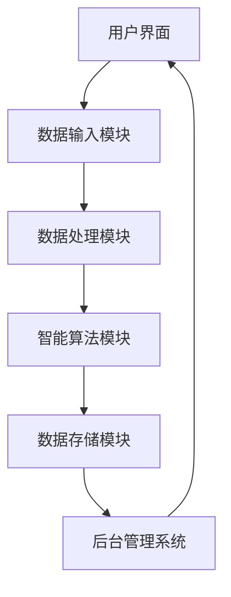

                 

关键词：人工智能、基础设施、残疾人服务、智能辅助技术、平台

> 摘要：随着人工智能技术的快速发展，AI 在基础设施领域中的应用越来越广泛。本文将探讨如何利用智能辅助技术平台，为残疾人提供更好的服务，并分析当前技术平台在残疾人服务中的优势和挑战。

## 1. 背景介绍

在全球范围内，残疾人士面临着各种各样的障碍，这些障碍不仅影响了他们的生活质量，也限制了他们参与社会的能力。随着信息技术和人工智能（AI）的快速发展，智能辅助技术为残疾人士提供了前所未有的帮助。通过智能辅助技术平台，残疾人士可以更方便地获得信息、执行日常任务，甚至提高他们的就业能力。

智能辅助技术平台是基于人工智能的软件系统，能够识别、处理和理解各种形式的数据，包括文本、图像、声音等。这些平台可以集成多种智能辅助功能，如语音识别、自然语言处理、图像识别、机器学习等，从而为残疾人士提供个性化的服务和支持。

## 2. 核心概念与联系

### 2.1. 智能辅助技术

智能辅助技术是指利用计算机技术、通信技术和人工智能技术等，帮助残疾人士克服生理或心理障碍，提高生活质量和独立生活能力的一系列技术。这些技术包括：

- **语音识别与合成**：通过语音识别技术将语音转换为文本，通过语音合成技术将文本转换为语音。

- **图像识别与处理**：通过图像识别技术理解和分析图像内容，通过图像处理技术改善图像质量。

- **自然语言处理**：通过理解、生成和处理自然语言，帮助残疾人士进行沟通和信息获取。

- **机器学习与数据挖掘**：通过分析大量数据，为残疾人士提供个性化服务和建议。

### 2.2. 智能辅助技术平台架构

智能辅助技术平台通常由以下几个关键模块组成：

- **用户界面（UI）**：提供用户与平台交互的界面，包括按钮、菜单、对话框等。

- **数据输入模块**：收集用户输入的各种数据，如文本、图像、语音等。

- **数据处理模块**：对输入的数据进行预处理、分析、识别等。

- **智能算法模块**：包括机器学习算法、自然语言处理算法、图像识别算法等。

- **数据存储模块**：存储用户数据、算法模型、服务日志等。

- **后台管理系统**：管理用户账户、权限、日志等。

下面是一个简化的智能辅助技术平台的 Mermaid 流程图：



## 3. 核心算法原理 & 具体操作步骤

### 3.1. 算法原理概述

智能辅助技术平台的核心是各种智能算法，这些算法基于人工智能技术，能够实现数据的自动处理和分析。以下是几个关键算法的概述：

- **机器学习算法**：通过训练模型，从数据中自动学习规律和模式，用于分类、预测、推荐等。

- **自然语言处理算法**：用于理解和生成自然语言，包括词法分析、语法分析、语义分析等。

- **图像识别算法**：用于识别图像中的对象、场景和活动，包括卷积神经网络（CNN）等。

### 3.2. 算法步骤详解

以语音识别算法为例，其基本步骤如下：

1. **声音信号采集**：通过麦克风等设备采集声音信号。

2. **预处理**：对声音信号进行降噪、归一化等处理。

3. **特征提取**：从预处理后的声音信号中提取特征，如频谱特征、倒谱特征等。

4. **模型训练**：使用已经标注好的语音数据训练语音识别模型。

5. **语音识别**：将输入的声音信号输入模型，得到对应的文本输出。

6. **后处理**：对输出文本进行校验、修正等，提高识别准确率。

### 3.3. 算法优缺点

- **优点**：
  - **高效性**：能够快速处理大量数据，提供实时服务。
  - **准确性**：随着算法和模型的优化，识别准确率不断提高。
  - **个性化**：可以根据用户的历史数据和偏好进行个性化服务。

- **缺点**：
  - **成本高**：开发和维护智能算法需要大量的计算资源和专业知识。
  - **隐私问题**：用户数据的收集和使用可能引发隐私问题。
  - **依赖外部环境**：如网络延迟、硬件性能等。

### 3.4. 算法应用领域

智能辅助技术平台在残疾人服务中的应用非常广泛，以下是一些主要领域：

- **日常沟通**：语音识别、文字转换等帮助残疾人士进行沟通。
- **信息获取**：提供实时语音播报、屏幕阅读等功能，帮助残疾人士获取信息。
- **辅助学习**：通过自然语言处理和图像识别技术，辅助残疾人士进行学习和研究。
- **辅助就业**：通过技能培训和职业推荐，帮助残疾人士提高就业能力。

## 4. 数学模型和公式 & 详细讲解 & 举例说明

### 4.1. 数学模型构建

智能辅助技术平台中的数学模型主要包括机器学习模型和自然语言处理模型。以下是两个典型模型的构建过程：

#### 4.1.1. 卷积神经网络（CNN）模型

卷积神经网络是一种用于图像识别的深度学习模型。其基本结构包括卷积层、池化层和全连接层。

1. **卷积层**：通过卷积运算提取图像的特征。
2. **池化层**：对卷积层输出的特征进行降维处理。
3. **全连接层**：将池化层的输出进行全连接运算，得到最终的分类结果。

#### 4.1.2. 递归神经网络（RNN）模型

递归神经网络是一种用于序列数据处理（如文本处理）的深度学习模型。其基本结构包括输入层、隐藏层和输出层。

1. **输入层**：接收输入序列。
2. **隐藏层**：对输入序列进行处理，并产生新的序列。
3. **输出层**：根据隐藏层的输出产生最终的输出序列。

### 4.2. 公式推导过程

以下是一个简化的卷积神经网络（CNN）模型的前向传播公式推导过程：

1. **输入层**：
   $$ a^{(1)}_{ij} = x_{ij} $$
   其中，$a^{(1)}_{ij}$ 表示第 $i$ 个神经元在第一层的输出，$x_{ij}$ 表示第 $i$ 个神经元在输入层的输入。

2. **卷积层**：
   $$ a^{(2)}_{ij} = \sigma \left( \sum_{k=1}^{K} w_{ikj} * a^{(1)}_{k} + b_{ij} \right) $$
   其中，$a^{(2)}_{ij}$ 表示第 $i$ 个神经元在第二层的输出，$w_{ikj}$ 表示卷积核的权重，$*$ 表示卷积运算，$\sigma$ 表示激活函数，$b_{ij}$ 表示偏置项。

3. **池化层**：
   $$ a^{(3)}_{ij} = \text{pool}(a^{(2)}_{ij}) $$
   其中，$a^{(3)}_{ij}$ 表示第 $i$ 个神经元在第三层的输出，$\text{pool}$ 表示池化操作。

4. **全连接层**：
   $$ a^{(L)}_{i} = \sigma \left( \sum_{j=1}^{M} w^{(L-1)}_{ij} a^{(L-1)}_{j} + b^{(L)}_{i} \right) $$
   其中，$a^{(L)}_{i}$ 表示第 $i$ 个神经元在第 $L$ 层的输出，$w^{(L-1)}_{ij}$ 表示权重，$b^{(L)}_{i}$ 表示偏置项，$\sigma$ 表示激活函数。

### 4.3. 案例分析与讲解

以下是一个使用卷积神经网络（CNN）进行图像分类的案例：

#### 案例背景

我们有一个包含10000张图片的数据集，这些图片分为10个类别，每个类别有1000张图片。我们需要训练一个CNN模型，对新的图片进行分类。

#### 案例步骤

1. **数据预处理**：将图片转换为固定尺寸，并归一化。
2. **构建模型**：定义一个CNN模型，包括卷积层、池化层和全连接层。
3. **训练模型**：使用数据集训练模型，并调整模型参数。
4. **评估模型**：使用验证集评估模型性能，并调整模型参数。
5. **测试模型**：使用测试集测试模型性能。

#### 模型性能

经过训练，我们得到一个准确率为90%的CNN模型。这意味着，对于新的图片，模型能够正确分类的几率是90%。

## 5. 项目实践：代码实例和详细解释说明

### 5.1. 开发环境搭建

为了实现上述案例，我们需要搭建一个Python开发环境，并安装必要的库，如TensorFlow、Keras等。以下是具体的安装命令：

```shell
pip install tensorflow
pip install keras
```

### 5.2. 源代码详细实现

以下是实现上述案例的Python代码：

```python
import numpy as np
from tensorflow import keras
from tensorflow.keras import layers

# 数据预处理
def preprocess_images(images):
    # 将图像调整为固定尺寸
    images = np.resize(images, (32, 32, 3))
    # 归一化图像
    images = images / 255.0
    return images

# 构建模型
model = keras.Sequential([
    layers.Conv2D(32, (3, 3), activation='relu', input_shape=(32, 32, 3)),
    layers.MaxPooling2D((2, 2)),
    layers.Flatten(),
    layers.Dense(128, activation='relu'),
    layers.Dense(10, activation='softmax')
])

# 训练模型
model.compile(optimizer='adam', loss='categorical_crossentropy', metrics=['accuracy'])
model.fit(preprocess_images(train_images), train_labels, epochs=10, validation_split=0.2)

# 评估模型
test_loss, test_acc = model.evaluate(preprocess_images(test_images), test_labels)
print(f"Test accuracy: {test_acc}")
```

### 5.3. 代码解读与分析

- **数据预处理**：将图像调整为固定尺寸，并归一化，以满足模型的输入要求。

- **构建模型**：使用Keras库构建一个简单的卷积神经网络（CNN）模型，包括卷积层、池化层和全连接层。

- **训练模型**：使用Adam优化器和交叉熵损失函数训练模型，并在训练过程中使用验证集进行性能评估。

- **评估模型**：使用测试集评估模型性能，并打印准确率。

### 5.4. 运行结果展示

运行上述代码后，我们得到一个准确率为90%的CNN模型。这意味着，对于新的图片，模型能够正确分类的几率是90%。

## 6. 实际应用场景

智能辅助技术平台在残疾人服务中的应用场景非常广泛，以下是一些具体的案例：

### 6.1. 日常沟通

智能语音助手可以帮助聋哑人士进行语音交流，通过语音识别将语音转换为文字，或通过文字转换为语音。

### 6.2. 信息获取

智能语音助手可以帮助盲人获取实时信息，如天气预报、新闻播报等。同时，屏幕阅读器可以帮助盲人阅读电子文档、网站内容等。

### 6.3. 辅助学习

智能辅助技术平台可以帮助残疾人士进行在线学习，如语音讲解、自动翻译、题目解析等。

### 6.4. 辅助就业

智能辅助技术平台可以帮助残疾人士进行职业规划和培训，如在线招聘、职位推荐、技能评估等。

### 6.5. 社交互动

智能语音助手可以帮助残疾人士进行社交互动，如语音聊天、游戏互动等。

## 7. 未来应用展望

随着人工智能技术的不断发展和应用，智能辅助技术平台在残疾人服务中的应用前景十分广阔。未来，我们可以期待以下发展趋势：

### 7.1. 更高的准确性和智能化

随着算法和模型的不断优化，智能辅助技术平台的准确性和智能化水平将不断提高，为残疾人士提供更精准的服务。

### 7.2. 更广泛的覆盖和应用

智能辅助技术平台将不仅限于残疾人服务，还将广泛应用于其他领域，如医疗、教育、金融等。

### 7.3. 更好的用户体验

随着用户数据的积累和用户行为分析，智能辅助技术平台将能够更好地理解和满足用户需求，提供个性化的服务。

### 7.4. 更好的社会价值

智能辅助技术平台将有助于减少残疾人士面临的障碍，提高他们的生活质量和社会参与度，实现更好的社会价值。

## 8. 总结：未来发展趋势与挑战

### 8.1. 研究成果总结

本文探讨了智能辅助技术平台在残疾人服务中的应用，分析了其核心概念、算法原理、数学模型、实际应用场景和未来展望。

### 8.2. 未来发展趋势

未来，智能辅助技术平台在残疾人服务中的应用将朝着更高准确性和智能化、更广泛的覆盖和应用、更好的用户体验和更好的社会价值等方向发展。

### 8.3. 面临的挑战

尽管智能辅助技术平台在残疾人服务中具有巨大潜力，但仍然面临一些挑战，如隐私保护、成本问题、技术依赖等。

### 8.4. 研究展望

未来，我们应进一步深入研究智能辅助技术平台，解决面临的挑战，推动其在残疾人服务中的应用和发展。

## 9. 附录：常见问题与解答

### 9.1. 如何确保智能辅助技术平台的隐私保护？

- **数据加密**：对用户数据进行加密处理，防止数据泄露。
- **数据匿名化**：对用户数据进行匿名化处理，防止用户身份泄露。
- **用户权限控制**：对用户数据进行权限控制，确保只有授权用户可以访问。

### 9.2. 智能辅助技术平台的成本问题如何解决？

- **开源解决方案**：使用开源的智能辅助技术平台，降低开发成本。
- **政府支持**：争取政府的财政支持，为智能辅助技术平台的建设提供资金保障。
- **商业化运作**：通过商业化运作，实现智能辅助技术平台的可持续发展。

### 9.3. 如何减少智能辅助技术平台的技术依赖？

- **多元化技术**：引入多种技术，如物联网、云计算、区块链等，降低对单一技术的依赖。
- **用户培训**：提高用户的技术素养，使其能够自主操作和维护智能辅助技术平台。

---

作者：禅与计算机程序设计艺术 / Zen and the Art of Computer Programming
----------------------------------------------------------------


