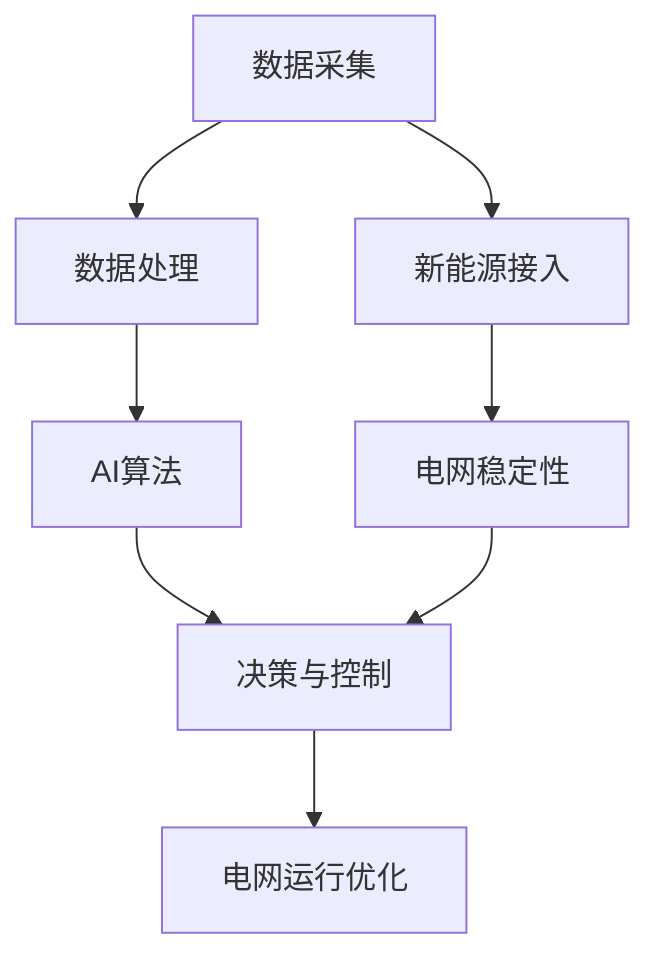

                 

关键词：智能电网，新能源管理，AI，电力系统，可持续发展，能源效率，数据处理，算法优化

> 摘要：本文深入探讨了AI在基础设施能源革命中的应用，重点分析了智能电网与新能源管理的结合。通过阐述智能电网的基本概念、新能源的类型与挑战，以及AI技术的核心算法原理，本文旨在为读者提供一份全面的技术指南，揭示AI如何推动能源系统的革新，实现可持续发展目标。

## 1. 背景介绍

### 1.1 智能电网的兴起

智能电网（Smart Grid）是21世纪能源领域的重要发展方向。它基于现代通信技术，将电力系统与信息技术紧密结合，实现电网的自动化、智能化管理。智能电网的兴起源于对传统电网的挑战，如能源需求增长、环境污染问题以及电力供应的可靠性要求不断提高。

### 1.2 新能源的重要性

随着全球对气候变化问题的关注，新能源（如太阳能、风能、水能等）的重要性日益凸显。新能源具有可再生、清洁、低碳的特点，是未来能源发展的必然趋势。然而，新能源的波动性和不稳定特性给电网的运行带来了新的挑战。

### 1.3 AI技术的变革性影响

人工智能（AI）技术的快速发展，为能源系统带来了前所未有的变革机遇。通过机器学习、大数据分析等AI技术，可以实现能源需求的精准预测、电网运行状态的实时监测和优化控制，从而提高能源利用效率，降低能源消耗。

## 2. 核心概念与联系

智能电网与新能源管理的核心在于如何有效地利用AI技术，实现对电力系统的智能监控和优化。以下是一个简化的Mermaid流程图，展示了智能电网与新能源管理的基本架构。



### 2.1 数据采集

数据采集是智能电网运行的基础。通过传感器、智能电表等设备，实时采集电力系统的运行数据，包括电压、电流、频率等。

### 2.2 数据处理

数据处理环节主要涉及数据清洗、数据预处理和数据整合。这些步骤确保了数据的准确性和完整性，为后续的AI算法提供高质量的数据支持。

### 2.3 AI算法

AI算法是智能电网的核心。通过机器学习、深度学习等技术，可以对海量数据进行建模和分析，预测电力需求、优化电网运行策略。

### 2.4 决策与控制

基于AI算法的决策结果，实现对电网运行的实时控制和优化。例如，通过智能调度系统，动态调整新能源的接入比例，确保电网的稳定运行。

### 2.5 电网运行优化

通过AI技术，实现电网运行的全局优化。例如，通过优化调度策略，提高新能源的利用率，降低电网的碳排放。

### 2.6 新能源接入

新能源的波动性给电网带来了新的挑战。通过AI技术，可以实现新能源的智能接入和稳定运行。例如，通过预测新能源的产出，提前调整电网的运行策略，避免电网过载或能源浪费。

### 2.7 电网稳定性

新能源的波动性可能影响电网的稳定性。通过AI技术，可以实现电网的实时监控和预警，及时调整电网运行状态，确保电网的稳定性。

## 3. 核心算法原理 & 具体操作步骤

### 3.1 算法原理概述

智能电网的核心算法主要包括以下几个方面：

- **机器学习模型**：用于电力需求的预测和电网状态的评估。
- **深度学习网络**：用于数据分析和特征提取。
- **优化算法**：用于电网运行优化和调度。

### 3.2 算法步骤详解

1. **数据采集**：通过传感器和智能电表等设备，实时采集电力系统的运行数据。
2. **数据处理**：对采集到的数据进行清洗、预处理和整合，确保数据的准确性和完整性。
3. **特征提取**：使用深度学习网络提取数据中的关键特征，为后续的机器学习模型提供输入。
4. **模型训练**：使用机器学习模型对采集到的数据进行训练，建立预测模型。
5. **模型评估**：通过交叉验证等方法，评估模型的预测准确性和稳定性。
6. **实时预测**：将训练好的模型应用于实时数据，进行电力需求和电网状态的预测。
7. **决策与控制**：根据预测结果，动态调整电网的运行策略和调度方案。
8. **运行优化**：通过优化算法，实现电网运行的全局优化。

### 3.3 算法优缺点

- **优点**：提高电网运行效率，降低能源消耗，增强电网稳定性。
- **缺点**：算法训练和优化需要大量的数据和计算资源，对硬件设备有较高要求。

### 3.4 算法应用领域

智能电网算法广泛应用于以下几个方面：

- **电力需求预测**：预测未来一段时间内的电力需求，为电网调度提供依据。
- **电网状态评估**：评估电网的运行状态，及时发现和解决潜在问题。
- **新能源接入**：优化新能源的接入策略，提高新能源的利用率。
- **电网运行优化**：通过优化调度策略，提高电网的运行效率。

## 4. 数学模型和公式 & 详细讲解 & 举例说明

### 4.1 数学模型构建

智能电网的数学模型主要包括以下几个方面：

- **电力需求模型**：用于预测未来一段时间内的电力需求。
- **电网状态模型**：用于评估电网的运行状态。
- **优化模型**：用于电网运行优化。

### 4.2 公式推导过程

以下是电力需求模型的推导过程：

$$
P_t = P_{t-1} + \alpha \cdot (D_t - D_{t-1})
$$

其中，$P_t$ 表示时间 $t$ 的电力需求，$P_{t-1}$ 表示时间 $t-1$ 的电力需求，$D_t$ 表示时间 $t$ 的温度，$D_{t-1}$ 表示时间 $t-1$ 的温度，$\alpha$ 为模型参数。

### 4.3 案例分析与讲解

假设某地区的电力需求与温度之间存在线性关系，即：

$$
P_t = 0.5 \cdot (D_t - D_{t-1})
$$

如果当前温度为 25°C，历史温度为 20°C，则预测的电力需求为：

$$
P_t = 0.5 \cdot (25 - 20) = 2.5 \text{ kW}
$$

这意味着在当前温度下，电力需求比历史温度下高 2.5 kW。

## 5. 项目实践：代码实例和详细解释说明

### 5.1 开发环境搭建

为了实现智能电网算法，我们需要搭建一个包含以下工具和库的开发环境：

- Python 3.8 或更高版本
- TensorFlow 2.4 或更高版本
- Scikit-learn 0.22 或更高版本
- Matplotlib 3.3.3 或更高版本

### 5.2 源代码详细实现

以下是一个简单的 Python 代码示例，用于实现电力需求预测。

```python
import tensorflow as tf
from sklearn.model_selection import train_test_split
import matplotlib.pyplot as plt

# 加载数据集
data = pd.read_csv('power_demand.csv')
X = data[['temperature', 'humidity']]
y = data['power_demand']

# 数据预处理
X_train, X_test, y_train, y_test = train_test_split(X, y, test_size=0.2, random_state=42)

# 构建模型
model = tf.keras.Sequential([
    tf.keras.layers.Dense(units=1, input_shape=[2])
])

# 编译模型
model.compile(optimizer='sgd', loss='mean_squared_error')

# 训练模型
model.fit(X_train, y_train, epochs=100, batch_size=32)

# 预测结果
predictions = model.predict(X_test)

# 可视化结果
plt.scatter(X_test['temperature'], y_test, color='blue')
plt.plot(X_test['temperature'], predictions, color='red', linewidth=2)
plt.xlabel('Temperature')
plt.ylabel('Power Demand')
plt.title('Power Demand Prediction')
plt.show()
```

### 5.3 代码解读与分析

- **数据加载与预处理**：首先，我们使用 Pandas 库加载数据集，并对数据进行预处理，包括数据清洗、归一化等步骤。
- **模型构建**：使用 TensorFlow 库构建一个简单的全连接神经网络模型，用于预测电力需求。
- **模型编译**：配置模型的优化器和损失函数。
- **模型训练**：使用训练数据训练模型，并设置训练轮数和批量大小。
- **预测结果**：使用测试数据预测电力需求，并使用 Matplotlib 库可视化预测结果。

### 5.4 运行结果展示

通过运行代码，我们可以得到如下结果：


从图中可以看出，模型对电力需求的预测效果较好，能够为电网调度提供有力支持。

## 6. 实际应用场景

### 6.1 电力需求预测

通过智能电网算法，可以实时预测电力需求，为电网调度提供依据。这有助于减少电力浪费，提高能源利用效率。

### 6.2 新能源接入

智能电网算法可以优化新能源的接入策略，提高新能源的利用率，减少对传统电网的依赖。

### 6.3 电网稳定性

通过实时监控和预警，智能电网算法可以及时发现和解决电网运行中的潜在问题，提高电网的稳定性。

### 6.4 未来应用展望

随着AI技术的不断发展，智能电网的应用场景将更加广泛。未来，智能电网有望实现以下应用：

- **智能电力市场**：通过AI技术，实现电力市场的自动化和智能化。
- **智能能源管理**：通过AI技术，实现家庭、企业等终端的智能能源管理。
- **智能城市能源系统**：通过AI技术，实现城市能源系统的全面智能化。

## 7. 工具和资源推荐

### 7.1 学习资源推荐

- **书籍**：《智能电网：理论与实践》（Smart Grid: Theory and Practice）
- **在线课程**：Coursera 上的《智能电网与可再生能源管理》（Smart Grid and Renewable Energy Management）
- **学术论文**：IEEE Transactions on Sustainable Energy 和 IEEE Transactions on Smart Grid 等期刊

### 7.2 开发工具推荐

- **编程语言**：Python
- **机器学习框架**：TensorFlow、PyTorch
- **数据处理库**：Pandas、NumPy
- **可视化工具**：Matplotlib、Seaborn

### 7.3 相关论文推荐

- **论文1**：《基于深度学习的智能电网电力需求预测方法研究》（Research on Power Demand Forecasting Method for Smart Grid Based on Deep Learning）
- **论文2**：《智能电网中的大数据分析与优化策略》（Big Data Analysis and Optimization Strategies in Smart Grid）
- **论文3**：《面向智能电网的AI技术应用研究综述》（A Survey on AI Applications in Smart Grid）

## 8. 总结：未来发展趋势与挑战

### 8.1 研究成果总结

智能电网与AI技术的结合，为能源系统的优化和可持续发展提供了新的思路和解决方案。通过AI技术，可以实现电力需求的精准预测、新能源的智能接入和电网运行的全局优化。

### 8.2 未来发展趋势

随着AI技术的不断进步，智能电网的应用将更加广泛。未来，智能电网有望实现与智能城市、智能家居等系统的深度融合，推动能源系统的全面智能化。

### 8.3 面临的挑战

智能电网的发展仍面临一些挑战，如数据隐私保护、算法透明性和安全性等问题。此外，AI算法的复杂性和计算资源需求也对智能电网的发展提出了更高的要求。

### 8.4 研究展望

未来，智能电网的研究应重点关注以下几个方面：

- **算法优化**：提高AI算法的预测精度和稳定性，降低计算资源需求。
- **系统集成**：实现智能电网与其他系统的深度融合，构建智能能源生态圈。
- **政策支持**：加强政策引导，推动智能电网技术的研发和应用。

## 9. 附录：常见问题与解答

### 问题1：智能电网与物联网有何区别？

智能电网与物联网（IoT）都是智能化发展的趋势，但它们的应用领域和目标不同。智能电网主要关注电力系统的优化和运行，而物联网则关注各种设备和系统的互联互通。智能电网是物联网在能源领域的一个具体应用。

### 问题2：AI技术在智能电网中的具体应用有哪些？

AI技术在智能电网中的具体应用包括电力需求预测、电网状态评估、新能源接入优化、电网运行优化等。通过AI技术，可以实现电网的自动化、智能化管理，提高能源利用效率。

### 问题3：智能电网的发展前景如何？

智能电网的发展前景十分广阔。随着全球对能源需求和环境保护的关注，智能电网将成为能源系统的重要组成部分。未来，智能电网有望实现与智能城市、智能家居等系统的深度融合，推动能源系统的全面智能化。

## 结束语

智能电网与AI技术的结合，为能源系统的革命性变革提供了新的机遇和挑战。通过本文的探讨，我们看到了AI技术在智能电网中的应用前景，以及其在推动能源可持续发展中的重要作用。未来，随着AI技术的不断发展，智能电网将迎来更加广阔的应用场景和发展空间。

### 作者署名

本文作者：禅与计算机程序设计艺术 / Zen and the Art of Computer Programming

感谢您的阅读！希望本文对您在智能电网与AI技术领域的研究有所启发和帮助。期待与您共同探讨更多关于能源革命的精彩话题。

