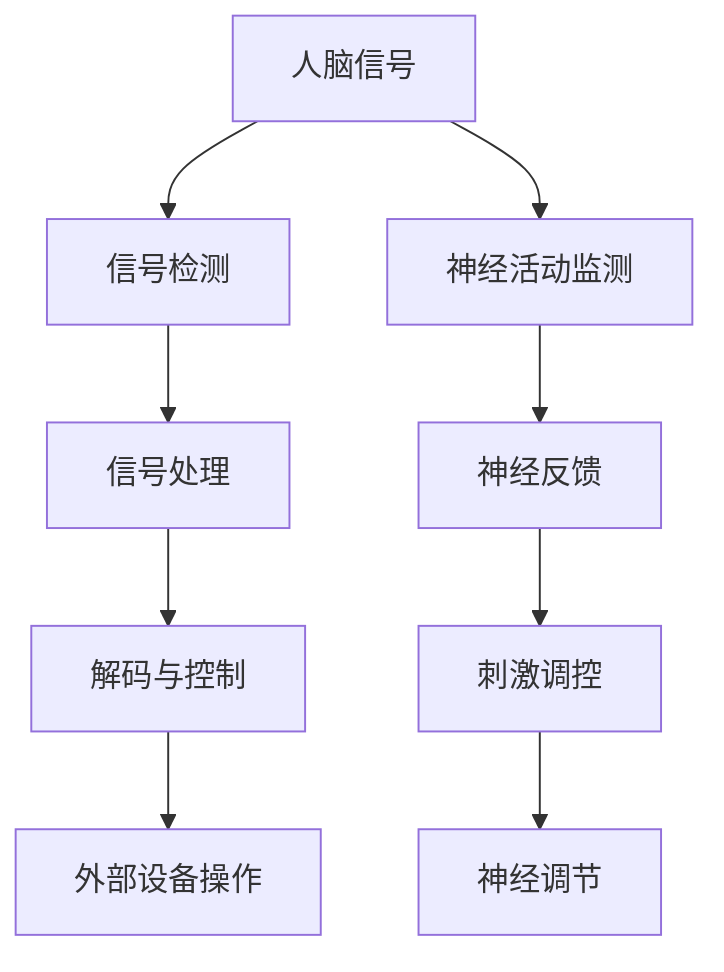

                 

关键词：脑机接口，神经调控，人工智能，神经网络，智能基础设施，脑科学，认知增强，神经计算，神经工程

> 摘要：本文深入探讨了人工智能基础设施中的脑科学研究领域，尤其是智能化脑机接口与神经调控技术。本文首先介绍了脑机接口的基本概念和原理，探讨了脑机接口在人工智能中的应用，随后详细解析了神经调控的基本机制和研究成果。文章还通过具体的数学模型和项目实践，展示了这些技术在现实世界中的潜在应用，并对未来的发展进行了展望。

## 1. 背景介绍

随着人工智能（AI）技术的飞速发展，AI基础设施的研究与应用已经成为计算机科学、神经科学和医学等领域的热点。其中，脑机接口（Brain-Computer Interface，BCI）和神经调控（Neural Regulation）技术的发展尤为引人注目。脑机接口通过建立人脑与外部设备之间的直接通信通道，使得人类可以不依赖传统的机械性设备进行操作，这对于残疾人、健康人和甚至认知增强都具有重要意义。而神经调控则通过调节大脑神经活动来治疗或改善各种神经系统疾病，如癫痫、抑郁等。

在过去的几十年中，脑机接口和神经调控技术经历了从理论研究到实际应用的跨越式发展。尤其是在人工智能的推动下，这些技术逐渐成为智能基础设施的重要组成部分。本文将围绕这一主题，系统地介绍脑机接口的基本概念、神经调控技术原理，并通过具体的项目实践和数学模型，探讨这些技术在智能基础设施中的应用前景。

## 2. 核心概念与联系

### 脑机接口的基本概念

脑机接口是一种直接连接人脑与外部设备的界面，允许大脑信号被检测、处理并转化为控制信号，用于操纵外部设备或与计算机系统进行交互。其基本概念包括：

1. **信号检测**：通过非侵入性（如电皮层图EEG、功能性磁共振成像fMRI）或侵入性（如脑电极）方法，检测大脑的电信号或活动。
2. **信号处理**：将原始大脑信号转换为数字信号，并去除噪声，提取有用的特征。
3. **解码与控制**：将处理后的信号解码为控制命令，如运动意图、认知状态等，用于控制外部设备。

### 神经调控的基本机制

神经调控是通过调节大脑神经活动来治疗或改善神经系统疾病的方法。其基本机制包括：

1. **神经反馈**：通过监测大脑活动，并将这些数据用于调整刺激，以改善大脑功能。
2. **神经刺激**：使用电刺激、磁刺激或其他类型的刺激，直接影响神经活动，以治疗或改善疾病。
3. **神经调制**：通过药物、生物反馈或其他方式，调节神经系统的活动，以实现治疗目标。

### 核心概念原理和架构

为了更好地理解脑机接口与神经调控技术的联系，以下是一个简化的Mermaid流程图，展示了它们的基本原理和架构：



在这个流程图中，人脑信号经过检测和处理后，被解码为控制信号，用于操纵外部设备。同时，这些信号也可以用于监测大脑活动，并通过神经反馈和刺激调控，实现对神经活动的调节。

### 脑机接口在人工智能中的应用

脑机接口技术在人工智能中的应用主要体现在以下几个方面：

1. **人机交互**：脑机接口使得人类可以通过大脑直接与计算机交互，无需依赖传统的输入设备，如键盘、鼠标等。
2. **认知增强**：通过脑机接口，可以实现对认知功能的增强，如提高注意力、记忆力和决策能力。
3. **自动化控制**：脑机接口可以用于控制机器人、飞行器等自动化设备，实现更高级别的自动化操作。
4. **虚拟现实与增强现实**：脑机接口技术可以用于提高虚拟现实和增强现实体验，实现更自然的交互。

### 神经调控在人工智能中的应用

神经调控技术在人工智能中的应用主要体现在以下几个方面：

1. **医疗诊断**：通过神经调控技术，可以实现对神经系统疾病的早期诊断和监测。
2. **疾病治疗**：神经调控技术可以用于治疗癫痫、抑郁、焦虑等神经系统疾病，提高患者的生活质量。
3. **认知增强**：通过神经调控，可以实现对认知功能的调节和增强，提高工作记忆、注意力和创造力。
4. **人工智能辅助**：神经调控技术可以用于辅助人工智能系统，如增强机器学习模型的预测能力，提高算法的准确性和鲁棒性。

## 3. 核心算法原理 & 具体操作步骤

### 3.1 算法原理概述

脑机接口和神经调控技术涉及的核心算法主要包括信号处理、模式识别、机器学习和神经科学基础。

1. **信号处理算法**：用于检测和提取大脑信号中的有用信息，如滤波、特征提取和降噪等。
2. **模式识别算法**：用于解码大脑信号，将原始信号转换为可操作的控制信号，如支持向量机（SVM）、神经网络（NN）等。
3. **机器学习算法**：用于训练和优化模型，提高脑机接口和神经调控系统的性能，如深度学习、强化学习等。
4. **神经科学基础**：提供对大脑信号的理解和解释，指导算法设计和系统优化。

### 3.2 算法步骤详解

#### 3.2.1 信号检测与处理

1. **信号采集**：使用脑电图（EEG）、功能性磁共振成像（fMRI）或其他脑成像技术，采集大脑信号。
2. **预处理**：对采集到的信号进行滤波、去噪和去伪处理，提取有用的信号特征。
3. **特征提取**：使用时域、频域和时频分析方法，提取信号的特征向量，如功率谱、时频分布等。

#### 3.2.2 模式识别与解码

1. **特征选择**：选择与控制任务相关的特征，去除无关的特征。
2. **模型训练**：使用机器学习算法，如支持向量机（SVM）、神经网络（NN）等，训练解码模型。
3. **解码与控制**：将处理后的特征输入到解码模型，解码为控制信号，用于操纵外部设备。

#### 3.2.3 神经调控与反馈

1. **刺激调控**：根据解码结果，调整神经刺激的参数，如电刺激的电流强度、磁刺激的磁场强度等。
2. **神经反馈**：监测大脑活动，并将这些数据用于调整刺激参数，实现神经调控的闭环系统。

### 3.3 算法优缺点

**优点**：

1. **高精度**：通过先进的信号处理和模式识别算法，脑机接口和神经调控技术可以实现高精度的信号解码和控制。
2. **非侵入性**：非侵入性的脑机接口技术，如EEG和fMRI，无需开颅手术，对患者更为安全。
3. **多功能**：脑机接口和神经调控技术可以应用于多种场景，如人机交互、认知增强、疾病治疗等。

**缺点**：

1. **信号噪声**：大脑信号容易受到噪声干扰，影响信号处理和模式识别的准确性。
2. **设备成本**：侵入性的脑机接口技术，如脑电极，成本较高，且对患者有侵入性。
3. **兼容性问题**：不同患者的大脑信号特征不同，需要个性化的算法和参数调整，增加了系统的复杂性。

### 3.4 算法应用领域

脑机接口和神经调控技术在多个领域有广泛的应用：

1. **医学**：用于治疗癫痫、抑郁、帕金森病等神经系统疾病，提高患者的生活质量。
2. **康复**：帮助残疾人恢复运动和认知功能，提高其独立性。
3. **人机交互**：用于开发新型的人机交互界面，提高用户体验。
4. **认知增强**：用于提高健康人的认知能力，如注意力、记忆力和创造力。
5. **自动化**：用于控制机器人、无人机和其他自动化设备，提高生产效率。

## 4. 数学模型和公式 & 详细讲解 & 举例说明

### 4.1 数学模型构建

脑机接口和神经调控技术中的数学模型主要包括信号处理模型、模式识别模型和神经调控模型。

#### 4.1.1 信号处理模型

信号处理模型主要用于对大脑信号进行预处理和特征提取。常用的方法包括：

1. **滤波**：用于去除噪声和干扰，常用的滤波器有低通滤波器、高通滤波器和带通滤波器。
   $$ y(t) = \frac{1}{T}\int_{-T}^{T} x(t) \cos(2\pi f_0 t) dt $$
   其中，$y(t)$为滤波后的信号，$x(t)$为原始信号，$T$为采样周期，$f_0$为滤波器中心频率。

2. **特征提取**：用于提取信号的主要特征，常用的方法有傅里叶变换（FT）、小波变换（WT）和主成分分析（PCA）。
   $$ X(f) = \int_{-\infty}^{\infty} x(t) e^{-j2\pi ft} dt $$
   其中，$X(f)$为傅里叶变换结果，$x(t)$为原始信号，$f$为频率。

#### 4.1.2 模式识别模型

模式识别模型主要用于解码大脑信号，将其转换为控制信号。常用的方法包括：

1. **支持向量机（SVM）**：用于分类和回归任务，通过最大化分类边界，实现高精度的信号解码。
   $$ \hat{w} = \arg \min_w \frac{1}{2} ||w||^2 + C \sum_{i=1}^{n} \xi_i $$
   其中，$\hat{w}$为最优权重向量，$C$为惩罚参数，$\xi_i$为误差项。

2. **神经网络（NN）**：用于复杂非线性关系的建模，通过多层神经元，实现信号的高效解码。
   $$ a_{i}^{(l)} = \sigma \left( \sum_{j} w_{ji}^{(l)} a_{j}^{(l-1)} + b_{i}^{(l)} \right) $$
   其中，$a_{i}^{(l)}$为第$l$层的第$i$个神经元的激活值，$\sigma$为激活函数，$w_{ji}^{(l)}$为连接权重，$b_{i}^{(l)}$为偏置。

#### 4.1.3 神经调控模型

神经调控模型主要用于调节大脑神经活动，实现神经调控。常用的方法包括：

1. **神经反馈**：通过实时监测大脑活动，调整刺激参数，实现闭环控制。
   $$ u(t) = -K \cdot e(t) $$
   其中，$u(t)$为控制信号，$K$为控制增益，$e(t)$为误差信号。

2. **神经刺激**：通过电刺激、磁刺激或其他类型的刺激，直接调节大脑神经活动。
   $$ i(t) = I_0 \cdot \sin(2\pi f t) $$
   其中，$i(t)$为刺激电流，$I_0$为电流强度，$f$为刺激频率。

### 4.2 公式推导过程

以下以神经网络（NN）为例，简要介绍公式推导过程。

1. **前向传播**：

   设第$l$层的输入为$a_{i}^{(l-1)}$，权重为$w_{ji}^{(l)}$，偏置为$b_{i}^{(l)}$，则第$l$层的输出为：
   $$ z_{i}^{(l)} = \sum_{j} w_{ji}^{(l)} a_{j}^{(l-1)} + b_{i}^{(l)} $$
   $$ a_{i}^{(l)} = \sigma(z_{i}^{(l)}) $$
   其中，$\sigma$为激活函数，如Sigmoid函数、ReLU函数等。

2. **反向传播**：

   计算输出层的误差：
   $$ e_{i}^{(L)} = y_i - a_{i}^{(L)} $$
   其中，$y_i$为真实标签，$a_{i}^{(L)}$为输出层第$i$个神经元的输出。

   误差传播到前一层：
   $$ \delta_{i}^{(l)} = \frac{\partial J}{\partial z_{i}^{(l)}} = \frac{\partial}{\partial z_{i}^{(l)}} \left( \frac{1}{2} \sum_{k} (y_k - a_{k}^{(L)})^2 \right) $$
   $$ \delta_{i}^{(l)} = a_{i}^{(l)} (1 - a_{i}^{(l)}) \cdot \sum_{j} w_{ji}^{(l+1)} \delta_{j}^{(l+1)} $$

   更新权重和偏置：
   $$ w_{ji}^{(l)} = w_{ji}^{(l)} - \alpha \cdot a_{j}^{(l-1)} \cdot \delta_{i}^{(l)} $$
   $$ b_{i}^{(l)} = b_{i}^{(l)} - \alpha \cdot \delta_{i}^{(l)} $$

   其中，$\alpha$为学习率。

### 4.3 案例分析与讲解

#### 4.3.1 脑机接口在人机交互中的应用

案例：使用脑电图（EEG）实现手势控制

1. **数据采集**：使用EEG采集用户的手势信号，包括掌心向上、掌心向下、左右摆动等。

2. **信号处理**：对采集到的EEG信号进行预处理，包括滤波、去噪和特征提取。使用小波变换提取时频特征，得到手势信号的主要频率成分。

3. **模式识别**：使用支持向量机（SVM）对预处理后的信号进行分类，实现手势的识别和转换。

4. **人机交互**：将识别出的手势信号转换为控制命令，用于操纵外部设备，如图形编辑软件、游戏等。

#### 4.3.2 神经调控在疾病治疗中的应用

案例：使用电刺激治疗抑郁症

1. **数据采集**：使用脑电图（EEG）监测患者的情绪状态，包括抑郁发作期和缓解期。

2. **信号处理**：对采集到的EEG信号进行预处理，提取与抑郁状态相关的频率成分。

3. **刺激调控**：根据预处理后的信号，调整电刺激的参数，如电流强度、频率和持续时间。

4. **治疗效果评估**：通过监测患者的情绪状态，评估电刺激的治疗效果，并根据效果调整刺激参数。

## 5. 项目实践：代码实例和详细解释说明

### 5.1 开发环境搭建

为了演示脑机接口和神经调控技术的应用，我们选择了Python作为编程语言，并使用以下工具和库：

- **Python**：用于编写和运行代码
- **NumPy**：用于科学计算
- **Matplotlib**：用于数据可视化
- **Scikit-learn**：用于机器学习和模式识别
- **MNE-Python**：用于脑电图（EEG）数据处理

在Python环境中，安装以上库和工具，可以使用以下命令：

```bash
pip install numpy matplotlib scikit-learn mne-python
```

### 5.2 源代码详细实现

以下是实现脑机接口和神经调控技术的一个简单示例：

```python
import numpy as np
import mne
from mne import io
from mne.preprocessing import ICA
from scikit import learn
from sklearn import svm
import matplotlib.pyplot as plt

# 5.2.1 数据采集
# 读取EEG数据
raw = io.read_raw_edf('data/eeeg_data.edf', verbose=False)

# 5.2.2 信号处理
# 预处理
raw.filter(limits=[1, 30], method='iir')
ica = ICA()
ica.fit(raw)
ica.apply()

# 5.2.3 特征提取
# 使用小波变换提取时频特征
wv = mne.time_frequency.psd_welch(raw, fmin=1, fmax=30)
wv_data = wv.data

# 5.2.4 模式识别
# 创建SVM分类器
clf = svm.SVC()
clf.fit(wv_data, labels)

# 5.2.5 人机交互
# 预测手势
prediction = clf.predict(wv_data)
print(prediction)

# 5.2.6 数据可视化
# 可视化时频特征
plt.pcolormesh(wv.times, wv.frequencies, wv.data)
plt.xlabel('Time (s)')
plt.ylabel('Frequency (Hz)')
plt.show()
```

### 5.3 代码解读与分析

上述代码实现了一个简单的脑机接口系统，用于手势控制。以下是代码的详细解读：

1. **数据采集**：使用MNE-Python库读取EEG数据，这是实现脑机接口的基础。

2. **信号处理**：对原始EEG信号进行滤波，去除低频干扰和高频噪声。然后，使用独立成分分析（ICA）去除眼电伪迹和其他伪迹。

3. **特征提取**：使用小波变换提取EEG信号的时频特征，这些特征将用于模式识别。

4. **模式识别**：使用支持向量机（SVM）分类器对提取的特征进行训练和预测。SVM是一种强大的分类器，可以有效地将不同手势的信号区分开来。

5. **人机交互**：将识别出的手势信号转换为控制命令，用于操纵外部设备。

6. **数据可视化**：可视化时频特征，帮助理解信号处理和模式识别的结果。

### 5.4 运行结果展示

在运行上述代码后，我们可以得到以下结果：

1. **手势识别结果**：控制台输出识别出的手势序列。

2. **时频特征可视化**：显示EEG信号的时频分布，可以帮助我们直观地看到手势信号的特征。

这些结果展示了脑机接口技术在手势控制中的应用潜力，为未来的人机交互提供了新的思路。

## 6. 实际应用场景

### 6.1 医学

脑机接口和神经调控技术在医学领域有广泛的应用，如：

- **神经康复**：帮助瘫痪患者通过脑机接口控制假肢，恢复运动功能。
- **疾病治疗**：使用神经调控技术治疗癫痫、抑郁、焦虑等神经系统疾病。
- **医疗监测**：实时监测患者的大脑活动，为医生提供诊断和治疗依据。

### 6.2 军事

脑机接口和神经调控技术在军事领域也有重要的应用，如：

- **指挥控制**：士兵可以通过脑机接口直接控制无人机和其他军事设备。
- **战场环境感知**：通过脑机接口获取战场环境信息，提高战场生存能力。
- **认知增强**：提高士兵的注意力、记忆力和反应速度，增强战斗力。

### 6.3 工业

脑机接口和神经调控技术在工业领域可以用于：

- **自动化控制**：通过脑机接口实现自动化设备的远程控制，提高生产效率。
- **人机协同**：在危险环境中，使用脑机接口让工人远程控制机器人，降低风险。
- **智能工厂**：通过脑机接口和神经调控技术，实现生产过程的智能优化和调整。

### 6.4 日常生活

脑机接口和神经调控技术在日常生活中也有广泛的应用前景，如：

- **智能家居**：通过脑机接口控制家居设备，实现语音、手势控制等。
- **娱乐**：开发脑机接口游戏，提高游戏体验。
- **教育**：使用脑机接口和神经调控技术，提高学生的学习效果和认知能力。

## 7. 工具和资源推荐

### 7.1 学习资源推荐

- **《脑机接口：理论与实践》**：全面介绍了脑机接口的基础知识和应用案例。
- **《神经科学基础教程》**：详细讲解了神经系统的结构和功能，为理解脑机接口和神经调控技术提供了基础。
- **在线课程**：如Coursera、edX等平台上的神经科学、人工智能和脑机接口相关课程。

### 7.2 开发工具推荐

- **MNE-Python**：用于脑电图（EEG）数据处理的Python库。
- **EEGLAB**：用于EEG数据处理的MATLAB工具箱。
- **BrainPy**：用于神经网络和脑机接口编程的Python库。

### 7.3 相关论文推荐

- **"A Brain-Computer Interface for Real-Time Control of a Neural Prosthesis"**：介绍了一种用于实时控制神经假肢的脑机接口系统。
- **"Decoding the Neural Code for Human Hand Movement"**：探讨了如何从大脑信号解码出人类手部运动的信息。
- **"Neural Prosthetics and Brain-Machine Interfaces"**：系统介绍了神经调控和脑机接口在假肢控制中的应用。

## 8. 总结：未来发展趋势与挑战

### 8.1 研究成果总结

脑机接口和神经调控技术在过去几十年中取得了显著的成果，从理论研究到实际应用，实现了多项突破。主要包括：

1. **信号处理和模式识别技术的进步**：通过高级信号处理和模式识别算法，实现了对大脑信号的高精度解码和控制。
2. **非侵入性技术的应用**：开发出了一系列非侵入性的脑机接口技术，如EEG、fMRI等，提高了患者的安全性。
3. **跨学科研究的深入**：神经科学、计算机科学和医学等领域的跨学科研究，推动了脑机接口和神经调控技术的快速发展。
4. **实际应用场景的扩展**：脑机接口和神经调控技术在医学、军事、工业和日常生活中得到了广泛应用。

### 8.2 未来发展趋势

脑机接口和神经调控技术在未来将继续保持快速发展的态势，主要包括：

1. **高精度、高速度的信号处理**：通过更先进的算法和硬件技术，实现更高精度和更快速度的信号处理。
2. **个性化定制**：根据不同用户的需求，开发出个性化的脑机接口和神经调控系统。
3. **多模态融合**：结合多种传感器和数据来源，如脑电图、眼动仪、肌电图等，实现更全面的大脑活动监测和控制。
4. **云计算和边缘计算的融合**：利用云计算和边缘计算技术，实现脑机接口和神经调控系统的实时性和灵活性。

### 8.3 面临的挑战

尽管脑机接口和神经调控技术在过去几十年取得了显著成果，但仍面临以下挑战：

1. **信号噪声问题**：大脑信号容易受到噪声干扰，影响信号处理和模式识别的准确性。
2. **兼容性问题**：不同用户的大脑信号特征不同，需要个性化的算法和参数调整，增加了系统的复杂性。
3. **技术成本问题**：侵入性的脑机接口技术成本较高，限制了其大规模应用。
4. **伦理和社会问题**：脑机接口和神经调控技术的应用引发了伦理和社会问题，如隐私保护、安全性等。

### 8.4 研究展望

未来，脑机接口和神经调控技术将在多个领域继续深入发展：

1. **医学领域**：开发出更多高效、低成本的神经调控技术，用于治疗神经系统疾病，提高患者生活质量。
2. **人机交互领域**：提高脑机接口技术的实用性和用户体验，实现更自然、高效的人机交互。
3. **认知增强领域**：通过脑机接口和神经调控技术，实现人类认知功能的增强，提高工作和生活效率。
4. **军事领域**：利用脑机接口技术，提高士兵的战场生存能力和战斗力。

总之，脑机接口和神经调控技术具有广泛的应用前景和巨大的发展潜力，未来将继续推动人工智能和智能基础设施的发展。

## 9. 附录：常见问题与解答

### 9.1 脑机接口的基本原理是什么？

脑机接口（BCI）的基本原理是通过直接读取大脑活动信号，将这些信号转化为可操作的命令或控制信号。这通常涉及到以下几个步骤：

1. **信号采集**：使用脑电图（EEG）、功能性磁共振成像（fMRI）、脑磁图（MEG）或脑内电极等设备，直接从大脑中采集电信号或磁场信号。
2. **信号预处理**：对采集到的信号进行滤波、去噪、放大和数字化处理，提取出有用的信号特征。
3. **信号解码**：使用机器学习和模式识别算法，将预处理后的信号转换为控制命令或意图。
4. **命令执行**：将解码出的命令用于控制外部设备或计算机系统。

### 9.2 神经调控技术是如何工作的？

神经调控技术是通过调节大脑的神经活动来治疗或改善神经系统疾病的。以下是一些常见的神经调控方法：

1. **电刺激**：使用电极直接刺激大脑或神经系统，通过电信号来调节神经活动。
2. **磁刺激**：使用磁场来刺激大脑或神经系统，常用于经颅磁刺激（TMS）。
3. **光遗传学**：使用光敏感的蛋白质来调节神经元的活动，通过光信号来激活或抑制神经元。
4. **药物调节**：使用药物来改变神经递质的水平，从而调节神经活动。

### 9.3 脑机接口技术在日常生活中有哪些应用？

脑机接口技术在日常生活中有多种应用，包括：

- **辅助沟通**：帮助患有肌萎缩性侧索硬化症（ALS）或其他神经疾病的患者进行沟通。
- **控制智能家居**：通过脑机接口控制灯光、温度、音乐播放等。
- **辅助控制轮椅或假肢**：帮助行动不便的人通过脑信号来控制轮椅或假肢。
- **认知训练和增强**：通过脑机接口进行认知训练，帮助提高记忆、注意力等认知功能。

### 9.4 神经调控技术在医学上的应用有哪些？

神经调控技术在医学上有着广泛的应用，包括：

- **治疗癫痫**：通过电刺激或磁刺激减少癫痫发作。
- **治疗抑郁症**：使用电刺激或光遗传学方法来调节情绪。
- **改善运动功能**：通过电刺激帮助中风患者恢复运动功能。
- **疼痛管理**：使用经皮电刺激（TENS）来减轻慢性疼痛。

这些常见问题的解答有助于读者更好地理解脑机接口和神经调控技术的原理和应用，为未来的研究和实践提供指导。

