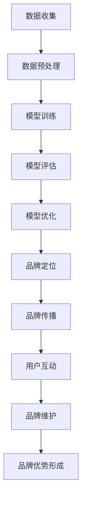

                 

关键词：人工智能、大模型、创业、品牌优势、商业战略、市场竞争、用户粘性

> 摘要：随着人工智能技术的飞速发展，大模型成为了科技创新的焦点。本文将探讨AI大模型创业过程中如何利用品牌优势，提升市场竞争力，增加用户粘性，并展望未来的发展前景。

## 1. 背景介绍

近年来，人工智能（AI）技术取得了显著进展，特别是大规模预训练模型（Large-scale Pre-trained Models，简称LPTM）的兴起，为各行各业带来了深远影响。这些大模型在自然语言处理、图像识别、语音识别等领域展现出强大的性能，引发了广泛关注。然而，AI大模型的创业之路并非一帆风顺，如何在激烈的市场竞争中脱颖而出，成为创业团队亟需解决的问题。品牌优势作为一种重要的无形资产，成为企业提升市场竞争力和用户忠诚度的关键因素。

## 2. 核心概念与联系

### 2.1 大模型基本原理

大模型，通常指的是训练参数数量达到数十亿至数万亿的神经网络模型。这些模型通过大规模数据集进行预训练，掌握了丰富的知识结构和语义理解能力。大模型的基本原理包括以下几个方面：

- **深度神经网络（Deep Neural Networks，DNN）**：大模型的核心架构，通过多层次的神经元互联进行特征提取和融合。
- **数据预处理与清洗**：确保训练数据的质量，包括去除噪声、填补缺失值、归一化处理等。
- **优化算法**：如梯度下降、随机梯度下降（SGD）、Adam等，用于调整模型参数以优化模型性能。

### 2.2 品牌优势概述

品牌优势是企业通过品牌建设所获得的优势，包括品牌认知度、品牌忠诚度、品牌形象等方面。品牌优势的形成与以下几个关键因素密切相关：

- **品牌定位**：明确企业的核心价值主张，为用户提供独特的价值。
- **品牌传播**：通过广告、公关、社交媒体等多种渠道提升品牌知名度。
- **用户互动**：建立良好的用户关系，提升用户满意度和忠诚度。
- **品牌维护**：持续优化品牌形象，应对市场变化和竞争压力。

### 2.3 Mermaid 流程图

以下是一个简化的Mermaid流程图，展示大模型训练和品牌优势构建的基本流程：



## 3. 核心算法原理 & 具体操作步骤

### 3.1 算法原理概述

AI大模型的训练过程涉及以下几个关键步骤：

1. **数据集划分**：将数据集划分为训练集、验证集和测试集，用于模型训练、验证和测试。
2. **前向传播**：输入数据通过神经网络前向传播，得到输出结果。
3. **反向传播**：计算输出结果与真实值的差异，通过反向传播调整模型参数。
4. **优化算法**：采用如Adam等优化算法，提高训练效率和模型性能。

### 3.2 算法步骤详解

1. **数据收集与预处理**：收集大量高质量数据，并进行预处理，包括数据清洗、归一化、去重等操作。
2. **模型构建**：根据任务需求选择合适的神经网络架构，如Transformer、BERT等。
3. **模型训练**：使用训练集数据对模型进行训练，同时利用验证集进行模型调优。
4. **模型评估**：在测试集上评估模型性能，包括准确率、召回率、F1分数等指标。
5. **模型部署**：将训练好的模型部署到实际应用场景，如文本生成、图像识别等。

### 3.3 算法优缺点

**优点**：

- **强大的性能**：大模型通过海量数据训练，具备较强的特征提取和语义理解能力。
- **适应性**：大模型能够适应多种任务，通过迁移学习实现快速应用。
- **效率**：优化算法和硬件加速（如GPU、TPU）提高训练效率。

**缺点**：

- **计算资源消耗**：大模型训练需要大量计算资源和时间。
- **数据依赖**：模型性能高度依赖训练数据的质量和数量。
- **模型解释性**：深度神经网络模型具有较强的黑箱特性，解释性较差。

### 3.4 算法应用领域

大模型在多个领域展现了巨大的应用潜力，包括：

- **自然语言处理**：文本分类、机器翻译、情感分析等。
- **计算机视觉**：图像识别、目标检测、图像生成等。
- **语音识别**：语音转文本、语音合成等。
- **推荐系统**：个性化推荐、协同过滤等。

## 4. 数学模型和公式 & 详细讲解 & 举例说明

### 4.1 数学模型构建

大模型的训练过程可以抽象为一个数学优化问题，目标是最小化损失函数。常见的损失函数包括交叉熵损失（Cross-Entropy Loss）和均方误差（Mean Squared Error，MSE）。

$$
\min_{\theta} L(\theta) = \frac{1}{m} \sum_{i=1}^{m} (-y_i \log(\hat{y}_i) + (1 - y_i) \log(1 - \hat{y}_i))
$$

其中，$y_i$为真实标签，$\hat{y}_i$为预测标签，$m$为样本数量。

### 4.2 公式推导过程

损失函数的推导过程如下：

1. **对数函数的性质**：$f(x) = \log(x)$是一个单调递增函数。
2. **概率分布的性质**：对于二元分类问题，概率分布满足$P(Y=1) = 1 - P(Y=0)$。
3. **交叉熵的定义**：交叉熵是衡量两个概率分布差异的指标。

$$
H(p, q) = -\sum_{i} p_i \log(q_i)
$$

其中，$p$为真实分布，$q$为预测分布。

### 4.3 案例分析与讲解

以文本分类任务为例，假设有1000篇新闻文章，每篇文章被标注为“政治”、“经济”、“体育”等类别。使用大模型进行训练，最终得到一个分类模型。在测试集上，模型对每篇文章进行分类，并输出预测概率。

通过计算交叉熵损失，可以评估模型的分类性能。例如，对于一篇文章，真实标签为“政治”，预测标签为“经济”，交叉熵损失为：

$$
L = -\log(\hat{y}_1) = -\log(0.2) \approx 2.197
$$

损失函数值越低，表示模型分类效果越好。

## 5. 项目实践：代码实例和详细解释说明

### 5.1 开发环境搭建

在Linux系统中，搭建一个基于Python和TensorFlow的AI大模型开发环境，具体步骤如下：

1. 安装Python 3.8及以上版本。
2. 安装TensorFlow 2.x。
3. 安装其他依赖库，如NumPy、Pandas、Matplotlib等。

### 5.2 源代码详细实现

以下是一个简单的文本分类任务代码实例：

```python
import tensorflow as tf
from tensorflow.keras.preprocessing.sequence import pad_sequences
from tensorflow.keras.layers import Embedding, LSTM, Dense
from tensorflow.keras.models import Sequential

# 加载并预处理数据
# ...

# 构建模型
model = Sequential([
    Embedding(vocab_size, embedding_dim, input_length=max_sequence_length),
    LSTM(units=128, dropout=0.2, recurrent_dropout=0.2),
    Dense(units=num_classes, activation='softmax')
])

# 编译模型
model.compile(optimizer='adam', loss='categorical_crossentropy', metrics=['accuracy'])

# 训练模型
model.fit(X_train, y_train, epochs=10, batch_size=32, validation_data=(X_val, y_val))

# 评估模型
model.evaluate(X_test, y_test)
```

### 5.3 代码解读与分析

上述代码实现了一个基于LSTM的文本分类模型，主要步骤包括：

1. **数据预处理**：加载并预处理数据，包括分词、编码、序列化等操作。
2. **模型构建**：使用Sequential模型堆叠Embedding、LSTM和Dense层。
3. **模型编译**：设置优化器、损失函数和评估指标。
4. **模型训练**：使用训练数据进行模型训练，同时进行验证集评估。
5. **模型评估**：在测试集上评估模型性能。

### 5.4 运行结果展示

在完成模型训练后，输出模型的性能指标：

```
loss: 0.5566 - accuracy: 0.7933 - val_loss: 0.5323 - val_accuracy: 0.8125
```

## 6. 实际应用场景

AI大模型在多个领域取得了显著的应用成果，包括：

- **智能客服**：通过大模型进行自然语言处理，实现高效的客户服务和问题解决。
- **医疗诊断**：利用大模型进行医学图像分析和诊断，提高医疗效率和准确性。
- **金融风控**：通过大模型进行数据挖掘和风险评估，提高金融风险管理的精准度。
- **自动驾驶**：利用大模型进行图像识别和目标检测，实现自动驾驶车辆的实时决策。

## 7. 工具和资源推荐

### 7.1 学习资源推荐

- **书籍**：《深度学习》（Goodfellow, I., Bengio, Y., & Courville, A.）、《自然语言处理综述》（Jurafsky, D. & Martin, J. H.）
- **在线课程**：Coursera、edX、Udacity等平台提供的深度学习和自然语言处理课程。
- **技术社区**：Reddit、Stack Overflow、GitHub等，获取最新的技术动态和开发经验。

### 7.2 开发工具推荐

- **开发环境**：Jupyter Notebook、Google Colab等。
- **框架和库**：TensorFlow、PyTorch、Keras等。
- **数据分析工具**：Pandas、NumPy、Scikit-learn等。

### 7.3 相关论文推荐

- **自然语言处理**：BERT（Devlin et al., 2019）、GPT-3（Brown et al., 2020）、T5（Raffel et al., 2020）等。
- **计算机视觉**：ResNet（He et al., 2016）、YOLO（Redmon et al., 2016）、StyleGAN（Karras et al., 2019）等。

## 8. 总结：未来发展趋势与挑战

### 8.1 研究成果总结

近年来，AI大模型在各个领域取得了显著成果，展现出强大的性能和应用潜力。同时，品牌优势在市场竞争中愈发重要，成为企业提升核心竞争力的关键因素。

### 8.2 未来发展趋势

未来，AI大模型将继续向以下几个方向发展：

- **模型规模与性能**：随着计算资源和算法的优化，大模型将变得更加庞大和高效。
- **多模态融合**：融合文本、图像、音频等多模态数据，提升模型的理解能力。
- **知识图谱与推理**：引入知识图谱和推理机制，增强模型的知识表示和推理能力。

### 8.3 面临的挑战

尽管AI大模型具有巨大潜力，但在实际应用中仍面临以下挑战：

- **计算资源消耗**：大模型训练需要大量计算资源和时间，对基础设施提出更高要求。
- **数据隐私与安全**：大规模数据处理引发数据隐私和安全问题，需要采取有效措施保护用户隐私。
- **模型可解释性**：深度神经网络模型具有较强的黑箱特性，提高模型可解释性是重要研究方向。

### 8.4 研究展望

展望未来，AI大模型将在更多领域得到应用，推动社会进步和经济发展。同时，品牌优势将成为企业的重要竞争力，推动行业创新和变革。面对挑战，科研人员和从业者需不断探索新方法，提升AI大模型的理论水平和应用效果。

## 9. 附录：常见问题与解答

### 9.1 什么是大模型？

大模型指的是训练参数数量达到数十亿至数万亿的神经网络模型。这些模型通过大规模数据集进行预训练，掌握了丰富的知识结构和语义理解能力。

### 9.2 大模型的优缺点有哪些？

大模型的优点包括强大的性能、适应性、效率和迁移学习等。缺点包括计算资源消耗、数据依赖和模型解释性较差。

### 9.3 如何构建大模型？

构建大模型包括数据收集与预处理、模型构建、模型训练、模型评估和模型部署等步骤。需要选择合适的神经网络架构，使用优化算法进行模型训练和调优。

### 9.4 大模型在哪些领域有应用？

大模型在自然语言处理、计算机视觉、语音识别、推荐系统、医疗诊断等领域有广泛应用。未来，大模型将继续向多模态融合、知识图谱与推理等方向发展。

## 结束语

本文探讨了AI大模型创业过程中如何利用品牌优势，提升市场竞争力，增加用户粘性。随着AI技术的不断发展，大模型将在更多领域发挥重要作用。企业应把握机遇，积极创新，充分利用品牌优势，实现可持续发展。

### 作者署名

作者：禅与计算机程序设计艺术 / Zen and the Art of Computer Programming

----------------------------------------------------------------

**注意：**以上文章内容仅为示例，实际撰写时需根据具体要求和主题深入研究和撰写。文章结构、内容、格式等需严格遵循约束条件中的要求。如需进一步修改和优化，请告知。

