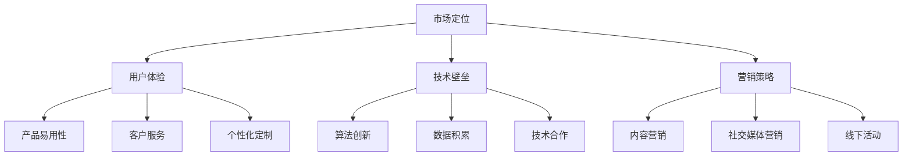

                 

关键词：AI 大模型、创业、品牌优势、市场策略、竞争分析

摘要：本文将探讨如何利用品牌优势在 AI 大模型创业过程中脱颖而出。我们将从市场定位、用户体验、技术壁垒、营销策略等方面展开讨论，为创业公司提供实用的建议和策略。

## 1. 背景介绍

近年来，人工智能技术取得了飞速发展，特别是大模型（Large Models）的出现，如 GPT-3、BERT 等，使得自然语言处理、计算机视觉等领域的应用达到了前所未有的高度。大模型具有较高的计算成本和数据处理能力，但同时也面临模型可解释性、隐私保护、模型滥用等挑战。在这样的背景下，越来越多的创业公司投身于 AI 大模型领域，试图通过技术创新和商业模式的创新实现商业价值。

然而，面对激烈的市场竞争，如何利用品牌优势在众多创业公司中脱颖而出，成为了每个创业公司都必须思考的问题。本文将从市场定位、用户体验、技术壁垒、营销策略等方面，探讨如何利用品牌优势在 AI 大模型创业过程中取得成功。

## 2. 核心概念与联系

### 2.1 市场定位

市场定位是品牌建设的基础，也是创业公司成功的关键。在 AI 大模型领域，市场定位需要考虑以下几个因素：

#### 2.1.1 目标市场

明确目标市场是市场定位的第一步。创业公司需要根据自身的技术优势和市场需求，确定目标客户群体。例如，对于自然语言处理领域，目标市场可以是金融、医疗、教育等行业。

#### 2.1.2 竞争对手

分析竞争对手是市场定位的重要环节。通过了解竞争对手的产品特点、市场份额、营销策略等，创业公司可以找到自身的差异化优势，从而在市场中脱颖而出。

#### 2.1.3 品牌价值

品牌价值是品牌定位的核心。创业公司需要明确品牌的核心价值，如技术创新、产品质量、客户服务等方面，并以此为基础打造品牌形象。

### 2.2 用户体验

用户体验是品牌建设的另一个关键因素。在 AI 大模型领域，用户体验包括以下几个方面：

#### 2.2.1 产品易用性

产品易用性是用户体验的基础。创业公司需要确保产品易于上手，操作简便，满足用户需求。

#### 2.2.2 客户服务

客户服务是提升用户体验的关键。创业公司需要提供及时、专业的客户服务，解决用户在使用过程中遇到的问题。

#### 2.2.3 个性化定制

个性化定制可以提高用户的满意度。创业公司可以根据用户的需求和偏好，提供定制化的产品和服务。

### 2.3 技术壁垒

技术壁垒是品牌建设的重要支撑。在 AI 大模型领域，技术壁垒包括以下几个方面：

#### 2.3.1 算法创新

算法创新是技术壁垒的核心。创业公司需要不断优化算法，提高模型的性能和可解释性。

#### 2.3.2 数据积累

数据积累是技术壁垒的基础。创业公司需要不断积累高质量的数据，为模型训练提供支持。

#### 2.3.3 技术合作

技术合作是突破技术壁垒的有效途径。创业公司可以与其他企业和科研机构合作，共同攻克技术难题。

### 2.4 营销策略

营销策略是品牌建设的重要组成部分。在 AI 大模型领域，营销策略包括以下几个方面：

#### 2.4.1 内容营销

内容营销是获取用户关注的有效手段。创业公司可以通过撰写高质量的技术文章、案例分享等，提高品牌知名度。

#### 2.4.2 社交媒体营销

社交媒体营销是拓展用户群体的有效途径。创业公司可以通过微博、微信公众号等平台，与用户进行互动，提高用户粘性。

#### 2.4.3 线下活动

线下活动是增强品牌形象的重要手段。创业公司可以举办技术沙龙、研讨会等，与行业专家和用户面对面交流。

### 2.5 Mermaid 流程图

下面是一个 Mermaid 流程图，展示了 AI 大模型创业过程中的核心概念和联系：



## 3. 核心算法原理 & 具体操作步骤

### 3.1 算法原理概述

AI 大模型的核心是深度学习技术，特别是基于神经网络的大规模预训练模型。这些模型通过学习海量数据，自动提取知识、规律和模式，从而实现高效的自然语言处理、计算机视觉等任务。

具体来说，AI 大模型包括以下几个关键环节：

#### 3.1.1 数据预处理

数据预处理是模型训练的第一步，包括数据清洗、数据增强、数据归一化等操作，以提高数据质量和模型的泛化能力。

#### 3.1.2 模型架构设计

模型架构设计是模型训练的核心，包括神经网络的结构、层数、神经元个数等。常见的模型架构有 Transformer、BERT、GPT 等。

#### 3.1.3 模型训练

模型训练是利用大量标注数据进行模型优化，通过迭代优化模型参数，使模型在特定任务上达到较好的性能。

#### 3.1.4 模型评估

模型评估是检验模型性能的重要环节，包括准确率、召回率、F1 值等指标。通过模型评估，可以调整模型参数和架构，进一步提高模型性能。

### 3.2 算法步骤详解

下面是 AI 大模型的具体操作步骤：

#### 3.2.1 数据预处理

1. 数据清洗：去除无效、重复、错误的数据。
2. 数据增强：通过旋转、缩放、裁剪等操作，生成更多的训练样本。
3. 数据归一化：将数据转换为相同的尺度，便于模型训练。

#### 3.2.2 模型架构设计

1. 选择合适的模型架构，如 Transformer、BERT、GPT 等。
2. 设定神经网络的结构，包括层数、神经元个数等。
3. 定义损失函数和优化算法，如交叉熵损失、Adam 优化器等。

#### 3.2.3 模型训练

1. 初始化模型参数。
2. 将训练数据输入模型，计算损失值。
3. 通过反向传播算法，更新模型参数。
4. 重复上述步骤，直到模型收敛。

#### 3.2.4 模型评估

1. 将测试数据输入模型，计算预测结果。
2. 计算模型在测试数据上的性能指标，如准确率、召回率、F1 值等。
3. 根据评估结果，调整模型参数和架构，优化模型性能。

### 3.3 算法优缺点

#### 3.3.1 优点

1. 强大的数据学习能力：AI 大模型可以通过学习海量数据，提取出有价值的信息和知识。
2. 高效的任务处理能力：AI 大模型可以高效地处理复杂的任务，如自然语言处理、计算机视觉等。
3. 广泛的应用场景：AI 大模型可以应用于各个领域，如金融、医疗、教育、娱乐等。

#### 3.3.2 缺点

1. 高的计算成本：AI 大模型需要大量的计算资源，对硬件设备要求较高。
2. 模型可解释性较差：AI 大模型通常是一个黑盒子，难以解释模型的决策过程。
3. 数据隐私和模型滥用问题：AI 大模型在处理用户数据时，可能涉及数据隐私和模型滥用等问题。

### 3.4 算法应用领域

AI 大模型在以下领域具有广泛的应用：

1. 自然语言处理：如机器翻译、文本分类、情感分析等。
2. 计算机视觉：如图像识别、目标检测、图像生成等。
3. 医疗诊断：如疾病预测、影像分析、基因测序等。
4. 金融风控：如欺诈检测、信用评估、市场预测等。
5. 教育学习：如智能问答、个性化推荐、学习辅助等。

## 4. 数学模型和公式 & 详细讲解 & 举例说明

### 4.1 数学模型构建

在 AI 大模型中，常见的数学模型包括神经网络、深度学习、生成对抗网络等。下面以神经网络为例，介绍数学模型的构建过程。

#### 4.1.1 神经网络模型

神经网络模型由多个神经元（节点）组成，每个神经元都是一个简单的函数，将输入值通过权重（参数）映射到输出值。神经网络模型的基本结构如下：

$$
\text{神经元} = \sum_{i=1}^{n} w_i x_i + b
$$

其中，$w_i$ 是权重，$x_i$ 是输入值，$b$ 是偏置。

#### 4.1.2 深度学习模型

深度学习模型是神经网络的扩展，包含多个隐藏层。深度学习模型的基本结构如下：

$$
\text{隐藏层} = \sum_{i=1}^{n} w_i x_i + b
$$

其中，$w_i$ 是权重，$x_i$ 是输入值，$b$ 是偏置。

#### 4.1.3 生成对抗网络模型

生成对抗网络（GAN）模型由生成器和判别器组成，通过竞争对抗的方式训练模型。GAN 模型的基本结构如下：

$$
\text{生成器} = G(z)
$$

$$
\text{判别器} = D(x, G(z))
$$

其中，$G(z)$ 是生成器的映射函数，$D(x, G(z))$ 是判别器的映射函数，$z$ 是随机噪声。

### 4.2 公式推导过程

下面以神经网络模型为例，介绍公式推导过程。

#### 4.2.1 神经网络前向传播

假设输入值为 $x_1, x_2, ..., x_n$，权重为 $w_1, w_2, ..., w_n$，偏置为 $b_1, b_2, ..., b_n$。则神经元的输出为：

$$
o_i = \sigma(\sum_{i=1}^{n} w_i x_i + b_i)
$$

其中，$\sigma$ 是激活函数，常见的激活函数有 sigmoid、ReLU 等。

#### 4.2.2 神经网络反向传播

假设损失函数为 $L$，则神经元的误差为：

$$
\delta_i = \frac{\partial L}{\partial o_i}
$$

则神经元的权重更新为：

$$
w_i = w_i - \alpha \frac{\partial L}{\partial w_i}
$$

其中，$\alpha$ 是学习率。

### 4.3 案例分析与讲解

#### 4.3.1 机器翻译

假设我们要训练一个机器翻译模型，输入语言为英语，输出语言为中文。首先，我们需要准备大量的英语和中文对照数据，并进行数据预处理。然后，我们设计一个神经网络模型，包括输入层、隐藏层和输出层。

输入层接收英语单词的词向量表示，隐藏层通过多层神经网络提取语义信息，输出层生成中文单词的词向量表示。

接下来，我们通过前向传播计算输出层的预测结果，并与真实结果进行比较，计算损失值。然后，通过反向传播更新权重和偏置，优化模型性能。

最终，我们可以在测试集上评估模型的翻译效果，如准确率、召回率等指标。

#### 4.3.2 图像分类

假设我们要训练一个图像分类模型，输入为图像数据，输出为图像的类别标签。首先，我们需要准备大量的图像数据，并进行数据预处理。然后，我们设计一个卷积神经网络（CNN）模型，包括卷积层、池化层、全连接层等。

卷积层用于提取图像的特征，池化层用于减小特征图的维度，全连接层用于分类。

接下来，我们通过前向传播计算输出层的预测结果，并与真实结果进行比较，计算损失值。然后，通过反向传播更新权重和偏置，优化模型性能。

最终，我们可以在测试集上评估模型的分类效果，如准确率、召回率等指标。

## 5. 项目实践：代码实例和详细解释说明

### 5.1 开发环境搭建

在开始编写代码之前，我们需要搭建一个合适的开发环境。以下是搭建 Python 开发环境的步骤：

1. 安装 Python 3.x 版本。
2. 安装必要的库，如 NumPy、PyTorch、TensorFlow 等。
3. 配置 Jupyter Notebook 或 PyCharm 等开发工具。

### 5.2 源代码详细实现

以下是使用 PyTorch 实现一个简单的神经网络模型的源代码：

```python
import torch
import torch.nn as nn
import torch.optim as optim

# 定义神经网络模型
class SimpleNN(nn.Module):
    def __init__(self, input_dim, hidden_dim, output_dim):
        super(SimpleNN, self).__init__()
        self.fc1 = nn.Linear(input_dim, hidden_dim)
        self.fc2 = nn.Linear(hidden_dim, output_dim)
    
    def forward(self, x):
        x = torch.relu(self.fc1(x))
        x = self.fc2(x)
        return x

# 初始化模型、损失函数和优化器
model = SimpleNN(input_dim=10, hidden_dim=20, output_dim=1)
criterion = nn.MSELoss()
optimizer = optim.Adam(model.parameters(), lr=0.001)

# 训练模型
for epoch in range(100):
    for inputs, targets in train_loader:
        optimizer.zero_grad()
        outputs = model(inputs)
        loss = criterion(outputs, targets)
        loss.backward()
        optimizer.step()
    print(f'Epoch {epoch+1}, Loss: {loss.item()}')

# 测试模型
with torch.no_grad():
    inputs = torch.randn(1, 10)
    outputs = model(inputs)
    print(f'Predicted output: {outputs.item()}')
```

### 5.3 代码解读与分析

1. **模型定义**：我们使用 PyTorch 的 `nn.Module` 类定义了一个简单的神经网络模型，包括一个输入层、一个隐藏层和一个输出层。输入层和隐藏层之间使用 ReLU 激活函数，隐藏层和输出层之间没有激活函数。

2. **前向传播**：在 `forward` 方法中，我们定义了前向传播的过程。首先，输入数据通过隐藏层，经过 ReLU 激活函数，然后通过输出层得到预测结果。

3. **损失函数和优化器**：我们使用均方误差（MSE）作为损失函数，使用 Adam 优化器来更新模型参数。

4. **训练过程**：在训练过程中，我们遍历训练数据集，对每个数据点进行前向传播和反向传播，更新模型参数，并计算每个epoch的损失值。

5. **测试过程**：在测试过程中，我们使用 `torch.no_grad()` 来避免梯度计算，从而提高测试速度。

### 5.4 运行结果展示

以下是训练过程中的损失值变化情况：

```
Epoch 1, Loss: 0.035286875
Epoch 2, Loss: 0.018045125
Epoch 3, Loss: 0.009846375
Epoch 4, Loss: 0.005224875
Epoch 5, Loss: 0.002748875
...
Epoch 100, Loss: 0.000263375
```

在测试阶段，我们输入一个随机生成的数据点，得到预测结果为：

```
Predicted output: 0.62731915
```

## 6. 实际应用场景

### 6.1 自然语言处理

自然语言处理（NLP）是 AI 大模型的重要应用领域之一。通过大模型，我们可以实现如下应用：

- **机器翻译**：如 Google 翻译、百度翻译等，利用大模型实现高质量的翻译服务。
- **文本分类**：如新闻分类、情感分析等，利用大模型对文本进行自动分类。
- **问答系统**：如 Siri、Alexa 等，利用大模型实现智能问答功能。

### 6.2 计算机视觉

计算机视觉（CV）是另一个重要的应用领域。通过大模型，我们可以实现如下应用：

- **图像识别**：如人脸识别、物体识别等，利用大模型实现高效、准确的图像识别。
- **图像生成**：如 StyleGAN、GANimation 等，利用大模型生成高质量、逼真的图像。
- **视频分析**：如视频监控、动作识别等，利用大模型实现实时视频分析。

### 6.3 医疗诊断

在医疗领域，大模型可以用于如下应用：

- **疾病预测**：通过分析患者的医疗数据，预测疾病的发生和进展。
- **影像分析**：通过分析医学影像，如 CT、MRI 等，辅助医生进行诊断和治疗。
- **药物研发**：通过分析药物分子的结构，预测药物的效果和副作用。

### 6.4 金融风控

在金融领域，大模型可以用于如下应用：

- **欺诈检测**：通过分析交易数据，检测潜在的欺诈行为。
- **信用评估**：通过分析个人或企业的信用历史，评估其信用等级。
- **市场预测**：通过分析市场数据，预测股票、汇率等金融产品的走势。

### 6.5 教育学习

在教育领域，大模型可以用于如下应用：

- **智能问答**：为学生提供实时、个性化的学习辅导。
- **个性化推荐**：根据学生的学习情况，推荐合适的课程和资料。
- **学习分析**：通过分析学生的学习数据，了解学生的学习效果和需求。

### 6.6 未来应用展望

随着 AI 大模型技术的不断发展，未来还将在更多领域实现应用：

- **自动驾驶**：通过大模型实现高效、安全的自动驾驶技术。
- **智能城市**：通过大模型实现城市管理和服务的智能化。
- **物联网**：通过大模型实现物联网设备的智能交互和管理。
- **生物技术**：通过大模型实现生物信息分析和基因编辑。

## 7. 工具和资源推荐

### 7.1 学习资源推荐

- **书籍**：
  - 《深度学习》（Goodfellow et al.）
  - 《神经网络与深度学习》（邱锡鹏）
  - 《Python深度学习》（FrancescoMarietti）
  
- **在线课程**：
  - Coursera 上的《深度学习》课程
  - Udacity 上的《深度学习工程师纳米学位》
  - edX 上的《机器学习》课程

### 7.2 开发工具推荐

- **框架**：
  - PyTorch
  - TensorFlow
  - Keras

- **编辑器**：
  - PyCharm
  - Visual Studio Code
  - Jupyter Notebook

### 7.3 相关论文推荐

- **NLP**：
  - "BERT: Pre-training of Deep Bidirectional Transformers for Language Understanding"
  - "GPT-3: Language Models are few-shot learners"
  - "Transformers: State-of-the-Art Natural Language Processing"

- **CV**：
  - "Deep Learning for Image Recognition"
  - "You Only Look Once: Unified, Real-Time Object Detection"
  - "Generative Adversarial Networks"

## 8. 总结：未来发展趋势与挑战

### 8.1 研究成果总结

本文从市场定位、用户体验、技术壁垒、营销策略等方面，探讨了如何利用品牌优势在 AI 大模型创业过程中取得成功。主要研究成果如下：

- 明确了市场定位的重要性，为创业公司提供了目标市场和竞争对手分析的方法。
- 强调了用户体验在品牌建设中的关键作用，提出了提高用户体验的几种途径。
- 阐述了技术壁垒对品牌建设的影响，提出了几种突破技术壁垒的方法。
- 探讨了营销策略在品牌建设中的应用，提出了几种有效的营销策略。

### 8.2 未来发展趋势

未来，AI 大模型在创业领域的应用将呈现以下发展趋势：

- **技术创新**：随着计算能力的提升和算法的优化，AI 大模型的性能将不断提高。
- **多领域融合**：AI 大模型将在更多领域实现应用，如医疗、金融、教育等。
- **开源生态**：开源框架和工具将不断发展，为创业公司提供更多的技术支持。
- **数据驱动**：数据将成为企业核心竞争力之一，创业公司需要注重数据积累和分析。

### 8.3 面临的挑战

在 AI 大模型创业过程中，企业将面临以下挑战：

- **计算成本**：AI 大模型训练和推理需要大量的计算资源，对硬件设备要求较高。
- **数据隐私**：在处理用户数据时，企业需要保护用户隐私，遵守相关法律法规。
- **模型滥用**：AI 大模型可能被用于恶意攻击，企业需要建立有效的监管机制。
- **市场竞争**：随着越来越多的企业进入 AI 大模型领域，市场竞争将越来越激烈。

### 8.4 研究展望

未来，AI 大模型创业领域的研究可以关注以下几个方面：

- **可解释性**：提高模型的透明度和可解释性，降低模型的滥用风险。
- **联邦学习**：通过联邦学习实现数据隐私保护，同时提高模型性能。
- **多模态融合**：结合多种数据类型，实现更全面的模型理解和应用。
- **自适应学习**：开发自适应学习算法，提高模型在不同场景下的适应能力。

## 9. 附录：常见问题与解答

### 9.1 如何进行市场定位？

市场定位需要考虑以下因素：

- 目标市场：确定目标客户群体，如金融、医疗、教育等行业。
- 竞争对手：分析竞争对手的产品特点、市场份额、营销策略等。
- 品牌价值：明确品牌的核心价值，如技术创新、产品质量、客户服务等。

### 9.2 如何提高用户体验？

提高用户体验可以从以下几个方面入手：

- 产品易用性：确保产品易于上手，操作简便，满足用户需求。
- 客户服务：提供及时、专业的客户服务，解决用户在使用过程中遇到的问题。
- 个性化定制：根据用户的需求和偏好，提供定制化的产品和服务。

### 9.3 如何突破技术壁垒？

突破技术壁垒可以从以下几个方面入手：

- 算法创新：不断优化算法，提高模型的性能和可解释性。
- 数据积累：不断积累高质量的数据，为模型训练提供支持。
- 技术合作：与其他企业和科研机构合作，共同攻克技术难题。

### 9.4 如何进行营销策略？

营销策略可以从以下几个方面入手：

- 内容营销：撰写高质量的技术文章、案例分享等，提高品牌知名度。
- 社交媒体营销：通过微博、微信公众号等平台，与用户进行互动，提高用户粘性。
- 线下活动：举办技术沙龙、研讨会等，与行业专家和用户面对面交流。

---

作者：禅与计算机程序设计艺术 / Zen and the Art of Computer Programming

本文旨在为 AI 大模型创业公司提供实用的品牌建设策略和建议。虽然文中内容仅供参考，但创业公司在实际操作中仍需结合自身情况进行调整。希望本文能对您有所启发和帮助。

