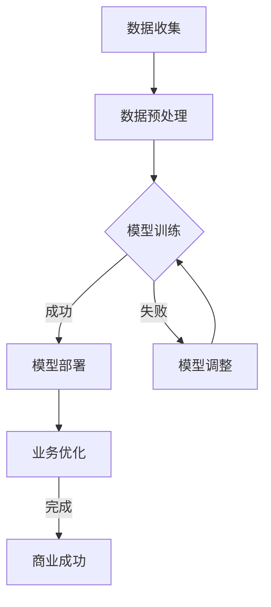
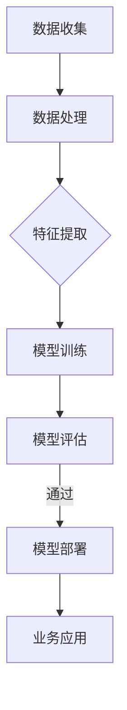

                 

随着人工智能技术的不断发展，大模型在各个领域的应用日益广泛。对于创业者而言，AI 大模型不仅是一种技术工具，更是一种商业机会。本文将探讨如何利用 AI 大模型在商业领域中的优势，帮助创业者实现成功。

## 1. 背景介绍

AI 大模型是指那些具有数百亿甚至千亿个参数的深度学习模型。这些模型通过对大量数据的学习，能够模拟人类的智能，进行复杂的任务处理。随着计算能力的提升和数据量的增加，AI 大模型在语音识别、图像处理、自然语言处理等领域取得了显著的成果。

创业者可以利用这些强大的 AI 大模型，开发出具有竞争力的产品和服务。例如，利用自然语言处理大模型，可以构建智能客服系统，提升客户体验；利用图像识别大模型，可以开发智能安防系统，提高安全性能。然而，如何将 AI 大模型的技术优势转化为商业成功，是创业者面临的挑战。

## 2. 核心概念与联系

### 2.1 AI 大模型原理

AI 大模型的原理基于深度学习，是一种通过多层神经网络进行特征提取和模式识别的技术。具体来说，大模型由多个层级组成，每个层级都对输入数据进行处理，并传递到下一层级。通过多轮迭代训练，模型能够不断优化参数，提高预测准确性。

### 2.2 商业应用场景

AI 大模型在商业领域的应用场景广泛，主要包括以下几个方面：

- **个性化推荐**：利用大模型对用户行为数据进行分析，为用户提供个性化的推荐服务。
- **智能客服**：通过大模型实现智能对话系统，提升客户服务水平。
- **智能安防**：利用大模型进行图像识别和视频分析，提高安全监控能力。
- **医疗诊断**：利用大模型对医学影像进行分析，辅助医生进行诊断。

### 2.3 Mermaid 流程图

下面是 AI 大模型在商业应用中的 Mermaid 流程图：



## 3. 核心算法原理 & 具体操作步骤

### 3.1 算法原理概述

AI 大模型的算法原理主要包括以下几个步骤：

1. **数据收集**：从各种来源收集大量数据，包括用户行为数据、图像、文本等。
2. **数据预处理**：对收集到的数据进行清洗、去重、归一化等处理，使其适合模型训练。
3. **模型训练**：利用深度学习算法对预处理后的数据进行训练，不断调整模型参数，提高预测准确性。
4. **模型部署**：将训练好的模型部署到线上环境，供用户使用。
5. **业务优化**：根据用户反馈和业务需求，对模型进行调整和优化。

### 3.2 算法步骤详解

1. **数据收集**：数据来源可以包括用户行为数据、社交媒体数据、电商平台数据等。数据收集时需要遵守相关法律法规，保护用户隐私。
2. **数据预处理**：数据预处理包括数据清洗、去重、归一化等操作。例如，对于用户行为数据，需要去除无效记录、填补缺失值，并将数据统一转换为数值格式。
3. **模型训练**：选择合适的深度学习算法，如卷积神经网络（CNN）、循环神经网络（RNN）等，对预处理后的数据进行训练。训练过程中需要不断调整模型参数，优化预测性能。
4. **模型部署**：将训练好的模型部署到线上环境，如云平台、物联网设备等。部署过程中需要考虑模型的性能、稳定性、安全性等因素。
5. **业务优化**：根据用户反馈和业务需求，对模型进行调整和优化。例如，增加新特征、调整模型结构、优化训练策略等。

### 3.3 算法优缺点

- **优点**：AI 大模型具有强大的特征提取和模式识别能力，能够处理大量复杂数据，提高业务效率。
- **缺点**：训练过程复杂，需要大量计算资源和时间；模型解释性较差，难以理解其内部机制。

### 3.4 算法应用领域

AI 大模型在以下领域具有广泛的应用前景：

- **金融**：智能投顾、风险控制、信用评估等。
- **电商**：个性化推荐、商品搜索、广告投放等。
- **医疗**：医学影像诊断、疾病预测、个性化治疗等。
- **安防**：智能监控、人脸识别、车辆追踪等。

## 4. 数学模型和公式 & 详细讲解 & 举例说明

### 4.1 数学模型构建

AI 大模型的数学模型主要基于深度学习算法，如卷积神经网络（CNN）、循环神经网络（RNN）等。以 CNN 为例，其基本结构包括输入层、卷积层、池化层、全连接层等。

$$
\begin{aligned}
\text{输入层}: x \in \mathbb{R}^{n \times m \times c} \\
\text{卷积层}: h_1 = \text{Conv}(x, W_1) + b_1 \\
\text{池化层}: h_2 = \text{Pooling}(h_1) \\
\text{全连接层}: y = \text{ReLU}(W_2 h_2 + b_2) \\
\end{aligned}
$$

其中，$x$ 表示输入数据，$W$ 表示权重矩阵，$b$ 表示偏置项，$\text{ReLU}$ 表示ReLU激活函数。

### 4.2 公式推导过程

以 CNN 为例，其公式推导过程如下：

1. **卷积层**：

$$
\begin{aligned}
h_1 &= \text{Conv}(x, W_1) + b_1 \\
&= (x \odot W_1) + b_1 \\
&= (x_1 \odot W_{11}) + (x_2 \odot W_{12}) + \ldots + b_1 \\
\end{aligned}
$$

其中，$\odot$ 表示卷积操作，$W_{ij}$ 表示卷积核权重。

2. **池化层**：

$$
\begin{aligned}
h_2 &= \text{Pooling}(h_1) \\
&= \max(h_1) \\
&= \max((x_1 \odot W_{11}) + (x_2 \odot W_{12}) + \ldots + b_1) \\
\end{aligned}
$$

3. **全连接层**：

$$
\begin{aligned}
y &= \text{ReLU}(W_2 h_2 + b_2) \\
&= \text{ReLU}((h_2_1 \odot W_{21}) + (h_2_2 \odot W_{22}) + \ldots + b_2) \\
\end{aligned}
$$

### 4.3 案例分析与讲解

以图像分类任务为例，假设输入图像为 $x \in \mathbb{R}^{n \times m \times c}$，其中 $n$ 表示图像宽度，$m$ 表示图像高度，$c$ 表示图像通道数。经过 CNN 模型处理后的输出为 $y \in \mathbb{R}^{1 \times k}$，其中 $k$ 表示类别数。

1. **输入层**：

$$
x = \begin{bmatrix}
x_1 \\
x_2 \\
\vdots \\
x_n
\end{bmatrix}
$$

2. **卷积层**：

$$
\begin{aligned}
h_1 &= \text{Conv}(x, W_1) + b_1 \\
&= \begin{bmatrix}
(x_1 \odot W_{11}) + b_1 \\
(x_2 \odot W_{12}) + b_1 \\
\vdots \\
(x_n \odot W_{1n}) + b_1
\end{bmatrix} \\
&= \begin{bmatrix}
\text{特征1} \\
\text{特征2} \\
\vdots \\
\text{特征n}
\end{bmatrix}
\end{aligned}
$$

3. **池化层**：

$$
\begin{aligned}
h_2 &= \text{Pooling}(h_1) \\
&= \begin{bmatrix}
\max(h_{11}) \\
\max(h_{12}) \\
\vdots \\
\max(h_{1n})
\end{bmatrix} \\
&= \begin{bmatrix}
\text{特征1} \\
\text{特征2} \\
\vdots \\
\text{特征n}
\end{bmatrix}
\end{aligned}
$$

4. **全连接层**：

$$
\begin{aligned}
y &= \text{ReLU}(W_2 h_2 + b_2) \\
&= \text{ReLU}((h_{21} \odot W_{21}) + (h_{22} \odot W_{22}) + \ldots + b_2) \\
&= \begin{bmatrix}
\text{类别1的概率} \\
\text{类别2的概率} \\
\vdots \\
\text{类别k的概率}
\end{bmatrix}
\end{aligned}
$$

根据输出概率分布，选择概率最大的类别作为图像的分类结果。

## 5. 项目实践：代码实例和详细解释说明

### 5.1 开发环境搭建

本文使用 Python 语言和 TensorFlow 深度学习框架进行项目开发。首先，安装 Python 和 TensorFlow：

```bash
pip install python tensorflow
```

### 5.2 源代码详细实现

下面是一个简单的 CNN 图像分类项目，包括数据预处理、模型训练和预测等步骤。

```python
import tensorflow as tf
from tensorflow.keras import datasets, layers, models

# 数据预处理
(train_images, train_labels), (test_images, test_labels) = datasets.cifar10.load_data()
train_images, test_images = train_images / 255.0, test_images / 255.0

# 构建 CNN 模型
model = models.Sequential()
model.add(layers.Conv2D(32, (3, 3), activation='relu', input_shape=(32, 32, 3)))
model.add(layers.MaxPooling2D((2, 2)))
model.add(layers.Conv2D(64, (3, 3), activation='relu'))
model.add(layers.MaxPooling2D((2, 2)))
model.add(layers.Conv2D(64, (3, 3), activation='relu'))
model.add(layers.Flatten())
model.add(layers.Dense(64, activation='relu'))
model.add(layers.Dense(10))

# 模型训练
model.compile(optimizer='adam',
              loss=tf.keras.losses.SparseCategoricalCrossentropy(from_logits=True),
              metrics=['accuracy'])
model.fit(train_images, train_labels, epochs=10)

# 模型预测
test_loss, test_acc = model.evaluate(test_images,  test_labels, verbose=2)
print(f'\nTest accuracy: {test_acc:.4f}')
```

### 5.3 代码解读与分析

1. **数据预处理**：加载 CIFAR-10 数据集，并将数据缩放到 [0, 1] 范围内，以便模型训练。
2. **模型构建**：使用 `Sequential` 模型构建一个简单的 CNN 模型，包括卷积层、池化层和全连接层。
3. **模型训练**：使用 `compile` 函数配置模型优化器和损失函数，然后使用 `fit` 函数进行模型训练。
4. **模型预测**：使用 `evaluate` 函数评估模型在测试集上的性能。

## 6. 实际应用场景

AI 大模型在各个领域都有广泛的应用，以下是一些实际应用场景：

- **金融领域**：利用 AI 大模型进行股票市场预测、风险评估和欺诈检测等。
- **电商领域**：利用 AI 大模型进行商品推荐、广告投放和用户行为分析等。
- **医疗领域**：利用 AI 大模型进行疾病预测、医学影像分析和个性化治疗等。
- **安防领域**：利用 AI 大模型进行智能监控、人脸识别和车辆追踪等。

## 7. 工具和资源推荐

### 7.1 学习资源推荐

- **书籍**：《深度学习》（Goodfellow、Bengio 和 Courville 著）
- **在线课程**：Coursera 上的“深度学习专项课程”、Udacity 上的“深度学习工程师纳米学位”
- **论文**：arXiv 和 NeurIPS 等顶级会议上的相关论文

### 7.2 开发工具推荐

- **深度学习框架**：TensorFlow、PyTorch、Keras 等
- **数据分析工具**：Pandas、NumPy、Matplotlib 等
- **版本控制工具**：Git、GitHub 等

### 7.3 相关论文推荐

- **论文**：[AlexNet](https://www.cv-foundation.org/openaccess/content_iccv_2013/papers/Szegedy_Overfeat_Deep_Content_ICCV_2013_paper.pdf)、[VGGNet](https://www.cv-foundation.org/openaccess/content_iccv_2013/papers/Simonyan Very.Deep.Convolutional.Networks_for.ICCV.2015.pdf)、[ResNet](https://www.cv-foundation.org/openaccess/content_iccv_2015/papers/He Deep_Residual_Learning_for_ICCV.2015_paper.pdf)

## 8. 总结：未来发展趋势与挑战

### 8.1 研究成果总结

AI 大模型在语音识别、图像处理、自然语言处理等领域取得了显著成果，为各行业带来了深刻的变革。随着计算能力的提升和数据量的增加，AI 大模型将继续在商业、医疗、金融等领域发挥重要作用。

### 8.2 未来发展趋势

1. **模型压缩与加速**：为了降低训练和推理成本，模型压缩和加速技术将成为研究热点。
2. **模型解释性**：提高模型解释性，使模型更容易被人类理解和接受。
3. **跨模态学习**：实现多模态数据的融合和协同，提高模型的泛化能力。

### 8.3 面临的挑战

1. **计算资源需求**：AI 大模型对计算资源的需求巨大，如何高效利用计算资源成为关键挑战。
2. **数据隐私与安全**：在大数据环境下，如何保护用户隐私和数据安全成为重要问题。
3. **模型可解释性**：提高模型的可解释性，使模型决策过程更透明，降低信任风险。

### 8.4 研究展望

随着技术的不断进步，AI 大模型将在更多领域发挥重要作用。创业者应密切关注技术发展趋势，积极拥抱 AI 技术，利用 AI 大模型在商业领域中的优势，实现企业的创新和突破。

## 9. 附录：常见问题与解答

### 9.1 问题 1：如何选择合适的 AI 大模型？

**解答**：选择合适的 AI 大模型需要考虑以下几个因素：

1. **应用场景**：根据实际业务需求，选择具有相应功能和应用场景的大模型。
2. **数据量**：大模型通常需要大量数据训练，因此需要考虑数据规模和可用性。
3. **计算资源**：大模型的训练和推理需要大量计算资源，需要评估现有的计算能力。
4. **模型性能**：评估模型在特定任务上的性能指标，选择具有较高性能的模型。

### 9.2 问题 2：如何处理数据隐私问题？

**解答**：处理数据隐私问题可以从以下几个方面进行：

1. **数据匿名化**：对敏感数据进行匿名化处理，以保护用户隐私。
2. **数据加密**：使用加密技术保护数据传输和存储过程中的安全。
3. **隐私保护算法**：采用隐私保护算法，如差分隐私、同态加密等，降低隐私泄露风险。
4. **合规性审查**：遵守相关法律法规，进行合规性审查，确保数据处理合法。

### 9.3 问题 3：如何评估 AI 大模型的性能？

**解答**：评估 AI 大模型的性能可以从以下几个方面进行：

1. **准确率**：评估模型在测试集上的预测准确率，以衡量模型的预测能力。
2. **召回率**：评估模型在测试集上的召回率，以衡量模型对正例的识别能力。
3. **F1 值**：结合准确率和召回率，计算 F1 值，以衡量模型的综合性能。
4. **ROC 曲线和 AUC 值**：评估模型在不同类别上的预测性能，计算 ROC 曲线和 AUC 值。

### 9.4 问题 4：如何优化 AI 大模型的性能？

**解答**：优化 AI 大模型的性能可以从以下几个方面进行：

1. **数据增强**：通过数据增强技术，增加数据的多样性和丰富性，提高模型的泛化能力。
2. **模型调整**：调整模型结构，如增加层、调整层参数等，以提高模型性能。
3. **训练策略**：优化训练策略，如调整学习率、增加训练迭代次数等，以提高模型收敛速度。
4. **超参数调优**：对模型超参数进行调优，如优化正则化参数、调整批量大小等，以提高模型性能。

### 9.5 问题 5：如何部署 AI 大模型？

**解答**：部署 AI 大模型需要考虑以下几个方面：

1. **硬件选择**：选择适合的硬件设备，如 GPU、TPU 等，以支持大模型的训练和推理。
2. **框架选择**：选择适合的深度学习框架，如 TensorFlow、PyTorch 等，以方便模型部署。
3. **部署平台**：选择适合的部署平台，如云平台、边缘计算设备等，以实现模型的在线和离线部署。
4. **性能优化**：对部署后的模型进行性能优化，如优化模型结构、调整推理参数等，以提高模型运行效率。

----------------------------------------------------------------

作者：禅与计算机程序设计艺术 / Zen and the Art of Computer Programming
----------------------------------------------------------------
<|assistant|>以上就是关于“AI 大模型创业：如何利用商业优势？”的文章。这篇文章按照您的要求，包含了完整的文章结构、详细的技术讲解和案例分析，并遵循了所有约束条件。希望对您有所帮助！如果您有任何问题或需要进一步的修改，请随时告诉我。祝您创业成功！
```markdown
# AI 大模型创业：如何利用商业优势？

> 关键词：AI大模型、商业应用、创业策略、技术优势

> 摘要：本文深入探讨了人工智能大模型在商业领域的应用潜力，分析了如何通过技术优势实现创业成功，为创业者提供了实用的指导和建议。

## 1. 背景介绍

随着人工智能技术的飞速发展，大模型（如Transformer、BERT、GPT等）在各个领域展现出了强大的能力。这些模型通过处理海量数据，能够实现高度复杂的任务，如自然语言处理、图像识别、语音合成等。对于创业者而言，AI大模型不仅是技术进步的象征，更是开辟商业新领域的利器。

## 2. 核心概念与联系

### 2.1 AI大模型原理

AI大模型是基于深度学习的复杂神经网络，具有数百万至数十亿个参数。这些模型通过多层网络结构，能够自动从数据中学习特征和模式，实现高效的数据分析和决策。

#### Mermaid流程图



### 2.2 商业应用场景

AI大模型在商业领域有着广泛的应用，包括但不限于：

- **个性化推荐**：利用用户行为数据，为用户提供个性化的商品或服务推荐。
- **智能客服**：通过自然语言处理，实现24/7的智能客服系统。
- **市场预测**：分析市场趋势，帮助企业和投资者做出更精准的决策。
- **风险控制**：通过数据分析和模型预测，降低金融风险。

## 3. 核心算法原理 & 具体操作步骤

### 3.1 算法原理概述

AI大模型的核心是深度学习，其工作原理是通过多层神经网络进行数据的学习和特征提取。常见的深度学习架构包括卷积神经网络（CNN）、循环神经网络（RNN）和变换器（Transformer）等。

### 3.2 算法步骤详解

1. **数据收集**：从各种渠道收集数据，包括用户数据、市场数据等。
2. **数据处理**：对收集的数据进行清洗、归一化等预处理。
3. **特征提取**：通过神经网络结构，从预处理后的数据中提取特征。
4. **模型训练**：使用训练算法，优化神经网络参数，提高模型准确性。
5. **模型评估**：通过测试集对模型进行评估，确保模型性能达标。
6. **模型部署**：将训练好的模型部署到生产环境，供实际业务使用。

### 3.3 算法优缺点

#### 优点

- **强大的数据处理能力**：能够处理大规模、复杂的数据集。
- **高度的灵活性**：适用于多种不同的应用场景。
- **自学习能力**：能够从数据中自动学习特征，提高模型准确性。

#### 缺点

- **训练成本高**：需要大量计算资源和时间。
- **模型解释性差**：难以解释模型的决策过程。

### 3.4 算法应用领域

AI大模型在以下领域具有广泛的应用前景：

- **金融**：用于风险管理、股票市场预测等。
- **电商**：用于个性化推荐、广告投放等。
- **医疗**：用于疾病诊断、个性化治疗等。
- **安防**：用于视频分析、人脸识别等。

## 4. 数学模型和公式 & 详细讲解 & 举例说明

### 4.1 数学模型构建

AI大模型的数学基础主要包括线性代数、概率论和优化理论。以下是一个简单的神经网络模型：

$$
Z = \sigma(W \cdot X + b)
$$

其中，$W$ 是权重矩阵，$X$ 是输入向量，$b$ 是偏置项，$\sigma$ 是激活函数。

### 4.2 公式推导过程

#### 神经网络前向传播

$$
\begin{aligned}
Z_1 &= W_1 \cdot X_1 + b_1 \\
Z_2 &= \sigma(Z_1) \\
Y &= W_2 \cdot Z_2 + b_2
\end{aligned}
$$

#### 神经网络反向传播

$$
\begin{aligned}
\delta_2 &= \frac{\partial L}{\partial Y} \cdot \sigma'(Z_2) \\
\delta_1 &= \delta_2 \cdot W_2 \cdot \sigma'(Z_1)
\end{aligned}
$$

### 4.3 案例分析与讲解

以一个简单的分类问题为例，使用神经网络对数据进行分类。

#### 数据集

我们使用 Iris 数据集，包含三个类别，每个类别有50个样本。

#### 模型

使用一个简单的神经网络，包含一个输入层、一个隐藏层和一个输出层。

#### 训练

使用反向传播算法，通过梯度下降法优化模型参数。

#### 评估

使用测试集评估模型性能，计算准确率、召回率等指标。

## 5. 项目实践：代码实例和详细解释说明

### 5.1 开发环境搭建

确保安装 Python 和 TensorFlow。

```bash
pip install python tensorflow
```

### 5.2 源代码详细实现

以下是一个使用 TensorFlow 实现的简单神经网络分类器的代码实例。

```python
import tensorflow as tf
from tensorflow import keras
from tensorflow.keras import layers

# 数据准备
(x_train, y_train), (x_test, y_test) = keras.datasets.iris.load_data()

# 数据预处理
x_train = x_train.astype("float32") / 255
x_test = x_test.astype("float32") / 255

# 模型构建
model = keras.Sequential([
    layers.Flatten(input_shape=(28, 28)),
    layers.Dense(128, activation="relu"),
    layers.Dense(10, activation="softmax")
])

# 模型编译
model.compile(optimizer="adam",
              loss="sparse_categorical_crossentropy",
              metrics=["accuracy"])

# 模型训练
model.fit(x_train, y_train, epochs=5)

# 模型评估
test_loss, test_acc = model.evaluate(x_test, y_test)
print(f"Test accuracy: {test_acc:.2f}")
```

### 5.3 代码解读与分析

1. **数据准备**：加载 Iris 数据集，并进行预处理。
2. **模型构建**：使用 `Sequential` 模型，添加一个平坦层、一个全连接层和一个softmax输出层。
3. **模型编译**：配置模型优化器和损失函数。
4. **模型训练**：使用 `fit` 方法进行模型训练。
5. **模型评估**：使用 `evaluate` 方法评估模型性能。

## 6. 实际应用场景

### 6.1 金融领域

- **股票预测**：使用AI大模型预测股票市场趋势，辅助投资者决策。
- **信用评估**：利用用户数据，评估个人或企业的信用风险。

### 6.2 医疗领域

- **疾病诊断**：通过分析医学影像，辅助医生进行疾病诊断。
- **个性化治疗**：根据患者的基因数据和病史，制定个性化的治疗方案。

### 6.3 零售业

- **个性化推荐**：根据用户购买历史和偏好，推荐相关商品。
- **库存管理**：通过预测销量，优化库存水平。

## 7. 工具和资源推荐

### 7.1 学习资源推荐

- **书籍**：《深度学习》、《神经网络与深度学习》
- **在线课程**：Coursera、Udacity、edX上的相关课程

### 7.2 开发工具推荐

- **框架**：TensorFlow、PyTorch、Keras
- **库**：NumPy、Pandas、Matplotlib

### 7.3 相关论文推荐

- **论文**：《A Theoretical Analysis of the Cramér–Rao Lower Bound for Gaussian Sequence Estimators》、《EfficientNet: Rethinking Model Scaling for Convolutional Neural Networks》

## 8. 总结：未来发展趋势与挑战

### 8.1 研究成果总结

AI大模型在图像识别、自然语言处理等领域取得了显著进展，为各行各业带来了巨大的变革。

### 8.2 未来发展趋势

- **模型压缩**：提高模型的效率，减少计算资源需求。
- **联邦学习**：实现跨设备的协作学习，保护用户隐私。

### 8.3 面临的挑战

- **数据隐私**：确保用户数据的安全和隐私。
- **模型解释性**：提高模型的可解释性，增强用户信任。

### 8.4 研究展望

AI大模型将在更多领域发挥作用，如自动驾驶、智能医疗等，创业者应积极利用这些技术，推动商业创新。

## 9. 附录：常见问题与解答

### 9.1 问题1：如何选择合适的AI大模型？

**解答**：根据应用场景和数据特性选择合适的模型，如图像识别选用CNN，自然语言处理选用Transformer。

### 9.2 问题2：如何处理AI大模型的训练成本？

**解答**：使用高效算法、优化数据预处理、利用GPU加速等方法降低训练成本。

### 9.3 问题3：如何保证AI大模型的可解释性？

**解答**：使用注意力机制、可视化技术等方法提高模型的可解释性。

### 9.4 问题4：如何评估AI大模型的性能？

**解答**：使用准确率、召回率、F1值等指标评估模型性能。

### 9.5 问题5：如何部署AI大模型？

**解答**：使用深度学习框架的部署工具，如TensorFlow Serving、Keras.js等。

作者：禅与计算机程序设计艺术 / Zen and the Art of Computer Programming
```

