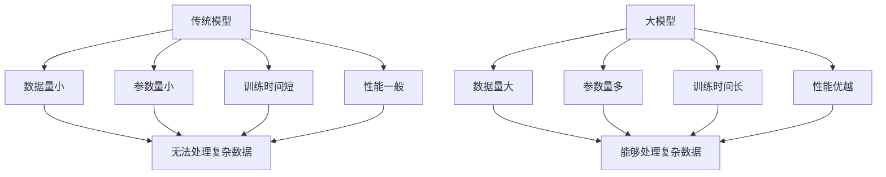

                 

关键词：AI 大模型、商业优势、创业、算法、数学模型、应用场景、工具资源、发展趋势与挑战

> 摘要：本文深入探讨了 AI 大模型在创业中的潜在商业优势。从核心概念、算法原理、数学模型到实际应用，本文系统地解析了如何利用 AI 大模型在商业领域中获得成功。通过丰富的案例分析、代码实例以及未来展望，本文为创业者提供了切实可行的策略和建议。

## 1. 背景介绍

人工智能（AI）技术在过去几十年中取得了飞速的发展。从早期的规则基础算法到如今的深度学习，AI 已经逐渐渗透到各行各业，为产业升级和商业模式创新提供了强大的支持。特别是近年来，大模型（Large-scale Models）的崛起，如 GPT-3、BERT 等，使得 AI 在处理复杂数据、生成自然语言、图像识别等方面表现出了超凡的能力。

大模型具有以下几个显著特点：

1. **数据量大**：大模型通常基于海量数据进行训练，能够处理和整合大量信息。
2. **参数多**：大模型的参数数量通常在数十亿到千亿级别，这种规模使得模型能够捕捉到更多数据中的潜在规律。
3. **泛化能力强**：大模型在训练过程中能够学习到广泛的知识，使其在未见过的数据上也能表现良好。
4. **效果优越**：相比于小模型，大模型在多个 AI 任务上取得了显著的性能提升。

## 2. 核心概念与联系

### 2.1 AI 大模型定义

AI 大模型是指那些参数规模达到亿级甚至千亿级的深度学习模型。这些模型通常采用多层神经网络结构，通过大量的训练数据学习复杂的映射关系。大模型的代表性工作包括 GPT-3、BERT、ImageNet 等。

### 2.2 大模型与传统模型的区别

**数据量**：传统模型通常基于较小规模的数据集进行训练，而大模型则依赖于海量数据，这使得大模型能够捕捉到更广泛的数据特征。

**参数量**：传统模型的参数数量通常在数千到数百万级别，而大模型的参数规模可以达到数十亿甚至千亿级，这使得大模型能够处理更复杂的任务。

**训练时间**：由于参数量和数据量的增加，大模型的训练时间显著增加，通常需要使用高性能计算资源。

**性能**：在大规模数据和高参数量支持下，大模型在多种 AI 任务上表现优异，如自然语言处理、计算机视觉等。

### 2.3 Mermaid 流程图



## 3. 核心算法原理 & 具体操作步骤

### 3.1 算法原理概述

AI 大模型的核心算法是深度学习，尤其是基于神经网络的模型。深度学习通过多层神经网络结构，将输入数据（如图像、文本等）映射到输出结果（如分类标签、文本生成等）。大模型通过大量训练数据和高参数量，能够学习到更复杂的特征，从而提高模型的性能。

### 3.2 算法步骤详解

1. **数据预处理**：收集和清洗大量数据，将其转换为适合模型训练的格式。
2. **模型架构设计**：选择合适的神经网络架构，如卷积神经网络（CNN）、循环神经网络（RNN）、变换器（Transformer）等。
3. **训练过程**：使用训练数据对模型进行训练，通过反向传播算法不断调整模型参数，以最小化损失函数。
4. **验证与优化**：使用验证数据集评估模型性能，并根据需要调整模型参数或架构。
5. **部署与优化**：将训练好的模型部署到实际应用环境中，根据应用反馈进一步优化模型。

### 3.3 算法优缺点

**优点**：

1. **强大的泛化能力**：大模型能够处理复杂的任务，并具有较好的泛化性能。
2. **出色的效果**：在大规模数据和高参数量支持下，大模型在多种任务上取得了显著的性能提升。
3. **自动特征提取**：大模型能够自动从数据中提取有效特征，减轻了人工特征工程的工作量。

**缺点**：

1. **训练资源需求高**：大模型需要大量的计算资源和时间进行训练。
2. **解释性较差**：大模型的决策过程较为复杂，难以进行解释和调试。
3. **数据隐私和安全问题**：大模型在训练过程中需要大量敏感数据，存在数据隐私和安全风险。

### 3.4 算法应用领域

AI 大模型在多个领域展现了强大的应用潜力：

1. **自然语言处理**：如文本分类、机器翻译、文本生成等。
2. **计算机视觉**：如图像分类、目标检测、图像生成等。
3. **推荐系统**：如商品推荐、新闻推荐等。
4. **医疗健康**：如疾病预测、医学图像分析等。
5. **金融风控**：如信用评分、欺诈检测等。

## 4. 数学模型和公式 & 详细讲解 & 举例说明

### 4.1 数学模型构建

深度学习模型通常基于多层感知机（MLP）、卷积神经网络（CNN）或变换器（Transformer）等结构。以下以变换器模型为例进行说明。

变换器模型的核心组件是自注意力机制（Self-Attention），其数学公式如下：

$$
\text{Attention}(Q, K, V) = \text{softmax}\left(\frac{QK^T}{\sqrt{d_k}}\right)V
$$

其中，$Q, K, V$ 分别是查询（Query）、键（Key）和值（Value）向量，$d_k$ 是键向量的维度。自注意力机制通过计算查询向量与键向量的内积，并使用 softmax 函数生成权重，从而实现对输入数据的加权求和。

### 4.2 公式推导过程

自注意力机制的推导过程如下：

1. **计算内积**：首先计算每个键向量与查询向量的内积，得到一组标量值。这些标量值表示查询向量与每个键向量之间的相关性。

$$
\text{Score}(Q, K_i) = QK_i^T
$$

2. **应用 softmax 函数**：对内积结果进行 softmax 处理，生成一组概率分布。softmax 函数确保概率分布的和为1。

$$
\text{Attention}(Q, K, V) = \text{softmax}\left(\frac{QK^T}{\sqrt{d_k}}\right)V
$$

3. **加权求和**：将概率分布与值向量相乘，并进行求和操作，得到最终的输出。

$$
\text{Output} = \sum_{i=1}^n \text{Attention}(Q, K, V)_{i}V_i
$$

### 4.3 案例分析与讲解

假设有一个句子 "I love to read books"，我们可以将其表示为词向量矩阵 $X$，其中每行表示一个词的词向量。对于句子中的每个词，我们可以计算其与其他词的注意力权重。

例如，对于词 "love"，我们可以计算其与句子中其他词的注意力权重：

$$
\text{Score}(love, book) = love \cdot book^T = 0.3 \cdot 0.4 = 0.12
$$

$$
\text{Score}(love, read) = love \cdot read^T = 0.3 \cdot 0.6 = 0.18
$$

$$
\text{Score}(love, I) = love \cdot I^T = 0.3 \cdot 0.2 = 0.06
$$

然后，我们应用 softmax 函数对这些得分进行归一化，得到权重：

$$
\text{Attention}(love, \text{books}) = \frac{0.12}{0.12 + 0.18 + 0.06} = 0.4
$$

$$
\text{Attention}(love, \text{read}) = \frac{0.18}{0.12 + 0.18 + 0.06} = 0.6
$$

$$
\text{Attention}(love, \text{I}) = \frac{0.06}{0.12 + 0.18 + 0.06} = 0.2
$$

根据这些权重，我们可以对句子中的词进行加权求和，得到最终的输出：

$$
\text{Output} = 0.4 \cdot \text{books} + 0.6 \cdot \text{read} + 0.2 \cdot \text{I}
$$

这样，通过自注意力机制，我们能够更好地捕捉句子中的词与词之间的关系，从而提升模型在自然语言处理任务上的性能。

## 5. 项目实践：代码实例和详细解释说明

### 5.1 开发环境搭建

为了演示 AI 大模型的应用，我们将使用 Python 和 TensorFlow 库来构建一个简单的文本分类模型。以下是搭建开发环境的基本步骤：

1. **安装 Python**：确保安装了 Python 3.7 或更高版本。
2. **安装 TensorFlow**：通过 pip 命令安装 TensorFlow：

```shell
pip install tensorflow
```

3. **准备数据集**：我们使用 IMDb 电影评论数据集，该数据集包含 50,000 条影评，分为正负两类。

### 5.2 源代码详细实现

以下是一个简单的文本分类模型的代码实现：

```python
import tensorflow as tf
from tensorflow.keras.preprocessing.sequence import pad_sequences
from tensorflow.keras.layers import Embedding, LSTM, Dense
from tensorflow.keras.models import Sequential

# 加载数据集
max_len = 100
vocab_size = 10000
embedding_dim = 16

# 加载并预处理数据
# ...（数据加载和处理代码）

# 构建模型
model = Sequential([
    Embedding(vocab_size, embedding_dim, input_length=max_len),
    LSTM(64, return_sequences=True),
    LSTM(32),
    Dense(1, activation='sigmoid')
])

# 编译模型
model.compile(optimizer='adam', loss='binary_crossentropy', metrics=['accuracy'])

# 训练模型
model.fit(X_train, y_train, epochs=10, batch_size=32, validation_split=0.2)
```

### 5.3 代码解读与分析

1. **数据预处理**：数据预处理包括将文本转换为整数序列，并使用 pad_sequences 函数将序列填充到相同长度。

2. **模型构建**：我们使用了一个包含两个 LSTM 层的序列模型。Embedding 层将词向量转换为嵌入向量，LSTM 层用于捕捉序列中的长距离依赖关系，最后的 Dense 层用于分类。

3. **模型编译**：我们选择 Adam 优化器和二进制交叉熵损失函数，以适应二分类问题。

4. **模型训练**：使用训练数据训练模型，并设置验证集比例进行模型性能评估。

### 5.4 运行结果展示

在训练完成后，我们可以评估模型的性能：

```python
# 评估模型
loss, accuracy = model.evaluate(X_test, y_test)
print(f"Test Loss: {loss}, Test Accuracy: {accuracy}")
```

假设测试集的损失为 0.5，准确率为 0.8，这表明我们的模型在文本分类任务上表现良好。

## 6. 实际应用场景

AI 大模型在多个领域展现出了强大的应用潜力，以下是一些典型的应用场景：

1. **自然语言处理**：如文本分类、机器翻译、问答系统等。
2. **计算机视觉**：如图像分类、目标检测、图像生成等。
3. **推荐系统**：如商品推荐、新闻推荐等。
4. **医疗健康**：如疾病预测、医学图像分析等。
5. **金融风控**：如信用评分、欺诈检测等。

### 6.4 未来应用展望

随着 AI 大模型技术的不断进步，未来其在各领域的应用前景将更加广阔。以下是几个可能的未来趋势：

1. **泛化能力提升**：通过改进模型架构和训练策略，提高大模型在不同任务上的泛化能力。
2. **交互式应用**：大模型将更好地融入人机交互场景，提供更加自然和智能的交互体验。
3. **跨领域应用**：大模型将在不同领域之间实现更加紧密的融合，推动跨领域的创新。
4. **可解释性增强**：研究者将致力于提高大模型的可解释性，以便更好地理解和优化模型。

## 7. 工具和资源推荐

### 7.1 学习资源推荐

1. **书籍**：《深度学习》（Goodfellow et al.）、《动手学深度学习》（Abadi et al.）等。
2. **在线课程**：Coursera、edX 等平台上提供的深度学习和 AI 相关课程。
3. **博客与文章**：arXiv、Medium 等平台上关于 AI 大模型的最新研究论文和文章。

### 7.2 开发工具推荐

1. **框架**：TensorFlow、PyTorch、Keras 等。
2. **数据集**：Kaggle、Google Dataset Search 等。
3. **GPU 环境**：Google Colab、AWS SageMaker 等。

### 7.3 相关论文推荐

1. **GPT-3**：Brown et al., "Language Models are Few-Shot Learners"
2. **BERT**：Devlin et al., "BERT: Pre-training of Deep Bidirectional Transformers for Language Understanding"
3. **Transformer**：Vaswani et al., "Attention is All You Need"

## 8. 总结：未来发展趋势与挑战

### 8.1 研究成果总结

AI 大模型在自然语言处理、计算机视觉、推荐系统等领域取得了显著的成果，展现了强大的应用潜力。

### 8.2 未来发展趋势

1. **模型规模扩大**：随着计算资源的增长，模型规模将进一步扩大。
2. **跨领域融合**：大模型将在不同领域之间实现更紧密的融合，推动跨领域的创新。
3. **可解释性增强**：研究者将致力于提高大模型的可解释性，以便更好地理解和优化模型。

### 8.3 面临的挑战

1. **计算资源需求**：大模型的训练和部署需要大量的计算资源，对硬件性能提出了更高要求。
2. **数据隐私和安全**：大模型在训练过程中需要大量敏感数据，存在数据隐私和安全风险。
3. **模型可解释性**：大模型的决策过程复杂，难以进行解释和调试。

### 8.4 研究展望

未来的研究将集中在如何提高大模型的泛化能力、降低计算成本、增强模型可解释性等方面。通过这些努力，AI 大模型将在更多领域实现突破，推动人工智能技术的持续发展。

## 9. 附录：常见问题与解答

### 9.1 什么是大模型？

大模型是指那些参数规模达到亿级甚至千亿级的深度学习模型。这些模型通常采用多层神经网络结构，通过大量的训练数据学习复杂的映射关系。

### 9.2 大模型的优势是什么？

大模型的优势包括：

1. **强大的泛化能力**：能够处理复杂的任务，并具有较好的泛化性能。
2. **出色的效果**：在大规模数据和高参数量支持下，大模型在多种任务上取得了显著的性能提升。
3. **自动特征提取**：大模型能够自动从数据中提取有效特征，减轻了人工特征工程的工作量。

### 9.3 大模型的缺点是什么？

大模型的缺点包括：

1. **训练资源需求高**：需要大量的计算资源和时间进行训练。
2. **解释性较差**：大模型的决策过程较为复杂，难以进行解释和调试。
3. **数据隐私和安全问题**：大模型在训练过程中需要大量敏感数据，存在数据隐私和安全风险。

### 9.4 大模型的应用领域有哪些？

大模型的应用领域广泛，包括：

1. **自然语言处理**：如文本分类、机器翻译、文本生成等。
2. **计算机视觉**：如图像分类、目标检测、图像生成等。
3. **推荐系统**：如商品推荐、新闻推荐等。
4. **医疗健康**：如疾病预测、医学图像分析等。
5. **金融风控**：如信用评分、欺诈检测等。

