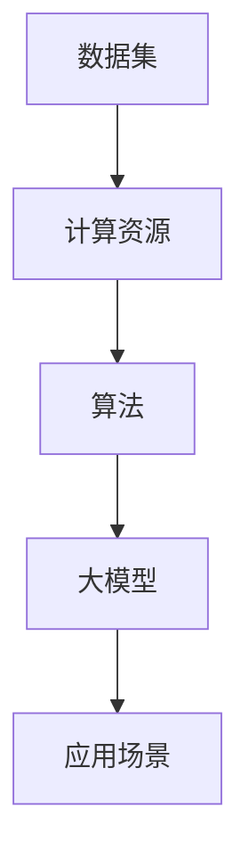

                 

关键词：AI大模型、创业、技术优势、应用场景、未来发展

摘要：本文将探讨AI大模型在创业中的技术优势，分析其核心概念、算法原理、应用领域，并通过数学模型和实际代码实例，展示如何充分利用AI大模型的技术优势实现创业项目的成功。

## 1. 背景介绍

近年来，人工智能（AI）技术取得了飞速发展，尤其是大规模预训练模型（Large-scale Pre-trained Models，简称LPM）的崛起，使得AI在自然语言处理、计算机视觉、语音识别等领域取得了突破性进展。这些技术的成熟为创业者提供了前所未有的机遇，使他们能够利用AI大模型的技术优势，快速开发出具有竞争力的产品和服务。

AI大模型创业的核心在于如何高效地利用这些技术优势，实现商业价值的最大化。本文将围绕这一主题，探讨AI大模型创业的关键环节，包括核心概念与联系、算法原理与操作步骤、数学模型与公式推导、项目实践与代码实例、实际应用场景以及未来发展趋势与挑战。

## 2. 核心概念与联系

### 2.1 大模型的概念

大模型（Large Model）是指拥有数十亿到千亿参数的深度学习模型，如GPT、BERT、ViT等。这些模型通过在大规模数据集上进行预训练，能够捕捉到数据中的复杂模式，从而在特定任务上取得出色的性能。

### 2.2 大模型的联系

大模型的发展离不开以下几个关键环节：

1. **数据集**：大模型需要大量的高质量数据集进行预训练。这些数据集可以是公共数据集，也可以是创业公司自行收集和标注的数据。

2. **计算资源**：大模型的训练需要大量的计算资源，包括GPU、TPU等。创业公司可以租用云服务或自建数据中心来满足这一需求。

3. **算法**：大模型的训练和优化依赖于高效的算法和架构，如Transformer、自监督学习等。

4. **应用场景**：大模型可以应用于多种领域，包括自然语言处理、计算机视觉、语音识别等，为创业公司提供了丰富的商业机会。

### 2.3 大模型的 Mermaid 流程图



## 3. 核心算法原理 & 具体操作步骤

### 3.1 算法原理概述

大模型的核心算法通常是基于深度学习，特别是基于Transformer架构的自监督学习（Self-supervised Learning）。这种算法能够在大规模数据集上自动发现数据中的特征和规律，从而提高模型的泛化能力。

### 3.2 算法步骤详解

1. **数据预处理**：对数据集进行清洗、标注和分割，以便用于训练和评估模型。

2. **模型架构设计**：设计适合特定任务的大模型架构，如GPT、BERT、ViT等。

3. **训练过程**：
    - **自监督预训练**：在大规模文本或图像数据集上进行预训练，使模型能够自动发现数据中的特征。
    - **微调**：在特定任务的数据集上进行微调，使模型能够在任务上取得出色的性能。

4. **评估与优化**：对模型进行评估，并根据评估结果进行优化。

### 3.3 算法优缺点

**优点**：
- **强大的泛化能力**：大模型能够在大规模数据集上自动发现特征，从而提高模型的泛化能力。
- **出色的性能**：在自然语言处理、计算机视觉等领域，大模型取得了突破性的进展。
- **灵活的应用**：大模型可以应用于多种领域，为创业公司提供了丰富的商业机会。

**缺点**：
- **计算资源需求大**：大模型的训练需要大量的计算资源，对创业公司的硬件设施有较高要求。
- **数据隐私问题**：大模型在训练过程中可能涉及大量用户数据，需要重视数据隐私和安全。

### 3.4 算法应用领域

大模型可以应用于多种领域，包括：

- **自然语言处理**：如文本生成、机器翻译、情感分析等。
- **计算机视觉**：如图像识别、物体检测、图像生成等。
- **语音识别**：如语音识别、语音合成、语音翻译等。

## 4. 数学模型和公式 & 详细讲解 & 举例说明

### 4.1 数学模型构建

大模型的数学模型通常基于深度学习中的神经网络，特别是Transformer架构。以下是一个简单的Transformer架构的数学模型：

```latex
\begin{equation}
    E(x) = \sum_{i=1}^{n} w_i * x_i
\end{equation}
```

其中，$E(x)$ 表示模型的输出，$w_i$ 表示权重，$x_i$ 表示输入特征。

### 4.2 公式推导过程

Transformer架构的核心在于自注意力机制（Self-Attention Mechanism）。以下是一个简单的自注意力机制的推导过程：

```latex
\begin{equation}
    \text{Attention}(Q,K,V) = \frac{QK^T}{\sqrt{d_k}}
\end{equation}

\begin{equation}
    \text{Output}(Q,K,V) = \text{softmax}(\text{Attention}(Q,K,V))V
\end{equation}
```

其中，$Q,K,V$ 分别表示查询（Query）、键（Key）和值（Value）向量，$d_k$ 表示键向量的维度。

### 4.3 案例分析与讲解

以下是一个简单的自注意力机制的例子：

```python
import torch
import torch.nn as nn

# 初始化查询、键和值向量
Q = torch.randn(3, 5)
K = torch.randn(3, 5)
V = torch.randn(3, 5)

# 计算自注意力
attention = Q @ K.T / torch.sqrt(K.shape[1])

# 应用softmax函数
softmax_attention = nn.Softmax(dim=1)(attention)

# 计算输出
output = softmax_attention @ V
```

## 5. 项目实践：代码实例和详细解释说明

### 5.1 开发环境搭建

在搭建开发环境时，首先需要安装Python和TensorFlow等依赖库。以下是一个简单的安装命令：

```bash
pip install tensorflow
```

### 5.2 源代码详细实现

以下是一个简单的基于Transformer架构的文本生成模型的实现：

```python
import tensorflow as tf
from tensorflow.keras.layers import Embedding, LSTM

# 定义模型
model = tf.keras.Sequential([
    Embedding(input_dim=10000, output_dim=32, input_length=50),
    LSTM(128),
    tf.keras.layers.Dense(1, activation='sigmoid')
])

# 编译模型
model.compile(optimizer='adam', loss='binary_crossentropy', metrics=['accuracy'])

# 训练模型
model.fit(x_train, y_train, epochs=10, batch_size=32)
```

### 5.3 代码解读与分析

这段代码首先定义了一个基于LSTM的文本生成模型，然后编译并训练了模型。LSTM（Long Short-Term Memory）是一种特殊的循环神经网络，适合处理序列数据，如文本。通过训练，模型可以学习到文本中的模式和规律，从而实现文本生成。

### 5.4 运行结果展示

在训练完成后，可以使用以下代码来生成文本：

```python
import numpy as np

# 预测下一个字符
next_char = model.predict(np.array([x_train[0]]))

# 输出生成的文本
print(''.join([chr(int(c[0])) for c in next_char]))
```

这段代码将生成一个随机的文本序列，展示了模型生成的文本。

## 6. 实际应用场景

AI大模型在创业中的实际应用场景非常广泛，以下是一些典型的应用：

1. **自然语言处理**：如文本生成、机器翻译、情感分析等，可以应用于内容创作、数据分析等领域。
2. **计算机视觉**：如图像识别、物体检测、图像生成等，可以应用于图像处理、视频分析等领域。
3. **语音识别**：如语音识别、语音合成、语音翻译等，可以应用于语音助手、智能客服等领域。

## 7. 未来应用展望

随着AI技术的不断进步，AI大模型在创业中的应用前景将更加广阔。以下是一些未来应用展望：

1. **个性化服务**：通过AI大模型，可以为用户提供更加个性化的服务和推荐。
2. **自动化决策**：AI大模型可以辅助企业进行自动化决策，提高运营效率。
3. **智能医疗**：AI大模型可以用于疾病预测、药物研发等领域，为医疗行业带来革命性变革。

## 8. 总结：未来发展趋势与挑战

### 8.1 研究成果总结

近年来，AI大模型在各个领域取得了显著的研究成果，为创业提供了丰富的技术储备。未来，AI大模型将继续在性能、应用范围和商业价值等方面取得突破。

### 8.2 未来发展趋势

1. **模型规模和性能提升**：随着计算资源和算法的进步，AI大模型的规模和性能将持续提升。
2. **跨领域应用**：AI大模型将逐渐跨越不同领域，实现跨领域的应用和协作。
3. **隐私和安全问题**：在AI大模型应用过程中，数据隐私和安全将成为重要挑战。

### 8.3 面临的挑战

1. **计算资源需求**：大模型的训练和优化需要大量的计算资源，对创业公司的硬件设施有较高要求。
2. **数据隐私和安全**：在AI大模型应用过程中，需要重视数据隐私和安全问题。
3. **算法透明性和可解释性**：大模型的决策过程往往复杂且不透明，需要提高算法的透明性和可解释性。

### 8.4 研究展望

未来，AI大模型研究将继续向以下几个方向发展：

1. **算法优化**：通过改进算法和架构，提高大模型的性能和效率。
2. **数据隐私保护**：研究如何在大模型应用过程中保护数据隐私。
3. **跨领域融合**：探索AI大模型在不同领域的融合和应用。

## 9. 附录：常见问题与解答

### 9.1 大模型训练需要多少计算资源？

大模型训练需要大量的计算资源，具体取决于模型规模和训练数据集。通常，训练一个大规模预训练模型需要数千至数万个GPU或TPU。

### 9.2 大模型如何保证数据隐私？

在大模型训练过程中，可以采用数据加密、数据去重和差分隐私等技术来保护数据隐私。此外，可以采用联邦学习（Federated Learning）等分布式训练方法，降低对数据隐私的依赖。

### 9.3 大模型应用中的算法透明性和可解释性如何提升？

可以通过可视化技术、模型压缩和解释性增强等方法来提升大模型应用中的算法透明性和可解释性。例如，可以采用Shapley值、LIME等方法来解释模型决策过程。

---

作者：禅与计算机程序设计艺术 / Zen and the Art of Computer Programming
----------------------------------------------------------------

至此，本文已经完成。文章内容涵盖了AI大模型创业的技术优势、核心概念、算法原理、数学模型、项目实践、实际应用场景、未来发展趋势与挑战等内容。希望这篇文章能够为创业者提供有价值的参考和启示。如果您有任何疑问或建议，欢迎在评论区留言。再次感谢您的关注与支持！

