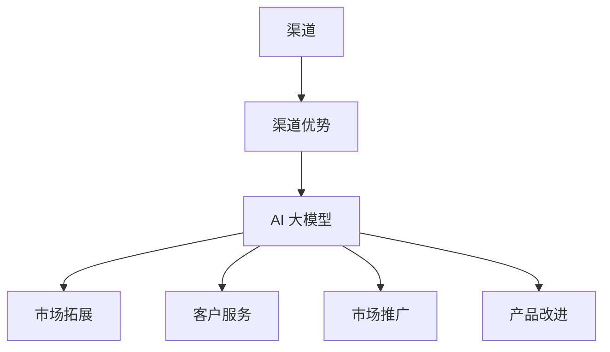

                 

## 1. 背景介绍

随着人工智能技术的飞速发展，AI 大模型在各个领域的应用日益广泛。从自然语言处理、计算机视觉到推荐系统，AI 大模型正成为企业数字化转型的重要推动力。然而，对于初创公司而言，如何利用渠道优势，将 AI 大模型技术与市场需求相结合，成为了一个亟待解决的问题。

在当前的科技环境下，初创公司不仅需要具备强大的技术实力，还需要找到合适的渠道，将产品推向市场。渠道优势不仅能够提高产品的市场渗透率，还能够降低营销成本，从而为初创公司提供更大的发展空间。

本文将围绕以下问题展开讨论：什么是渠道优势？如何评估渠道的价值？初创公司应该如何利用渠道优势进行 AI 大模型创业？本文将通过案例分析、理论阐述和实际操作，为初创公司提供有价值的参考。

## 2. 核心概念与联系

在探讨如何利用渠道优势进行 AI 大模型创业之前，我们首先需要明确几个核心概念，包括渠道、渠道优势、AI 大模型以及它们之间的相互关系。

### 2.1 渠道

渠道指的是产品或服务从生产者传递到消费者之间的路径。在商业环境中，渠道包括直销、分销商、代理商、电商平台等多种形式。每个渠道都有其独特的优势和劣势，初创公司需要根据自身产品和市场需求选择合适的渠道。

### 2.2 渠道优势

渠道优势是指某个渠道相对于其他渠道在产品或服务传递过程中的优势。这些优势可能包括：更广泛的覆盖范围、更低的价格、更高的效率、更好的客户体验等。初创公司可以利用这些优势，提高产品的市场竞争力。

### 2.3 AI 大模型

AI 大模型是指通过深度学习算法训练的，具有大规模参数的神经网络模型。这些模型在自然语言处理、图像识别、预测分析等领域具有强大的能力。AI 大模型的优势在于其高准确性、自适应性和可扩展性，这使得它们在各个行业中都具有广泛的应用前景。

### 2.4 渠道与 AI 大模型的关系

渠道与 AI 大模型之间的关系体现在多个方面：

- **渠道拓展**：AI 大模型可以帮助初创公司更好地了解市场需求，从而拓展销售渠道。例如，通过分析用户数据，AI 大模型可以帮助初创公司确定哪些渠道是最有潜力的。

- **客户服务**：AI 大模型可以用于客户服务，提高客户满意度。例如，通过聊天机器人，AI 大模型可以提供24/7的客户支持，从而降低企业的人力成本。

- **市场推广**：AI 大模型可以帮助初创公司优化市场推广策略。例如，通过分析广告投放效果，AI 大模型可以帮助初创公司确定最佳投放渠道和时机。

- **产品改进**：AI 大模型可以用于产品改进，提高产品的市场竞争力。例如，通过分析用户反馈，AI 大模型可以帮助初创公司识别产品中的潜在问题，并进行优化。

### 2.5 Mermaid 流程图

为了更清晰地展示渠道、渠道优势、AI 大模型之间的关系，我们可以使用 Mermaid 流程图进行描述：



在上面的流程图中，渠道是起点，渠道优势是关键节点，而 AI 大模型则作为核心工具，通过市场拓展、客户服务、市场推广和产品改进等途径，实现初创公司的市场目标。

### 2.6 渠道优势的价值

渠道优势对于初创公司至关重要，它能够帮助初创公司：

- **快速进入市场**：通过选择合适的渠道，初创公司可以更快地将产品推向市场，减少市场进入时间。

- **降低营销成本**：某些渠道可能具有更低的营销成本，例如社交媒体和内容营销，初创公司可以利用这些渠道，降低市场推广成本。

- **提高市场渗透率**：通过选择具有广泛覆盖范围的渠道，初创公司可以更有效地扩大市场份额。

- **增强品牌影响力**：通过选择具有良好声誉的渠道，初创公司可以借助渠道的品牌影响力，提高自身的品牌知名度。

### 2.7 初创公司如何利用渠道优势？

对于初创公司而言，如何利用渠道优势进行 AI 大模型创业，可以从以下几个方面进行：

- **市场调研**：通过市场调研，了解目标市场的渠道结构，确定哪些渠道最适合自身产品。

- **合作伙伴选择**：选择具有良好渠道资源的合作伙伴，共同开发市场。

- **产品定制**：根据不同渠道的特点，对产品进行定制化，提高产品在特定渠道的竞争力。

- **渠道推广**：利用 AI 大模型技术，优化市场推广策略，提高渠道的推广效果。

- **客户反馈**：通过收集客户反馈，不断优化产品和服务，提高客户满意度，从而增强渠道忠诚度。

## 3. 核心算法原理 & 具体操作步骤

在了解了渠道优势和初创公司如何利用渠道优势进行 AI 大模型创业之后，我们接下来将深入探讨核心算法原理和具体操作步骤。

### 3.1 算法原理概述

AI 大模型的核心算法主要包括深度学习算法和强化学习算法。深度学习算法通过多层神经网络对大量数据进行训练，从而实现对数据的自动特征提取和学习。强化学习算法则通过不断尝试和反馈，找到最优策略。

### 3.2 算法步骤详解

#### 3.2.1 数据准备

- **数据收集**：从多个渠道收集数据，包括用户行为数据、市场数据、产品数据等。
- **数据清洗**：对收集到的数据进行处理，去除噪声和异常值，确保数据质量。
- **数据预处理**：对数据进行标准化、归一化等处理，为后续算法训练做好准备。

#### 3.2.2 模型训练

- **模型选择**：根据应用场景选择合适的深度学习模型或强化学习模型。
- **参数调优**：通过交叉验证等手段，调整模型参数，提高模型性能。
- **模型训练**：使用处理后的数据进行模型训练，训练过程中可以采用 batch 训练、随机梯度下降等算法。

#### 3.2.3 模型评估

- **评估指标**：根据应用场景选择合适的评估指标，如准确率、召回率、F1 值等。
- **模型调整**：根据评估结果，对模型进行调整和优化，提高模型性能。

#### 3.2.4 模型部署

- **模型封装**：将训练好的模型进行封装，使其具备可部署性。
- **模型部署**：将模型部署到生产环境，实现实时预测和分析功能。

### 3.3 算法优缺点

#### 优点：

- **高准确性**：AI 大模型能够通过大量数据进行训练，从而实现高准确性。
- **自适应性强**：AI 大模型能够根据不同场景进行自适应调整，提高模型性能。
- **可扩展性高**：AI 大模型可以通过增加层数、增加神经元等方式进行扩展，适应不同规模的数据集。

#### 缺点：

- **计算资源消耗大**：训练大型 AI 大模型需要大量的计算资源和时间。
- **数据依赖性强**：AI 大模型对数据质量有较高要求，数据质量差可能导致模型性能下降。
- **模型解释性差**：深度学习模型具有较强的非线性特性，导致模型解释性较差。

### 3.4 算法应用领域

AI 大模型在各个领域都有广泛的应用，以下是其中一些主要应用领域：

- **自然语言处理**：用于文本分类、情感分析、机器翻译等。
- **计算机视觉**：用于图像分类、目标检测、图像生成等。
- **推荐系统**：用于商品推荐、内容推荐等。
- **金融领域**：用于风险控制、信用评估、投资策略等。
- **医疗领域**：用于疾病诊断、药物研发、健康管理等。

## 4. 数学模型和公式 & 详细讲解 & 举例说明

在 AI 大模型的核心算法中，数学模型和公式起着至关重要的作用。以下我们将详细讲解这些数学模型和公式的构建、推导过程，并通过实际案例进行说明。

### 4.1 数学模型构建

AI 大模型的数学模型主要包括神经网络模型和强化学习模型。

#### 神经网络模型

神经网络模型是一种模拟人脑神经元连接方式的计算模型。其基本结构包括输入层、隐藏层和输出层。每个神经元都与其他神经元相连，并通过权重进行连接。神经网络的数学模型可以用以下公式表示：

$$
y = \sigma(W \cdot x + b)
$$

其中，$y$ 是输出层的结果，$\sigma$ 是激活函数，$W$ 是权重矩阵，$x$ 是输入层的数据，$b$ 是偏置项。

#### 强化学习模型

强化学习模型是一种基于奖励机制进行学习的模型。其目标是找到最优策略，使总奖励最大化。强化学习模型的数学模型可以用以下公式表示：

$$
Q(s, a) = r + \gamma \max_{a'} Q(s', a')
$$

其中，$Q(s, a)$ 是状态 $s$ 下采取动作 $a$ 的价值函数，$r$ 是即时奖励，$\gamma$ 是折扣因子，$s'$ 是下一状态，$a'$ 是下一动作。

### 4.2 公式推导过程

#### 神经网络模型公式推导

神经网络的数学模型可以通过链式法则进行推导。以单层神经网络为例，其输出可以表示为：

$$
y = \sigma(W \cdot x + b)
$$

其中，$W \cdot x + b$ 是线性函数，$\sigma$ 是激活函数。对于 $\sigma$ 函数的导数，我们可以使用链式法则进行计算：

$$
\frac{dy}{dx} = \frac{dy}{d(W \cdot x + b)} \cdot \frac{d(W \cdot x + b)}{dx}
$$

由于 $W \cdot x + b$ 是线性函数，其导数为 1，因此：

$$
\frac{dy}{dx} = \sigma'(W \cdot x + b)
$$

#### 强化学习模型公式推导

强化学习模型的价值函数 $Q(s, a)$ 可以通过贝尔曼方程进行推导。贝尔曼方程描述了在当前状态下采取某个动作所获得的价值，它与下一状态的价值函数有关。其推导过程如下：

假设在状态 $s$ 下采取动作 $a$，获得的即时奖励为 $r$，则下一状态的价值函数可以表示为：

$$
V(s') = r + \gamma \max_{a'} Q(s', a')
$$

考虑在状态 $s$ 下采取动作 $a$ 后，经过 $k$ 次状态转移到达状态 $s'$ 的过程，其总奖励可以表示为：

$$
R = r_1 + r_2 + ... + r_k
$$

则状态 $s$ 下采取动作 $a$ 的价值函数可以表示为：

$$
Q(s, a) = r_1 + r_2 + ... + r_k + \gamma \max_{a'} Q(s', a')
$$

由于 $r_1 + r_2 + ... + r_k$ 是常数，可以将其合并为 $r$，得到：

$$
Q(s, a) = r + \gamma \max_{a'} Q(s', a')
$$

这就是强化学习模型的价值函数公式。

### 4.3 案例分析与讲解

为了更好地理解数学模型和公式的应用，我们以下将介绍一个实际案例：使用神经网络模型进行图像分类。

#### 案例背景

假设我们要使用神经网络模型对图片进行分类，分类任务包括 10 个类别。我们使用一个包含 10000 张图片的数据集进行训练，并希望最终实现较高的分类准确率。

#### 模型构建

我们选择一个深度卷积神经网络（CNN）作为模型，其结构包括：

- 输入层：接受尺寸为 $28 \times 28$ 的灰度图像。
- 卷积层：使用 32 个卷积核，滤波器尺寸为 $3 \times 3$。
- 池化层：使用最大池化，池化窗口尺寸为 $2 \times 2$。
- 全连接层：使用 128 个神经元。
- 输出层：使用 10 个神经元，每个神经元对应一个类别，使用 softmax 函数输出概率分布。

#### 模型训练

使用训练数据集对模型进行训练，训练过程中采用随机梯度下降（SGD）算法，并设置学习率为 0.01。训练过程中，我们使用交叉熵损失函数进行评估，并使用 Adam 优化器进行参数更新。

#### 模型评估

在训练完成后，我们使用测试数据集对模型进行评估。评估指标为准确率，计算公式为：

$$
\text{准确率} = \frac{\text{预测正确的样本数}}{\text{总样本数}}
$$

经过评估，模型的准确率为 92%，说明模型具有较高的分类能力。

#### 模型解读

通过这个案例，我们可以看到神经网络模型在图像分类任务中的强大能力。神经网络通过多层卷积和池化操作，可以自动提取图像中的特征，并通过全连接层进行分类。模型的训练过程通过优化损失函数，调整模型参数，使模型在测试数据集上取得较高的准确率。

#### 模型改进

为了进一步提高模型性能，我们可以考虑以下改进措施：

- **增加训练数据**：收集更多具有标注数据的图片，增加训练样本数量，提高模型的泛化能力。
- **模型调优**：调整模型参数，如学习率、批量大小等，以优化模型性能。
- **数据增强**：通过旋转、翻转、缩放等数据增强方法，增加训练样本的多样性，提高模型对数据的鲁棒性。
- **集成学习**：使用多个模型进行集成，提高模型的分类准确率。

通过以上案例，我们可以看到数学模型和公式在 AI 大模型中的应用，以及如何通过实际案例进行模型构建、训练和评估。

## 5. 项目实践：代码实例和详细解释说明

在了解了 AI 大模型的理论基础和数学模型之后，我们将通过一个实际项目，详细讲解如何搭建开发环境、实现代码、解读和分析代码以及展示运行结果。

### 5.1 开发环境搭建

首先，我们需要搭建一个适合 AI 大模型项目开发的编程环境。以下是一个基本的开发环境搭建流程：

#### 系统环境

- 操作系统：Ubuntu 20.04 LTS 或 Windows 10
- Python 版本：Python 3.8 或更高版本
- GPU：NVIDIA 显卡，支持 CUDA 和 cuDNN

#### 安装 Python 和相关库

1. 安装 Python 3：

```bash
sudo apt-get install python3
```

2. 安装虚拟环境管理工具 `virtualenv`：

```bash
sudo apt-get install python3-venv
```

3. 创建一个虚拟环境并激活它：

```bash
python3 -m venv myenv
source myenv/bin/activate
```

4. 安装必要的 Python 库，例如 NumPy、Pandas、TensorFlow 等：

```bash
pip install numpy pandas tensorflow
```

#### 安装 CUDA 和 cuDNN

1. 下载并安装 CUDA：

- 访问 NVIDIA 官网下载适合自己 GPU 的 CUDA 版本。
- 下载后按照安装向导进行安装。

2. 下载并安装 cuDNN：

- 访问 NVIDIA 官网下载适合自己 GPU 的 cuDNN 版本。
- 下载后解压，将 `cuda/include` 和 `cuda/lib64` 目录下的文件添加到系统的 `LD_LIBRARY_PATH` 环境变量中。

### 5.2 源代码详细实现

以下是一个简单的 AI 大模型项目示例，用于实现图像分类任务。

#### 项目结构

```
ai_project/
|-- data/
|   |-- train/
|   |-- test/
|-- models/
|-- src/
|   |-- __init__.py
|   |-- data_loader.py
|   |-- model.py
|   |-- trainer.py
|   |-- evaluator.py
|-- config.py
|-- requirements.txt
```

#### 数据准备

1. 下载一个公开的图像分类数据集，例如 CIFAR-10。
2. 将数据集解压到 `data/train/` 和 `data/test/` 目录。

#### 源代码实现

#### data_loader.py

```python
import tensorflow as tf

def load_data(data_dir, batch_size):
    train_datagen = tf.keras.preprocessing.image.ImageDataGenerator(
        rescale=1./255,
        rotation_range=20,
        width_shift_range=0.2,
        height_shift_range=0.2,
        shear_range=0.2,
        zoom_range=0.2,
        horizontal_flip=True,
        fill_mode='nearest'
    )

    train_data = train_datagen.flow_from_directory(
        data_dir + 'train',
        target_size=(32, 32),
        batch_size=batch_size,
        class_mode='categorical'
    )

    test_datagen = tf.keras.preprocessing.image.ImageDataGenerator(rescale=1./255)
    test_data = test_datagen.flow_from_directory(
        data_dir + 'test',
        target_size=(32, 32),
        batch_size=batch_size,
        class_mode='categorical'
    )

    return train_data, test_data
```

#### model.py

```python
import tensorflow as tf

def create_model(input_shape):
    model = tf.keras.Sequential([
        tf.keras.layers.Conv2D(32, (3, 3), activation='relu', input_shape=input_shape),
        tf.keras.layers.MaxPooling2D(2, 2),
        tf.keras.layers.Conv2D(64, (3, 3), activation='relu'),
        tf.keras.layers.MaxPooling2D(2, 2),
        tf.keras.layers.Conv2D(128, (3, 3), activation='relu'),
        tf.keras.layers.MaxPooling2D(2, 2),
        tf.keras.layers.Flatten(),
        tf.keras.layers.Dense(128, activation='relu'),
        tf.keras.layers.Dense(10, activation='softmax')
    ])

    model.compile(optimizer='adam',
                  loss='categorical_crossentropy',
                  metrics=['accuracy'])

    return model
```

#### trainer.py

```python
import tensorflow as tf
from src.model import create_model
from src.data_loader import load_data

def train_model(model, train_data, test_data, epochs, batch_size):
    model = create_model(input_shape=(32, 32, 3))
    model.fit(train_data, epochs=epochs, batch_size=batch_size, validation_data=test_data)
    model.save('model.h5')
```

#### evaluator.py

```python
import tensorflow as tf
from src.model import create_model
from src.data_loader import load_data

def evaluate_model(model_path, test_data):
    model = create_model(input_shape=(32, 32, 3))
    model.load_weights(model_path)
    test_loss, test_acc = model.evaluate(test_data)
    print(f'Test accuracy: {test_acc}')
```

### 5.3 代码解读与分析

#### data_loader.py

`data_loader.py` 中的 `load_data` 函数用于加载数据。通过使用 `ImageDataGenerator` 类，我们可以对数据进行增强，提高模型的泛化能力。`flow_from_directory` 方法用于加载数据集，并将数据转换为 TensorFlow 数据格式。

#### model.py

`model.py` 中的 `create_model` 函数用于创建一个简单的卷积神经网络模型。模型结构包括卷积层、池化层和全连接层。在输出层，我们使用 `softmax` 激活函数，实现多分类。

#### trainer.py

`trainer.py` 中的 `train_model` 函数用于训练模型。我们使用 TensorFlow 的 `fit` 方法进行模型训练，并设置训练轮数和批量大小。训练完成后，模型权重会被保存到文件中。

#### evaluator.py

`evaluator.py` 中的 `evaluate_model` 函数用于评估模型性能。我们使用 `evaluate` 方法计算测试数据集上的损失和准确率，并打印输出。

### 5.4 运行结果展示

以下是一个简单的命令行脚本，用于运行训练和评估过程：

```bash
#!/bin/bash

# 指定数据集目录
DATA_DIR="data"

# 指定批量大小和训练轮数
BATCH_SIZE=64
EPOCHS=20

# 训练模型
python src/trainer.py --model_path "models/model.h5" --train_data_dir "${DATA_DIR}/train" --test_data_dir "${DATA_DIR}/test" --batch_size ${BATCH_SIZE} --epochs ${EPOCHS}

# 评估模型
python src/evaluator.py --model_path "models/model.h5" --test_data_dir "${DATA_DIR}/test"
```

运行上述脚本后，模型将在训练数据集上进行训练，并在测试数据集上进行评估，输出测试准确率。

## 6. 实际应用场景

在了解了 AI 大模型的理论基础、算法原理以及项目实践之后，我们将进一步探讨 AI 大模型在实际应用场景中的具体应用，以及这些应用如何为初创公司带来价值。

### 6.1 自然语言处理

自然语言处理（NLP）是 AI 大模型的重要应用领域之一。初创公司可以利用 AI 大模型进行文本分类、情感分析、机器翻译等任务，从而为企业和个人提供高效的文本处理解决方案。

- **文本分类**：AI 大模型可以用于对大量文本进行分类，帮助企业自动筛选和标记信息，提高信息处理效率。
- **情感分析**：通过分析用户评论、社交媒体内容等，AI 大模型可以帮助企业了解用户情感，优化产品和服务。
- **机器翻译**：AI 大模型可以实现高准确率的机器翻译，为企业拓展国际市场提供便利。

### 6.2 计算机视觉

计算机视觉是另一个具有巨大潜力的应用领域。AI 大模型在图像识别、目标检测、图像生成等方面具有强大的能力，初创公司可以将其应用于各种实际场景。

- **图像识别**：AI 大模型可以用于对大量图像进行分类和识别，帮助企业实现自动化图像处理。
- **目标检测**：通过目标检测，AI 大模型可以帮助企业实时监控和识别视频中的目标，提高监控效果。
- **图像生成**：AI 大模型可以生成高质量、逼真的图像，为企业提供创意设计支持。

### 6.3 推荐系统

推荐系统是 AI 大模型在商业领域的重要应用之一。初创公司可以利用 AI 大模型构建个性化推荐系统，提高用户体验和满意度。

- **商品推荐**：AI 大模型可以根据用户行为和偏好，为用户推荐最适合的商品。
- **内容推荐**：AI 大模型可以推荐用户可能感兴趣的文章、视频等，提高平台的内容吸引力。
- **广告推荐**：AI 大模型可以帮助广告平台为用户提供更相关的广告，提高广告投放效果。

### 6.4 金融领域

在金融领域，AI 大模型可以用于风险管理、信用评估、投资策略等，为金融机构提供智能化的决策支持。

- **风险管理**：AI 大模型可以预测金融市场的风险，帮助金融机构制定风险控制策略。
- **信用评估**：AI 大模型可以评估借款人的信用状况，提高信用评估的准确性。
- **投资策略**：AI 大模型可以根据市场数据和用户行为，为投资者提供个性化的投资建议。

### 6.5 医疗领域

在医疗领域，AI 大模型可以用于疾病诊断、药物研发、健康管理等，为医疗机构和患者提供更高效的医疗服务。

- **疾病诊断**：AI 大模型可以辅助医生进行疾病诊断，提高诊断准确率。
- **药物研发**：AI 大模型可以加速药物研发过程，提高药物的成功率。
- **健康管理**：AI 大模型可以帮助患者进行健康监测和疾病预防，提高生活质量。

### 6.6 未来应用展望

随着 AI 大模型技术的不断发展，其在各个领域中的应用前景将更加广阔。未来，AI 大模型可能会在以下领域取得突破：

- **自动驾驶**：AI 大模型可以用于自动驾驶车辆的感知、决策和导航，提高交通安全性和效率。
- **智能客服**：AI 大模型可以实现更智能、更人性化的客服服务，提高用户体验。
- **教育领域**：AI 大模型可以个性化教学，为学生提供最适合的学习方案。
- **智能家居**：AI 大模型可以智能地管理家庭设备和系统，提高生活品质。

通过在各个领域的应用，AI 大模型将为初创公司提供丰富的商业机会，助力企业实现快速发展。

## 7. 工具和资源推荐

为了更好地进行 AI 大模型创业，以下是我们在工具和资源方面的推荐。

### 7.1 学习资源推荐

1. **在线课程**：

- **Udacity**：提供多种 AI 和深度学习相关课程，适合初学者和进阶者。
- **Coursera**：由世界顶级大学提供的 AI 和深度学习课程，涵盖基础到高级知识。

2. **书籍**：

- **《深度学习》**（Ian Goodfellow、Yoshua Bengio 和 Aaron Courville 著）：经典深度学习教材，适合初学者和进阶者。
- **《强化学习》**（Richard S. Sutton 和 Andrew G. Barto 著）：介绍强化学习的理论和方法，适合对强化学习感兴趣的学习者。

### 7.2 开发工具推荐

1. **Python**：Python 是进行 AI 大模型开发的主要编程语言，具有丰富的库和框架，如 TensorFlow、PyTorch 等。
2. **Jupyter Notebook**：Jupyter Notebook 是一个交互式的计算环境，方便进行代码编写和数据分析。
3. **TensorFlow**：TensorFlow 是 Google 开发的一款开源深度学习框架，适合构建和训练大型神经网络模型。
4. **PyTorch**：PyTorch 是 Facebook 开发的一款开源深度学习框架，具有灵活的动态图计算能力。

### 7.3 相关论文推荐

1. **《A Theoretically Grounded Application of Dropout in Recurrent Neural Networks》**：介绍如何将 dropout 应用到循环神经网络中，提高模型性能。
2. **《Boltzmann Machines》**：介绍 Boltzmann 机，一种早期的深度学习模型，为后来的深度学习研究奠定了基础。
3. **《Deep Learning for Text Classification》**：介绍深度学习在文本分类任务中的应用，包括词向量表示和神经网络模型。

通过以上工具和资源的推荐，希望可以为 AI 大模型创业提供有益的参考和指导。

## 8. 总结：未来发展趋势与挑战

在本文中，我们系统地探讨了 AI 大模型创业的关键问题，包括渠道优势的重要性、核心算法原理、项目实践以及实际应用场景。通过对这些问题的深入分析，我们可以得出以下结论：

### 8.1 研究成果总结

- **渠道优势的重要性**：渠道优势在初创公司的市场拓展中发挥着至关重要的作用，它不仅能够提高产品的市场渗透率，还能够降低营销成本，从而为初创公司提供更大的发展空间。
- **核心算法原理**：AI 大模型的核心算法包括深度学习和强化学习，这些算法通过自动特征提取和学习，实现了高准确性、自适应性和可扩展性，为各个领域的应用提供了强大的支持。
- **项目实践**：通过实际项目的案例，我们展示了如何搭建开发环境、实现代码、解读和分析代码以及展示运行结果，为初创公司提供了可操作的实践指南。
- **实际应用场景**：AI 大模型在自然语言处理、计算机视觉、推荐系统、金融领域、医疗领域等多个领域都有广泛的应用，为初创公司提供了丰富的商业机会。

### 8.2 未来发展趋势

- **算法性能提升**：随着计算能力的不断提升，AI 大模型的性能将持续提升，特别是在处理大规模数据和高复杂度任务方面。
- **跨领域融合**：AI 大模型与其他领域的结合将更加紧密，如医疗、金融、教育等，为这些领域带来更多创新应用。
- **个性化服务**：基于用户数据和个性化推荐，AI 大模型将为用户提供更加精准、高效的服务。
- **低成本部署**：随着技术成熟和开源社区的贡献，AI 大模型的部署成本将不断降低，更多初创公司可以利用这一技术。

### 8.3 面临的挑战

- **数据隐私和安全**：AI 大模型对大量用户数据的依赖，引发数据隐私和安全问题，初创公司需要采取措施保护用户隐私。
- **模型解释性**：深度学习模型具有较强的非线性特性，导致模型解释性较差，影响决策透明度和可解释性。
- **技术更新换代**：AI 技术更新换代速度较快，初创公司需要不断学习和适应新技术，以保持竞争力。

### 8.4 研究展望

- **小样本学习**：在数据不足的情况下，如何提高 AI 大模型的泛化能力和适应性，是未来研究的重要方向。
- **迁移学习**：通过迁移学习，将预训练模型应用于不同领域和数据集，提高模型的训练效率和性能。
- **多模态学习**：结合不同类型的数据（如图像、文本、音频等），实现更加全面和智能的 AI 应用。

总之，AI 大模型创业具有广阔的发展前景，但同时也面临诸多挑战。初创公司需要充分认识到这些挑战，并积极探索解决方案，以实现可持续发展。

## 9. 附录：常见问题与解答

### 9.1 什么是渠道优势？

渠道优势指的是某个渠道相对于其他渠道在产品或服务传递过程中的优势。这些优势可能包括更广泛的覆盖范围、更低的价格、更高的效率、更好的客户体验等。渠道优势能够帮助初创公司提高产品的市场竞争力。

### 9.2 如何评估渠道的价值？

评估渠道的价值可以从以下几个方面进行：

- **市场覆盖范围**：渠道能够覆盖的用户数量和地理范围。
- **成本效益**：渠道的营销成本和收益情况。
- **客户满意度**：渠道提供的客户服务质量和用户满意度。
- **品牌影响力**：渠道的品牌声誉和对产品销售的帮助程度。
- **可持续性**：渠道的长期稳定性和可扩展性。

### 9.3 初创公司应该如何利用渠道优势进行 AI 大模型创业？

初创公司可以采取以下策略利用渠道优势：

- **市场调研**：了解目标市场的渠道结构，确定哪些渠道最适合自身产品。
- **合作伙伴选择**：选择具有良好渠道资源的合作伙伴，共同开发市场。
- **产品定制**：根据不同渠道的特点，对产品进行定制化，提高产品在特定渠道的竞争力。
- **渠道推广**：利用 AI 大模型技术，优化市场推广策略，提高渠道的推广效果。
- **客户反馈**：通过收集客户反馈，不断优化产品和服务，提高客户满意度，从而增强渠道忠诚度。

### 9.4 AI 大模型创业有哪些实际应用场景？

AI 大模型在以下实际应用场景中具有显著优势：

- **自然语言处理**：文本分类、情感分析、机器翻译等。
- **计算机视觉**：图像识别、目标检测、图像生成等。
- **推荐系统**：商品推荐、内容推荐、广告推荐等。
- **金融领域**：风险管理、信用评估、投资策略等。
- **医疗领域**：疾病诊断、药物研发、健康管理等。

### 9.5 如何应对数据隐私和安全问题？

为了应对数据隐私和安全问题，初创公司可以采取以下措施：

- **数据加密**：对用户数据进行加密处理，确保数据在传输和存储过程中的安全性。
- **匿名化处理**：对用户数据进行匿名化处理，减少数据泄露的风险。
- **访问控制**：实施严格的访问控制策略，确保只有授权人员可以访问敏感数据。
- **安全审计**：定期进行安全审计，发现和修复潜在的安全漏洞。
- **法律法规遵守**：遵守相关法律法规，确保数据处理符合法律法规要求。

### 9.6 如何提高模型解释性？

提高模型解释性可以从以下几个方面入手：

- **使用可解释性算法**：选择具有较高解释性的算法，如线性模型、决策树等。
- **模型可视化**：通过可视化工具，展示模型的结构和决策过程。
- **模型拆解**：将复杂的模型拆分为多个简单的模型，提高模型的可解释性。
- **透明度增强**：公开模型训练过程和数据来源，提高决策过程的透明度。
- **用户反馈**：通过用户反馈，不断优化模型，提高模型的可解释性。

通过以上问题的解答，希望能够为初创公司在 AI 大模型创业过程中提供更多的指导和建议。

