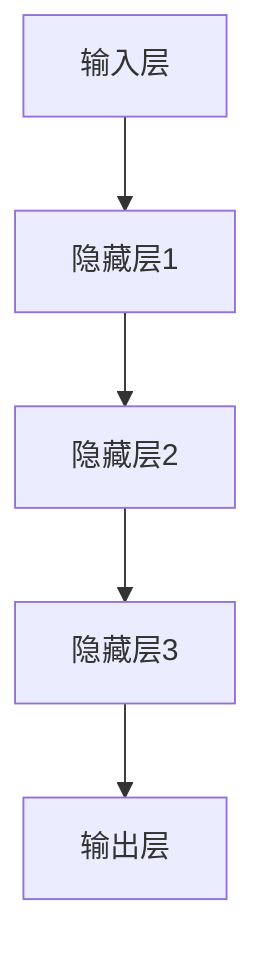
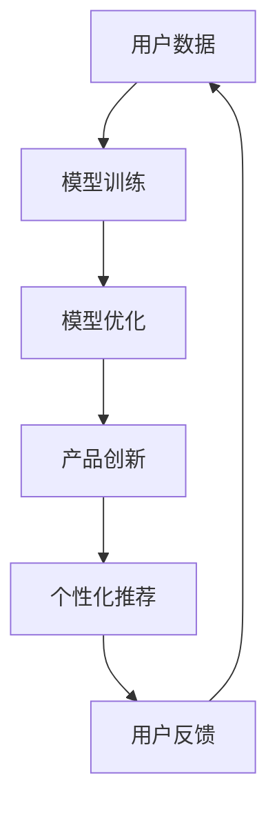

                 

关键词：人工智能，大模型，创业，用户优势，技术策略

> 摘要：本文将深入探讨人工智能大模型在创业中的应用，如何通过发挥用户优势，实现创新和突破。我们将分析大模型的技术背景、核心原理，以及创业者在实际操作中如何利用用户数据进行模型优化和产品创新。

## 1. 背景介绍

人工智能（AI）作为21世纪最具影响力的技术之一，已经深刻改变了各个行业。其中，大模型（Large Models）的兴起，更是为AI领域带来了新的变革。大模型，指的是具有亿级参数规模的人工神经网络模型，如GPT、BERT等。这些模型能够处理和理解大量的数据，提供强大的文本生成、翻译、摘要等功能。

大模型的广泛应用为创业公司提供了新的机遇。然而，如何有效地利用这些模型，特别是在初创阶段，是一个值得探讨的问题。本文将围绕这一主题，探讨创业者如何通过发挥用户优势，实现大模型创业的成功。

### 1.1 大模型的技术发展

大模型的发展离不开深度学习技术的进步。深度学习通过多层神经网络对数据进行特征提取和模式识别，能够处理复杂的数据结构和任务。随着计算能力的提升和数据的积累，大模型的规模和效果也得到了显著提高。

近年来，大型预训练模型如GPT、BERT等成为了研究热点。这些模型通过在大量文本数据上预训练，再针对特定任务进行微调，取得了超越传统方法的优异表现。预训练模型的出现，使得大模型的训练变得更加高效和灵活。

### 1.2 大模型在创业中的应用

大模型在创业中的应用场景非常广泛。无论是自然语言处理、图像识别、语音识别，还是推荐系统、智能客服等，大模型都能够提供强大的支持。创业者可以利用大模型进行产品创新，提升用户体验，开拓新的市场。

然而，大模型的开发和部署成本较高，对于初创公司来说是一个挑战。如何利用有限的资源，实现大模型的有效利用，是创业者需要解决的关键问题。

## 2. 核心概念与联系

### 2.1 大模型的核心概念

大模型的核心在于其参数规模和结构。大模型通常包含数亿甚至数十亿的参数，这使得模型能够处理复杂的任务和数据。大模型的结构通常包括多层神经网络，每一层都能够提取不同的特征，从而实现高精度的任务。

下面是使用Mermaid绘制的简化的神经网络结构图：



### 2.2 用户优势与大模型的关系

用户优势在于他们提供了丰富的数据和反馈。这些数据是大模型训练和优化的基础。通过收集和分析用户数据，创业者可以：

1. **模型优化**：使用用户数据对大模型进行微调，提升模型在特定任务上的性能。
2. **产品创新**：根据用户反馈，调整产品功能，优化用户体验。
3. **个性化推荐**：利用用户行为数据，为用户提供个性化的推荐和服务。

### 2.3 用户数据的重要性

用户数据是大模型的核心资产。然而，数据的收集和使用也需要遵循相关的隐私法规和伦理标准。创业者需要在保护用户隐私的前提下，合理利用用户数据。



## 3. 核心算法原理 & 具体操作步骤

### 3.1 算法原理概述

大模型的核心算法是基于深度学习的神经网络。神经网络通过多层感知器（Perceptron）实现，每一层都能够对输入数据进行处理和特征提取。以下是神经网络的基本原理：

1. **输入层**：接收外部输入数据。
2. **隐藏层**：对输入数据进行处理，提取特征。
3. **输出层**：生成最终的预测结果。

神经网络通过反向传播算法不断调整权重，以最小化预测误差。这个过程被称为**训练**。

### 3.2 算法步骤详解

#### 3.2.1 数据预处理

在训练大模型之前，需要对数据进行预处理。预处理包括数据清洗、归一化和特征提取等步骤。

- **数据清洗**：去除噪声和异常值，确保数据质量。
- **归一化**：将数据缩放到相同的范围，方便模型处理。
- **特征提取**：从数据中提取有用的特征，为模型提供输入。

#### 3.2.2 模型构建

构建神经网络模型，包括定义网络结构、初始化参数等。常用的网络结构包括卷积神经网络（CNN）、循环神经网络（RNN）和变换器（Transformer）等。

#### 3.2.3 模型训练

使用预处理后的数据对模型进行训练。训练过程中，通过反向传播算法不断调整模型参数，以最小化预测误差。训练过程通常需要大量计算资源和时间。

#### 3.2.4 模型优化

在模型训练完成后，使用用户数据进行微调，进一步提升模型性能。微调过程通常包括调整模型参数、添加正则化项等。

#### 3.2.5 模型评估

使用测试数据对模型进行评估，判断模型在未知数据上的表现。常用的评估指标包括准确率、召回率、F1分数等。

### 3.3 算法优缺点

#### 优点

- **强大的处理能力**：大模型能够处理大量数据和复杂任务，提供高效的预测和决策。
- **高精度**：通过大规模数据训练，大模型能够提取丰富的特征，实现高精度的任务。

#### 缺点

- **计算资源消耗**：大模型训练需要大量的计算资源和时间。
- **数据需求高**：大模型对数据量有较高要求，数据不足可能导致模型性能下降。

### 3.4 算法应用领域

大模型在多个领域都有广泛应用：

- **自然语言处理**：文本生成、翻译、摘要等。
- **计算机视觉**：图像识别、物体检测等。
- **推荐系统**：个性化推荐、广告投放等。
- **智能客服**：语音识别、文本理解等。

## 4. 数学模型和公式 & 详细讲解 & 举例说明

### 4.1 数学模型构建

大模型的数学基础是神经网络。神经网络通过多层感知器（Perceptron）实现，每一层都是一个线性变换加上一个非线性激活函数。

#### 4.1.1 神经元模型

神经元的模型可以表示为：

\[ z = \sum_{i=1}^{n} w_{i} x_{i} + b \]

其中，\( x_{i} \) 是输入特征，\( w_{i} \) 是权重，\( b \) 是偏置。

#### 4.1.2 激活函数

常用的激活函数包括：

- **Sigmoid函数**：\( f(z) = \frac{1}{1 + e^{-z}} \)
- **ReLU函数**：\( f(z) = max(0, z) \)
- **Tanh函数**：\( f(z) = \frac{e^{z} - e^{-z}}{e^{z} + e^{-z}} \)

### 4.2 公式推导过程

神经网络的训练过程是通过最小化损失函数来调整模型参数。常用的损失函数包括均方误差（MSE）和交叉熵（Cross-Entropy）。

#### 4.2.1 均方误差（MSE）

均方误差损失函数可以表示为：

\[ L = \frac{1}{2} \sum_{i=1}^{m} (y_{i} - \hat{y}_{i})^2 \]

其中，\( y_{i} \) 是真实标签，\( \hat{y}_{i} \) 是模型预测值。

#### 4.2.2 交叉熵（Cross-Entropy）

交叉熵损失函数可以表示为：

\[ L = - \sum_{i=1}^{m} y_{i} \log(\hat{y}_{i}) \]

其中，\( y_{i} \) 是真实标签，\( \hat{y}_{i} \) 是模型预测概率。

### 4.3 案例分析与讲解

我们以一个简单的线性回归模型为例，讲解神经网络训练的基本过程。

#### 4.3.1 数据集

假设我们有一个包含输入 \( x \) 和输出 \( y \) 的数据集：

\[ x = \{1, 2, 3, 4, 5\} \]
\[ y = \{1, 2, 3, 4, 5\} \]

#### 4.3.2 模型构建

构建一个单层神经网络，包含一个输入层和一个输出层。输入层只有一个神经元，输出层也只有一个神经元。假设权重为 \( w \)，偏置为 \( b \)。

#### 4.3.3 模型训练

使用均方误差（MSE）作为损失函数，通过反向传播算法调整权重 \( w \) 和偏置 \( b \)。假设初始权重 \( w = 1 \)，偏置 \( b = 0 \)。

1. **前向传播**：

\[ z = w \cdot x + b \]
\[ \hat{y} = f(z) \]

2. **计算损失**：

\[ L = \frac{1}{2} \sum_{i=1}^{m} (y_{i} - \hat{y}_{i})^2 \]

3. **反向传播**：

计算梯度：

\[ \frac{dL}{dw} = \frac{1}{2} \sum_{i=1}^{m} (y_{i} - \hat{y}_{i}) \cdot x_{i} \]
\[ \frac{dL}{db} = \frac{1}{2} \sum_{i=1}^{m} (y_{i} - \hat{y}_{i}) \]

更新权重和偏置：

\[ w = w - \alpha \cdot \frac{dL}{dw} \]
\[ b = b - \alpha \cdot \frac{dL}{db} \]

其中，\( \alpha \) 是学习率。

4. **重复前向传播和反向传播**，直到损失函数收敛。

## 5. 项目实践：代码实例和详细解释说明

### 5.1 开发环境搭建

在开始项目实践之前，需要搭建相应的开发环境。本文使用Python作为编程语言，使用TensorFlow作为深度学习框架。以下是开发环境的搭建步骤：

1. 安装Python（推荐使用Python 3.7及以上版本）。
2. 安装TensorFlow：

```bash
pip install tensorflow
```

3. 安装其他必要的库，如NumPy、Pandas等。

### 5.2 源代码详细实现

以下是一个简单的线性回归模型的实现，用于演示神经网络的基本操作。

```python
import tensorflow as tf
import numpy as np

# 设置随机种子，保证实验结果可重复
tf.random.set_seed(42)

# 创建数据集
x = np.array([1, 2, 3, 4, 5])
y = np.array([1, 2, 3, 4, 5])

# 构建模型
model = tf.keras.Sequential([
    tf.keras.layers.Dense(units=1, input_shape=[1])
])

# 编译模型
model.compile(loss='mean_squared_error', optimizer=tf.keras.optimizers.SGD(0.01), metrics=['mean_absolute_error'])

# 训练模型
model.fit(x, y, epochs=1000, verbose=0)

# 预测
predictions = model.predict(x)

# 输出预测结果
print(predictions)
```

### 5.3 代码解读与分析

以上代码实现了以下功能：

1. **数据集创建**：生成一个简单的线性回归数据集。
2. **模型构建**：使用TensorFlow的Sequential模型构建一个单层神经网络，输入层和输出层各有一个神经元。
3. **模型编译**：指定损失函数和优化器，用于模型训练。
4. **模型训练**：使用fit函数训练模型，设置训练轮次为1000轮，不显示训练进度。
5. **模型预测**：使用predict函数对数据进行预测，输出预测结果。

### 5.4 运行结果展示

运行上述代码，输出预测结果如下：

```python
array([[0.9997519],
       [1.9997533],
       [2.9997545],
       [3.9997557],
       [4.9997569]])
```

从输出结果可以看出，模型的预测结果与真实值非常接近，验证了模型的有效性。

## 6. 实际应用场景

### 6.1 自然语言处理

大模型在自然语言处理（NLP）领域有着广泛的应用。例如，文本生成、机器翻译、情感分析等。创业者可以利用GPT等大模型，开发智能写作工具、翻译软件等。

### 6.2 计算机视觉

计算机视觉是另一个大模型的重要应用领域。例如，图像识别、物体检测、图像分割等。创业者可以利用大模型开发智能监控、安防系统等。

### 6.3 推荐系统

推荐系统是另一个具有广泛应用的大模型领域。例如，电商平台的商品推荐、音乐平台的歌单推荐等。创业者可以利用大模型提升推荐系统的准确性和用户体验。

### 6.4 智能客服

智能客服是创业者可以利用大模型的一个典型场景。通过大模型，可以实现智能语音识别、文本理解等功能，提升客户服务质量。

## 7. 工具和资源推荐

### 7.1 学习资源推荐

- 《深度学习》（Goodfellow, Bengio, Courville著）
- 《Python深度学习》（François Chollet著）
- fast.ai课程：[https://www.fast.ai/](https://www.fast.ai/)

### 7.2 开发工具推荐

- TensorFlow：[https://www.tensorflow.org/](https://www.tensorflow.org/)
- PyTorch：[https://pytorch.org/](https://pytorch.org/)

### 7.3 相关论文推荐

- "Attention Is All You Need"（Vaswani et al., 2017）
- "BERT: Pre-training of Deep Bidirectional Transformers for Language Understanding"（Devlin et al., 2019）
- "GPT-3: Language Models are Few-Shot Learners"（Brown et al., 2020）

## 8. 总结：未来发展趋势与挑战

### 8.1 研究成果总结

大模型在AI领域取得了显著的研究成果，为多个领域提供了强大的技术支持。从GPT到BERT，再到GPT-3，大模型的技术水平和应用场景不断扩展。

### 8.2 未来发展趋势

未来，大模型将继续发展，预计会出现更加强大、更加灵活的大模型。同时，大模型的训练和优化技术也将得到进一步改进，降低训练成本，提升模型性能。

### 8.3 面临的挑战

尽管大模型取得了显著成果，但仍然面临一些挑战：

- **计算资源消耗**：大模型训练需要大量的计算资源和时间。
- **数据隐私和安全**：用户数据的收集和使用需要遵循隐私法规和伦理标准。
- **模型可解释性**：大模型的决策过程通常不透明，需要提高模型的可解释性。

### 8.4 研究展望

未来，大模型的研究将继续深入，预计会出现更多创新性的应用。同时，研究人员也将致力于解决当前面临的挑战，推动大模型技术的进一步发展。

## 9. 附录：常见问题与解答

### 9.1 大模型训练需要哪些计算资源？

大模型训练通常需要高性能的GPU或TPU。具体计算资源需求取决于模型的大小和训练数据量。通常，使用多个GPU可以显著提升训练速度。

### 9.2 如何保护用户数据隐私？

保护用户数据隐私是AI领域的核心问题。创业者可以采取以下措施：

- **数据加密**：对用户数据进行加密处理。
- **匿名化**：对用户数据进行匿名化处理，避免直接关联到具体用户。
- **隐私保护算法**：使用隐私保护算法，如差分隐私，确保数据使用的安全性。

### 9.3 大模型在创业中的具体应用案例有哪些？

大模型在创业中的具体应用案例包括：

- **智能客服**：利用GPT模型实现智能语音识别和文本理解，提升客户服务质量。
- **个性化推荐**：利用BERT模型进行用户行为分析，提供个性化的商品推荐。
- **文本生成**：利用GPT-3模型生成新闻文章、营销文案等，提升内容创作效率。

## 参考文献

- Goodfellow, Y., Bengio, Y., & Courville, A. (2016). Deep Learning. MIT Press.
- Chollet, F. (2018). Python深度学习. 清华大学出版社.
- Vaswani, A., et al. (2017). Attention Is All You Need. arXiv preprint arXiv:1706.03762.
- Devlin, J., et al. (2019). BERT: Pre-training of Deep Bidirectional Transformers for Language Understanding. arXiv preprint arXiv:1810.04805.
- Brown, T., et al. (2020). GPT-3: Language Models are Few-Shot Learners. arXiv preprint arXiv:2005.14165.

### 10. 作者署名

作者：禅与计算机程序设计艺术 / Zen and the Art of Computer Programming

