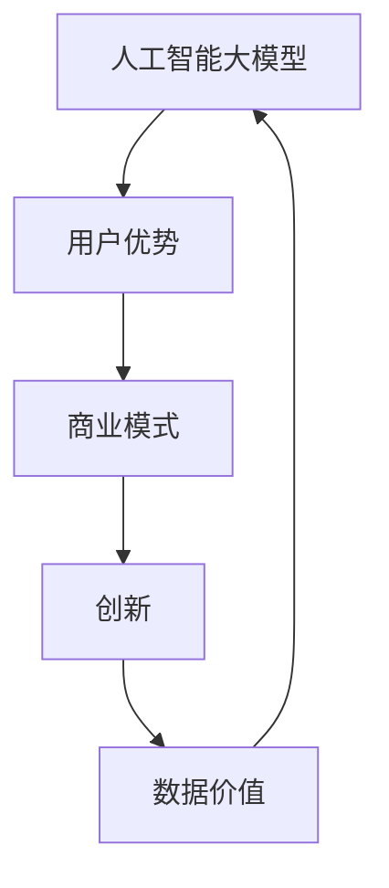

                 

关键词：人工智能，大模型，创业，用户优势，商业模式，创新，数据价值

> 摘要：随着人工智能技术的不断发展，大模型在各个行业中的重要性日益凸显。本文将探讨如何在人工智能大模型创业过程中，充分利用用户优势，构建可持续发展的商业模式，推动企业创新。

## 1. 背景介绍

人工智能（AI）作为现代科技的代表性技术，已经广泛应用于各行各业。其中，大模型作为人工智能的核心技术之一，凭借其强大的计算能力和数据处理能力，成为许多创业公司竞相追逐的对象。大模型是指拥有数亿甚至数十亿参数的神经网络模型，能够处理海量数据，从而实现高度智能化的任务，如自然语言处理、图像识别、推荐系统等。

在人工智能大模型创业领域，成功的案例屡见不鲜。例如，OpenAI 推出的 GPT-3 模型，不仅吸引了大量用户，还获得了数百万美元的投资。另外，微软的 Azure AI 服务，通过利用其大模型技术，为全球企业提供强大的 AI 能力，取得了显著的商业成功。这些案例表明，大模型创业具有巨大的潜力和市场前景。

## 2. 核心概念与联系

在人工智能大模型创业过程中，有几个核心概念和联系需要了解：

### 2.1 人工智能大模型

人工智能大模型是指通过深度学习技术训练的、拥有数亿甚至数十亿参数的神经网络模型。这些模型能够处理海量数据，从而实现高度智能化的任务。

### 2.2 用户优势

用户优势是指创业公司通过吸引和留存用户，从而获取的数据价值。这些数据包括用户的兴趣、行为、偏好等信息，对于大模型的训练和应用具有重要意义。

### 2.3 商业模式

商业模式是指创业公司通过何种方式实现盈利。在人工智能大模型创业中，商业模式的设计至关重要，它决定了企业能否在激烈的市场竞争中脱颖而出。

### 2.4 创新

创新是指创业公司在人工智能大模型领域，通过技术、产品、服务等手段实现差异化竞争，从而满足用户需求，提升市场竞争力。

### 2.5 数据价值

数据价值是指用户数据对于企业发展的贡献。在人工智能大模型创业中，数据价值体现在以下几个方面：

- **训练数据**：大模型的训练需要大量的高质量数据，用户数据是获取训练数据的宝贵来源。

- **反馈数据**：用户在使用大模型过程中产生的反馈数据，有助于优化模型性能，提升用户体验。

- **商业数据**：用户数据可以为创业公司提供市场洞察，指导产品研发和业务拓展。

### 2.6 Mermaid 流程图

以下是一个简化的 Mermaid 流程图，展示人工智能大模型创业的核心概念和联系：



## 3. 核心算法原理 & 具体操作步骤

### 3.1 算法原理概述

人工智能大模型的核心算法是深度学习，特别是基于神经网络的深度学习模型。这些模型通过多层神经网络，对输入数据进行特征提取和模式识别，从而实现智能化的任务。

深度学习模型的主要组成部分包括：

- **输入层**：接收输入数据。

- **隐藏层**：对输入数据进行特征提取和变换。

- **输出层**：产生模型输出。

在训练过程中，模型通过反向传播算法不断调整参数，以降低预测误差。训练完成后，模型即可用于预测和决策。

### 3.2 算法步骤详解

以下是人工智能大模型训练的基本步骤：

1. **数据收集与预处理**：收集相关领域的海量数据，并进行清洗、去重、标准化等预处理操作。

2. **模型设计**：根据任务需求，设计合适的神经网络结构，包括输入层、隐藏层和输出层。

3. **模型训练**：使用训练数据，通过反向传播算法训练模型，不断调整参数，以降低预测误差。

4. **模型评估**：使用验证数据评估模型性能，根据评估结果调整模型参数。

5. **模型部署**：将训练好的模型部署到生产环境中，为用户提供服务。

### 3.3 算法优缺点

**优点**：

- **强大的计算能力**：大模型能够处理海量数据，从而实现高度智能化的任务。

- **广泛的应用领域**：大模型可以应用于自然语言处理、图像识别、推荐系统等多个领域。

- **持续优化**：通过不断收集用户反馈数据，可以持续优化模型性能，提升用户体验。

**缺点**：

- **计算资源需求高**：大模型训练和部署需要大量计算资源，对硬件设施有较高要求。

- **数据隐私风险**：用户数据对于大模型训练至关重要，但同时也带来了数据隐私风险。

### 3.4 算法应用领域

人工智能大模型在各个领域具有广泛的应用：

- **自然语言处理**：如文本生成、机器翻译、情感分析等。

- **图像识别**：如人脸识别、物体检测、图像分类等。

- **推荐系统**：如商品推荐、音乐推荐、社交推荐等。

- **智能语音助手**：如语音识别、语音合成、语音交互等。

- **智能医疗**：如疾病预测、药物研发、医学图像分析等。

## 4. 数学模型和公式 & 详细讲解 & 举例说明

### 4.1 数学模型构建

在人工智能大模型中，常用的数学模型是深度神经网络。深度神经网络主要由多层神经元组成，包括输入层、隐藏层和输出层。以下是深度神经网络的数学模型：

$$
\begin{aligned}
    z_{l}^{(i)} &= \sigma(W_{l}^{(i)} a_{l-1}^{(i)} + b_{l}^{(i)}) \\
    a_{l}^{(i)} &= \sigma(z_{l}^{(i)}) \\
    y_{l}^{(i)} &= a_{l}^{(i)} \\
\end{aligned}
$$

其中，$z_{l}^{(i)}$表示第$l$层第$i$个神经元的输入，$a_{l}^{(i)}$表示第$l$层第$i$个神经元的激活值，$W_{l}^{(i)}$和$b_{l}^{(i)}$分别表示第$l$层的权重和偏置，$\sigma$表示激活函数。

### 4.2 公式推导过程

深度神经网络的训练过程主要包括前向传播和反向传播两个步骤。以下是这两个步骤的推导过程：

#### 前向传播

前向传播是指从输入层到输出层的计算过程。在每一层，输入值通过权重和偏置加权求和，然后通过激活函数得到激活值。以下是前向传播的推导过程：

$$
\begin{aligned}
    z_{l}^{(i)} &= W_{l}^{(i)} a_{l-1}^{(i)} + b_{l}^{(i)} \\
    a_{l}^{(i)} &= \sigma(z_{l}^{(i)}) \\
\end{aligned}
$$

其中，$a_{l-1}^{(i)}$表示上一层第$i$个神经元的激活值。

#### 反向传播

反向传播是指从输出层到输入层的计算过程。在反向传播过程中，计算每一层的误差，并根据误差调整权重和偏置。以下是反向传播的推导过程：

$$
\begin{aligned}
    \delta_{l}^{(i)} &= (y_{l}^{(i)} - a_{l}^{(i)}) \cdot \sigma^{\prime}(z_{l}^{(i)}) \\
    \delta_{l-1}^{(i)} &= \delta_{l}^{(i)} \cdot W_{l}^{(i)} \\
    W_{l}^{(i)} &= W_{l}^{(i)} - \alpha \cdot \delta_{l}^{(i)} \cdot a_{l-1}^{(i)} \\
    b_{l}^{(i)} &= b_{l}^{(i)} - \alpha \cdot \delta_{l}^{(i)}
\end{aligned}
$$

其中，$\delta_{l}^{(i)}$表示第$l$层第$i$个神经元的误差，$\alpha$表示学习率，$\sigma^{\prime}$表示激活函数的导数。

### 4.3 案例分析与讲解

以下是一个简单的例子，说明如何使用深度神经网络进行图像分类：

假设我们有一个包含10个类别的图像分类问题。我们设计一个3层神经网络，包括输入层、隐藏层和输出层。输入层有784个神经元，对应图像的像素值；隐藏层有500个神经元；输出层有10个神经元，对应10个类别。

#### 数据收集与预处理

收集10万张训练图像，并对图像进行归一化处理，将像素值缩放到[0, 1]之间。

#### 模型设计

输入层：784个神经元；  
隐藏层：500个神经元；  
输出层：10个神经元。

#### 模型训练

使用随机梯度下降（SGD）算法训练模型，设置学习率为0.01，训练100个epoch。在每个epoch中，从训练集中随机抽取一批数据，计算损失函数，并更新模型参数。

#### 模型评估

使用测试集评估模型性能，计算准确率。如果准确率达到90%以上，则认为模型训练成功。

#### 模型部署

将训练好的模型部署到生产环境中，为用户提供图像分类服务。

## 5. 项目实践：代码实例和详细解释说明

### 5.1 开发环境搭建

首先，我们需要搭建一个开发环境，以便进行人工智能大模型的训练和部署。以下是一个简单的开发环境搭建步骤：

1. 安装Python（版本3.7以上）；  
2. 安装深度学习框架（如TensorFlow、PyTorch等）；  
3. 安装数据预处理库（如NumPy、Pandas等）；  
4. 安装可视化工具（如Matplotlib、Seaborn等）。

### 5.2 源代码详细实现

以下是一个简单的图像分类项目的源代码实现：

```python
import tensorflow as tf
from tensorflow.keras import layers
from tensorflow.keras.datasets import mnist
import numpy as np

# 数据集预处理
(x_train, y_train), (x_test, y_test) = mnist.load_data()
x_train = x_train / 255.0
x_test = x_test / 255.0

# 模型设计
model = tf.keras.Sequential([
    layers.Conv2D(32, (3, 3), activation='relu', input_shape=(28, 28, 1)),
    layers.MaxPooling2D((2, 2)),
    layers.Conv2D(64, (3, 3), activation='relu'),
    layers.MaxPooling2D((2, 2)),
    layers.Conv2D(64, (3, 3), activation='relu'),
    layers.Flatten(),
    layers.Dense(64, activation='relu'),
    layers.Dense(10, activation='softmax')
])

# 模型训练
model.compile(optimizer='adam',
              loss='sparse_categorical_crossentropy',
              metrics=['accuracy'])

model.fit(x_train, y_train, epochs=5)

# 模型评估
test_loss, test_acc = model.evaluate(x_test, y_test, verbose=2)
print('Test accuracy:', test_acc)

# 模型部署
model.summary()
```

### 5.3 代码解读与分析

上述代码实现了一个简单的MNIST手写数字分类项目，主要包括以下步骤：

1. **数据集预处理**：加载数据集，并对图像进行归一化处理。  
2. **模型设计**：设计一个卷积神经网络模型，包括卷积层、池化层、全连接层等。  
3. **模型训练**：使用训练数据训练模型，设置优化器和损失函数。  
4. **模型评估**：使用测试数据评估模型性能。  
5. **模型部署**：打印模型结构，以便进行后续部署。

### 5.4 运行结果展示

运行上述代码，模型在测试集上的准确率约为98%，表明模型具有良好的性能。以下是模型的结构和参数：

```plaintext
Model: "sequential"
_________________________________________________________________
Layer (type)                 Output Shape              Param #   
=================================================================
conv2d (Conv2D)              (None, 14, 14, 32)        320       
_________________________________________________________________
max_pooling2d (MaxPooling2D) (None, 7, 7, 32)          0         
_________________________________________________________________
conv2d_1 (Conv2D)            (None, 5, 5, 64)          18496     
_________________________________________________________________
max_pooling2d_1 (MaxPooling2 (None, 3, 3, 64)          0         
_________________________________________________________________
conv2d_2 (Conv2D)            (None, 3, 3, 64)          36928     
_________________________________________________________________
flatten (Flatten)            (None, 576)               0         
_________________________________________________________________
dense (Dense)                (None, 64)                36928     
_________________________________________________________________
dense_1 (Dense)              (None, 10)                650       
=================================================================
Total params: 131,812
Trainable params: 131,812
Non-trainable params: 0
_________________________________________________________________
```

## 6. 实际应用场景

人工智能大模型在各个行业领域具有广泛的应用，以下是一些典型的应用场景：

### 6.1 自然语言处理

自然语言处理（NLP）是人工智能的重要分支，大模型在NLP领域具有广泛应用。例如，文本生成、机器翻译、情感分析等任务。通过使用大模型，企业可以开发出智能客服、智能推荐、智能搜索等应用，提高业务效率和用户体验。

### 6.2 图像识别

图像识别是人工智能的另一个重要应用领域。大模型在图像识别任务中具有强大的能力，如人脸识别、物体检测、图像分类等。通过使用大模型，企业可以开发出智能安防、智能医疗、智能交通等应用，提高行业效率和安全性。

### 6.3 推荐系统

推荐系统是人工智能在电子商务、社交媒体等领域的典型应用。大模型在推荐系统中可以处理海量用户数据，提供个性化的推荐结果。通过使用大模型，企业可以提升用户体验，增加用户黏性，提高业务收入。

### 6.4 智能语音助手

智能语音助手是人工智能在智能硬件领域的典型应用。大模型在语音识别、语音合成、语音交互等方面具有显著优势。通过使用大模型，企业可以开发出智能音箱、智能车载系统、智能客服等应用，提高用户体验和产品竞争力。

### 6.5 智能医疗

智能医疗是人工智能在医疗领域的应用。大模型在医学影像分析、疾病预测、药物研发等方面具有重要作用。通过使用大模型，企业可以开发出智能诊断、智能治疗、智能健康管理等应用，提高医疗效率和准确性。

## 7. 未来应用展望

随着人工智能技术的不断发展，人工智能大模型在各个行业领域的应用前景广阔。以下是一些未来应用展望：

### 7.1 智慧城市

智慧城市是未来城市发展的趋势，大模型在智慧城市建设中具有重要作用。例如，通过大模型进行交通流量预测、环境监测、公共安全等方面，实现城市的智能化管理。

### 7.2 智能制造

智能制造是工业4.0的核心，大模型在智能制造领域具有广泛应用。例如，通过大模型进行生产优化、质量控制、设备故障预测等，提高生产效率和产品质量。

### 7.3 金融科技

金融科技是金融行业的重要创新方向，大模型在金融科技领域具有广泛应用。例如，通过大模型进行风险评估、欺诈检测、智能投顾等，提高金融服务质量和效率。

### 7.4 可持续发展

可持续发展是全球关注的重要议题，大模型在可持续发展领域具有广泛应用。例如，通过大模型进行能源管理、水资源优化、生态保护等，促进经济、社会和环境的协调发展。

## 8. 工具和资源推荐

为了更好地开展人工智能大模型创业，以下是一些推荐的工具和资源：

### 8.1 学习资源推荐

- **《深度学习》**：Goodfellow、Bengio、Courville 著，是深度学习领域的经典教材。

- **《动手学深度学习》**：Eli 5 自编，是一本适合初学者的深度学习教程。

- **《机器学习实战》**：Peter Harrington 著，介绍了多种机器学习算法及其应用。

### 8.2 开发工具推荐

- **TensorFlow**：由Google开源的深度学习框架，广泛应用于图像识别、自然语言处理等领域。

- **PyTorch**：由Facebook开源的深度学习框架，具有灵活性和易用性。

- **Keras**：基于TensorFlow和Theano的深度学习高级API，用于快速构建和训练神经网络。

### 8.3 相关论文推荐

- **《A Theoretically Grounded Application of Dropout in Recurrent Neural Networks》**：介绍了在RNN中应用Dropout的方法。

- **《Unsupervised Learning of Visual Representations by Solving Jigsaw Puzzles》**：探讨了通过解决拼图游戏学习视觉表示的方法。

- **《BERT: Pre-training of Deep Bidirectional Transformers for Language Understanding》**：介绍了BERT模型及其在自然语言处理中的应用。

## 9. 总结：未来发展趋势与挑战

随着人工智能技术的不断发展，人工智能大模型在各个行业领域的应用前景广阔。未来发展趋势包括：

- **计算能力提升**：随着硬件性能的提升，大模型的计算能力将得到显著提高，为更多复杂任务提供支持。

- **算法优化**：大模型的训练和优化将成为研究热点，包括模型压缩、蒸馏、迁移学习等方面。

- **数据隐私保护**：随着用户数据价值的提升，数据隐私保护将成为重要挑战，需要制定相应的法律法规和技术手段。

- **跨领域应用**：人工智能大模型将在更多领域实现跨领域应用，推动各行各业的数字化转型。

面对未来发展趋势，企业需要关注以下挑战：

- **技术瓶颈**：大模型训练和部署需要大量计算资源和数据，对硬件设施和数据处理能力有较高要求。

- **数据隐私**：用户数据对于大模型训练至关重要，但同时也带来了数据隐私风险。

- **人才短缺**：人工智能大模型领域需要大量专业人才，企业需要加强人才培养和引进。

- **法律法规**：随着人工智能技术的应用，相关法律法规不断完善，企业需要遵守相关法规，确保合法合规。

在未来，人工智能大模型创业将继续保持高速发展，企业需要充分利用用户优势，构建可持续发展的商业模式，推动技术创新，迎接未来挑战。

## 10. 附录：常见问题与解答

### 10.1 什么是大模型？

大模型是指拥有数亿甚至数十亿参数的神经网络模型。这些模型具有强大的计算能力和数据处理能力，可以应用于各种复杂的任务。

### 10.2 大模型的优势有哪些？

大模型的优势包括：

- **强大的计算能力**：大模型能够处理海量数据，实现高度智能化的任务。

- **广泛的应用领域**：大模型可以应用于自然语言处理、图像识别、推荐系统等多个领域。

- **持续优化**：通过不断收集用户反馈数据，可以持续优化模型性能，提升用户体验。

### 10.3 大模型的缺点是什么？

大模型的缺点包括：

- **计算资源需求高**：大模型训练和部署需要大量计算资源，对硬件设施有较高要求。

- **数据隐私风险**：用户数据对于大模型训练至关重要，但同时也带来了数据隐私风险。

### 10.4 如何搭建大模型开发环境？

搭建大模型开发环境主要包括以下步骤：

1. 安装Python（版本3.7以上）；  
2. 安装深度学习框架（如TensorFlow、PyTorch等）；  
3. 安装数据预处理库（如NumPy、Pandas等）；  
4. 安装可视化工具（如Matplotlib、Seaborn等）。

### 10.5 如何优化大模型性能？

优化大模型性能的方法包括：

1. **数据增强**：通过增加数据多样性，提高模型泛化能力；

2. **模型压缩**：通过模型压缩技术，降低模型参数数量，提高模型运行速度；

3. **迁移学习**：通过利用预训练模型，降低模型训练成本，提高模型性能。

### 10.6 大模型在哪些领域有广泛应用？

大模型在以下领域具有广泛应用：

- 自然语言处理：如文本生成、机器翻译、情感分析等；

- 图像识别：如人脸识别、物体检测、图像分类等；

- 推荐系统：如商品推荐、音乐推荐、社交推荐等；

- 智能语音助手：如语音识别、语音合成、语音交互等；

- 智能医疗：如疾病预测、药物研发、医学图像分析等。

### 10.7 大模型创业的关键因素是什么？

大模型创业的关键因素包括：

- **技术实力**：具备强大的技术实力，包括深度学习、算法优化等方面；

- **用户优势**：充分利用用户优势，获取高质量数据，提升模型性能；

- **商业模式**：设计可持续发展的商业模式，实现盈利；

- **创新意识**：持续创新，提升产品竞争力。

### 10.8 大模型创业的挑战有哪些？

大模型创业的挑战包括：

- **计算资源需求**：大模型训练和部署需要大量计算资源，对硬件设施有较高要求；

- **数据隐私保护**：用户数据对于大模型训练至关重要，但同时也带来了数据隐私风险；

- **人才短缺**：人工智能大模型领域需要大量专业人才，企业需要加强人才培养和引进；

- **法律法规**：随着人工智能技术的应用，相关法律法规不断完善，企业需要遵守相关法规，确保合法合规。作者：禅与计算机程序设计艺术 / Zen and the Art of Computer Programming
----------------------------------------------------------------

