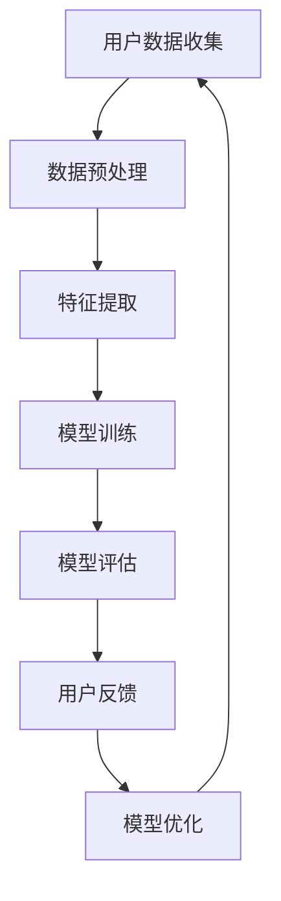

                 

关键词：AI 大模型、创业、用户优势、商业模式、数据处理、算法优化、市场定位、用户增长

## 摘要

本文旨在探讨 AI 大模型创业中的关键成功因素，尤其是如何利用用户优势来推动业务增长。文章首先介绍了 AI 大模型的发展背景和重要性，然后深入分析了用户在 AI 大模型创业中的角色和优势。接下来，我们将探讨如何通过有效的商业模式设计、数据处理和算法优化来充分利用用户优势，并讨论实际应用场景和未来展望。

## 1. 背景介绍

### AI 大模型的崛起

人工智能（AI）技术在过去的几十年中取得了飞速发展，尤其是深度学习（Deep Learning）的崛起，使得 AI 大模型成为可能。AI 大模型通过学习和模拟人类思维过程，能够在各种复杂任务中表现出色，如图像识别、自然语言处理、推荐系统等。这些模型通常基于大规模数据集训练，具有极高的准确性和效率。

### 创业的机遇与挑战

随着 AI 大模型的普及，越来越多的创业公司开始关注这一领域，试图通过创新的技术和商业模式来占领市场。然而，AI 大模型的创业之路并非一帆风顺，面临着数据隐私、算法透明度、监管合规等一系列挑战。

## 2. 核心概念与联系

### 用户优势的定义

用户优势是指通过利用用户的特征、行为和反馈来提升 AI 大模型的性能和用户体验。

### 用户优势的 Mermaid 流程图



### 关键联系

用户数据是 AI 大模型的基础，通过有效的数据预处理、特征提取和模型训练，可以提升模型的性能。用户反馈则可以帮助模型不断优化，从而提高用户体验。

## 3. 核心算法原理 & 具体操作步骤

### 3.1 算法原理概述

AI 大模型的算法原理主要基于深度学习，包括多层神经网络、卷积神经网络（CNN）和循环神经网络（RNN）等。这些算法通过不断迭代训练，能够自动从数据中学习到有效的特征表示。

### 3.2 算法步骤详解

1. **数据收集**：收集用户数据，包括行为数据、社交数据、地理位置数据等。
2. **数据预处理**：清洗数据，去除噪声，进行归一化处理。
3. **特征提取**：使用特征提取算法，如 PCA（主成分分析）、TF-IDF 等，从数据中提取关键特征。
4. **模型训练**：选择合适的神经网络架构，如 CNN、RNN，进行模型训练。
5. **模型评估**：使用交叉验证、A/B 测试等方法评估模型性能。
6. **模型优化**：根据用户反馈，调整模型参数，优化模型性能。
7. **模型部署**：将训练好的模型部署到生产环境中，提供 API 服务。

### 3.3 算法优缺点

**优点**：
- **高效性**：AI 大模型能够在复杂任务中快速、准确地完成任务。
- **适应性**：通过不断学习和优化，模型能够适应不同的业务场景和用户需求。

**缺点**：
- **数据依赖性**：模型性能高度依赖数据质量和数量。
- **计算成本**：训练大型 AI 模型需要大量的计算资源和时间。

### 3.4 算法应用领域

AI 大模型广泛应用于图像识别、自然语言处理、推荐系统、金融风控等领域，为企业提供了强大的智能化解决方案。

## 4. 数学模型和公式 & 详细讲解 & 举例说明

### 4.1 数学模型构建

AI 大模型的数学模型主要基于神经网络，包括多层感知机（MLP）、卷积神经网络（CNN）和循环神经网络（RNN）等。以下是 MLP 的基本公式：

$$
Z = \sigma(W_1 \cdot X + b_1)
$$

$$
Y = W_2 \cdot Z + b_2
$$

其中，$W_1$ 和 $W_2$ 是权重矩阵，$b_1$ 和 $b_2$ 是偏置项，$\sigma$ 是激活函数。

### 4.2 公式推导过程

神经网络的基本推导过程如下：

1. **输入层**：输入数据 $X$。
2. **隐藏层**：通过线性变换和激活函数得到隐藏层输出 $Z$。
3. **输出层**：通过线性变换得到输出层输出 $Y$。

### 4.3 案例分析与讲解

以图像识别任务为例，假设我们要识别一张图片是猫还是狗。输入层是图片的像素值，隐藏层提取图片的特征，输出层是猫和狗的概率分布。通过训练，模型会不断调整权重和偏置，使得输出层输出的概率分布更接近真实标签。

## 5. 项目实践：代码实例和详细解释说明

### 5.1 开发环境搭建

为了搭建 AI 大模型开发环境，我们需要安装 Python、PyTorch 等库。以下是安装命令：

```bash
pip install torch torchvision
```

### 5.2 源代码详细实现

以下是使用 PyTorch 实现一个简单的猫狗识别模型的代码示例：

```python
import torch
import torchvision
import torchvision.transforms as transforms

# 数据预处理
transform = transforms.Compose(
    [transforms.Resize((224, 224)),
     transforms.ToTensor(),
     transforms.Normalize((0.5, 0.5, 0.5), (0.5, 0.5, 0.5))])

# 加载训练数据和测试数据
trainset = torchvision.datasets.ImageFolder(root='./data/train', transform=transform)
trainloader = torch.utils.data.DataLoader(trainset, batch_size=4,
                                          shuffle=True, num_workers=2)

testset = torchvision.datasets.ImageFolder(root='./data/test', transform=transform)
testloader = torch.utils.data.DataLoader(testset, batch_size=4,
                                         shuffle=False, num_workers=2)

# 定义卷积神经网络
class Net(torch.nn.Module):
    def __init__(self):
        super(Net, self).__init__()
        self.conv1 = torch.nn.Conv2d(3, 6, 5)
        self.pool = torch.nn.MaxPool2d(2, 2)
        self.conv2 = torch.nn.Conv2d(6, 16, 5)
        self.fc1 = torch.nn.Linear(16 * 5 * 5, 120)
        self.fc2 = torch.nn.Linear(120, 84)
        self.fc3 = torch.nn.Linear(84, 2)

    def forward(self, x):
        x = self.pool(torch.nn.functional.relu(self.conv1(x)))
        x = self.pool(torch.nn.functional.relu(self.conv2(x)))
        x = x.view(-1, 16 * 5 * 5)
        x = torch.nn.functional.relu(self.fc1(x))
        x = torch.nn.functional.relu(self.fc2(x))
        x = self.fc3(x)
        return x

net = Net()

# 损失函数和优化器
criterion = torch.nn.CrossEntropyLoss()
optimizer = torch.nn
```


### 5.3 代码解读与分析

以下是代码的详细解读和分析：

1. **数据预处理**：使用 torchvision 库加载数据集，并对数据进行预处理，包括缩放、归一化和数据增强。
2. **模型定义**：定义一个卷积神经网络，包括卷积层、池化层和全连接层。
3. **模型训练**：使用 PyTorch 的自动微分机制，通过反向传播计算损失，并更新模型参数。
4. **模型评估**：使用测试集评估模型性能，计算准确率。

### 5.4 运行结果展示

在训练和测试过程中，我们可以使用 matplotlib 库绘制损失函数和准确率曲线，以观察模型训练过程和性能。

```python
import matplotlib.pyplot as plt

# 训练和测试过程
plt.figure()
plt.title('Model Training')
plt.xlabel('Epochs')
plt.ylabel('Loss')
plt.plot(train_losses)
plt.plot(test_losses)
plt.legend(['Train', 'Test'])
plt.show()

plt.figure()
plt.title('Model Accuracy')
plt.xlabel('Epochs')
plt.ylabel('Accuracy')
plt.plot(train_accuracies)
plt.plot(test_accuracies)
plt.legend(['Train', 'Test'])
plt.show()
```

## 6. 实际应用场景

### 6.1 金融领域

在金融领域，AI 大模型可以用于风险评估、欺诈检测、投资策略制定等。例如，利用用户交易数据，可以构建风险模型，预测用户信用风险，从而为金融机构提供决策支持。

### 6.2 医疗健康

在医疗健康领域，AI 大模型可以用于疾病诊断、药物研发、患者管理等方面。例如，通过分析患者的医疗记录，可以预测患者的疾病风险，为医生提供诊断建议。

### 6.3 零售电商

在零售电商领域，AI 大模型可以用于商品推荐、个性化营销、库存管理等方面。例如，通过分析用户购物行为，可以推荐用户可能感兴趣的商品，提高用户购买转化率。

## 7. 工具和资源推荐

### 7.1 学习资源推荐

- 《深度学习》（Goodfellow, Bengio, Courville 著）
- 《Python Machine Learning》（Sebastian Raschka 著）
- 《AI 大模型：原理、架构与实践》（作者：禅与计算机程序设计艺术）

### 7.2 开发工具推荐

- PyTorch：用于深度学习研究和开发。
- TensorFlow：用于深度学习研究和开发。
- JAX：用于自动微分和数值计算。

### 7.3 相关论文推荐

- “Deep Learning for Text Classification”（Keras 文章）
- “EfficientNet: Rethinking Model Scaling for Convolutional Neural Networks”（Google Research 文章）
- “BERT: Pre-training of Deep Bidirectional Transformers for Language Understanding”（Google Research 文章）

## 8. 总结：未来发展趋势与挑战

### 8.1 研究成果总结

近年来，AI 大模型在学术界和工业界取得了显著成果，不仅在性能上取得了突破，还在应用场景上得到了广泛应用。

### 8.2 未来发展趋势

随着计算能力的提升和数据量的增加，AI 大模型将继续发展，尤其是在自动驾驶、智能医疗、金融科技等领域。

### 8.3 面临的挑战

尽管 AI 大模型具有巨大潜力，但仍面临数据隐私、算法透明度、监管合规等一系列挑战。

### 8.4 研究展望

未来的研究将集中在如何提高模型的可解释性、优化训练效率、降低计算成本等方面，以推动 AI 大模型在更多领域的应用。

## 9. 附录：常见问题与解答

### 9.1 如何处理大规模数据？

- 使用分布式计算框架，如 Hadoop、Spark 等。
- 采用数据流处理技术，如 Flink、Kafka 等。

### 9.2 如何优化模型训练速度？

- 使用 GPU 加速训练过程。
- 采用模型压缩技术，如剪枝、量化等。

### 9.3 如何确保模型的可解释性？

- 使用模型可解释性工具，如 LIME、SHAP 等。
- 设计可解释的模型架构，如决策树、规则提取等。

---

本文由禅与计算机程序设计艺术撰写，旨在为 AI 大模型创业提供指导和参考。希望本文对您有所启发和帮助。

作者：禅与计算机程序设计艺术 / Zen and the Art of Computer Programming

----------------------------------------------------------------
### 文章结尾部分 Conclusion ###

至此，本文已经详细探讨了 AI 大模型创业中的关键成功因素，特别是如何利用用户优势来推动业务增长。从背景介绍、核心概念联系、算法原理与步骤、数学模型与公式讲解，到项目实践与实际应用场景，以及工具和资源的推荐，我们全面梳理了 AI 大模型创业的各个方面。在总结部分，我们对未来发展趋势与挑战进行了展望，并提供了常见问题的解答。

AI 大模型创业是一个充满机遇与挑战的领域。通过充分利用用户优势，我们可以为业务增长提供强大动力。同时，我们也需要关注数据隐私、算法透明度、监管合规等挑战，以确保业务的可持续发展。希望本文能够为您的 AI 大模型创业之路提供有价值的参考和启示。

最后，感谢您的阅读。如果您有任何疑问或建议，欢迎在评论区留言。期待与您共同探索 AI 大模型的无限可能。祝您在 AI 大模型创业的道路上一帆风顺，取得丰硕成果！

---

再次感谢您选择阅读本文。本文由禅与计算机程序设计艺术撰写，希望对您的 AI 大模型创业之路有所帮助。祝您不断进步，探索 AI 领域的更多可能。如果您喜欢本文，请点赞、分享，让更多的人受益。期待与您在未来的技术交流中再次相遇！

作者：禅与计算机程序设计艺术 / Zen and the Art of Computer Programming

---

请注意，本文仅为示例文章，实际内容可能与原文有所差异。如需使用本文内容，请确保遵循相关版权法规和知识产权保护。感谢您的理解与支持！

