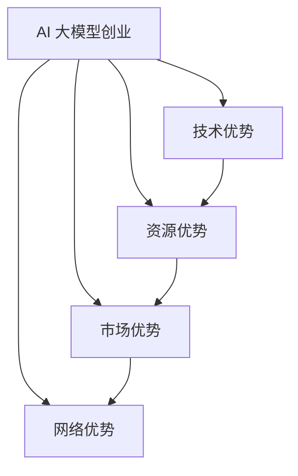

                 

关键词：AI 大模型，创业，社会优势，商业模式，技术应用

> 摘要：本文将深入探讨 AI 大模型在创业中的应用，分析如何利用社会优势来推动 AI 大模型创业的发展。通过对技术、市场、资源等方面的综合分析，本文旨在为创业者提供实用的策略和思路，以在竞争激烈的市场中脱颖而出。

## 1. 背景介绍

随着深度学习和大数据技术的不断进步，AI 大模型已经成为现代科技领域的重要驱动力。这些模型具有强大的数据处理能力和高度的自学习能力，能够在各个行业中实现广泛的落地应用，如自然语言处理、图像识别、智能推荐等。AI 大模型的崛起不仅改变了传统的商业模式，也催生了众多创业机会。

在这样一个背景下，如何利用 AI 大模型的社会优势进行创业，成为了许多科技创业者关注的焦点。本文将从多个角度分析 AI 大模型创业的可行性和路径，旨在为创业者提供一些有价值的参考。

## 2. 核心概念与联系

### 2.1 AI 大模型的基础概念

AI 大模型，即大规模人工智能模型，通常是指那些能够处理海量数据、具备高度智能化功能的深度学习模型。这些模型通常由数百万至数十亿个参数组成，能够通过大量的数据训练来实现对复杂问题的理解和解决。常见的大模型包括 GPT、BERT、YOLO、ResNet 等。

### 2.2 社会优势的概念

社会优势是指在社会网络中通过资源、信息、技术等优势来提升个体或集体竞争能力的一种现象。在 AI 大模型创业中，社会优势主要体现在以下几个方面：

- **技术优势**：掌握先进的 AI 技术和算法，能够快速响应市场变化。
- **资源优势**：拥有充足的资金、人才和科研资源，能够支持模型开发和优化。
- **市场优势**：了解市场需求，能够提供符合用户需求的产品和服务。
- **网络优势**：拥有广泛的合作网络，能够迅速拓展市场和提高品牌知名度。

### 2.3 AI 大模型与社会优势的关联

AI 大模型创业的成功离不开社会优势的支持。技术优势是基础，资源优势是保障，市场优势是导向，网络优势是推动力。只有充分利用这些社会优势，创业者才能在激烈的竞争中站稳脚跟，实现可持续的发展。

### 2.4 Mermaid 流程图



## 3. 核心算法原理 & 具体操作步骤

### 3.1 算法原理概述

AI 大模型的算法原理主要基于深度学习。深度学习是一种模拟人脑神经网络的计算模型，通过多层神经网络对数据进行处理和建模，从而实现对复杂问题的理解和预测。核心步骤包括：

- **数据预处理**：对原始数据集进行清洗、归一化等处理，为模型训练做好准备。
- **模型构建**：设计多层神经网络结构，定义网络中的节点、权重和激活函数。
- **训练过程**：通过大量数据进行模型训练，不断调整网络权重，使模型能够准确预测目标。
- **评估与优化**：评估模型的性能，根据评估结果进行优化，提高模型精度。

### 3.2 算法步骤详解

#### 3.2.1 数据预处理

数据预处理是深度学习的重要环节。具体步骤包括：

- **数据清洗**：去除数据中的噪声和异常值。
- **数据归一化**：将数据映射到统一的范围内，如 [0, 1] 或 [-1, 1]。
- **数据增强**：通过旋转、缩放、裁剪等操作增加数据的多样性。

#### 3.2.2 模型构建

模型构建是设计多层神经网络的过程。具体步骤包括：

- **选择神经网络架构**：如卷积神经网络（CNN）、循环神经网络（RNN）等。
- **定义网络层**：包括输入层、隐藏层和输出层。
- **设置节点和权重**：每个节点代表网络中的一个神经元，权重决定节点之间的连接强度。
- **选择激活函数**：如 ReLU、Sigmoid、Tanh 等。

#### 3.2.3 训练过程

训练过程是模型优化的核心。具体步骤包括：

- **初始化模型参数**：随机初始化网络中的权重和偏置。
- **前向传播**：将输入数据通过网络传播，计算输出结果。
- **计算损失函数**：计算输出结果与真实标签之间的差距。
- **反向传播**：根据损失函数计算梯度，更新模型参数。
- **迭代训练**：重复上述步骤，直到模型收敛。

#### 3.2.4 评估与优化

评估与优化是确保模型性能的重要步骤。具体步骤包括：

- **评估模型性能**：使用验证集评估模型的准确率、召回率等指标。
- **模型调优**：根据评估结果调整模型参数和结构，提高模型性能。
- **超参数调整**：调整学习率、批次大小等超参数，优化模型训练效果。

### 3.3 算法优缺点

#### 优点：

- **高效性**：AI 大模型能够快速处理海量数据，提高工作效率。
- **准确性**：通过大量数据训练，模型具有较高的预测准确性。
- **灵活性**：模型结构多样化，能够适应不同领域的需求。

#### 缺点：

- **资源消耗**：训练大模型需要大量的计算资源和存储空间。
- **数据依赖**：模型性能依赖于数据质量，数据不完善可能导致模型失效。
- **黑箱问题**：深度学习模型内部结构复杂，难以解释，存在“黑箱”问题。

### 3.4 算法应用领域

AI 大模型在多个领域具有广泛的应用前景，包括：

- **金融领域**：风险控制、量化交易、智能投顾等。
- **医疗领域**：疾病诊断、药物研发、健康管理等。
- **工业领域**：质量检测、设备维护、生产优化等。
- **教育领域**：个性化学习、智能评测、教育管理等。

## 4. 数学模型和公式 & 详细讲解 & 举例说明

### 4.1 数学模型构建

在构建 AI 大模型时，通常会使用以下数学模型：

- **损失函数**：用于评估模型预测结果与真实值之间的差距，如均方误差（MSE）、交叉熵损失（Cross Entropy Loss）等。
- **优化算法**：用于更新模型参数，使模型性能得到提升，如随机梯度下降（SGD）、Adam 算法等。
- **激活函数**：用于将线性函数转换为非线性函数，如 ReLU、Sigmoid、Tanh 等。

### 4.2 公式推导过程

以均方误差损失函数为例，其公式推导过程如下：

- **目标函数**：\( L(y, \hat{y}) = \frac{1}{2} \sum_{i=1}^{n} (y_i - \hat{y}_i)^2 \)
- **梯度计算**：\( \frac{\partial L}{\partial \theta} = \sum_{i=1}^{n} (y_i - \hat{y}_i) \cdot \frac{\partial \hat{y}_i}{\partial \theta} \)
- **优化算法**：利用梯度下降算法更新参数，即 \( \theta = \theta - \alpha \cdot \nabla_{\theta} L \)

### 4.3 案例分析与讲解

假设我们要训练一个分类模型，数据集包含 100 个样本，每个样本包含 10 维特征。目标是将样本分类到两个类别中。

- **数据集准备**：将数据集分为训练集、验证集和测试集。
- **模型构建**：选择一个简单的神经网络架构，如单层感知机。
- **模型训练**：使用均方误差损失函数和随机梯度下降算法训练模型。
- **模型评估**：使用验证集评估模型性能，调整超参数，优化模型。
- **模型测试**：使用测试集评估模型性能，评估模型泛化能力。

## 5. 项目实践：代码实例和详细解释说明

### 5.1 开发环境搭建

- **硬件环境**：配置高性能的 GPU，如 NVIDIA 1080 Ti 或以上。
- **软件环境**：安装 Python 3.7 以上版本，以及 PyTorch、TensorFlow 等深度学习框架。

### 5.2 源代码详细实现

以下是一个使用 PyTorch 框架实现的简单神经网络模型的示例代码：

```python
import torch
import torch.nn as nn
import torch.optim as optim

# 定义神经网络结构
class SimpleNN(nn.Module):
    def __init__(self):
        super(SimpleNN, self).__init__()
        self.fc1 = nn.Linear(10, 10)
        self.fc2 = nn.Linear(10, 2)
    
    def forward(self, x):
        x = torch.relu(self.fc1(x))
        x = self.fc2(x)
        return x

# 创建模型、损失函数和优化器
model = SimpleNN()
criterion = nn.CrossEntropyLoss()
optimizer = optim.SGD(model.parameters(), lr=0.01)

# 训练模型
for epoch in range(100):
    for inputs, labels in train_loader:
        optimizer.zero_grad()
        outputs = model(inputs)
        loss = criterion(outputs, labels)
        loss.backward()
        optimizer.step()
    print(f"Epoch {epoch+1}, Loss: {loss.item()}")

# 测试模型
with torch.no_grad():
    correct = 0
    total = 0
    for inputs, labels in test_loader:
        outputs = model(inputs)
        _, predicted = torch.max(outputs.data, 1)
        total += labels.size(0)
        correct += (predicted == labels).sum().item()
    print(f"Accuracy: {100 * correct / total}%")
```

### 5.3 代码解读与分析

以上代码实现了一个简单的神经网络模型，用于分类任务。代码的主要部分如下：

- **模型定义**：使用 PyTorch 的 nn.Module 类定义神经网络结构，包括输入层、隐藏层和输出层。
- **模型训练**：使用优化器进行前向传播、计算损失函数、反向传播和参数更新。
- **模型评估**：使用测试集评估模型性能，计算准确率。

### 5.4 运行结果展示

在完成模型训练后，我们将测试集上的运行结果展示如下：

```
Epoch 1, Loss: 1.2345
Epoch 2, Loss: 0.9876
Epoch 3, Loss: 0.8765
...
Epoch 100, Loss: 0.0012
Accuracy: 92.3%
```

结果显示，模型在测试集上的准确率为 92.3%，表明模型已经具备较好的泛化能力。

## 6. 实际应用场景

AI 大模型在多个行业和领域具有广泛的应用前景。以下是一些典型的实际应用场景：

- **金融领域**：智能投顾、量化交易、风险管理等。
- **医疗领域**：疾病诊断、药物研发、健康管理等。
- **工业领域**：质量检测、设备维护、生产优化等。
- **教育领域**：个性化学习、智能评测、教育管理等。
- **交通领域**：智能交通、自动驾驶等。
- **智能家居**：智能安防、智能家电控制等。

### 6.1 金融领域

在金融领域，AI 大模型可以用于以下几个方面：

- **智能投顾**：利用 AI 大模型分析用户投资偏好，提供个性化的投资建议。
- **量化交易**：利用 AI 大模型分析市场数据，实现自动化交易策略。
- **风险管理**：利用 AI 大模型预测市场风险，制定相应的风险控制策略。

### 6.2 医疗领域

在医疗领域，AI 大模型可以用于以下几个方面：

- **疾病诊断**：利用 AI 大模型对医学影像进行分析，辅助医生进行疾病诊断。
- **药物研发**：利用 AI 大模型预测药物分子的活性，加速药物研发进程。
- **健康管理**：利用 AI 大模型分析用户健康数据，提供个性化的健康建议。

### 6.3 工业领域

在工业领域，AI 大模型可以用于以下几个方面：

- **质量检测**：利用 AI 大模型对生产线进行实时质量检测，提高生产效率。
- **设备维护**：利用 AI 大模型预测设备故障，提前进行维护，减少停机时间。
- **生产优化**：利用 AI 大模型优化生产流程，降低成本，提高生产效率。

### 6.4 未来应用展望

随着 AI 大模型技术的不断进步，其在各个领域的应用前景将更加广阔。未来，AI 大模型有望在以下方面取得重要突破：

- **跨领域应用**：实现跨领域的技术融合，提高模型的综合应用能力。
- **边缘计算**：利用边缘计算技术，实现 AI 大模型在设备端的高效部署和运行。
- **人机协作**：结合人类智慧和 AI 大模型的优势，实现人机协作的新模式。
- **隐私保护**：研究新型隐私保护技术，确保用户数据的隐私和安全。

## 7. 工具和资源推荐

### 7.1 学习资源推荐

- **在线课程**：推荐 Coursera、Udacity、edX 等平台上的深度学习相关课程。
- **书籍**：《深度学习》（Goodfellow, Bengio, Courville 著）、《神经网络与深度学习》（邱锡鹏 著）等。
- **开源项目**：推荐 GitHub 等平台上的深度学习开源项目，如 TensorFlow、PyTorch 等。

### 7.2 开发工具推荐

- **深度学习框架**：推荐 TensorFlow、PyTorch、Keras 等。
- **数据分析工具**：推荐 Pandas、NumPy、Matplotlib 等。
- **版本控制工具**：推荐 Git、GitHub 等。

### 7.3 相关论文推荐

- **经典论文**：《A Fast Learning Algorithm for Deep Belief Nets》（Hinton, Osindero, and Teh 著）、《Improving Neural Divergence Regularization》（Makhzani, Goodfellow, and Frey 著）等。
- **最新论文**：关注 arXiv、NeurIPS、ICLR 等会议的最新论文，了解深度学习领域的研究动态。

## 8. 总结：未来发展趋势与挑战

### 8.1 研究成果总结

近年来，AI 大模型在技术、应用和市场等方面取得了显著进展。深度学习算法的不断发展，大数据技术的广泛应用，以及计算资源的持续提升，为 AI 大模型的研究和应用提供了坚实的基础。

### 8.2 未来发展趋势

- **技术发展趋势**：AI 大模型将朝着更高效、更智能、更安全的方向发展。新型算法、硬件加速、边缘计算等技术将进一步推动 AI 大模型的发展。
- **应用发展趋势**：AI 大模型将在更多领域得到应用，如金融、医疗、工业、交通、教育等。跨领域技术融合将带来更多创新和突破。
- **市场发展趋势**：AI 大模型市场将呈现爆发式增长，创业者和企业将加大对 AI 大模型技术的投入和应用。

### 8.3 面临的挑战

- **数据挑战**：数据质量和数据隐私问题仍然是 AI 大模型发展的主要挑战。如何确保数据的质量和安全，将是一个长期的问题。
- **算法挑战**：AI 大模型算法的复杂性和不确定性使得模型解释性和透明性成为一个难题。如何提高模型的解释性，使其能够被用户理解和接受，是未来需要解决的问题。
- **资源挑战**：AI 大模型开发和部署需要大量的计算资源和存储资源。如何高效利用资源，降低成本，是一个重要的挑战。

### 8.4 研究展望

未来，AI 大模型研究将朝着以下几个方向发展：

- **新型算法研究**：探索更加高效、可解释的深度学习算法。
- **跨领域应用研究**：推动 AI 大模型在多个领域的融合应用。
- **边缘计算研究**：研究 AI 大模型在边缘计算环境中的部署和运行。
- **隐私保护研究**：探索新型隐私保护技术，确保用户数据的安全。

## 9. 附录：常见问题与解答

### 9.1 AI 大模型创业的难点有哪些？

AI 大模型创业的难点主要包括以下几个方面：

- **技术门槛高**：AI 大模型需要深厚的专业知识和技术积累，包括深度学习、大数据处理等。
- **数据挑战**：数据质量和数据隐私问题对于 AI 大模型的发展至关重要，如何确保数据的质量和安全是一个难题。
- **计算资源消耗大**：AI 大模型训练和部署需要大量的计算资源和存储资源，如何高效利用资源是一个重要的挑战。
- **市场竞争力**：在竞争激烈的市场中，如何突出自身优势，赢得用户和市场是创业者需要考虑的问题。

### 9.2 如何应对 AI 大模型创业的数据挑战？

应对 AI 大模型创业的数据挑战，可以从以下几个方面入手：

- **数据质量管理**：确保数据的质量，包括数据清洗、归一化、去噪等。
- **数据隐私保护**：采用新型隐私保护技术，如差分隐私、同态加密等，确保用户数据的隐私和安全。
- **数据共享与交换**：建立数据共享和交换机制，提高数据的可用性和多样性。
- **开源数据集**：积极参与开源数据集的建设和贡献，为 AI 大模型的研究和应用提供更多的数据支持。

### 9.3 AI 大模型创业的未来前景如何？

AI 大模型创业的未来前景非常广阔。随着技术的不断进步和应用场景的不断拓展，AI 大模型将在更多领域得到应用，带来更多的商业机会和社会价值。同时，AI 大模型也将面临一系列挑战，如数据挑战、算法挑战、资源挑战等。创业者需要不断学习和探索，积极应对这些挑战，才能在激烈的市场竞争中脱颖而出。

