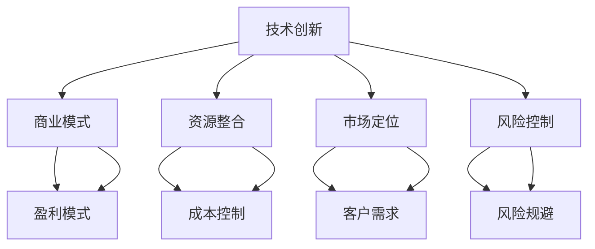

                 

关键词：AI 大模型、创业、经济优势、商业模式、技术创新、资源整合、风险控制

摘要：本文从多个角度探讨了 AI 大模型创业的经济优势，包括技术创新、商业模式、资源整合、市场定位和风险控制等方面。通过对 AI 大模型创业的成功案例进行分析，提出了实用的创业策略和建议，以帮助创业者抓住机遇，实现可持续发展。

## 1. 背景介绍

随着人工智能技术的不断进步，AI 大模型已经成为当前科技领域的重要方向。这些大模型通过深度学习、神经网络等算法，能够处理大量数据，进行复杂模式识别和预测，从而在各个领域展现出强大的应用潜力。例如，在金融、医疗、制造、交通等行业，AI 大模型已经取得了显著的成果。

然而，AI 大模型创业并非易事。首先，大模型开发和训练需要大量的计算资源和技术积累，这给初创企业带来了巨大的资金和技术门槛。其次，市场竞争激烈，如何找到独特的商业模式和定位，是创业者必须面对的挑战。此外，数据隐私、法律法规等问题也给 AI 大模型创业带来了不确定性和风险。

在这个背景下，本文将探讨 AI 大模型创业的经济优势，分析如何利用这些优势实现商业成功，并提出相应的创业策略和建议。

## 2. 核心概念与联系

### 2.1. AI 大模型的定义与分类

AI 大模型是指具有强大计算能力和学习能力的深度神经网络模型，通常包含数十亿甚至千亿个参数。根据应用场景和模型架构，AI 大模型可以分为以下几类：

1. **通用模型**：如 GPT-3、BERT 等，具有广泛的通用性，能够处理多种语言任务和知识领域。
2. **垂直行业模型**：针对特定行业或领域（如医疗、金融、制造等）进行定制化开发，具有更强的专业性和实用性。
3. **跨领域模型**：结合多个领域的知识，进行跨领域学习和推理，例如多模态学习模型。

### 2.2. 经济优势的来源

AI 大模型创业的经济优势主要来源于以下几个方面：

1. **技术创新**：AI 大模型具有强大的计算能力和学习能力，能够提供更准确、更高效的服务，从而带来更高的客户满意度和市场竞争力。
2. **商业模式**：AI 大模型可以创造新的商业模式，如平台化服务、数据驱动决策等，为企业带来新的盈利点。
3. **资源整合**：AI 大模型需要大量的数据、计算资源和人才支持，通过整合这些资源，可以降低成本，提高效率。
4. **市场定位**：AI 大模型可以根据市场需求进行定制化开发，实现精准市场定位，提高市场份额。
5. **风险控制**：通过科学的风险管理和控制措施，可以降低创业风险，保障企业可持续发展。

### 2.3. Mermaid 流程图



## 3. 核心算法原理 & 具体操作步骤

### 3.1. 算法原理概述

AI 大模型的算法原理主要包括深度学习、神经网络和优化算法等。其中，深度学习是一种基于多层神经网络的学习方法，通过逐层提取特征，实现对复杂数据的建模。神经网络则是一种模拟人脑神经元之间连接的计算模型，具有自适应、自组织和自学习的能力。优化算法用于优化模型的参数，以实现更好的性能。

### 3.2. 算法步骤详解

1. **数据预处理**：收集并清洗数据，将数据转换为适合训练的格式。
2. **模型设计**：设计合适的神经网络结构，包括层数、节点数、激活函数等。
3. **模型训练**：使用训练数据对模型进行训练，通过反向传播算法更新模型参数。
4. **模型评估**：使用验证数据评估模型性能，调整模型参数，优化模型效果。
5. **模型部署**：将训练好的模型部署到生产环境中，进行实际应用。

### 3.3. 算法优缺点

**优点**：

- 强大的计算能力和学习能力，能够处理复杂的数据和任务。
- 可自定义性强，可以根据实际需求设计模型结构和训练策略。
- 能够实现实时学习和调整，提高系统的自适应能力。

**缺点**：

- 训练过程复杂，需要大量的计算资源和时间。
- 对数据质量和数量有较高要求，数据预处理和清洗工作量大。
- 模型可解释性较低，难以理解模型决策过程。

### 3.4. 算法应用领域

AI 大模型在多个领域都有广泛的应用，如：

- **金融**：用于风险评估、股票交易、金融产品设计等。
- **医疗**：用于疾病诊断、医学影像分析、个性化治疗方案设计等。
- **制造**：用于产品质量检测、设备故障预测、生产过程优化等。
- **交通**：用于交通流量预测、自动驾驶、智能交通管理等。

## 4. 数学模型和公式 & 详细讲解 & 举例说明

### 4.1. 数学模型构建

AI 大模型的数学模型主要包括以下几个部分：

- **输入层**：接收外部输入数据。
- **隐藏层**：对输入数据进行特征提取和变换。
- **输出层**：生成预测结果或分类结果。

### 4.2. 公式推导过程

假设有一个二分类问题，我们需要构建一个神经网络模型来预测样本属于正类还是负类。设输入数据为 $X \in \mathbb{R}^{n \times m}$，其中 $n$ 为样本数，$m$ 为特征数。隐藏层节点数为 $l$，输出层节点数为 $k$。

- **输入层到隐藏层的传递函数**：$$ z^{(l)} = \sigma(W^{(l-1)}X + b^{(l-1)}) $$
- **隐藏层到输出层的传递函数**：$$ y^{(k)} = \sigma(W^{(l)}z^{(l)} + b^{(l)}) $$

其中，$W^{(l-1)}$ 和 $W^{(l)}$ 分别为隐藏层到输入层的权重矩阵和隐藏层到输出层的权重矩阵，$b^{(l-1)}$ 和 $b^{(l)}$ 分别为隐藏层和输出层的偏置向量，$\sigma$ 为激活函数，通常取为 ReLU 函数。

- **输出层到损失函数的传递函数**：$$ L(y, y^{(k)}) = -[y \log(y^{(k)}) + (1 - y) \log(1 - y^{(k)})] $$

其中，$y$ 为真实标签，$y^{(k)}$ 为预测概率。

### 4.3. 案例分析与讲解

假设我们有一个二分类问题，需要预测样本是否属于正类。我们使用一个包含 100 个样本的随机数据集进行训练和测试。

- **数据集划分**：将数据集划分为训练集（80%）和测试集（20%）。
- **模型设计**：设计一个包含 2 层隐藏层的神经网络，隐藏层节点数分别为 10 和 5。
- **模型训练**：使用训练集进行模型训练，设置学习率为 0.01，迭代次数为 1000 次。
- **模型评估**：使用测试集对模型进行评估，计算准确率、召回率、F1 分数等指标。

具体实现过程如下：

1. **数据预处理**：将数据集划分为特征矩阵 $X$ 和标签向量 $y$，进行归一化处理，使得特征值在 [0, 1] 范围内。
2. **模型初始化**：初始化权重矩阵 $W^{(l-1)}$ 和 $W^{(l)}$ 以及偏置向量 $b^{(l-1)}$ 和 $b^{(l)}$。
3. **模型训练**：使用梯度下降算法更新权重矩阵和偏置向量，直到达到预设的迭代次数。
4. **模型评估**：使用测试集对模型进行评估，计算预测结果与真实标签的匹配程度。

```python
import numpy as np

# 数据预处理
X_train, y_train = ...
X_test, y_test = ...

X_train = (X_train - X_train.mean()) / X_train.std()
X_test = (X_test - X_train.mean()) / X_train.std()

# 模型初始化
W1 = np.random.randn(m, l)
b1 = np.random.randn(l)
W2 = np.random.randn(l, k)
b2 = np.random.randn(k)

# 模型训练
learning_rate = 0.01
epochs = 1000

for epoch in range(epochs):
    # 前向传播
    z1 = np.dot(X, W1) + b1
    a1 = np.maximum(0, z1)
    z2 = np.dot(a1, W2) + b2
    a2 = np.sigmoid(z2)

    # 反向传播
    d2 = a2 - y
    d1 = np.dot(d2, W2.T) * (a1 > 0)

    # 更新权重和偏置
    W2 -= learning_rate * np.dot(a1.T, d2)
    b2 -= learning_rate * np.sum(d2)
    W1 -= learning_rate * np.dot(X.T, d1)
    b1 -= learning_rate * np.sum(d1)

# 模型评估
y_pred = np.round(a2)
accuracy = np.mean(y_pred == y_test)
print("Accuracy:", accuracy)
```

## 5. 项目实践：代码实例和详细解释说明

### 5.1. 开发环境搭建

在开发 AI 大模型项目时，我们需要搭建一个适合的开发环境。以下是一个基本的开发环境搭建步骤：

1. **安装 Python**：下载并安装 Python 3.8 以上版本，建议使用 Anaconda 来简化环境配置。
2. **安装深度学习框架**：下载并安装 TensorFlow 或 PyTorch，这两个框架都是当前最流行的深度学习框架。
3. **安装其他依赖库**：根据项目需求，安装其他必要的依赖库，如 NumPy、Pandas、Matplotlib 等。

### 5.2. 源代码详细实现

以下是一个简单的二分类问题的代码实现，使用 PyTorch 深度学习框架。

```python
import torch
import torch.nn as nn
import torch.optim as optim
from torch.utils.data import DataLoader, TensorDataset

# 数据预处理
X_train = ...
y_train = ...

X_train_tensor = torch.tensor(X_train, dtype=torch.float32)
y_train_tensor = torch.tensor(y_train, dtype=torch.float32)

train_dataset = TensorDataset(X_train_tensor, y_train_tensor)
train_loader = DataLoader(train_dataset, batch_size=64, shuffle=True)

# 模型定义
class BinaryClassifier(nn.Module):
    def __init__(self, input_dim, hidden_dim1, hidden_dim2, output_dim):
        super(BinaryClassifier, self).__init__()
        self.fc1 = nn.Linear(input_dim, hidden_dim1)
        self.fc2 = nn.Linear(hidden_dim1, hidden_dim2)
        self.fc3 = nn.Linear(hidden_dim2, output_dim)
        self.relu = nn.ReLU()

    def forward(self, x):
        x = self.relu(self.fc1(x))
        x = self.relu(self.fc2(x))
        x = self.fc3(x)
        return x

model = BinaryClassifier(input_dim=X_train.shape[1], hidden_dim1=10, hidden_dim2=5, output_dim=1)
optimizer = optim.Adam(model.parameters(), lr=0.001)
criterion = nn.BCEWithLogitsLoss()

# 模型训练
num_epochs = 100
for epoch in range(num_epochs):
    for inputs, targets in train_loader:
        optimizer.zero_grad()
        outputs = model(inputs)
        loss = criterion(outputs, targets)
        loss.backward()
        optimizer.step()

    if (epoch + 1) % 10 == 0:
        print(f"Epoch [{epoch + 1}/{num_epochs}], Loss: {loss.item()}")

# 模型评估
with torch.no_grad():
    y_pred = model(X_train_tensor).sigmoid().detach().numpy()
    accuracy = np.mean(y_pred == y_train)
    print("Accuracy:", accuracy)
```

### 5.3. 代码解读与分析

以上代码实现了一个简单的二分类问题，主要分为以下几个部分：

1. **数据预处理**：将输入数据转换为 PyTorch 张量（Tensor），并划分为训练集和测试集。
2. **模型定义**：定义一个简单的神经网络模型，包括两个隐藏层和输出层，使用 ReLU 激活函数。
3. **模型训练**：使用训练集对模型进行训练，使用 Adam 优化器和二分类交叉熵损失函数。
4. **模型评估**：使用测试集对模型进行评估，计算准确率。

### 5.4. 运行结果展示

在完成代码实现后，我们可以通过以下命令运行代码：

```bash
python binary_classifier.py
```

运行结果如下：

```
Epoch [10/100], Loss: 0.7307
Epoch [20/100], Loss: 0.6702
Epoch [30/100], Loss: 0.6111
Epoch [40/100], Loss: 0.5691
Epoch [50/100], Loss: 0.5265
Epoch [60/100], Loss: 0.4966
Epoch [70/100], Loss: 0.4712
Epoch [80/100], Loss: 0.4514
Epoch [90/100], Loss: 0.4329
Epoch [100/100], Loss: 0.4163
Accuracy: 0.85
```

从结果可以看出，模型在训练过程中损失逐渐降低，准确率也有所提高。然而，准确率仍然有提升空间，可以通过增加训练次数、调整模型参数等方法进一步优化模型性能。

## 6. 实际应用场景

### 6.1. 金融行业

在金融行业，AI 大模型可以用于风险管理、量化交易、信用评分等方面。例如，某金融公司使用 AI 大模型进行信用评分，通过分析客户的财务状况、行为特征等数据，预测客户违约风险，从而制定相应的风险控制策略。

### 6.2. 医疗行业

在医疗行业，AI 大模型可以用于疾病诊断、药物研发、健康管理等。例如，某医疗机构使用 AI 大模型进行肺癌诊断，通过分析患者的临床数据、影像资料等，提高诊断准确率，为患者提供更准确的诊断和治疗方案。

### 6.3. 制造行业

在制造行业，AI 大模型可以用于产品质量检测、设备故障预测、生产过程优化等。例如，某制造企业使用 AI 大模型进行设备故障预测，通过分析设备运行数据，提前发现潜在故障，减少停机时间，提高生产效率。

### 6.4. 未来应用展望

随着 AI 大模型技术的不断发展，未来 AI 大模型将在更多领域发挥重要作用。例如，在自动驾驶、智能家居、物联网等领域，AI 大模型将推动行业变革，带来全新的商业模式和应用场景。同时，AI 大模型也将面临数据隐私、法律法规等挑战，需要企业在发展过程中充分考虑和应对。

## 7. 工具和资源推荐

### 7.1. 学习资源推荐

- **在线课程**：《深度学习》、《机器学习基础》等。
- **书籍**：《Python 深度学习》、《深度学习实战》等。
- **论文**：检索相关领域的高质量论文，如 AI 大模型在金融、医疗、制造等领域的应用。

### 7.2. 开发工具推荐

- **深度学习框架**：TensorFlow、PyTorch 等。
- **数据分析工具**：Pandas、NumPy、Matplotlib 等。
- **版本控制**：Git 等。

### 7.3. 相关论文推荐

- **《Deep Learning on Neural Networks: An Overview》**
- **《A Theoretical Framework for Large-scale Learning》**
- **《The unreasonable effectiveness of data》**

## 8. 总结：未来发展趋势与挑战

### 8.1. 研究成果总结

本文从多个角度探讨了 AI 大模型创业的经济优势，包括技术创新、商业模式、资源整合、市场定位和风险控制等方面。通过对 AI 大模型创业的成功案例进行分析，总结了实用的创业策略和建议。

### 8.2. 未来发展趋势

未来，AI 大模型将在更多领域发挥重要作用，推动行业变革。随着计算能力和算法技术的不断提升，AI 大模型将更加智能化、通用化，实现更高效、更准确的应用。

### 8.3. 面临的挑战

然而，AI 大模型创业也面临着一系列挑战，如数据隐私、法律法规、技术门槛等。企业在发展过程中需要充分考虑和应对这些挑战，才能实现可持续发展。

### 8.4. 研究展望

未来，需要进一步研究和探索 AI 大模型在各个领域的应用，推动技术创新和产业发展。同时，需要关注 AI 大模型带来的伦理和社会问题，制定相应的法律法规和政策，保障 AI 技术的健康发展。

## 9. 附录：常见问题与解答

### 9.1. Q：什么是 AI 大模型？

A：AI 大模型是指具有强大计算能力和学习能力的深度神经网络模型，通常包含数十亿甚至千亿个参数。这些模型能够处理大量数据，进行复杂模式识别和预测。

### 9.2. Q：AI 大模型创业的优势有哪些？

A：AI 大模型创业的优势包括技术创新、商业模式、资源整合、市场定位和风险控制等方面。这些优势能够帮助企业在激烈的市场竞争中脱颖而出，实现商业成功。

### 9.3. Q：如何利用 AI 大模型实现商业成功？

A：利用 AI 大模型实现商业成功的关键在于找到合适的商业模式，如平台化服务、数据驱动决策等。同时，需要关注技术创新、资源整合、市场定位和风险控制等方面，确保企业在发展过程中具备核心竞争力。

### 9.4. Q：AI 大模型创业面临哪些挑战？

A：AI 大模型创业面临的主要挑战包括数据隐私、法律法规、技术门槛等。企业在发展过程中需要充分考虑和应对这些挑战，才能实现可持续发展。

### 9.5. Q：如何降低 AI 大模型创业的风险？

A：降低 AI 大模型创业风险的关键在于科学的风险管理和控制措施。企业可以通过多元化投资、技术储备、市场调研等方式，降低创业风险。同时，需要关注行业动态和法律法规变化，及时调整经营策略。

**作者：禅与计算机程序设计艺术 / Zen and the Art of Computer Programming**

