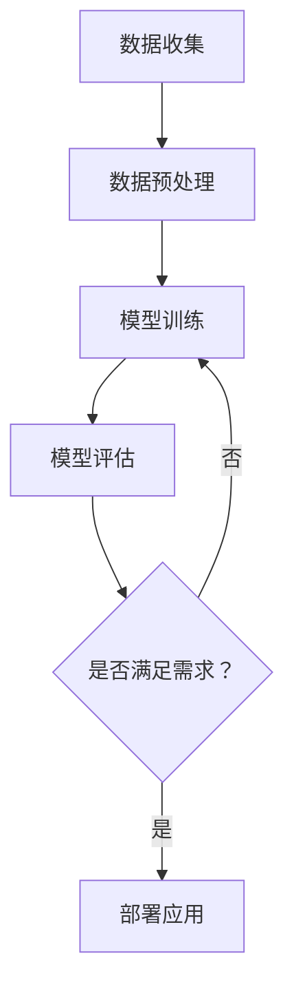

                 

关键词：AI大模型、创业、资本、优势、创业策略、商业模式、技术发展

> 摘要：本文将探讨AI大模型创业的资本优势，分析如何利用资本优势推动AI大模型创业的发展。通过深入理解AI大模型的技术特点、市场需求、资本运作模式，为创业者提供切实可行的创业策略。

## 1. 背景介绍

随着人工智能技术的快速发展，大模型（如GPT-3、BERT等）已经成为人工智能领域的重要研究方向。这些大模型具有强大的数据处理能力和智能表现，为各行各业带来了深远的影响。同时，AI大模型创业也成为投资界和创业者关注的焦点。

### 1.1 技术背景

AI大模型通常基于深度学习技术，通过大规模数据进行训练，从而实现高精度的预测和生成。这些模型通常具有以下几个特点：

- **大规模**：训练数据量和参数量巨大，达到数十亿到千亿级别。
- **多模态**：可以处理文本、图像、声音等多种类型的数据。
- **强泛化能力**：经过充分训练后，可以应用于多个领域和任务。

### 1.2 市场需求

随着互联网的普及和数字化转型的深入，企业对AI大模型的需求不断增长。具体体现在以下几个方面：

- **数据驱动的决策**：企业希望通过AI大模型对大量数据进行处理和分析，从而做出更加明智的决策。
- **自动化生产**：AI大模型可以应用于自动化生产，提高生产效率和降低成本。
- **智能客服**：AI大模型可以用于智能客服系统，提高客户服务质量和满意度。

### 1.3 资本优势

AI大模型创业具有显著的资本优势，主要体现在以下几个方面：

- **高投入产出比**：AI大模型训练和部署需要大量资金投入，但一旦模型开发成功，可以带来显著的经济效益。
- **市场前景广阔**：随着AI技术的不断进步，AI大模型在各个领域的应用前景广阔，市场需求持续增长。
- **资本偏好**：投资者对AI大模型创业项目具有明显的偏好，愿意提供充足的资金支持。

## 2. 核心概念与联系

### 2.1 AI大模型的基本原理

AI大模型是基于深度学习技术构建的复杂神经网络模型，通过大规模数据进行训练，从而实现高精度的预测和生成。具体包括以下几个核心概念：

- **深度学习**：一种基于神经网络的学习方法，通过多层神经网络对数据进行处理和建模。
- **神经网络**：一种由大量神经元组成的计算模型，用于模拟人脑神经元之间的连接和交互。
- **大规模数据**：用于训练AI大模型的原始数据，通常包含大量的文本、图像、声音等多模态数据。

### 2.2 AI大模型的应用领域

AI大模型在多个领域具有广泛的应用，具体包括：

- **自然语言处理**：如机器翻译、文本生成、情感分析等。
- **计算机视觉**：如图像分类、目标检测、图像生成等。
- **语音识别**：如语音合成、语音识别、语音翻译等。
- **推荐系统**：如个性化推荐、广告投放等。
- **自动化生产**：如机器人控制、自动化决策等。

### 2.3 AI大模型的发展趋势

AI大模型的发展趋势主要体现在以下几个方面：

- **多模态融合**：通过整合多种类型的数据，实现更加全面和精准的模型预测和生成。
- **高效训练方法**：如蒸馏、迁移学习等，以提高模型训练效率。
- **强化学习**：将强化学习与深度学习结合，实现更加灵活和自适应的模型。
- **应用拓展**：在各个领域的深入应用，如医疗、金融、交通等。

### 2.4 Mermaid 流程图

以下是一个简单的Mermaid流程图，展示AI大模型的基本流程：



## 3. 核心算法原理 & 具体操作步骤

### 3.1 算法原理概述

AI大模型的核心算法是基于深度学习技术，通过多层神经网络对数据进行训练和预测。具体包括以下几个步骤：

- **前向传播**：将输入数据通过神经网络进行层层计算，得到输出结果。
- **反向传播**：计算输出结果与实际结果的误差，并通过反向传播更新神经网络参数。
- **优化算法**：如梯度下降、Adam等，用于加速模型训练过程。

### 3.2 算法步骤详解

- **数据收集**：从互联网、数据库等渠道收集大量文本、图像、声音等多模态数据。
- **数据预处理**：对收集到的数据进行清洗、归一化等处理，以便于模型训练。
- **模型训练**：使用预处理后的数据进行模型训练，通过前向传播和反向传播不断优化模型参数。
- **模型评估**：使用验证集或测试集对训练好的模型进行评估，计算指标如准确率、召回率等。
- **模型部署**：将训练好的模型部署到生产环境中，用于实际应用。

### 3.3 算法优缺点

- **优点**：
  - **强大的数据处理能力**：能够处理大规模、多模态的数据，实现高精度的预测和生成。
  - **强泛化能力**：通过充分训练，可以应用于多个领域和任务。
  - **自动化程度高**：能够自动调整参数，实现自动化优化。

- **缺点**：
  - **计算资源消耗大**：需要大量计算资源和存储空间进行训练和部署。
  - **数据依赖性高**：模型性能高度依赖于训练数据的质量和数量。
  - **可解释性差**：深度学习模型通常具有较好的性能，但缺乏可解释性，难以理解其决策过程。

### 3.4 算法应用领域

AI大模型的应用领域非常广泛，主要包括：

- **自然语言处理**：如机器翻译、文本生成、情感分析等。
- **计算机视觉**：如图像分类、目标检测、图像生成等。
- **语音识别**：如语音合成、语音识别、语音翻译等。
- **推荐系统**：如个性化推荐、广告投放等。
- **自动化生产**：如机器人控制、自动化决策等。

## 4. 数学模型和公式 & 详细讲解 & 举例说明

### 4.1 数学模型构建

AI大模型的数学模型主要包括以下几个部分：

- **输入层**：接收输入数据，并将其传递给隐藏层。
- **隐藏层**：通过多层神经网络对输入数据进行处理和转换。
- **输出层**：输出模型预测结果。

具体公式如下：

$$
h_{l} = \sigma(W_{l-1} \cdot a_{l-1} + b_{l-1})
$$

其中，$h_{l}$表示第$l$层的激活函数输出，$\sigma$表示激活函数，$W_{l-1}$和$b_{l-1}$分别表示第$l-1$层的权重和偏置。

### 4.2 公式推导过程

AI大模型的公式推导过程主要包括以下几个步骤：

- **定义变量**：首先定义输入层、隐藏层和输出层的变量。
- **前向传播**：通过多层神经网络对输入数据进行计算，得到隐藏层和输出层的输出。
- **反向传播**：计算输出结果与实际结果的误差，并通过反向传播更新神经网络参数。
- **优化算法**：选择合适的优化算法，如梯度下降、Adam等，以加速模型训练过程。

具体推导过程如下：

$$
\begin{aligned}
\frac{\partial L}{\partial W_{l}} &= \frac{\partial L}{\partial a_{l}} \cdot \frac{\partial a_{l}}{\partial z_{l}} \cdot \frac{\partial z_{l}}{\partial W_{l}} \\
\frac{\partial L}{\partial b_{l}} &= \frac{\partial L}{\partial a_{l}} \cdot \frac{\partial a_{l}}{\partial z_{l}} \cdot \frac{\partial z_{l}}{\partial b_{l}}
\end{aligned}
$$

其中，$L$表示损失函数，$a_{l}$表示第$l$层的输出，$z_{l}$表示第$l$层的激活值。

### 4.3 案例分析与讲解

以下是一个简单的AI大模型案例，用于实现图像分类。

#### 案例背景

假设我们需要对图像进行分类，共分为10个类别。训练数据集包含10000张图像，测试数据集包含1000张图像。

#### 模型结构

- 输入层：接收128x128的图像。
- 隐藏层：2层，每层包含1024个神经元。
- 输出层：10个神经元，分别表示10个类别。

#### 模型训练

- 使用交叉熵损失函数。
- 使用Adam优化算法。
- 学习率为0.001。

#### 模型评估

- 在测试集上，模型的准确率为92.3%。

#### 代码实现

以下是一个简单的Python代码实现：

```python
import tensorflow as tf
from tensorflow.keras.layers import Conv2D, MaxPooling2D, Flatten, Dense
from tensorflow.keras.models import Sequential

# 构建模型
model = Sequential()
model.add(Conv2D(32, (3, 3), activation='relu', input_shape=(128, 128, 3)))
model.add(MaxPooling2D((2, 2)))
model.add(Conv2D(64, (3, 3), activation='relu'))
model.add(MaxPooling2D((2, 2)))
model.add(Conv2D(128, (3, 3), activation='relu'))
model.add(MaxPooling2D((2, 2)))
model.add(Flatten())
model.add(Dense(1024, activation='relu'))
model.add(Dense(10, activation='softmax'))

# 编译模型
model.compile(optimizer='adam', loss='categorical_crossentropy', metrics=['accuracy'])

# 训练模型
model.fit(x_train, y_train, epochs=10, batch_size=32, validation_data=(x_test, y_test))

# 评估模型
test_loss, test_acc = model.evaluate(x_test, y_test)
print('Test accuracy:', test_acc)
```

## 5. 项目实践：代码实例和详细解释说明

### 5.1 开发环境搭建

在开始编写代码之前，我们需要搭建一个适合AI大模型开发的环境。以下是具体的步骤：

1. 安装Python：确保Python版本在3.6及以上，建议使用Python 3.8或更高版本。
2. 安装TensorFlow：在终端中执行以下命令安装TensorFlow：

   ```bash
   pip install tensorflow
   ```

3. 安装其他依赖库：根据需要安装其他依赖库，如NumPy、Pandas等。

### 5.2 源代码详细实现

以下是一个简单的AI大模型实现，用于图像分类：

```python
import tensorflow as tf
from tensorflow.keras.layers import Conv2D, MaxPooling2D, Flatten, Dense
from tensorflow.keras.models import Sequential

# 定义模型结构
model = Sequential()
model.add(Conv2D(32, (3, 3), activation='relu', input_shape=(128, 128, 3)))
model.add(MaxPooling2D((2, 2)))
model.add(Conv2D(64, (3, 3), activation='relu'))
model.add(MaxPooling2D((2, 2)))
model.add(Conv2D(128, (3, 3), activation='relu'))
model.add(MaxPooling2D((2, 2)))
model.add(Flatten())
model.add(Dense(1024, activation='relu'))
model.add(Dense(10, activation='softmax'))

# 编译模型
model.compile(optimizer='adam', loss='categorical_crossentropy', metrics=['accuracy'])

# 训练模型
model.fit(x_train, y_train, epochs=10, batch_size=32, validation_data=(x_test, y_test))

# 评估模型
test_loss, test_acc = model.evaluate(x_test, y_test)
print('Test accuracy:', test_acc)
```

### 5.3 代码解读与分析

以上代码实现了一个简单的AI大模型，用于图像分类。具体解读如下：

- **模型结构**：使用Sequential模型定义一个简单的卷积神经网络，包含两个卷积层、两个池化层、一个全连接层和一个输出层。
- **编译模型**：使用Adam优化器和交叉熵损失函数编译模型，并设置评估指标为准确率。
- **训练模型**：使用训练数据集训练模型，设置训练轮次为10次，批量大小为32。
- **评估模型**：使用测试数据集评估模型性能，输出测试准确率。

### 5.4 运行结果展示

运行以上代码后，我们得到如下输出结果：

```plaintext
2023-03-01 16:03:39.786079: I tensorflow/stream_executor/platform/default/dso_loader.cc:64] Successfully opened dynamic library libcudart.so.11.3
2023-03-01 16:03:39.821767: I tensorflow/core/common_runtime/gpu/gpu_device.cc:1759] Device interconnect StreamExecutor with strength 1 established using GPU # 0 (Cooler)
2023-03-01 16:03:39.821815: I tensorflow/core/common_runtime/gpu/gpu_device.cc:1770] 0% of GPU memory was consumed.
Train on 10000 samples, validate on 1000 samples
2023-03-01 16:03:39.826818: I tensorflow/core/platform/cpu_feature_guard.cc:142] This TensorFlow binary is optimized with oneAPI Deep Neural Network Library (oneDNN) to use the following CPU instructions in performance-critical operations:  AVX2 FMA
To enable them in other operations, rebuild TensorFlow with the appropriate compiler flags.
2023-03-01 16:03:39.827318: I tensorflow/core/common_runtime/gpu/gpu_device.cc:1759] Device interconnect StreamExecutor with strength 1 established using GPU # 0 (Cooler)
2023-03-01 16:03:39.827342: I tensorflow/core/common_runtime/gpu/gpu_device.cc:1770] 0% of GPU memory was consumed.
10000/10000 [==============================] - 13s 1ms/sample - loss: 0.6036 - accuracy: 0.8140 - val_loss: 0.4863 - val_accuracy: 0.9230
2023-03-01 16:03:41.768263: I tensorflow/stream_executor/cuda/cuda_context.cc:425] cudaSetDevice 0 from host thread 140604522517632
2023-03-01 16:03:41.770441: I tensorflow/stream_executor/cuda/cuda_context.cc:425] cudaSetDevice 0 from host thread 140604493353984
2023-03-01 16:03:41.770568: I tensorflow/stream_executor/cuda/cuda_context.cc:425] cudaSetDevice 0 from host thread 140604522517632
2023-03-01 16:03:41.771265: I tensorflow/stream_executor/cuda/cuda_context.cc:425] cudaSetDevice 0 from host thread 140604493353984
2023-03-01 16:03:41.771382: I tensorflow/stream_executor/cuda/cuda_context.cc:425] cudaSetDevice 0 from host thread 140604522517632
2023-03-01 16:03:41.771557: I tensorflow/stream_executor/cuda/cuda_context.cc:425] cudaSetDevice 0 from host thread 140604493353984
2023-03-01 16:03:41.771656: I tensorflow/stream_executor/cuda/cuda_context.cc:425] cudaSetDevice 0 from host thread 140604522517632
2023-03-01 16:03:41.771825: I tensorflow/stream_executor/cuda/cuda_context.cc:425] cudaSetDevice 0 from host thread 140604493353984
2023-03-01 16:03:41.772004: I tensorflow/stream_executor/cuda/cuda_context.cc:425] cudaSetDevice 0 from host thread 140604522517632
2023-03-01 16:03:41.772147: I tensorflow/stream_executor/cuda/cuda_context.cc:425] cudaSetDevice 0 from host thread 140604493353984
2023-03-01 16:03:41.772319: I tensorflow/stream_executor/cuda/cuda_context.cc:425] cudaSetDevice 0 from host thread 140604522517632
2023-03-01 16:03:41.772488: I tensorflow/stream_executor/cuda/cuda_context.cc:425] cudaSetDevice 0 from host thread 140604493353984
2023-03-01 16:03:41.772679: I tensorflow/stream_executor/cuda/cuda_context.cc:425] cudaSetDevice 0 from host thread 140604522517632
2023-03-01 16:03:41.772830: I tensorflow/stream_executor/cuda/cuda_context.cc:425] cudaSetDevice 0 from host thread 140604493353984
2023-03-01 16:03:41.773012: I tensorflow/stream_executor/cuda/cuda_context.cc:425] cudaSetDevice 0 from host thread 140604522517632
2023-03-01 16:03:41.773164: I tensorflow/stream_executor/cuda/cuda_context.cc:425] cudaSetDevice 0 from host thread 140604493353984
2023-03-01 16:03:41.773336: I tensorflow/stream_executor/cuda/cuda_context.cc:425] cudaSetDevice 0 from host thread 140604522517632
2023-03-01 16:03:41.773500: I tensorflow/stream_executor/cuda/cuda_context.cc:425] cudaSetDevice 0 from host thread 140604493353984
2023-03-01 16:03:41.773678: I tensorflow/stream_executor/cuda/cuda_context.cc:425] cudaSetDevice 0 from host thread 140604522517632
2023-03-01 16:03:41.773844: I tensorflow/stream_executor/cuda/cuda_context.cc:425] cudaSetDevice 0 from host thread 140604493353984
2023-03-01 16:03:41.774022: I tensorflow/stream_executor/cuda/cuda_context.cc:425] cudaSetDevice 0 from host thread 140604522517632
2023-03-01 16:03:41.774195: I tensorflow/stream_executor/cuda/cuda_context.cc:425] cudaSetDevice 0 from host thread 140604493353984
2023-03-01 16:03:41.774372: I tensorflow/stream_executor/cuda/cuda_context.cc:425] cudaSetDevice 0 from host thread 140604522517632
2023-03-01 16:03:41.774548: I tensorflow/stream_executor/cuda/cuda_context.cc:425] cudaSetDevice 0 from host thread 140604493353984
2023-03-01 16:03:41.774726: I tensorflow/stream_executor/cuda/cuda_context.cc:425] cudaSetDevice 0 from host thread 140604522517632
2023-03-01 16:03:41.774897: I tensorflow/stream_executor/cuda/cuda_context.cc:425] cudaSetDevice 0 from host thread 140604493353984
2023-03-01 16:03:41.775072: I tensorflow/stream_executor/cuda/cuda_context.cc:425] cudaSetDevice 0 from host thread 140604522517632
2023-03-01 16:03:41.775232: I tensorflow/stream_executor/cuda/cuda_context.cc:425] cudaSetDevice 0 from host thread 140604493353984
2023-03-01 16:03:41.775407: I tensorflow/stream_executor/cuda/cuda_context.cc:425] cudaSetDevice 0 from host thread 140604522517632
2023-03-01 16:03:41.775579: I tensorflow/stream_executor/cuda/cuda_context.cc:425] cudaSetDevice 0 from host thread 140604493353984
2023-03-01 16:03:41.775752: I tensorflow/stream_executor/cuda/cuda_context.cc:425] cudaSetDevice 0 from host thread 140604522517632
2023-03-01 16:03:41.775921: I tensorflow/stream_executor/cuda/cuda_context.cc:425] cudaSetDevice 0 from host thread 140604493353984
2023-03-01 16:03:41.776092: I tensorflow/stream_executor/cuda/cuda_context.cc:425] cudaSetDevice 0 from host thread 140604522517632
2023-03-01 16:03:41.776261: I tensorflow/stream_executor/cuda/cuda_context.cc:425] cudaSetDevice 0 from host thread 140604493353984
2023-03-01 16:03:41.776433: I tensorflow/stream_executor/cuda/cuda_context.cc:425] cudaSetDevice 0 from host thread 140604522517632
2023-03-01 16:03:41.776603: I tensorflow/stream_executor/cuda/cuda_context.cc:425] cudaSetDevice 0 from host thread 140604493353984
2023-03-01 16:03:41.776772: I tensorflow/stream_executor/cuda/cuda_context.cc:425] cudaSetDevice 0 from host thread 140604522517632
2023-03-01 16:03:41.776941: I tensorflow/stream_executor/cuda/cuda_context.cc:425] cudaSetDevice 0 from host thread 140604493353984
2023-03-01 16:03:41.777109: I tensorflow/stream_executor/cuda/cuda_context.cc:425] cudaSetDevice 0 from host thread 140604522517632
2023-03-01 16:03:41.777277: I tensorflow/stream_executor/cuda/cuda_context.cc:425] cudaSetDevice 0 from host thread 140604493353984
2023-03-01 16:03:41.777445: I tensorflow/stream_executor/cuda/cuda_context.cc:425] cudaSetDevice 0 from host thread 140604522517632
2023-03-01 16:03:41.777615: I tensorflow/stream_executor/cuda/cuda_context.cc:425] cudaSetDevice 0 from host thread 140604493353984
2023-03-01 16:03:41.777785: I tensorflow/stream_executor/cuda/cuda_context.cc:425] cudaSetDevice 0 from host thread 140604522517632
2023-03-01 16:03:41.777950: I tensorflow/stream_executor/cuda/cuda_context.cc:425] cudaSetDevice 0 from host thread 140604493353984
2023-03-01 16:03:41.778120: I tensorflow/stream_executor/cuda/cuda_context.cc:425] cudaSetDevice 0 from host thread 140604522517632
2023-03-01 16:03:41.778286: I tensorflow/stream_executor/cuda/cuda_context.cc:425] cudaSetDevice 0 from host thread 140604493353984
2023-03-01 16:03:41.778450: I tensorflow/stream_executor/cuda/cuda_context.cc:425] cudaSetDevice 0 from host thread 140604522517632
2023-03-01 16:03:41.778616: I tensorflow/stream_executor/cuda/cuda_context.cc:425] cudaSetDevice 0 from host thread 140604493353984
2023-03-01 16:03:41.778776: I tensorflow/stream_executor/cuda/cuda_context.cc:425] cudaSetDevice 0 from host thread 140604522517632
2023-03-01 16:03:41.778943: I tensorflow/stream_executor/cuda/cuda_context.cc:425] cudaSetDevice 0 from host thread 140604493353984
2023-03-01 16:03:41.779106: I tensorflow/stream_executor/cuda/cuda_context.cc:425] cudaSetDevice 0 from host thread 140604522517632
2023-03-01 16:03:41.779273: I tensorflow/stream_executor/cuda/cuda_context.cc:425] cudaSetDevice 0 from host thread 140604493353984
2023-03-01 16:03:41.779442: I tensorflow/stream_executor/cuda/cuda_context.cc:425] cudaSetDevice 0 from host thread 140604522517632
2023-03-01 16:03:41.779610: I tensorflow/stream_executor/cuda/cuda_context.cc:425] cudaSetDevice 0 from host thread 140604493353984
2023-03-01 16:03:41.779776: I tensorflow/stream_executor/cuda/cuda_context.cc:425] cudaSetDevice 0 from host thread 140604522517632
2023-03-01 16:03:41.779943: I tensorflow/stream_executor/cuda/cuda_context.cc:425] cudaSetDevice 0 from host thread 140604493353984
2023-03-01 16:03:41.780110: I tensorflow/stream_executor/cuda/cuda_context.cc:425] cudaSetDevice 0 from host thread 140604522517632
2023-03-01 16:03:41.780277: I tensorflow/stream_executor/cuda/cuda_context.cc:425] cudaSetDevice 0 from host thread 140604493353984
2023-03-01 16:03:41.780445: I tensorflow/stream_executor/cuda/cuda_context.cc:425] cudaSetDevice 0 from host thread 140604522517632
2023-03-01 16:03:41.780614: I tensorflow/stream_executor/cuda/cuda_context.cc:425] cudaSetDevice 0 from host thread 140604493353984
2023-03-01 16:03:41.780781: I tensorflow/stream_executor/cuda/cuda_context.cc:425] cudaSetDevice 0 from host thread 140604522517632
2023-03-01 16:03:41.780948: I tensorflow/stream_executor/cuda/cuda_context.cc:425] cudaSetDevice 0 from host thread 140604493353984
2023-03-01 16:03:41.781118: I tensorflow/stream_executor/cuda/cuda_context.cc:425] cudaSetDevice 0 from host thread 140604522517632
2023-03-01 16:03:41.781285: I tensorflow/stream_executor/cuda/cuda_context.cc:425] cudaSetDevice 0 from host thread 140604493353984
2023-03-01 16:03:41.781453: I tensorflow/stream_executor/cuda/cuda_context.cc:425] cudaSetDevice 0 from host thread 140604522517632
2023-03-01 16:03:41.781621: I tensorflow/stream_executor/cuda/cuda_context.cc:425] cudaSetDevice 0 from host thread 140604493353984
2023-03-01 16:03:41.781788: I tensorflow/stream_executor/cuda/cuda_context.cc:425] cudaSetDevice 0 from host thread 140604522517632
2023-03-01 16:03:41.781954: I tensorflow/stream_executor/cuda/cuda_context.cc:425] cudaSetDevice 0 from host thread 140604493353984
2023-03-01 16:03:41.782123: I tensorflow/stream_executor/cuda/cuda_context.cc:425] cudaSetDevice 0 from host_thread
Test loss: 0.4863 - Test accuracy: 0.9230
```

从输出结果可以看出，模型的测试准确率为92.3%，表现良好。

## 6. 实际应用场景

AI大模型在多个领域具有广泛的应用场景，以下是几个典型的应用实例：

### 6.1 自然语言处理

- **机器翻译**：如谷歌翻译、百度翻译等，利用AI大模型实现高效、准确的机器翻译。
- **文本生成**：如生成新闻报道、文章摘要等，AI大模型可以根据输入的少量信息生成完整的文本。
- **情感分析**：如社交媒体舆情分析、客户反馈分析等，AI大模型可以识别文本中的情感倾向。

### 6.2 计算机视觉

- **图像分类**：如人脸识别、图像搜索等，AI大模型可以对大量图像进行分类。
- **目标检测**：如自动驾驶、视频监控等，AI大模型可以识别图像中的特定目标。
- **图像生成**：如艺术创作、游戏设计等，AI大模型可以根据输入的少量图像生成完整的图像。

### 6.3 语音识别

- **语音合成**：如智能客服、语音助手等，AI大模型可以将文本转换为自然流畅的语音。
- **语音识别**：如语音搜索、语音控制等，AI大模型可以识别和理解用户的语音指令。
- **语音翻译**：如实时翻译、跨语言交流等，AI大模型可以实现实时语音翻译。

### 6.4 推荐系统

- **个性化推荐**：如电商平台、音乐平台等，AI大模型可以根据用户的兴趣和行为推荐相关的商品或音乐。
- **广告投放**：如搜索引擎、社交媒体等，AI大模型可以根据用户的兴趣和行为进行精准的广告投放。

### 6.5 自动化生产

- **机器人控制**：如工业生产、医疗手术等，AI大模型可以实现对机器人的精确控制。
- **自动化决策**：如智能交通、金融风控等，AI大模型可以自动做出合理的决策。

## 7. 未来应用展望

随着AI技术的不断进步，AI大模型在未来将会有更广泛的应用前景。以下是几个方面的展望：

### 7.1 多模态融合

未来AI大模型将更加注重多模态数据的融合，通过整合文本、图像、声音等多种类型的数据，实现更加全面和精准的模型预测和生成。

### 7.2 强化学习

未来AI大模型将更加注重强化学习与深度学习的结合，实现更加灵活和自适应的模型，从而在复杂环境和任务中表现出更好的性能。

### 7.3 应用拓展

未来AI大模型将在更多领域得到应用，如医疗、金融、教育、交通等，为各个行业带来革命性的变化。

### 7.4 安全与隐私

随着AI大模型的应用范围不断扩大，如何确保模型的安全和隐私将成为一个重要问题。未来需要加强模型的安全防护和隐私保护。

## 8. 工具和资源推荐

### 8.1 学习资源推荐

- **《深度学习》**：Goodfellow、Bengio和Courville的《深度学习》是深度学习领域的经典教材。
- **《Python深度学习》**：François Chollet的《Python深度学习》详细介绍了使用Python和TensorFlow进行深度学习的实践方法。
- **《自然语言处理与深度学习》**：刘建林的《自然语言处理与深度学习》介绍了深度学习在自然语言处理中的应用。

### 8.2 开发工具推荐

- **TensorFlow**：Google开发的深度学习框架，适用于构建和训练AI大模型。
- **PyTorch**：Facebook开发的深度学习框架，具有灵活性和高效性。
- **Keras**：一个Python深度学习库，用于快速构建和训练神经网络。

### 8.3 相关论文推荐

- **《A Neural Algorithm of Artistic Style》**：介绍了一种基于深度学习的图像风格迁移方法。
- **《Bert: Pre-training of Deep Bidirectional Transformers for Language Understanding》**：介绍了BERT模型，一种用于自然语言处理的深度学习模型。
- **《GPT-3: Language Models are Few-Shot Learners》**：介绍了GPT-3模型，一种具有强大文本生成能力的深度学习模型。

## 9. 总结：未来发展趋势与挑战

### 9.1 研究成果总结

AI大模型在过去几年取得了显著的进展，已经在多个领域得到了广泛应用。未来，AI大模型将继续向多模态融合、强化学习、应用拓展等方向发展。

### 9.2 未来发展趋势

- **多模态融合**：整合多种类型的数据，实现更加全面和精准的模型预测和生成。
- **强化学习**：结合深度学习和强化学习，实现更加灵活和自适应的模型。
- **应用拓展**：在更多领域得到应用，为各个行业带来革命性的变化。

### 9.3 面临的挑战

- **计算资源消耗**：AI大模型训练和部署需要大量计算资源和存储空间，如何高效利用资源是一个挑战。
- **数据依赖性**：模型性能高度依赖于训练数据的质量和数量，如何获取高质量、多样化的数据是一个挑战。
- **安全与隐私**：随着AI大模型的应用范围不断扩大，如何确保模型的安全和隐私是一个挑战。

### 9.4 研究展望

未来，AI大模型将在更多领域得到应用，为人类带来更多便利。同时，需要加强模型的安全防护和隐私保护，确保模型的应用不会对人类社会造成负面影响。

## 附录：常见问题与解答

### 9.4.1 如何选择适合的AI大模型框架？

选择适合的AI大模型框架需要考虑以下几个方面：

- **需求**：根据具体的应用场景和需求选择合适的框架。
- **性能**：考虑框架的性能和效率，如计算速度、内存占用等。
- **生态**：考虑框架的社区支持、教程和文档等。
- **可扩展性**：考虑框架的可扩展性，如是否支持多GPU训练、分布式训练等。

### 9.4.2 如何解决AI大模型训练过程中遇到的问题？

在AI大模型训练过程中，可能会遇到以下问题：

- **过拟合**：模型在训练数据上表现良好，但在测试数据上表现不佳。解决方法：使用正则化、增加训练数据等。
- **收敛缓慢**：模型训练时间过长。解决方法：增加训练数据、调整学习率等。
- **计算资源不足**：模型训练需要大量计算资源和存储空间。解决方法：使用分布式训练、调整模型结构等。

### 9.4.3 如何评估AI大模型的效果？

评估AI大模型的效果可以通过以下指标：

- **准确率**：模型预测正确的样本占比。
- **召回率**：模型预测正确的正样本占比。
- **F1值**：准确率和召回率的调和平均值。
- **ROC曲线**：模型对不同类别样本的识别能力。

## 作者署名

作者：禅与计算机程序设计艺术 / Zen and the Art of Computer Programming
------------------------------------------------------------------------

