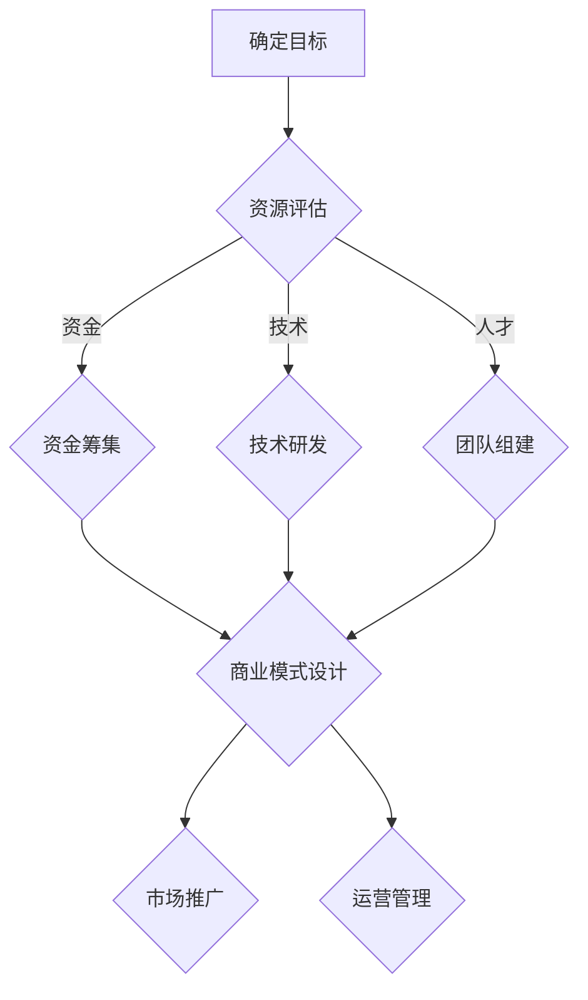

                 

关键词：AI大模型，创业，资源优势，商业模式，技术框架，创业策略

摘要：随着人工智能技术的飞速发展，大模型成为推动产业变革的重要力量。本文将深入探讨AI大模型创业中的关键成功因素，包括资源优势的利用、技术框架的构建、商业模式的设计以及创业策略的实施。通过分析成功案例，本文旨在为创业者和投资者提供有价值的参考和指导。

## 1. 背景介绍

人工智能（AI）作为21世纪最具革命性的技术之一，已经在众多领域取得了显著的成果。从自然语言处理到计算机视觉，从自动驾驶到智能医疗，AI的应用场景日益丰富。然而，随着AI技术的不断进步，对计算资源的需求也呈现指数级增长。大模型，作为一种能够处理大量数据并实现复杂任务的高级AI技术，逐渐成为行业发展的核心驱动力。

大模型创业热潮的兴起，不仅为技术创新带来了新的机遇，也为传统产业的升级和转型提供了强大的支持。然而，创业并非易事，特别是在AI大模型领域，资源的有效利用成为决定创业成败的关键因素。本文将围绕资源优势的利用，探讨AI大模型创业的核心策略和成功路径。

## 2. 核心概念与联系

### 2.1 大模型概念

大模型是指具有海量参数和复杂结构的AI模型，能够处理大规模数据并实现高水平的智能化。常见的AI大模型包括深度神经网络、生成对抗网络（GAN）和变分自编码器（VAE）等。

### 2.2 资源优势定义

资源优势是指企业在创业过程中，能够有效利用各类资源（如资金、技术、人才等）以实现竞争优势的能力。资源优势的利用是AI大模型创业成功的关键。

### 2.3 商业模式关联

资源优势的利用直接影响商业模式的构建和实施。有效的商业模式能够为企业创造可持续的盈利能力，从而确保创业的长期成功。

### 2.4 Mermaid 流程图

下面是AI大模型创业中资源优势利用的Mermaid流程图：



## 3. 核心算法原理 & 具体操作步骤

### 3.1 算法原理概述

AI大模型的核心在于深度学习算法，特别是神经网络。神经网络通过多层神经元之间的连接和激活函数，实现从输入到输出的映射。随着层数的增加和网络规模的扩大，神经网络能够学习更复杂的特征和模式。

### 3.2 算法步骤详解

1. **数据收集与预处理**：收集大量相关数据，并进行清洗、标注和分割等预处理操作。
2. **模型设计**：根据任务需求，设计合适的神经网络结构，包括输入层、隐藏层和输出层。
3. **训练**：使用预处理后的数据对神经网络进行训练，通过反向传播算法不断调整网络参数。
4. **评估与优化**：评估模型在验证集上的性能，并进行调参和优化，以提高模型精度和泛化能力。
5. **部署与应用**：将训练好的模型部署到实际应用场景中，实现自动化和智能化。

### 3.3 算法优缺点

**优点**：

- **强大的表达能力和泛化能力**：神经网络能够学习复杂的数据特征和模式。
- **自适应性和灵活性**：可以根据不同任务需求设计不同的网络结构和算法。

**缺点**：

- **计算成本高**：大模型训练需要大量的计算资源和时间。
- **过拟合风险**：模型在训练数据上表现良好，但在未知数据上可能表现不佳。

### 3.4 算法应用领域

- **自然语言处理**：如文本分类、机器翻译、语音识别等。
- **计算机视觉**：如图像识别、目标检测、图像生成等。
- **智能医疗**：如疾病诊断、医学影像分析、智能药物研发等。
- **自动驾驶**：如路况分析、车辆控制、环境感知等。

## 4. 数学模型和公式 & 详细讲解 & 举例说明

### 4.1 数学模型构建

神经网络的核心在于前向传播和反向传播。以下是一个简化的神经网络前向传播公式：

$$
Z^{[l]} = \sigma(W^{[l]} \cdot A^{[l-1]} + b^{[l]})
$$

其中，\(Z^{[l]}\) 表示第 \(l\) 层的输出，\(\sigma\) 表示激活函数，\(W^{[l]}\) 和 \(b^{[l]}\) 分别表示第 \(l\) 层的权重和偏置。

### 4.2 公式推导过程

神经网络的前向传播公式可以通过递归方式推导。以多层神经网络为例，假设当前层为 \(l\)，则上一层为 \(l-1\)。根据链式法则，我们可以得到：

$$
\frac{\partial Z^{[l]}}{\partial A^{[l-1]}} = \frac{\partial \sigma(Z^{[l]})}{\partial Z^{[l]}} \cdot \frac{\partial Z^{[l]}}{\partial W^{[l]}}
$$

进一步，我们可以得到：

$$
\frac{\partial Z^{[l]}}{\partial W^{[l]}} = A^{[l-1]} \cdot \frac{\partial \sigma(Z^{[l]})}{\partial Z^{[l]}}
$$

### 4.3 案例分析与讲解

假设我们有一个二分类问题，使用一个单层神经网络进行分类。输入特征为 \(x = (x_1, x_2)\)，权重为 \(W = (w_1, w_2)\)，偏置为 \(b = b_0\)。激活函数为 \( \sigma(z) = \frac{1}{1 + e^{-z}} \)。

1. **前向传播**：

   $$ 
   Z = W \cdot x + b 
   $$

   $$ 
   A = \sigma(Z) 
   $$

2. **后向传播**：

   $$ 
   \delta = A - y 
   $$

   $$ 
   \frac{\partial Z}{\partial x} = \delta \cdot \sigma'(Z) 
   $$

   $$ 
   \frac{\partial Z}{\partial W} = x \cdot \delta \cdot \sigma'(Z) 
   $$

通过以上公式，我们可以计算梯度并更新权重和偏置，以优化模型。

## 5. 项目实践：代码实例和详细解释说明

### 5.1 开发环境搭建

在Python环境中，我们可以使用TensorFlow或PyTorch等框架来实现神经网络。以下是一个简单的TensorFlow环境搭建步骤：

1. 安装TensorFlow：

   ```bash
   pip install tensorflow
   ```

2. 验证安装：

   ```python
   import tensorflow as tf
   print(tf.__version__)
   ```

### 5.2 源代码详细实现

以下是一个简单的二分类神经网络实现：

```python
import tensorflow as tf

# 初始化模型参数
W = tf.Variable(tf.random.normal([2, 1]), name='weights')
b = tf.Variable(tf.zeros([1]), name='bias')

# 定义激活函数
def sigmoid(x):
    return 1 / (1 + tf.exp(-x))

# 定义前向传播
def forward(x):
    return sigmoid(tf.matmul(x, W) + b)

# 定义损失函数
def loss(y_true, y_pred):
    return -tf.reduce_mean(y_true * tf.log(y_pred) + (1 - y_true) * tf.log(1 - y_pred))

# 定义反向传播和优化
optimizer = tf.optimizers.Adam()
@tf.function
def train_step(x, y):
    with tf.GradientTape() as tape:
        y_pred = forward(x)
        loss_value = loss(y, y_pred)
    grads = tape.gradient(loss_value, [W, b])
    optimizer.apply_gradients(zip(grads, [W, b]))
    return loss_value

# 训练模型
for epoch in range(100):
    for x, y in dataset:
        loss_value = train_step(x, y)
    print(f"Epoch {epoch + 1}, Loss: {loss_value.numpy()}")

# 预测
x_test = tf.constant([[0.5, 0.5]])
y_pred = forward(x_test)
print(f"Prediction: {sigmoid(y_pred.numpy()).numpy()}")

```

### 5.3 代码解读与分析

1. **模型初始化**：初始化权重 \(W\) 和偏置 \(b\)。
2. **激活函数**：使用Sigmoid函数作为激活函数。
3. **前向传播**：定义前向传播过程，计算输出值。
4. **损失函数**：定义交叉熵损失函数。
5. **反向传播**：使用Adam优化器进行反向传播和权重更新。
6. **训练模型**：通过训练迭代更新模型参数。
7. **预测**：使用训练好的模型进行预测。

## 6. 实际应用场景

### 6.1 智能医疗

AI大模型在智能医疗领域的应用非常广泛，如疾病预测、药物研发和医学影像分析。通过利用海量医疗数据和先进的深度学习算法，大模型能够提供更准确的诊断和治疗建议，从而提高医疗质量和效率。

### 6.2 自动驾驶

自动驾驶技术依赖于计算机视觉和自然语言处理等AI技术，其中AI大模型发挥着关键作用。通过训练大量路况数据和车辆数据，大模型能够实现对路况的实时分析和车辆控制，从而提高自动驾驶的稳定性和安全性。

### 6.3 智能金融

在智能金融领域，AI大模型用于信用评分、风险管理和智能投顾等任务。通过对海量金融数据进行分析和预测，大模型能够提供更精准的金融决策，帮助金融机构降低风险和提高收益。

### 6.4 未来应用展望

随着AI技术的不断发展，AI大模型的应用场景将更加广泛。未来，AI大模型有望在更多领域实现突破，如智慧城市、智能家居和智能制造等。通过不断优化算法和提升计算能力，AI大模型将为人类社会带来更多创新和变革。

## 7. 工具和资源推荐

### 7.1 学习资源推荐

- 《深度学习》（Ian Goodfellow、Yoshua Bengio和Aaron Courville 著）
- 《Python机器学习》（Sebastian Raschka和Vahid Mirjalili 著）
- Coursera上的《机器学习》课程（吴恩达教授）

### 7.2 开发工具推荐

- TensorFlow
- PyTorch
- Jupyter Notebook

### 7.3 相关论文推荐

- "Deep Learning for Speech Recognition: A Review"
- "Generative Adversarial Networks: An Overview"
- "Neural Networks for Natural Language Processing"

## 8. 总结：未来发展趋势与挑战

### 8.1 研究成果总结

AI大模型在多个领域取得了显著成果，如自然语言处理、计算机视觉和智能医疗等。通过不断优化算法和提升计算能力，AI大模型在复杂任务中表现出色，为产业创新和社会发展提供了强大支持。

### 8.2 未来发展趋势

- **算法优化**：通过更高效的算法和优化方法，提高AI大模型的性能和效率。
- **跨领域应用**：拓展AI大模型的应用场景，实现更多领域的突破。
- **隐私保护**：在保障用户隐私的前提下，充分利用海量数据。

### 8.3 面临的挑战

- **计算资源需求**：随着模型规模的扩大，对计算资源的需求将不断增长。
- **数据质量**：高质量的数据是训练高质量模型的必要条件。
- **可解释性**：提高AI大模型的可解释性，使其在关键应用中更具可信度。

### 8.4 研究展望

AI大模型的发展前景广阔，将在未来推动更多领域的变革和创新。通过不断突破技术和资源限制，AI大模型将为人类社会带来更多福祉。

## 9. 附录：常见问题与解答

### 9.1 什么是AI大模型？

AI大模型是指具有海量参数和复杂结构的AI模型，能够处理大规模数据并实现高水平的智能化。常见的AI大模型包括深度神经网络、生成对抗网络（GAN）和变分自编码器（VAE）等。

### 9.2 大模型创业有哪些成功案例？

一些著名的大模型创业成功案例包括Google的BERT、OpenAI的GPT-3和DeepMind的AlphaGo。这些案例展示了大模型在自然语言处理、生成模型和游戏等领域的重要应用。

### 9.3 如何评估AI大模型的性能？

评估AI大模型的性能通常采用多个指标，如准确率、召回率、F1分数等。此外，还可以通过交叉验证和测试集验证等方法，确保模型在不同数据集上的性能表现。

### 9.4 AI大模型创业需要哪些资源？

AI大模型创业需要大量的计算资源、高质量的数据和专业的技术团队。此外，资金支持和市场推广也是成功创业的重要因素。

### 9.5 大模型创业中的常见挑战有哪些？

大模型创业中的常见挑战包括计算资源需求、数据质量、可解释性和隐私保护等。此外，市场竞争和商业模式设计也是成功创业的关键因素。

## 作者署名

作者：禅与计算机程序设计艺术 / Zen and the Art of Computer Programming

以上就是关于《AI大模型创业：如何利用资源优势？》的文章，希望对您有所帮助。在未来，随着AI技术的不断进步，AI大模型创业将继续发挥重要作用，为人类社会的进步和发展贡献力量。

