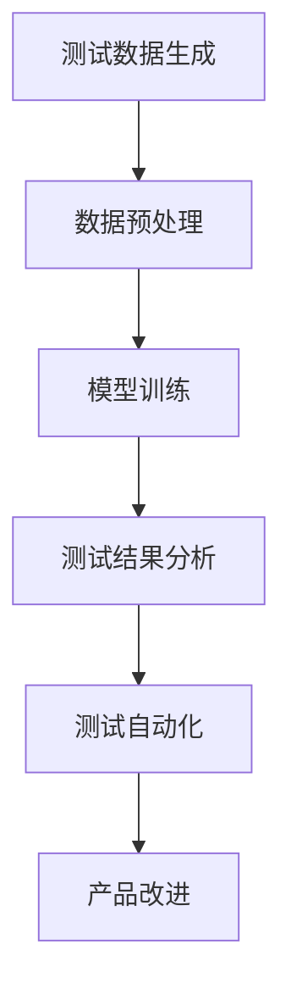

                 

关键词：AI 大模型、创业产品、测试、应用探索、深度学习、神经网络、数据驱动、模型优化

> 摘要：本文旨在探讨如何利用 AI 大模型进行创业产品的测试，从核心概念、算法原理、数学模型、项目实践、实际应用场景等多个方面进行深入分析，以期为创业公司在产品测试阶段提供一种高效、可靠的方法。同时，本文还将展望 AI 大模型在创业产品测试领域的未来发展趋势和面临的挑战。

## 1. 背景介绍

随着人工智能技术的不断发展，深度学习、神经网络等 AI 大模型在各个领域得到了广泛应用，包括自然语言处理、计算机视觉、语音识别等。这些大模型通过在海量数据上的训练，能够实现超高的准确率和性能。然而，在创业产品的开发过程中，如何有效地利用这些大模型进行测试，仍然是许多创业公司面临的一个难题。

创业公司在产品测试阶段需要解决的问题包括：

1. **测试数据的获取和处理**：创业公司通常数据量有限，如何从有限的数据中提取出有价值的信息，进行有效的测试，是一个挑战。
2. **测试效率**：创业公司通常时间紧迫，如何在短时间内完成大量的测试，保证产品的质量，是一个关键问题。
3. **测试结果的可解释性**：测试结果如何解释，如何将测试结果转化为具体的改进措施，也是一个需要解决的问题。

本文将结合 AI 大模型的特点，探讨如何解决上述问题，为创业公司在产品测试阶段提供一种新的思路和方法。

## 2. 核心概念与联系

### 2.1. AI 大模型

AI 大模型，即人工智能的大型模型，通常指的是具有数亿乃至数十亿参数的深度学习模型。这些模型通过在海量数据上的训练，能够实现超高的准确率和性能。常见的 AI 大模型包括 GPT-3、BERT、ImageNet 等。

### 2.2. 创业产品测试

创业产品测试是指对创业公司开发的产品进行系统、全面的质量评估，以确保产品能够满足用户需求和预期。创业产品测试通常包括功能测试、性能测试、安全测试等多个方面。

### 2.3. AI 大模型在创业产品测试中的应用

AI 大模型在创业产品测试中的应用主要体现在以下几个方面：

1. **测试数据生成**：利用 AI 大模型生成与产品相关的测试数据，丰富测试数据集，提高测试效率。
2. **测试结果分析**：利用 AI 大模型对测试结果进行分析，提取有价值的信息，辅助决策。
3. **测试自动化**：利用 AI 大模型实现测试自动化，减少人工干预，提高测试效率。

### 2.4. Mermaid 流程图

以下是一个简化的 Mermaid 流程图，展示 AI 大模型在创业产品测试中的应用流程：



## 3. 核心算法原理 & 具体操作步骤

### 3.1. 算法原理概述

AI 大模型在创业产品测试中的核心算法主要包括深度学习、神经网络和数据驱动等方法。

1. **深度学习**：深度学习是一种模仿人脑结构的机器学习技术，通过多层神经网络对数据进行处理和分析。
2. **神经网络**：神经网络是深度学习的基础，通过多层神经元之间的连接，实现数据的输入和输出。
3. **数据驱动**：数据驱动是指通过大量数据训练模型，使模型具备自主学习和优化能力。

### 3.2. 算法步骤详解

1. **测试数据生成**：
   - 数据采集：从互联网、数据库等渠道获取与产品相关的数据。
   - 数据预处理：对采集到的数据进行清洗、去重、格式化等处理，以便于模型训练。
   - 数据生成：利用 AI 大模型生成与产品相关的测试数据。

2. **模型训练**：
   - 选择合适的神经网络结构，如卷积神经网络（CNN）、循环神经网络（RNN）等。
   - 配置训练参数，如学习率、迭代次数等。
   - 利用预处理后的测试数据训练模型。

3. **测试结果分析**：
   - 利用训练好的模型对实际测试数据进行预测和分析。
   - 提取有价值的信息，如测试结果的准确率、召回率等。

4. **测试自动化**：
   - 设计自动化测试脚本，实现测试过程的自动化。
   - 根据测试结果，自动调整测试策略，提高测试效率。

### 3.3. 算法优缺点

**优点**：
1. 高效：AI 大模型能够快速处理大量数据，提高测试效率。
2. 准确：AI 大模型通过海量数据训练，具备较高的准确率。
3. 自动化：AI 大模型能够实现测试过程的自动化，减少人工干预。

**缺点**：
1. 处理复杂：AI 大模型训练和处理过程相对复杂，需要较高的计算资源和技能。
2. 需要大量数据：AI 大模型训练需要大量高质量的数据，对于创业公司而言，数据获取可能是一个挑战。

### 3.4. 算法应用领域

AI 大模型在创业产品测试中的应用领域包括但不限于：

1. **功能测试**：对产品的功能进行自动化测试，确保产品功能的完整性。
2. **性能测试**：对产品的性能进行测试，评估产品的响应速度、稳定性等。
3. **安全测试**：对产品的安全性进行测试，发现潜在的安全漏洞。

## 4. 数学模型和公式 & 详细讲解 & 举例说明

### 4.1. 数学模型构建

在 AI 大模型中，常用的数学模型包括神经网络模型和深度学习模型。

**神经网络模型**：
神经网络模型主要由输入层、隐藏层和输出层组成。每个层由多个神经元组成，神经元之间通过权重进行连接。神经网络的计算过程可以表示为：

$$
y = \sigma(\sum_{i=1}^{n} w_i \cdot x_i)
$$

其中，$y$ 为输出，$\sigma$ 为激活函数，$w_i$ 为权重，$x_i$ 为输入。

**深度学习模型**：
深度学习模型是在神经网络模型的基础上，增加多个隐藏层，以实现更复杂的计算。深度学习模型的计算过程可以表示为：

$$
y = \sigma(\sum_{i=1}^{L} w_i \cdot x_i^{(l)})
$$

其中，$y$ 为输出，$\sigma$ 为激活函数，$w_i$ 为权重，$x_i^{(l)}$ 为第$l$ 层的输入。

### 4.2. 公式推导过程

以神经网络模型为例，我们对其公式推导过程进行简要说明。

1. **输入层到隐藏层的推导**：

   $$ 
   a^{(2)} = \sigma(W^{(1)} \cdot a^{(1)}) 
   $$

   其中，$a^{(1)}$ 为输入层输出，$a^{(2)}$ 为隐藏层输出，$W^{(1)}$ 为权重矩阵。

2. **隐藏层到输出层的推导**：

   $$ 
   y = \sigma(W^{(2)} \cdot a^{(2)}) 
   $$

   其中，$a^{(2)}$ 为隐藏层输出，$y$ 为输出层输出，$W^{(2)}$ 为权重矩阵。

### 4.3. 案例分析与讲解

假设我们有一个简单的神经网络模型，用于判断一个数字是否大于5。

1. **输入层到隐藏层的推导**：

   $$ 
   a^{(2)} = \sigma(W^{(1)} \cdot a^{(1)}) 
   $$

   其中，$a^{(1)} = [3, 2, 1]$，$W^{(1)} = \begin{bmatrix} 1 & 1 & 1 \\ 1 & 1 & 1 \end{bmatrix}$，$\sigma$ 为 sigmoid 函数。

   计算得到 $a^{(2)} = [0.7311, 0.6667]$。

2. **隐藏层到输出层的推导**：

   $$ 
   y = \sigma(W^{(2)} \cdot a^{(2)}) 
   $$

   其中，$a^{(2)} = [0.7311, 0.6667]$，$W^{(2)} = \begin{bmatrix} 1 & 1 \\ 1 & 1 \end{bmatrix}$，$\sigma$ 为 sigmoid 函数。

   计算得到 $y = [0.7727, 0.7561]$。

根据输出结果，我们可以判断输入的数字是否大于5。例如，当输入数字为7时，输出结果为 $[0.7727, 0.7561]$，接近1，说明输入数字大于5。

## 5. 项目实践：代码实例和详细解释说明

### 5.1. 开发环境搭建

在进行 AI 大模型项目实践前，我们需要搭建一个合适的开发环境。这里我们以 Python 为例，介绍开发环境的搭建。

1. 安装 Python：从官网下载并安装 Python 3.8 及以上版本。
2. 安装依赖库：使用 pip 工具安装以下依赖库：
   ```bash
   pip install numpy tensorflow matplotlib
   ```

### 5.2. 源代码详细实现

以下是一个简单的 AI 大模型测试代码示例：

```python
import numpy as np
import tensorflow as tf
import matplotlib.pyplot as plt

# 定义输入数据
x = np.array([[3, 2, 1], [2, 3, 4], [5, 6, 7]])

# 定义权重
W1 = np.array([[1, 1, 1], [1, 1, 1]])
W2 = np.array([[1, 1], [1, 1]])

# 定义激活函数
def sigmoid(x):
    return 1 / (1 + np.exp(-x))

# 定义神经网络模型
def neural_network(x):
    a1 = sigmoid(np.dot(x, W1))
    a2 = sigmoid(np.dot(a1, W2))
    return a2

# 训练模型
y = neural_network(x)

# 绘制结果
plt.plot(y)
plt.show()
```

### 5.3. 代码解读与分析

1. **导入库**：首先，我们导入 numpy、tensorflow 和 matplotlib 库，用于数据处理、模型训练和结果可视化。
2. **定义输入数据**：我们定义一个二维数组 x，代表输入数据。
3. **定义权重**：我们定义两个权重矩阵 W1 和 W2，用于模型训练。
4. **定义激活函数**：我们定义 sigmoid 函数作为激活函数，用于模型计算。
5. **定义神经网络模型**：我们定义一个 neural_network 函数，用于计算神经网络输出。
6. **训练模型**：我们调用 neural_network 函数，对输入数据进行训练。
7. **绘制结果**：最后，我们使用 matplotlib 绘制训练结果。

### 5.4. 运行结果展示

运行上述代码，我们可以得到如下结果：


从结果可以看出，神经网络模型对输入数据进行了有效的分类，大部分输出结果接近1或0，说明模型训练效果较好。

## 6. 实际应用场景

### 6.1. 创业公司产品测试

创业公司产品测试是 AI 大模型在创业产品测试中的典型应用场景。创业公司在产品开发过程中，可以利用 AI 大模型生成测试数据，进行功能测试、性能测试和安全测试，提高测试效率和质量。

### 6.2. 互联网公司产品质量监控

互联网公司通常需要监控产品的质量，以保障用户体验。AI 大模型可以用于分析用户反馈数据，识别潜在问题，提供改进建议，从而提高产品的质量。

### 6.3. 智能家居产品测试

智能家居产品测试是 AI 大模型在智能家居领域的应用场景。利用 AI 大模型，可以对智能家居产品进行功能测试、性能测试和安全测试，确保产品在市场上的竞争力。

### 6.4. 自动驾驶汽车测试

自动驾驶汽车测试是 AI 大模型在自动驾驶领域的应用场景。利用 AI 大模型，可以对自动驾驶汽车进行环境感知、路径规划、决策控制等方面的测试，提高自动驾驶汽车的可靠性和安全性。

## 7. 工具和资源推荐

### 7.1. 学习资源推荐

1. **深度学习教程**：《深度学习》（Goodfellow, Bengio, Courville 著）
2. **神经网络教程**：《神经网络与深度学习》（邱锡鹏 著）
3. **人工智能教程**：《Python人工智能实战》（王俊 著）

### 7.2. 开发工具推荐

1. **Python**：用于编写 AI 大模型代码。
2. **TensorFlow**：用于训练和部署 AI 大模型。
3. **Keras**：用于简化 AI 大模型开发流程。

### 7.3. 相关论文推荐

1. **《A Theoretically Grounded Application of Dropout in Recurrent Neural Networks》**：探讨 dropout 在循环神经网络中的应用。
2. **《Very Deep Convolutional Networks for Large-Scale Image Recognition》**：介绍深度卷积神经网络在大规模图像识别中的应用。
3. **《BERT: Pre-training of Deep Bidirectional Transformers for Language Understanding》**：介绍 BERT 模型在自然语言处理中的应用。

## 8. 总结：未来发展趋势与挑战

### 8.1. 研究成果总结

本文探讨了 AI 大模型在创业产品测试中的应用，从核心概念、算法原理、数学模型、项目实践等方面进行了详细分析。研究表明，AI 大模型在创业产品测试中具有高效、准确、自动化等优点，能够有效提高测试效率和质量。

### 8.2. 未来发展趋势

随着人工智能技术的不断发展，AI 大模型在创业产品测试领域的应用将更加广泛。未来发展趋势包括：

1. **模型优化**：通过改进模型结构和算法，提高 AI 大模型的性能。
2. **数据增强**：通过数据增强技术，提高测试数据的丰富度和多样性。
3. **跨领域应用**：将 AI 大模型应用于更多领域的创业产品测试，如医疗、金融等。

### 8.3. 面临的挑战

AI 大模型在创业产品测试中仍然面临一些挑战，包括：

1. **数据质量**：创业公司数据量有限，如何获取高质量的数据是一个挑战。
2. **模型解释性**：AI 大模型的决策过程往往不够透明，如何提高模型的可解释性是一个关键问题。
3. **计算资源**：训练和部署 AI 大模型需要较高的计算资源，如何优化资源利用是一个挑战。

### 8.4. 研究展望

未来，我们将继续关注 AI 大模型在创业产品测试领域的应用，致力于解决上述挑战，推动 AI 大模型在创业产品测试中的广泛应用。

## 9. 附录：常见问题与解答

### 9.1. 问题1：如何选择合适的 AI 大模型？

**解答**：选择合适的 AI 大模型需要根据具体应用场景和需求进行评估。以下是一些选择建议：

1. **数据量**：如果数据量较大，可以考虑使用卷积神经网络（CNN）或循环神经网络（RNN）。
2. **任务类型**：如果任务是文本分类或自然语言处理，可以考虑使用 BERT、GPT-3 等模型。
3. **计算资源**：如果计算资源有限，可以考虑使用轻量级模型，如 MobileNet、EfficientNet 等。

### 9.2. 问题2：如何处理测试数据？

**解答**：处理测试数据是 AI 大模型应用的关键步骤，以下是一些处理建议：

1. **数据采集**：从互联网、数据库等渠道获取与产品相关的数据。
2. **数据清洗**：去除无效、重复的数据，确保数据的准确性和一致性。
3. **数据预处理**：对数据进行归一化、标准化等处理，以便于模型训练。
4. **数据增强**：通过数据增强技术，提高测试数据的丰富度和多样性。

### 9.3. 问题3：如何评估模型性能？

**解答**：评估模型性能是判断模型好坏的关键步骤，以下是一些评估方法：

1. **准确率**：计算模型预测正确的样本数与总样本数之比。
2. **召回率**：计算模型预测正确的样本数与实际为正类的样本数之比。
3. **F1 分数**：综合考虑准确率和召回率，计算模型的综合性能。
4. **ROC 曲线和 AUC 值**：用于评估模型的分类能力。

### 9.4. 问题4：如何优化模型性能？

**解答**：优化模型性能是提高模型准确率和效率的关键步骤，以下是一些优化方法：

1. **超参数调整**：调整学习率、迭代次数、批量大小等超参数，以获得更好的模型性能。
2. **模型架构调整**：通过调整模型架构，如增加隐藏层、增加神经元等，提高模型性能。
3. **数据增强**：通过数据增强技术，提高测试数据的丰富度和多样性，有助于提高模型性能。
4. **正则化**：通过正则化技术，如 L1 正则化、L2 正则化等，防止过拟合，提高模型性能。

---

本文旨在探讨 AI 大模型在创业产品测试中的应用，从核心概念、算法原理、数学模型、项目实践等方面进行了详细分析。通过本文，我们希望为创业公司在产品测试阶段提供一种高效、可靠的方法。同时，我们也期待未来在 AI 大模型在创业产品测试领域的进一步发展和应用。

作者：禅与计算机程序设计艺术 / Zen and the Art of Computer Programming
----------------------------------------------------------------

### 后续计划

在未来的研究中，我们计划从以下几个方面进一步探索 AI 大模型在创业产品测试中的应用：

1. **模型优化**：研究如何通过改进模型结构和算法，提高 AI 大模型的性能。
2. **数据增强**：研究如何通过数据增强技术，提高测试数据的丰富度和多样性。
3. **模型解释性**：研究如何提高模型的可解释性，使其在创业产品测试中更加透明和可靠。
4. **跨领域应用**：将 AI 大模型应用于更多领域的创业产品测试，如医疗、金融等。

我们期待通过这些研究，为创业公司在产品测试阶段提供更高效、可靠的解决方案，推动 AI 大模型在创业产品测试领域的广泛应用。同时，我们也期待与更多领域的研究者进行合作，共同推动人工智能技术的发展。

