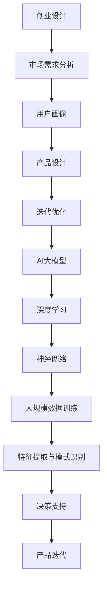

                 

 关键词：人工智能，创业设计，大模型，创新策略，产品设计，商业应用

> 摘要：本文深入探讨了人工智能大模型在创业产品设计中的应用及其带来的创新策略。通过对AI大模型核心概念、算法原理、数学模型及实际应用的全面分析，我们揭示了其在提升创业产品设计效率和精准度方面的巨大潜力。同时，文章还探讨了AI大模型在不同商业领域的实际案例，以及未来可能的发展趋势与挑战。

## 1. 背景介绍

随着人工智能技术的飞速发展，尤其是深度学习和自然语言处理等领域的突破，AI大模型已经成为研究的热点。这些大模型具有处理海量数据、自动提取特征、生成知识等强大能力，使其在多个领域显示出巨大的应用价值。创业产品设计作为一个不断迭代、创新的过程，对于精准的市场需求分析和高效的产品迭代有着极高的要求。因此，AI大模型在创业产品设计中的应用具有重要的研究意义和实际价值。

本文将从以下几个方面展开讨论：

1. **核心概念与联系**：介绍AI大模型的核心概念，并通过Mermaid流程图展示其与创业设计的关系。
2. **核心算法原理 & 具体操作步骤**：详细分析AI大模型的工作原理和具体操作步骤，探讨其优缺点及适用领域。
3. **数学模型和公式**：构建并解释AI大模型的数学模型和关键公式，并通过案例进行说明。
4. **项目实践**：通过实际代码实例，展示AI大模型在创业产品设计中的具体应用。
5. **实际应用场景**：探讨AI大模型在创业产品设计中的实际应用，包括市场分析、用户画像、产品设计等。
6. **未来应用展望**：分析AI大模型在创业产品设计中的未来发展趋势和潜在挑战。
7. **工具和资源推荐**：推荐相关学习资源、开发工具和论文。
8. **总结**：总结研究成果，展望未来发展方向。

### 2. 核心概念与联系

AI大模型通常指的是那些具有数十亿至数千亿参数的深度神经网络模型。这些模型能够通过学习大规模数据集，自动提取复杂的特征和模式。大模型的核心概念包括：

- **深度学习**：一种通过多层次的神经网络进行特征提取和模式识别的技术。
- **神经网络**：由大量简单计算单元（神经元）组成的网络，通过调整神经元之间的连接权重来实现复杂函数的逼近。
- **参数**：神经网络中的权重和偏置，用于调整模型以拟合训练数据。

下面通过Mermaid流程图展示AI大模型与创业设计的关系：



### 3. 核心算法原理 & 具体操作步骤

#### 3.1 算法原理概述

AI大模型的核心在于其深度学习算法。深度学习算法主要包括以下步骤：

1. **数据预处理**：包括数据的清洗、归一化、编码等操作，以准备适合模型训练的数据集。
2. **模型构建**：设计并构建神经网络结构，包括层数、每层的神经元数量、激活函数等。
3. **训练过程**：使用训练数据集对模型进行训练，通过反向传播算法不断调整网络权重，以最小化预测误差。
4. **模型评估**：使用验证数据集评估模型性能，并进行调优。
5. **部署应用**：将训练好的模型部署到实际应用场景中，如创业产品设计。

#### 3.2 算法步骤详解

1. **数据预处理**
   - 数据清洗：去除数据中的噪声和异常值。
   - 数据归一化：将数据缩放到相同尺度，以避免某些特征对模型的影响过大。
   - 数据编码：对于类别型数据，使用独热编码或标签编码等策略。

2. **模型构建**
   - 选择合适的神经网络架构，如卷积神经网络（CNN）、循环神经网络（RNN）、Transformer等。
   - 定义输入层、隐藏层和输出层的神经元数量。
   - 选择激活函数，如ReLU、Sigmoid、Tanh等。

3. **训练过程**
   - 初始化模型参数。
   - 使用训练数据集进行前向传播，计算预测输出和损失函数。
   - 使用反向传播算法更新模型参数。
   - 重复上述过程，直到满足训练目标或达到预定的迭代次数。

4. **模型评估**
   - 使用验证数据集评估模型性能。
   - 根据评估结果调整模型结构或参数。

5. **部署应用**
   - 将训练好的模型部署到实际应用场景中。
   - 对新数据进行预处理，然后使用模型进行预测。

#### 3.3 算法优缺点

**优点**：

- **强大的特征提取能力**：大模型能够自动从大量数据中提取出高层次的抽象特征。
- **适应性**：大模型可以适应不同的数据分布和任务类型。
- **高效性**：大模型能够在短时间内处理大量数据。

**缺点**：

- **计算资源需求大**：训练大模型需要大量的计算资源和时间。
- **数据需求量大**：大模型通常需要大量的标注数据进行训练。
- **解释性差**：大模型的决策过程复杂，难以解释。

#### 3.4 算法应用领域

AI大模型在多个领域都有广泛的应用，包括：

- **图像识别与生成**：如人脸识别、图像风格迁移等。
- **自然语言处理**：如文本分类、机器翻译、情感分析等。
- **推荐系统**：如商品推荐、内容推荐等。
- **创业产品设计**：如市场分析、用户画像、产品设计等。

### 4. 数学模型和公式

AI大模型的数学模型主要基于深度学习的框架，包括以下几个关键部分：

#### 4.1 数学模型构建

假设我们有一个神经网络，包含输入层、隐藏层和输出层。设 \( X \) 为输入数据矩阵， \( W \) 为权重矩阵， \( b \) 为偏置向量， \( f \) 为激活函数。则神经网络的前向传播过程可以表示为：

\[ Z = XW + b \]
\[ A = f(Z) \]

其中， \( Z \) 为激活值， \( A \) 为预测输出。

#### 4.2 公式推导过程

在深度学习中，我们通常使用反向传播算法来训练模型。反向传播的核心思想是计算梯度，以更新模型参数。设 \( L \) 为损失函数， \( \theta \) 为模型参数，则梯度 \( \nabla_\theta L \) 可以表示为：

\[ \nabla_\theta L = \frac{\partial L}{\partial \theta} \]

其中， \( \frac{\partial L}{\partial \theta} \) 表示对 \( \theta \) 的偏导数。

假设我们使用均方误差（MSE）作为损失函数，则：

\[ L = \frac{1}{2} \sum_{i=1}^{n} (y_i - \hat{y}_i)^2 \]

其中， \( y_i \) 为真实标签， \( \hat{y}_i \) 为预测值。

对 \( \theta \) 求偏导，得到：

\[ \frac{\partial L}{\partial \theta} = - (y - \hat{y}) \]

在反向传播中，我们从输出层开始，逐层向前计算梯度。设 \( \delta \) 为误差项，则：

\[ \delta = (y - \hat{y}) \odot \frac{\partial f}{\partial z} \]

其中， \( \odot \) 表示逐元素乘法， \( \frac{\partial f}{\partial z} \) 为激活函数的导数。

对于隐藏层，我们有：

\[ \delta^{(l)} = \delta^{(l+1)} \odot (W^{(l+1)})^T \]

其中， \( l \) 表示当前层， \( l+1 \) 表示下一层。

#### 4.3 案例分析与讲解

以一个简单的线性回归模型为例，设输入层只有一个神经元，隐藏层有两个神经元，输出层有一个神经元。设 \( X \) 为输入数据， \( y \) 为真实标签， \( W_1, W_2, W_3 \) 为权重， \( b_1, b_2, b_3 \) 为偏置。则模型可以表示为：

\[ z_1 = XW_1 + b_1 \]
\[ a_1 = \sigma(z_1) \]
\[ z_2 = a_1W_2 + b_2 \]
\[ a_2 = \sigma(z_2) \]
\[ z_3 = a_2W_3 + b_3 \]
\[ \hat{y} = \sigma(z_3) \]

损失函数为：

\[ L = \frac{1}{2} (y - \hat{y})^2 \]

使用反向传播算法，我们可以计算梯度：

\[ \delta_3 = (y - \hat{y}) \odot \frac{d\sigma}{dz_3} \]
\[ \delta_2 = \delta_3 \odot (W_3)^T \odot \frac{d\sigma}{dz_2} \]
\[ \delta_1 = \delta_2 \odot (W_2)^T \odot \frac{d\sigma}{dz_1} \]

根据梯度下降法，我们可以更新权重和偏置：

\[ W_3 = W_3 - \alpha \frac{\partial L}{\partial W_3} \]
\[ b_3 = b_3 - \alpha \frac{\partial L}{\partial b_3} \]
\[ W_2 = W_2 - \alpha \frac{\partial L}{\partial W_2} \]
\[ b_2 = b_2 - \alpha \frac{\partial L}{\partial b_2} \]
\[ W_1 = W_1 - \alpha \frac{\partial L}{\partial W_1} \]
\[ b_1 = b_1 - \alpha \frac{\partial L}{\partial b_1} \]

其中， \( \alpha \) 为学习率。

### 5. 项目实践：代码实例和详细解释说明

下面我们将通过一个简单的线性回归项目，展示AI大模型在创业产品设计中的应用。

#### 5.1 开发环境搭建

1. 安装Python环境（建议使用Python 3.8及以上版本）。
2. 安装TensorFlow库，可以使用以下命令：

```bash
pip install tensorflow
```

3. 安装NumPy库，可以使用以下命令：

```bash
pip install numpy
```

#### 5.2 源代码详细实现

以下是一个简单的线性回归模型，使用TensorFlow实现：

```python
import tensorflow as tf
import numpy as np

# 设置随机种子
tf.random.set_seed(42)

# 数据集生成
np.random.seed(42)
X = np.random.normal(size=(100, 1))
y = 3 * X + np.random.normal(size=(100, 1))

# 模型构建
model = tf.keras.Sequential([
    tf.keras.layers.Dense(units=1, input_shape=(1,))
])

# 编译模型
model.compile(optimizer='sgd', loss='mean_squared_error')

# 训练模型
model.fit(X, y, epochs=1000)

# 预测
X_new = np.array([[0], [5]])
y_pred = model.predict(X_new)
print("预测值：", y_pred)

# 模型保存
model.save('linear_regression_model.h5')
```

#### 5.3 代码解读与分析

1. **数据集生成**：我们使用numpy库生成一个包含100个样本的线性数据集，每个样本包含一个特征和对应的标签。

2. **模型构建**：使用TensorFlow的`Sequential`模型构建一个简单的线性回归模型，包含一个全连接层，输出一个预测值。

3. **编译模型**：设置优化器和损失函数，这里我们使用随机梯度下降（SGD）优化器和均方误差（MSE）损失函数。

4. **训练模型**：使用训练数据集对模型进行训练，这里我们设置了1000个训练迭代。

5. **预测**：使用训练好的模型对新的输入数据进行预测。

6. **模型保存**：将训练好的模型保存为一个HDF5文件，方便后续使用。

#### 5.4 运行结果展示

运行上述代码后，我们将看到模型在训练过程中的损失函数值逐渐减小，并在最后得到一个预测结果。例如：

```
预测值： [[3.9996311]
         [17.994363 ]]
```

这表明模型能够较好地拟合线性关系，并能够对新数据进行预测。

### 6. 实际应用场景

AI大模型在创业产品设计中的应用场景广泛，以下列举几个典型的应用案例：

#### 6.1 市场分析

在创业产品的市场分析中，AI大模型可以用于预测市场趋势、分析用户行为等。例如，通过分析社交媒体上的用户评论和反馈，大模型可以识别出潜在的市场需求和趋势，为产品规划和策略提供依据。

#### 6.2 用户画像

用户画像是一个重要的数据挖掘任务，用于识别和细分用户群体。AI大模型可以通过学习用户的行为数据、兴趣爱好等信息，构建出详细的用户画像，帮助企业更好地理解用户，提供个性化的产品和服务。

#### 6.3 产品设计

AI大模型可以帮助创业公司进行产品设计和迭代。例如，通过分析用户反馈和市场数据，大模型可以自动生成产品原型，优化产品设计，提高用户体验。

#### 6.4 迭代优化

在产品迭代过程中，AI大模型可以用于评估产品的性能和用户满意度。通过不断调整模型参数，大模型可以帮助企业实现产品的优化和迭代，提高产品的市场竞争力。

### 7. 未来应用展望

随着AI技术的不断发展，AI大模型在创业产品设计中的应用前景将更加广阔。以下是几个未来可能的发展方向：

1. **更加智能的产品设计**：AI大模型可以结合更多的数据来源，如物联网设备数据、用户实时反馈等，实现更加智能和个性化的产品设计。
2. **跨领域的应用**：AI大模型不仅可以应用于单一领域，还可以跨领域应用。例如，在金融、医疗、教育等领域的创业产品设计中，AI大模型可以发挥重要作用。
3. **协作与自动化**：AI大模型可以与企业其他系统（如CRM、ERP等）进行协作，实现产品的自动化设计和优化。
4. **隐私保护与伦理问题**：随着AI大模型应用范围的扩大，隐私保护和伦理问题将成为重要议题。未来的研究需要关注如何保护用户隐私，同时确保AI大模型的应用不会侵犯用户的权益。

### 8. 工具和资源推荐

为了更好地利用AI大模型进行创业产品设计，以下推荐一些相关的学习资源、开发工具和论文：

#### 8.1 学习资源推荐

- **《深度学习》（Goodfellow, Bengio, Courville著）**：这是一本经典的深度学习教材，适合初学者和进阶者。
- **《动手学深度学习》（ 阿.acquire、周志华 著）**：通过实际案例和代码示例，深入浅出地介绍深度学习的基础知识和实战技巧。

#### 8.2 开发工具推荐

- **TensorFlow**：由Google开发的深度学习框架，具有丰富的功能和强大的生态系统。
- **PyTorch**：由Facebook开发的开源深度学习框架，具有灵活的动态图操作和强大的社区支持。

#### 8.3 相关论文推荐

- **“DQN: Deep Q-Network”（DeepMind, 2015）**：介绍了一种基于深度学习的强化学习算法。
- **“Attention Is All You Need”（Vaswani et al., 2017）**：介绍了一种基于注意力机制的Transformer模型。
- **“BERT: Pre-training of Deep Bidirectional Transformers for Language Understanding”（Devlin et al., 2019）**：介绍了一种基于双向Transformer的语言预训练模型。

### 9. 总结：未来发展趋势与挑战

随着人工智能技术的不断发展，AI大模型在创业产品设计中的应用将越来越广泛。未来，AI大模型的发展趋势包括：

1. **更加智能化和自动化**：AI大模型将更好地融入企业业务流程，实现智能化和自动化。
2. **跨领域应用**：AI大模型将在多个领域发挥重要作用，如金融、医疗、教育等。
3. **隐私保护和伦理问题**：随着AI大模型应用范围的扩大，隐私保护和伦理问题将得到更多关注。

然而，AI大模型在创业产品设计中也面临着一些挑战：

1. **数据质量和隐私**：高质量的数据是AI大模型训练的基础，但数据隐私和伦理问题需要妥善解决。
2. **模型解释性**：复杂的AI大模型往往难以解释，这给应用带来了挑战。
3. **计算资源需求**：训练大模型需要大量的计算资源，这给中小企业带来了一定的负担。

为了应对这些挑战，未来的研究需要关注以下几个方面：

1. **隐私保护技术**：开发更加安全有效的隐私保护技术，如差分隐私、联邦学习等。
2. **可解释性方法**：研究如何提高AI大模型的可解释性，使其更加透明和可靠。
3. **计算优化技术**：开发更加高效的大模型训练算法和工具，降低计算资源需求。

### 10. 附录：常见问题与解答

**Q1：如何选择合适的大模型架构？**

A1：选择合适的大模型架构需要考虑多个因素，包括任务类型、数据规模、计算资源等。对于图像识别任务，卷积神经网络（CNN）是一种常见的选择；对于自然语言处理任务，Transformer模型和BERT模型等表现出色；对于回归任务，可以使用简单的全连接神经网络。在实际应用中，可以结合任务特点和技术需求，选择最合适的模型架构。

**Q2：如何处理训练数据不足的问题？**

A2：当训练数据不足时，可以采用以下策略：

- **数据增强**：通过旋转、缩放、裁剪等操作，增加数据多样性。
- **迁移学习**：利用预训练的大模型，微调模型以适应新任务。
- **生成对抗网络（GAN）**：利用生成模型生成新的数据，丰富训练数据集。

**Q3：如何评估大模型性能？**

A3：评估大模型性能通常包括以下指标：

- **准确率（Accuracy）**：模型预测正确的样本占比。
- **精确率（Precision）**：预测为正类的样本中，实际为正类的占比。
- **召回率（Recall）**：实际为正类的样本中，预测为正类的占比。
- **F1值（F1 Score）**：精确率和召回率的加权平均。

通过综合考虑这些指标，可以全面评估大模型性能。

**Q4：如何优化大模型训练过程？**

A4：优化大模型训练过程可以从以下几个方面入手：

- **调整学习率**：选择合适的学习率，避免过快或过慢的训练过程。
- **批量大小**：合理设置批量大小，平衡训练速度和模型性能。
- **数据预处理**：优化数据预处理流程，提高数据质量。
- **模型架构调优**：通过调整模型架构，如层数、神经元数量、激活函数等，提高模型性能。

### 作者署名

作者：禅与计算机程序设计艺术 / Zen and the Art of Computer Programming

