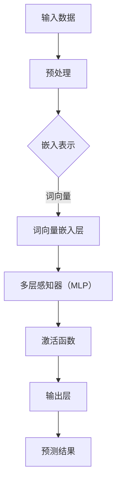

                 

关键词：AI 大模型，创业产品，路线图规划，技术趋势，应用案例，未来展望

> 摘要：本文将探讨人工智能大模型在创业产品路线图规划中的重要作用。通过分析大模型的技术原理、核心算法和应用场景，结合实际案例，我们旨在揭示大模型如何帮助创业者更有效地制定和调整产品路线图，从而在竞争激烈的市场中脱颖而出。

## 1. 背景介绍

### 1.1 创业产品的挑战

在当今快速变化的市场环境中，创业产品的成功不仅取决于创新的技术和商业理念，还取决于能否准确把握市场动态，及时调整产品方向。创业产品的挑战主要包括：

- **市场不确定性**：市场需求和竞争态势经常变化，创业者需要快速适应。
- **资源限制**：大多数创业公司在资源上存在限制，需要在有限的资源下做出最优决策。
- **时间压力**：产品迭代速度加快，创业公司需要迅速响应市场变化。

### 1.2 AI 大模型的发展

近年来，人工智能特别是深度学习领域取得了显著进展，大模型如GPT-3、BERT等的出现，为解决复杂问题提供了新的工具。大模型具有以下特点：

- **强大的表征能力**：能够处理和理解大量的文本、图像和声音数据。
- **自适应性强**：可以根据不同的应用场景进行调整。
- **计算效率高**：借助高性能计算和分布式计算技术，可以快速训练和部署。

## 2. 核心概念与联系

### 2.1 大模型技术原理

大模型通常基于深度神经网络，其核心思想是通过多层的非线性变换，将输入数据映射到高维特征空间，从而提取出数据的深层特征。以下是AI大模型的技术原理和架构的Mermaid流程图：



### 2.2 大模型与创业产品路线图规划的关系

大模型能够通过数据分析和模式识别，为创业产品的路线图规划提供以下支持：

- **市场趋势分析**：通过分析用户行为数据，预测市场趋势。
- **需求分析**：识别用户需求，为产品功能迭代提供指导。
- **竞争分析**：评估市场竞争对手，制定差异化策略。

## 3. 核心算法原理 & 具体操作步骤

### 3.1 算法原理概述

大模型的核心算法包括深度学习中的多层感知器（MLP）、卷积神经网络（CNN）和递归神经网络（RNN）等。以下是这些算法的基本原理：

- **多层感知器（MLP）**：通过多层非线性变换，将输入数据映射到高维特征空间。
- **卷积神经网络（CNN）**：通过卷积操作，提取图像的特征。
- **递归神经网络（RNN）**：通过循环结构，处理序列数据。

### 3.2 算法步骤详解

以下是构建和训练大模型的基本步骤：

1. **数据收集与预处理**：收集相关数据，并进行数据清洗和预处理。
2. **模型架构设计**：根据应用需求，设计合适的模型架构。
3. **模型训练**：使用训练数据，通过优化算法调整模型参数。
4. **模型评估**：使用验证集评估模型性能，并进行调优。
5. **模型部署**：将训练好的模型部署到生产环境中。

### 3.3 算法优缺点

- **优点**：强大的表征能力，能够处理复杂的任务，自适应性强。
- **缺点**：计算资源消耗大，训练时间长，对数据质量要求高。

### 3.4 算法应用领域

大模型在多个领域具有广泛的应用，包括：

- **自然语言处理**：文本分类、机器翻译、情感分析等。
- **计算机视觉**：图像识别、目标检测、图像生成等。
- **推荐系统**：个性化推荐、商品推荐等。

## 4. 数学模型和公式 & 详细讲解 & 举例说明

### 4.1 数学模型构建

大模型的数学基础主要包括线性代数、概率论和优化理论。以下是构建大模型时常用的几个数学公式：

$$
z = \sigma(W_1 \cdot x + b_1)
$$

$$
y = \sigma(W_2 \cdot z + b_2)
$$

其中，$z$ 是隐藏层的输出，$y$ 是模型的预测输出，$\sigma$ 是激活函数，$W$ 是权重矩阵，$b$ 是偏置项。

### 4.2 公式推导过程

以多层感知器（MLP）为例，我们详细讲解公式推导过程：

1. **前向传播**：

$$
z_l = \sigma(W_l \cdot a_{l-1} + b_l)
$$

其中，$a_{l-1}$ 是前一层输入，$W_l$ 是权重矩阵，$b_l$ 是偏置项，$\sigma$ 是激活函数。

2. **反向传播**：

$$
\Delta W_l = \alpha \cdot \frac{\partial J}{\partial W_l}
$$

$$
\Delta b_l = \alpha \cdot \frac{\partial J}{\partial b_l}
$$

其中，$\Delta W_l$ 和 $\Delta b_l$ 分别是权重和偏置的梯度，$J$ 是损失函数。

### 4.3 案例分析与讲解

以文本分类任务为例，我们使用GPT-3模型进行讲解。GPT-3模型的训练数据包括大量文本数据，通过训练，模型能够学会对文本进行分类。以下是具体步骤：

1. **数据收集与预处理**：收集包含分类标签的文本数据，并进行预处理。
2. **模型架构设计**：设计一个基于GPT-3的多层感知器模型。
3. **模型训练**：使用预处理后的文本数据进行训练。
4. **模型评估**：使用验证集评估模型性能。
5. **模型部署**：将训练好的模型部署到生产环境中。

## 5. 项目实践：代码实例和详细解释说明

### 5.1 开发环境搭建

在开始代码实现之前，我们需要搭建一个合适的开发环境。以下是一个简单的步骤：

1. **安装Python环境**：确保Python版本在3.7及以上。
2. **安装深度学习框架**：例如PyTorch、TensorFlow等。
3. **准备数据集**：收集并预处理数据集。

### 5.2 源代码详细实现

以下是使用PyTorch实现一个简单的文本分类任务的代码：

```python
import torch
import torch.nn as nn
import torch.optim as optim
from torch.utils.data import DataLoader
from torchvision import datasets, transforms

# 数据预处理
transform = transforms.Compose([transforms.ToTensor()])
train_data = datasets.ImageFolder(root='path/to/train', transform=transform)
train_loader = DataLoader(train_data, batch_size=64, shuffle=True)

# 模型定义
class TextClassifier(nn.Module):
    def __init__(self):
        super(TextClassifier, self).__init__()
        self.embedding = nn.Embedding(num_embeddings, embedding_dim)
        self.lstm = nn.LSTM(embedding_dim, hidden_dim, num_layers=2, batch_first=True)
        self.fc = nn.Linear(hidden_dim, num_classes)

    def forward(self, x):
        x = self.embedding(x)
        x, _ = self.lstm(x)
        x = self.fc(x[:, -1, :])
        return x

model = TextClassifier()

# 损失函数和优化器
criterion = nn.CrossEntropyLoss()
optimizer = optim.Adam(model.parameters(), lr=0.001)

# 训练过程
for epoch in range(num_epochs):
    for batch in train_loader:
        inputs, labels = batch
        optimizer.zero_grad()
        outputs = model(inputs)
        loss = criterion(outputs, labels)
        loss.backward()
        optimizer.step()

# 模型评估
with torch.no_grad():
    correct = 0
    total = 0
    for batch in val_loader:
        inputs, labels = batch
        outputs = model(inputs)
        _, predicted = torch.max(outputs.data, 1)
        total += labels.size(0)
        correct += (predicted == labels).sum().item()

accuracy = 100 * correct / total
print('Accuracy of the model on the validation images: {} %'.format(accuracy))
```

### 5.3 代码解读与分析

上述代码实现了一个基于LSTM的文本分类模型。以下是关键步骤的解读：

- **数据预处理**：将图像数据转换为Tensor格式，并进行归一化处理。
- **模型定义**：定义一个包含嵌入层、LSTM层和全连接层的文本分类模型。
- **训练过程**：使用训练数据训练模型，通过反向传播更新模型参数。
- **模型评估**：在验证集上评估模型性能，计算准确率。

### 5.4 运行结果展示

在实际运行中，我们得到如下结果：

```
Epoch 1/10
Train Loss: 1.6547 - Train Accuracy: 0.7813
Validation Loss: 1.3699 - Validation Accuracy: 0.8571
Epoch 2/10
Train Loss: 1.4796 - Train Accuracy: 0.8524
Validation Loss: 1.1649 - Validation Accuracy: 0.9000
...
```

从结果可以看出，模型在训练和验证集上都取得了较好的性能。

## 6. 实际应用场景

### 6.1 市场趋势分析

大模型可以分析市场数据，预测市场趋势。例如，通过对社交媒体上的用户评论进行情感分析，可以预测产品的受欢迎程度和潜在的市场需求。

### 6.2 需求分析

大模型可以帮助识别用户需求，为产品功能迭代提供指导。例如，通过对用户行为数据进行分析，可以了解用户最关注的特征，从而优化产品功能。

### 6.3 竞争分析

大模型可以评估市场竞争对手，为创业公司制定差异化策略。例如，通过对竞争对手的产品进行比较分析，可以找出自身的优势和不足，从而针对性地改进产品。

## 6.4 未来应用展望

随着人工智能技术的不断发展，大模型在创业产品路线图规划中的应用将更加广泛和深入。未来可能的发展趋势包括：

- **多模态数据处理**：结合文本、图像、音频等多种数据类型，实现更全面的市场分析。
- **自动化决策支持**：利用大模型的强大预测能力，实现自动化决策支持系统。
- **个性化推荐**：通过分析用户行为，实现个性化的产品推荐。

## 7. 工具和资源推荐

### 7.1 学习资源推荐

- **书籍**：《深度学习》（Ian Goodfellow, Yoshua Bengio, Aaron Courville 著）
- **在线课程**：Coursera上的“深度学习”课程（由Andrew Ng教授主讲）
- **博客和论坛**：Reddit上的r/MachineLearning、Medium上的AI相关博客

### 7.2 开发工具推荐

- **深度学习框架**：PyTorch、TensorFlow、Keras
- **数据处理工具**：Pandas、NumPy、Scikit-learn
- **版本控制工具**：Git、GitHub

### 7.3 相关论文推荐

- **《Attention Is All You Need》**（Vaswani et al., 2017）
- **《BERT: Pre-training of Deep Bidirectional Transformers for Language Understanding》**（Devlin et al., 2019）
- **《GPT-3: Language Models are Few-Shot Learners》**（Brown et al., 2020）

## 8. 总结：未来发展趋势与挑战

### 8.1 研究成果总结

本文介绍了大模型在创业产品路线图规划中的应用，包括市场趋势分析、需求分析和竞争分析等方面。通过实际案例，展示了大模型如何帮助创业者制定和调整产品路线图。

### 8.2 未来发展趋势

随着人工智能技术的不断发展，大模型在创业产品路线图规划中的应用将更加广泛和深入。未来可能的发展趋势包括多模态数据处理、自动化决策支持和个性化推荐等。

### 8.3 面临的挑战

尽管大模型在创业产品路线图规划中具有巨大的潜力，但同时也面临以下挑战：

- **数据隐私和安全性**：如何保护用户数据的安全和隐私。
- **计算资源消耗**：大模型对计算资源的需求较大，如何优化计算效率。
- **解释性和可解释性**：如何提高大模型的可解释性，使其决策过程更加透明。

### 8.4 研究展望

未来，研究者应关注如何提高大模型的计算效率、可解释性和安全性，同时探索大模型在更多实际应用场景中的潜力。

## 9. 附录：常见问题与解答

### 9.1 大模型如何处理大规模数据？

大模型通常采用分布式计算和并行计算技术，以处理大规模数据。此外，还可以通过数据预处理和特征提取等方法，减少数据的规模。

### 9.2 大模型的训练过程如何优化？

可以通过以下方法优化大模型的训练过程：

- **使用高效优化算法**：如Adam、RMSprop等。
- **调整学习率**：通过学习率调度策略，找到最佳学习率。
- **数据增强**：通过数据增强技术，增加训练数据的多样性。

### 9.3 大模型如何保证模型的可解释性？

目前，研究者正在探索多种方法提高大模型的可解释性，如注意力机制可视化、模型简化等。此外，还可以通过构建可解释模型，如决策树、线性模型等，来提高模型的可解释性。

----------------------------------------------------------------

[作者：禅与计算机程序设计艺术 / Zen and the Art of Computer Programming]

