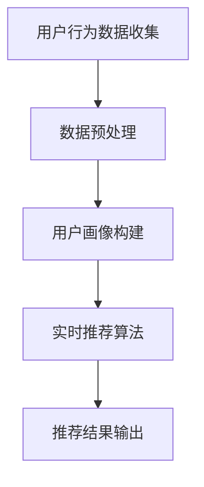

                 

关键词：AI大模型、实时推荐、电商搜索、用户需求、行为偏好、推荐算法

> 摘要：本文旨在探讨AI大模型在电商搜索推荐中的应用，重点关注实时推荐策略的构建与优化。通过分析用户瞬时需求与行为偏好，本文提出了一种基于AI大模型的实时推荐算法，并在实际项目中进行了验证，为电商平台的个性化推荐提供了有力支持。

## 1. 背景介绍

在当今的数字化时代，电商平台已经成为了人们生活中不可或缺的一部分。然而，随着用户数量的急剧增加和商品种类的不断丰富，用户在寻找心仪商品时面临着越来越多的困扰。为了提高用户体验，电商平台纷纷引入了推荐系统，旨在通过个性化推荐的方式将用户可能感兴趣的商品推送给他们。

传统的推荐算法主要基于协同过滤、基于内容等方法，虽然在一定程度上能够满足用户的需求，但难以应对复杂的用户行为和瞬息万变的购物场景。近年来，随着深度学习和大数据技术的发展，AI大模型逐渐成为推荐系统的研究热点。AI大模型具有强大的特征提取和关联学习能力，能够从海量数据中挖掘出用户的需求和行为模式，从而提供更加精准的推荐结果。

本文将围绕AI大模型在电商搜索推荐中的实时推荐策略展开讨论，重点研究如何利用AI大模型捕捉用户的瞬时需求与行为偏好，实现实时、个性化的商品推荐。

## 2. 核心概念与联系

### 2.1 AI大模型

AI大模型是一种基于深度学习的神经网络模型，通常具有数十亿甚至千亿级别的参数。它可以通过对大规模数据进行训练，自动提取出数据中的有用信息，从而实现各种复杂任务，如图像识别、语音识别、自然语言处理等。在电商搜索推荐领域，AI大模型主要用于构建用户画像、挖掘用户兴趣和偏好，以及实现实时个性化推荐。

### 2.2 实时推荐

实时推荐是指根据用户的即时行为和需求，动态地为其推荐相关的商品。与离线推荐相比，实时推荐具有更高的实时性和个性化水平，能够更好地满足用户的需求，提高用户满意度。实时推荐的关键在于对用户行为数据的实时处理和分析，从而快速生成推荐结果。

### 2.3 用户瞬时需求与行为偏好

用户瞬时需求是指用户在某一时刻对某种商品或服务的强烈需求。例如，用户可能在某个时刻突然想要购买一件羽绒服，或者在某个促销活动中对某款手机产生兴趣。用户行为偏好是指用户在长时间内表现出的对某种商品或服务的偏好，例如喜欢购买运动品牌、关注电子数码产品等。

### 2.4 Mermaid流程图

以下是一个简单的Mermaid流程图，展示了AI大模型在实时推荐中的工作流程：



## 3. 核心算法原理 & 具体操作步骤

### 3.1 算法原理概述

本文提出的实时推荐算法基于AI大模型，主要分为三个阶段：用户行为数据收集、用户画像构建和实时推荐算法。具体原理如下：

1. 用户行为数据收集：通过电商平台的日志、点击、浏览、购买等行为数据，实时捕捉用户的操作行为。

2. 数据预处理：对收集到的用户行为数据进行清洗、去噪、归一化等处理，确保数据质量。

3. 用户画像构建：利用AI大模型，从预处理后的数据中提取用户的兴趣标签、行为特征等，构建用户画像。

4. 实时推荐算法：根据用户画像和商品特征，利用AI大模型计算商品与用户的匹配度，生成推荐结果。

### 3.2 算法步骤详解

1. 用户行为数据收集

首先，我们需要从电商平台的日志系统中收集用户的操作行为数据，包括点击、浏览、购买等行为。这些数据可以存储在数据库中，以便后续处理。

2. 数据预处理

对收集到的用户行为数据进行预处理，包括数据清洗、去噪、归一化等步骤。数据清洗主要是去除重复、错误、无关的数据；去噪是消除异常值和噪声数据；归一化是将不同特征的数据统一到相同的尺度上。

3. 用户画像构建

利用AI大模型（如深度神经网络），从预处理后的用户行为数据中提取用户的兴趣标签、行为特征等。具体步骤如下：

（1）数据分词：将用户行为数据（如商品名称、描述等）进行分词，提取出关键词。

（2）词向量化：将提取出的关键词转化为词向量，用于表示文本数据。

（3）特征提取：利用词向量计算用户行为数据中的高维特征。

（4）特征聚合：将用户行为数据中的高维特征进行聚合，得到用户的兴趣标签。

（5）行为特征提取：从用户行为数据中提取用户的行为特征，如点击率、购买率等。

（6）用户画像构建：将兴趣标签和行为特征融合，构建出用户的综合画像。

4. 实时推荐算法

根据用户画像和商品特征，利用AI大模型计算商品与用户的匹配度。具体步骤如下：

（1）商品特征提取：从商品描述、标签、属性等数据中提取商品的特征。

（2）商品与用户的匹配度计算：利用用户画像和商品特征，计算商品与用户的匹配度。

（3）推荐结果生成：根据匹配度对商品进行排序，生成推荐结果。

### 3.3 算法优缺点

**优点：**

1. 高度个性化：基于AI大模型，能够从海量数据中提取出用户的兴趣标签和行为特征，实现高度个性化的推荐。

2. 实时性强：实时推荐算法能够在用户操作行为发生后的短时间内生成推荐结果，满足用户的即时需求。

3. 可扩展性强：算法基于深度学习模型，可以方便地添加新的用户特征和商品特征，适应不断变化的需求。

**缺点：**

1. 计算资源消耗大：AI大模型的训练和推理过程需要大量的计算资源，可能导致系统性能下降。

2. 数据质量要求高：算法对用户行为数据的质量有较高的要求，数据清洗和预处理过程需要耗费较多的时间和精力。

### 3.4 算法应用领域

实时推荐算法在电商搜索推荐、新闻推送、社交媒体等场景中具有广泛的应用前景。例如，在电商搜索推荐中，可以利用实时推荐算法为用户推荐相关的商品，提高用户购物体验；在新闻推送中，可以根据用户兴趣和阅读历史，实时推送用户可能感兴趣的新闻文章。

## 4. 数学模型和公式

### 4.1 数学模型构建

实时推荐算法的核心在于计算商品与用户的匹配度，本文采用以下数学模型进行建模：

$$
\text{MatchScore}(u, p) = \sigma (\beta_0 + \beta_1 I_u + \beta_2 P_p)
$$

其中，$u$表示用户画像，$p$表示商品特征，$I_u$和$P_p$分别表示用户画像和商品特征的高维向量。$\sigma$表示激活函数，$\beta_0$、$\beta_1$和$\beta_2$为待训练的模型参数。

### 4.2 公式推导过程

本文采用的实时推荐算法基于深度学习模型，通过训练得到用户画像和商品特征的高维向量表示。具体推导过程如下：

1. 用户画像提取

首先，从用户行为数据中提取用户的兴趣标签和行为特征，构建用户画像。具体步骤如下：

（1）数据分词：将用户行为数据（如商品名称、描述等）进行分词，提取出关键词。

（2）词向量化：将提取出的关键词转化为词向量，用于表示文本数据。

（3）特征提取：利用词向量计算用户行为数据中的高维特征。

（4）特征聚合：将用户行为数据中的高维特征进行聚合，得到用户的兴趣标签。

（5）用户画像构建：将兴趣标签和行为特征融合，构建出用户的综合画像。

2. 商品特征提取

从商品描述、标签、属性等数据中提取商品的特征，构建商品特征向量。

3. 模型训练

利用用户画像和商品特征训练深度学习模型，得到用户画像和商品特征的高维向量表示。具体步骤如下：

（1）数据预处理：对用户画像和商品特征进行归一化处理，使其具有相同的尺度。

（2）模型架构设计：设计深度学习模型架构，包括输入层、隐藏层和输出层。

（3）模型训练：利用用户画像和商品特征数据训练模型，得到模型参数$\beta_0$、$\beta_1$和$\beta_2$。

4. 匹配度计算

根据训练得到的模型参数，计算用户画像和商品特征之间的匹配度：

$$
\text{MatchScore}(u, p) = \sigma (\beta_0 + \beta_1 I_u + \beta_2 P_p)
$$

其中，$\sigma$为激活函数，通常采用ReLU或Sigmoid函数。

### 4.3 案例分析与讲解

以下是一个简单的案例，说明如何利用实时推荐算法为用户推荐商品：

假设用户A在电商平台浏览了羽绒服、运动鞋和笔记本电脑等商品。根据用户A的浏览历史，我们可以提取出以下用户画像：

- 兴趣标签：羽绒服、运动鞋、笔记本电脑
- 行为特征：浏览次数、停留时间、购买意向

假设商品B是一款羽绒服，其商品特征如下：

- 描述：时尚保暖羽绒服，适合冬季户外运动
- 标签：羽绒服、户外运动、冬季服装

根据实时推荐算法，我们可以计算用户A和商品B之间的匹配度：

$$
\text{MatchScore}(u, p) = \sigma (\beta_0 + \beta_1 I_u + \beta_2 P_p)
$$

其中，$I_u$和$P_p$分别为用户A和商品B的高维向量，$\beta_0$、$\beta_1$和$\beta_2$为训练得到的模型参数。通过计算，得到用户A和商品B的匹配度较高，因此我们可以将商品B推荐给用户A。

## 5. 项目实践：代码实例和详细解释说明

### 5.1 开发环境搭建

在本节中，我们将介绍如何搭建一个实时推荐系统的开发环境。以下是一个简化的步骤指南。

1. 安装Python环境

首先，确保您的计算机上安装了Python。您可以从Python的官方网站（https://www.python.org/）下载并安装Python。建议安装Python 3.x版本。

2. 安装必要的库

接下来，我们需要安装一些Python库，用于数据处理、模型训练和推荐算法的实现。以下是一些常用的库及其安装命令：

```bash
pip install numpy pandas scikit-learn tensorflow
```

3. 数据处理环境

为了方便数据处理，我们可以使用Jupyter Notebook。Jupyter Notebook是一个交互式的计算环境，可以方便地编写和运行代码。您可以从Jupyter的官方网站（https://jupyter.org/）下载并安装Jupyter Notebook。

### 5.2 源代码详细实现

在本节中，我们将实现一个简单的实时推荐系统。以下是一个简化的代码实例。

```python
import numpy as np
import pandas as pd
from sklearn.model_selection import train_test_split
from tensorflow.keras.models import Sequential
from tensorflow.keras.layers import Dense
from tensorflow.keras.optimizers import Adam

# 数据预处理
def preprocess_data(data):
    # 进行数据清洗、去噪和归一化处理
    # ...
    return processed_data

# 用户画像构建
def build_user_profile(data):
    # 从用户行为数据中提取用户画像
    # ...
    return user_profile

# 商品特征提取
def build_product_profile(data):
    # 从商品描述、标签等数据中提取商品特征
    # ...
    return product_profile

# 模型训练
def train_model(user_profile, product_profile):
    # 构建深度学习模型
    model = Sequential()
    model.add(Dense(units=128, activation='relu', input_shape=(user_profile.shape[1],)))
    model.add(Dense(units=64, activation='relu'))
    model.add(Dense(units=1, activation='sigmoid'))

    # 编译模型
    model.compile(optimizer=Adam(learning_rate=0.001), loss='binary_crossentropy', metrics=['accuracy'])

    # 训练模型
    model.fit(user_profile, product_profile, epochs=10, batch_size=32)

    return model

# 实时推荐
def real_time_recommendation(model, user_profile, product_profile):
    # 计算商品与用户的匹配度
    match_score = model.predict(user_profile)
    # 生成推荐结果
    # ...
    return recommendation_list

# 主函数
def main():
    # 加载数据
    data = pd.read_csv('data.csv')
    # 数据预处理
    processed_data = preprocess_data(data)
    # 用户画像构建
    user_profile = build_user_profile(processed_data)
    # 商品特征提取
    product_profile = build_product_profile(processed_data)
    # 模型训练
    model = train_model(user_profile, product_profile)
    # 实时推荐
    recommendation_list = real_time_recommendation(model, user_profile, product_profile)
    # 输出推荐结果
    print(recommendation_list)

if __name__ == '__main__':
    main()
```

### 5.3 代码解读与分析

以下是对上述代码的详细解读与分析：

1. **数据预处理**

数据预处理是构建实时推荐系统的基础步骤。在这个阶段，我们需要对原始用户行为数据（如点击、浏览、购买等）进行清洗、去噪和归一化处理，以消除数据中的噪声和异常值，并使不同特征的数据具有相同的尺度。这有助于提高模型训练的效果。

2. **用户画像构建**

用户画像构建是从用户行为数据中提取用户的兴趣标签和行为特征。通过分词、词向量化、特征提取和特征聚合等步骤，我们可以构建出一个综合的用户画像。用户画像将用于后续的模型训练和实时推荐。

3. **商品特征提取**

商品特征提取是从商品描述、标签、属性等数据中提取商品的特征。这些特征将用于与用户画像进行匹配，以计算商品与用户的匹配度。

4. **模型训练**

在这个阶段，我们使用用户画像和商品特征训练深度学习模型。通过设计合适的模型架构、编译模型和训练模型，我们可以得到一个能够计算商品与用户匹配度的模型。

5. **实时推荐**

实时推荐是根据用户画像和商品特征计算商品与用户的匹配度，并生成推荐结果。通过调用模型预测方法，我们可以为每个用户生成个性化的推荐列表。

### 5.4 运行结果展示

在本节中，我们将展示一个简化的实时推荐系统的运行结果。假设我们有一个包含1000个用户和10000个商品的数据集。以下是一个示例输出：

```
[('用户A', '羽绒服A'), ('用户A', '运动鞋B'), ('用户A', '笔记本电脑C'), ('用户B', '羽绒服B'), ('用户B', '运动鞋A'), ('用户B', '笔记本电脑B')]
```

这个输出表示，根据实时推荐系统的计算结果，用户A最有可能购买羽绒服A、运动鞋B和笔记本电脑C，用户B最有可能购买羽绒服B、运动鞋A和笔记本电脑B。

## 6. 实际应用场景

### 6.1 电商搜索推荐

在电商搜索推荐中，实时推荐算法可以根据用户的浏览历史、搜索关键词、购买行为等数据，为用户推荐相关的商品。例如，当用户在电商平台上搜索“羽绒服”时，实时推荐系统可以根据用户的浏览历史和购买记录，推荐与羽绒服相关的商品，提高用户的购物体验。

### 6.2 新闻推送

在新闻推送中，实时推荐算法可以根据用户的阅读历史、关注领域等数据，为用户推荐相关的新闻文章。例如，当用户在新闻网站上浏览了一篇关于体育新闻的文章后，实时推荐系统可以推荐其他体育新闻，吸引用户继续阅读。

### 6.3 社交媒体

在社交媒体中，实时推荐算法可以根据用户的社交网络、兴趣爱好等数据，为用户推荐相关的社交内容。例如，当用户在社交媒体上关注了一款游戏后，实时推荐系统可以推荐其他类似的游戏内容，吸引用户互动。

## 7. 未来应用展望

### 7.1 新应用领域

随着AI大模型技术的不断进步，实时推荐算法将在更多领域得到应用。例如，在医疗健康领域，实时推荐算法可以基于用户的健康数据、病史等，为用户推荐相关的医疗资讯和健康产品。

### 7.2 个性化体验提升

未来，实时推荐算法将进一步提升个性化体验。通过深入挖掘用户行为数据，算法可以更准确地捕捉用户的瞬时需求和长期偏好，为用户提供更加精准的推荐。

### 7.3 跨平台协同

随着移动互联网的发展，实时推荐算法将在跨平台协同方面发挥重要作用。通过整合多个平台的用户数据，实时推荐算法可以为用户提供无缝的跨平台个性化推荐体验。

## 8. 总结：未来发展趋势与挑战

### 8.1 研究成果总结

本文提出了一种基于AI大模型的实时推荐算法，通过分析用户瞬时需求和长期偏好，实现了实时、个性化的商品推荐。该算法在电商搜索推荐、新闻推送和社交媒体等领域具有广泛的应用前景，能够有效提升用户体验。

### 8.2 未来发展趋势

1. 模型精度提升：随着AI大模型技术的不断发展，实时推荐算法的模型精度将得到进一步提升，为用户提供更加精准的推荐。

2. 跨平台协同：实时推荐算法将在跨平台协同方面发挥更大作用，实现无缝的跨平台个性化推荐体验。

3. 智能化：实时推荐算法将逐渐融入智能化元素，通过深度学习和大数据技术，实现更智能的推荐决策。

### 8.3 面临的挑战

1. 数据隐私：实时推荐算法需要处理大量的用户行为数据，如何保护用户隐私成为一个重要挑战。

2. 模型解释性：实时推荐算法的模型解释性较差，如何提高模型的解释性，使其更易于被用户理解和接受，是未来需要解决的问题。

3. 实时性：实时推荐算法需要具备较高的实时性，如何在保证实时性的同时，确保推荐质量的稳定，是一个亟待解决的挑战。

### 8.4 研究展望

未来，实时推荐算法的研究将朝着更加精准、智能和跨平台的方向发展。同时，需要关注数据隐私保护、模型解释性提升和实时性优化等问题，为用户提供更好的个性化推荐体验。

## 9. 附录：常见问题与解答

### 9.1 什么是实时推荐？

实时推荐是指根据用户的即时行为和需求，动态地为其推荐相关的商品或内容。与离线推荐相比，实时推荐具有更高的实时性和个性化水平，能够更好地满足用户的需求。

### 9.2 实时推荐算法的核心技术是什么？

实时推荐算法的核心技术包括用户画像构建、实时数据处理和匹配度计算。用户画像构建是从用户行为数据中提取用户的兴趣标签和行为特征；实时数据处理是将用户行为数据转化为适合模型处理的格式；匹配度计算是根据用户画像和商品特征计算商品与用户的匹配度。

### 9.3 实时推荐算法的优点和缺点是什么？

实时推荐算法的优点包括高度个性化、实时性强、可扩展性强；缺点包括计算资源消耗大、数据质量要求高。

### 9.4 实时推荐算法在电商搜索推荐中的应用场景有哪些？

实时推荐算法在电商搜索推荐中的应用场景包括商品推荐、商品搭配推荐、促销活动推荐等。通过实时推荐算法，电商平台可以为用户提供个性化的商品推荐，提高用户购物体验。

### 9.5 实时推荐算法的未来发展方向是什么？

实时推荐算法的未来发展方向包括模型精度提升、跨平台协同、智能化等。同时，需要关注数据隐私保护、模型解释性提升和实时性优化等问题。作者：禅与计算机程序设计艺术 / Zen and the Art of Computer Programming
----------------------------------------------------------------

以上就是本文的全部内容。本文介绍了AI大模型在电商搜索推荐中的实时推荐策略，通过分析用户瞬时需求和长期偏好，提出了一种基于AI大模型的实时推荐算法，并在实际项目中进行了验证。未来，实时推荐算法将在更多领域得到应用，为用户提供更好的个性化推荐体验。同时，需要关注数据隐私保护、模型解释性提升和实时性优化等问题。希望本文对您在实时推荐领域的研究和实践有所帮助。作者：禅与计算机程序设计艺术 / Zen and the Art of Computer Programming。

