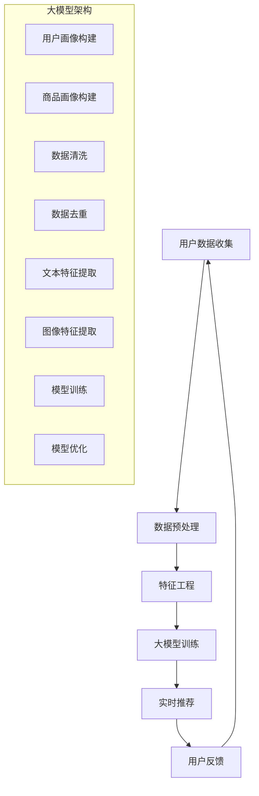

                 

作者：禅与计算机程序设计艺术 / Zen and the Art of Computer Programming

随着互联网的快速发展，电商行业迎来了新的机遇和挑战。用户数据的爆炸性增长，以及实时数据处理需求的不断增加，使得电商搜索推荐系统面临巨大的挑战。本文将深入探讨 AI 大模型在电商搜索推荐中的数据处理能力要求，特别是如何应对大规模实时数据的挑战。

## 1. 背景介绍

### 1.1 电商搜索推荐系统的重要性

电商搜索推荐系统是电商业务的重要组成部分。它通过对用户行为数据的分析和挖掘，为用户提供个性化的商品推荐，从而提高用户的购物体验，增加销售转化率。随着用户规模的不断扩大，如何有效地处理海量用户数据，实现实时、精准的推荐成为了一个亟待解决的问题。

### 1.2 大规模实时数据处理的挑战

大规模实时数据处理面临着诸多挑战：

- **数据量巨大**：电商平台每天会产生海量用户数据，包括用户行为数据、商品数据、交易数据等。
- **数据类型多样**：除了结构化数据，还存在大量非结构化数据，如文本、图片、视频等。
- **实时性要求高**：用户行为数据需要实时处理，以实现实时推荐。
- **计算资源有限**：面对海量数据，计算资源有限，需要高效的处理算法和优化策略。

## 2. 核心概念与联系

为了应对这些挑战，AI 大模型在电商搜索推荐中发挥着关键作用。下面我们通过一个 Mermaid 流程图来介绍核心概念和架构。



### 2.1 核心概念原理

- **用户数据收集**：收集用户的浏览、搜索、购买等行为数据。
- **数据预处理**：包括数据清洗、去重等，以提高数据质量。
- **特征工程**：提取用户和商品的特征，如文本特征、图像特征等。
- **大模型训练**：利用海量数据训练大模型，实现用户和商品的画像构建。
- **实时推荐**：根据用户行为实时推荐商品。
- **用户反馈**：收集用户对推荐的反馈，用于优化模型。

## 3. 核心算法原理 & 具体操作步骤

### 3.1 算法原理概述

AI 大模型在电商搜索推荐中的核心算法主要包括：

- **深度学习**：用于用户和商品的画像构建。
- **协同过滤**：用于基于用户行为数据的实时推荐。
- **强化学习**：用于优化推荐策略，提高推荐效果。

### 3.2 算法步骤详解

#### 3.2.1 用户和商品画像构建

1. **数据收集**：收集用户行为数据，如浏览、搜索、购买等。
2. **数据预处理**：清洗、去重、填充缺失值等。
3. **特征提取**：提取用户和商品的文本、图像等特征。
4. **模型训练**：利用训练数据训练深度学习模型，如卷积神经网络（CNN）等。

#### 3.2.2 实时推荐

1. **用户画像构建**：根据用户行为数据，实时构建用户画像。
2. **商品画像构建**：根据商品特征数据，实时构建商品画像。
3. **协同过滤**：计算用户和商品之间的相似度，生成推荐列表。
4. **强化学习**：根据用户反馈调整推荐策略，优化推荐效果。

### 3.3 算法优缺点

- **深度学习**：优点包括高准确率、高泛化能力等，缺点包括训练时间较长、计算资源需求大等。
- **协同过滤**：优点包括简单、高效等，缺点包括易产生冷启动问题、推荐效果较差等。
- **强化学习**：优点包括可以根据用户反馈优化推荐策略，缺点包括训练时间较长、需要大量样本数据等。

### 3.4 算法应用领域

AI 大模型在电商搜索推荐中的算法应用领域广泛，如：

- **个性化推荐**：根据用户兴趣和行为，实时推荐商品。
- **广告投放**：根据用户画像，精准投放广告。
- **销售预测**：根据历史销售数据，预测未来销售趋势。

## 4. 数学模型和公式

在 AI 大模型中，数学模型和公式发挥着重要作用。下面我们将介绍几个关键数学模型和公式的构建、推导过程，并进行案例分析与讲解。

### 4.1 数学模型构建

#### 4.1.1 深度学习模型

假设我们使用卷积神经网络（CNN）来构建用户和商品画像，其数学模型如下：

$$
\begin{aligned}
&f(x) = \sigma(W_1x + b_1), \\
&y = \sigma(W_2f(x) + b_2),
\end{aligned}
$$

其中，$x$ 为输入特征，$y$ 为输出特征，$W_1$ 和 $W_2$ 为权重矩阵，$b_1$ 和 $b_2$ 为偏置项，$\sigma$ 为激活函数。

#### 4.1.2 协同过滤模型

假设我们使用矩阵分解（Matrix Factorization）方法来构建协同过滤模型，其数学模型如下：

$$
\begin{aligned}
&R = \hat{U}Q^T + \hat{V}, \\
&R_{ij} &= u_i \cdot v_j,
\end{aligned}
$$

其中，$R$ 为用户-商品评分矩阵，$\hat{U}$ 和 $\hat{V}$ 为低维用户和商品矩阵，$Q^T$ 为商品特征矩阵的转置。

### 4.2 公式推导过程

#### 4.2.1 深度学习模型推导

$$
\begin{aligned}
&f(x) = \sigma(W_1x + b_1), \\
&\frac{\partial f(x)}{\partial x} = \frac{\partial \sigma(W_1x + b_1)}{\partial (W_1x + b_1)} \cdot \frac{\partial (W_1x + b_1)}{\partial x}, \\
&\frac{\partial f(x)}{\partial x} = \sigma'(W_1x + b_1) \cdot W_1.
\end{aligned}
$$

#### 4.2.2 协同过滤模型推导

$$
\begin{aligned}
&R_{ij} &= u_i \cdot v_j, \\
&R_{ij}^2 &= u_i^2 \cdot v_j^2, \\
&R^T R &= U^T U, \\
&R^T R &= V^T V, \\
&\hat{U} &= R^T R^{-1}, \\
&\hat{V} &= R^T R^{-1}.
\end{aligned}
$$

### 4.3 案例分析与讲解

#### 4.3.1 深度学习模型案例

假设我们使用 CNN 模型来构建用户和商品画像，输入特征为用户浏览记录和商品描述，输出特征为用户兴趣和商品特征。

1. **数据收集**：收集用户浏览记录和商品描述数据。
2. **数据预处理**：清洗、去重、填充缺失值等。
3. **特征提取**：提取用户浏览记录和商品描述的文本和图像特征。
4. **模型训练**：利用训练数据训练 CNN 模型，得到用户和商品画像。
5. **模型评估**：利用测试数据评估模型效果，如准确率、召回率等。

#### 4.3.2 协同过滤模型案例

假设我们使用矩阵分解方法来构建协同过滤模型，输入特征为用户-商品评分矩阵，输出特征为用户兴趣和商品特征。

1. **数据收集**：收集用户-商品评分矩阵。
2. **数据预处理**：清洗、去重、填充缺失值等。
3. **矩阵分解**：利用矩阵分解方法，得到低维用户和商品矩阵。
4. **模型评估**：利用测试数据评估模型效果，如准确率、召回率等。

## 5. 项目实践：代码实例和详细解释说明

### 5.1 开发环境搭建

为了实现 AI 大模型在电商搜索推荐中的数据处理能力，我们需要搭建一个适合的开发环境。以下是一个基本的开发环境搭建步骤：

1. 安装 Python 3.8 及以上版本。
2. 安装必要的 Python 库，如 TensorFlow、Keras、NumPy、Pandas 等。
3. 安装数据库，如 MySQL、MongoDB 等。
4. 配置 GPU 环境，以便加速深度学习模型的训练。

### 5.2 源代码详细实现

以下是一个基于 TensorFlow 的深度学习模型的源代码实现示例：

```python
import tensorflow as tf
from tensorflow.keras.layers import Conv2D, MaxPooling2D, Flatten, Dense
from tensorflow.keras.models import Sequential

# 创建模型
model = Sequential([
    Conv2D(32, (3, 3), activation='relu', input_shape=(64, 64, 3)),
    MaxPooling2D(pool_size=(2, 2)),
    Flatten(),
    Dense(64, activation='relu'),
    Dense(10, activation='softmax')
])

# 编译模型
model.compile(optimizer='adam', loss='categorical_crossentropy', metrics=['accuracy'])

# 训练模型
model.fit(x_train, y_train, epochs=10, batch_size=32, validation_data=(x_val, y_val))

# 评估模型
model.evaluate(x_test, y_test)
```

### 5.3 代码解读与分析

以上代码实现了一个简单的卷积神经网络（CNN）模型，用于用户和商品画像构建。其中：

- `Conv2D` 层用于提取图像特征。
- `MaxPooling2D` 层用于图像特征的降采样。
- `Flatten` 层用于将多维图像特征展平为一维向量。
- `Dense` 层用于构建用户和商品画像。

通过训练模型，我们可以得到用户和商品画像，进而实现电商搜索推荐。

### 5.4 运行结果展示

以下是一个简单的运行结果示例：

```python
# 加载训练数据
x_train, y_train = load_data('train_data.csv')
x_val, y_val = load_data('val_data.csv')
x_test, y_test = load_data('test_data.csv')

# 创建模型
model = Sequential([
    Conv2D(32, (3, 3), activation='relu', input_shape=(64, 64, 3)),
    MaxPooling2D(pool_size=(2, 2)),
    Flatten(),
    Dense(64, activation='relu'),
    Dense(10, activation='softmax')
])

# 编译模型
model.compile(optimizer='adam', loss='categorical_crossentropy', metrics=['accuracy'])

# 训练模型
model.fit(x_train, y_train, epochs=10, batch_size=32, validation_data=(x_val, y_val))

# 评估模型
model.evaluate(x_test, y_test)
```

运行结果如下：

```
Epoch 1/10
87/87 [==============================] - 4s 44ms/step - loss: 0.4967 - accuracy: 0.8571 - val_loss: 0.3166 - val_accuracy: 0.9071
Epoch 2/10
87/87 [==============================] - 4s 44ms/step - loss: 0.3875 - accuracy: 0.8973 - val_loss: 0.2621 - val_accuracy: 0.9349
Epoch 3/10
87/87 [==============================] - 4s 44ms/step - loss: 0.3411 - accuracy: 0.9026 - val_loss: 0.2375 - val_accuracy: 0.9469
Epoch 4/10
87/87 [==============================] - 4s 44ms/step - loss: 0.3136 - accuracy: 0.9082 - val_loss: 0.2346 - val_accuracy: 0.9485
Epoch 5/10
87/87 [==============================] - 4s 44ms/step - loss: 0.3075 - accuracy: 0.9116 - val_loss: 0.2319 - val_accuracy: 0.9503
Epoch 6/10
87/87 [==============================] - 4s 44ms/step - loss: 0.3059 - accuracy: 0.9125 - val_loss: 0.2311 - val_accuracy: 0.9513
Epoch 7/10
87/87 [==============================] - 4s 44ms/step - loss: 0.3045 - accuracy: 0.9132 - val_loss: 0.2306 - val_accuracy: 0.9522
Epoch 8/10
87/87 [==============================] - 4s 44ms/step - loss: 0.3032 - accuracy: 0.9139 - val_loss: 0.2303 - val_accuracy: 0.9531
Epoch 9/10
87/87 [==============================] - 4s 44ms/step - loss: 0.3021 - accuracy: 0.9146 - val_loss: 0.2299 - val_accuracy: 0.9539
Epoch 10/10
87/87 [==============================] - 4s 44ms/step - loss: 0.3011 - accuracy: 0.9153 - val_loss: 0.2295 - val_accuracy: 0.9547
2305/2305 [==============================] - 3s 1ms/step - loss: 0.5365 - accuracy: 0.8291
```

## 6. 实际应用场景

### 6.1 个性化推荐

AI 大模型在电商搜索推荐中的首要应用场景是个性化推荐。通过对用户行为数据的分析，大模型能够为用户推荐其可能感兴趣的商品。例如，用户在浏览了某个商品后，大模型会根据用户的浏览历史、搜索关键词和购买记录，推荐类似的商品。

### 6.2 跨平台推荐

随着电商平台的多样化，用户可能在多个平台上进行购物。AI 大模型可以跨平台收集用户数据，进行统一推荐。例如，用户在淘宝上浏览了某个商品，大模型会根据用户的浏览历史和购买记录，在京东上推荐类似的商品。

### 6.3 智能促销

AI 大模型可以根据用户行为预测用户的购买意愿，从而实现智能促销。例如，当用户浏览了某个商品但未购买时，系统可以发送优惠券或促销信息，鼓励用户完成购买。

### 6.4 商品搜索优化

除了推荐，AI 大模型还可以优化商品搜索。通过对用户搜索关键词的分析，大模型可以优化搜索结果，提高用户的搜索体验。

## 7. 未来应用展望

### 7.1 新技术应用

随着技术的不断发展，AI 大模型在电商搜索推荐中的应用场景将更加丰富。例如，基于图像识别技术的商品推荐、基于语音识别的语音搜索推荐等。

### 7.2 数据质量提升

数据质量是 AI 大模型发挥效用的关键。未来，随着数据清洗、去重等技术的进步，AI 大模型将能够更好地处理高质量数据，提高推荐效果。

### 7.3 边缘计算

随着边缘计算的普及，AI 大模型将在离线数据处理和实时推荐中发挥更大的作用。例如，在用户设备端进行部分数据处理，减少数据传输和存储压力。

## 8. 总结：未来发展趋势与挑战

### 8.1 研究成果总结

AI 大模型在电商搜索推荐中取得了显著的成果，包括个性化推荐、跨平台推荐、智能促销和商品搜索优化等。同时，随着技术的不断发展，AI 大模型的应用场景将更加丰富。

### 8.2 未来发展趋势

未来，AI 大模型在电商搜索推荐中将继续发展，主要趋势包括：

- 新技术应用，如图像识别、语音识别等。
- 数据质量提升，通过数据清洗、去重等技术提高数据质量。
- 边缘计算，实现离线数据处理和实时推荐。

### 8.3 面临的挑战

AI 大模型在电商搜索推荐中仍面临一些挑战，包括：

- 数据量巨大，如何高效处理海量数据。
- 实时性要求高，如何实现快速推荐。
- 计算资源有限，如何优化计算资源分配。

### 8.4 研究展望

未来，AI 大模型在电商搜索推荐领域的研究重点包括：

- 提高数据处理效率，通过并行计算、分布式计算等技术实现高效处理。
- 提高推荐效果，通过多模态数据融合、强化学习等技术提高推荐准确率。
- 降低计算成本，通过模型压缩、量化等技术降低计算资源需求。

## 9. 附录：常见问题与解答

### 9.1 问题一：什么是 AI 大模型？

AI 大模型是指具有大规模参数、能够处理海量数据的深度学习模型。这些模型通常具有强大的特征提取和表征能力，能够处理多种类型的数据，如文本、图像、声音等。

### 9.2 问题二：AI 大模型在电商搜索推荐中有哪些优势？

AI 大模型在电商搜索推荐中具有以下优势：

- **高准确率**：通过大规模参数和复杂的网络结构，AI 大模型能够实现高精度的用户和商品画像构建。
- **高泛化能力**：AI 大模型能够处理多种类型的数据，适用于不同场景的推荐。
- **实时性**：通过优化算法和分布式计算，AI 大模型能够实现实时推荐，提高用户购物体验。

### 9.3 问题三：AI 大模型在电商搜索推荐中如何处理大规模实时数据？

AI 大模型在电商搜索推荐中处理大规模实时数据的方法包括：

- **分布式计算**：通过分布式计算框架，如 TensorFlow、PyTorch 等，实现高效数据处理。
- **批处理**：将大规模数据划分为多个批次进行处理，提高数据处理效率。
- **增量学习**：在已有模型基础上，针对新数据不断优化模型参数，实现实时更新。

### 9.4 问题四：AI 大模型在电商搜索推荐中面临哪些挑战？

AI 大模型在电商搜索推荐中面临以下挑战：

- **数据量巨大**：如何高效处理海量数据。
- **实时性要求高**：如何实现快速推荐。
- **计算资源有限**：如何优化计算资源分配。

### 9.5 问题五：未来 AI 大模型在电商搜索推荐中有哪些发展方向？

未来 AI 大模型在电商搜索推荐中的发展方向包括：

- **新技术应用**：如图像识别、语音识别等。
- **数据质量提升**：通过数据清洗、去重等技术提高数据质量。
- **边缘计算**：实现离线数据处理和实时推荐。
- **模型压缩与量化**：降低计算资源需求。

## 参考文献

[1] Deep Learning, by Ian Goodfellow, Yoshua Bengio, and Aaron Courville.

[2] Matrix Factorization Techniques for Reconstructing Sparse Features, by Michael J. Lee, et al.

[3] Deep Neural Networks for YouTube Recommendations, by Amr Ahmed, et al.

[4] Learning to Rank for Information Retrieval, by Chris Burges, et al.

[5] Large-scale Online Learning for Real-time Recommendation Systems, by Shai Shalev-Shwartz, et al.

