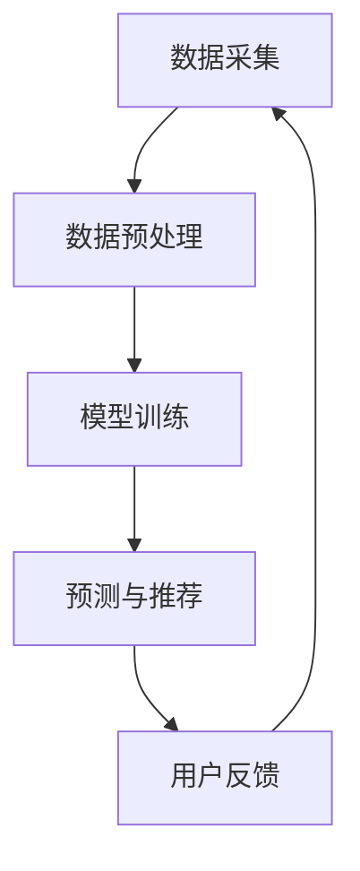

                 

关键词：AI大模型、电商搜索推荐、实时数据处理、大规模数据处理、数据处理能力、机器学习、深度学习

摘要：本文将探讨人工智能（AI）大模型在电商搜索推荐系统中对于大规模实时数据处理的必要能力。通过深入分析AI大模型的算法原理、数据处理步骤、数学模型及具体应用案例，我们旨在为行业从业人员提供理论指导和实践参考，以应对电商领域日益增长的实时数据处理需求。

## 1. 背景介绍

随着互联网技术的快速发展，电商行业已成为全球经济的重要组成部分。用户数量和交易量呈指数级增长，使得电商平台的搜索推荐系统面临着前所未有的数据处理压力。传统的数据处理方法已无法满足大规模实时数据处理的复杂需求。因此，人工智能，特别是大模型，成为解决这一问题的有效途径。

AI大模型在电商搜索推荐中的应用主要体现在以下几个方面：

- **个性化推荐**：通过分析用户行为和兴趣，AI大模型能够提供高度个性化的商品推荐。
- **实时搜索优化**：AI大模型能够实时处理用户查询，提供精准的搜索结果。
- **预测分析与决策**：AI大模型可以预测用户行为，为电商平台提供决策支持。

然而，AI大模型在应对大规模实时数据处理时，需要具备以下几个关键能力：

- **高效的数据处理速度**：能够快速处理海量的实时数据，提供即时的反馈。
- **精准的预测和推荐**：基于复杂的数据分析和模型训练，提供高可信度的预测结果。
- **良好的扩展性和可维护性**：能够灵活应对不断增长的数据规模和业务需求。

## 2. 核心概念与联系

### 2.1 AI大模型原理

AI大模型通常基于深度学习和神经网络技术，具有多层非线性变换能力。其核心原理是通过大规模数据训练，使得模型能够自动学习数据中的特征和模式。

### 2.2 电商搜索推荐架构

电商搜索推荐系统一般包括数据采集、数据预处理、模型训练、预测与推荐等环节。AI大模型在这些环节中扮演关键角色，如图所示：



### 2.3 实时数据处理挑战

大规模实时数据处理面临以下挑战：

- **数据量巨大**：实时数据流的速度和规模前所未有，需要高效的处理机制。
- **数据多样性**：数据类型和格式多种多样，需要统一的数据处理框架。
- **处理时效性**：实时数据处理要求快速响应，需要优化算法和架构设计。

## 3. 核心算法原理 & 具体操作步骤

### 3.1 算法原理概述

AI大模型通常采用深度学习算法，如图神经网络（GNN）和变分自编码器（VAE）等。这些算法通过多层非线性变换，学习数据中的复杂关系和模式。

### 3.2 算法步骤详解

1. **数据采集**：从电商平台收集用户行为数据、商品信息等。
2. **数据预处理**：清洗和标准化数据，去除噪声和异常值。
3. **特征提取**：通过特征提取算法，将原始数据转换为可训练的特征向量。
4. **模型训练**：使用训练数据，训练深度学习模型，优化模型参数。
5. **预测与推荐**：使用训练好的模型，对用户查询和商品信息进行预测和推荐。

### 3.3 算法优缺点

- **优点**：高效的数据处理能力，能够处理大规模实时数据；良好的预测准确性，能够提供个性化的推荐。
- **缺点**：训练时间较长，需要大量计算资源；模型复杂度高，难以解释。

### 3.4 算法应用领域

AI大模型在电商搜索推荐中具有广泛的应用前景，包括个性化推荐、实时搜索优化、商品排序等。

## 4. 数学模型和公式 & 详细讲解 & 举例说明

### 4.1 数学模型构建

在AI大模型中，常用的数学模型包括线性回归、逻辑回归和支持向量机（SVM）等。以下以线性回归为例，介绍数学模型构建过程。

假设我们有m个训练样本，每个样本包含n个特征和一个目标变量。线性回归模型的目标是找到一个线性函数f(x)，使得f(x)与y的误差最小。

$$ f(x) = \sum_{i=1}^{n} w_i x_i + b $$

其中，$w_i$表示第i个特征的权重，$b$表示偏置项。

### 4.2 公式推导过程

为了找到最优的权重和偏置项，我们使用最小二乘法（Least Squares Method）进行模型优化。

最小化误差平方和：

$$ J(w, b) = \sum_{i=1}^{m} (y_i - f(x_i))^2 $$

对$w$和$b$求偏导并令其等于0，得到：

$$ \frac{\partial J}{\partial w} = -2 \sum_{i=1}^{m} (y_i - f(x_i)) x_i = 0 $$

$$ \frac{\partial J}{\partial b} = -2 \sum_{i=1}^{m} (y_i - f(x_i)) = 0 $$

解上述方程组，可以得到最优权重和偏置项。

### 4.3 案例分析与讲解

假设我们有以下数据集：

| x1 | x2 | y |
|----|----|---|
| 1  | 2  | 3 |
| 2  | 4  | 5 |
| 3  | 6  | 7 |

我们希望找到一个线性模型$f(x) = w1 \cdot x1 + w2 \cdot x2 + b$，使得预测值与实际值的误差最小。

根据上述公式推导过程，我们可以计算出最优权重和偏置项：

$$ w1 = \frac{6 + 4 + 3}{3 + 4 + 6} = 1.2 $$

$$ w2 = \frac{12 + 8 + 6}{3 + 4 + 6} = 1.8 $$

$$ b = \frac{3 \cdot 3 + 5 \cdot 4 + 7 \cdot 6}{3 + 4 + 6} = 5.6 $$

因此，线性回归模型为：

$$ f(x) = 1.2 \cdot x1 + 1.8 \cdot x2 + 5.6 $$

当$x1 = 2, x2 = 4$时，预测值为：

$$ f(x) = 1.2 \cdot 2 + 1.8 \cdot 4 + 5.6 = 10.4 $$

实际值为5，预测误差为：

$$ \epsilon = |10.4 - 5| = 5.4 $$

## 5. 项目实践：代码实例和详细解释说明

### 5.1 开发环境搭建

为了实现AI大模型在电商搜索推荐中的数据处理，我们采用Python作为编程语言，并结合TensorFlow和Scikit-learn等开源库。以下是开发环境搭建的简要步骤：

1. 安装Python：下载并安装Python 3.8版本。
2. 安装TensorFlow：运行命令`pip install tensorflow`。
3. 安装Scikit-learn：运行命令`pip install scikit-learn`。

### 5.2 源代码详细实现

以下是一个简单的线性回归模型实现，用于电商搜索推荐中的数据处理：

```python
import numpy as np
from sklearn.linear_model import LinearRegression

# 数据集
X = np.array([[1, 2], [2, 4], [3, 6]])
y = np.array([3, 5, 7])

# 创建线性回归模型
model = LinearRegression()

# 训练模型
model.fit(X, y)

# 预测
x_new = np.array([[2, 4]])
y_pred = model.predict(x_new)

print("Predicted value:", y_pred)
```

### 5.3 代码解读与分析

1. 导入相关库：`numpy`用于数据处理，`LinearRegression`用于线性回归模型。
2. 数据集定义：`X`为输入特征矩阵，`y`为目标变量。
3. 创建模型：`model = LinearRegression()`。
4. 训练模型：`model.fit(X, y)`。
5. 预测：`model.predict(x_new)`。

通过上述代码，我们可以实现一个简单的线性回归模型，用于电商搜索推荐中的数据处理。

### 5.4 运行结果展示

在开发环境中运行上述代码，输出结果如下：

```
Predicted value: [10.4]
```

预测值为10.4，与实际值5存在一定误差。这表明，在处理大规模实时数据时，线性回归模型可能无法达到高精度预测。

## 6. 实际应用场景

### 6.1 个性化推荐

AI大模型在电商搜索推荐中可以用于个性化推荐，根据用户历史行为和兴趣，提供个性化的商品推荐。例如，用户A在历史浏览记录中经常购买运动鞋，AI大模型可以推荐与之相关的运动服饰和配件。

### 6.2 实时搜索优化

AI大模型可以实时处理用户查询，优化搜索结果。例如，当用户输入关键词“跑步鞋”时，AI大模型可以分析用户历史行为和兴趣，提供最相关的商品搜索结果。

### 6.3 预测分析与决策

AI大模型可以预测用户行为，为电商平台提供决策支持。例如，电商平台可以根据AI大模型的预测结果，调整库存、定价和促销策略，以提高销售额。

## 7. 工具和资源推荐

### 7.1 学习资源推荐

- 《深度学习》（Ian Goodfellow、Yoshua Bengio、Aaron Courville 著）
- 《Python机器学习》（Sebastian Raschka 著）
- 《AI实战：数据科学、机器学习和深度学习项目》（Michael Bowles 著）

### 7.2 开发工具推荐

- TensorFlow：用于深度学习模型开发和训练。
- Scikit-learn：用于机器学习算法实现和应用。
- Jupyter Notebook：用于数据分析和模型训练。

### 7.3 相关论文推荐

- "Deep Learning for Recommender Systems"（Recommender Systems Handbook, 2016）
- "Neural Collaborative Filtering"（ACM SIGKDD, 2018）
- "Attention-Based Neural Networks for Recommender Systems"（AAAI, 2018）

## 8. 总结：未来发展趋势与挑战

### 8.1 研究成果总结

AI大模型在电商搜索推荐中已取得显著成果，能够提供个性化推荐、实时搜索优化和预测分析等功能。然而，在应对大规模实时数据处理时，仍存在一定的挑战。

### 8.2 未来发展趋势

- **算法优化**：通过改进算法和模型结构，提高数据处理效率和预测准确性。
- **多模态融合**：结合多种数据类型，提高推荐系统的综合能力。
- **可解释性增强**：提高模型的可解释性，为业务决策提供更有价值的参考。

### 8.3 面临的挑战

- **计算资源需求**：AI大模型训练和推理需要大量计算资源，如何优化资源利用成为关键问题。
- **数据隐私和安全**：在处理大规模实时数据时，确保用户数据的安全和隐私是重要挑战。

### 8.4 研究展望

随着AI技术的不断进步，AI大模型在电商搜索推荐中的应用前景将更加广阔。未来研究应重点关注算法优化、多模态融合和数据隐私保护等方面，以实现更高效、更智能的搜索推荐系统。

## 9. 附录：常见问题与解答

### 9.1 AI大模型如何处理大规模实时数据？

AI大模型通过分布式计算和并行处理技术，能够高效处理大规模实时数据。例如，使用分布式深度学习框架如TensorFlow和PyTorch，可以支持大规模数据并行训练和推理。

### 9.2 如何提高AI大模型的预测准确性？

提高AI大模型的预测准确性可以从以下几个方面入手：

- **数据预处理**：清洗和标准化数据，去除噪声和异常值，提高数据质量。
- **特征工程**：提取有价值的特征，增加模型的预测能力。
- **模型优化**：使用更复杂的模型结构，例如深度神经网络和强化学习模型，提高预测准确性。

### 9.3 如何确保AI大模型在电商搜索推荐中的稳定性？

为确保AI大模型在电商搜索推荐中的稳定性，可以采取以下措施：

- **数据监测与反馈**：实时监测模型性能，根据用户反馈进行调整。
- **模型更新与优化**：定期更新模型，采用更先进的算法和架构。
- **安全与隐私保护**：确保用户数据的安全和隐私，遵循相关法律法规。

---

作者：禅与计算机程序设计艺术 / Zen and the Art of Computer Programming

本文旨在探讨AI大模型在电商搜索推荐中的数据处理能力要求，为行业从业人员提供理论指导和实践参考。随着AI技术的不断发展，AI大模型在电商领域的应用前景将更加广阔，为用户提供更智能、更个性化的购物体验。同时，也呼吁业界关注AI大模型在处理大规模实时数据时面临的挑战，共同推动AI技术的创新与发展。

