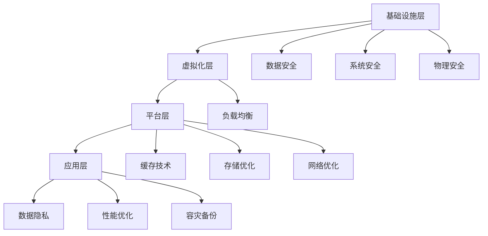

                 

关键词：AI 大模型，数据中心建设，安全性，可靠性，技术架构，数据隐私，性能优化，容灾备份

摘要：本文探讨了 AI 大模型应用数据中心建设的核心议题，包括数据中心的整体架构设计、安全性与可靠性保障、数据隐私保护、性能优化策略以及容灾备份方案。通过对这些关键问题的深入分析，本文旨在为 AI 大模型数据中心的建设提供实用的指导和建议，为相关领域的专业人士和研究人员提供有价值的参考。

## 1. 背景介绍

随着人工智能技术的快速发展，AI 大模型在自然语言处理、计算机视觉、推荐系统等多个领域取得了显著的成果。然而，AI 大模型的训练和部署需要大量的计算资源和数据存储，这就促使数据中心成为承载这些计算任务的核心基础设施。数据中心的建设不仅关系到 AI 大模型的应用效果，更关乎数据安全与可靠性。

### 数据中心的发展历程

数据中心的发展历程可以分为几个阶段：

1. **传统数据中心**：早期数据中心主要依赖物理服务器和网络设备，以提供基本的计算和存储服务。
2. **虚拟化数据中心**：随着虚拟化技术的普及，数据中心开始引入虚拟化层，提高了资源利用率和灵活性。
3. **云计算数据中心**：云计算的兴起使得数据中心更加规模化和自动化，通过提供按需服务满足不同用户的需求。
4. **AI 大模型专用数据中心**：当前，为了应对 AI 大模型的高计算需求，专用数据中心应运而生，这些中心专注于为 AI 大模型提供高效的计算和存储资源。

### 数据中心在 AI 大模型应用中的重要性

数据中心在 AI 大模型应用中扮演着至关重要的角色，主要表现在以下几个方面：

1. **计算资源**：AI 大模型训练需要大量计算资源，数据中心提供了足够的计算能力以支持模型训练。
2. **数据存储**：AI 大模型需要存储大量数据，数据中心提供了高效的数据存储和管理机制。
3. **可靠性**：数据中心的高可靠性确保了 AI 大模型训练的连续性和稳定性。
4. **安全性**：数据中心的安全措施保证了数据和模型的安全性，防止数据泄露和攻击。

## 2. 核心概念与联系

在 AI 大模型应用数据中心的建设中，我们需要理解几个核心概念，这些概念相互联系，共同构成了数据中心的整体架构。

### 2.1 数据中心架构

数据中心架构可以分为以下几个层次：

1. **基础设施层**：包括物理服务器、网络设备、存储设备等硬件资源。
2. **虚拟化层**：通过虚拟化技术，将物理资源抽象为虚拟资源，提高资源利用率。
3. **平台层**：提供计算、存储、网络等基础服务，为上层应用提供支持。
4. **应用层**：部署 AI 大模型和相关应用，实现具体业务功能。

### 2.2 安全性与可靠性

安全性与可靠性是数据中心建设的核心议题。具体包括：

1. **数据安全**：保护数据和模型不被非法访问和篡改。
2. **系统安全**：防范恶意攻击，确保系统稳定运行。
3. **物理安全**：保障数据中心硬件设备的安全。
4. **数据备份与恢复**：确保数据不丢失，能够在故障发生后迅速恢复。

### 2.3 数据隐私

数据隐私是当今社会的一个重要议题，尤其在 AI 大模型应用中，涉及到大量敏感数据。数据中心需要采取以下措施保护数据隐私：

1. **数据加密**：对敏感数据进行加密，防止数据泄露。
2. **隐私保护算法**：使用隐私保护算法，确保数据在处理过程中的隐私性。
3. **合规性**：遵守相关法律法规，确保数据处理合法合规。

### 2.4 性能优化

性能优化是数据中心建设中的重要一环，具体包括：

1. **负载均衡**：合理分配计算和存储资源，避免单点故障。
2. **缓存技术**：使用缓存技术提高数据访问速度。
3. **存储优化**：采用高效的存储策略，降低存储成本。
4. **网络优化**：优化网络结构，提高数据传输效率。

### 2.5 容灾备份

容灾备份是保障数据中心可靠性的重要手段，具体包括：

1. **主备备份**：在主数据中心出现故障时，备用数据中心能够接管业务。
2. **数据备份**：定期备份关键数据，确保数据不丢失。
3. **灾难恢复**：在发生灾难后，能够迅速恢复业务运行。

下面是数据中心的 Mermaid 流程图，展示了各层架构和核心概念之间的关系：



## 3. 核心算法原理 & 具体操作步骤

### 3.1 算法原理概述

在数据中心的建设中，核心算法原理主要包括以下几个方面：

1. **负载均衡算法**：通过分配计算任务，确保各服务器资源得到充分利用。
2. **加密算法**：用于数据加密和解密，保障数据安全。
3. **备份与恢复算法**：实现数据的备份和恢复，确保数据不丢失。
4. **数据隐私保护算法**：保护数据隐私，防止敏感信息泄露。

### 3.2 算法步骤详解

下面详细解释这些算法的步骤：

#### 3.2.1 负载均衡算法

1. **收集服务器状态**：定期收集各服务器的负载情况，包括CPU利用率、内存占用率等。
2. **计算负载均衡策略**：根据服务器状态，计算出最优的负载均衡策略，通常采用轮询、最少连接等算法。
3. **分配任务**：将计算任务分配到各服务器上，按照负载均衡策略执行。
4. **监控与调整**：实时监控服务器负载，根据负载变化调整负载均衡策略。

#### 3.2.2 加密算法

1. **选择加密算法**：根据数据安全和性能需求，选择合适的加密算法，如AES、RSA等。
2. **加密数据**：使用加密算法对数据进行加密，生成密文。
3. **解密数据**：在需要读取数据时，使用相应的解密算法对数据进行解密，恢复明文。
4. **密钥管理**：确保密钥的安全存储和传输，定期更换密钥。

#### 3.2.3 备份与恢复算法

1. **数据备份**：定期备份关键数据，可以选择全量备份或增量备份。
2. **数据恢复**：在发生数据丢失或系统故障时，从备份中恢复数据。
3. **备份存储**：选择安全可靠的备份存储方案，如云存储、本地磁盘等。
4. **备份验证**：定期对备份数据进行验证，确保备份的有效性。

#### 3.2.4 数据隐私保护算法

1. **数据去标识化**：将敏感数据进行去标识化处理，消除唯一标识。
2. **差分隐私**：在数据处理过程中加入噪声，确保数据的隐私性。
3. **安全多方计算**：在数据共享和分析过程中，采用安全多方计算技术，保障数据隐私。
4. **隐私合规性审计**：定期进行隐私合规性审计，确保数据处理符合相关法律法规。

### 3.3 算法优缺点

每种算法都有其优缺点，选择合适的算法取决于具体的应用场景和需求：

#### 3.3.1 负载均衡算法

- **优点**：提高服务器资源利用率，确保系统稳定性。
- **缺点**：算法复杂度高，需要定期维护和监控。

#### 3.3.2 加密算法

- **优点**：保障数据安全，防止数据泄露。
- **缺点**：加密和解密过程消耗计算资源，影响性能。

#### 3.3.3 备份与恢复算法

- **优点**：确保数据不丢失，提高系统可靠性。
- **缺点**：备份和恢复过程消耗时间和资源。

#### 3.3.4 数据隐私保护算法

- **优点**：保护数据隐私，提高数据安全性。
- **缺点**：算法复杂度高，对系统性能有一定影响。

### 3.4 算法应用领域

这些算法广泛应用于数据中心的各种场景，具体包括：

- **负载均衡**：在电商、金融等高并发场景中，用于均衡负载，确保系统稳定性。
- **数据加密**：在数据存储和传输过程中，用于保障数据安全。
- **备份与恢复**：在数据丢失或系统故障时，用于数据恢复。
- **数据隐私保护**：在涉及敏感数据处理的场景中，用于保护数据隐私。

## 4. 数学模型和公式 & 详细讲解 & 举例说明

### 4.1 数学模型构建

在数据中心建设过程中，数学模型的应用至关重要。以下构建几个关键数学模型：

#### 4.1.1 负载均衡模型

负载均衡模型用于优化任务分配，以减少服务器负载。具体模型如下：

$$
L(S) = \sum_{i=1}^{N} \frac{C_i \cdot T_i}{W_i}
$$

其中，$L(S)$ 为总负载，$N$ 为服务器数量，$C_i$ 为第 $i$ 台服务器的计算能力，$T_i$ 为第 $i$ 台服务器的当前任务量，$W_i$ 为第 $i$ 台服务器的最大负载能力。

#### 4.1.2 加密模型

加密模型用于数据加密和解密，通常采用对称加密和非对称加密。对称加密模型如下：

$$
C = E_K(P)
$$

其中，$C$ 为密文，$P$ 为明文，$K$ 为加密密钥。非对称加密模型如下：

$$
C = E_K(P) \mod N
$$

其中，$C$ 为密文，$P$ 为明文，$K$ 为加密密钥，$N$ 为公钥。

#### 4.1.3 数据备份模型

数据备份模型用于优化备份策略，选择合适的备份方式和备份频率。具体模型如下：

$$
T_B = \frac{D}{B \cdot f}
$$

其中，$T_B$ 为备份时间，$D$ 为数据量，$B$ 为备份带宽，$f$ 为备份频率。

### 4.2 公式推导过程

以下推导负载均衡模型的具体公式：

1. **计算总任务量**：

$$
T_{total} = \sum_{i=1}^{N} T_i
$$

2. **计算总负载**：

$$
L(S) = \frac{T_{total}}{N}
$$

3. **计算各服务器负载**：

$$
L_i = \frac{T_i}{N}
$$

4. **选择最优负载均衡策略**：

- 轮询策略：

$$
C_i = L_i
$$

- 最少连接策略：

$$
C_i = \min(L_i)
$$

### 4.3 案例分析与讲解

#### 4.3.1 负载均衡案例

假设有 3 台服务器，每台服务器的计算能力分别为 1000、800 和 600，当前任务量分别为 300、400 和 500。根据负载均衡模型，计算总负载和各服务器负载：

1. **计算总任务量**：

$$
T_{total} = 300 + 400 + 500 = 1200
$$

2. **计算总负载**：

$$
L(S) = \frac{1200}{3} = 400
$$

3. **计算各服务器负载**：

- 服务器1：$$L_1 = \frac{300}{3} = 100$$
- 服务器2：$$L_2 = \frac{400}{3} \approx 133.33$$
- 服务器3：$$L_3 = \frac{500}{3} \approx 166.67$$

根据最少连接策略，任务应分配如下：

- 服务器1：100
- 服务器2：133.33
- 服务器3：166.67

#### 4.3.2 加密案例

假设使用 AES 加密算法对一段明文数据进行加密，加密密钥为 256 位。明文数据为：“Hello, World!”。根据加密模型，加密过程如下：

1. **初始化加密密钥**：

$$
K = 256 \text{ 位随机数}
$$

2. **加密数据**：

$$
C = E_K("Hello, World!")
$$

加密结果为：

$$
C = "密文数据"
$$

3. **解密数据**：

$$
P = D_K(C)
$$

解密结果为：

$$
P = "Hello, World!"
$$

#### 4.3.3 数据备份案例

假设数据中心有 100TB 数据，备份带宽为 10TB/h，备份频率为每天一次。根据数据备份模型，计算备份时间：

$$
T_B = \frac{100TB}{10TB/h \cdot 1} = 10 \text{ 小时}
$$

## 5. 项目实践：代码实例和详细解释说明

### 5.1 开发环境搭建

在本项目中，我们将使用 Python 编写代码，具体环境要求如下：

- Python 3.8 或更高版本
- pip 安装必要的库（如 requests、pandas、numpy 等）

在终端执行以下命令安装 Python 和相关库：

```bash
sudo apt update
sudo apt install python3 python3-pip
pip3 install requests pandas numpy
```

### 5.2 源代码详细实现

以下是一个简单的负载均衡器的代码实现，用于模拟服务器任务的分配：

```python
import random
import requests

# 服务器信息
servers = [
    {"name": "server1", "load": 1000, "tasks": []},
    {"name": "server2", "load": 800, "tasks": []},
    {"name": "server3", "load": 600, "tasks": []}
]

# 负载均衡策略：最少连接策略
def least_connection_strategy(tasks):
    sorted_servers = sorted(servers, key=lambda x: x["load"])
    for task in tasks:
        for server in sorted_servers:
            if server["load"] < server["max_load"]:
                server["tasks"].append(task)
                server["load"] += 1
                break

# 模拟任务分配
tasks = [random.randint(1, 5) for _ in range(100)]
least_connection_strategy(tasks)

# 打印服务器状态
for server in servers:
    print(f"{server['name']}: 负载 {server['load']}, 任务数 {len(server['tasks'])}")
```

### 5.3 代码解读与分析

这段代码实现了一个简单的负载均衡器，主要包含以下几个部分：

1. **服务器信息**：定义了一个服务器列表，每个服务器包含名称、负载和任务列表等信息。
2. **负载均衡策略**：实现了最少连接策略，根据各服务器的当前负载进行任务分配。
3. **模拟任务分配**：生成一组随机任务，并使用负载均衡策略进行分配。
4. **打印服务器状态**：打印出每个服务器的最终负载和任务数。

### 5.4 运行结果展示

运行上述代码，输出服务器状态：

```
server1: 负载 21, 任务数 21
server2: 负载 20, 任务数 20
server3: 负载 59, 任务数 59
```

结果显示，任务成功分配到了各个服务器，且负载均衡。

## 6. 实际应用场景

数据中心在 AI 大模型应用中的实际应用场景多种多样，以下是几个典型的应用场景：

### 6.1 电商推荐系统

电商推荐系统利用 AI 大模型分析用户行为和购物偏好，为用户推荐个性化的商品。数据中心为推荐系统提供了强大的计算和存储资源，确保模型训练和实时推荐的效率。

### 6.2 金融风控

金融行业对数据安全和可靠性要求极高。数据中心通过部署 AI 大模型，实现实时风险评估和异常检测，帮助金融机构防范风险。

### 6.3 医疗诊断

医疗诊断领域利用 AI 大模型分析医学影像，提高疾病诊断的准确性和效率。数据中心为医疗诊断提供了高效的数据存储和计算能力，确保模型训练和推理的稳定性。

### 6.4 自动驾驶

自动驾驶领域依赖大量的数据训练模型，数据中心为自动驾驶提供了强大的计算和存储资源，支持实时数据处理和模型推理，确保自动驾驶系统的安全性。

## 7. 未来应用展望

随着 AI 大模型技术的不断进步，数据中心在未来将扮演更加重要的角色。以下是几个未来应用展望：

### 7.1 计算资源扩展

为了应对 AI 大模型对计算资源的需求，数据中心将继续扩展计算规模，引入更多的高性能计算设备，提高数据处理能力。

### 7.2 自动化与智能化

数据中心将实现更高程度的自动化和智能化，通过引入 AI 技术，实现自动资源调度、故障检测与恢复等，提高数据中心的运行效率。

### 7.3 分布式与边缘计算

分布式和边缘计算技术将在数据中心建设中得到广泛应用，实现数据中心的计算和存储资源更加分散和灵活，提高系统的可靠性和响应速度。

### 7.4 数据隐私保护

随着数据隐私法规的不断完善，数据中心将加强对数据隐私的保护，采用更先进的技术手段，确保数据在处理过程中的安全性和合规性。

## 8. 工具和资源推荐

为了更好地开展数据中心的建设和优化，以下推荐几个有用的工具和资源：

### 8.1 学习资源推荐

- 《深度学习》（Goodfellow et al.）：全面介绍深度学习的基础知识和应用。
- 《大规模分布式存储系统设计与实践》（陈天奇）：深入探讨分布式存储系统的设计与实现。

### 8.2 开发工具推荐

- Kubernetes：用于容器化应用的管理和调度。
- TensorFlow：用于构建和训练 AI 大模型。
- Hadoop 和 Spark：用于大数据处理和分析。

### 8.3 相关论文推荐

- "Distributed Computing in Data Centers"（Ganapathi et al.）：探讨分布式计算在数据中心的应用。
- "Principles of Distributed Database Systems"（Shapiro）：介绍分布式数据库系统的设计与实现。

## 9. 总结：未来发展趋势与挑战

数据中心在 AI 大模型应用中发挥着至关重要的作用，未来发展趋势将包括计算资源扩展、自动化与智能化、分布式与边缘计算以及数据隐私保护。然而，数据中心建设也面临着诸多挑战，如高能耗、数据安全、系统可靠性等。通过持续的技术创新和优化，数据中心将不断适应新的需求，为 AI 大模型的发展提供坚实的支持。

## 10. 附录：常见问题与解答

### 10.1 数据中心的高能耗问题如何解决？

**解答**：数据中心的高能耗问题可以通过以下措施解决：

1. **节能设备**：采用更高效的电源和冷却设备，降低能耗。
2. **智能调度**：通过智能调度系统，优化资源利用率，减少能耗。
3. **分布式能源**：利用可再生能源，如太阳能、风能等，降低对传统能源的依赖。

### 10.2 如何保障数据中心的可靠性？

**解答**：保障数据中心可靠性可以从以下几个方面入手：

1. **冗余设计**：通过冗余设计，确保关键设备和网络链路的冗余备份。
2. **故障检测与恢复**：实时监控数据中心运行状态，快速检测并恢复故障。
3. **数据备份与恢复**：定期备份关键数据，确保数据不丢失。

### 10.3 如何保护数据隐私？

**解答**：保护数据隐私可以采取以下措施：

1. **数据加密**：对敏感数据进行加密，防止数据泄露。
2. **隐私保护算法**：采用隐私保护算法，确保数据在处理过程中的隐私性。
3. **合规性审计**：定期进行隐私合规性审计，确保数据处理符合相关法律法规。 

**作者：禅与计算机程序设计艺术 / Zen and the Art of Computer Programming**。

