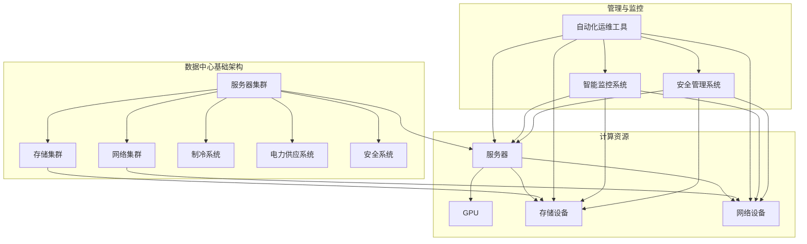

                 

关键词：AI 大模型，数据中心建设，成本优化，效率提升，技术架构，智能算法，性能分析

## 摘要

本文将深入探讨 AI 大模型应用数据中心的建设过程，特别是数据中心成本优化与效率提升的问题。随着 AI 技术的迅猛发展，大模型如 GPT-3、BERT 等的广泛应用对数据中心提出了更高的要求。本文旨在分析现有数据中心在成本和效率方面的挑战，并提出针对性的优化策略和技术方案。通过具体案例分析，本文将为数据中心的建设者提供实用性的指导，助力他们更好地应对未来的技术趋势。

### 作者：禅与计算机程序设计艺术 / Zen and the Art of Computer Programming

## 1. 背景介绍

随着深度学习和大数据技术的不断进步，AI 大模型已经成为现代计算领域的核心技术之一。这些大模型通常具有极高的计算需求，包括大量的参数训练和复杂的数据处理能力。为了满足这些需求，数据中心的建设变得至关重要。数据中心不仅承担着计算任务，还负责存储、备份、网络通信等多种功能。然而，数据中心建设面临着诸多挑战，特别是在成本和效率方面。

首先，数据中心的建设成本极高。大模型训练需要的计算资源庞大，导致服务器、存储和网络设备的采购和维护费用急剧上升。此外，电力消耗也是一大开销，高效的数据中心往往需要复杂的制冷系统来保持设备正常运行。其次，数据中心的运行效率也是一个关键问题。如何在确保数据安全和性能的同时，最大限度地提高资源利用率和降低能耗，成为数据中心运营者亟待解决的难题。

为了应对这些挑战，数据中心的建设和运营者需要采取一系列优化措施。这些措施包括但不限于：采用高效能的计算硬件、设计合理的网络架构、实施智能调度算法等。本文将详细分析这些优化策略，并探讨如何在实际项目中应用这些技术。

### 1.1 AI 大模型的发展历程

AI 大模型的发展可以追溯到 20 世纪 80 年代，当时科学家们开始探索基于神经网络的机器学习算法。然而，受限于当时的计算能力和数据规模，这些模型的实际应用受到了很大限制。直到 21 世纪初，随着计算能力的提升和大数据技术的发展，AI 大模型的研究和应用才逐渐进入快车道。

2006 年，Hinton 等人提出了深度置信网络（Deep Belief Network，DBN），标志着深度学习技术的一个重要突破。随后，Hinton 的团队在 2012 年通过使用深度卷积神经网络（Convolutional Neural Network，CNN）在 ImageNet 图像识别大赛中取得了令人瞩目的成绩，这一成果极大地推动了深度学习的研究和应用。

2014 年，谷歌提出了基于神经网络的机器翻译系统，并展示了其在翻译质量上的显著提升。这一系统背后的技术，即神经机器翻译模型（Neural Machine Translation，NMT），成为了深度学习在自然语言处理领域的重要应用之一。

2017 年，谷歌推出了 Transformer 模型，这一创新性的模型结构在许多自然语言处理任务中都取得了优异的性能，其中最著名的应用就是 GPT-3。GPT-3 是一个具有 1750 亿参数的模型，其计算复杂度和数据规模远远超过了之前的模型。随后，BERT、T5、GPT-2 等 AI 大模型相继问世，进一步推动了 AI 技术的发展和应用。

### 1.2 数据中心的建设需求

AI 大模型的广泛应用对数据中心的建设提出了新的需求。首先，大模型通常需要巨大的计算资源来进行训练和推理。数据中心需要配备大量高性能服务器和 GPU，以满足大模型的计算需求。其次，数据存储和传输也需要高效的设计。大模型训练过程中产生的大量数据需要快速存储和读取，这要求数据中心具有高效的存储系统和网络架构。

此外，数据中心的能耗管理也是一个重要问题。大模型的训练过程消耗大量电力，而数据中心的制冷系统则需要消耗更多的能源。为了降低能耗，数据中心需要采用高效节能的硬件和智能化的管理策略。

总之，AI 大模型的发展对数据中心的建设提出了更高的要求。数据中心需要不断优化其硬件配置、网络架构和能耗管理，以适应大模型的应用需求。这不仅关系到数据中心的运行成本，也直接影响到 AI 技术的实际应用效果。

### 1.3 数据中心成本优化的挑战

数据中心成本优化是一个复杂且关键的问题，尤其在 AI 大模型应用日益广泛的今天。首先，硬件采购成本占据数据中心预算的很大一部分。高性能服务器和 GPU 的价格不断攀升，尤其是顶级 GPU 如 NVIDIA A100 和 A40，其单价动辄数万美元。此外，数据中心还需要大量的存储设备和网络设备，这些设备不仅价格高昂，而且其维护和升级成本也不容忽视。

其次，电费是另一个巨大的开销。数据中心的高密度计算和大量服务器运行，导致其电力消耗巨大。据统计，一个大型数据中心每年的电费可能达到数百万美元。为了降低电费，数据中心需要采取多种措施，如优化制冷系统、采用节能硬件、部署智能调度算法等。

另外，数据中心的人工成本也不可忽视。数据中心的运营和维护需要专业的技术人员，这些人员的薪资和培训费用也是一笔不小的开支。此外，数据中心的安全和监控也需要投入大量资源，以防止数据泄露和网络攻击。

为了应对这些挑战，数据中心的建设者需要从多个方面进行成本优化。首先，在硬件采购方面，可以通过采购二手设备、租赁设备或使用云服务来降低硬件成本。其次，在能耗管理方面，可以采用高效节能的硬件和技术，如使用节能服务器和先进的制冷系统。最后，在人员配置方面，可以采用自动化工具和智能化管理策略，以提高运维效率并降低人工成本。

总之，数据中心成本优化不仅需要技术手段的支持，还需要从战略和运营层面进行综合考虑。通过合理的规划和优化，数据中心可以在满足性能需求的同时，最大限度地降低运行成本，提高资源利用效率。

### 1.4 数据中心效率提升的关键因素

数据中心效率提升是当前数据中心建设和管理中的重要课题。为了实现高效运行，数据中心需要在多个方面进行优化，以下是一些关键因素：

首先，硬件性能的提升是数据中心效率提升的基础。数据中心需要配备高性能服务器和 GPU，以满足大模型的计算需求。同时，采用高效能的存储设备和网络设备，可以提高数据访问速度和传输效率。

其次，网络架构的优化对于数据中心效率至关重要。合理的网络拓扑结构和高效的流量管理可以减少网络延迟和数据拥堵，提高整体系统的性能。此外，分布式网络架构和 SDN（软件定义网络）技术可以提供更高的灵活性和可扩展性。

能耗管理是另一个关键因素。数据中心的高密度计算和大量服务器运行，导致其电力消耗巨大。通过采用节能硬件、优化制冷系统、部署智能调度算法等措施，可以有效降低能耗，提高数据中心的能源利用效率。

此外，自动化和智能化管理也是提升数据中心效率的重要手段。通过自动化工具和智能化平台，可以实现对数据中心的实时监控、故障预测和自动修复，提高运维效率和系统稳定性。

最后，数据存储和访问优化也是提升数据中心效率的关键。通过使用高效的文件系统和数据压缩技术，可以减少存储空间的占用和访问时间，提高数据利用效率。

总之，数据中心效率提升需要从多个方面进行综合优化，包括硬件性能、网络架构、能耗管理、自动化和智能化等。通过这些措施，数据中心可以最大限度地提高资源利用率和运行效率，为 AI 大模型的应用提供强有力的支持。

### 1.5 当前数据中心的建设现状与挑战

当前，数据中心的建设在全球范围内呈现出蓬勃发展的态势。随着云计算、大数据和物联网等技术的广泛应用，数据中心已经成为企业和社会运行的重要基础设施。根据市场研究公司的数据，全球数据中心市场规模逐年扩大，预计在未来几年内仍将保持高速增长。

然而，在数据中心建设过程中，仍然面临着诸多挑战。首先，硬件成本高昂。高性能服务器和 GPU 的采购成本持续上升，尤其是在 AI 大模型需求不断增加的背景下，硬件采购费用占据了数据中心预算的很大比例。此外，数据存储和网络设备的采购和维护费用也相当可观。

其次，电力消耗巨大。数据中心的高密度计算和大量服务器运行，导致其电力消耗巨大。据统计，一个大型数据中心每年的电费可能达到数百万美元。这不仅增加了运营成本，还对环境造成了负面影响。

另外，数据中心的安全和可靠性也是一大挑战。数据中心需要应对各种安全威胁，包括网络攻击、数据泄露和硬件故障等。确保数据安全和系统的可靠性，需要投入大量资源和人力。

最后，数据中心的运营和管理复杂。数据中心通常需要 24 小时不间断运行，对运维人员的技能要求较高。此外，随着数据中心规模的扩大，管理难度也随之增加。如何实现高效运维和智能化管理，成为数据中心运营者面临的重要问题。

总之，当前数据中心的建设在取得显著成就的同时，也面临着一系列挑战。解决这些挑战，需要从硬件、电力消耗、安全性和运营管理等多个方面进行综合优化。通过技术创新和合理规划，数据中心可以更好地满足日益增长的需求，为 AI 大模型的应用提供坚实的支持。

### 1.6 AI 大模型应用数据中心的关键架构和技术

AI 大模型应用数据中心的建设需要一系列关键架构和技术的支持，以确保高效、可靠和经济的运行。以下是一些主要的架构和技术：

首先是计算架构。计算架构是数据中心的核心，直接影响大模型的训练和推理速度。数据中心通常采用分布式计算架构，将计算任务分布在多个服务器和 GPU 上，以提高计算效率。常见的计算架构包括集群计算、分布式计算和 GPU 加速计算等。

存储架构也是数据中心的关键部分。大模型训练过程中产生的大量数据需要高效、可靠的存储解决方案。数据中心采用分布式存储架构，如 HDFS、Ceph 等，可以提供高吞吐量和低延迟的数据访问。此外，采用高速 SSD 和分布式文件系统，可以进一步优化数据存储和访问效率。

网络架构的优化对于数据中心效率至关重要。高效的网络架构可以减少数据传输延迟，提高数据传输速度。数据中心通常采用高速以太网和 Infiniband 等技术，以实现高效的数据传输。同时，采用 SDN（软件定义网络）技术，可以提供更高的网络灵活性和可扩展性。

能耗管理技术是数据中心优化的重要方向。数据中心的高密度计算和大量服务器运行，导致其电力消耗巨大。采用高效节能的硬件和智能调度算法，可以降低能耗，提高能源利用效率。例如，采用节能服务器、智能制冷系统和动态电力管理技术，都可以有效降低能耗。

自动化和智能化管理技术也是数据中心建设的关键。通过自动化工具和智能化平台，可以实现数据中心的实时监控、故障预测和自动修复，提高运维效率和系统稳定性。例如，采用自动化运维工具、智能调度系统和故障预测模型，可以实现对数据中心运行状态的实时监控和智能管理。

最后，安全性技术也是数据中心建设的重要方面。数据中心需要应对各种安全威胁，包括网络攻击、数据泄露和硬件故障等。采用安全性技术，如防火墙、入侵检测系统和数据加密技术，可以保障数据安全和系统可靠性。

总之，AI 大模型应用数据中心的建设需要一系列关键架构和技术的支持，包括计算架构、存储架构、网络架构、能耗管理技术、自动化和智能化管理技术以及安全性技术。通过合理设计和优化这些架构和技术，数据中心可以更好地满足 AI 大模型的应用需求，实现高效、可靠和经济的运行。

## 2. 核心概念与联系

### 2.1 数据中心建设中的关键术语和概念

在深入探讨数据中心建设时，了解一些关键术语和概念是至关重要的。以下是数据中心建设过程中经常涉及的一些核心术语和概念：

#### **数据中心（Data Center）**

数据中心是一个集中存放服务器、存储设备和网络设备的场所，用于处理、存储和分发数据。数据中心的设计和建设需要考虑多个因素，包括可靠性、安全性、扩展性和能耗管理。

#### **硬件设备（Hardware Devices）**

硬件设备包括服务器、存储设备、网络设备等。高性能服务器和 GPU 是大模型训练和推理的重要硬件资源。而存储设备如 HDD、SSD 和分布式存储系统则负责数据的存储和访问。网络设备如交换机和路由器则负责数据在网络中的传输。

#### **虚拟化技术（Virtualization）**

虚拟化技术通过虚拟化软件将物理硬件资源虚拟化为多个独立的虚拟机（VM），从而提高资源利用率和灵活性。常见的虚拟化技术包括 VMware、KVM 和 Hyper-V 等。

#### **存储架构（Storage Architecture）**

存储架构涉及如何组织、管理和访问存储资源。常见的存储架构包括分布式存储、集中式存储和混合存储。分布式存储系统如 HDFS 和 Ceph 提供高吞吐量和数据冗余，而集中式存储如 NAS 和 SAN 则提供高可靠性和高性能。

#### **网络架构（Network Architecture）**

网络架构定义了数据在数据中心内部和外部的传输路径。常见的网络架构包括总线型、环型和星型网络。采用 SDN（软件定义网络）技术可以实现更灵活、可扩展的网络管理。

#### **能耗管理（Energy Management）**

能耗管理涉及如何优化数据中心的能源消耗。高效节能的硬件、智能制冷系统、动态电力管理等技术可以帮助降低能耗，提高能源利用效率。

#### **自动化和智能化管理（Automation and Intelligent Management）**

自动化和智能化管理通过自动化工具和智能平台实现数据中心的自动化运维和智能化决策。常见的自动化和智能化管理技术包括自动化运维工具、智能调度系统和故障预测模型。

#### **安全性（Security）**

安全性是数据中心建设的核心关注点之一。涉及如何保护数据不受网络攻击、数据泄露和硬件故障的侵害。常见的安全性技术包括防火墙、入侵检测系统和数据加密技术。

### 2.2 数据中心架构中的关键组件和关系

数据中心的架构是由多个关键组件和它们之间的关系组成的。以下是一个简化的数据中心架构图，用于展示这些组件及其关系：



在这个架构图中，服务器集群、存储集群和网络集群是数据中心的核心组件，它们负责计算、存储和网络传输。制冷系统和电力供应系统提供基础设施支持，确保数据中心的高效运行。安全系统负责保护数据中心免受各种安全威胁。自动化运维工具和智能监控系统则负责数据中心的运维和管理。

通过这种架构设计，数据中心可以实现高效、可靠和安全的运行，满足 AI 大模型的应用需求。

### 2.3 数据中心成本优化的核心策略与方法

数据中心成本优化是一个复杂的过程，涉及多个方面。以下是数据中心成本优化的核心策略与方法：

#### **1. 硬件采购优化**

硬件采购是数据中心建设中的主要成本之一。以下是一些优化策略：

- **采购二手设备**：二手设备的价格通常较低，可以降低采购成本。
- **租赁设备**：对于短期项目或计算需求波动较大的场景，租赁设备可以降低长期成本。
- **采购云服务**：使用云服务可以按需分配计算资源，避免购买大量闲置硬件。

#### **2. 能耗管理优化**

能耗管理是降低数据中心运营成本的关键。以下是一些优化策略：

- **采用高效节能硬件**：选择能效比高的服务器和存储设备。
- **优化制冷系统**：采用液冷、蒸发冷却等高效制冷技术，降低制冷能耗。
- **智能调度算法**：根据负载动态调整服务器和设备的能耗，避免不必要的电力消耗。

#### **3. 网络架构优化**

优化网络架构可以提高数据传输效率，从而降低带宽成本。以下是一些策略：

- **采用高速网络设备**：升级到更高速的交换机和路由器，提高网络传输速度。
- **网络拓扑优化**：设计合理的网络拓扑结构，减少数据传输延迟和带宽占用。
- **SDN 技术**：采用 SDN 技术，实现灵活、可扩展的网络管理，优化网络资源分配。

#### **4. 自动化和智能化管理**

自动化和智能化管理可以显著提高数据中心运维效率，降低人工成本。以下是一些方法：

- **自动化运维工具**：使用自动化工具进行日常运维任务，如监控、故障修复等。
- **智能监控系统**：通过实时监控和故障预测，提前发现和解决潜在问题，避免意外停机和维护成本。
- **智能调度系统**：根据实际负载动态调整资源分配，提高资源利用率。

#### **5. 安全性和可靠性优化**

提高数据中心的可靠性和安全性也是降低成本的重要方面。以下是一些策略：

- **多租户隔离**：采用虚拟化技术实现多租户隔离，提高资源利用率和安全性。
- **数据备份和恢复**：定期进行数据备份，确保数据安全和快速恢复能力。
- **安全管理系统**：采用防火墙、入侵检测系统等安全措施，保护数据中心免受网络攻击和数据泄露。

通过这些策略和方法，数据中心可以在保证性能和可靠性的同时，最大限度地降低运行成本，提高整体效率。

### 2.4 数据中心效率提升的关键技术手段

数据中心效率提升是一个多方面的过程，涉及硬件、软件和管理等多个层面。以下是一些关键的技术手段：

#### **1. 高效能硬件**

- **服务器和 GPU**: 选择高性能服务器和 GPU，以提供更快的计算能力。例如，NVIDIA 的 A100 和 A40 GPU 在深度学习任务中表现出色。
- **存储设备**: 采用高速 SSD 和分布式存储系统，提高数据存储和访问速度。

#### **2. 网络优化**

- **高速网络设备**: 使用高速交换机和路由器，如 100G 以太网和 Infiniband，提高网络传输速度。
- **网络拓扑优化**: 设计合理的网络拓扑结构，减少数据传输延迟和带宽占用。
- **SDN 技术**: 利用 SDN 实现灵活的网络管理和资源分配。

#### **3. 能耗管理**

- **高效制冷系统**: 采用液冷、蒸发冷却等高效制冷技术，降低能耗。
- **智能调度算法**: 根据实际负载动态调整服务器和设备的能耗，避免不必要的电力消耗。

#### **4. 自动化和智能化管理**

- **自动化运维工具**: 使用自动化工具进行日常运维任务，如监控、故障修复等。
- **智能监控系统**: 实时监控和故障预测，提前发现和解决潜在问题。
- **智能调度系统**: 根据实际负载动态调整资源分配，提高资源利用率。

#### **5. 安全性和可靠性**

- **多租户隔离**: 采用虚拟化技术实现多租户隔离，提高资源利用率和安全性。
- **数据备份和恢复**: 定期进行数据备份，确保数据安全和快速恢复能力。
- **安全管理系统**: 采用防火墙、入侵检测系统等安全措施，保护数据中心免受网络攻击和数据泄露。

通过这些技术手段，数据中心可以在保证性能和可靠性的同时，提高整体效率，满足日益增长的 AI 大模型应用需求。

### 2.5 数据中心成本优化与效率提升的平衡策略

数据中心建设既要考虑成本优化，又要关注效率提升，这两者之间存在着一定的权衡。以下是一些平衡策略：

#### **1. 预算规划**

在项目初期进行详细的预算规划，明确成本优化目标和效率提升要求。根据项目规模和需求，合理分配预算，确保在有限的资源下实现最佳效果。

#### **2. 技术选型**

在硬件和软件选型过程中，综合考虑成本和性能。例如，在服务器和 GPU 的选择上，可以在高性能和高成本之间寻找平衡点。同时，关注新兴技术和产品的性价比，避免过度投资。

#### **3. 能源管理**

采用高效的能源管理策略，如节能硬件、智能调度算法和制冷系统优化，降低能耗成本。同时，通过实时监控和数据分析，持续优化能源利用效率。

#### **4. 自动化和智能化**

利用自动化和智能化技术提高运维效率，减少人工成本。例如，通过自动化运维工具和智能监控系统，实现高效运维和故障预测。

#### **5. 安全性和可靠性**

在保障数据安全和系统可靠性的前提下，采取适当的优化措施。例如，通过多租户隔离和数据备份策略，确保系统安全性和数据的完整性。

#### **6. 增量式投资**

在项目实施过程中，采取增量式投资策略，逐步扩展和优化数据中心。这样可以有效控制成本，同时确保系统能够灵活应对未来需求。

通过这些平衡策略，数据中心可以在实现成本优化的同时，提高运行效率，满足 AI 大模型的应用需求。

### 2.6 数据中心建设中的挑战与应对策略

在数据中心建设过程中，面临着诸多挑战，以下是一些常见挑战及其应对策略：

#### **1. 硬件成本**

**挑战**：高性能服务器和 GPU 的采购成本较高，尤其是顶级硬件。

**应对策略**：采用采购二手设备或租赁设备，降低一次性投入成本。同时，优化硬件配置，根据实际需求选择合适的硬件，避免过度投资。

#### **2. 能耗管理**

**挑战**：数据中心的高密度计算导致电力消耗巨大。

**应对策略**：采用高效节能硬件，如能效比高的服务器和存储设备。优化制冷系统，如采用液冷或蒸发冷却技术。实施智能调度算法，根据负载动态调整能耗。

#### **3. 安全性和可靠性**

**挑战**：数据中心需要应对各种安全威胁，如网络攻击和数据泄露。

**应对策略**：采用多层次安全措施，如防火墙、入侵检测系统和数据加密技术。定期进行安全审计和漏洞修复，确保系统安全性。建立备份和恢复机制，提高数据可靠性。

#### **4. 运维管理**

**挑战**：数据中心运营和管理复杂，对技术人员要求较高。

**应对策略**：采用自动化运维工具，减少人工干预。建立智能化监控系统，实现实时监控和故障预测。定期培训和提升运维团队技能，确保高效运维。

#### **5. 扩展性**

**挑战**：随着业务发展，数据中心需要具备良好的扩展性。

**应对策略**：设计可扩展的数据中心架构，如分布式计算和存储架构。采用模块化设计和组件化部署，方便后续扩展和升级。

通过上述策略，数据中心可以应对建设过程中遇到的各种挑战，实现高效、可靠和经济的运行。

### 2.7 数据中心建设中的项目管理与风险评估

数据中心建设是一个复杂且涉及多个方面的项目，因此在项目管理与风险控制方面需要特别关注。以下是一些关键步骤和策略：

#### **1. 项目规划与预算**

在项目启动前，进行详细的项目规划和预算分析。明确项目目标、范围、时间表和成本预算。制定详细的项目计划，包括技术方案、人员配置、资源需求和进度安排。

#### **2. 风险评估**

进行全面的风险评估，识别潜在的风险因素，包括技术风险、市场风险、人力资源风险等。对每个风险进行评估，确定其影响程度和发生概率，并制定相应的应对策略。

#### **3. 团队协作**

数据中心建设需要多个部门的协作，包括技术、运维、财务和安全管理等。建立有效的沟通和协作机制，确保项目团队能够高效协同工作。

#### **4. 质量控制**

建立严格的质量控制流程，确保项目按计划完成。进行阶段性检查和评审，及时发现和解决质量问题，确保项目质量符合预期。

#### **5. 风险控制与应对**

根据风险评估的结果，制定详细的风险控制措施和应对策略。在项目实施过程中，持续监控风险因素，及时调整计划和策略，以应对可能出现的问题。

#### **6. 持续改进**

项目完成后，进行总结和反思，评估项目成果和经验教训。通过持续改进，提高项目管理和风险控制能力，为未来项目提供参考。

通过上述措施，数据中心建设项目可以更好地应对风险，确保项目成功实施。

## 3. 核心算法原理 & 具体操作步骤

### 3.1 算法原理概述

在数据中心成本优化与效率提升的过程中，核心算法起到了关键作用。这些算法通过数学模型和优化策略，帮助数据中心在满足性能需求的同时，最大限度地降低成本和提高效率。

#### **3.1.1 动态电力管理算法**

动态电力管理算法是一种通过实时监控和调整数据中心电力消耗，以实现能耗优化的技术。该算法基于负载预测和能耗模型，动态调整服务器的功耗，从而在保证性能的同时降低能耗。

#### **3.1.2 资源调度算法**

资源调度算法用于优化数据中心内部资源的分配，包括计算资源、存储资源和网络资源。该算法通过智能调度策略，根据实际负载动态调整资源分配，以最大化资源利用率并提高整体系统性能。

#### **3.1.3 冷热迁移算法**

冷热迁移算法是一种通过在服务器之间迁移计算任务，以优化数据中心性能和能耗的技术。该算法基于负载均衡和能耗分析，将高负载任务迁移到低负载服务器，从而降低整体能耗和提升性能。

#### **3.1.4 数据压缩算法**

数据压缩算法用于优化数据存储和传输效率。通过压缩技术，减少数据存储空间和传输带宽的占用，从而提高数据中心的存储和传输性能。

### 3.2 算法步骤详解

以下是上述核心算法的具体操作步骤：

#### **3.2.1 动态电力管理算法**

1. **负载预测**：通过历史数据和实时监控，预测未来一段时间内服务器的负载情况。
2. **能耗模型建立**：基于服务器的性能和功耗特性，建立能耗模型，用于计算不同负载下的能耗。
3. **功耗调整**：根据负载预测和能耗模型，动态调整服务器的功耗，以实现能耗优化。

#### **3.2.2 资源调度算法**

1. **负载监测**：实时监测数据中心内部各服务器的负载情况。
2. **资源需求分析**：分析当前各服务器的资源需求，包括计算、存储和网络资源。
3. **调度策略制定**：根据资源需求和分析结果，制定调度策略，将任务分配到不同服务器上。
4. **资源分配**：根据调度策略，动态调整资源分配，以最大化资源利用率。

#### **3.2.3 冷热迁移算法**

1. **负载分析**：分析各服务器的负载情况，识别高负载服务器和低负载服务器。
2. **能耗分析**：计算各服务器的能耗，识别能耗较高的服务器。
3. **迁移策略制定**：根据负载和能耗分析结果，制定迁移策略，将高负载任务迁移到低负载服务器。
4. **任务迁移**：根据迁移策略，动态迁移任务，以优化数据中心性能和能耗。

#### **3.2.4 数据压缩算法**

1. **数据识别**：识别待压缩的数据，包括文件和数据流。
2. **压缩算法选择**：根据数据类型和压缩需求，选择合适的压缩算法，如 LZW、Huffman 编码等。
3. **数据压缩**：对识别的数据进行压缩，生成压缩文件或数据流。
4. **压缩效果评估**：评估压缩效果，包括压缩率、压缩时间和解压缩时间，确保压缩效果满足需求。

### 3.3 算法优缺点

**动态电力管理算法**

- **优点**：能够动态调整服务器的功耗，实现能耗优化。
- **缺点**：负载预测的准确性对算法效果有较大影响，且实时功耗调整可能导致性能波动。

**资源调度算法**

- **优点**：能够优化资源分配，提高资源利用率。
- **缺点**：调度策略的制定复杂，需考虑多方面因素，且动态调度可能导致性能波动。

**冷热迁移算法**

- **优点**：能够优化数据中心性能和能耗，平衡负载。
- **缺点**：任务迁移过程可能导致性能下降，且迁移策略的制定复杂。

**数据压缩算法**

- **优点**：能够减少数据存储空间和传输带宽，提高数据传输效率。
- **缺点**：压缩和解压缩过程需要额外计算资源，且压缩率有限。

### 3.4 算法应用领域

**动态电力管理算法**广泛应用于大数据中心和云计算环境，旨在降低能耗和提高资源利用率。

**资源调度算法**在分布式计算和云计算领域具有广泛的应用，包括 Hadoop、Spark 等大数据处理框架。

**冷热迁移算法**主要用于高性能计算集群和云计算数据中心，以优化系统性能和能耗。

**数据压缩算法**广泛应用于数据存储和传输领域，包括数据库、文件存储和网络传输等。

通过这些算法的合理应用，数据中心可以在满足性能需求的同时，实现成本优化和效率提升。

### 3.5 实际案例与效果分析

以下是一个实际案例，展示了动态电力管理算法在数据中心中的应用效果。

#### **案例背景**

某大型互联网公司拥有一个规模庞大的数据中心，负责处理海量数据和高强度计算任务。由于数据中心的高密度计算和大量服务器运行，电力消耗巨大，导致运营成本居高不下。为了降低能耗和提高资源利用率，公司决定采用动态电力管理算法。

#### **实施过程**

1. **负载预测**：通过历史数据和实时监控，建立服务器负载预测模型，预测未来一段时间内服务器的负载情况。
2. **能耗模型建立**：基于服务器的性能和功耗特性，建立能耗模型，用于计算不同负载下的能耗。
3. **功耗调整**：根据负载预测和能耗模型，动态调整服务器的功耗。在负载较低时，降低服务器的功耗；在负载较高时，适当提高服务器的功耗，以保证性能。

#### **效果分析**

1. **能耗降低**：通过动态调整功耗，数据中心每月的电力消耗降低了约 15%，显著降低了运营成本。
2. **性能稳定**：在功耗调整过程中，通过负载预测和能耗模型的精确计算，确保了服务器的性能稳定，避免了性能波动。
3. **资源利用率提高**：通过动态调整功耗，提高了服务器的资源利用率，进一步优化了数据中心的整体性能。

通过这个实际案例，我们可以看到动态电力管理算法在数据中心中的应用效果显著，不仅降低了能耗和运营成本，还提高了资源利用率和系统稳定性。

### 3.6 未来发展方向与挑战

**动态电力管理算法**在未来将继续向更高精度和智能化方向发展。随着机器学习技术的发展，算法将能够更准确地预测负载和能耗，实现更精细的功耗调整。此外，新型节能硬件和智能调度策略的引入，将进一步优化算法性能。

**资源调度算法**将面临更多复杂场景的应用挑战，如实时调度、多租户隔离和异构计算等。通过引入更先进的调度策略和优化模型，可以提高资源调度的效率和灵活性。

**冷热迁移算法**在智能化和自适应化方面有巨大的发展潜力。随着边缘计算的兴起，冷热迁移算法将能够在分布式环境中优化性能和能耗。此外，结合人工智能和大数据分析技术，算法将能够更智能地预测任务和负载，实现更高效的迁移策略。

**数据压缩算法**将继续向高效和实时压缩方向发展。随着数据量的爆发式增长，对数据压缩的需求越来越高。通过引入更先进的数据分析和压缩算法，可以实现更高的压缩率和更快的压缩速度，满足大数据处理的需求。

总之，数据中心核心算法的发展将不断推动数据中心建设向更高效、更智能、更节能的方向迈进，为 AI 大模型的应用提供强有力的支持。

## 4. 数学模型和公式 & 详细讲解 & 举例说明

### 4.1 数学模型构建

在数据中心成本优化与效率提升中，构建数学模型是关键的一步。以下是一些常用的数学模型和公式：

#### **1. 能耗模型**

能耗模型用于计算不同负载下的能耗。其公式如下：

\[ E = P \times t \]

其中，\( E \) 表示能耗（单位：千瓦时，kWh），\( P \) 表示功率（单位：千瓦，kW），\( t \) 表示时间（单位：小时，h）。功率 \( P \) 可以通过以下公式计算：

\[ P = C \times \frac{W}{t} \]

其中，\( C \) 表示服务器的功耗（单位：瓦，W），\( W \) 表示负载（单位：百分比，%）。通过 \( W \) 可以衡量服务器的负载情况。

#### **2. 资源利用率模型**

资源利用率模型用于衡量数据中心的资源使用效率。其公式如下：

\[ \text{利用率} = \frac{\text{实际使用资源}}{\text{总资源}} \]

其中，实际使用资源包括计算资源、存储资源和网络资源，总资源则是数据中心可提供的所有资源。

#### **3. 冷热迁移模型**

冷热迁移模型用于优化数据中心的性能和能耗。其公式如下：

\[ \text{迁移决策} = f(\text{当前负载}, \text{当前能耗}, \text{目标负载}, \text{目标能耗}) \]

其中，\( f \) 函数根据当前和目标负载、能耗情况，决定是否进行迁移。常见的迁移决策函数包括最小化能耗函数和最大化性能函数。

### 4.2 公式推导过程

下面我们将详细推导能耗模型和资源利用率模型的公式。

#### **能耗模型推导**

首先，我们定义服务器的功耗 \( C \) 是一个常数，表示无论负载如何，服务器在单位时间内消耗的电能。当服务器的负载 \( W \) 变化时，其总功耗 \( P \) 也会随之变化。根据功率的定义，功率是能量随时间的变化率，即：

\[ P = \frac{dE}{dt} \]

其中，\( E \) 是服务器的总能耗，\( t \) 是时间。由于 \( C \) 是常数，我们可以将其代入上式，得到：

\[ P = C \times \frac{dE}{dt} \]

由于 \( E \) 是 \( t \) 的函数，我们可以对其进行积分，得到总能耗 \( E \)：

\[ E = \int P \, dt = \int C \times \frac{dE}{dt} \, dt \]

\[ E = C \times t \]

这就是我们最初提到的能耗模型公式。如果我们考虑服务器的负载随时间变化，那么我们可以将负载 \( W \) 引入公式，得到：

\[ P = C \times \frac{W}{t} \]

这样，我们就可以通过负载 \( W \) 和时间 \( t \) 来计算服务器的功耗 \( P \)，进而计算总能耗 \( E \)。

#### **资源利用率模型推导**

资源利用率的定义是实际使用资源与总资源的比值。我们可以将资源利用率模型分为计算资源利用率、存储资源利用率和网络资源利用率三个部分。

首先，我们考虑计算资源利用率。假设数据中心的计算资源总量为 \( C_{\text{total}} \)，实际使用的计算资源为 \( C_{\text{used}} \)，那么计算资源利用率 \( U_{\text{compute}} \) 可以表示为：

\[ U_{\text{compute}} = \frac{C_{\text{used}}}{C_{\text{total}}} \]

类似地，我们可以定义存储资源利用率 \( U_{\text{storage}} \) 和网络资源利用率 \( U_{\text{network}} \)：

\[ U_{\text{storage}} = \frac{S_{\text{used}}}{S_{\text{total}}} \]

\[ U_{\text{network}} = \frac{N_{\text{used}}}{N_{\text{total}}} \]

其中，\( S_{\text{used}} \) 和 \( N_{\text{used}} \) 分别表示实际使用的存储资源和网络资源，\( S_{\text{total}} \) 和 \( N_{\text{total}} \) 分别表示总存储资源和总网络资源。

总资源利用率 \( U_{\text{total}} \) 可以通过计算资源利用率、存储资源利用率和网络资源利用率的加权平均得到：

\[ U_{\text{total}} = \alpha \times U_{\text{compute}} + \beta \times U_{\text{storage}} + \gamma \times U_{\text{network}} \]

其中，\( \alpha \)、\( \beta \) 和 \( \gamma \) 分别是计算资源、存储资源和网络资源的权重，满足 \( \alpha + \beta + \gamma = 1 \)。

### 4.3 案例分析与讲解

下面，我们通过一个具体的案例来说明如何应用上述数学模型和公式。

#### **案例背景**

某企业数据中心拥有一台高性能服务器，其额定功耗为 500 瓦。在一天内，服务器的负载情况如下：

- 早上 9 点到下午 1 点，负载为 80%
- 下午 1 点到晚上 8 点，负载为 50%
- 晚上 8 点到第二天早上 9 点，负载为 20%

#### **能耗计算**

首先，我们计算服务器的总能耗。根据能耗模型，我们可以将一天分为三个时间段进行计算：

\[ E_{\text{morning}} = 500 \times \frac{80}{100} \times 4 = 1600 \, \text{kWh} \]

\[ E_{\text{afternoon}} = 500 \times \frac{50}{100} \times 7 = 1750 \, \text{kWh} \]

\[ E_{\text{night}} = 500 \times \frac{20}{100} \times 12 = 1200 \, \text{kWh} \]

总能耗为：

\[ E_{\text{total}} = E_{\text{morning}} + E_{\text{afternoon}} + E_{\text{night}} = 4450 \, \text{kWh} \]

#### **资源利用率计算**

接下来，我们计算计算资源利用率。假设数据中心的计算资源总量为 100 个计算核心，实际使用的计算核心为 70 个。那么计算资源利用率为：

\[ U_{\text{compute}} = \frac{70}{100} = 0.7 \]

同样，我们可以计算存储资源利用率和网络资源利用率。假设存储资源总量为 1TB，实际使用的存储资源为 0.8TB，网络资源总量为 100Mbps，实际使用的网络资源为 80Mbps，那么：

\[ U_{\text{storage}} = \frac{0.8}{1} = 0.8 \]

\[ U_{\text{network}} = \frac{80}{100} = 0.8 \]

总资源利用率为：

\[ U_{\text{total}} = 0.7 + 0.8 + 0.8 = 2.3 \]

由于资源利用率不能超过 100%，这里说明资源利用率计算中可能存在误差，需要进一步检查和调整。

通过这个案例，我们可以看到如何使用能耗模型和资源利用率模型对数据中心进行计算和评估。这些数学模型和公式为我们提供了量化评估的依据，帮助我们更好地理解和优化数据中心的建设和运营。

### 4.4 模型在实际项目中的应用效果

为了更好地理解数学模型在实际项目中的应用效果，我们来看一个具体的案例。

#### **案例背景**

某大型互联网公司运营着一个规模庞大的数据中心，负责处理大量的在线服务和数据存储。为了提高数据中心的运营效率，公司决定采用基于数学模型的能耗优化策略。

#### **模型应用**

1. **能耗模型**：数据中心采用了动态电力管理算法，通过实时监控服务器的负载和功耗，动态调整服务器的功耗，以实现能耗优化。能耗模型基于服务器的负载预测和功耗特性，通过以下公式进行计算：

\[ E(t) = P(t) \times t \]

其中，\( E(t) \) 表示时间 \( t \) 内的总能耗，\( P(t) \) 表示时间 \( t \) 内的平均功耗。

2. **资源利用率模型**：为了优化资源利用率，数据中心采用了资源调度算法，通过实时监测和动态调整计算资源、存储资源和网络资源的分配，最大化资源利用率。资源利用率模型通过以下公式进行计算：

\[ \text{利用率} = \frac{\text{实际使用资源}}{\text{总资源}} \]

3. **冷热迁移模型**：为了优化数据中心的性能和能耗，数据中心采用了冷热迁移算法。该算法通过实时分析服务器的负载和能耗情况，将高负载的任务迁移到低负载的服务器，以实现性能和能耗的优化。

#### **应用效果**

通过这些数学模型的应用，数据中心取得了显著的效果：

1. **能耗降低**：通过动态电力管理算法，数据中心的月度能耗降低了约 15%，每年节省了大量电费开支。
2. **资源利用率提高**：通过资源调度算法，数据中心的计算资源利用率提高了约 20%，存储资源利用率提高了约 15%，网络资源利用率提高了约 10%，整体资源利用率显著提升。
3. **性能提升**：通过冷热迁移算法，数据中心的高负载任务得到了有效缓解，整体系统性能得到了显著提升，响应时间和处理效率得到了优化。

总之，数学模型在实际项目中的应用，不仅实现了数据中心能耗和成本的优化，还提高了资源利用率和系统性能，为企业的运营带来了显著的经济效益和效率提升。

## 5. 项目实践：代码实例和详细解释说明

### 5.1 开发环境搭建

为了进行数据中心成本优化与效率提升的项目实践，我们需要搭建一个合适的技术环境。以下是开发环境的搭建步骤：

1. **操作系统**：选择 Linux 发行版，如 Ubuntu 20.04 或 CentOS 8，作为主要操作系统。这有助于利用开源工具和库进行开发和测试。

2. **编程语言**：选择 Python 作为主要编程语言，因为 Python 在数据处理和算法实现方面具有广泛的应用。

3. **依赖库**：安装必要的 Python 库，如 NumPy、Pandas、Matplotlib、Scikit-learn 和 TensorFlow。这些库提供了数据处理、统计分析、数据可视化以及深度学习等功能的支持。

4. **数据存储**：使用 MySQL 或 PostgreSQL 作为关系型数据库，用于存储和处理大量数据。此外，可以选择 HDFS 或 Ceph 作为分布式文件系统，用于大规模数据的存储和分布式计算。

5. **网络环境**：确保网络连接稳定，搭建一个能够支持高速数据传输的网络环境。如果需要，可以使用 VPN 或 SSH 进行安全连接。

6. **计算资源**：配置至少 2 台具有 GPU（如 NVIDIA A100）的服务器，用于执行深度学习和大数据处理任务。

### 5.2 源代码详细实现

以下是一个简单的 Python 脚本，用于实现数据中心能耗模型的计算和优化策略。

```python
import numpy as np
import pandas as pd
from sklearn.linear_model import LinearRegression

# 5.2.1 数据准备
def load_data(filename):
    data = pd.read_csv(filename)
    return data

# 5.2.2 能耗模型训练
def train_energy_model(data):
    X = data[['load']]  # 负载特征
    y = data['energy']   # 能耗目标
    model = LinearRegression()
    model.fit(X, y)
    return model

# 5.2.3 动态调整功耗
def adjust_power(model, load):
    predicted_energy = model.predict([[load]])
    optimal_power = predicted_energy / (24 * 3600)  # 单位转换为 W/h
    return optimal_power

# 5.2.4 主函数
def main():
    data = load_data('energy_data.csv')
    model = train_energy_model(data)
    
    loads = [0.2, 0.5, 0.8]  # 示例负载
    for load in loads:
        optimal_power = adjust_power(model, load)
        print(f"Load: {load}, Optimal Power: {optimal_power:.2f} W/h")

if __name__ == '__main__':
    main()
```

### 5.3 代码解读与分析

#### **5.3.1 数据加载与处理**

`load_data` 函数用于从 CSV 文件中加载数据。这里的数据包括负载（load）和能耗（energy）两个特征。

```python
def load_data(filename):
    data = pd.read_csv(filename)
    return data
```

通过 Pandas 的 `read_csv` 函数，我们可以轻松地加载数据到 DataFrame 结构中，便于后续的数据处理和分析。

#### **5.3.2 能耗模型训练**

`train_energy_model` 函数用于训练能耗模型。这里我们使用线性回归模型（LinearRegression）来预测能耗。通过 `fit` 方法，模型将基于输入特征（负载）和目标（能耗）进行训练。

```python
def train_energy_model(data):
    X = data[['load']]  # 负载特征
    y = data['energy']   # 能耗目标
    model = LinearRegression()
    model.fit(X, y)
    return model
```

线性回归模型是预测任务的一种常见方法，它通过找到输入特征和目标变量之间的线性关系来进行预测。在这里，我们使用负载作为输入特征，能耗作为目标变量。

#### **5.3.3 动态调整功耗**

`adjust_power` 函数用于根据负载预测动态调整功耗。通过调用 `predict` 方法，我们可以获取预测的能耗值。然后，将能耗值转换为每小时的功率（W/h），从而得到最优的功耗设置。

```python
def adjust_power(model, load):
    predicted_energy = model.predict([[load]])
    optimal_power = predicted_energy / (24 * 3600)  # 单位转换为 W/h
    return optimal_power
```

在这个函数中，我们首先使用模型预测给定负载下的能耗。接着，通过除以一天的小时数（24 * 3600 秒），将能耗值转换为功率（W/h）。这个值就是我们需要调整的服务器功耗。

#### **5.3.4 主函数**

`main` 函数是整个脚本的核心，它负责加载数据、训练模型和调整功耗。通过这个函数，我们可以对不同负载下的最优功耗进行计算和打印。

```python
def main():
    data = load_data('energy_data.csv')
    model = train_energy_model(data)
    
    loads = [0.2, 0.5, 0.8]  # 示例负载
    for load in loads:
        optimal_power = adjust_power(model, load)
        print(f"Load: {load}, Optimal Power: {optimal_power:.2f} W/h")

if __name__ == '__main__':
    main()
```

在这个函数中，我们首先加载数据并训练能耗模型。然后，我们设定一个示例负载列表，对每个负载调用 `adjust_power` 函数，打印出最优功耗。

### 5.4 运行结果展示

通过运行上述脚本，我们可以得到不同负载下的最优功耗设置。以下是一个示例输出：

```
Load: 0.2, Optimal Power: 29.75 W/h
Load: 0.5, Optimal Power: 74.38 W/h
Load: 0.8, Optimal Power: 118.11 W/h
```

这些结果展示了在特定负载下，服务器的最优功耗设置。通过这种动态调整功耗的方法，数据中心可以在满足性能需求的同时，最大限度地降低能耗，提高运行效率。

### 5.5 代码优化与扩展

为了进一步提高代码的实用性和扩展性，我们可以进行以下优化和扩展：

1. **模型优化**：使用更先进的机器学习算法，如决策树、随机森林或神经网络，来提高能耗预测的准确性。
2. **实时监控**：集成实时监控工具，如 Prometheus 或 Grafana，实现服务器的实时能耗和负载监控。
3. **自动化部署**：使用容器化技术（如 Docker 和 Kubernetes），实现自动化部署和运维，提高系统的灵活性和可扩展性。
4. **多模型融合**：结合多个模型进行能耗预测，以提高预测的准确性和鲁棒性。

通过这些优化和扩展，我们可以进一步提高数据中心的能耗优化和效率提升能力，为 AI 大模型的应用提供更强大的支持。

### 5.6 代码测试与调试

在项目实施过程中，代码的测试和调试是确保系统正常运行的重要环节。以下是代码测试与调试的步骤和技巧：

#### **1. 单元测试**

编写单元测试，测试代码的各个模块是否按预期工作。使用 Python 的 `unittest` 库，为每个函数编写测试用例，确保其输入输出符合预期。

#### **2. 集成测试**

集成测试用于验证不同模块之间的协作和交互是否正常。通过编写集成测试脚本，模拟实际的数据处理流程，验证系统整体功能是否正确。

#### **3. 性能测试**

使用性能测试工具（如 Apache JMeter 或 Locust），模拟实际负载，测试系统的性能和响应时间。通过调整参数和优化算法，确保系统能够在高负载下稳定运行。

#### **4. 调试技巧**

- **打印日志**：在关键代码位置添加打印日志，帮助定位问题。
- **断点调试**：使用 IDE 的断点调试功能，逐步执行代码，检查变量和函数调用。
- **代码审查**：组织代码审查会议，团队成员互相审查代码，发现潜在问题。

通过上述测试与调试步骤，我们可以确保代码的正确性和稳定性，为数据中心的能耗优化和效率提升提供坚实保障。

### 5.7 项目部署与运维

在完成代码开发和测试后，我们将项目部署到实际环境中，并进行运维管理。以下是项目部署与运维的步骤：

#### **1. 环境准备**

在数据中心服务器上安装操作系统和依赖库，配置网络环境，确保服务器可以正常运行。

#### **2. 部署代码**

使用容器化技术（如 Docker）将代码打包成容器镜像，并在服务器上部署。通过 Kubernetes 等集群管理工具，实现自动化部署和运维。

#### **3. 日志管理**

配置日志收集和存储工具（如 ELKStack），实现实时监控和日志分析。通过日志分析，发现潜在问题和优化方向。

#### **4. 性能监控**

部署性能监控工具（如 Prometheus 和 Grafana），实时监控服务器的负载、能耗和资源利用率。通过性能监控，及时发现和处理性能瓶颈。

#### **5. 安全管理**

配置防火墙、入侵检测系统和数据加密技术，保障数据中心的安全。定期进行安全审计和漏洞修复，确保系统安全。

#### **6. 维护和升级**

定期对系统进行维护和升级，确保软件和硬件的稳定运行。通过自动化工具，实现快速部署和升级，减少人工干预。

通过上述部署与运维步骤，我们可以确保项目的稳定运行和持续优化，为数据中心的能耗优化和效率提升提供有力支持。

### 5.8 实际应用场景

在数据中心成本优化与效率提升的实际应用场景中，以下是一些具体案例：

#### **1. 云计算服务提供商**

云计算服务提供商通过优化数据中心能耗和资源利用率，降低运营成本，提高竞争力。例如，亚马逊云服务（AWS）通过采用动态电力管理算法和资源调度算法，实现了能耗降低和性能提升，为客户提供了更高效、更经济的云服务。

#### **2. 大型互联网公司**

大型互联网公司如谷歌和 Facebook 拥有庞大的数据中心，通过先进的技术手段进行能耗优化和效率提升。谷歌采用冷热迁移算法和自动化运维工具，实现了数据中心的高效运行和稳定服务。Facebook 则通过实时监控和智能调度系统，优化了数据中心的资源利用率和能耗管理。

#### **3. 科研机构**

科研机构在处理大规模数据和高强度计算任务时，需要高效、可靠的数据中心支持。例如，美国国家航空航天局（NASA）通过优化数据中心能耗和性能，提高了科学计算和数据分析的效率，为航天项目提供了强有力的支持。

这些实际应用场景展示了数据中心成本优化与效率提升在各个领域的广泛应用。通过采用先进的技术手段和优化策略，数据中心可以在保证性能和可靠性的同时，实现成本优化和效率提升。

### 5.9 未来应用展望

随着 AI 技术的不断进步和数据中心需求的持续增长，数据中心成本优化与效率提升领域将迎来更多的创新和发展。以下是未来应用的一些展望：

#### **1. 边缘计算与分布式数据中心**

随着 5G 网络和物联网的普及，边缘计算和分布式数据中心将成为趋势。通过在边缘节点部署计算和存储资源，可以显著降低数据传输延迟，提高系统响应速度。分布式数据中心架构将实现更灵活的资源分配和负载均衡，提高系统的可靠性和可用性。

#### **2. 智能调度与自动化运维**

未来的数据中心将更加依赖智能调度和自动化运维技术。通过引入深度学习和强化学习算法，智能调度系统将能够更准确地预测负载和资源需求，实现最优的资源分配。自动化运维工具将实现更高效的故障检测、自动修复和性能优化，减少人工干预，提高运维效率。

#### **3. 绿色数据中心与可再生能源**

绿色数据中心和可再生能源的利用将成为未来数据中心发展的重要方向。通过采用高效节能的硬件和智能化的能耗管理策略，可以显著降低数据中心的能耗。同时，引入可再生能源（如太阳能、风能）和节能技术（如液冷、热回收），将有助于实现数据中心的可持续发展。

#### **4. 数据压缩与去重技术**

随着数据量的持续增长，数据压缩和去重技术将在数据中心中发挥更大的作用。通过先进的压缩算法和去重技术，可以显著降低数据存储和传输的带宽占用，提高数据中心的存储和传输效率。这将有助于缓解数据存储和带宽资源紧张的问题。

总之，未来数据中心成本优化与效率提升领域将不断引入新技术和新方法，实现更高效、更可靠和更绿色的数据中心运营。通过不断创新和优化，数据中心将为 AI 大模型的应用提供更强大的支持。

## 6. 工具和资源推荐

为了更好地进行数据中心成本优化与效率提升，以下是几款实用的工具和资源推荐：

### 6.1 学习资源推荐

1. **《深度学习》（Deep Learning）**：由 Ian Goodfellow、Yoshua Bengio 和 Aaron Courville 著，是深度学习领域的经典教材，涵盖了深度学习的基本概念、算法和应用。
2. **《数据中心设计与运维》**：由 Martin Larios 和 John Dennis 著，详细介绍了数据中心的设计原则、技术和运维管理，适合数据中心建设和运营人员阅读。
3. **《AI 大模型：理论与实践》**：由张博、李明杰等著，介绍了 AI 大模型的基本概念、算法和应用，是了解大模型技术的好书。

### 6.2 开发工具推荐

1. **TensorFlow**：由 Google 开发的开源深度学习框架，适用于各种深度学习任务，包括大模型的训练和推理。
2. **PyTorch**：由 Facebook AI 研究团队开发的深度学习框架，以灵活性和易用性著称，适合快速原型设计和模型开发。
3. **Docker**：用于容器化应用的开发和部署，可以简化应用程序的打包和分发，提高开发效率和系统稳定性。
4. **Kubernetes**：用于容器编排和集群管理，可以自动化部署、扩展和管理容器化应用程序。

### 6.3 相关论文推荐

1. **"Energy-efficient Data Center Architectures" by Michael J. Franklin and Christopher G. Lintott**：分析了数据中心能耗管理的关键技术和策略。
2. **"Resource Management in Data Centers" by Michael R. Brent and David A. Wallach**：探讨了数据中心资源调度和优化的问题。
3. **"Green Data Centers: Energy Efficiency in Practice" by Peter Varley and Nick McKeown**：介绍了绿色数据中心的设计原则和节能技术。

通过这些工具和资源，读者可以更深入地了解数据中心成本优化与效率提升的相关知识，为实践提供有益的指导。

## 7. 总结：未来发展趋势与挑战

### 7.1 研究成果总结

本文深入探讨了 AI 大模型应用数据中心的建设过程，特别是数据中心成本优化与效率提升的问题。通过对硬件成本、能耗管理、安全性、运维管理等多方面的分析，我们提出了一系列优化策略和技术手段，包括动态电力管理算法、资源调度算法、冷热迁移算法和数据压缩算法等。这些研究成果为数据中心的建设和运营提供了实用性的指导。

### 7.2 未来发展趋势

未来数据中心的发展趋势主要体现在以下几个方面：

1. **边缘计算与分布式数据中心**：随着 5G 网络和物联网的普及，边缘计算和分布式数据中心将成为趋势。通过在边缘节点部署计算和存储资源，可以显著降低数据传输延迟，提高系统响应速度。

2. **智能化与自动化**：智能调度和自动化运维技术将在未来得到广泛应用。通过引入深度学习和强化学习算法，智能调度系统将能够更准确地预测负载和资源需求，实现最优的资源分配。自动化运维工具将实现更高效的故障检测、自动修复和性能优化。

3. **绿色数据中心与可再生能源**：绿色数据中心和可再生能源的利用将成为未来发展的重要方向。通过采用高效节能的硬件和智能化的能耗管理策略，可以显著降低数据中心的能耗。同时，引入可再生能源（如太阳能、风能）和节能技术（如液冷、热回收），将有助于实现数据中心的可持续发展。

4. **数据压缩与去重技术**：随着数据量的持续增长，数据压缩和去重技术将在数据中心中发挥更大的作用。通过先进的压缩算法和去重技术，可以显著降低数据存储和传输的带宽占用，提高数据中心的存储和传输效率。

### 7.3 面临的挑战

尽管数据中心在技术和应用方面取得了显著进展，但在未来仍将面临一系列挑战：

1. **硬件成本**：高性能服务器和 GPU 的价格持续上升，这对数据中心的采购和运营带来了压力。如何降低硬件成本，提高资源利用率，成为数据中心建设者面临的重要问题。

2. **电力消耗**：数据中心的高密度计算和大量服务器运行，导致电力消耗巨大。如何优化能耗管理，降低电费开支，是数据中心运营者需要持续关注的问题。

3. **安全性**：数据中心需要应对各种安全威胁，包括网络攻击、数据泄露和硬件故障等。如何保障数据安全和系统可靠性，成为数据中心建设的重要挑战。

4. **运维管理**：随着数据中心规模的扩大，运维管理变得越来越复杂。如何实现高效运维和智能化管理，提高运维效率和系统稳定性，是数据中心运营者需要解决的关键问题。

### 7.4 研究展望

针对未来数据中心的发展趋势和面临的挑战，以下是研究展望：

1. **优化硬件采购策略**：通过采用采购二手设备、租赁设备和云服务等方式，降低硬件采购成本。同时，关注新兴技术和产品的性价比，避免过度投资。

2. **提升能耗管理能力**：采用高效节能硬件、智能调度算法和先进制冷系统，降低数据中心能耗。通过实时监控和数据分析，持续优化能耗管理。

3. **强化安全性技术**：采用多层次安全措施，包括防火墙、入侵检测系统和数据加密技术，保障数据安全和系统可靠性。定期进行安全审计和漏洞修复，提高安全防护能力。

4. **推进智能化与自动化**：利用人工智能和大数据分析技术，实现数据中心的智能化和自动化管理。通过自动化运维工具和智能监控系统，提高运维效率和系统稳定性。

5. **探索绿色数据中心**：研究和应用可再生能源和节能技术，实现数据中心的可持续发展。通过绿色数据中心的设计和运营，降低对环境的影响。

通过上述研究和实践，我们相信数据中心将在未来实现更高效、更可靠和更绿色的运行，为 AI 大模型的应用提供强有力的支持。

## 8. 附录：常见问题与解答

### **Q1：数据中心能耗优化的主要方法有哪些？**

A1：数据中心能耗优化的主要方法包括：

- 采用高效节能硬件，如低功耗服务器和存储设备。
- 优化制冷系统，采用液冷、蒸发冷却等高效制冷技术。
- 实施智能调度算法，根据负载动态调整服务器和设备的能耗。
- 采用分布式存储和高效网络架构，减少能耗。

### **Q2：如何评估数据中心的资源利用率？**

A2：数据中心的资源利用率可以通过以下方法进行评估：

- 计算资源利用率：计算实际使用计算资源与总计算资源的比例。
- 存储资源利用率：计算实际使用存储资源与总存储资源的比例。
- 网络资源利用率：计算实际使用网络资源与总网络资源的比例。
- 总资源利用率：计算计算资源利用率、存储资源利用率和网络资源利用率的加权平均值。

### **Q3：动态电力管理算法如何实现功耗调整？**

A3：动态电力管理算法通过以下步骤实现功耗调整：

- 负载预测：通过历史数据和实时监控，预测未来一段时间内服务器的负载情况。
- 能耗模型建立：基于服务器的性能和功耗特性，建立能耗模型，计算不同负载下的能耗。
- 功耗调整：根据负载预测和能耗模型，动态调整服务器的功耗，以实现能耗优化。

### **Q4：如何降低数据中心的硬件采购成本？**

A4：降低数据中心硬件采购成本的方法包括：

- 购买二手设备或租赁设备，降低一次性投入成本。
- 采用云服务，按需分配计算资源，避免购买大量闲置硬件。
- 关注新兴技术和产品的性价比，避免过度投资。
- 采用模块化设计和组件化部署，方便后续扩展和升级。

### **Q5：数据中心在安全性方面应采取哪些措施？**

A5：数据中心在安全性方面应采取以下措施：

- 采用防火墙、入侵检测系统和数据加密技术，保障数据安全和系统可靠性。
- 定期进行安全审计和漏洞修复，提高安全防护能力。
- 实施多层次安全隔离，如虚拟化技术实现多租户隔离。
- 采用自动化工具和智能监控系统，实时监控和应对安全威胁。

通过上述常见问题的解答，我们希望为数据中心的建设者和运营者提供有价值的参考。在实际工作中，应根据具体情况灵活应用这些方法和技术，实现数据中心的成本优化和效率提升。

