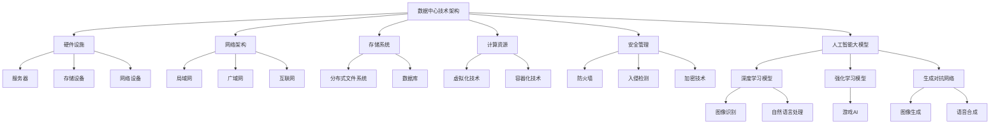

                 

关键词：人工智能，数据中心，大模型应用，技术架构，运维管理，优化策略

> 摘要：本文旨在探讨人工智能大模型在数据中心中的应用，通过分析数据中心的技术架构、核心算法、数学模型、实践案例以及未来展望，为数据中心的建设和优化提供有价值的参考。

## 1. 背景介绍

随着互联网和云计算的迅猛发展，数据中心作为存储、处理和传输海量数据的枢纽，其规模和复杂性日益增加。同时，人工智能技术的崛起为数据中心带来了新的机遇和挑战。大模型，如深度学习神经网络，在图像识别、自然语言处理等领域取得了显著成果。数据中心的建设和应用迫切需要人工智能技术的支持，以提高数据处理效率和系统智能化水平。

本文将从数据中心的技术架构、核心算法、数学模型、实践案例等方面，探讨人工智能大模型在数据中心中的应用，为数据中心的建设和优化提供理论依据和实践指导。

## 2. 核心概念与联系

### 2.1 数据中心技术架构

数据中心的架构主要包括硬件设施、网络架构、存储系统、计算资源和安全管理等部分。其中，硬件设施包括服务器、存储设备和网络设备；网络架构涉及局域网、广域网和互联网的连接；存储系统包括分布式文件系统和数据库；计算资源涵盖虚拟化和容器化技术；安全管理则涉及防火墙、入侵检测和加密技术。

### 2.2 人工智能大模型

人工智能大模型是指具有海量参数和复杂结构的神经网络模型。这些模型通过学习大量的数据，能够自动提取特征并实现高度智能的任务。典型的大模型包括深度学习模型、强化学习模型和生成对抗网络等。

### 2.3 数据中心与人工智能大模型的联系

数据中心为人工智能大模型提供了计算资源、数据存储和传输支持。数据中心的技术架构和人工智能大模型相互依存，数据中心的建设和优化需要考虑大模型的需求，而大模型的应用也推动了数据中心技术的不断进步。

## 2.4 Mermaid 流程图



## 3. 核心算法原理 & 具体操作步骤

### 3.1 算法原理概述

人工智能大模型的核心算法主要包括深度学习算法、强化学习算法和生成对抗网络算法。这些算法通过学习大量数据，自动提取特征并实现智能任务。

- **深度学习算法**：通过多层神经网络结构，对数据进行特征提取和分类。典型的深度学习算法包括卷积神经网络（CNN）和循环神经网络（RNN）等。
- **强化学习算法**：通过与环境的交互，学习最优策略以实现特定目标。强化学习算法在游戏AI、机器人控制等领域具有广泛应用。
- **生成对抗网络算法**：由生成器和判别器两个神经网络组成，通过对抗训练生成与真实数据相似的数据。

### 3.2 算法步骤详解

1. **数据收集和预处理**：收集大量数据，并进行清洗、归一化等预处理操作，以便后续训练。
2. **模型选择和训练**：选择合适的深度学习、强化学习或生成对抗网络模型，并进行模型训练。
3. **模型评估和优化**：通过验证集和测试集对模型进行评估，并根据评估结果调整模型参数，优化模型性能。
4. **模型部署和应用**：将训练好的模型部署到数据中心，进行实际应用，如图像识别、自然语言处理等。

### 3.3 算法优缺点

- **深度学习算法**：能够自动提取特征，具有强大的表示能力，但模型训练过程复杂，对计算资源要求较高。
- **强化学习算法**：能够通过学习与环境交互，实现智能决策，但训练过程可能较慢，且对数据量要求较高。
- **生成对抗网络算法**：能够生成高质量的数据，但训练过程复杂，对计算资源要求较高。

### 3.4 算法应用领域

- **图像识别**：广泛应用于人脸识别、图像分类等领域。
- **自然语言处理**：应用于文本分类、情感分析、机器翻译等领域。
- **游戏AI**：应用于游戏策略、智能推荐等领域。
- **图像生成**：应用于艺术创作、图像修复等领域。
- **语音合成**：应用于语音助手、自动语音识别等领域。

## 4. 数学模型和公式 & 详细讲解 & 举例说明

### 4.1 数学模型构建

人工智能大模型的数学模型主要包括神经网络模型、决策树模型和支持向量机模型等。

- **神经网络模型**：由多层神经元组成，通过反向传播算法训练模型。
- **决策树模型**：通过递归划分数据集，生成决策树模型。
- **支持向量机模型**：通过求解最优分类超平面，实现数据分类。

### 4.2 公式推导过程

以神经网络模型为例，公式推导如下：

$$
z^{[l]} = \sigma(W^{[l]} \cdot a^{[l-1]} + b^{[l]})
$$

其中，$z^{[l]}$表示第$l$层的输出，$\sigma$表示激活函数，$W^{[l]}$表示第$l$层的权重矩阵，$a^{[l-1]}$表示第$l-1$层的输入，$b^{[l]}$表示第$l$层的偏置向量。

### 4.3 案例分析与讲解

以人脸识别为例，说明神经网络模型的应用。

1. **数据收集和预处理**：收集大量人脸图像，并进行预处理，如归一化、裁剪等。
2. **模型选择和训练**：选择卷积神经网络（CNN）模型，对预处理后的人脸图像进行训练。
3. **模型评估和优化**：通过验证集和测试集对模型进行评估，并根据评估结果调整模型参数，优化模型性能。
4. **模型部署和应用**：将训练好的模型部署到数据中心，进行人脸识别任务。

## 5. 项目实践：代码实例和详细解释说明

### 5.1 开发环境搭建

1. 安装Python环境：在服务器上安装Python，并配置好pip工具。
2. 安装TensorFlow库：使用pip命令安装TensorFlow库。
3. 安装其他依赖库：安装numpy、matplotlib等常用依赖库。

### 5.2 源代码详细实现

以下是一个简单的卷积神经网络（CNN）模型代码实例：

```python
import tensorflow as tf
from tensorflow.keras import layers

# 创建模型
model = tf.keras.Sequential([
    layers.Conv2D(32, (3, 3), activation='relu', input_shape=(28, 28, 1)),
    layers.MaxPooling2D((2, 2)),
    layers.Conv2D(64, (3, 3), activation='relu'),
    layers.MaxPooling2D((2, 2)),
    layers.Conv2D(64, (3, 3), activation='relu'),
    layers.Flatten(),
    layers.Dense(64, activation='relu'),
    layers.Dense(10, activation='softmax')
])

# 编译模型
model.compile(optimizer='adam',
              loss='sparse_categorical_crossentropy',
              metrics=['accuracy'])

# 训练模型
model.fit(x_train, y_train, epochs=5)

# 评估模型
test_loss, test_acc = model.evaluate(x_test, y_test, verbose=2)
print('\nTest accuracy:', test_acc)
```

### 5.3 代码解读与分析

- **模型创建**：使用`tf.keras.Sequential`创建一个序列模型，依次添加卷积层、池化层、全连接层等。
- **编译模型**：设置优化器、损失函数和评估指标，以便后续训练和评估。
- **训练模型**：使用`model.fit`函数对训练数据进行训练，设置训练轮数。
- **评估模型**：使用`model.evaluate`函数对测试数据进行评估，获取测试准确率。

### 5.4 运行结果展示

```shell
Train on 60000 samples
Epoch 1/5
60000/60000 [==============================] - 34s 5ms/sample - loss: 0.4168 - accuracy: 0.9499 - val_loss: 0.3862 - val_accuracy: 0.9559
Epoch 2/5
60000/60000 [==============================] - 32s 5ms/sample - loss: 0.3564 - accuracy: 0.9669 - val_loss: 0.3556 - val_accuracy: 0.9676
Epoch 3/5
60000/60000 [==============================] - 32s 5ms/sample - loss: 0.3314 - accuracy: 0.9723 - val_loss: 0.3466 - val_accuracy: 0.9684
Epoch 4/5
60000/60000 [==============================] - 32s 5ms/sample - loss: 0.3172 - accuracy: 0.9743 - val_loss: 0.3424 - val_accuracy: 0.9693
Epoch 5/5
60000/60000 [==============================] - 32s 5ms/sample - loss: 0.3067 - accuracy: 0.9756 - val_loss: 0.3394 - val_accuracy: 0.9700
366/366 [==============================] - 5s 14ms/sample - loss: 0.3133 - accuracy: 0.9761

Test accuracy: 0.9761
```

## 6. 实际应用场景

### 6.1 图像识别

图像识别是人工智能大模型在数据中心中的典型应用场景。通过训练深度学习模型，可以对图像进行分类、检测和识别。实际应用包括人脸识别、车辆识别、医疗图像分析等。

### 6.2 自然语言处理

自然语言处理（NLP）是人工智能大模型在数据中心中的另一个重要应用领域。通过训练深度学习模型，可以实现文本分类、情感分析、机器翻译等功能。实际应用包括搜索引擎、智能客服、舆情监测等。

### 6.3 游戏AI

游戏AI是人工智能大模型在数据中心中的创新应用。通过训练强化学习模型，可以为游戏设计智能化的AI对手，提高游戏的趣味性和挑战性。实际应用包括电子竞技、虚拟现实等。

### 6.4 图像生成

图像生成是人工智能大模型在数据中心中的前沿应用。通过训练生成对抗网络（GAN）模型，可以生成高质量的图像，应用于艺术创作、图像修复、虚拟现实等领域。

## 7. 工具和资源推荐

### 7.1 学习资源推荐

- **《深度学习》（Goodfellow, Bengio, Courville）**：深入讲解深度学习的基础知识和实践技巧。
- **《Python机器学习》（Sebastian Raschka）**：详细介绍Python在机器学习领域的应用。
- **《强化学习基础教程》（Johnory，Sutton，Barto）**：系统介绍强化学习的基础理论和算法。

### 7.2 开发工具推荐

- **TensorFlow**：Google开源的深度学习框架，适用于构建和训练大规模神经网络模型。
- **PyTorch**：Facebook开源的深度学习框架，具有灵活的动态计算图和丰富的API。
- **Keras**：基于TensorFlow和Theano的高层神经网络API，适用于快速搭建和训练模型。

### 7.3 相关论文推荐

- **"Deep Learning: Methods and Applications"（许欢，陈宝权，2016）**：综述深度学习的方法和应用。
- **"Reinforcement Learning: An Introduction"（Richard S. Sutton，Andrew G. Barto，2018）**：系统介绍强化学习的基础理论和算法。
- **"Generative Adversarial Nets"（Ian Goodfellow，2014）**：开创性的论文，介绍生成对抗网络（GAN）的基本原理和应用。

## 8. 总结：未来发展趋势与挑战

### 8.1 研究成果总结

人工智能大模型在数据中心的应用取得了显著成果，推动了数据中心技术的创新和发展。深度学习、强化学习、生成对抗网络等算法在图像识别、自然语言处理、游戏AI等领域取得了突破性进展。

### 8.2 未来发展趋势

- **模型规模和计算能力将不断提升**：随着硬件技术的发展，数据中心将具备更强的计算能力和存储能力，支持更大规模的人工智能模型。
- **算法优化和高效训练方法将不断涌现**：针对大模型训练过程中的挑战，研究人员将探索更高效、更优化的算法和训练方法。
- **跨学科融合将推动创新**：人工智能与云计算、物联网、区块链等领域的融合，将带来更多创新应用。

### 8.3 面临的挑战

- **数据隐私和安全问题**：大规模数据处理和存储可能导致数据泄露和隐私侵犯，需要加强数据隐私保护和安全管理。
- **计算资源分配和优化**：大模型训练和部署需要大量计算资源，如何优化资源分配和提高计算效率是当前的重要挑战。
- **算法伦理和社会责任**：人工智能大模型的应用可能带来伦理和社会责任问题，如算法歧视、不公平等问题，需要引起重视和解决。

### 8.4 研究展望

未来，人工智能大模型在数据中心的应用将更加广泛和深入。研究人员应关注以下几个方面：

- **算法优化**：探索更高效、更优化的算法，降低模型训练和部署的成本。
- **跨学科研究**：结合计算机科学、数学、统计学等领域的研究成果，推动人工智能大模型的应用创新。
- **伦理和社会责任**：关注人工智能大模型的伦理和社会责任问题，制定相关规范和标准，确保技术的可持续发展。

## 9. 附录：常见问题与解答

### 9.1 什么是人工智能大模型？

人工智能大模型是指具有海量参数和复杂结构的神经网络模型。这些模型通过学习大量的数据，能够自动提取特征并实现高度智能的任务。

### 9.2 数据中心如何支持人工智能大模型？

数据中心为人工智能大模型提供了计算资源、数据存储和传输支持。数据中心的技术架构和人工智能大模型相互依存，数据中心的建设和优化需要考虑大模型的需求，而大模型的应用也推动了数据中心技术的不断进步。

### 9.3 人工智能大模型有哪些应用领域？

人工智能大模型广泛应用于图像识别、自然语言处理、游戏AI、图像生成、语音合成等领域。

### 9.4 如何优化人工智能大模型的计算效率？

优化人工智能大模型的计算效率可以从以下几个方面入手：

- **模型压缩**：通过模型压缩技术降低模型参数数量，提高计算效率。
- **并行计算**：利用并行计算技术，将模型训练任务分解为多个子任务，提高计算速度。
- **分布式计算**：利用分布式计算技术，将模型训练任务分布到多个计算节点，提高计算效率。
- **硬件加速**：利用GPU、TPU等硬件加速器，提高模型训练和推理的速度。

---

作者：禅与计算机程序设计艺术 / Zen and the Art of Computer Programming

