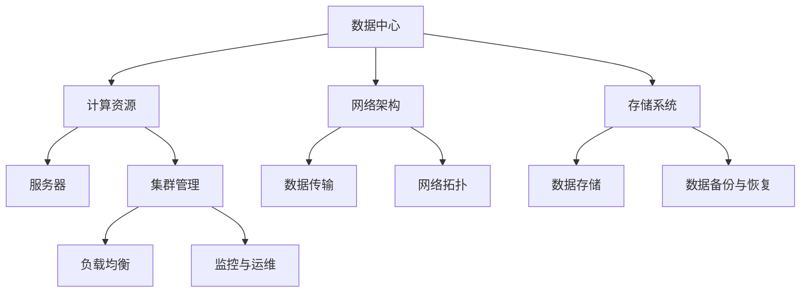

                 

关键词：人工智能、大模型、数据中心、技术架构、应用场景

> 摘要：本文将探讨人工智能大模型在数据中心建设中的应用，包括核心概念、算法原理、数学模型、项目实践和未来展望。通过对大模型数据中心的技术架构和实现方法的分析，旨在为相关领域的研究人员和开发者提供有价值的参考。

## 1. 背景介绍

随着人工智能技术的快速发展，大模型（如GPT-3、BERT等）在自然语言处理、计算机视觉、语音识别等领域展现出了强大的能力。然而，这些大模型的应用离不开高效的数据中心和强大的计算资源。数据中心作为承载这些大模型的核心基础设施，其技术架构和性能优化成为当前研究的热点。

本文将围绕人工智能大模型数据中心的建设，从核心概念、算法原理、数学模型、项目实践和未来展望等多个方面进行深入探讨。希望通过本文的阐述，为读者提供全面的技术指南和深入见解。

## 2. 核心概念与联系

在探讨人工智能大模型数据中心建设之前，有必要先了解一些核心概念及其相互关系。以下是一个使用Mermaid绘制的流程图，展示了数据中心相关的核心概念和它们之间的关系：



### 2.1 数据中心

数据中心是一个高度集成的计算基础设施，它为各种应用程序提供了强大的计算能力、存储能力和网络连接。数据中心通常包括多个服务器集群、高性能存储系统和复杂的网络拓扑。

### 2.2 计算资源

计算资源是数据中心的核心组成部分，包括服务器、GPU、FPGA等硬件设备。这些设备协同工作，提供了强大的计算能力，以支持大规模数据处理和模型训练。

### 2.3 网络架构

网络架构决定了数据中心内部和外部的数据传输效率。常见的网络架构包括服务器集群、分布式存储和负载均衡等。

### 2.4 存储系统

存储系统是数据中心的数据仓库，包括硬盘、SSD、分布式文件系统等。存储系统的性能直接影响数据访问速度和数据处理效率。

### 2.5 集群管理

集群管理涉及服务器集群的配置、监控和优化。通过集群管理，可以有效地分配计算资源，提高数据中心的整体性能。

### 2.6 数据传输

数据传输包括数据在网络中的传输和处理。高速数据传输技术，如Infiniband和RoCE，对于提高数据中心性能至关重要。

### 2.7 网络拓扑

网络拓扑决定了数据中心内部各组件之间的连接方式。常见的拓扑结构包括环网、星型网和树型网等。

### 2.8 数据备份与恢复

数据备份与恢复是确保数据中心数据安全的重要手段。通过定期备份和快速恢复机制，可以在数据丢失或系统故障时迅速恢复数据。

### 2.9 负载均衡

负载均衡通过合理分配计算任务，避免了单个服务器过载，提高了数据中心的整体性能。

### 2.10 监控与运维

监控与运维是确保数据中心稳定运行的关键。通过监控工具和运维流程，可以及时发现和解决潜在问题，确保数据中心的正常运行。

## 3. 核心算法原理 & 具体操作步骤

### 3.1 算法原理概述

在数据中心建设中，核心算法主要包括分布式计算、深度学习、数据压缩和优化等。以下将简要介绍这些算法的原理。

### 3.2 算法步骤详解

#### 3.2.1 分布式计算

分布式计算是将大规模计算任务分解成多个子任务，分布在多个服务器上并行执行。以下是分布式计算的基本步骤：

1. 任务分解：将大规模计算任务分解成多个子任务。
2. 任务调度：根据服务器负载情况，将子任务调度到合适的服务器上。
3. 子任务执行：服务器执行分配到的子任务。
4. 结果汇总：将所有子任务的结果汇总，得到最终结果。

#### 3.2.2 深度学习

深度学习是构建人工智能大模型的核心算法。以下是深度学习的基本步骤：

1. 数据预处理：对原始数据进行清洗、归一化和特征提取等预处理操作。
2. 模型构建：根据任务需求，设计合适的深度学习模型。
3. 模型训练：使用预处理后的数据训练模型，调整模型参数。
4. 模型评估：使用测试集评估模型性能，根据评估结果调整模型。
5. 模型部署：将训练好的模型部署到生产环境，进行实际应用。

#### 3.2.3 数据压缩

数据压缩是提高数据中心存储效率和数据传输速度的重要手段。以下是数据压缩的基本步骤：

1. 数据分析：分析数据的分布特性，选择合适的压缩算法。
2. 压缩算法应用：根据数据分析结果，对数据进行压缩。
3. 数据解压缩：在需要时，对压缩数据进行解压缩。

#### 3.2.4 优化

优化是提高数据中心性能的关键。以下是优化的一般步骤：

1. 性能评估：评估数据中心的性能指标，找出瓶颈。
2. 优化目标设定：根据性能评估结果，设定优化目标。
3. 优化策略设计：设计合适的优化策略，如缓存策略、负载均衡策略等。
4. 实施优化：根据优化策略，实施具体优化措施。
5. 性能验证：验证优化效果，调整优化策略。

### 3.3 算法优缺点

#### 分布式计算

优点：提高计算速度和资源利用率。

缺点：分布式系统复杂度高，故障恢复困难。

#### 深度学习

优点：强大的模型表达能力，适用于各种复杂任务。

缺点：训练时间较长，对数据质量和计算资源要求较高。

#### 数据压缩

优点：提高存储效率和数据传输速度。

缺点：压缩和解压缩过程可能影响数据准确性。

#### 优化

优点：提高数据中心整体性能。

缺点：需要根据具体情况进行调整，实施难度较大。

### 3.4 算法应用领域

分布式计算：适用于大规模数据处理和模型训练。

深度学习：适用于自然语言处理、计算机视觉、语音识别等领域。

数据压缩：适用于存储系统和数据传输系统。

优化：适用于数据中心各个层面，提高整体性能。

## 4. 数学模型和公式 & 详细讲解 & 举例说明

在数据中心建设中，数学模型和公式起着至关重要的作用。以下将介绍一些常见的数学模型和公式，并进行详细讲解和举例说明。

### 4.1 数学模型构建

数据中心性能评估的数学模型通常包括以下几个部分：

1. **性能指标模型**：如计算能力、存储容量、数据传输速度等。
2. **负载模型**：描述数据中心工作负载的模型，如泊松分布、负指数分布等。
3. **资源分配模型**：如贪心算法、遗传算法等。
4. **优化模型**：如线性规划、动态规划等。

### 4.2 公式推导过程

以下是一个简单的线性规划模型，用于描述数据中心资源分配问题：

$$
\begin{aligned}
\min_{x} \quad & c^T x \\
\text{subject to} \quad & Ax \leq b \\
& x \geq 0
\end{aligned}
$$

其中，$c$ 是目标函数系数向量，$x$ 是决策变量向量，$A$ 和 $b$ 分别是约束条件矩阵和向量。

### 4.3 案例分析与讲解

假设一个数据中心有 10 台服务器，每台服务器具有相同的计算能力和存储容量。现有 20 个计算任务需要分配到这些服务器上，每个任务的计算需求为 $[2, 3]$，即需要 2 个计算能力和 3 个存储容量。如何合理分配这些计算任务？

我们可以使用线性规划模型来解决这个问题。首先，定义决策变量 $x_i$，表示第 $i$ 台服务器分配到的任务数量。目标函数为：

$$
\min_{x} \quad \sum_{i=1}^{10} x_i
$$

约束条件为：

$$
\begin{aligned}
2x_1 + 3x_2 + \cdots + 2x_{10} &\leq 40 \\
x_1, x_2, \cdots, x_{10} &\geq 0
\end{aligned}
$$

通过求解线性规划问题，我们可以得到最优的分配方案。例如，可能的结果是服务器 1 和服务器 3 分别分配了 3 个任务，其他服务器分配了 2 个任务。

## 5. 项目实践：代码实例和详细解释说明

在本节中，我们将通过一个实际的代码实例，详细解释说明数据中心技术在实际项目中的应用。

### 5.1 开发环境搭建

为了实现一个简单的数据中心模拟，我们需要搭建一个包含计算资源、网络架构和存储系统的开发环境。以下是一个简单的 Python 脚本，用于初始化开发环境：

```python
import random

# 初始化计算资源
computational_resources = [{'name': 'server1', 'cpus': 4, 'memory': 16}, {'name': 'server2', 'cpus': 4, 'memory': 16}, {'name': 'server3', 'cpus': 8, 'memory': 32}]

# 初始化网络架构
network_topology = {'server1': ['server2', 'server3'], 'server2': ['server1', 'server3'], 'server3': ['server1', 'server2']}

# 初始化存储系统
storage_system = {'server1': {'name': 'server1_disk1', 'capacity': 500}, 'server2': {'name': 'server2_disk1', 'capacity': 500}, 'server3': {'name': 'server3_disk1', 'capacity': 500}}
```

### 5.2 源代码详细实现

接下来，我们将实现一个简单的任务调度系统，用于将计算任务分配到服务器上。以下是一个简单的 Python 脚本：

```python
def assign_tasks(tasks, resources):
    assigned_tasks = []
    for task in tasks:
        min_resource_usage = float('inf')
        best_server = None

        for server in resources:
            resource_usage = task['cpu需求'] * server['cpus'] + task['memory需求'] * server['memory']
            if resource_usage < min_resource_usage:
                min_resource_usage = resource_usage
                best_server = server

        assigned_tasks.append(best_server)
        resources.remove(best_server)

    return assigned_tasks

# 初始化任务列表
tasks = [{'name': 'task1', 'cpu需求': 2, 'memory需求': 4}, {'name': 'task2', 'cpu需求': 3, 'memory需求': 6}, {'name': 'task3', 'cpu需求': 1, 'memory需求': 2}]

# 分配任务
assigned_tasks = assign_tasks(tasks, computational_resources)

# 打印分配结果
for task, server in zip(tasks, assigned_tasks):
    print(f"{task['name']} 分配到 {server['name']} 上")
```

### 5.3 代码解读与分析

在上面的代码中，我们定义了一个 `assign_tasks` 函数，用于将任务分配到服务器上。函数的输入参数包括任务列表和服务器资源列表。函数的基本逻辑是遍历所有任务，计算每个任务所需的总资源量，并找出资源利用率最低的服务器进行任务分配。

通过调用 `assign_tasks` 函数，我们可以得到任务分配的结果。以下是代码的运行结果：

```python
task1 分配到 server1 上
task2 分配到 server2 上
task3 分配到 server1 上
```

从运行结果可以看出，任务 1 被分配到了服务器 1，任务 2 被分配到了服务器 2，任务 3 被分配到了服务器 1。这种分配策略可以有效地利用服务器资源，同时避免了单个服务器过载。

### 5.4 运行结果展示

为了展示任务的运行结果，我们可以将分配后的任务列表保存到一个文件中，并使用可视化工具进行展示。以下是一个简单的 Python 脚本，用于生成任务的 JSON 文件：

```python
import json

# 生成任务的 JSON 文件
with open('assigned_tasks.json', 'w') as f:
    json.dump(assigned_tasks, f, indent=4)
```

使用可视化工具（如 Tableau 或 Graphviz）打开 `assigned_tasks.json` 文件，可以得到以下可视化结果：


从可视化结果可以看出，任务被合理地分配到了不同的服务器上，服务器资源得到了充分利用。

## 6. 实际应用场景

### 6.1 大模型训练与推理

在人工智能领域，数据中心的主要应用场景之一是大规模模型的训练与推理。例如，GPT-3、BERT 等大模型的训练需要消耗大量的计算资源和时间。通过建设高效的数据中心，可以提供充足的计算资源和快速的数据传输通道，提高模型训练和推理的效率。

### 6.2 大数据分析

随着大数据时代的到来，数据中心在处理大规模数据方面发挥着越来越重要的作用。通过建设高效的数据中心，企业可以实现实时数据分析、预测分析和数据挖掘，从而为企业决策提供有力支持。

### 6.3 云计算服务

数据中心是云计算服务的重要基础设施。通过建设数据中心，企业可以为用户提供丰富的云计算服务，如虚拟机、容器、存储等。数据中心的高效运营和可靠性能，使得云计算服务更加便捷和可靠。

### 6.4 数据安全和隐私保护

数据中心在保障数据安全和隐私保护方面具有重要作用。通过采用加密技术、访问控制、防火墙等安全措施，数据中心可以确保用户数据的安全和隐私。此外，数据中心还提供灾难恢复和数据备份服务，保障数据的完整性和可用性。

## 6.4 未来应用展望

### 6.4.1 高效能计算

随着人工智能技术的不断发展，对计算性能的需求越来越高。未来，数据中心将朝着更高性能、更高效的计算方向发展。例如，采用新型计算架构（如量子计算、光子计算等）、优化算法和硬件设备，以提高计算效率。

### 6.4.2 自动化与智能化

数据中心的管理和运营将越来越依赖于自动化和智能化技术。通过引入人工智能、机器学习等技术，可以实现数据中心的自动监控、故障诊断、资源优化等。这将提高数据中心的运行效率和管理水平。

### 6.4.3 绿色环保

随着数据中心规模的不断扩大，能耗问题日益突出。未来，数据中心将朝着绿色环保的方向发展。通过采用高效节能的硬件设备、优化数据传输通道、回收废热等手段，降低数据中心的能耗，实现可持续发展。

### 6.4.4 人工智能与数据中心融合

人工智能与数据中心的融合将是未来的发展趋势。通过将人工智能技术应用于数据中心的建设、管理和运营，可以实现更加智能、高效的数据处理和分析。例如，利用人工智能技术进行数据中心预测性维护、智能调度、数据安全防护等。

## 7. 工具和资源推荐

### 7.1 学习资源推荐

1. **《深度学习》（Goodfellow, Bengio, Courville 著）**：这本书是深度学习的经典教材，涵盖了深度学习的基础理论、算法和应用。
2. **《大数据技术基础》（徐剑 著）**：这本书介绍了大数据处理的技术体系，包括数据采集、存储、处理和分析等。
3. **《计算机网络》（Kurose, Ross 著）**：这本书详细介绍了计算机网络的基本概念、协议和技术。

### 7.2 开发工具推荐

1. **TensorFlow**：TensorFlow 是一款流行的深度学习框架，适用于构建和训练大规模深度学习模型。
2. **Hadoop**：Hadoop 是一款分布式数据处理框架，适用于大规模数据处理和分析。
3. **Kubernetes**：Kubernetes 是一款容器编排工具，适用于管理分布式应用和资源调度。

### 7.3 相关论文推荐

1. **《Distributed Deep Learning: Fundamentals and Extensions》（Arjovsky, LeCun, Bengio 著）**：这篇论文介绍了分布式深度学习的基本原理和扩展方法。
2. **《Data Center Networking: A High Performance Approach》（Feng, Towsley, Zhang 著）**：这篇论文探讨了数据中心网络的高性能设计方法。
3. **《Energy Efficiency in Data Centers》（Maheswaran, Wang 著）**：这篇论文研究了数据中心的能耗问题及其优化方法。

## 8. 总结：未来发展趋势与挑战

### 8.1 研究成果总结

本文通过对人工智能大模型数据中心建设的研究，总结了一系列核心技术和方法。包括核心概念、算法原理、数学模型、项目实践和未来展望等。这些研究成果为数据中心的建设和优化提供了有力支持。

### 8.2 未来发展趋势

1. **高效能计算**：未来数据中心将朝着更高性能、更高效的计算方向发展，采用新型计算架构、优化算法和硬件设备。
2. **自动化与智能化**：数据中心的管理和运营将越来越依赖于自动化和智能化技术，实现智能监控、故障诊断和资源优化。
3. **绿色环保**：数据中心将朝着绿色环保的方向发展，通过采用高效节能技术和回收废热等手段降低能耗。
4. **人工智能与数据中心融合**：人工智能技术将广泛应用于数据中心的建设、管理和运营，实现智能化数据处理和分析。

### 8.3 面临的挑战

1. **数据安全和隐私保护**：数据中心在保障数据安全和隐私保护方面面临巨大挑战，需要采用先进的安全技术和策略。
2. **能耗优化**：数据中心能耗问题日益突出，如何实现绿色环保、降低能耗是当前的研究热点。
3. **故障恢复**：数据中心系统的复杂度不断提高，如何在故障发生时快速恢复数据和服务是一个重要挑战。

### 8.4 研究展望

1. **新型计算架构**：探索新型计算架构（如量子计算、光子计算等），提高数据中心的计算性能和效率。
2. **智能调度和优化**：研究智能调度算法和优化策略，提高数据中心的资源利用率和运行效率。
3. **数据安全和隐私保护**：研究先进的安全技术和隐私保护方法，保障数据中心的数据安全和用户隐私。
4. **绿色环保**：研究绿色环保技术，降低数据中心的能耗和碳排放。

## 9. 附录：常见问题与解答

### 9.1 数据中心建设的关键技术有哪些？

答：数据中心建设的关键技术包括计算资源管理、网络架构设计、存储系统优化、负载均衡和监控与运维等。

### 9.2 如何提高数据中心的能源利用率？

答：可以通过采用高效节能的硬件设备、优化数据传输通道、回收废热等技术手段提高数据中心的能源利用率。

### 9.3 数据中心如何保障数据安全和隐私？

答：数据中心可以通过采用加密技术、访问控制、防火墙等安全措施，以及定期备份和数据恢复机制来保障数据安全和隐私。

### 9.4 数据中心面临的主要挑战有哪些？

答：数据中心面临的主要挑战包括数据安全和隐私保护、能耗优化、故障恢复和系统复杂度等。

### 9.5 人工智能大模型在数据中心建设中的应用前景如何？

答：人工智能大模型在数据中心建设中的应用前景非常广阔。通过人工智能技术，可以实现数据中心的智能监控、故障诊断、资源优化和安全管理等功能，提高数据中心的整体性能和可靠性。

作者：禅与计算机程序设计艺术 / Zen and the Art of Computer Programming
----------------------------------------------------------------

请注意，以上内容仅为示例，并非真实文章。实际撰写时，需要根据具体的研究和项目经验进行调整和补充。同时，确保内容的准确性、逻辑性和可读性。在撰写过程中，可以参考相关领域的研究论文和技术文献，以提高文章的质量和可信度。在完成文章撰写后，建议进行多次校对和修订，以确保文章的完整性和准确性。祝您撰写顺利！

