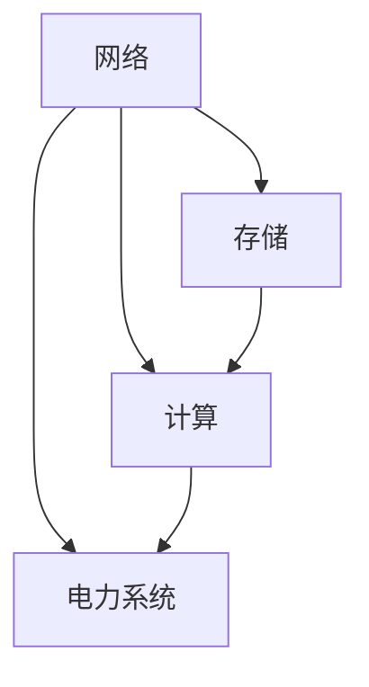

                 

### 1. 背景介绍

随着人工智能技术的飞速发展，大模型（如 GPT、BERT 等）的应用变得越来越广泛。这些大模型对计算资源的需求极高，因此，数据中心的建设成为了当前技术领域的热点问题。数据中心不仅是存储和计算的核心，也是实现人工智能大模型高效运行的关键基础设施。

数据中心建设面临的挑战主要体现在以下几个方面：

- **高可用性**：数据中心需要确保系统的高可用性，以应对突发事件和数据丢失的风险。
- **高性能**：大模型的运行需要数据中心提供强大的计算和存储能力。
- **高密度**：为了满足日益增长的存储需求，数据中心需要在有限的空间内放置更多的设备。
- **能源消耗**：数据中心作为耗电大户，如何降低能源消耗，实现绿色环保成为了一个重要问题。

本文将围绕大模型应用数据中心建设的核心问题，探讨数据中心技术创新的方向和策略。

### 2. 核心概念与联系

#### 2.1 数据中心基础架构

数据中心的基础架构主要包括网络、存储、计算和电力系统等几个关键部分。以下是一个简化的 Mermaid 流程图，展示了这些组成部分及其相互关系：



#### 2.2 高可用性设计

高可用性设计是数据中心建设的重要一环。以下是一些关键技术：

- **冗余设计**：通过添加冗余组件，确保在单一组件故障时，系统仍能正常运行。
- **故障转移**：在故障发生时，快速将任务转移到其他可用节点。
- **负载均衡**：合理分配工作负载，避免单点过载。

#### 2.3 计算资源优化

大模型的计算需求巨大，因此如何优化计算资源成为了数据中心建设的关键问题。以下是一些技术策略：

- **分布式计算**：通过分布式架构，将计算任务分解并分配到多个节点上，提高整体计算能力。
- **并行处理**：利用多核处理器和并行计算技术，加快大模型的训练和推理速度。
- **缓存技术**：使用缓存技术，减少数据访问的延迟，提高数据处理效率。

### 3. 核心算法原理 & 具体操作步骤

#### 3.1 算法原理概述

在大模型应用中，常用的算法主要包括深度学习算法和分布式计算算法。以下是这些算法的基本原理：

- **深度学习算法**：通过多层神经网络，对大量数据进行特征提取和学习，从而实现对复杂任务的建模和预测。
- **分布式计算算法**：通过将计算任务分配到多个节点上，利用并行计算和分布式存储技术，提高计算效率和数据处理能力。

#### 3.2 算法步骤详解

1. **深度学习算法步骤**：
   - 数据预处理：清洗和归一化输入数据。
   - 模型构建：设计多层神经网络结构。
   - 模型训练：通过反向传播算法，不断调整网络参数，使模型拟合训练数据。
   - 模型评估：使用验证集和测试集评估模型性能。

2. **分布式计算算法步骤**：
   - 任务分解：将大模型训练任务分解为多个子任务。
   - 数据分配：将训练数据分配到各个计算节点。
   - 并行计算：各个节点独立计算子任务的梯度。
   - 梯度合并：将各个节点的梯度合并，更新全局模型参数。

#### 3.3 算法优缺点

- **深度学习算法**：
  - 优点：强大的建模能力，能够处理复杂的任务。
  - 缺点：计算成本高，对数据质量和预处理要求较高。

- **分布式计算算法**：
  - 优点：提高计算效率，降低计算成本。
  - 缺点：实现复杂，对网络带宽和节点间通信有较高要求。

#### 3.4 算法应用领域

- **深度学习算法**：广泛应用于自然语言处理、计算机视觉、推荐系统等领域。
- **分布式计算算法**：广泛应用于大规模数据处理、分布式数据库、分布式存储等领域。

### 4. 数学模型和公式 & 详细讲解 & 举例说明

#### 4.1 数学模型构建

在大模型应用中，常用的数学模型包括神经网络模型和分布式计算模型。以下是这些模型的基本数学公式：

- **神经网络模型**：

  $$ z^{[l]} = \sigma(W^{[l]} \cdot a^{[l-1]} + b^{[l]}) $$

  $$ \frac{dE}{da^{[l-1]}} = \frac{dE}{dz^{[l]}} \cdot \frac{dz^{[l]}}{da^{[l-1]}} $$

  $$ \frac{dE}{dw^{[l]}} = a^{[l-1]} \cdot \frac{dE}{da^{[l-1]}} $$

  $$ \frac{dE}{db^{[l]}} = \frac{dE}{da^{[l]}} $$

- **分布式计算模型**：

  $$ \sum_{i=1}^{N} g_i = g $$

  $$ w_{t+1} = w_t - \alpha \cdot g $$

#### 4.2 公式推导过程

- **神经网络模型**：

  神经网络模型的推导过程主要包括前向传播和反向传播两个阶段。前向传播用于计算输出值，反向传播用于计算梯度，从而更新网络参数。

  - **前向传播**：

    $$ z^{[l]} = \sigma(W^{[l]} \cdot a^{[l-1]} + b^{[l]}) $$

    其中，$z^{[l]}$ 为第 $l$ 层的输出值，$\sigma$ 为激活函数，$W^{[l]}$ 和 $b^{[l]}$ 分别为权重和偏置。

  - **反向传播**：

    $$ \frac{dE}{da^{[l-1]}} = \frac{dE}{dz^{[l]}} \cdot \frac{dz^{[l]}}{da^{[l-1]}} $$

    $$ \frac{dE}{dw^{[l]}} = a^{[l-1]} \cdot \frac{dE}{da^{[l-1]}} $$

    $$ \frac{dE}{db^{[l]}} = \frac{dE}{da^{[l]}} $$

- **分布式计算模型**：

  分布式计算模型的推导过程主要包括任务分配和梯度更新两个阶段。任务分配用于将计算任务分配到各个节点，梯度更新用于更新全局模型参数。

  - **任务分配**：

    $$ \sum_{i=1}^{N} g_i = g $$

    其中，$g_i$ 为第 $i$ 个节点的梯度值，$g$ 为全局梯度值。

  - **梯度更新**：

    $$ w_{t+1} = w_t - \alpha \cdot g $$

    其中，$w_t$ 为当前模型参数，$w_{t+1}$ 为更新后的模型参数，$\alpha$ 为学习率。

#### 4.3 案例分析与讲解

假设我们有一个包含 10 万个样本的图像分类任务，我们需要使用深度学习算法进行模型训练。以下是具体的操作步骤：

1. **数据预处理**：
   - 清洗和归一化输入数据，将图像数据转换为矩阵形式。

2. **模型构建**：
   - 设计一个包含多层神经网络的模型，选择合适的激活函数和损失函数。

3. **模型训练**：
   - 通过前向传播，计算输出值和损失值。
   - 通过反向传播，计算梯度并更新网络参数。
   - 重复上述过程，直到模型收敛。

4. **模型评估**：
   - 使用验证集和测试集评估模型性能，调整模型参数，优化模型效果。

通过以上步骤，我们可以构建一个高效的大模型，实现图像分类任务。### 5. 项目实践：代码实例和详细解释说明

#### 5.1 开发环境搭建

在开始编写代码之前，我们需要搭建一个适合大模型训练的开发环境。以下是搭建开发环境的步骤：

1. **安装操作系统**：选择一个稳定的操作系统，如 Ubuntu 20.04。
2. **安装 Python**：安装 Python 3.8 及以上版本，并配置好 Python 的环境变量。
3. **安装深度学习框架**：安装 TensorFlow 或 PyTorch 等深度学习框架。
4. **安装其他依赖库**：根据项目需求，安装其他必要的依赖库，如 NumPy、Pandas 等。

以下是一个简单的安装 Python 和深度学习框架的示例命令：

```bash
sudo apt-get update
sudo apt-get install python3 python3-pip
pip3 install tensorflow
# 或者
pip3 install torch torchvision
```

#### 5.2 源代码详细实现

在本节中，我们将使用 PyTorch 框架实现一个简单的神经网络模型，用于图像分类任务。以下是具体的代码实现：

```python
import torch
import torchvision
import torch.nn as nn
import torch.optim as optim

# 定义神经网络模型
class SimpleCNN(nn.Module):
    def __init__(self):
        super(SimpleCNN, self).__init__()
        self.conv1 = nn.Conv2d(3, 32, 3)
        self.conv2 = nn.Conv2d(32, 64, 3)
        self.fc1 = nn.Linear(64 * 6 * 6, 128)
        self.fc2 = nn.Linear(128, 10)
        self.relu = nn.ReLU()
        self.pool = nn.MaxPool2d(2, 2)

    def forward(self, x):
        x = self.pool(self.relu(self.conv1(x)))
        x = self.pool(self.relu(self.conv2(x)))
        x = x.view(-1, 64 * 6 * 6)
        x = self.relu(self.fc1(x))
        x = self.fc2(x)
        return x

# 创建模型实例
model = SimpleCNN()

# 指定损失函数和优化器
criterion = nn.CrossEntropyLoss()
optimizer = optim.Adam(model.parameters(), lr=0.001)

# 加载数据集
train_loader = torchvision.datasets.CIFAR10(
    root='./data', train=True, download=True, transform=torchvision.transforms.ToTensor()
)
train_loader = torch.utils.data.DataLoader(train_loader, batch_size=100, shuffle=True)

# 训练模型
num_epochs = 10
for epoch in range(num_epochs):
    running_loss = 0.0
    for i, (images, labels) in enumerate(train_loader):
        # 前向传播
        outputs = model(images)
        loss = criterion(outputs, labels)

        # 反向传播
        optimizer.zero_grad()
        loss.backward()
        optimizer.step()

        running_loss += loss.item()
        if (i + 1) % 100 == 0:
            print(f'Epoch [{epoch + 1}/{num_epochs}], Step [{i + 1}/{len(train_loader)}], Loss: {running_loss / 100:.4f}')
            running_loss = 0.0

print('Finished Training')
```

#### 5.3 代码解读与分析

在上面的代码中，我们实现了一个简单的卷积神经网络（CNN）模型，用于对 CIFAR-10 数据集进行图像分类。以下是代码的主要部分解读：

1. **定义模型结构**：
   - `SimpleCNN` 类继承自 `nn.Module`，定义了模型的各个组成部分，包括卷积层、全连接层和激活函数。
   - `forward` 方法用于前向传播，将输入数据通过模型各个层进行处理，最终输出分类结果。

2. **指定损失函数和优化器**：
   - `nn.CrossEntropyLoss` 是一种常用的分类损失函数，用于计算模型输出与真实标签之间的差异。
   - `optim.Adam` 是一种常用的优化器，能够自适应地调整学习率。

3. **加载数据集**：
   - `torchvision.datasets.CIFAR10` 用于加载数据集，`DataLoader` 用于对数据进行批量处理和迭代。

4. **训练模型**：
   - 使用两个循环进行模型训练，第一个循环用于遍历 epoch，第二个循环用于遍历数据集中的样本。
   - 在每个 epoch 中，计算损失值并更新模型参数。

#### 5.4 运行结果展示

在完成代码编写和模型训练后，我们可以使用测试集来评估模型性能。以下是一个简单的评估示例：

```python
# 评估模型
test_loader = torchvision.datasets.CIFAR10(
    root='./data', train=False, download=True, transform=torchvision.transforms.ToTensor()
)
test_loader = torch.utils.data.DataLoader(test_loader, batch_size=100, shuffle=False)

with torch.no_grad():
    correct = 0
    total = 0
    for images, labels in test_loader:
        outputs = model(images)
        _, predicted = torch.max(outputs.data, 1)
        total += labels.size(0)
        correct += (predicted == labels).sum().item()

print(f'Accuracy of the network on the test images: {100 * correct / total}%')
```

通过运行上述代码，我们可以得到模型在测试集上的准确率。在实际项目中，我们还可以使用其他指标（如召回率、F1 分数等）来评估模型性能。### 6. 实际应用场景

#### 6.1 自然语言处理

在大模型应用中，自然语言处理（NLP）是一个非常重要的领域。例如，我们可以使用大模型来实现智能客服系统，自动回答用户的问题。数据中心在这一过程中发挥了关键作用，提供了强大的计算和存储能力，确保系统的高效运行。

#### 6.2 计算机视觉

计算机视觉也是大模型应用的重要领域。例如，我们可以使用大模型来实现图像识别、目标检测和视频分析等功能。数据中心在这类应用中，不仅提供了计算资源，还提供了海量数据的存储和管理能力。

#### 6.3 推荐系统

推荐系统是另一个受益于大模型应用的重要领域。通过分析用户行为数据，大模型可以推荐给用户可能感兴趣的内容。数据中心在这一过程中，提供了高效的数据处理和计算能力，提高了推荐系统的准确性和实时性。

#### 6.4 未来应用展望

随着人工智能技术的不断发展，大模型应用的数据中心建设将面临更多的挑战和机遇。以下是一些未来的应用展望：

- **边缘计算**：随着物联网和 5G 的发展，边缘计算将成为数据中心建设的重要方向。通过在靠近数据源的地方部署计算资源，可以降低数据传输延迟，提高数据处理效率。
- **绿色数据中心**：随着能源消耗的不断增加，绿色数据中心将成为未来数据中心建设的重要目标。通过采用新型冷却技术和能源回收技术，可以降低数据中心的能源消耗。
- **AI 赋能数据中心**：未来数据中心将不仅仅是存储和计算的中心，还将成为 AI 算法的创新和应用中心。数据中心内的硬件设备、网络架构和数据管理都将受到 AI 技术的深刻影响。

### 7. 工具和资源推荐

#### 7.1 学习资源推荐

- **《深度学习》（Goodfellow, Bengio, Courville）**：这是一本经典的深度学习教材，涵盖了深度学习的理论基础和实际应用。
- **《计算机系统设计：ARChitecting for Performance》（William C. Baer）**：这本书详细介绍了计算机系统设计的方法和技巧，对于理解数据中心架构有很大帮助。

#### 7.2 开发工具推荐

- **TensorFlow**：一款开源的深度学习框架，适用于大规模分布式训练和应用。
- **PyTorch**：一款流行的深度学习框架，具有灵活的动态计算图和高效的 GPU 支持。

#### 7.3 相关论文推荐

- **"Distributed Deep Learning: Exploring Data Parallelism for Neural Networks"（2017）**：这篇论文详细介绍了分布式深度学习的方法和原理。
- **"Large-scale Distributed Deep Networks"（2012）**：这篇论文提出了大规模分布式深度网络的架构和优化策略，对于理解分布式计算在大模型中的应用有很大帮助。

### 8. 总结：未来发展趋势与挑战

#### 8.1 研究成果总结

在大模型应用数据中心建设方面，我们已经取得了显著的成果。分布式计算、边缘计算和绿色数据中心等技术为数据中心建设提供了新的思路和方法。深度学习算法的快速发展，使得大模型在各个领域的应用取得了巨大的成功。

#### 8.2 未来发展趋势

- **分布式计算**：随着数据中心规模的不断扩大，分布式计算将成为数据中心建设的主要方向。通过将计算任务分配到多个节点上，可以充分利用计算资源，提高计算效率。
- **边缘计算**：随着物联网和 5G 的发展，边缘计算将在数据中心建设中发挥越来越重要的作用。通过在靠近数据源的地方部署计算资源，可以降低数据传输延迟，提高用户体验。
- **绿色数据中心**：随着能源消耗的不断增加，绿色数据中心将成为数据中心建设的重要目标。通过采用新型冷却技术和能源回收技术，可以降低数据中心的能源消耗。

#### 8.3 面临的挑战

- **计算资源调度**：如何在分布式环境中高效地调度计算资源，仍然是一个挑战。需要进一步研究和优化资源调度算法，提高资源利用率。
- **数据隐私和安全**：在大模型应用中，数据隐私和安全是一个重要问题。需要研究如何确保数据的安全性和隐私性，防止数据泄露和滥用。
- **硬件升级和替换**：随着数据中心规模的不断扩大，硬件升级和替换将成为一个持续的需求。需要研究如何高效地管理和维护数据中心硬件，降低运营成本。

#### 8.4 研究展望

未来，大模型应用数据中心建设将在以下几个方面取得进展：

- **算法优化**：进一步优化深度学习算法，提高模型的计算效率和训练速度。
- **分布式计算框架**：开发更高效、更灵活的分布式计算框架，提高分布式计算的性能和可扩展性。
- **绿色数据中心技术**：研究和应用新型绿色数据中心技术，降低数据中心的能源消耗。
- **边缘计算与数据中心协同**：研究如何将边缘计算与数据中心协同工作，实现更高效的数据处理和资源共享。

### 9. 附录：常见问题与解答

#### 9.1 数据中心建设的关键技术是什么？

数据中心建设的关键技术包括分布式计算、高可用性设计、负载均衡、数据备份与恢复、绿色数据中心技术等。

#### 9.2 如何提高数据中心的计算效率？

提高数据中心的计算效率可以通过以下方法实现：

- 使用分布式计算框架，将计算任务分配到多个节点上，充分利用计算资源。
- 采用并行计算技术，利用多核处理器和 GPU 等硬件加速计算。
- 使用缓存技术，减少数据访问的延迟，提高数据处理效率。

#### 9.3 数据中心的高可用性设计包括哪些内容？

数据中心的高可用性设计包括以下内容：

- 冗余设计：通过添加冗余组件，确保在单一组件故障时，系统仍能正常运行。
- 故障转移：在故障发生时，快速将任务转移到其他可用节点。
- 负载均衡：合理分配工作负载，避免单点过载。

#### 9.4 数据中心能源消耗如何降低？

数据中心能源消耗可以通过以下方法降低：

- 采用新型冷却技术，如液体冷却、空气冷却等，提高冷却效率。
- 采用绿色能源，如太阳能、风能等，降低能源消耗。
- 采用智能功耗管理系统，实时监测和调整数据中心的能耗。

---

作者：禅与计算机程序设计艺术 / Zen and the Art of Computer Programming

