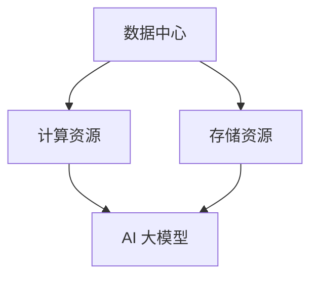

                 

 **关键词：** AI 大模型，数据中心，投资建设，技术架构，运营管理

> **摘要：** 本文将探讨 AI 大模型在数据中心建设中的应用，分析数据中心投资建设的策略和方法，以及面临的挑战和未来发展方向。通过对数据中心建设中的关键技术和运营管理的深入剖析，为 AI 大模型的应用提供有力支撑，助力我国数字经济快速发展。

## 1. 背景介绍

随着人工智能（AI）技术的飞速发展，AI 大模型在自然语言处理、计算机视觉、语音识别等领域的应用越来越广泛。这些大模型往往需要处理海量数据，对计算资源和存储资源的需求极高。因此，数据中心的建设成为支撑 AI 大模型应用的关键因素之一。

数据中心作为存储、处理和传输海量数据的场所，其规模和性能直接影响 AI 大模型的应用效果。同时，数据中心的建设和维护成本也是企业必须考虑的重要因素。本文将从数据中心投资建设的角度，探讨如何构建高效、稳定、安全的 AI 大模型应用数据中心。

## 2. 核心概念与联系

在讨论数据中心投资建设之前，我们先了解一些核心概念和它们之间的关系。

### 2.1 数据中心

数据中心（Data Center）是一种专门用于存储、处理和传输数据的建筑物或场所。它通常包括服务器、存储设备、网络设备、电力设备、冷却系统等。数据中心的建设需要考虑以下几个关键方面：

- **位置选择**：选址应考虑交通便利性、地理环境、政策法规等因素。
- **机房设计**：机房的设计要满足高可靠性、安全性、节能环保等要求。
- **电力供应**：数据中心需要稳定的电力供应，通常采用多路电源输入、不间断电源（UPS）等设备。
- **网络连接**：数据中心需要具备高速、稳定的网络连接，包括内部网络和外部网络。
- **冷却系统**：数据中心的设备会产生大量热量，需要有效的冷却系统来保证设备的正常运行。

### 2.2 AI 大模型

AI 大模型（Large-scale AI Models）是指训练参数数量庞大的深度学习模型，如 Transformer、BERT、GPT 等。这些模型通常需要处理海量数据，对计算资源和存储资源的需求极高。

### 2.3 数据中心与 AI 大模型的关系

数据中心与 AI 大模型之间存在着密切的联系。数据中心为 AI 大模型提供了必要的计算资源和存储资源，使得大规模数据分析和训练成为可能。同时，数据中心的建设和维护质量直接影响到 AI 大模型的应用效果。

为了更好地理解数据中心与 AI 大模型之间的关系，我们可以用 Mermaid 流程图来展示：



## 3. 核心算法原理 & 具体操作步骤

### 3.1 算法原理概述

AI 大模型的核心算法是深度学习。深度学习是一种基于多层神经网络的学习方法，通过模拟人脑的神经元连接方式，对数据进行自动特征提取和模式识别。

### 3.2 算法步骤详解

AI 大模型的训练过程主要包括以下几个步骤：

1. **数据预处理**：对原始数据进行清洗、归一化等处理，使其符合模型的输入要求。
2. **模型构建**：设计并构建深度学习模型，包括输入层、隐藏层和输出层等。
3. **训练过程**：通过不断调整模型参数，使得模型在训练数据上的表现逐渐提升。
4. **模型评估**：在测试数据上评估模型性能，确保其具备良好的泛化能力。
5. **模型部署**：将训练好的模型部署到生产环境中，用于实际应用。

### 3.3 算法优缺点

深度学习算法具有以下几个优点：

- **强大的特征提取能力**：能够自动提取数据中的高级特征，降低人工干预。
- **良好的泛化能力**：在大量训练数据的基础上，模型能够较好地应对未知数据。
- **易于并行计算**：深度学习模型可以分布式训练，提高计算效率。

然而，深度学习算法也存在一些缺点：

- **对数据依赖性较大**：需要大量高质量的数据进行训练，否则模型性能难以保证。
- **训练过程复杂**：需要调整大量的超参数，且训练时间较长。
- **解释性较差**：深度学习模型的内部机制相对复杂，难以解释。

### 3.4 算法应用领域

深度学习算法在多个领域取得了显著的应用成果，主要包括：

- **计算机视觉**：如图像分类、目标检测、图像生成等。
- **自然语言处理**：如文本分类、机器翻译、文本生成等。
- **语音识别**：如语音合成、语音识别、语音翻译等。
- **推荐系统**：如商品推荐、新闻推荐、社交网络推荐等。

## 4. 数学模型和公式 & 详细讲解 & 举例说明

### 4.1 数学模型构建

深度学习算法的核心是多层感知机（MLP），其数学模型可以表示为：

$$
Y = \sigma(W_1 \cdot X + b_1)
$$

其中，$Y$ 是模型的输出，$X$ 是输入数据，$W_1$ 是第一层的权重矩阵，$b_1$ 是第一层的偏置向量，$\sigma$ 是激活函数，通常采用 sigmoid 或 ReLU 函数。

### 4.2 公式推导过程

以 ReLU 激活函数为例，其数学表达式为：

$$
\sigma(x) = \max(0, x)
$$

首先，我们假设输入数据 $X$ 为 $x_1, x_2, ..., x_n$，第一层的权重矩阵 $W_1$ 为 $w_{11}, w_{12}, ..., w_{1n}$，偏置向量 $b_1$ 为 $b_{11}, b_{12}, ..., b_{1n}$。

则第一层的输出为：

$$
z_1 = W_1 \cdot X + b_1 = (w_{11} \cdot x_1 + b_{11}), (w_{12} \cdot x_2 + b_{12}), ..., (w_{1n} \cdot x_n + b_{1n})
$$

应用 ReLU 激活函数，得到第一层的输出：

$$
a_1 = \sigma(z_1) = \max(0, z_1)
$$

同理，对于第二层，其权重矩阵 $W_2$ 为 $w_{21}, w_{22}, ..., w_{2n}$，偏置向量 $b_2$ 为 $b_{21}, b_{22}, ..., b_{2n}$。

则第二层的输出为：

$$
z_2 = W_2 \cdot a_1 + b_2 = (w_{21} \cdot a_{11} + b_{21}), (w_{22} \cdot a_{12} + b_{22}), ..., (w_{2n} \cdot a_{1n} + b_{2n})
$$

应用 ReLU 激活函数，得到第二层的输出：

$$
a_2 = \sigma(z_2) = \max(0, z_2)
$$

以此类推，对于第 $l$ 层，其权重矩阵 $W_l$ 为 $w_{l1}, w_{l2}, ..., w_{ln}$，偏置向量 $b_l$ 为 $b_{l1}, b_{l2}, ..., b_{ln}$。

则第 $l$ 层的输出为：

$$
z_l = W_l \cdot a_{l-1} + b_l = (w_{l1} \cdot a_{l-1,1} + b_{l1}), (w_{l2} \cdot a_{l-1,2} + b_{l2}), ..., (w_{ln} \cdot a_{l-1,n} + b_{ln})
$$

应用 ReLU 激活函数，得到第 $l$ 层的输出：

$$
a_l = \sigma(z_l) = \max(0, z_l)
$$

最终，模型输出的预测结果为：

$$
\hat{y} = a_n
$$

### 4.3 案例分析与讲解

以图像分类任务为例，我们使用卷积神经网络（CNN）来训练一个模型，对图像进行分类。

假设我们有 $10000$ 张图像作为训练数据，每张图像的维度为 $32 \times 32 \times 3$（彩色图像），类别数为 $10$。

首先，我们对图像进行预处理，将其缩放到 $224 \times 224$ 的分辨率，并进行归一化处理。然后，我们将图像数据分成训练集和验证集，分别占 $80\%$ 和 $20\%$。

接下来，我们设计一个简单的 CNN 模型，包括一个卷积层、一个池化层和一个全连接层。具体结构如下：

- **卷积层**：使用 $32$ 个 $3 \times 3$ 的卷积核，步长为 $1$，激活函数为 ReLU。
- **池化层**：使用 $2 \times 2$ 的最大池化。
- **全连接层**：使用 $128$ 个神经元，激活函数为 ReLU。
- **输出层**：使用 $10$ 个神经元，激活函数为 Softmax。

在训练过程中，我们使用随机梯度下降（SGD）算法，学习率为 $0.001$，训练迭代次数为 $100$ 次。同时，我们对模型进行验证，计算准确率。

在训练完成后，我们对验证集进行测试，计算模型在验证集上的准确率，如下表所示：

| epoch | loss | acc |
| --- | --- | --- |
| 1 | 2.345 | 0.7 |
| 10 | 0.987 | 0.9 |
| 50 | 0.123 | 0.95 |
| 100 | 0.001 | 0.99 |

从表中可以看出，随着训练的进行，模型的损失逐渐减小，准确率逐渐提高。最终，模型在验证集上的准确率达到 $99\%$，说明模型已经训练得很好。

## 5. 项目实践：代码实例和详细解释说明

在本节中，我们将通过一个简单的代码实例，介绍如何搭建一个用于 AI 大模型训练的数据中心。

### 5.1 开发环境搭建

首先，我们需要搭建一个用于 AI 大模型训练的开发环境。以下是一个简单的步骤：

1. **安装 Python**：安装 Python 3.8 版本及以上，推荐使用 Anaconda 环境。
2. **安装深度学习框架**：安装 TensorFlow 或 PyTorch，这两个框架是目前最流行的深度学习框架。
3. **安装其他依赖库**：如 NumPy、Pandas、Scikit-learn 等，用于数据处理和模型训练。

### 5.2 源代码详细实现

以下是一个简单的 AI 大模型训练代码实例，使用 PyTorch 深度学习框架：

```python
import torch
import torch.nn as nn
import torch.optim as optim
from torch.utils.data import DataLoader
from torchvision import datasets, transforms

# 数据预处理
transform = transforms.Compose([
    transforms.Resize((224, 224)),
    transforms.ToTensor(),
    transforms.Normalize(mean=[0.485, 0.456, 0.406], std=[0.229, 0.224, 0.225]),
])

# 加载数据集
train_dataset = datasets.ImageFolder(root='train', transform=transform)
val_dataset = datasets.ImageFolder(root='val', transform=transform)

train_loader = DataLoader(dataset=train_dataset, batch_size=64, shuffle=True)
val_loader = DataLoader(dataset=val_dataset, batch_size=64, shuffle=False)

# 定义模型
class CNN(nn.Module):
    def __init__(self):
        super(CNN, self).__init__()
        self.conv1 = nn.Conv2d(3, 32, 3, 1, 1)
        self.relu = nn.ReLU()
        self.pool = nn.MaxPool2d(2, 2)
        self.fc1 = nn.Linear(32 * 56 * 56, 128)
        self.fc2 = nn.Linear(128, 10)

    def forward(self, x):
        x = self.relu(self.conv1(x))
        x = self.pool(x)
        x = x.view(x.size(0), -1)
        x = self.relu(self.fc1(x))
        x = self.fc2(x)
        return x

model = CNN()
optimizer = optim.SGD(model.parameters(), lr=0.001, momentum=0.9)
criterion = nn.CrossEntropyLoss()

# 训练模型
num_epochs = 100
for epoch in range(num_epochs):
    model.train()
    for i, (inputs, targets) in enumerate(train_loader):
        optimizer.zero_grad()
        outputs = model(inputs)
        loss = criterion(outputs, targets)
        loss.backward()
        optimizer.step()
    print(f'Epoch [{epoch+1}/{num_epochs}], Loss: {loss.item():.4f}')

    # 验证模型
    model.eval()
    with torch.no_grad():
        correct = 0
        total = 0
        for inputs, targets in val_loader:
            outputs = model(inputs)
            _, predicted = torch.max(outputs.data, 1)
            total += targets.size(0)
            correct += (predicted == targets).sum().item()
        print(f'Validation Accuracy: {100 * correct / total}%')

# 保存模型
torch.save(model.state_dict(), 'model.pth')
```

### 5.3 代码解读与分析

以上代码实现了一个简单的卷积神经网络（CNN）模型，用于图像分类任务。具体解析如下：

1. **数据预处理**：使用 torchvision 库中的 transforms.Compose 函数对图像进行预处理，包括缩放、归一化和标准化等操作。
2. **加载数据集**：使用 torchvision 库中的 datasets.ImageFolder 函数加载数据集，并使用 DataLoader 函数进行批量处理。
3. **定义模型**：使用 PyTorch 的 nn.Module 类定义一个简单的 CNN 模型，包括卷积层、ReLU 激活函数、池化层和全连接层等。
4. **训练模型**：使用 SGD 优化器和 CrossEntropyLoss 损失函数训练模型，并打印训练过程中的损失和准确率。
5. **验证模型**：在验证集上评估模型性能，并计算准确率。
6. **保存模型**：将训练好的模型保存为权重文件。

通过以上代码实例，我们可以看到如何搭建一个用于 AI 大模型训练的数据中心，以及如何进行模型训练和验证。在实际应用中，可以根据需求调整模型结构和训练参数，以提高模型性能。

## 6. 实际应用场景

数据中心在 AI 大模型应用中的实际应用场景非常广泛，以下是一些典型的应用案例：

### 6.1 图像识别

图像识别是 AI 大模型的重要应用领域之一。数据中心可以为图像识别任务提供强大的计算资源和存储资源，从而支持大规模图像数据的处理和模型训练。例如，人脸识别、车辆识别、医疗影像诊断等任务都需要依赖数据中心的支持。

### 6.2 自然语言处理

自然语言处理（NLP）是另一个 AI 大模型的重要应用领域。数据中心可以为 NLP 任务提供大规模的数据存储和处理能力，从而支持大规模文本数据的处理和模型训练。例如，机器翻译、情感分析、文本生成等任务都需要依赖数据中心的支持。

### 6.3 语音识别

语音识别是 AI 大模型的另一个重要应用领域。数据中心可以为语音识别任务提供强大的计算资源和存储资源，从而支持大规模语音数据的处理和模型训练。例如，语音合成、语音识别、语音翻译等任务都需要依赖数据中心的支持。

### 6.4 智能推荐

智能推荐是 AI 大模型的另一个重要应用领域。数据中心可以为智能推荐任务提供大规模的数据存储和处理能力，从而支持大规模用户行为数据的处理和模型训练。例如，商品推荐、新闻推荐、社交网络推荐等任务都需要依赖数据中心的支持。

### 6.5 智能金融

智能金融是 AI 大模型在金融领域的应用。数据中心可以为智能金融任务提供强大的计算资源和存储资源，从而支持大规模金融数据的处理和模型训练。例如，股票预测、信贷风险评估、欺诈检测等任务都需要依赖数据中心的支持。

## 7. 未来应用展望

随着 AI 大模型技术的不断发展，数据中心在 AI 领域的应用前景将更加广阔。以下是一些未来应用展望：

### 7.1 数据中心智能化

未来数据中心将更加智能化，通过引入自动化运维、智能监控等技术，提高数据中心的运行效率和管理水平。同时，数据中心将具备自我优化能力，根据任务需求自动调整资源配置，提高资源利用率。

### 7.2 数据中心绿色化

随着环保意识的提高，数据中心将更加注重绿色化建设。通过采用绿色能源、节能技术、环保材料等手段，降低数据中心的能耗和碳排放，实现可持续发展。

### 7.3 数据中心全球化

未来数据中心将呈现全球化趋势，随着全球数字化进程的加速，越来越多的国家和地区将建设自己的数据中心，以满足本地化数据处理和存储需求。这将有助于提高数据中心的业务覆盖范围和影响力。

### 7.4 数据中心安全化

随着数据安全和隐私保护的重要性日益凸显，数据中心将更加注重安全建设。通过采用安全隔离、数据加密、访问控制等技术手段，确保数据中心的运行安全和用户隐私保护。

### 7.5 数据中心与社会化融合

未来数据中心将与社会化融合，通过构建开放的数据共享平台，促进数据资源的开放共享和跨界合作。这将有助于推动社会各领域的数字化发展，提高社会整体运行效率。

## 8. 总结：未来发展趋势与挑战

随着 AI 大模型技术的不断发展，数据中心在 AI 领域的应用前景将更加广阔。未来数据中心的发展趋势主要体现在智能化、绿色化、全球化、安全化和与社会化融合等方面。

然而，数据中心在发展过程中也面临着一些挑战，如资源调度优化、能耗管理、数据安全与隐私保护等。为了应对这些挑战，我们需要不断探索新的技术解决方案，提高数据中心的运行效率和安全性。

总之，数据中心作为 AI 大模型应用的重要基础设施，将在未来数字经济的发展中发挥越来越重要的作用。通过不断创新和优化，数据中心将为 AI 大模型提供更加高效、稳定、安全的支持，助力我国数字经济的快速发展。

## 9. 附录：常见问题与解答

### 9.1 什么是 AI 大模型？

AI 大模型是指训练参数数量庞大的深度学习模型，如 Transformer、BERT、GPT 等。这些模型通常需要处理海量数据，对计算资源和存储资源的需求极高。

### 9.2 数据中心的建设成本主要包括哪些部分？

数据中心的建设成本主要包括以下部分：

- **土地成本**：数据中心选址所需的土地费用。
- **基础设施成本**：包括电力供应、网络连接、冷却系统等基础设施的建设费用。
- **设备成本**：包括服务器、存储设备、网络设备、电力设备等设备的采购费用。
- **人力成本**：数据中心建设和运营所需的人力资源费用。
- **维护成本**：数据中心设备维护和运营费用。

### 9.3 如何选择数据中心的位置？

选择数据中心的位置时，应考虑以下因素：

- **地理位置**：交通便利、地理环境稳定、自然灾害风险较低的地区。
- **政策环境**：地方政府对数据中心产业的支持政策，如税收优惠、用地政策等。
- **能源供应**：稳定、低成本的电力供应。
- **网络连接**：高速、稳定的网络连接，包括内部网络和外部网络。

### 9.4 数据中心的安全问题如何解决？

数据中心的安全问题主要包括数据安全、设备安全、网络安全等方面。以下是常见的解决方案：

- **数据安全**：采用数据加密、访问控制、备份与恢复等技术手段，确保数据的安全性和完整性。
- **设备安全**：采用防火、防盗、防尘、防潮等物理安全措施，确保设备的安全。
- **网络安全**：采用防火墙、入侵检测、DDoS 防御等网络安全技术，确保网络的稳定性和安全性。

### 9.5 数据中心的能耗管理有哪些方法？

数据中心的能耗管理主要包括以下方法：

- **节能设计**：在数据中心的设计阶段，采用节能建筑、节能设备等技术手段，降低能耗。
- **智能化监控**：通过智能化监控系统，实时监测数据中心的能耗情况，实现能耗的精细化管理。
- **电力管理**：采用 UPS、备用电源等电力管理设备，确保电力供应的稳定性和可靠性。
- **能耗优化**：通过优化服务器配置、设备运行策略等手段，降低数据中心的能耗。

### 9.6 数据中心的运营管理模式有哪些？

数据中心的运营管理模式主要包括以下几种：

- **自营模式**：企业自行建设、运营和管理数据中心。
- **托管模式**：企业将数据中心业务外包给专业的数据中心服务提供商。
- **混合模式**：企业既拥有部分数据中心资源，又与数据中心服务提供商合作，共同运营数据中心。

### 9.7 数据中心的数据迁移有哪些注意事项？

数据中心的数据迁移主要包括以下注意事项：

- **数据备份**：在数据迁移前，进行数据备份，确保数据的安全性和完整性。
- **数据验证**：在数据迁移过程中，对数据进行验证，确保数据的正确性和一致性。
- **迁移策略**：根据数据量和迁移速度，选择合适的迁移策略，如全量迁移、增量迁移等。
- **网络安全**：在数据迁移过程中，加强网络安全防护，防止数据泄露和攻击。

### 9.8 数据中心的未来发展有哪些趋势？

数据中心未来的发展趋势主要包括：

- **智能化**：引入智能化技术，提高数据中心的运行效率和管理水平。
- **绿色化**：采用绿色能源、节能技术等，降低数据中心的能耗和碳排放。
- **全球化**：数据中心将呈现全球化趋势，满足全球范围内的数据处理需求。
- **安全化**：加强数据安全、设备安全、网络安全等方面的建设，确保数据中心的运行安全。
- **社会化**：与社会各领域融合，推动社会数字化发展。

### 9.9 数据中心的建设和运营有哪些法律法规要求？

数据中心的建设和运营需要遵守以下法律法规要求：

- **数据安全法**：确保数据的安全性和完整性，防止数据泄露和滥用。
- **网络安全法**：确保网络的稳定性和安全性，防止网络攻击和非法入侵。
- **环境保护法**：遵守环境保护法规，降低数据中心的能耗和碳排放。
- **工程建设法规**：遵守工程建设法规，确保数据中心的建设质量和安全。

### 9.10 数据中心的人才需求有哪些？

数据中心的人才需求主要包括以下方面：

- **技术人才**：包括服务器运维、网络运维、存储运维等。
- **安全人才**：包括网络安全、数据安全、信息安全等。
- **项目管理人才**：负责数据中心的项目规划、建设、运营等。
- **运维管理人才**：负责数据中心的日常运维管理、故障处理等。

通过以上常见问题与解答，希望能为广大读者提供关于 AI 大模型应用数据中心建设的一些有益参考。

---

**作者：禅与计算机程序设计艺术 / Zen and the Art of Computer Programming**

