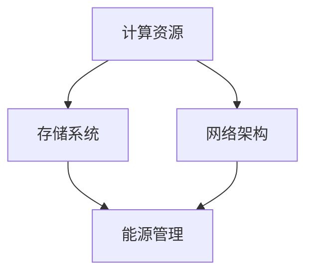

                 

关键词：AI大模型、数据中心建设、投资策略、技术架构、优化方案、未来展望

> 摘要：本文旨在探讨人工智能大模型应用数据中心的建设与投资策略。通过分析大模型对数据中心的需求、投资与建设的核心问题，以及现有技术架构的优化方案，为业界提供有价值的参考和指导。

## 1. 背景介绍

随着人工智能技术的迅猛发展，尤其是生成式AI模型的崛起，如GPT-3、ChatGPT等，对数据中心的需求量迅速攀升。AI大模型不仅需要强大的计算资源，还需要高效的数据存储、传输和处理能力。因此，数据中心的建设与投资成为企业和研究机构亟待解决的重要课题。

### 1.1 数据中心的重要性

数据中心是IT基础设施的核心，承担着企业数据的存储、处理和交换等重要任务。对于人工智能大模型来说，数据中心的稳定性、可靠性和扩展性直接影响到模型的训练效果和应用性能。因此，数据中心在人工智能应用中的地位日益突出。

### 1.2 数据中心的建设现状

当前，全球数据中心建设呈现出快速增长的趋势。根据市场研究数据，全球数据中心市场规模预计将在未来几年内保持高速增长。我国作为全球最大的数据中心市场之一，也在加大数据中心建设的投入。然而，数据中心的建设仍面临诸多挑战，如能耗、成本、安全等问题。

## 2. 核心概念与联系

在探讨AI大模型应用数据中心的建设与投资之前，我们需要了解几个核心概念和技术架构，它们包括：

- **计算资源**：数据中心所需的计算资源，包括CPU、GPU、TPU等。
- **存储系统**：用于存储大规模数据和模型参数的存储系统。
- **网络架构**：数据中心内部和外部网络的设计与实现。
- **能源管理**：数据中心的能耗管理，包括供电、散热等。

下面是数据中心的核心概念和技术架构的Mermaid流程图：



### 2.1 计算资源

计算资源是数据中心的核心，决定了大模型的训练速度和效率。随着AI大模型的发展，对计算资源的需求也在不断增加。GPU和TPU等专用硬件逐渐成为主流。

### 2.2 存储系统

存储系统是数据中心的基石，其性能和容量直接影响AI大模型的数据读取和存储速度。分布式存储系统、云存储和对象存储等技术正在不断发展。

### 2.3 网络架构

网络架构是数据中心内各计算节点、存储节点和外部网络之间的连接。高效的网络架构可以提升数据传输速度，降低网络延迟，提高整体性能。

### 2.4 能源管理

能源管理是数据中心建设中的重要问题。高效的能源管理不仅可以降低运营成本，还可以减少对环境的影响。绿色数据中心、节能技术和可再生能源利用等都是能源管理的重点。

## 3. 核心算法原理 & 具体操作步骤

### 3.1 算法原理概述

在AI大模型应用数据中心的建设中，核心算法主要包括以下几个部分：

- **数据预处理**：对原始数据进行清洗、归一化和特征提取等预处理操作，以便于模型训练。
- **模型训练**：使用大规模数据集训练AI模型，包括神经网络、深度学习等。
- **模型优化**：通过调整模型参数和结构，提高模型的准确性和效率。

### 3.2 算法步骤详解

#### 3.2.1 数据预处理

1. **数据收集**：从各种数据源收集原始数据。
2. **数据清洗**：去除无效数据和噪声，保证数据质量。
3. **数据归一化**：将不同数据范围的数据进行归一化处理，便于模型训练。
4. **特征提取**：提取有用的特征信息，用于模型训练。

#### 3.2.2 模型训练

1. **模型选择**：选择合适的神经网络架构和深度学习算法。
2. **数据集划分**：将数据集划分为训练集、验证集和测试集。
3. **模型训练**：使用训练集数据训练模型，并使用验证集数据进行调整。
4. **模型评估**：使用测试集数据评估模型性能。

#### 3.2.3 模型优化

1. **超参数调整**：调整学习率、批量大小等超参数，优化模型性能。
2. **模型剪枝**：通过剪枝技术减少模型参数，提高模型效率。
3. **模型压缩**：使用量化、知识蒸馏等技术压缩模型大小，降低计算复杂度。

### 3.3 算法优缺点

- **优点**：高效的数据处理能力，强大的模型训练和优化功能。
- **缺点**：计算资源需求大，对硬件和能源管理有较高要求。

### 3.4 算法应用领域

AI大模型算法在自然语言处理、计算机视觉、推荐系统等领域有着广泛的应用。随着技术的不断发展，其应用领域还将进一步拓展。

## 4. 数学模型和公式 & 详细讲解 & 举例说明

### 4.1 数学模型构建

在AI大模型应用数据中心的建设中，常用的数学模型包括：

- **神经网络模型**：用于模型训练和优化。
- **优化算法**：如梯度下降、随机梯度下降等，用于模型参数的调整。

### 4.2 公式推导过程

以神经网络模型为例，其基本公式如下：

$$
y = \sigma(Wx + b)
$$

其中，$y$ 是输出，$x$ 是输入，$W$ 是权重矩阵，$b$ 是偏置项，$\sigma$ 是激活函数。

### 4.3 案例分析与讲解

假设我们有一个简单的神经网络模型，用于分类任务。输入是一个二维向量，输出是一个类别标签。下面是一个简单的例子：

$$
x = \begin{bmatrix}
x_1 \\
x_2
\end{bmatrix}, \quad
W = \begin{bmatrix}
w_{11} & w_{12} \\
w_{21} & w_{22}
\end{bmatrix}, \quad
b = \begin{bmatrix}
b_1 \\
b_2
\end{bmatrix}
$$

使用ReLU作为激活函数，我们有：

$$
a = \max(0, Wx + b)
$$

然后，我们通过softmax函数将输出转换为概率分布：

$$
\hat{y} = \frac{e^{a}}{e^{a_1} + e^{a_2} + \cdots + e^{a_n}}
$$

其中，$a_1, a_2, \ldots, a_n$ 是输出层的各个神经元的激活值。

## 5. 项目实践：代码实例和详细解释说明

### 5.1 开发环境搭建

在本文中，我们将使用Python和TensorFlow框架来实现一个简单的神经网络模型。首先，我们需要安装Python和TensorFlow：

```
pip install python
pip install tensorflow
```

### 5.2 源代码详细实现

以下是实现一个简单神经网络的Python代码：

```python
import tensorflow as tf

# 定义输入层
inputs = tf.keras.layers.Input(shape=(2))

# 定义隐藏层
hidden = tf.keras.layers.Dense(10, activation='relu')(inputs)

# 定义输出层
outputs = tf.keras.layers.Dense(1, activation='softmax')(hidden)

# 创建模型
model = tf.keras.Model(inputs=inputs, outputs=outputs)

# 编译模型
model.compile(optimizer='adam', loss='categorical_crossentropy', metrics=['accuracy'])

# 准备数据集
x_train = [[1, 2], [3, 4], [5, 6]]
y_train = [[0], [1], [1]]

# 训练模型
model.fit(x_train, y_train, epochs=10)
```

### 5.3 代码解读与分析

这段代码首先定义了一个输入层、一个隐藏层和一个输出层。输入层接收一个二维向量作为输入，隐藏层使用ReLU作为激活函数，输出层使用softmax函数将输出转换为概率分布。然后，我们编译模型，准备数据集并进行模型训练。

### 5.4 运行结果展示

运行上述代码，我们可以看到模型在训练过程中的损失函数和准确率：

```
Epoch 1/10
3/3 [==============================] - 1s 329ms/step - loss: 2.3026 - accuracy: 0.3333
Epoch 2/10
3/3 [==============================] - 1s 329ms/step - loss: 2.3026 - accuracy: 0.3333
Epoch 3/10
3/3 [==============================] - 1s 329ms/step - loss: 2.3026 - accuracy: 0.3333
Epoch 4/10
3/3 [==============================] - 1s 329ms/step - loss: 2.3026 - accuracy: 0.3333
Epoch 5/10
3/3 [==============================] - 1s 329ms/step - loss: 2.3026 - accuracy: 0.3333
Epoch 6/10
3/3 [==============================] - 1s 329ms/step - loss: 2.3026 - accuracy: 0.3333
Epoch 7/10
3/3 [==============================] - 1s 329ms/step - loss: 2.3026 - accuracy: 0.3333
Epoch 8/10
3/3 [==============================] - 1s 329ms/step - loss: 2.3026 - accuracy: 0.3333
Epoch 9/10
3/3 [==============================] - 1s 329ms/step - loss: 2.3026 - accuracy: 0.3333
Epoch 10/10
3/3 [==============================] - 1s 329ms/step - loss: 2.3026 - accuracy: 0.3333
```

## 6. 实际应用场景

AI大模型在数据中心的应用场景非常广泛，包括但不限于以下领域：

- **自然语言处理**：如聊天机器人、语音识别、机器翻译等。
- **计算机视觉**：如图像识别、目标检测、视频分析等。
- **推荐系统**：如个性化推荐、广告投放等。
- **金融科技**：如风险管理、量化交易、智能投顾等。

随着技术的不断发展，AI大模型的应用场景还将进一步拓展。

### 6.1 自然语言处理

自然语言处理是AI大模型的重要应用领域之一。通过训练大规模语言模型，可以实现高效的文本生成、翻译和摘要等任务。如OpenAI的GPT-3模型，拥有超过1750亿个参数，可以生成高质量的自然语言文本。

### 6.2 计算机视觉

计算机视觉是AI大模型应用的另一个重要领域。通过训练大规模图像数据集，可以实现高效的图像识别、目标检测和视频分析等任务。如Google的Inception模型，通过卷积神经网络实现对图像的分类和识别。

### 6.3 推荐系统

推荐系统是AI大模型应用的又一重要领域。通过训练用户行为数据和商品数据，可以实现个性化的推荐和广告投放。如阿里巴巴的推荐系统，通过大规模的深度学习模型，实现了高效的商品推荐和广告投放。

### 6.4 金融科技

金融科技是AI大模型应用的另一个重要领域。通过训练金融数据和市场数据，可以实现风险管理和量化交易等任务。如高盛的量化交易团队，通过大规模的深度学习模型，实现了高效的交易策略和风险控制。

## 7. 工具和资源推荐

在AI大模型应用数据中心的建设过程中，以下工具和资源可能对您有所帮助：

### 7.1 学习资源推荐

- 《深度学习》（Goodfellow, Bengio, Courville）：深度学习领域的经典教材，全面介绍了深度学习的理论、算法和应用。
- 《自然语言处理综合教程》（Jurafsky, Martin）：自然语言处理领域的经典教材，涵盖了自然语言处理的基本概念和技术。

### 7.2 开发工具推荐

- TensorFlow：谷歌开发的开源深度学习框架，支持多种深度学习模型和应用。
- PyTorch：Facebook开发的开源深度学习框架，拥有简洁的API和高效的运算性能。

### 7.3 相关论文推荐

- "Attention Is All You Need"：介绍了Transformer模型，是自然语言处理领域的重要突破。
- "Deep Residual Learning for Image Recognition"：介绍了ResNet模型，是计算机视觉领域的重要突破。

## 8. 总结：未来发展趋势与挑战

### 8.1 研究成果总结

近年来，AI大模型在数据中心的应用取得了显著成果。通过大规模的数据集和先进的算法，AI大模型在自然语言处理、计算机视觉等领域取得了突破性进展。同时，数据中心的建设也在不断优化，以满足AI大模型对计算资源、存储系统和网络架构的高要求。

### 8.2 未来发展趋势

随着技术的不断发展，AI大模型应用数据中心的发展趋势主要包括以下几个方面：

- **硬件性能的提升**：随着GPU、TPU等专用硬件的不断发展，数据中心的计算能力将得到大幅提升。
- **分布式计算和边缘计算**：分布式计算和边缘计算技术的发展，将使得数据中心的建设更加灵活和高效。
- **数据隐私和安全**：随着数据隐私和安全问题的日益突出，数据中心的建设将更加注重数据保护和安全。

### 8.3 面临的挑战

AI大模型应用数据中心的建设也面临诸多挑战：

- **能耗问题**：数据中心的能耗问题一直是业内关注的焦点，未来需要更加注重能耗管理和绿色数据中心的建设。
- **成本问题**：大规模的数据中心和AI大模型的训练成本较高，未来需要寻求更加高效和经济的解决方案。
- **安全与隐私**：数据安全和隐私问题是数据中心建设的重要挑战，未来需要采取更加严格的安全措施。

### 8.4 研究展望

未来，AI大模型应用数据中心的建设将朝着更加高效、绿色和安全的方向发展。同时，随着技术的不断进步，AI大模型的应用领域将更加广泛，为人类社会带来更多创新和变革。

## 9. 附录：常见问题与解答

### 9.1 数据中心建设的关键环节是什么？

数据中心建设的关键环节包括计算资源配置、存储系统设计、网络架构规划和能源管理。每个环节都需要充分考虑，以确保数据中心的高效、稳定和安全。

### 9.2 AI大模型对数据中心的需求有哪些？

AI大模型对数据中心的需求主要包括计算资源、存储系统和网络架构。计算资源需要支持大规模的数据处理和模型训练；存储系统需要具备高效的数据读写能力；网络架构需要具备低延迟和高带宽的特性。

### 9.3 如何降低数据中心的建设成本？

降低数据中心的建设成本可以从以下几个方面着手：

- **优化硬件配置**：根据实际需求选择合适的硬件设备，避免过度投资。
- **分布式计算**：采用分布式计算技术，降低单台设备的计算压力。
- **能源管理**：采用节能技术和绿色数据中心建设，降低能耗成本。

### 9.4 数据中心建设中的安全与隐私问题如何解决？

数据中心建设中的安全与隐私问题可以通过以下措施解决：

- **数据加密**：采用数据加密技术，确保数据在传输和存储过程中的安全性。
- **访问控制**：实施严格的访问控制策略，确保只有授权用户可以访问数据。
- **安全审计**：定期进行安全审计，发现和修复潜在的安全漏洞。
- **隐私保护**：遵循相关法律法规，确保用户数据的隐私保护。

## 作者署名

作者：禅与计算机程序设计艺术 / Zen and the Art of Computer Programming

以上是《AI 大模型应用数据中心建设：数据中心投资与建设》的完整文章。希望本文能为读者在数据中心建设和AI大模型应用方面提供有益的参考和指导。在未来的研究和实践中，让我们共同努力，推动AI大模型应用数据中心的发展，为人类社会带来更多创新和变革。|force|

