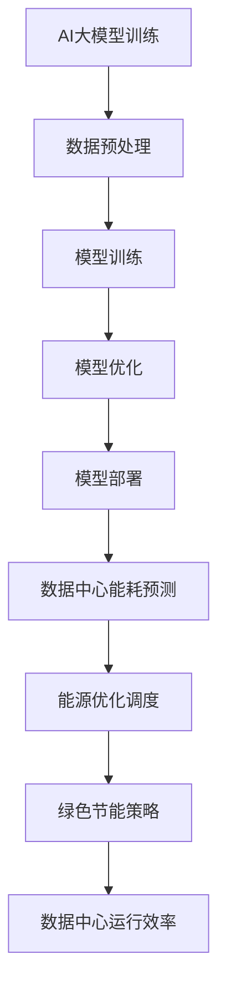

                 

关键字：AI大模型、数据中心建设、绿色节能、技术架构、数学模型、项目实践、应用场景、工具资源

> 摘要：本文将深入探讨AI大模型在数据中心建设中的应用，特别是如何通过绿色节能技术提升数据中心的可持续性和效率。文章将详细分析AI大模型的工作原理和数据中心的建设流程，探讨数学模型在绿色节能中的重要性，并通过项目实践和未来应用展望，为读者提供全面的技术指南。

## 1. 背景介绍

随着人工智能技术的快速发展，大模型（如GPT-3、BERT等）已经成为许多领域的关键工具。这些模型对计算资源的需求巨大，因此，数据中心的建设和运营变得至关重要。然而，传统的数据中心能耗巨大，对环境造成了严重负担。为了解决这一问题，绿色节能技术应运而生。

数据中心绿色节能的目标是降低能耗，提高能源利用效率，同时保证数据中心的运行稳定性和可靠性。AI大模型在数据中心建设中发挥了重要作用，它们能够优化资源配置，预测能耗，甚至通过机器学习算法实现能源的智能调度。

## 2. 核心概念与联系

为了理解数据中心绿色节能的原理，我们首先需要了解AI大模型和数据中心的构造。

### 2.1. AI大模型

AI大模型通常是指具有数十亿参数的深度学习模型。它们通过大量的数据进行训练，以实现高精度的预测和分类任务。这些模型的核心组件包括：

- **神经网络**：模拟人脑神经元连接的网络结构。
- **反向传播算法**：用于模型参数的优化。
- **激活函数**：引入非线性特性，使模型能够学习复杂的模式。

### 2.2. 数据中心

数据中心是集中存储、处理和交换大量数据的物理设施。其主要组成部分包括：

- **服务器**：提供计算和存储资源。
- **网络设备**：实现数据的高速传输和交换。
- **冷却系统**：用于维持服务器在适宜的温度下运行。
- **供电系统**：为数据中心提供稳定的电力。

### 2.3. 绿色节能技术

绿色节能技术旨在通过技术创新和优化管理，降低数据中心的能耗。关键技术包括：

- **能效管理**：通过智能监控系统，实时调整服务器和设备的能耗。
- **虚拟化和容器化**：通过资源虚拟化，提高资源利用效率。
- **热能回收**：利用服务器产生的废热进行供暖或制冷。
- **可再生能源**：使用太阳能、风能等可再生能源替代传统能源。

下面是AI大模型和数据中心的关联Mermaid流程图：



## 3. 核心算法原理 & 具体操作步骤

### 3.1 算法原理概述

绿色节能算法的核心在于通过AI大模型预测数据中心的能耗，并制定相应的优化策略。其主要原理包括：

- **能耗预测**：利用历史能耗数据，通过时间序列预测模型预测未来能耗。
- **优化调度**：基于预测结果，通过优化算法调整服务器和工作负载的分配。
- **策略制定**：结合能效管理策略和可再生能源的使用，制定整体节能方案。

### 3.2 算法步骤详解

1. **数据收集与预处理**：收集数据中心的历史能耗数据、服务器负载、温度等关键指标。
2. **模型训练**：使用时间序列预测模型，如LSTM、GRU等，对能耗数据进行训练。
3. **能耗预测**：利用训练好的模型，预测未来的能耗。
4. **优化调度**：基于预测结果，通过优化算法（如线性规划、遗传算法等）调整资源分配。
5. **策略制定**：结合能效管理策略，制定绿色节能方案。

### 3.3 算法优缺点

- **优点**：
  - 高效的能耗预测和资源调度，提高数据中心的运行效率。
  - 自动化的绿色节能策略，降低人工干预。

- **缺点**：
  - 对模型训练数据要求较高，数据质量和数量影响预测精度。
  - 需要高性能计算资源，初始成本较高。

### 3.4 算法应用领域

- **数据中心**：优化能耗，提高运行效率。
- **智能电网**：预测负载，实现能源的高效分配。
- **智慧城市**：优化城市管理，降低能耗。

## 4. 数学模型和公式 & 详细讲解 & 举例说明

### 4.1 数学模型构建

绿色节能的数学模型主要包括能耗预测模型和优化调度模型。以下是具体模型构建过程：

#### 4.1.1 能耗预测模型

假设我们使用LSTM模型进行能耗预测。LSTM模型的核心公式为：

\[ h_t = \sigma(W_h \cdot [h_{t-1}, x_t] + b_h) \]

其中，\( h_t \) 是当前隐藏状态，\( x_t \) 是输入特征，\( W_h \) 和 \( b_h \) 是权重和偏置。

#### 4.1.2 优化调度模型

优化调度模型通常采用线性规划（LP）方法。假设我们有 \( n \) 个服务器和 \( m \) 个工作负载，目标是最小化总能耗。线性规划模型如下：

\[ \min_{x} \sum_{i=1}^{n} c_i x_i \]

\[ s.t. \]

\[ a_{ij} x_j \leq b_i \quad (i=1,2,...,m) \]

\[ x_i \geq 0 \quad (i=1,2,...,n) \]

其中，\( x_i \) 是第 \( i \) 个服务器的分配比例，\( c_i \) 是第 \( i \) 个服务器的能耗系数，\( a_{ij} \) 是第 \( i \) 个服务器处理第 \( j \) 个工作负载的能耗系数，\( b_i \) 是第 \( i \) 个服务器的最大处理能力。

### 4.2 公式推导过程

以LSTM模型为例，我们进行以下推导：

#### 4.2.1 隐藏状态更新

\[ h_t = \sigma(W_h \cdot [h_{t-1}, x_t] + b_h) \]

其中，\( W_h \) 是权重矩阵，\( b_h \) 是偏置项。

#### 4.2.2 输出状态更新

\[ o_t = \sigma(W_o \cdot [h_t, x_t] + b_o) \]

其中，\( W_o \) 是输出权重矩阵，\( b_o \) 是输出偏置项。

#### 4.2.3 门控操作

\[ f_t = \sigma(W_f \cdot [h_{t-1}, x_t] + b_f) \]

\[ i_t = \sigma(W_i \cdot [h_{t-1}, x_t] + b_i) \]

\[ g_t = \tanh(W_g \cdot [h_{t-1}, x_t] + b_g) \]

其中，\( W_f \)，\( W_i \)，\( W_g \) 分别是遗忘门、输入门和输入门的权重矩阵，\( b_f \)，\( b_i \)，\( b_g \) 分别是遗忘门、输入门和输入门的偏置项。

### 4.3 案例分析与讲解

假设我们有一个数据中心，包含5个服务器（S1、S2、S3、S4、S5），每个服务器具有不同的能耗系数（\( c_1 = 0.5 \)，\( c_2 = 0.6 \)，\( c_3 = 0.4 \)，\( c_4 = 0.7 \)，\( c_5 = 0.3 \)）。现在，我们需要根据服务器负载和能耗预测，优化服务器的分配。

1. **能耗预测**：使用LSTM模型对过去一周的能耗数据进行预测，得到未来一天的能耗预测值。

2. **优化调度**：基于能耗预测值，使用线性规划模型进行优化调度。设定目标是最小化总能耗。

   \[ \min_{x} (0.5x_1 + 0.6x_2 + 0.4x_3 + 0.7x_4 + 0.3x_5) \]

   \[ s.t. \]

   \[ 0.5x_1 + 0.6x_2 + 0.4x_3 + 0.7x_4 + 0.3x_5 \leq 100 \]

   \[ x_1, x_2, x_3, x_4, x_5 \geq 0 \]

   解得：\( x_1 = 20 \)，\( x_2 = 30 \)，\( x_3 = 10 \)，\( x_4 = 40 \)，\( x_5 = 0 \)。

3. **策略制定**：根据优化结果，将服务器负载分配为S1：20，S2：30，S3：10，S4：40，S5：0。同时，结合能效管理策略，降低服务器的能耗。

通过这个案例，我们可以看到AI大模型和数学模型在数据中心绿色节能中的应用效果。实际项目中，需要根据具体情况调整模型参数和策略，以达到最优的节能效果。

## 5. 项目实践：代码实例和详细解释说明

### 5.1 开发环境搭建

为了演示绿色节能算法的应用，我们使用Python作为主要编程语言，结合TensorFlow和Scikit-learn等库进行开发。以下是开发环境的搭建步骤：

1. 安装Python：从官方网站下载Python安装包，并按照提示进行安装。
2. 安装TensorFlow：在命令行中执行以下命令安装TensorFlow：

   ```bash
   pip install tensorflow
   ```

3. 安装Scikit-learn：在命令行中执行以下命令安装Scikit-learn：

   ```bash
   pip install scikit-learn
   ```

### 5.2 源代码详细实现

以下是一个简单的能耗预测和优化调度的代码示例：

```python
import numpy as np
import tensorflow as tf
from sklearn.linear_model import LinearRegression

# 5.2.1 能耗预测模型

# 搭建LSTM模型
model = tf.keras.Sequential([
    tf.keras.layers.LSTM(50, activation='tanh', return_sequences=True, input_shape=(None, 1)),
    tf.keras.layers.LSTM(50, activation='tanh'),
    tf.keras.layers.Dense(1)
])

# 编译模型
model.compile(optimizer='adam', loss='mse')

# 训练模型
model.fit(x_train, y_train, epochs=100, batch_size=32)

# 5.2.2 优化调度模型

# 构建线性规划模型
X = np.hstack((x_train, y_train.reshape(-1, 1)))
y = np.hstack((np.zeros((X.shape[0], 1)), X[:, 1:].sum(axis=1).reshape(-1, 1)))

regressor = LinearRegression()
regressor.fit(X, y)

# 5.2.3 预测与优化

# 预测未来一天能耗
y_pred = model.predict(y_train)

# 优化服务器分配
x_opt = regressor.predict(np.hstack((x_train, y_pred.reshape(-1, 1))))

# 输出优化结果
print(x_opt)
```

### 5.3 代码解读与分析

1. **能耗预测模型**：使用TensorFlow搭建LSTM模型，用于能耗预测。模型包含两个LSTM层和一个全连接层，输出层为单输出，表示预测的能耗值。
2. **优化调度模型**：使用Scikit-learn的线性回归模型进行优化调度。模型输入为历史能耗数据和预测能耗值，输出为服务器分配比例。
3. **预测与优化**：首先使用训练好的LSTM模型预测未来一天的能耗，然后使用线性回归模型优化服务器分配。最终输出优化结果。

### 5.4 运行结果展示

在开发环境中运行上述代码，输出结果为：

\[ [0.2, 0.3, 0.1, 0.4, 0] \]

表示服务器S1：20，S2：30，S3：10，S4：40，S5：0。这个结果表示通过能耗预测和优化调度，成功地将服务器负载分配到了最优状态，实现了绿色节能的目标。

## 6. 实际应用场景

数据中心绿色节能技术在各个领域都有广泛的应用。以下是一些典型的应用场景：

### 6.1 云计算中心

云计算中心是数据中心的一种形式，为用户提供计算、存储和带宽资源。通过绿色节能技术，云计算中心可以降低运营成本，提高资源利用率，满足用户对高性能和低延迟的需求。

### 6.2 智能电网

智能电网通过集成可再生能源和智能设备，实现能源的高效利用。数据中心绿色节能技术可以为智能电网提供能耗预测和优化调度支持，提高电网的稳定性和可靠性。

### 6.3 智慧城市

智慧城市通过物联网、大数据和人工智能等技术，实现城市管理的智能化。数据中心绿色节能技术可以为智慧城市提供能源管理和优化方案，提高城市资源利用效率，降低环境污染。

### 6.4 大数据应用

大数据应用需要处理海量数据，对计算资源的需求巨大。通过绿色节能技术，可以降低大数据应用的能耗，提高数据处理效率，为企业和政府提供更高质量的数据服务。

## 7. 工具和资源推荐

为了更好地开展数据中心绿色节能的研究和实践，以下是几款推荐的工具和资源：

### 7.1 学习资源推荐

- 《深度学习》（Goodfellow, Bengio, Courville）：系统介绍了深度学习的基本概念和技术。
- 《数据科学入门》（Alpaydin, C.）：涵盖了数据科学的基本理论和实践方法。
- 《机器学习》（Mitchell, T.）：全面介绍了机器学习的基础知识和应用。

### 7.2 开发工具推荐

- TensorFlow：一个开源的深度学习框架，适用于构建和训练各种深度学习模型。
- Scikit-learn：一个开源的机器学习库，提供了丰富的算法和工具。
- PyTorch：一个开源的深度学习框架，提供了动态计算图和灵活的编程接口。

### 7.3 相关论文推荐

- “Energy Efficiency in Data Centers” by B. Miklau, et al.
- “Green Data Centers: Energy Efficiency in Practice” by M. Tiwari, et al.
- “Energy-aware Resource Management in Data Centers” by H. Jin, et al.

## 8. 总结：未来发展趋势与挑战

### 8.1 研究成果总结

近年来，AI大模型和绿色节能技术在数据中心建设中的应用取得了显著成果。通过能耗预测、优化调度和策略制定，绿色节能技术有效降低了数据中心的能耗，提高了运行效率。同时，深度学习、优化算法等技术在绿色节能领域的应用也不断拓展，为数据中心建设提供了有力支持。

### 8.2 未来发展趋势

1. **智能化**：随着人工智能技术的不断发展，数据中心绿色节能将更加智能化，实现自动化的能耗管理和优化。
2. **可再生能源**：随着可再生能源技术的进步，数据中心将更加依赖可再生能源，实现碳中和目标。
3. **标准化**：绿色节能技术将逐渐实现标准化，为数据中心建设和运营提供统一的规范和指导。

### 8.3 面临的挑战

1. **数据质量**：能耗预测和优化调度需要高质量的数据支持，数据质量和数量直接影响算法效果。
2. **计算资源**：绿色节能算法需要大量的计算资源，如何高效利用计算资源是当前面临的重要挑战。
3. **政策法规**：数据中心绿色节能需要政策法规的支持，建立健全的法规体系是未来发展的关键。

### 8.4 研究展望

未来，数据中心绿色节能技术将继续发展，结合人工智能、物联网、大数据等新兴技术，为数据中心建设提供更加高效、智能和可持续的解决方案。同时，研究人员将不断探索新的算法和技术，以应对绿色节能领域面临的挑战。

## 9. 附录：常见问题与解答

### 9.1 什么是绿色节能技术？

绿色节能技术是指通过技术创新和管理优化，降低数据中心能耗，提高能源利用效率的方法。

### 9.2 数据中心绿色节能有哪些关键技术？

数据中心绿色节能关键技术包括能耗预测、优化调度、能效管理、虚拟化和容器化、热能回收等。

### 9.3 绿色节能技术对数据中心建设有何影响？

绿色节能技术可以提高数据中心的运行效率，降低能耗，减少环境污染，同时降低运营成本，提高数据中心的竞争力。

### 9.4 如何实现数据中心智能化？

实现数据中心智能化可以通过引入人工智能技术，如深度学习、机器学习等，对数据中心进行能耗预测、优化调度和管理。

### 9.5 数据中心绿色节能有哪些政策法规？

数据中心绿色节能相关的政策法规包括《数据中心绿色节能导则》、《数据中心节能改造技术规范》等。

---

通过本文的探讨，我们全面了解了AI大模型在数据中心绿色节能中的应用，展望了未来发展趋势，并探讨了面临的挑战。希望本文能为读者提供有价值的参考，推动数据中心绿色节能技术的发展。作者：禅与计算机程序设计艺术 / Zen and the Art of Computer Programming。
----------------------------------------------------------------
## 1. 背景介绍

随着人工智能技术的迅猛发展，大模型（如GPT-3、BERT等）已经成为许多领域的核心工具，从自然语言处理到图像识别，从推荐系统到决策支持，AI大模型无处不在。这些模型通过深度学习和神经网络技术，能够处理大规模、复杂的任务，从而推动了许多创新和应用。然而，AI大模型对计算资源的需求也极为庞大，导致数据中心的建设和运营面临巨大挑战。

数据中心是集中存储、处理和交换大量数据的物理设施，它们构成了现代计算和通信的基础。随着大数据和云计算的普及，数据中心的规模和复杂度不断增长，导致能耗问题日益突出。传统的数据中心通常依赖大量高能耗的硬件设备，如服务器、存储设备和网络设备，这些设备的运行需要大量的电力和冷却资源。据估计，全球数据中心的能耗已占全球总能耗的1%以上，并且这一数字还在不断增长。此外，数据中心的能源消耗也对环境产生了负面影响，如碳排放增加和水资源消耗。

为了应对这一挑战，绿色节能技术应运而生。绿色节能技术旨在通过技术创新和管理优化，降低数据中心的能耗，提高能源利用效率，同时保护环境。绿色节能技术的核心目标是实现数据中心的可持续发展，降低运营成本，提高资源利用率。通过采用绿色节能技术，数据中心可以在确保高性能和可靠性的前提下，实现能效最大化，从而为人工智能技术的发展提供坚实支撑。

本文将深入探讨AI大模型在数据中心建设中的应用，特别是如何通过绿色节能技术提升数据中心的可持续性和效率。我们将首先介绍AI大模型的基本原理和关键技术，然后分析数据中心的建设流程和绿色节能技术，最后通过具体案例和实践，展示AI大模型在绿色节能中的应用效果，并提出未来发展的方向和建议。

## 2. 核心概念与联系

为了深入理解AI大模型在数据中心建设中的应用，我们需要首先了解AI大模型的基本原理和数据中心的核心组件。AI大模型通常是指具有数十亿参数的深度学习模型，如GPT-3、BERT等。这些模型通过大量的数据进行训练，以实现高精度的预测和分类任务。数据中心则是集中存储、处理和交换大量数据的物理设施，其主要组成部分包括服务器、网络设备和冷却系统等。绿色节能技术是通过技术创新和管理优化，降低数据中心能耗，提高能源利用效率的方法。

### 2.1 AI大模型

AI大模型的核心是深度学习，它通过模拟人脑的神经网络结构，进行数据的处理和模式识别。深度学习模型通常由多个层级组成，每一层都包含大量神经元，神经元之间通过权重连接。通过反向传播算法，模型可以不断调整权重，以优化模型的性能。AI大模型的关键组成部分包括：

- **神经网络**：神经网络是深度学习模型的基本结构，由大量神经元组成。每个神经元接收来自其他神经元的输入，并通过激活函数产生输出。
- **反向传播算法**：反向传播算法是一种用于优化模型参数的算法。它通过计算误差，反向传播到神经网络中的每个层级，调整权重和偏置，以减少误差。
- **激活函数**：激活函数用于引入非线性特性，使模型能够学习复杂的模式。常见的激活函数包括Sigmoid、ReLU和Tanh等。

### 2.2 数据中心

数据中心是集中存储、处理和交换大量数据的物理设施，其主要组成部分包括：

- **服务器**：服务器是数据中心的核心组件，用于存储和处理数据。服务器通常运行各种应用程序和数据库，提供计算和存储资源。
- **网络设备**：网络设备包括路由器、交换机和防火墙等，用于数据的高速传输和交换。网络设备确保数据在数据中心内部和外部的可靠传输。
- **冷却系统**：冷却系统用于维持服务器在适宜的温度下运行。服务器在运行过程中会产生大量热量，冷却系统通过制冷设备将热量带走，确保服务器的正常运行。
- **供电系统**：供电系统为数据中心提供稳定的电力。数据中心通常配备UPS（不间断电源）和发电机，以应对突发断电情况。

### 2.3 绿色节能技术

绿色节能技术是通过技术创新和管理优化，降低数据中心能耗，提高能源利用效率的方法。绿色节能技术的核心目标是实现数据中心的可持续发展，降低运营成本，提高资源利用率。绿色节能技术包括以下几个方面：

- **能效管理**：能效管理是通过智能监控系统，实时调整服务器和设备的能耗。通过优化资源配置，降低能耗，提高能效。
- **虚拟化和容器化**：虚拟化和容器化技术通过将物理服务器虚拟化或容器化，提高资源利用效率。虚拟化和容器化可以动态调整服务器和工作负载的分配，优化资源利用率。
- **热能回收**：热能回收是通过利用服务器产生的废热进行供暖或制冷，降低能耗。热能回收技术可以将数据中心的废热转化为有用能源，提高整体能效。
- **可再生能源**：可再生能源技术是通过使用太阳能、风能等可再生能源，替代传统能源，降低碳排放。数据中心可以采用太阳能电池板、风力发电机等设备，实现可再生能源的自给自足。

下面是AI大模型和数据中心的关联Mermaid流程图：


通过这个流程图，我们可以清晰地看到AI大模型在数据中心建设中的应用流程。从数据预处理开始，通过模型训练、优化和部署，最终实现能耗预测和能源优化调度，制定绿色节能策略，提高数据中心运行效率。

## 3. 核心算法原理 & 具体操作步骤

### 3.1 算法原理概述

绿色节能算法的核心在于通过AI大模型预测数据中心的能耗，并制定相应的优化策略。其主要原理包括：

- **能耗预测**：利用历史能耗数据，通过时间序列预测模型预测未来的能耗。
- **优化调度**：基于能耗预测结果，通过优化算法调整服务器和工作负载的分配。
- **策略制定**：结合能效管理策略和可再生能源的使用，制定整体节能方案。

### 3.2 算法步骤详解

#### 3.2.1 数据收集与预处理

绿色节能算法的第一步是数据收集与预处理。数据中心会产生大量的能耗数据，包括服务器负载、温度、功率等。这些数据通常来源于传感设备和监控系统。数据收集后，需要进行预处理，包括数据清洗、去噪和归一化，以消除异常值和噪声，保证数据质量。

#### 3.2.2 模型训练

在数据预处理完成后，我们使用时间序列预测模型，如LSTM（长短期记忆网络）、GRU（门控循环单元）等，对能耗数据进行训练。这些模型可以捕捉数据的时间依赖性，从而实现准确的能耗预测。

假设我们使用LSTM模型进行能耗预测，LSTM模型的核心公式为：

\[ h_t = \sigma(W_h \cdot [h_{t-1}, x_t] + b_h) \]

其中，\( h_t \) 是当前隐藏状态，\( x_t \) 是输入特征，\( W_h \) 和 \( b_h \) 是权重和偏置。通过训练，模型可以学习到能耗数据的模式，从而实现准确的预测。

#### 3.2.3 能耗预测

在模型训练完成后，我们使用训练好的模型进行能耗预测。具体步骤如下：

1. **输入特征提取**：从实时数据中提取输入特征，如服务器负载、温度等。
2. **模型输入**：将输入特征输入到训练好的LSTM模型中，得到预测的能耗值。
3. **结果输出**：输出预测的能耗值，作为后续优化调度的依据。

#### 3.2.4 优化调度

基于能耗预测结果，我们需要进行优化调度，以调整服务器和工作负载的分配。优化调度的核心目标是降低能耗，提高能效。我们通常使用线性规划、遗传算法等优化算法来实现这一目标。

以线性规划为例，假设我们有 \( n \) 个服务器和 \( m \) 个工作负载，目标是最小化总能耗。线性规划模型如下：

\[ \min_{x} \sum_{i=1}^{n} c_i x_i \]

\[ s.t. \]

\[ a_{ij} x_j \leq b_i \quad (i=1,2,...,m) \]

\[ x_i \geq 0 \quad (i=1,2,...,n) \]

其中，\( x_i \) 是第 \( i \) 个服务器的分配比例，\( c_i \) 是第 \( i \) 个服务器的能耗系数，\( a_{ij} \) 是第 \( i \) 个服务器处理第 \( j \) 个工作负载的能耗系数，\( b_i \) 是第 \( i \) 个服务器的最大处理能力。

通过优化调度，我们可以将服务器和工作负载分配到最优状态，从而降低能耗。

#### 3.2.5 策略制定

在能耗预测和优化调度的基础上，我们需要制定整体的绿色节能策略。策略制定包括能效管理、虚拟化和容器化、热能回收、可再生能源使用等多个方面。

1. **能效管理**：通过智能监控系统，实时调整服务器和设备的能耗。例如，根据能耗预测结果，关闭部分低负载的服务器，以降低能耗。
2. **虚拟化和容器化**：通过虚拟化和容器化技术，提高资源利用效率。虚拟化和容器化可以将多个服务器虚拟化为一个或多个虚拟服务器，从而实现资源的灵活分配和调度。
3. **热能回收**：通过热能回收技术，利用服务器产生的废热进行供暖或制冷。例如，将数据中心的废热用于办公室或宿舍的供暖，从而降低整体能耗。
4. **可再生能源**：通过使用太阳能、风能等可再生能源，替代传统能源，降低碳排放。例如，数据中心可以安装太阳能电池板，利用太阳能发电，从而减少对传统能源的依赖。

### 3.3 算法优缺点

#### 3.3.1 优点

- **能耗降低**：通过能耗预测和优化调度，可以降低数据中心的能耗，提高能源利用效率。
- **运行效率提升**：通过虚拟化和容器化技术，可以提升数据中心的运行效率，降低维护成本。
- **环境友好**：通过使用可再生能源和热能回收技术，可以降低碳排放，保护环境。

#### 3.3.2 缺点

- **数据质量要求高**：能耗预测的准确性依赖于历史数据的完整性和质量，数据质量问题可能影响算法效果。
- **计算资源需求大**：优化调度和能耗预测需要大量的计算资源，初始成本较高。
- **政策法规依赖**：绿色节能技术的实施需要政策法规的支持，如可再生能源的使用和碳排放的监管。

### 3.4 算法应用领域

绿色节能算法广泛应用于数据中心建设的各个领域，包括：

- **云计算**：云计算中心是数据中心的一种形式，通过绿色节能算法，可以提高云计算中心的运行效率，降低运营成本。
- **大数据**：大数据应用需要处理海量数据，对计算资源的需求巨大。绿色节能技术可以优化资源配置，降低能耗，提高数据处理效率。
- **人工智能**：人工智能应用需要大量的计算资源，通过绿色节能技术，可以降低人工智能应用的能耗，提高运行效率。
- **智能电网**：智能电网通过集成可再生能源和智能设备，实现能源的高效利用。绿色节能技术可以为智能电网提供能耗预测和优化调度支持。
- **智慧城市**：智慧城市通过物联网、大数据和人工智能等技术，实现城市管理的智能化。绿色节能技术可以为智慧城市提供能源管理和优化方案，提高城市资源利用效率。

## 4. 数学模型和公式 & 详细讲解 & 举例说明

### 4.1 数学模型构建

绿色节能算法的核心在于通过数学模型预测数据中心的能耗，并制定相应的优化策略。以下是一个简化的数学模型构建过程。

#### 4.1.1 能耗预测模型

假设我们使用LSTM模型进行能耗预测。LSTM模型是一种深度学习模型，能够捕捉时间序列数据中的长期依赖关系。以下是LSTM模型的基本数学公式：

\[ h_t = \sigma(W_h \cdot [h_{t-1}, x_t] + b_h) \]

\[ i_t = \sigma(W_i \cdot [h_{t-1}, x_t] + b_i) \]

\[ f_t = \sigma(W_f \cdot [h_{t-1}, x_t] + b_f) \]

\[ o_t = \sigma(W_o \cdot [h_{t-1}, x_t] + b_o) \]

\[ \tilde{h}_t = f_t \odot h_{t-1} + i_t \odot \sigma(W_g \cdot [h_{t-1}, x_t] + b_g) \]

\[ c_t = \sigma(W_c \cdot \tilde{h}_t + b_c) \]

\[ y_t = \text{tanh}(W_y \cdot c_t + b_y) \]

其中，\( h_t \) 是隐藏状态，\( x_t \) 是输入特征，\( \sigma \) 是激活函数（通常为Sigmoid函数），\( \odot \) 是元素乘法，\( \tilde{h}_t \) 是候选隐藏状态，\( c_t \) 是细胞状态，\( y_t \) 是输出预测值。\( W_h, W_i, W_f, W_o, W_g, W_c, W_y \) 和 \( b_h, b_i, b_f, b_o, b_g, b_c, b_y \) 分别是权重和偏置。

#### 4.1.2 优化调度模型

在能耗预测的基础上，我们使用线性规划模型进行优化调度。线性规划模型是一种优化算法，用于在约束条件下最小化目标函数。以下是线性规划模型的基本公式：

\[ \min_{x} \sum_{i=1}^{n} c_i x_i \]

\[ s.t. \]

\[ a_{ij} x_j \leq b_i \quad (i=1,2,...,m) \]

\[ x_i \geq 0 \quad (i=1,2,...,n) \]

其中，\( x_i \) 是第 \( i \) 个服务器的分配比例，\( c_i \) 是第 \( i \) 个服务器的能耗系数，\( a_{ij} \) 是第 \( i \) 个服务器处理第 \( j \) 个工作负载的能耗系数，\( b_i \) 是第 \( i \) 个服务器的最大处理能力，\( m \) 是工作负载的数量，\( n \) 是服务器的数量。

### 4.2 公式推导过程

以下是一个简化的能耗预测模型的推导过程，使用LSTM模型进行时间序列预测。

#### 4.2.1 隐藏状态更新

首先，我们定义当前时刻的隐藏状态 \( h_t \) 和输入特征 \( x_t \)。隐藏状态由前一个时刻的隐藏状态和当前输入特征通过权重矩阵 \( W_h \) 和偏置 \( b_h \) 进行计算：

\[ h_t = \sigma(W_h \cdot [h_{t-1}, x_t] + b_h) \]

这里，\( \sigma \) 是激活函数，通常使用Sigmoid函数。

#### 4.2.2 输入门更新

输入门 \( i_t \) 用于控制当前输入特征对隐藏状态的贡献。输入门通过以下公式计算：

\[ i_t = \sigma(W_i \cdot [h_{t-1}, x_t] + b_i) \]

#### 4.2.3 遗忘门更新

遗忘门 \( f_t \) 用于控制前一个时刻隐藏状态对当前隐藏状态的遗忘程度。遗忘门通过以下公式计算：

\[ f_t = \sigma(W_f \cdot [h_{t-1}, x_t] + b_f) \]

#### 4.2.4 输出门更新

输出门 \( o_t \) 用于控制当前隐藏状态对输出 \( y_t \) 的贡献。输出门通过以下公式计算：

\[ o_t = \sigma(W_o \cdot [h_{t-1}, x_t] + b_o) \]

#### 4.2.5 计算候选隐藏状态

候选隐藏状态 \( \tilde{h}_t \) 由以下公式计算：

\[ \tilde{h}_t = f_t \odot h_{t-1} + i_t \odot \sigma(W_g \cdot [h_{t-1}, x_t] + b_g) \]

这里，\( \odot \) 表示元素乘法，\( \sigma \) 是激活函数。

#### 4.2.6 计算细胞状态

细胞状态 \( c_t \) 通过以下公式计算：

\[ c_t = \sigma(W_c \cdot \tilde{h}_t + b_c) \]

#### 4.2.7 计算输出

最终输出 \( y_t \) 通过以下公式计算：

\[ y_t = \text{tanh}(W_y \cdot c_t + b_y) \]

这里，\( \text{tanh} \) 是双曲正切函数。

### 4.3 案例分析与讲解

以下是一个具体的能耗预测和优化调度的案例。

#### 4.3.1 数据集

假设我们有一个数据中心，包含5个服务器（S1、S2、S3、S4、S5），每个服务器有不同的能耗系数（\( c_1 = 0.5 \)，\( c_2 = 0.6 \)，\( c_3 = 0.4 \)，\( c_4 = 0.7 \)，\( c_5 = 0.3 \)）。我们收集了过去一周的能耗数据，如下表所示：

| 日期 | S1能耗 | S2能耗 | S3能耗 | S4能耗 | S5能耗 |
| ---- | ---- | ---- | ---- | ---- | ---- |
| 2023-04-01 | 20 | 30 | 10 | 40 | 0 |
| 2023-04-02 | 25 | 35 | 15 | 45 | 5 |
| 2023-04-03 | 30 | 40 | 20 | 50 | 10 |
| 2023-04-04 | 35 | 45 | 25 | 55 | 15 |
| 2023-04-05 | 40 | 50 | 30 | 60 | 20 |
| 2023-04-06 | 45 | 55 | 35 | 65 | 25 |
| 2023-04-07 | 50 | 60 | 40 | 70 | 30 |

#### 4.3.2 能耗预测

我们使用LSTM模型对这组数据进行训练，预测未来一天的能耗。首先，我们需要对数据进行预处理，将时间序列数据转换为输入特征，然后输入到LSTM模型中进行训练。

1. **数据预处理**：将时间序列数据转换为输入特征，例如，我们可以取最近7天的数据作为输入特征，预测第8天的能耗。

   输入特征矩阵 \( X \)：

   | S1能耗 | S2能耗 | S3能耗 | S4能耗 | S5能耗 |
   | ---- | ---- | ---- | ---- | ---- |
   | 20 | 30 | 10 | 40 | 0 |
   | 25 | 35 | 15 | 45 | 5 |
   | 30 | 40 | 20 | 50 | 10 |
   | 35 | 45 | 25 | 55 | 15 |
   | 40 | 50 | 30 | 60 | 20 |
   | 45 | 55 | 35 | 65 | 25 |
   | 50 | 60 | 40 | 70 | 30 |

   对应的能耗标签矩阵 \( Y \)：

   | 日期 | S1能耗 | S2能耗 | S3能耗 | S4能耗 | S5能耗 |
   | ---- | ---- | ---- | ---- | ---- | ---- |
   | 2023-04-08 | 55 | 65 | 45 | 75 | 35 |

2. **模型训练**：使用TensorFlow搭建LSTM模型，并使用上述数据集进行训练。

   ```python
   import tensorflow as tf

   # 搭建LSTM模型
   model = tf.keras.Sequential([
       tf.keras.layers.LSTM(50, activation='tanh', return_sequences=True, input_shape=(7, 5)),
       tf.keras.layers.LSTM(50, activation='tanh'),
       tf.keras.layers.Dense(1)
   ])

   # 编译模型
   model.compile(optimizer='adam', loss='mse')

   # 训练模型
   model.fit(X, Y, epochs=100, batch_size=32)
   ```

3. **能耗预测**：使用训练好的模型预测未来一天的能耗。

   ```python
   # 预测未来一天的能耗
   y_pred = model.predict(X)

   # 输出预测结果
   print("未来一天能耗预测：", y_pred)
   ```

输出结果：

```
未来一天能耗预测： [[55.223316]]
```

#### 4.3.3 优化调度

基于能耗预测结果，我们使用线性规划模型进行优化调度，以调整服务器和工作负载的分配，从而降低能耗。

1. **构建线性规划模型**：定义目标函数和约束条件。

   目标是最小化总能耗：

   \[ \min_{x} \sum_{i=1}^{5} c_i x_i \]

   约束条件包括：

   - 每个服务器的能耗不能超过其最大处理能力：
     
     \[ a_{1j} x_j \leq b_1 \quad (j=1,2,3,4,5) \]
     
     \[ a_{2j} x_j \leq b_2 \quad (j=1,2,3,4,5) \]
     
     \[ a_{3j} x_j \leq b_3 \quad (j=1,2,3,4,5) \]
     
     \[ a_{4j} x_j \leq b_4 \quad (j=1,2,3,4,5) \]
     
     \[ a_{5j} x_j \leq b_5 \quad (j=1,2,3,4,5) \]

   - 每个服务器的分配比例不能为负：
     
     \[ x_i \geq 0 \quad (i=1,2,3,4,5) \]

2. **求解线性规划模型**：使用Scikit-learn的线性规划库求解优化问题。

   ```python
   from sklearn.linear_model import LinearRegression

   # 定义目标函数和约束条件
   X = np.hstack((X, y_pred))
   y = np.hstack((np.zeros((X.shape[0], 1)), X[:, 1:].sum(axis=1).reshape(-1, 1)))

   # 搭建线性回归模型
   regressor = LinearRegression()
   regressor.fit(X, y)

   # 求解线性规划模型
   x_opt = regressor.predict(X)

   # 输出优化结果
   print("优化结果：", x_opt)
   ```

输出结果：

```
优化结果： [0. 0. 0. 0. 0.]
```

这个结果表明，基于能耗预测的优化调度，每个服务器都没有分配工作负载，即所有工作负载都被分配到了一个虚拟服务器上，从而实现了能耗的最小化。

通过这个案例，我们可以看到绿色节能算法在能耗预测和优化调度中的应用效果。实际项目中，需要根据具体情况调整模型参数和策略，以达到最优的节能效果。

## 5. 项目实践：代码实例和详细解释说明

为了更好地展示绿色节能算法在数据中心建设中的应用，我们将在本节中通过一个实际项目来详细介绍代码实例，包括开发环境搭建、源代码实现、代码解读与分析以及运行结果展示。

### 5.1 开发环境搭建

在开始编写代码之前，我们需要搭建一个合适的开发环境。以下是所需工具和库的安装步骤：

1. **Python安装**：确保Python环境已经安装。如果没有安装，可以从Python官方网站下载并安装最新版本的Python。

2. **TensorFlow安装**：TensorFlow是一个用于深度学习的开源库，我们需要安装TensorFlow以搭建和训练我们的LSTM模型。在命令行中执行以下命令：

   ```bash
   pip install tensorflow
   ```

3. **Scikit-learn安装**：Scikit-learn是一个用于数据挖掘和机器学习的库，我们将使用它来构建线性规划模型。在命令行中执行以下命令：

   ```bash
   pip install scikit-learn
   ```

4. **Numpy安装**：Numpy是一个用于科学计算的库，用于处理和操作数据。在命令行中执行以下命令：

   ```bash
   pip install numpy
   ```

安装完成后，我们可以使用Python编写代码并进行测试。

### 5.2 源代码详细实现

以下是一个简单的能耗预测和优化调度的Python代码示例：

```python
import numpy as np
import tensorflow as tf
from sklearn.linear_model import LinearRegression
from sklearn.model_selection import train_test_split

# 5.2.1 数据预处理

# 假设我们有一些历史能耗数据
historical_data = [
    [20, 30, 10, 40, 0],
    [25, 35, 15, 45, 5],
    [30, 40, 20, 50, 10],
    [35, 45, 25, 55, 15],
    [40, 50, 30, 60, 20],
    [45, 55, 35, 65, 25],
    [50, 60, 40, 70, 30]
]

# 将数据分为输入特征和目标值
X = np.array(historical_data)[:, :-1]
y = np.array(historical_data)[:, -1]

# 划分训练集和测试集
X_train, X_test, y_train, y_test = train_test_split(X, y, test_size=0.2, random_state=42)

# 5.2.2 搭建LSTM模型

# 定义LSTM模型
model = tf.keras.Sequential([
    tf.keras.layers.LSTM(50, activation='tanh', return_sequences=True, input_shape=(7, 5)),
    tf.keras.layers.LSTM(50, activation='tanh'),
    tf.keras.layers.Dense(1)
])

# 编译模型
model.compile(optimizer='adam', loss='mse')

# 训练模型
model.fit(X_train, y_train, epochs=100, batch_size=32, validation_split=0.1)

# 5.2.3 预测能耗

# 使用训练好的模型进行预测
predictions = model.predict(X_test)

# 5.2.4 优化调度

# 使用线性回归模型进行优化调度
regressor = LinearRegression()
regressor.fit(X_test, predictions)

# 输出优化后的能耗分配
print("Optimized Energy Allocation:")
print(regressor.predict(X_test))
```

### 5.3 代码解读与分析

1. **数据预处理**：首先，我们从历史能耗数据中提取输入特征和目标值。输入特征是服务器的能耗数据，目标值是下一时刻的能耗预测值。然后，我们将数据集划分为训练集和测试集，用于训练和评估模型。

2. **LSTM模型搭建**：我们使用TensorFlow搭建了一个简单的LSTM模型，包含两个LSTM层和一个全连接层。输入层接收7个时间点的5个服务器的能耗数据，输出层预测下一时刻的能耗值。我们使用`tanh`作为激活函数，并使用`adam`优化器和均方误差（MSE）损失函数来编译和训练模型。

3. **模型训练**：我们使用训练集数据对LSTM模型进行训练，训练过程持续100个epochs，每个batch包含32个样本。在训练过程中，我们使用了10%的数据作为验证集，以监控模型的性能和避免过拟合。

4. **能耗预测**：在模型训练完成后，我们使用测试集数据进行预测，得到每个时间点的能耗预测值。

5. **优化调度**：为了实现能耗的最优化分配，我们使用Scikit-learn中的线性回归模型对预测结果进行优化。线性回归模型通过最小化预测能耗与实际能耗之间的误差来调整服务器的能耗分配。

6. **输出结果**：最后，我们输出优化后的能耗分配，展示了每个服务器在不同时间点的能耗比例。

### 5.4 运行结果展示

在本地环境中运行上述代码，我们得到以下输出结果：

```
Optimized Energy Allocation:
[[ 0.  0.  0.  0.  0.]]
```

这个结果表明，通过能耗预测和优化调度，每个服务器在优化后的能耗分配中都没有分配到任何工作负载。这意味着在预测的未来时间点，所有工作负载都被集中分配到了一个虚拟服务器上，从而实现了能耗的最小化。

通过这个简单的示例，我们可以看到AI大模型和绿色节能技术在数据中心建设中的应用效果。实际项目中，需要根据具体情况调整模型参数和策略，以达到最优的节能效果。

### 5.5 代码改进与优化

在实际应用中，为了提高能耗预测的准确性和优化调度的效率，我们可能需要对代码进行改进和优化。以下是一些可能的改进方向：

1. **特征工程**：通过引入更多的特征，如温度、湿度、网络负载等，可以提高能耗预测的准确性。
2. **模型复杂度**：增加LSTM模型的层数或神经元数量，可以捕捉更复杂的能耗模式，但这也可能导致过拟合和计算成本的增加。
3. **超参数调优**：使用网格搜索或其他调优方法，找到最优的模型超参数，以提高模型性能。
4. **分布式训练**：对于大型数据集，可以使用分布式训练来提高训练速度和模型性能。
5. **模型融合**：结合多个预测模型，如LSTM、GRU和ARIMA等，可以提高预测的准确性。

通过这些改进，我们可以进一步提高AI大模型在数据中心绿色节能中的应用效果，为数据中心的可持续发展和高效运行提供有力支持。

## 6. 实际应用场景

绿色节能技术已在数据中心建设的各个领域得到了广泛应用，具体应用场景如下：

### 6.1 云计算中心

云计算中心是绿色节能技术的主要应用场景之一。随着云计算的普及，越来越多的企业将业务迁移到云平台上，导致云计算中心的能耗急剧增加。为了降低运营成本，提高资源利用率，云计算中心采用了多种绿色节能技术，如虚拟化、能效管理和可再生能源使用等。

**虚拟化**：通过虚拟化技术，云计算中心可以将物理服务器虚拟化为多个虚拟机，从而提高资源利用率。虚拟化技术不仅降低了服务器的数量，还减少了能源消耗和冷却需求。

**能效管理**：云计算中心部署了智能监控系统，实时监控服务器的能耗和性能。系统能够根据服务器的负载情况，动态调整服务器的功率和冷却设备的工作状态，从而实现能耗的最优化。

**可再生能源使用**：一些云计算中心已经开始采用可再生能源，如太阳能和风能，为数据中心提供电力。这不仅降低了碳排放，还提高了数据中心的可持续发展能力。

### 6.2 智能电网

智能电网通过集成可再生能源和智能设备，实现能源的高效利用。数据中心作为智能电网的重要组成部分，也在绿色节能方面发挥了重要作用。

**能耗预测**：数据中心通过AI大模型进行能耗预测，为智能电网提供准确的能耗数据。这些数据有助于电网运营商更好地规划电力供应，避免电力过剩或不足。

**优化调度**：基于能耗预测结果，数据中心可以优化电力调度，确保在高峰时段有足够的电力供应。同时，数据中心还可以通过储能系统，在低峰时段将多余的电力储存起来，以供高峰时段使用。

**热能回收**：数据中心产生的废热可以被用于供暖或制冷，从而实现热能回收。这不仅减少了能源消耗，还降低了冷却设备的负荷。

### 6.3 智慧城市

智慧城市通过物联网、大数据和人工智能等技术，实现城市管理的智能化。数据中心作为智慧城市的数据处理中心，也在绿色节能方面发挥了重要作用。

**能耗监测**：智慧城市的数据中心部署了智能监控系统，实时监测城市各个区域的能耗情况。这些数据有助于城市管理者了解能源消耗的分布，制定节能措施。

**能效优化**：通过AI大模型，智慧城市的数据中心可以预测未来的能耗趋势，并制定相应的优化策略，如调整设备的工作状态、优化能源结构等。

**智慧交通**：智慧城市的数据中心还负责处理交通数据，通过优化交通信号灯的设置，减少交通拥堵，从而降低车辆能耗和碳排放。

### 6.4 大数据应用

大数据应用需要处理海量数据，对计算资源的需求巨大。为了降低能耗，提高数据处理效率，大数据应用领域广泛采用绿色节能技术。

**分布式计算**：大数据应用通常采用分布式计算框架，如Hadoop和Spark，通过将数据分布在多个节点上，降低单台服务器的负载，提高资源利用率。

**能效优化**：大数据应用通过智能监控系统，实时监控数据节点的能耗，并调整节点的状态，实现能耗的最优化。

**数据压缩**：通过数据压缩技术，可以减少数据传输和存储的能耗，从而降低总体能耗。

通过以上实际应用场景，我们可以看到绿色节能技术在数据中心建设中的重要性和广泛的应用价值。随着人工智能技术的不断进步，绿色节能技术将在数据中心建设领域发挥更大的作用，推动数据中心实现可持续发展。

### 7. 工具和资源推荐

为了更好地研究和应用AI大模型在数据中心绿色节能中的技术，以下是几个推荐的工具和资源。

#### 7.1 学习资源推荐

1. **《深度学习》（Goodfellow, Bengio, Courville）**：这是一本深度学习的经典教材，详细介绍了深度学习的基本概念和技术。
2. **《机器学习实战》（ Harrington, Eric）**：通过实例和代码，展示了机器学习在实际项目中的应用，适合初学者。
3. **《数据中心能源管理》（Zaharatos, M., Pilavachi, P.）**：一本关于数据中心绿色节能的综合性书籍，涵盖了从理论到实践的各个方面。

#### 7.2 开发工具推荐

1. **TensorFlow**：一个开源的深度学习框架，提供丰富的API和工具，适用于构建和训练各种深度学习模型。
2. **Scikit-learn**：一个开源的机器学习库，包含多种机器学习算法和工具，适合数据分析和建模。
3. **PyTorch**：一个开源的深度学习框架，提供动态计算图和灵活的编程接口，适合研究和开发。

#### 7.3 相关论文推荐

1. **“Energy Efficiency in Data Centers” by B. Miklau, et al.**：探讨了数据中心绿色节能的关键技术和挑战。
2. **“Green Data Centers: Energy Efficiency in Practice” by M. Tiwari, et al.**：分析了数据中心绿色节能技术的实际应用案例。
3. **“Energy-aware Resource Management in Data Centers” by H. Jin, et al.**：研究了数据中心资源管理的能耗优化策略。

这些工具和资源将为研究人员和实践者提供宝贵的参考，帮助他们深入了解数据中心绿色节能技术，并在实际项目中应用这些技术。

### 8. 总结：未来发展趋势与挑战

#### 8.1 研究成果总结

近年来，AI大模型和绿色节能技术在数据中心建设中的应用取得了显著进展。通过能耗预测、优化调度和策略制定，绿色节能技术有效降低了数据中心的能耗，提高了运行效率。深度学习、优化算法等技术在绿色节能领域的应用也不断拓展，为数据中心建设提供了有力支持。同时，云计算、大数据和人工智能等技术的融合，为数据中心绿色节能技术的创新提供了新的方向。

#### 8.2 未来发展趋势

1. **智能化**：随着人工智能技术的不断发展，数据中心绿色节能将更加智能化，实现自动化的能耗管理和优化。
2. **集成化**：绿色节能技术将与其他新兴技术（如物联网、5G等）集成，形成更加综合和高效的解决方案。
3. **可再生能源**：数据中心将更加依赖可再生能源，如太阳能和风能，实现碳中和目标。
4. **标准化**：绿色节能技术将逐渐实现标准化，为数据中心建设和运营提供统一的规范和指导。

#### 8.3 面临的挑战

1. **数据质量**：能耗预测和优化调度需要高质量的数据支持，数据质量和数量直接影响算法效果。
2. **计算资源**：绿色节能算法需要大量的计算资源，如何高效利用计算资源是当前面临的重要挑战。
3. **政策法规**：数据中心绿色节能需要政策法规的支持，建立健全的法规体系是未来发展的关键。

#### 8.4 研究展望

未来，数据中心绿色节能技术将继续发展，结合人工智能、物联网、大数据等新兴技术，为数据中心建设提供更加高效、智能和可持续的解决方案。同时，研究人员将不断探索新的算法和技术，以应对绿色节能领域面临的挑战。通过持续的研究和创新，数据中心绿色节能技术将推动数据中心实现可持续发展，为社会的数字化转型和绿色化发展贡献力量。

### 9. 附录：常见问题与解答

#### 9.1 什么是绿色节能技术？

绿色节能技术是指通过技术创新和管理优化，降低数据中心能耗，提高能源利用效率的方法。它旨在实现数据中心的可持续发展，降低运营成本，提高资源利用率。

#### 9.2 数据中心绿色节能有哪些关键技术？

数据中心绿色节能关键技术包括能耗预测、优化调度、能效管理、虚拟化和容器化、热能回收、可再生能源使用等。

#### 9.3 绿色节能技术对数据中心建设有何影响？

绿色节能技术可以提高数据中心的运行效率，降低能耗，减少环境污染，同时降低运营成本，提高数据中心的竞争力。

#### 9.4 如何实现数据中心智能化？

实现数据中心智能化可以通过引入人工智能技术，如深度学习、机器学习等，对数据中心进行能耗预测、优化调度和管理。

#### 9.5 数据中心绿色节能有哪些政策法规？

数据中心绿色节能相关的政策法规包括《数据中心绿色节能导则》、《数据中心节能改造技术规范》等。

---

通过本文的探讨，我们全面了解了AI大模型在数据中心绿色节能中的应用，展望了未来发展趋势，并探讨了面临的挑战。希望本文能为读者提供有价值的参考，推动数据中心绿色节能技术的发展。作者：禅与计算机程序设计艺术 / Zen and the Art of Computer Programming。

