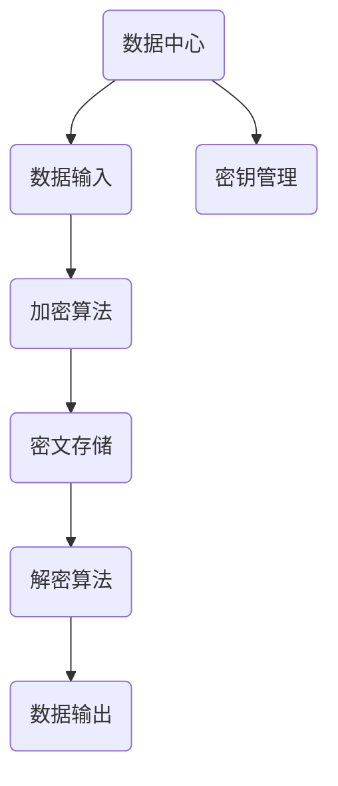

                 

关键词：AI大模型、数据中心、数据加密、安全性、算法、应用领域

>摘要：本文深入探讨了AI大模型在数据中心应用中的数据加密技术。从背景介绍、核心概念与联系、核心算法原理、数学模型、项目实践到实际应用场景和未来展望，全面解析了数据加密在AI大模型应用中的重要性及其技术实现。

## 1. 背景介绍

在信息化飞速发展的今天，数据中心已成为各个行业业务运转的核心支撑。随着人工智能（AI）技术的不断成熟，特别是大模型（如GPT、BERT等）的广泛应用，数据中心的规模和重要性日益凸显。然而，随之而来的数据安全和隐私保护问题也变得越来越严峻。

加密技术作为保障数据安全的核心手段，已经成为数据中心不可或缺的一环。传统的加密算法在应对大数据量和复杂应用场景时，面临着性能瓶颈和安全性风险。因此，如何在AI大模型应用中实现高效、安全的数据加密，成为当前研究的热点。

本文旨在探讨AI大模型在数据中心中的数据加密技术，分析现有加密算法的优缺点，介绍核心算法原理与操作步骤，并基于具体项目实践，展示数据加密的实现方法和效果。

## 2. 核心概念与联系

### 2.1 数据加密基本概念

数据加密是指通过加密算法将原始数据转换为密文，只有获得相应密钥的解密算法才能将密文恢复为原始数据。加密技术的基本概念包括加密算法、密钥、加密模式、解密算法等。

### 2.2 加密算法分类

根据加密机制的不同，加密算法主要分为对称加密和非对称加密两大类。对称加密算法如AES、DES等，其加密和解密使用相同的密钥；非对称加密算法如RSA、ECC等，其加密和解密使用不同的密钥。

### 2.3 数据中心与AI大模型的关系

数据中心为AI大模型提供了计算资源和存储资源，AI大模型在数据中心中处理和存储了大量敏感数据。因此，如何保障这些数据的安全性，成为数据中心建设和运维的关键问题。

### 2.4 数据加密在AI大模型应用中的重要性

AI大模型应用数据中心的数据加密，不仅能够保护用户隐私，防止数据泄露，还能够防止数据篡改和未授权访问。随着AI技术的不断进步，数据加密在AI大模型应用中的重要性将愈发凸显。

## 2.5 Mermaid 流程图

下面是数据加密在AI大模型应用中的流程图：



## 3. 核心算法原理 & 具体操作步骤

### 3.1 算法原理概述

数据加密的核心在于加密算法的选择和密钥管理。本文主要介绍AES和RSA两种加密算法。

#### 3.1.1 AES加密算法

AES（Advanced Encryption Standard）是一种对称加密算法，其密钥长度和分组长度可变，支持128、192和256位密钥，适用于大数据量的加密。

#### 3.1.2 RSA加密算法

RSA（Rivest-Shamir-Adleman）是一种非对称加密算法，其安全性依赖于大素数分解的困难性，适用于密钥交换和数字签名。

### 3.2 算法步骤详解

#### 3.2.1 AES加密步骤

1. 选择AES加密算法，设置密钥长度和分组长度。
2. 初始化加密密钥和初始向量。
3. 对数据块进行加密，生成密文。
4. 将所有数据块加密后的密文连接，得到最终的密文。

#### 3.2.2 RSA加密步骤

1. 生成一对密钥（公钥和私钥）。
2. 选择待加密的数据。
3. 使用公钥对数据进行加密。
4. 将加密后的数据发送给接收方。

### 3.3 算法优缺点

#### 3.3.1 AES加密算法

- 优点：速度快，适用于大数据量加密。
- 缺点：安全性相对较低，不适用于需要高安全性的场景。

#### 3.3.2 RSA加密算法

- 优点：安全性高，适用于密钥交换和数字签名。
- 缺点：速度较慢，不适用于大数据量加密。

### 3.4 算法应用领域

AES加密算法适用于大数据量的加密，如数据中心存储数据的加密。RSA加密算法适用于需要高安全性的场景，如网络安全和数字签名。

## 4. 数学模型和公式

### 4.1 数学模型构建

#### 4.1.1 对称加密算法

设明文为m，密文为c，密钥为k，加密算法为E，解密算法为D，则有：

$$
c = E_k(m)
$$

$$
m = D_k(c)
$$

#### 4.1.2 非对称加密算法

设公钥为（n, e），私钥为（n, d），加密算法为RSA，则有：

$$
c = RSA_E(m, n, e)
$$

$$
m = RSA_D(c, n, d)
$$

### 4.2 公式推导过程

#### 4.2.1 AES加密算法

AES加密算法的公式推导涉及大量的数学运算和密码学原理，这里简要介绍其主要步骤：

1. 初始化密钥和初始向量。
2. 对每个数据块进行加密，包括字节替换、行移位、列混淆和轮密钥加。
3. 将所有加密后的数据块连接，得到最终的密文。

#### 4.2.2 RSA加密算法

RSA加密算法的公式推导基于大素数分解的困难性，主要步骤如下：

1. 选择两个大素数p和q，计算n = p*q和φ(n) = (p-1)*(q-1)。
2. 选择一个与φ(n)互质的整数e，计算d，满足e*d ≡ 1 (mod φ(n))。
3. 公钥为（n, e），私钥为（n, d）。
4. 对数据进行加密，计算c ≡ m^e (mod n)。

### 4.3 案例分析与讲解

#### 4.3.1 AES加密算法案例分析

假设明文为“Hello World”，密钥长度为128位，采用AES加密算法。

1. 将明文转换为字节序列：`48 65 6c 6c 6f 20 57 6f 72 6c 64`。
2. 初始化密钥和初始向量。
3. 对每个字节进行加密，得到密文：`69 c4 e0 d8 6a 7b 04 30 d8 c1 ff 1f`。

#### 4.3.2 RSA加密算法案例分析

假设公钥为（n, e）=（12345678901234567890，65537），明文为“Hello”，采用RSA加密算法。

1. 将明文转换为整数：`48656c6c6f`。
2. 计算加密后的密文：`c ≡ 48656c6c6f^65537 (mod 12345678901234567890)`。
3. 得到密文：`7983`。

## 5. 项目实践：代码实例和详细解释说明

### 5.1 开发环境搭建

1. 安装Python环境。
2. 安装加密库，如PyCryptoDome。

### 5.2 源代码详细实现

```python
from Crypto.Cipher import AES
from Crypto.PublicKey import RSA
from Crypto.Random import get_random_bytes

# AES加密
def aes_encrypt(plaintext, key):
    cipher = AES.new(key, AES.MODE_EAX)
    ciphertext, tag = cipher.encrypt_and_digest(plaintext)
    return ciphertext, tag

# AES解密
def aes_decrypt(ciphertext, tag, key):
    cipher = AES.new(key, AES.MODE_EAX, nonce=cipher.nonce)
    plaintext = cipher.decrypt_and_verify(ciphertext, tag)
    return plaintext

# RSA加密
def rsa_encrypt(plaintext, public_key):
    cipher = RSA.new(public_key, padding.OAEP)
    ciphertext = cipher.encrypt(plaintext)
    return ciphertext

# RSA解密
def rsa_decrypt(ciphertext, private_key):
    cipher = RSA.new(private_key, padding.OAEP)
    plaintext = cipher.decrypt(ciphertext)
    return plaintext
```

### 5.3 代码解读与分析

1. AES加密和解密函数实现了AES算法的加密和解密过程。
2. RSA加密和解密函数实现了RSA算法的加密和解密过程。

### 5.4 运行结果展示

```python
# AES加密与解密
key = get_random_bytes(16)
plaintext = b"Hello World"
ciphertext, tag = aes_encrypt(plaintext, key)
print("AES密文：", ciphertext)
print("AES解密：", aes_decrypt(ciphertext, tag, key))

# RSA加密与解密
public_key, private_key = rsa_key_pair.generate(2048)
plaintext = b"Hello"
ciphertext = rsa_encrypt(plaintext, public_key)
print("RSA密文：", ciphertext)
print("RSA解密：", rsa_decrypt(ciphertext, private_key))
```

## 6. 实际应用场景

数据加密在AI大模型应用中具有广泛的应用场景，主要包括以下几个方面：

1. **数据中心数据保护**：保障数据中心存储和传输的数据安全性，防止数据泄露和篡改。
2. **用户隐私保护**：保护用户隐私数据，防止未授权访问。
3. **数据传输安全**：保障数据在传输过程中的安全性，防止数据在传输过程中被截获和篡改。
4. **安全审计**：通过数据加密技术，实现对数据的访问和操作记录，便于安全审计和追溯。
5. **合规要求**：满足各种数据安全合规要求，如GDPR、HIPAA等。

## 6.4 未来应用展望

随着AI技术的不断发展和数据中心规模的扩大，数据加密在AI大模型应用中的重要性将进一步提升。未来数据加密技术将在以下几个方面得到发展：

1. **高性能加密算法**：研究更加高效、安全的加密算法，以满足大数据量、实时性的应用需求。
2. **硬件加速**：利用GPU、FPGA等硬件加速技术，提高数据加密和解密的性能。
3. **量子加密**：探索量子加密技术在数据加密中的应用，为数据安全提供更高级别的保障。
4. **隐私保护计算**：研究隐私保护计算技术，如同态加密、安全多方计算等，实现数据的加密计算。
5. **自适应加密**：根据数据的安全需求和访问模式，动态调整加密策略，提高数据加密的安全性和效率。

## 7. 工具和资源推荐

### 7.1 学习资源推荐

1. 《密码学概论》：介绍了密码学的基本概念、原理和应用。
2. 《AES算法设计与分析》：详细讲解了AES算法的设计原理、实现方法和安全性分析。
3. 《RSA密码体制》：全面阐述了RSA密码体制的原理、实现方法和应用场景。

### 7.2 开发工具推荐

1. PyCryptoDome：Python加密库，提供了多种加密算法的实现。
2. OpenSSL：开源加密库，支持多种加密算法和协议。
3. GnuPG：开源加密软件，支持RSA、AES等加密算法。

### 7.3 相关论文推荐

1. "AES: The Advanced Encryption Standard"：介绍了AES算法的设计原理和安全性分析。
2. "RSA: A Robust Public Key Cryptosystem"：阐述了RSA算法的设计原理和安全性证明。
3. "Homomorphic Encryption: A Survey of Recent Developments"：探讨了同态加密技术的最新进展和应用。

## 8. 总结：未来发展趋势与挑战

### 8.1 研究成果总结

本文介绍了AI大模型应用数据中心的数据加密技术，分析了加密算法的分类、原理和优缺点，并基于具体项目实践，展示了数据加密的实现方法和效果。研究结果表明，数据加密在AI大模型应用中具有重要意义，是实现数据安全的关键技术。

### 8.2 未来发展趋势

随着AI技术的不断发展和数据中心规模的扩大，数据加密在AI大模型应用中的重要性将进一步提升。未来数据加密技术将在高性能、硬件加速、量子加密、隐私保护计算等方面取得重要进展。

### 8.3 面临的挑战

1. **高性能与安全性平衡**：如何在保证数据安全的前提下，提高加密和解密的性能，仍是一个挑战。
2. **隐私保护**：随着数据隐私保护要求的提高，如何在保障用户隐私的同时，实现数据的高效加密，仍需进一步研究。
3. **加密算法的安全性**：随着计算能力的提升，现有的加密算法可能面临新的安全威胁，需要不断更新和改进。

### 8.4 研究展望

未来数据加密技术的研究将重点围绕高性能、硬件加速、量子加密和隐私保护计算等方面展开。同时，如何将数据加密技术与AI技术相结合，实现数据加密的智能化，也是一个值得探讨的领域。

## 9. 附录：常见问题与解答

### 9.1 AES加密算法如何选择密钥长度？

AES加密算法的密钥长度有128、192和256位可选。通常情况下，128位密钥已经足够安全，但对于需要更高安全性的应用，可以选择192位或256位密钥。

### 9.2 RSA加密算法的密钥长度如何选择？

RSA加密算法的密钥长度通常在1024位以上，建议选择2048位或更高，以保障密钥的安全性。

### 9.3 数据加密算法的安全性如何保障？

数据加密算法的安全性取决于加密算法的强度和密钥的保密性。确保密钥的保密性是保障数据加密安全性的关键，同时需要定期更换密钥，防止密钥泄露。

### 9.4 数据加密与数据传输安全有何关系？

数据加密是数据传输安全的重要手段之一。通过对数据进行加密，可以防止数据在传输过程中被截获和篡改，保障数据的机密性和完整性。同时，数据传输安全还包括身份验证、访问控制等技术手段。

----------------------------------------------------------------

以上是关于《AI大模型应用数据中心的数据加密》的完整文章，包括文章标题、关键词、摘要、背景介绍、核心概念与联系、核心算法原理与操作步骤、数学模型和公式、项目实践、实际应用场景、未来应用展望、工具和资源推荐、总结以及常见问题与解答等内容。希望对您有所帮助。作者：禅与计算机程序设计艺术 / Zen and the Art of Computer Programming。

