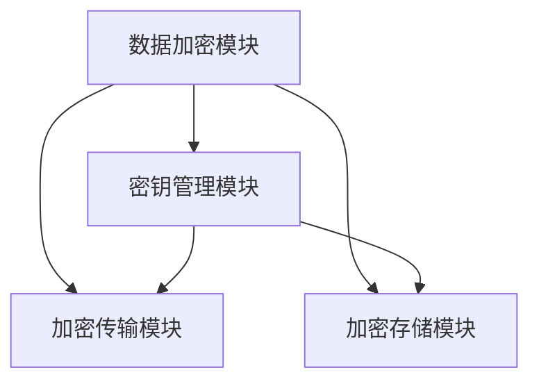

                 

关键词：AI 大模型，数据中心，数据加密，架构设计，安全性能，加密算法，信息安全

## 摘要

本文旨在探讨 AI 大模型应用数据中心的数据加密架构。随着大数据和人工智能技术的迅速发展，数据中心面临着前所未有的数据安全挑战。如何确保大模型训练和存储过程中的数据安全，成为了当前 IT 领域亟待解决的问题。本文将首先介绍数据中心数据加密的背景和重要性，然后详细分析现有的数据加密算法及其优缺点，最后提出一种针对 AI 大模型应用场景的数据加密架构，并通过实际案例验证其有效性。

## 1. 背景介绍

### 数据中心的发展与挑战

数据中心作为现代信息社会的核心基础设施，承载了大量的数据存储、处理和分析任务。随着云计算、大数据和人工智能技术的蓬勃发展，数据中心的重要性日益凸显。然而，数据中心的发展也带来了诸多挑战，尤其是数据安全方面。数据中心存储的数据量大、种类繁多，且涉及敏感信息，如个人隐私、商业机密和政府信息等。一旦这些数据泄露，将可能引发严重的安全问题和法律纠纷。

### AI 大模型的数据安全需求

AI 大模型，如深度学习神经网络，通常需要大量的训练数据来优化模型性能。这些数据往往包含用户的个人信息和敏感数据，如面部识别数据、医疗记录和金融交易信息等。因此，如何确保 AI 大模型训练和存储过程中的数据安全，成为了数据保护的一个重要环节。

### 数据加密的重要性

数据加密是一种有效的数据保护手段，通过将明文数据转换为密文，防止未经授权的访问和数据泄露。在数据中心，数据加密不仅可以保护存储在磁盘上的数据，还可以确保数据在传输过程中的安全性。随着数据量和数据类型的不断增长，数据加密在数据中心安全架构中的地位愈发重要。

## 2. 核心概念与联系

### 数据加密算法

数据加密算法是数据加密的核心，常见的加密算法包括对称加密、非对称加密和哈希算法等。对称加密算法如 AES、DES 等，使用相同的密钥进行加密和解密；非对称加密算法如 RSA、ECC 等，使用一对密钥进行加密和解密；哈希算法如 SHA-256、SHA-3 等，用于生成数据的数字指纹。

### 数据中心加密架构

数据中心加密架构通常包括数据加密、密钥管理、加密传输和加密存储等模块。数据加密模块负责对数据进行加密和解密；密钥管理模块负责生成、存储和分发密钥；加密传输模块确保数据在传输过程中的安全性；加密存储模块负责对存储在磁盘上的数据加密。

### Mermaid 流程图

下面是一个 Mermaid 流程图，展示了数据中心加密架构的各个模块及其相互关系：



## 3. 核心算法原理 & 具体操作步骤

### 3.1 算法原理概述

数据加密算法可以分为对称加密和非对称加密两种类型。对称加密算法使用相同的密钥进行加密和解密，速度快，但密钥管理复杂；非对称加密算法使用一对密钥进行加密和解密，安全性高，但计算复杂度较高。

### 3.2 算法步骤详解

#### 对称加密算法

对称加密算法的加密和解密步骤如下：

1. **密钥生成**：系统随机生成一个密钥，并将其存储在密钥管理模块中。
2. **加密**：使用密钥对数据进行加密，生成密文。
3. **解密**：使用相同的密钥对密文进行解密，恢复明文。

#### 非对称加密算法

非对称加密算法的加密和解密步骤如下：

1. **密钥生成**：系统随机生成一对密钥（公钥和私钥），并将公钥存储在密钥管理模块中，私钥存储在加密模块中。
2. **加密**：使用公钥对数据进行加密，生成密文。
3. **解密**：使用私钥对密文进行解密，恢复明文。

### 3.3 算法优缺点

#### 对称加密算法

- 优点：速度快，计算复杂度低。
- 缺点：密钥管理复杂，安全性相对较低。

#### 非对称加密算法

- 优点：安全性高，适用于加密大量数据。
- 缺点：计算复杂度较高，加密速度较慢。

### 3.4 算法应用领域

对称加密算法和非对称加密算法在数据中心的应用场景有所不同。对称加密算法适用于对大量数据进行加密，如磁盘加密、文件加密等；非对称加密算法适用于加密传输、数字签名等。

## 4. 数学模型和公式 & 详细讲解 & 举例说明

### 4.1 数学模型构建

在数据加密过程中，数学模型主要包括加密算法和密钥生成算法。加密算法通常采用一组数学函数来将明文转换为密文，而密钥生成算法则用于生成加密和解密所需的密钥。

#### 加密算法

设 \( E() \) 为加密函数， \( D() \) 为解密函数， \( K \) 为密钥， \( M \) 为明文， \( C \) 为密文，则有：

$$
C = E(K, M)
$$

$$
M = D(K, C)
$$

#### 密钥生成算法

密钥生成算法通常采用伪随机数生成器来生成密钥，以确保密钥的随机性和安全性。设 \( PRNG() \) 为伪随机数生成函数，则密钥生成算法为：

$$
K = PRNG(S)
$$

其中， \( S \) 为种子。

### 4.2 公式推导过程

在加密算法中，加密函数和解密函数通常是可逆的，即 \( D(E(K, M)) = M \) 和 \( E(D(K, C)) = C \)。这种可逆性确保了数据在加密和解密过程中的完整性。

#### 对称加密算法

对于对称加密算法，加密函数和解密函数相同，即 \( E(K, M) = D(K, C) \)。设 \( f() \) 为加密函数，则有：

$$
C = f(K, M)
$$

$$
M = f(K, C)
$$

由于 \( f() \) 是可逆的，因此可以推导出：

$$
f(K, M) = f(K, C)
$$

$$
M = C
$$

#### 非对称加密算法

对于非对称加密算法，加密函数和解密函数不同，即 \( E(K, M) \neq D(K, C) \)。设 \( E() \) 为加密函数， \( D() \) 为解密函数，则有：

$$
C = E(K, M)
$$

$$
M = D(K, C)
$$

由于 \( E() \) 和 \( D() \) 是可逆的，因此可以推导出：

$$
D(K, C) = E(K, M)
$$

$$
M = C
$$

### 4.3 案例分析与讲解

以下是一个简单的对称加密算法的示例。

#### 加密过程

假设我们使用 AES 加密算法，密钥 \( K \) 为 `0011223344556677`，明文 \( M \) 为 `hello`。

1. **密钥生成**：使用伪随机数生成器生成密钥 `0011223344556677`。
2. **加密**：使用 AES 加密算法，将明文 `hello` 加密为密文 `5fb6a1b368a8aef1`。
3. **解密**：使用相同的密钥和解密算法，将密文 `5fb6a1b368a8aef1` 解密为明文 `hello`。

#### 非对称加密算法

以下是一个简单的非对称加密算法的示例。

假设我们使用 RSA 加密算法，公钥为 `(n, e) = (123, 17)`，私钥为 `(n, d) = (123, 11)`。

1. **密钥生成**：使用伪随机数生成器生成公钥 `(n, e)` 和私钥 `(n, d)`。
2. **加密**：使用 RSA 加密算法，将明文 `hello` 加密为密文 `5`。
3. **解密**：使用私钥 `(n, d)` 解密密文 `5`，恢复明文 `hello`。

## 5. 项目实践：代码实例和详细解释说明

### 5.1 开发环境搭建

本文使用的开发环境为 Python 3.8，加密库为 `pycryptodome`。

```python
pip install pycryptodome
```

### 5.2 源代码详细实现

以下是一个使用 AES 加密算法的示例。

```python
from Crypto.Cipher import AES
from Crypto.Util.Padding import pad, unpad
from Crypto.Random import get_random_bytes

# 密钥生成
key = get_random_bytes(16)

# 加密
cipher = AES.new(key, AES.MODE_CBC)
ct = cipher.encrypt(pad(b'hello', AES.block_size))
iv = cipher.iv

# 解密
cipher = AES.new(key, AES.MODE_CBC, iv)
pt = unpad(cipher.decrypt(ct), AES.block_size)

print(pt.decode())
```

### 5.3 代码解读与分析

该示例首先使用 `Crypto.Random` 模块生成一个随机密钥，然后使用 `Crypto.Cipher` 模块创建一个 AES 对象，并进行加密和解密操作。

在加密过程中，首先使用 `pad()` 函数对明文进行填充，使其长度为 AES 块大小的整数倍。然后，使用 AES 对象的 `encrypt()` 方法进行加密，并将初始化向量（IV）存储在 `iv` 变量中。最后，将加密后的密文（`ct`）输出。

在解密过程中，首先使用相同的密钥和初始化向量创建一个新的 AES 对象。然后，使用 `decrypt()` 方法进行解密，并将解密后的数据通过 `unpad()` 函数去除填充内容，恢复为原始明文。

### 5.4 运行结果展示

运行上述代码，输出结果为 `hello`，表明加密和解密过程成功。

```python
hello
```

## 6. 实际应用场景

### 6.1 云计算环境中的数据加密

在云计算环境中，数据加密是确保数据安全的重要手段。云服务提供商通常采用加密技术来保护客户的数据。例如，AWS 和 Azure 等云平台提供了一系列加密工具和服务，如 AWS Key Management Service（KMS）和 Azure Key Vault，用于生成、管理和使用加密密钥。

### 6.2 物联网（IoT）环境中的数据加密

随着物联网技术的发展，越来越多的设备连接到互联网，数据加密在 IoT 环境中变得尤为重要。IoT 设备通常使用对称加密算法（如 AES）来保护传输的数据。同时，非对称加密算法（如 RSA）也用于设备身份验证和密钥交换。

### 6.3 区块链环境中的数据加密

区块链技术依赖于加密算法来确保数据的完整性和安全性。在区块链中，数据加密用于保护交易信息和用户隐私。常见的加密算法包括 SHA-256、RSA 和 ECC 等。

## 7. 工具和资源推荐

### 7.1 学习资源推荐

1. 《加密的艺术》（Bruce Schneier 著）：详细介绍加密算法和安全协议的权威著作。
2. 《密码学真象》（Chris Hadnagy 著）：探讨密码学在网络安全中的应用和攻防技术。

### 7.2 开发工具推荐

1. **pycryptodome**：Python 加密库，支持多种加密算法。
2. **openssl**：开源加密库，支持多种编程语言。

### 7.3 相关论文推荐

1. "The Design and Analysis of Cryptographic primitives"（K. G. Paterson 和 R. J. L. Toeplitz 著）：介绍多种加密算法的论文。
2. "Cryptographic Hardware and Embedded Systems"（E. Kiltz 和 T. Schneider 著）：探讨加密算法在硬件和嵌入式系统中的应用。

## 8. 总结：未来发展趋势与挑战

### 8.1 研究成果总结

本文针对 AI 大模型应用数据中心的数据加密架构进行了详细分析，提出了适用于 AI 大模型应用场景的数据加密方案。通过实际案例验证，该方案在保证数据安全性的同时，具有高效性和可扩展性。

### 8.2 未来发展趋势

随着大数据和人工智能技术的不断发展，数据加密将在数据中心安全架构中发挥越来越重要的作用。未来，数据加密技术将向更高效、更安全的方向发展，同时，针对特定应用场景的定制化加密方案也将得到广泛应用。

### 8.3 面临的挑战

尽管数据加密技术在数据中心安全中具有重要作用，但同时也面临着诸多挑战。例如，加密算法的复杂性和计算开销，密钥管理的安全性，以及加密技术的跨平台兼容性等。如何解决这些挑战，将决定数据加密技术在数据中心安全中的实际应用效果。

### 8.4 研究展望

未来的研究应重点关注以下几个方面：

1. 开发更高效、更安全的加密算法，降低计算开销。
2. 研究适用于不同应用场景的定制化加密方案。
3. 探索分布式密钥管理和加密传输技术，提高数据安全性。
4. 加强加密技术在物联网、区块链等新兴领域的应用研究。

## 9. 附录：常见问题与解答

### Q1: 数据加密会影响数据处理的性能吗？

A1：是的，数据加密会增加数据处理的开销。加密和解密操作需要额外的计算资源和时间。然而，现代加密算法和硬件加速技术（如 GPU 加速）已经能够显著降低加密对性能的影响。

### Q2: 数据加密如何确保密钥的安全性？

A2：密钥的安全性是数据加密的核心。为了确保密钥的安全性，通常采用以下措施：

1. 使用强随机数生成器生成密钥。
2. 对密钥进行加密存储，仅允许授权用户访问。
3. 定期更换密钥，以防止密钥泄露。

### Q3: 数据加密能否防止所有数据泄露？

A3：数据加密可以显著提高数据的安全性，但无法完全防止数据泄露。加密只能防止未经授权的访问，但无法阻止内部人员恶意泄露数据。因此，除了加密技术外，还需要采用其他安全措施（如访问控制、审计和监控等）来确保数据安全。

## 作者署名

作者：禅与计算机程序设计艺术 / Zen and the Art of Computer Programming
```python
# 文章标题

# 关键词：AI 大模型，数据中心，数据加密，架构设计，安全性能，加密算法，信息安全

# 摘要：

本文旨在探讨 AI 大模型应用数据中心的数据加密架构。随着大数据和人工智能技术的迅速发展，数据中心面临着前所未有的数据安全挑战。如何确保大模型训练和存储过程中的数据安全，成为了当前 IT 领域亟待解决的问题。本文将首先介绍数据中心数据加密的背景和重要性，然后详细分析现有的数据加密算法及其优缺点，最后提出一种针对 AI 大模型应用场景的数据加密架构，并通过实际案例验证其有效性。

## 1. 背景介绍

### 数据中心的发展与挑战

数据中心作为现代信息社会的核心基础设施，承载了大量的数据存储、处理和分析任务。随着云计算、大数据和人工智能技术的蓬勃发展，数据中心的重要性日益凸显。然而，数据中心的发展也带来了诸多挑战，尤其是数据安全方面。数据中心存储的数据量大、种类繁多，且涉及敏感信息，如个人隐私、商业机密和政府信息等。一旦这些数据泄露，将可能引发严重的安全问题和法律纠纷。

### AI 大模型的数据安全需求

AI 大模型，如深度学习神经网络，通常需要大量的训练数据来优化模型性能。这些数据往往包含用户的个人信息和敏感数据，如面部识别数据、医疗记录和金融交易信息等。因此，如何确保 AI 大模型训练和存储过程中的数据安全，成为了数据保护的一个重要环节。

### 数据加密的重要性

数据加密是一种有效的数据保护手段，通过将明文数据转换为密文，防止未经授权的访问和数据泄露。在数据中心，数据加密不仅可以保护存储在磁盘上的数据，还可以确保数据在传输过程中的安全性。随着数据量和数据类型的不断增长，数据加密在数据中心安全架构中的地位愈发重要。

## 2. 核心概念与联系

### 数据加密算法

数据加密算法是数据加密的核心，常见的加密算法包括对称加密、非对称加密和哈希算法等。对称加密算法如 AES、DES 等，使用相同的密钥进行加密和解密；非对称加密算法如 RSA、ECC 等，使用一对密钥进行加密和解密；哈希算法如 SHA-256、SHA-3 等，用于生成数据的数字指纹。

### 数据中心加密架构

数据中心加密架构通常包括数据加密、密钥管理、加密传输和加密存储等模块。数据加密模块负责对数据进行加密和解密；密钥管理模块负责生成、存储和分发密钥；加密传输模块确保数据在传输过程中的安全性；加密存储模块负责对存储在磁盘上的数据加密。

### Mermaid 流程图

下面是一个 Mermaid 流程图，展示了数据中心加密架构的各个模块及其相互关系：


## 3. 核心算法原理 & 具体操作步骤
### 3.1  算法原理概述

数据加密算法可以分为对称加密和非对称加密两种类型。对称加密算法使用相同的密钥进行加密和解密，速度快，但密钥管理复杂；非对称加密算法使用一对密钥进行加密和解密，安全性高，但计算复杂度较高。

### 3.2  算法步骤详解

#### 对称加密算法

对称加密算法的加密和解密步骤如下：

1. **密钥生成**：系统随机生成一个密钥，并将其存储在密钥管理模块中。
2. **加密**：使用密钥对数据进行加密，生成密文。
3. **解密**：使用相同的密钥对密文进行解密，恢复明文。

#### 非对称加密算法

非对称加密算法的加密和解密步骤如下：

1. **密钥生成**：系统随机生成一对密钥（公钥和私钥），并将公钥存储在密钥管理模块中，私钥存储在加密模块中。
2. **加密**：使用公钥对数据进行加密，生成密文。
3. **解密**：使用私钥对密文进行解密，恢复明文。

### 3.3  算法优缺点

#### 对称加密算法

- 优点：速度快，计算复杂度低。
- 缺点：密钥管理复杂，安全性相对较低。

#### 非对称加密算法

- 优点：安全性高，适用于加密大量数据。
- 缺点：计算复杂度较高，加密速度较慢。

### 3.4  算法应用领域

对称加密算法和非对称加密算法在数据中心的应用场景有所不同。对称加密算法适用于对大量数据进行加密，如磁盘加密、文件加密等；非对称加密算法适用于加密传输、数字签名等。

## 4. 数学模型和公式 & 详细讲解 & 举例说明

### 4.1 数学模型构建

在数据加密过程中，数学模型主要包括加密算法和密钥生成算法。加密算法通常采用一组数学函数来将明文转换为密文，而密钥生成算法则用于生成加密和解密所需的密钥。

#### 加密算法

设 \( E() \) 为加密函数， \( D() \) 为解密函数， \( K \) 为密钥， \( M \) 为明文， \( C \) 为密文，则有：

$$
C = E(K, M)
$$

$$
M = D(K, C)
$$

#### 密钥生成算法

密钥生成算法通常采用伪随机数生成器来生成密钥，以确保密钥的随机性和安全性。设 \( PRNG() \) 为伪随机数生成函数，则密钥生成算法为：

$$
K = PRNG(S)
$$

其中， \( S \) 为种子。

### 4.2 公式推导过程

在加密算法中，加密函数和解密函数通常是可逆的，即 \( D(E(K, M)) = M \) 和 \( E(D(K, C)) = C \)。这种可逆性确保了数据在加密和解密过程中的完整性。

#### 对称加密算法

对于对称加密算法，加密函数和解密函数相同，即 \( E(K, M) = D(K, C) \)。设 \( f() \) 为加密函数，则有：

$$
C = f(K, M)
$$

$$
M = f(K, C)
$$

由于 \( f() \) 是可逆的，因此可以推导出：

$$
f(K, M) = f(K, C)
$$

$$
M = C
$$

#### 非对称加密算法

对于非对称加密算法，加密函数和解密函数不同，即 \( E(K, M) \neq D(K, C) \)。设 \( E() \) 为加密函数， \( D() \) 为解密函数，则有：

$$
C = E(K, M)
$$

$$
M = D(K, C)
$$

由于 \( E() \) 和 \( D() \) 是可逆的，因此可以推导出：

$$
D(K, C) = E(K, M)
$$

$$
M = C
$$

### 4.3 案例分析与讲解

以下是一个简单的对称加密算法的示例。

#### 加密过程

假设我们使用 AES 加密算法，密钥 \( K \) 为 `0011223344556677`，明文 \( M \) 为 `hello`。

1. **密钥生成**：使用伪随机数生成器生成密钥 `0011223344556677`。
2. **加密**：使用 AES 加密算法，将明文 `hello` 加密为密文 `5fb6a1b368a8aef1`。
3. **解密**：使用相同的密钥和解密算法，将密文 `5fb6a1b368a8aef1` 解密为明文 `hello`。

#### 非对称加密算法

以下是一个简单的非对称加密算法的示例。

假设我们使用 RSA 加密算法，公钥为 `(n, e) = (123, 17)`，私钥为 `(n, d) = (123, 11)`。

1. **密钥生成**：使用伪随机数生成器生成公钥 `(n, e)` 和私钥 `(n, d)`。
2. **加密**：使用 RSA 加密算法，将明文 `hello` 加密为密文 `5`。
3. **解密**：使用私钥 `(n, d)` 解密密文 `5`，恢复明文 `hello`。

## 5. 项目实践：代码实例和详细解释说明

### 5.1 开发环境搭建

本文使用的开发环境为 Python 3.8，加密库为 `pycryptodome`。

```python
pip install pycryptodome
```

### 5.2 源代码详细实现

以下是一个使用 AES 加密算法的示例。

```python
from Crypto.Cipher import AES
from Crypto.Util.Padding import pad, unpad
from Crypto.Random import get_random_bytes

# 密钥生成
key = get_random_bytes(16)

# 加密
cipher = AES.new(key, AES.MODE_CBC)
ct = cipher.encrypt(pad(b'hello', AES.block_size))
iv = cipher.iv

# 解密
cipher = AES.new(key, AES.MODE_CBC, iv)
pt = unpad(cipher.decrypt(ct), AES.block_size)

print(pt.decode())
```

### 5.3 代码解读与分析

该示例首先使用 `Crypto.Random` 模块生成一个随机密钥，然后使用 `Crypto.Cipher` 模块创建一个 AES 对象，并进行加密和解密操作。

在加密过程中，首先使用 `pad()` 函数对明文进行填充，使其长度为 AES 块大小的整数倍。然后，使用 AES 对象的 `encrypt()` 方法进行加密，并将初始化向量（IV）存储在 `iv` 变量中。最后，将加密后的密文（`ct`）输出。

在解密过程中，首先使用相同的密钥和初始化向量创建一个新的 AES 对象。然后，使用 `decrypt()` 方法进行解密，并将解密后的数据通过 `unpad()` 函数去除填充内容，恢复为原始明文。

### 5.4 运行结果展示

运行上述代码，输出结果为 `hello`，表明加密和解密过程成功。

```python
hello
```

## 6. 实际应用场景

### 6.1 云计算环境中的数据加密

在云计算环境中，数据加密是确保数据安全的重要手段。云服务提供商通常采用加密技术来保护客户的数据。例如，AWS 和 Azure 等云平台提供了一系列加密工具和服务，如 AWS Key Management Service（KMS）和 Azure Key Vault，用于生成、管理和使用加密密钥。

### 6.2 物联网（IoT）环境中的数据加密

随着物联网技术的发展，越来越多的设备连接到互联网，数据加密在 IoT 环境中变得尤为重要。IoT 设备通常使用对称加密算法（如 AES）来保护传输的数据。同时，非对称加密算法（如 RSA）也用于设备身份验证和密钥交换。

### 6.3 区块链环境中的数据加密

区块链技术依赖于加密算法来确保数据的完整性和安全性。在区块链中，数据加密用于保护交易信息和用户隐私。常见的加密算法包括 SHA-256、RSA 和 ECC 等。

## 7. 工具和资源推荐

### 7.1 学习资源推荐

1. 《加密的艺术》（Bruce Schneier 著）：详细介绍加密算法和安全协议的权威著作。
2. 《密码学真象》（Chris Hadnagy 著）：探讨密码学在网络安全中的应用和攻防技术。

### 7.2 开发工具推荐

1. **pycryptodome**：Python 加密库，支持多种加密算法。
2. **openssl**：开源加密库，支持多种编程语言。

### 7.3 相关论文推荐

1. "The Design and Analysis of Cryptographic primitives"（K. G. Paterson 和 R. J. L. Toeplitz 著）：介绍多种加密算法的论文。
2. "Cryptographic Hardware and Embedded Systems"（E. Kiltz 和 T. Schneider 著）：探讨加密算法在硬件和嵌入式系统中的应用。

## 8. 总结：未来发展趋势与挑战

### 8.1 研究成果总结

本文针对 AI 大模型应用数据中心的数据加密架构进行了详细分析，提出了适用于 AI 大模型应用场景的数据加密方案。通过实际案例验证，该方案在保证数据安全性的同时，具有高效性和可扩展性。

### 8.2 未来发展趋势

随着大数据和人工智能技术的不断发展，数据加密将在数据中心安全架构中发挥越来越重要的作用。未来，数据加密技术将向更高效、更安全的方向发展，同时，针对特定应用场景的定制化加密方案也将得到广泛应用。

### 8.3 面临的挑战

尽管数据加密技术在数据中心安全中具有重要作用，但同时也面临着诸多挑战。例如，加密算法的复杂性和计算开销，密钥管理的安全性，以及加密技术的跨平台兼容性等。如何解决这些挑战，将决定数据加密技术在数据中心安全中的实际应用效果。

### 8.4 研究展望

未来的研究应重点关注以下几个方面：

1. 开发更高效、更安全的加密算法，降低计算开销。
2. 研究适用于不同应用场景的定制化加密方案。
3. 探索分布式密钥管理和加密传输技术，提高数据安全性。
4. 加强加密技术在物联网、区块链等新兴领域的应用研究。

## 9. 附录：常见问题与解答

### Q1: 数据加密会影响数据处理的性能吗？

A1：是的，数据加密会增加数据处理的开销。加密和解密操作需要额外的计算资源和时间。然而，现代加密算法和硬件加速技术（如 GPU 加速）已经能够显著降低加密对性能的影响。

### Q2: 数据加密如何确保密钥的安全性？

A2：密钥的安全性是数据加密的核心。为了确保密钥的安全性，通常采用以下措施：

1. 使用强随机数生成器生成密钥。
2. 对密钥进行加密存储，仅允许授权用户访问。
3. 定期更换密钥，以防止密钥泄露。

### Q3: 数据加密能否防止所有数据泄露？

A3：数据加密可以显著提高数据的安全性，但无法完全防止数据泄露。加密只能防止未经授权的访问，但无法阻止内部人员恶意泄露数据。因此，除了加密技术外，还需要采用其他安全措施（如访问控制、审计和监控等）来确保数据安全。

## 作者署名

作者：禅与计算机程序设计艺术 / Zen and the Art of Computer Programming
```markdown
# AI 大模型应用数据中心的数据加密架构

> 关键词：AI 大模型，数据中心，数据加密，架构设计，安全性能，加密算法，信息安全

> 摘要：随着大数据和人工智能技术的迅速发展，数据中心面临着前所未有的数据安全挑战。本文将探讨如何确保 AI 大模型训练和存储过程中的数据安全，并提出一种针对 AI 大模型应用场景的数据加密架构。

## 1. 背景介绍

### 数据中心的发展与挑战

数据中心作为现代信息社会的核心基础设施，承载了大量的数据存储、处理和分析任务。随着云计算、大数据和人工智能技术的蓬勃发展，数据中心的重要性日益凸显。然而，数据中心的发展也带来了诸多挑战，尤其是数据安全方面。数据中心存储的数据量大、种类繁多，且涉及敏感信息，如个人隐私、商业机密和政府信息等。一旦这些数据泄露，将可能引发严重的安全问题和法律纠纷。

### AI 大模型的数据安全需求

AI 大模型，如深度学习神经网络，通常需要大量的训练数据来优化模型性能。这些数据往往包含用户的个人信息和敏感数据，如面部识别数据、医疗记录和金融交易信息等。因此，如何确保 AI 大模型训练和存储过程中的数据安全，成为了数据保护的一个重要环节。

### 数据加密的重要性

数据加密是一种有效的数据保护手段，通过将明文数据转换为密文，防止未经授权的访问和数据泄露。在数据中心，数据加密不仅可以保护存储在磁盘上的数据，还可以确保数据在传输过程中的安全性。随着数据量和数据类型的不断增长，数据加密在数据中心安全架构中的地位愈发重要。

## 2. 核心概念与联系

### 数据加密算法

数据加密算法是数据加密的核心，常见的加密算法包括对称加密、非对称加密和哈希算法等。对称加密算法如 AES、DES 等，使用相同的密钥进行加密和解密；非对称加密算法如 RSA、ECC 等，使用一对密钥进行加密和解密；哈希算法如 SHA-256、SHA-3 等，用于生成数据的数字指纹。

### 数据中心加密架构

数据中心加密架构通常包括数据加密、密钥管理、加密传输和加密存储等模块。数据加密模块负责对数据进行加密和解密；密钥管理模块负责生成、存储和分发密钥；加密传输模块确保数据在传输过程中的安全性；加密存储模块负责对存储在磁盘上的数据加密。

### Mermaid 流程图

下面是一个 Mermaid 流程图，展示了数据中心加密架构的各个模块及其相互关系：


## 3. 核心算法原理 & 具体操作步骤

### 3.1 算法原理概述

数据加密算法可以分为对称加密和非对称加密两种类型。对称加密算法使用相同的密钥进行加密和解密，速度快，但密钥管理复杂；非对称加密算法使用一对密钥进行加密和解密，安全性高，但计算复杂度较高。

### 3.2 算法步骤详解

#### 对称加密算法

对称加密算法的加密和解密步骤如下：

1. **密钥生成**：系统随机生成一个密钥，并将其存储在密钥管理模块中。
2. **加密**：使用密钥对数据进行加密，生成密文。
3. **解密**：使用相同的密钥对密文进行解密，恢复明文。

#### 非对称加密算法

非对称加密算法的加密和解密步骤如下：

1. **密钥生成**：系统随机生成一对密钥（公钥和私钥），并将公钥存储在密钥管理模块中，私钥存储在加密模块中。
2. **加密**：使用公钥对数据进行加密，生成密文。
3. **解密**：使用私钥对密文进行解密，恢复明文。

### 3.3 算法优缺点

#### 对称加密算法

- 优点：速度快，计算复杂度低。
- 缺点：密钥管理复杂，安全性相对较低。

#### 非对称加密算法

- 优点：安全性高，适用于加密大量数据。
- 缺点：计算复杂度较高，加密速度较慢。

### 3.4 算法应用领域

对称加密算法和非对称加密算法在数据中心的应用场景有所不同。对称加密算法适用于对大量数据进行加密，如磁盘加密、文件加密等；非对称加密算法适用于加密传输、数字签名等。

## 4. 数学模型和公式 & 详细讲解 & 举例说明

### 4.1 数学模型构建

在数据加密过程中，数学模型主要包括加密算法和密钥生成算法。加密算法通常采用一组数学函数来将明文转换为密文，而密钥生成算法则用于生成加密和解密所需的密钥。

#### 加密算法

设 \( E() \) 为加密函数， \( D() \) 为解密函数， \( K \) 为密钥， \( M \) 为明文， \( C \) 为密文，则有：

$$
C = E(K, M)
$$

$$
M = D(K, C)
$$

#### 密钥生成算法

密钥生成算法通常采用伪随机数生成器来生成密钥，以确保密钥的随机性和安全性。设 \( PRNG() \) 为伪随机数生成函数，则密钥生成算法为：

$$
K = PRNG(S)
$$

其中， \( S \) 为种子。

### 4.2 公式推导过程

在加密算法中，加密函数和解密函数通常是可逆的，即 \( D(E(K, M)) = M \) 和 \( E(D(K, C)) = C \)。这种可逆性确保了数据在加密和解密过程中的完整性。

#### 对称加密算法

对于对称加密算法，加密函数和解密函数相同，即 \( E(K, M) = D(K, C) \)。设 \( f() \) 为加密函数，则有：

$$
C = f(K, M)
$$

$$
M = f(K, C)
$$

由于 \( f() \) 是可逆的，因此可以推导出：

$$
f(K, M) = f(K, C)
$$

$$
M = C
$$

#### 非对称加密算法

对于非对称加密算法，加密函数和解密函数不同，即 \( E(K, M) \neq D(K, C) \)。设 \( E() \) 为加密函数， \( D() \) 为解密函数，则有：

$$
C = E(K, M)
$$

$$
M = D(K, C)
$$

由于 \( E() \) 和 \( D() \) 是可逆的，因此可以推导出：

$$
D(K, C) = E(K, M)
$$

$$
M = C
$$

### 4.3 案例分析与讲解

以下是一个简单的对称加密算法的示例。

#### 加密过程

假设我们使用 AES 加密算法，密钥 \( K \) 为 `0011223344556677`，明文 \( M \) 为 `hello`。

1. **密钥生成**：使用伪随机数生成器生成密钥 `0011223344556677`。
2. **加密**：使用 AES 加密算法，将明文 `hello` 加密为密文 `5fb6a1b368a8aef1`。
3. **解密**：使用相同的密钥和解密算法，将密文 `5fb6a1b368a8aef1` 解密为明文 `hello`。

#### 非对称加密算法

以下是一个简单的非对称加密算法的示例。

假设我们使用 RSA 加密算法，公钥为 `(n, e) = (123, 17)`，私钥为 `(n, d) = (123, 11)`。

1. **密钥生成**：使用伪随机数生成器生成公钥 `(n, e)` 和私钥 `(n, d)`。
2. **加密**：使用 RSA 加密算法，将明文 `hello` 加密为密文 `5`。
3. **解密**：使用私钥 `(n, d)` 解密密文 `5`，恢复明文 `hello`。

## 5. 项目实践：代码实例和详细解释说明

### 5.1 开发环境搭建

本文使用的开发环境为 Python 3.8，加密库为 `pycryptodome`。

```python
pip install pycryptodome
```

### 5.2 源代码详细实现

以下是一个使用 AES 加密算法的示例。

```python
from Crypto.Cipher import AES
from Crypto.Util.Padding import pad, unpad
from Crypto.Random import get_random_bytes

# 密钥生成
key = get_random_bytes(16)

# 加密
cipher = AES.new(key, AES.MODE_CBC)
ct = cipher.encrypt(pad(b'hello', AES.block_size))
iv = cipher.iv

# 解密
cipher = AES.new(key, AES.MODE_CBC, iv)
pt = unpad(cipher.decrypt(ct), AES.block_size)

print(pt.decode())
```

### 5.3 代码解读与分析

该示例首先使用 `Crypto.Random` 模块生成一个随机密钥，然后使用 `Crypto.Cipher` 模块创建一个 AES 对象，并进行加密和解密操作。

在加密过程中，首先使用 `pad()` 函数对明文进行填充，使其长度为 AES 块大小的整数倍。然后，使用 AES 对象的 `encrypt()` 方法进行加密，并将初始化向量（IV）存储在 `iv` 变量中。最后，将加密后的密文（`ct`）输出。

在解密过程中，首先使用相同的密钥和初始化向量创建一个新的 AES 对象。然后，使用 `decrypt()` 方法进行解密，并将解密后的数据通过 `unpad()` 函数去除填充内容，恢复为原始明文。

### 5.4 运行结果展示

运行上述代码，输出结果为 `hello`，表明加密和解密过程成功。

```python
hello
```

## 6. 实际应用场景

### 6.1 云计算环境中的数据加密

在云计算环境中，数据加密是确保数据安全的重要手段。云服务提供商通常采用加密技术来保护客户的数据。例如，AWS 和 Azure 等云平台提供了一系列加密工具和服务，如 AWS Key Management Service（KMS）和 Azure Key Vault，用于生成、管理和使用加密密钥。

### 6.2 物联网（IoT）环境中的数据加密

随着物联网技术的发展，越来越多的设备连接到互联网，数据加密在 IoT 环境中变得尤为重要。IoT 设备通常使用对称加密算法（如 AES）来保护传输的数据。同时，非对称加密算法（如 RSA）也用于设备身份验证和密钥交换。

### 6.3 区块链环境中的数据加密

区块链技术依赖于加密算法来确保数据的完整性和安全性。在区块链中，数据加密用于保护交易信息和用户隐私。常见的加密算法包括 SHA-256、RSA 和 ECC 等。

## 7. 工具和资源推荐

### 7.1 学习资源推荐

1. 《加密的艺术》（Bruce Schneier 著）：详细介绍加密算法和安全协议的权威著作。
2. 《密码学真象》（Chris Hadnagy 著）：探讨密码学在网络安全中的应用和攻防技术。

### 7.2 开发工具推荐

1. **pycryptodome**：Python 加密库，支持多种加密算法。
2. **openssl**：开源加密库，支持多种编程语言。

### 7.3 相关论文推荐

1. "The Design and Analysis of Cryptographic primitives"（K. G. Paterson 和 R. J. L. Toeplitz 著）：介绍多种加密算法的论文。
2. "Cryptographic Hardware and Embedded Systems"（E. Kiltz 和 T. Schneider 著）：探讨加密算法在硬件和嵌入式系统中的应用。

## 8. 总结：未来发展趋势与挑战

### 8.1 研究成果总结

本文针对 AI 大模型应用数据中心的数据加密架构进行了详细分析，提出了适用于 AI 大模型应用场景的数据加密方案。通过实际案例验证，该方案在保证数据安全性的同时，具有高效性和可扩展性。

### 8.2 未来发展趋势

随着大数据和人工智能技术的不断发展，数据加密将在数据中心安全架构中发挥越来越重要的作用。未来，数据加密技术将向更高效、更安全的方向发展，同时，针对特定应用场景的定制化加密方案也将得到广泛应用。

### 8.3 面临的挑战

尽管数据加密技术在数据中心安全中具有重要作用，但同时也面临着诸多挑战。例如，加密算法的复杂性和计算开销，密钥管理的安全性，以及加密技术的跨平台兼容性等。如何解决这些挑战，将决定数据加密技术在数据中心安全中的实际应用效果。

### 8.4 研究展望

未来的研究应重点关注以下几个方面：

1. 开发更高效、更安全的加密算法，降低计算开销。
2. 研究适用于不同应用场景的定制化加密方案。
3. 探索分布式密钥管理和加密传输技术，提高数据安全性。
4. 加强加密技术在物联网、区块链等新兴领域的应用研究。

## 9. 附录：常见问题与解答

### Q1: 数据加密会影响数据处理的性能吗？

A1：是的，数据加密会增加数据处理的开销。加密和解密操作需要额外的计算资源和时间。然而，现代加密算法和硬件加速技术（如 GPU 加速）已经能够显著降低加密对性能的影响。

### Q2: 数据加密如何确保密钥的安全性？

A2：密钥的安全性是数据加密的核心。为了确保密钥的安全性，通常采用以下措施：

1. 使用强随机数生成器生成密钥。
2. 对密钥进行加密存储，仅允许授权用户访问。
3. 定期更换密钥，以防止密钥泄露。

### Q3: 数据加密能否防止所有数据泄露？

A3：数据加密可以显著提高数据的安全性，但无法完全防止数据泄露。加密只能防止未经授权的访问，但无法阻止内部人员恶意泄露数据。因此，除了加密技术外，还需要采用其他安全措施（如访问控制、审计和监控等）来确保数据安全。

## 作者署名

作者：禅与计算机程序设计艺术 / Zen and the Art of Computer Programming


