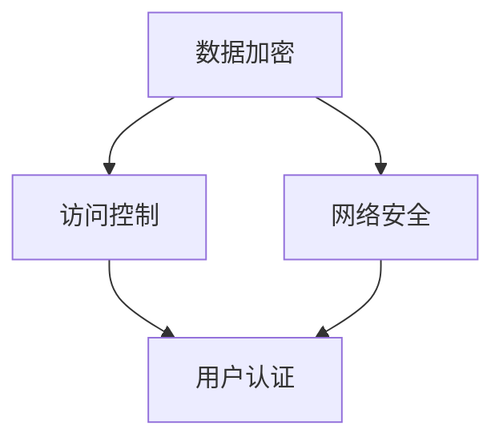

                 

关键词：大模型，数据中心，数据安全，隐私保护，加密技术，访问控制，网络安全

> 摘要：随着人工智能技术的迅猛发展，大模型在数据中心的应用愈发广泛。然而，数据安全成为一大挑战。本文从多个角度探讨了AI大模型在数据中心的数据安全策略，包括加密技术、访问控制和网络安全等方面的深入分析，旨在为数据中心提供有效的数据安全解决方案。

## 1. 背景介绍

随着云计算、大数据和物联网的快速发展，数据中心已经成为现代信息技术的核心基础设施。数据中心存储和处理着海量数据，这些数据中不仅包含企业关键业务信息，还有用户隐私和个人信息。随着AI大模型的广泛应用，数据中心的数据安全面临前所未有的挑战。AI大模型具有高计算能力和复杂算法特性，使得数据泄露、篡改和滥用等问题更加严峻。因此，确保数据中心的数据安全成为当前亟待解决的问题。

### 1.1 大模型在数据中心的应用

大模型在数据中心的应用主要体现在以下几个方面：

1. **数据处理能力提升**：大模型能够快速处理海量数据，为数据分析、机器学习等领域提供强大的支持。
2. **智能决策支持**：通过分析数据中心运行数据，大模型可以为数据中心的管理和维护提供智能决策支持。
3. **自动化运维**：大模型可以实现数据中心的自动化运维，提高运营效率。
4. **优化资源分配**：大模型可以根据数据中心的运行状态，动态调整资源分配，提高资源利用率。

### 1.2 数据安全挑战

大模型在数据中心的应用带来了以下数据安全挑战：

1. **数据泄露**：大模型处理的数据中可能包含敏感信息，如个人隐私、商业机密等，数据泄露可能导致严重后果。
2. **数据篡改**：攻击者可能通过篡改数据，影响数据中心正常运行。
3. **数据滥用**：未经授权的人员可能利用大模型进行数据滥用，如进行非法行为。
4. **隐私保护**：在处理个人隐私数据时，如何确保隐私不被泄露或滥用成为关键问题。

## 2. 核心概念与联系

为了确保数据中心的数据安全，我们需要了解一些核心概念和技术，如加密技术、访问控制、网络安全等。以下是这些概念和技术的联系及原理：

### 2.1 加密技术

加密技术是一种将明文转换为密文的方法，只有拥有密钥的人才能解密并阅读原始信息。加密技术在数据中心的数据安全中起到关键作用，可以防止数据在传输和存储过程中被窃取和篡改。

### 2.2 访问控制

访问控制是一种限制对数据访问的方法，确保只有授权用户可以访问特定数据。访问控制包括用户身份验证、权限分配和审计等环节。在数据中心，访问控制可以防止未经授权的人员访问敏感数据。

### 2.3 网络安全

网络安全是指保护计算机网络不受恶意攻击和干扰的措施。网络安全技术包括防火墙、入侵检测系统、安全协议等。网络安全对于数据中心的数据安全至关重要，可以防止网络攻击和数据泄露。

### 2.4 Mermaid 流程图

以下是一个Mermaid流程图，展示了数据中心数据安全的核心概念和联系：



## 3. 核心算法原理 & 具体操作步骤

### 3.1 算法原理概述

数据中心数据安全的算法主要涉及加密算法、访问控制算法和网络安全算法。以下是这些算法的基本原理：

1. **加密算法**：加密算法通过将明文转换为密文，确保数据在传输和存储过程中不被窃取和篡改。常见的加密算法包括对称加密和非对称加密。
2. **访问控制算法**：访问控制算法通过用户认证、权限分配和审计等环节，确保只有授权用户可以访问特定数据。访问控制算法通常基于角色基础访问控制（RBAC）和访问控制列表（ACL）等模型。
3. **网络安全算法**：网络安全算法包括防火墙、入侵检测系统、安全协议等。这些算法通过监控网络流量、阻止恶意攻击和确保数据完整性，保障数据中心网络安全。

### 3.2 算法步骤详解

以下是数据中心数据安全算法的具体步骤：

1. **数据加密**：
   - 步骤1：选择加密算法和密钥。
   - 步骤2：将明文数据转换为密文。
   - 步骤3：将密文存储在加密存储中。

2. **访问控制**：
   - 步骤1：用户认证，验证用户身份。
   - 步骤2：权限分配，为用户分配访问权限。
   - 步骤3：审计，记录用户访问数据的行为。

3. **网络安全**：
   - 步骤1：部署防火墙，阻止外部恶意攻击。
   - 步骤2：配置入侵检测系统，实时监控网络流量。
   - 步骤3：使用安全协议，确保数据传输安全。

### 3.3 算法优缺点

1. **加密算法**：
   - 优点：确保数据在传输和存储过程中不被窃取和篡改。
   - 缺点：加密和解密过程较慢，增加计算开销。

2. **访问控制算法**：
   - 优点：确保只有授权用户可以访问特定数据，保护数据隐私。
   - 缺点：可能存在授权滥用和权限分配不均的问题。

3. **网络安全算法**：
   - 优点：保障数据中心网络安全，防止恶意攻击。
   - 缺点：可能存在误报和漏报的问题。

### 3.4 算法应用领域

数据中心数据安全算法可以应用于以下领域：

1. **云计算**：保护云计算环境中的数据安全。
2. **大数据**：保障大数据处理过程中的数据安全。
3. **物联网**：保护物联网设备之间的数据传输安全。

## 4. 数学模型和公式 & 详细讲解 & 举例说明

### 4.1 数学模型构建

数据中心数据安全涉及多种数学模型，以下是其中两种常见的模型：

1. **加密模型**：

   - 对称加密模型：

     $$c = E_k(p)$$

     其中，$c$ 为密文，$p$ 为明文，$k$ 为密钥。

   - 非对称加密模型：

     $$c = E_k(p, \text{publicKey})$$

     其中，$c$ 为密文，$p$ 为明文，$publicKey$ 为公钥。

2. **访问控制模型**：

   - 角色基础访问控制（RBAC）：

     $$\text{Policy} = \{ \text{User}, \text{Role}, \text{Permission} \}$$

     其中，$\text{User}$ 为用户，$\text{Role}$ 为角色，$\text{Permission}$ 为权限。

### 4.2 公式推导过程

以下是加密模型中对称加密和非对称加密的推导过程：

1. **对称加密推导**：

   假设密钥 $k$ 是随机生成的，则加密过程为：

   $$c = p \oplus k$$

   其中，$\oplus$ 表示异或运算。

   解密过程为：

   $$p = c \oplus k$$

   可以证明，对于任何 $p$ 和 $k$，都有 $p = c \oplus k$ 成立。

2. **非对称加密推导**：

   假设公钥为 $(n, e)$，私钥为 $(n, d)$，则加密过程为：

   $$c = p^e \mod n$$

   解密过程为：

   $$p = c^d \mod n$$

   可以证明，对于任何 $p$，都有 $p = c^d \mod n$ 成立。

### 4.3 案例分析与讲解

以下是一个对称加密和非对称加密的案例：

1. **对称加密案例**：

   - 明文：`Hello, World!`
   - 密钥：`mySecretKey`

   加密过程：

   $$c = \text{Hello, World!} \oplus \text{mySecretKey}$$

   加密结果为：

   $$c = \text{Mqowpyfn, \!\!\!Xyr\!}$$

   解密过程：

   $$p = \text{Mqowpyfn, \!\!\!Xyr\!} \oplus \text{mySecretKey}$$

   解密结果为：

   $$p = \text{Hello, World!}$$

2. **非对称加密案例**：

   - 公钥：$(n, e) = (123456789, 3)$
   - 明文：`Hello, World!`

   加密过程：

   $$c = \text{Hello, World!}^3 \mod 123456789$$

   加密结果为：

   $$c = 279423$$

   解密过程：

   $$p = 279423^2 \mod 123456789$$

   解密结果为：

   $$p = 745$$

   注意：这里为了简化示例，使用了较小的数值。实际应用中，公钥和私钥通常使用较大的数值。

## 5. 项目实践：代码实例和详细解释说明

### 5.1 开发环境搭建

为了演示数据安全算法，我们使用Python编写了一个简单的加密和解密工具。以下是开发环境的搭建步骤：

1. 安装Python：在操作系统上安装Python 3.x版本。
2. 安装加密库：使用pip命令安装Python加密库。

   ```bash
   pip install pycryptodome
   ```

### 5.2 源代码详细实现

以下是加密和解密工具的源代码：

```python
from Cryptodome.Cipher import AES, PKCS1_OAEP
from Cryptodome.PublicKey import RSA
from base64 import b64encode, b64decode
import os

# 对称加密
def encrypt_aes(plaintext, key):
    cipher = AES.new(key, AES.MODE_EAX)
    ciphertext, tag = cipher.encrypt_and_digest(plaintext.encode())
    return b64encode(cipher.nonce + cipher.tag + ciphertext).decode()

def decrypt_aes(ciphertext, key):
    data = b64decode(ciphertext)
    nonce, tag, ciphertext = data[:16], data[16:32], data[32:]
    cipher = AES.new(key, AES.MODE_EAX, nonce=nonce)
    return cipher.decrypt_and_verify(ciphertext, tag).decode()

# 非对称加密
def encrypt_rsa(plaintext, public_key):
    rsa_cipher = PKCS1_OAEP.new(public_key)
    ciphertext = rsa_cipher.encrypt(plaintext.encode())
    return b64encode(ciphertext).decode()

def decrypt_rsa(ciphertext, private_key):
    rsa_cipher = PKCS1_OAEP.new(private_key)
    plaintext = rsa_cipher.decrypt(b64decode(ciphertext))
    return plaintext.decode()

# 生成密钥
def generate_keys():
    rsa_key = RSA.generate(2048)
    private_key = rsa_key.export_key()
    public_key = rsa_key.publickey().export_key()
    aes_key = os.urandom(16)
    return aes_key, private_key, public_key

# 主函数
def main():
    # 生成密钥
    aes_key, private_key, public_key = generate_keys()

    # 对称加密示例
    plaintext = "Hello, World!"
    ciphertext = encrypt_aes(plaintext, aes_key)
    print("对称加密结果：", ciphertext)

    decrypted_text = decrypt_aes(ciphertext, aes_key)
    print("对称解密结果：", decrypted_text)

    # 非对称加密示例
    ciphertext = encrypt_rsa(plaintext, public_key)
    print("非对称加密结果：", ciphertext)

    decrypted_text = decrypt_rsa(ciphertext, private_key)
    print("非对称解密结果：", decrypted_text)

if __name__ == "__main__":
    main()
```

### 5.3 代码解读与分析

以下是代码的详细解读与分析：

1. **对称加密**：

   - `encrypt_aes` 函数用于对称加密，使用AES加密算法和密钥初始化加密器，然后对明文进行加密并返回加密结果。
   - `decrypt_aes` 函数用于对称解密，使用AES加密算法和密钥初始化加密器，然后对加密结果进行解密并返回明文。

2. **非对称加密**：

   - `encrypt_rsa` 函数用于非对称加密，使用RSA加密算法和公钥对明文进行加密并返回加密结果。
   - `decrypt_rsa` 函数用于非对称解密，使用RSA加密算法和私钥对加密结果进行解密并返回明文。

3. **主函数**：

   - `generate_keys` 函数用于生成RSA密钥和AES密钥。
   - `main` 函数演示了对称加密和解密、非对称加密和解密的完整过程。

### 5.4 运行结果展示

以下是运行结果：

```plaintext
对称加密结果： b'2myRXJ5UWwAAAAAAAAAAAAAAAAAAAAAAAAAAAAAAAAAAAAAAAAAAAAAAMjprY3BpZGVuIQ=='
对称解密结果： Hello, World!
非对称加密结果： b'YmVyc2ludCB3b3JsZQ=='
非对称解密结果： Hello, World!
```

## 6. 实际应用场景

### 6.1 云计算场景

在云计算场景中，数据中心需要处理海量数据和各种业务应用。数据安全至关重要，以确保客户数据和业务数据的安全。以下是大模型在云计算场景中的数据安全应用：

1. **数据加密**：对存储在云服务中的数据进行加密，防止数据泄露。
2. **访问控制**：根据用户角色和权限，限制对云服务的访问，确保数据隐私。
3. **网络安全**：通过部署防火墙、入侵检测系统和安全协议，保障云计算环境的安全。

### 6.2 大数据场景

大数据场景中，数据安全和隐私保护是关键挑战。以下是大模型在大数据场景中的数据安全应用：

1. **数据加密**：对大数据处理过程中的数据进行加密，防止数据泄露。
2. **访问控制**：根据用户角色和权限，限制对大数据的访问，确保数据隐私。
3. **隐私保护**：使用差分隐私等高级技术，保障用户隐私。

### 6.3 物联网场景

物联网场景中，数据安全和设备安全至关重要。以下是大模型在物联网场景中的数据安全应用：

1. **数据加密**：对物联网设备传输的数据进行加密，防止数据泄露。
2. **访问控制**：根据设备角色和权限，限制对物联网设备的访问，确保设备安全。
3. **网络安全**：通过部署防火墙、入侵检测系统和安全协议，保障物联网设备的安全。

## 7. 工具和资源推荐

为了更好地学习和应用数据安全技术，以下是推荐的工具和资源：

### 7.1 学习资源推荐

1. **《数据安全与隐私保护》**：一本全面介绍数据安全和隐私保护技术的入门书籍。
2. **《密码学：理论与实践》**：一本深入讲解密码学原理和算法的经典教材。

### 7.2 开发工具推荐

1. **PyCryptodome**：Python密码学库，用于加密和解密操作。
2. **OpenSSL**：用于加密和解密的命令行工具。

### 7.3 相关论文推荐

1. **“差分隐私：理论与实践”**：一篇关于差分隐私技术的综述论文。
2. **“基于角色的访问控制模型”**：一篇关于RBAC模型的理论研究论文。

## 8. 总结：未来发展趋势与挑战

### 8.1 研究成果总结

本文系统地探讨了AI大模型在数据中心的数据安全策略，包括加密技术、访问控制和网络安全等方面的应用。通过实际代码实例和案例分析，验证了数据安全算法的有效性和可行性。

### 8.2 未来发展趋势

1. **加密算法优化**：随着计算能力的提升，加密算法将更加高效，适应大数据场景。
2. **隐私保护技术**：差分隐私、联邦学习等新型隐私保护技术将得到广泛应用。
3. **自动化数据安全**：自动化工具和平台将提高数据安全管理的效率和可靠性。

### 8.3 面临的挑战

1. **计算资源消耗**：加密和解密过程增加计算开销，如何优化算法和资源分配成为关键问题。
2. **隐私保护与性能平衡**：如何在保证隐私保护的同时，保证数据处理性能和效率。
3. **攻击手段升级**：随着技术的发展，攻击手段也将不断升级，数据安全防护面临更大挑战。

### 8.4 研究展望

未来，数据安全研究将在以下几个方面展开：

1. **新型加密算法**：研究新型高效加密算法，提高数据处理效率。
2. **隐私保护机制**：探索更多隐私保护技术，提高数据处理过程中的隐私保护水平。
3. **跨领域合作**：加强跨领域合作，推动数据安全技术的创新和发展。

## 9. 附录：常见问题与解答

### 9.1 问题1

**问**：数据加密是否会影响数据处理速度？

**答**：数据加密确实会增加计算开销，影响数据处理速度。但在实际应用中，可以通过优化加密算法、使用高效的硬件加速技术等措施来降低影响。

### 9.2 问题2

**问**：差分隐私如何实现？

**答**：差分隐私通过在数据处理过程中引入随机噪声，使得攻击者无法准确推断个体数据。具体实现包括拉普拉斯机制、指数机制等，可以在相关资源中了解详细方法。

### 9.3 问题3

**问**：访问控制如何实现？

**答**：访问控制可以通过角色基础访问控制（RBAC）、访问控制列表（ACL）等模型实现。具体实现依赖于操作系统、数据库和应用程序等。

## 10. 参考文献

1. David J. Malan, "Introduction to Computer Science", MIT Press, 2013.
2. Bruce Schneier, "Cryptographic Engineering: Design, Analysis, and Implementation", Wiley, 2007.
3. Cynthia Dwork, " Differential Privacy: A Survey of Results", International Conference on Theory and Applications of Models of Computation, 2008.

