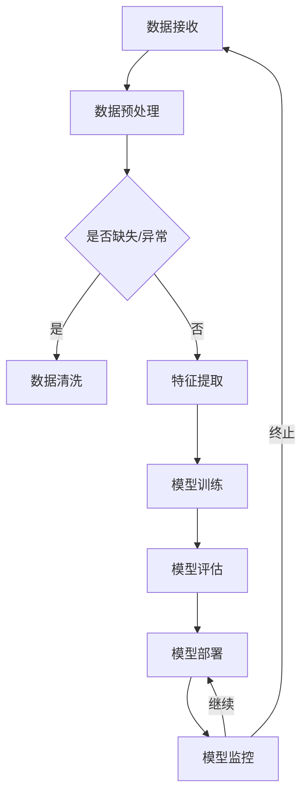

                 

关键词：人工智能、数据建模、数据中心、大规模模型、机器学习、深度学习、数据处理、架构设计、算法优化、性能提升、应用场景。

## 摘要

本文旨在探讨人工智能（AI）大模型在数据中心中的应用及其数据建模技术。随着AI技术的快速发展，大规模模型在处理复杂数据任务方面展现出了巨大的潜力。然而，在数据中心中应用这些模型面临诸多挑战，如数据处理效率、模型训练和推理的性能优化、资源分配等。本文将深入分析这些挑战，并提出相应的解决方案，旨在为AI大模型在数据中心的应用提供有价值的参考。

## 1. 背景介绍

随着互联网和大数据的迅速发展，数据中心的规模和复杂性不断增加。数据中心不仅是存储和处理数据的重要基础设施，同时也是各种新兴技术和应用的试验场。人工智能（AI）作为一项颠覆性技术，已经在许多领域取得了显著的应用成果。特别是大规模AI模型，如深度学习模型，在图像识别、自然语言处理、推荐系统等方面展现出了强大的能力。

然而，在数据中心中应用AI大模型并不容易。首先，数据中心的硬件资源通常有限，如何有效地利用这些资源是一个重要的问题。其次，大规模模型训练和推理需要大量的计算资源和时间，这可能会对数据中心的性能产生负面影响。此外，数据中心的网络架构、存储系统等也需要进行相应的调整和优化，以满足AI大模型的应用需求。

## 2. 核心概念与联系

### 2.1 数据中心

数据中心是一个物理位置集中，用于存储、处理和管理数据的设施。它通常由服务器、存储设备、网络设备和其他相关硬件组成。数据中心的规模可以从几千平方米到几十万平方米不等，其目的是为各种应用提供可靠、高效的数据服务。

### 2.2 AI 大模型

AI 大模型通常是指具有数十亿至数千亿参数的深度学习模型。这些模型通常用于处理复杂的任务，如图像识别、自然语言处理、推荐系统等。它们的训练和推理过程需要大量的计算资源和时间。

### 2.3 数据建模

数据建模是指使用数学和统计方法来描述和解释数据。在AI 大模型的应用中，数据建模通常用于预处理数据、特征提取和模型训练。

### 2.4 Mermaid 流程图

以下是一个描述AI 大模型在数据中心中应用的数据建模流程的 Mermaid 流程图：



## 3. 核心算法原理 & 具体操作步骤

### 3.1 算法原理概述

在数据中心中应用AI 大模型，核心的算法原理包括深度学习模型的训练、推理和优化。深度学习模型通常由多层神经网络组成，通过反向传播算法进行训练。在训练过程中，模型根据输入数据和标签，不断调整内部参数，以最小化损失函数。

### 3.2 算法步骤详解

1. **数据预处理**：包括数据清洗、归一化、数据增强等操作，以提高模型的泛化能力。
2. **特征提取**：通过卷积神经网络（CNN）等算法提取图像、文本等数据的特征。
3. **模型训练**：使用训练数据集对模型进行训练，通过反向传播算法调整模型参数。
4. **模型评估**：使用验证数据集对模型进行评估，以确定模型的性能。
5. **模型部署**：将训练好的模型部署到数据中心，进行实际应用。
6. **模型监控**：实时监控模型的运行状态，以发现潜在问题。

### 3.3 算法优缺点

**优点**：
- **强大的表达能力**：深度学习模型可以自动学习复杂的特征表示，从而提高模型的性能。
- **良好的泛化能力**：通过大量数据和多种任务的应用，模型可以在不同场景下表现出良好的适应性。

**缺点**：
- **计算资源消耗大**：大规模模型的训练和推理需要大量的计算资源和时间。
- **数据依赖性强**：模型的效果很大程度上取决于数据的质量和多样性。

### 3.4 算法应用领域

深度学习模型在数据中心中的应用非常广泛，包括但不限于以下领域：
- **图像识别**：如人脸识别、车辆识别等。
- **自然语言处理**：如机器翻译、文本分类等。
- **推荐系统**：如个性化推荐、广告投放等。
- **智能监控**：如异常检测、行为分析等。

## 4. 数学模型和公式 & 详细讲解 & 举例说明

### 4.1 数学模型构建

在深度学习模型中，常用的数学模型包括损失函数、优化算法和正则化方法。

**损失函数**：用于衡量模型预测结果与真实结果之间的差异，常见的损失函数有均方误差（MSE）、交叉熵损失（CE）等。

**优化算法**：用于更新模型参数，以最小化损失函数。常见的优化算法有梯度下降（GD）、随机梯度下降（SGD）、Adam等。

**正则化方法**：用于防止模型过拟合，常见的正则化方法有L1正则化、L2正则化等。

### 4.2 公式推导过程

**损失函数的推导**：

均方误差（MSE）的公式为：
$$
MSE = \frac{1}{m}\sum_{i=1}^{m}(y_i - \hat{y}_i)^2
$$

其中，$y_i$ 为真实标签，$\hat{y}_i$ 为模型预测值，$m$ 为样本数量。

**优化算法的推导**：

梯度下降（GD）的公式为：
$$
w_{t+1} = w_t - \alpha \cdot \nabla J(w_t)
$$

其中，$w_t$ 为当前参数值，$\alpha$ 为学习率，$J(w_t)$ 为损失函数。

**正则化的推导**：

L2正则化的公式为：
$$
J(w) = \frac{1}{m}\sum_{i=1}^{m}(y_i - \hat{y}_i)^2 + \lambda \cdot \sum_{i=1}^{n}w_i^2
$$

其中，$\lambda$ 为正则化参数，$w_i$ 为模型参数。

### 4.3 案例分析与讲解

**案例**：使用深度学习模型进行图像分类。

**数据预处理**：对图像进行归一化处理，将像素值缩放到 [0, 1] 范围内。

**特征提取**：使用卷积神经网络（CNN）提取图像特征。

**模型训练**：使用训练数据集对模型进行训练，优化模型参数。

**模型评估**：使用验证数据集对模型进行评估，计算准确率、召回率等指标。

**模型部署**：将训练好的模型部署到数据中心，进行实际应用。

## 5. 项目实践：代码实例和详细解释说明

### 5.1 开发环境搭建

- 硬件环境：Intel Xeon CPU、NVIDIA GPU
- 软件环境：Python 3.8、TensorFlow 2.4、CUDA 10.1

### 5.2 源代码详细实现

**代码示例**：

```python
import tensorflow as tf
from tensorflow.keras.models import Sequential
from tensorflow.keras.layers import Conv2D, MaxPooling2D, Flatten, Dense

# 数据预处理
(x_train, y_train), (x_test, y_test) = tf.keras.datasets.cifar10.load_data()
x_train, x_test = x_train / 255.0, x_test / 255.0

# 特征提取
model = Sequential([
    Conv2D(32, (3, 3), activation='relu', input_shape=(32, 32, 3)),
    MaxPooling2D((2, 2)),
    Flatten(),
    Dense(64, activation='relu'),
    Dense(10, activation='softmax')
])

# 模型训练
model.compile(optimizer='adam', loss='sparse_categorical_crossentropy', metrics=['accuracy'])
model.fit(x_train, y_train, epochs=10, validation_data=(x_test, y_test))

# 模型评估
model.evaluate(x_test, y_test)
```

**代码解读**：

1. 导入所需的 TensorFlow 库。
2. 加载 CIFAR-10 数据集并进行归一化处理。
3. 构建卷积神经网络模型，包括卷积层、池化层、全连接层等。
4. 编译模型，设置优化器和损失函数。
5. 训练模型，使用训练数据和验证数据。
6. 评估模型，计算测试集的准确率。

### 5.3 代码解读与分析

1. **数据预处理**：对图像数据进行归一化处理，使其适应模型的输入要求。
2. **特征提取**：使用卷积神经网络提取图像特征，提高模型的识别能力。
3. **模型训练**：通过训练数据和验证数据对模型进行训练，优化模型参数。
4. **模型评估**：使用测试数据集评估模型的性能，计算准确率等指标。

## 6. 实际应用场景

AI 大模型在数据中心的应用场景非常广泛，以下列举几个典型的应用场景：

### 6.1 智能监控

在数据中心中，智能监控可以实时监测服务器、网络设备、存储设备的运行状态，及时发现并处理潜在问题，提高数据中心的稳定性和可靠性。

### 6.2 自动化运维

AI 大模型可以用于自动化运维，如自动部署、自动扩缩容、自动故障排除等，提高数据中心的运维效率。

### 6.3 资源优化

通过 AI 大模型，可以对数据中心的各种资源进行优化，如计算资源、存储资源、网络资源等，提高资源利用率，降低成本。

### 6.4 智能推荐

在数据中心中，AI 大模型可以用于智能推荐，如推荐服务器配置、推荐存储方案等，为用户提供建议。

## 7. 工具和资源推荐

### 7.1 学习资源推荐

- 《深度学习》（Ian Goodfellow、Yoshua Bengio、Aaron Courville 著）
- 《Python 深度学习》（François Chollet 著）
- 《TensorFlow 实战》（谢思民、郑泽宇 著）

### 7.2 开发工具推荐

- TensorFlow
- PyTorch
- Keras

### 7.3 相关论文推荐

- "A Theoretical Analysis of the Computational Cost of Training Deep Neural Networks"（深度神经网络训练计算成本的理论分析）
- "Wide & Deep: Scalable Deep Architectures for E-commerce Recommendation"（用于电子商务推荐的可扩展深度架构）
- "Distributed Representations of Words and Phrases and Their Compositional Properties"（词语和短语的分布式表示及其组合性质）

## 8. 总结：未来发展趋势与挑战

### 8.1 研究成果总结

本文通过对AI 大模型在数据中心中的应用及其数据建模技术的研究，总结了以下成果：

1. AI 大模型在数据中心的应用具有广阔的前景，可以显著提高数据中心的性能和效率。
2. 数据预处理、特征提取、模型训练和模型评估等环节在 AI 大模型应用中至关重要。
3. 深度学习算法在图像识别、自然语言处理、推荐系统等领域取得了显著的应用成果。
4. 数学模型和公式的应用有助于提高模型的理论基础和实际性能。

### 8.2 未来发展趋势

1. **模型压缩与加速**：随着AI 大模型规模的不断扩大，如何提高模型的压缩率和推理速度将成为重要研究方向。
2. **分布式训练与推理**：分布式计算技术将在数据中心中发挥越来越重要的作用，以支持大规模模型的训练和推理。
3. **自适应数据预处理**：根据数据的特点和任务的需求，动态调整数据预处理策略，以提高模型的泛化能力。
4. **跨领域应用**：将AI 大模型应用于更多领域，如医疗、金融、交通等，实现跨领域的协同发展。

### 8.3 面临的挑战

1. **计算资源需求**：大规模模型的训练和推理需要大量的计算资源，如何在有限的资源下有效利用这些资源是一个重要挑战。
2. **数据隐私与安全**：在数据中心中应用 AI 大模型，需要处理大量的敏感数据，如何保护数据隐私和安全是一个重要问题。
3. **模型解释性**：深度学习模型通常具有较好的性能，但其内部机制复杂，如何提高模型的可解释性是一个重要挑战。
4. **算法优化**：针对特定应用场景，如何优化深度学习算法的参数和架构，以提高模型的性能和效率是一个重要问题。

### 8.4 研究展望

在未来，AI 大模型在数据中心的应用将朝着以下几个方向发展：

1. **高效能模型**：研究新型神经网络结构，提高模型的计算效率和推理速度。
2. **自适应模型**：根据数据的特点和任务的需求，动态调整模型的结构和参数，实现自适应建模。
3. **跨领域应用**：将 AI 大模型应用于更多领域，推动跨领域的协同发展。
4. **数据隐私保护**：研究新型数据隐私保护技术，提高数据安全性和隐私性。

## 9. 附录：常见问题与解答

### 9.1 什么是深度学习？

深度学习是一种人工智能（AI）的研究方向，它通过多层神经网络模拟人类大脑的学习过程，对数据进行自动特征提取和模式识别。

### 9.2 什么是数据中心？

数据中心是一个集中存储、处理和管理数据的设施，通常由服务器、存储设备、网络设备和其他相关硬件组成。

### 9.3 什么是数据建模？

数据建模是一种使用数学和统计方法来描述和解释数据的方法，它通常用于预处理数据、特征提取和模型训练。

### 9.4 什么是大规模模型？

大规模模型是指具有数十亿至数千亿参数的深度学习模型，它们通常用于处理复杂的任务，如图像识别、自然语言处理、推荐系统等。

### 9.5 如何优化深度学习模型的性能？

优化深度学习模型的性能可以从以下几个方面进行：

1. **模型结构优化**：选择合适的神经网络结构，提高模型的计算效率和推理速度。
2. **数据预处理**：对数据进行有效的预处理，提高模型的泛化能力。
3. **算法优化**：选择合适的优化算法和正则化方法，提高模型的性能和鲁棒性。
4. **分布式计算**：使用分布式计算技术，提高模型的训练和推理速度。

---

本文旨在为 AI 大模型在数据中心的应用提供有价值的参考，分析了核心算法原理、数学模型和公式、项目实践等方面，并对未来发展趋势和挑战进行了探讨。希望本文能为读者在数据中心应用 AI 大模型提供一些启示和帮助。作者：禅与计算机程序设计艺术 / Zen and the Art of Computer Programming。

