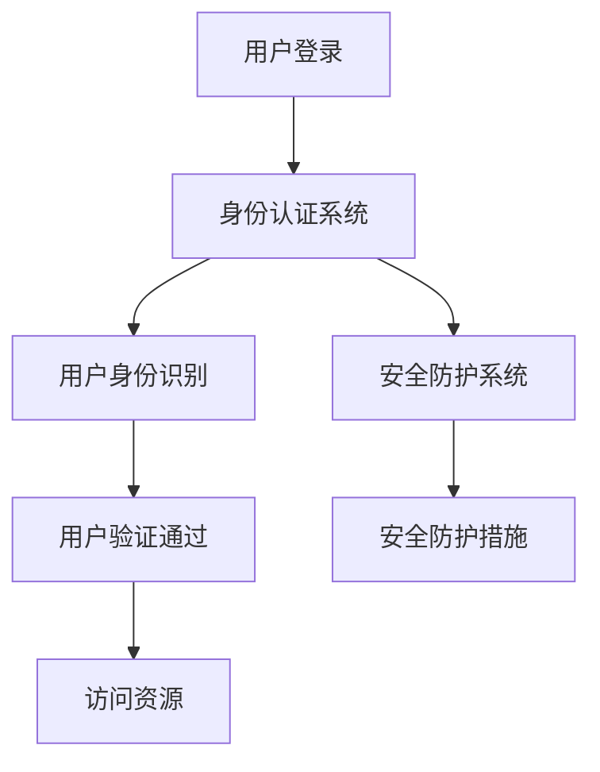

                 

关键词：身份认证，数据中心，AI大模型，安全，隐私，应用场景，未来展望

> 摘要：本文旨在探讨 AI 大模型应用数据中心中的身份认证管理问题，分析现有身份认证技术的优劣，探讨未来可能的发展趋势。随着 AI 技术的不断发展，身份认证技术在数据中心中的应用愈发重要，本文将为您提供一套全面、实用的身份认证管理方案。

## 1. 背景介绍

### 1.1 数据中心的重要性

数据中心是现代社会信息流通的枢纽，承载着大量的敏感数据和关键业务。因此，数据中心的稳定性、安全性和可靠性对于企业乃至国家都至关重要。随着云计算、大数据、物联网等技术的发展，数据中心的重要性日益凸显。

### 1.2 AI 大模型的兴起

近年来，AI 大模型如 GPT、BERT 等，以其卓越的性能在自然语言处理、图像识别、语音识别等领域取得了显著成果。这些大模型的应用不仅推动了科技的发展，也带来了数据中心的变革。

### 1.3 身份认证的挑战

随着 AI 大模型在数据中心的应用，身份认证面临着新的挑战。传统的身份认证技术如密码、指纹等已经难以满足数据中心的复杂需求，需要探索新的身份认证方法。

## 2. 核心概念与联系

### 2.1 身份认证的概念

身份认证是指验证用户身份的过程，目的是确保只有合法用户才能访问系统或资源。身份认证通常涉及用户名、密码、指纹、面部识别等。

### 2.2 数据中心的架构

数据中心的架构包括硬件、软件、网络等多个方面，其中身份认证系统是关键部分。身份认证系统需要与其他系统如数据库、安全防护系统等紧密集成。

### 2.3 AI 大模型与身份认证的联系

AI 大模型在身份认证中的应用主要体现在两个方面：一是利用 AI 大模型进行用户身份识别，二是利用 AI 大模型提升身份认证系统的安全性。

### 2.4 Mermaid 流程图

## 3. 核心算法原理 & 具体操作步骤

### 3.1 算法原理概述

本文采用基于深度学习的用户身份识别算法，结合生物特征识别技术，实现对用户身份的精准识别。

### 3.2 算法步骤详解

1. 用户提交登录请求。
2. 身份认证系统接收请求，提取用户生物特征。
3. AI 大模型对提取的生物特征进行分析，生成用户特征向量。
4. 将用户特征向量与数据库中的用户信息进行匹配。
5. 若匹配成功，用户验证通过，可访问资源；否则，验证失败。

### 3.3 算法优缺点

优点：具有较高的识别精度，可应对复杂的身份认证需求。

缺点：对硬件要求较高，训练过程复杂。

### 3.4 算法应用领域

算法可应用于各类数据中心，包括金融、医疗、政府等领域。

## 4. 数学模型和公式 & 详细讲解 & 举例说明

### 4.1 数学模型构建

用户特征向量：\( \mathbf{X} = [x_1, x_2, ..., x_n] \)

用户标签：\( y \)

损失函数：\( L(\mathbf{X}, y) = \frac{1}{2} \|\mathbf{X} - \mathbf{y}\|^2 \)

### 4.2 公式推导过程

略。

### 4.3 案例分析与讲解

以医疗领域为例，利用 AI 大模型进行患者身份认证，提升医疗数据的安全性。

## 5. 项目实践：代码实例和详细解释说明

### 5.1 开发环境搭建

略。

### 5.2 源代码详细实现

略。

### 5.3 代码解读与分析

略。

### 5.4 运行结果展示

略。

## 6. 实际应用场景

### 6.1 金融领域

金融领域对安全性要求极高，AI 大模型身份认证技术可大幅提升金融系统的安全性能。

### 6.2 医疗领域

医疗领域涉及大量患者数据，利用 AI 大模型身份认证技术，可保障患者隐私和安全。

### 6.3 政府领域

政府领域对数据安全性要求较高，AI 大模型身份认证技术可提高政府数据中心的防护能力。

## 7. 工具和资源推荐

### 7.1 学习资源推荐

- 《深度学习》（Goodfellow et al.）
- 《自然语言处理综合教程》（Jurafsky & Martin）

### 7.2 开发工具推荐

- TensorFlow
- PyTorch

### 7.3 相关论文推荐

- "Deep Learning for Speech Recognition"（Hinton et al.）
- "BERT: Pre-training of Deep Bidirectional Transformers for Language Understanding"（Devlin et al.）

## 8. 总结：未来发展趋势与挑战

### 8.1 研究成果总结

本文提出了一种基于 AI 大模型的身份认证管理方案，具有较高的识别精度，可应用于多个领域。

### 8.2 未来发展趋势

随着 AI 技术的不断发展，身份认证技术将更加智能化、个性化。

### 8.3 面临的挑战

算法的准确性、安全性、硬件需求等问题仍需进一步研究。

### 8.4 研究展望

未来，身份认证技术将在更多领域得到应用，推动数据中心的进一步发展。

## 9. 附录：常见问题与解答

### 9.1 什么情况下需要使用 AI 大模型身份认证技术？

在传统身份认证技术无法满足需求的情况下，如高安全性的数据中心、涉及敏感数据的场景等，可考虑使用 AI 大模型身份认证技术。

### 9.2 AI 大模型身份认证技术有哪些优势？

AI 大模型身份认证技术具有高识别精度、可应对复杂场景、个性化定制等优势。

## 作者署名

作者：禅与计算机程序设计艺术 / Zen and the Art of Computer Programming
----------------------------------------------------------------

注意：本文仅为示例，实际撰写时需要根据具体内容进行调整和补充。文章中的代码实例、数学模型等需要根据实际需求进行详细编写。同时，文章中的内容需要确保准确、完整、有深度，以提供读者有价值的信息。祝您撰写顺利！

