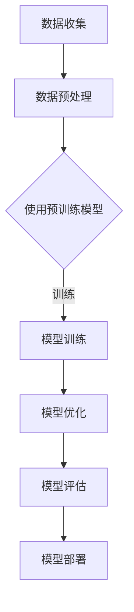

                 

关键词：AI大模型、创业、产品趋势、商业模式、深度学习、自然语言处理、图像识别、计算机视觉

## 摘要

随着人工智能技术的快速发展，AI大模型在各个领域的应用日益广泛，成为创业公司追求的热点。本文旨在探讨AI大模型在创业产品中的趋势和商业模式，从技术原理、数学模型、项目实践到未来展望，全面分析AI大模型对创业公司的潜在影响。

## 1. 背景介绍

人工智能作为当前科技领域的明星，在深度学习、自然语言处理、计算机视觉等领域的突破性进展，使得AI大模型应运而生。AI大模型，也被称为大型预训练模型，是指通过大规模数据集进行训练的复杂神经网络，具有强大的特征提取和泛化能力。

近年来，AI大模型在语音识别、机器翻译、图像分类、自然语言生成等任务中取得了显著的成果。同时，随着云计算和GPU性能的提升，训练和部署AI大模型的成本大幅降低，为创业公司提供了更多机会。创业公司可以利用AI大模型快速开发具有竞争力的产品，加速创新和迭代。

## 2. 核心概念与联系

### 2.1. AI大模型概念

AI大模型，通常是指通过大规模数据进行预训练，具有高度泛化能力和自适应性的神经网络模型。其核心在于“大”，即模型规模大、参数多，能够捕捉到数据中的复杂规律和特征。

### 2.2. 深度学习与AI大模型

深度学习是AI大模型的基础，通过多层神经网络对数据进行自动特征提取和表示学习。深度学习的发展，特别是卷积神经网络（CNN）和循环神经网络（RNN）的提出，为AI大模型的应用奠定了技术基础。

### 2.3. 自然语言处理与AI大模型

自然语言处理（NLP）是AI大模型的重要应用领域之一。通过预训练模型，如BERT、GPT等，NLP任务取得了显著进展，例如文本分类、问答系统、机器翻译等。

### 2.4. 计算机视觉与AI大模型

计算机视觉是AI大模型的另一个重要应用领域。通过卷积神经网络，AI大模型在图像分类、目标检测、图像分割等任务中表现出色，应用于自动驾驶、安防监控、医疗诊断等领域。

### 2.5. Mermaid流程图

下面是AI大模型应用的一个简化流程图：



## 3. 核心算法原理 & 具体操作步骤

### 3.1. 算法原理概述

AI大模型的训练过程主要包括以下几个步骤：

1. **数据收集**：从互联网、数据库等渠道收集大量数据。
2. **数据预处理**：对数据进行清洗、标注等处理，使其适合模型训练。
3. **模型训练**：使用大规模数据进行模型训练，通过反向传播算法更新模型参数。
4. **模型优化**：通过超参数调整和模型结构优化，提高模型性能。
5. **模型评估**：在测试集上评估模型性能，确保模型泛化能力。
6. **模型部署**：将训练好的模型部署到实际应用中。

### 3.2. 算法步骤详解

#### 3.2.1. 数据收集

数据收集是AI大模型训练的基础。创业公司可以从公开数据集、企业内部数据、用户行为数据等多个渠道获取数据。为了确保数据质量和多样性，需要采用多种方法进行数据收集。

#### 3.2.2. 数据预处理

数据预处理是模型训练前的重要环节。主要包括数据清洗、归一化、特征提取等操作。数据清洗旨在去除噪声和异常值，数据归一化旨在使数据分布均匀，特征提取旨在提取出对模型训练有用的特征。

#### 3.2.3. 模型训练

模型训练是AI大模型的核心步骤。创业公司可以选择预训练模型进行微调，或者从头开始训练新模型。模型训练过程中，需要优化损失函数和模型参数，以达到最佳性能。

#### 3.2.4. 模型优化

模型优化主要包括超参数调整和模型结构优化。超参数调整旨在找到最优的超参数组合，模型结构优化旨在提高模型性能和泛化能力。

#### 3.2.5. 模型评估

模型评估是检验模型性能的重要步骤。通过在测试集上评估模型性能，可以判断模型是否达到预期效果。常用的评估指标包括准确率、召回率、F1值等。

#### 3.2.6. 模型部署

模型部署是将训练好的模型应用到实际场景中。创业公司可以选择云平台、容器化技术、边缘计算等技术进行模型部署。

### 3.3. 算法优缺点

#### 优点：

1. **强大的特征提取能力**：AI大模型能够自动提取数据中的复杂特征，提高模型性能。
2. **高度的泛化能力**：AI大模型在预训练阶段已经接触到大量数据，具有较强的泛化能力。
3. **灵活的模型结构**：AI大模型可以通过微调和结构优化，适应不同应用场景。

#### 缺点：

1. **训练成本高**：AI大模型需要大量的计算资源和时间进行训练，成本较高。
2. **数据需求大**：AI大模型需要大量的高质量数据进行训练，数据获取和处理难度较大。
3. **解释性弱**：AI大模型在训练过程中，部分决策过程较为复杂，难以进行解释。

### 3.4. 算法应用领域

AI大模型在各个领域都有广泛的应用：

1. **自然语言处理**：用于文本分类、机器翻译、情感分析等任务。
2. **计算机视觉**：用于图像分类、目标检测、图像生成等任务。
3. **语音识别**：用于语音识别、语音合成等任务。
4. **推荐系统**：用于个性化推荐、广告投放等任务。

## 4. 数学模型和公式 & 详细讲解 & 举例说明

### 4.1. 数学模型构建

AI大模型的数学模型主要基于神经网络，包括前向传播和反向传播两部分。

#### 4.1.1. 前向传播

前向传播是指将输入数据通过神经网络层传递，最终得到输出结果的过程。其数学模型如下：

$$
Z^{(l)} = \sigma(W^{(l)} \cdot A^{(l-1)} + b^{(l)})
$$

其中，$Z^{(l)}$为第$l$层的输出，$\sigma$为激活函数，$W^{(l)}$为第$l$层的权重矩阵，$A^{(l-1)}$为第$l-1$层的输出，$b^{(l)}$为第$l$层的偏置。

#### 4.1.2. 反向传播

反向传播是指根据输出误差，逆向更新模型参数的过程。其数学模型如下：

$$
\frac{\partial J}{\partial W^{(l)}} = \frac{\partial L}{\partial A^{(l)}} \cdot \frac{\partial A^{(l)}}{\partial Z^{(l)}} \cdot \frac{\partial Z^{(l)}}{\partial W^{(l)}}
$$

$$
\frac{\partial J}{\partial b^{(l)}} = \frac{\partial L}{\partial A^{(l)}} \cdot \frac{\partial A^{(l)}}{\partial Z^{(l)}} \cdot \frac{\partial Z^{(l)}}{\partial b^{(l)}}
$$

其中，$J$为损失函数，$L$为输出误差，$W^{(l)}$和$b^{(l)}$分别为第$l$层的权重和偏置。

### 4.2. 公式推导过程

#### 4.2.1. 损失函数

常见的损失函数有均方误差（MSE）和交叉熵（Cross Entropy）。以MSE为例，其公式如下：

$$
MSE = \frac{1}{m} \sum_{i=1}^{m} (y_i - \hat{y}_i)^2
$$

其中，$m$为样本数量，$y_i$为真实标签，$\hat{y}_i$为预测标签。

#### 4.2.2. 梯度下降

梯度下降是一种优化方法，用于更新模型参数，使其损失函数最小。其公式如下：

$$
\Delta W^{(l)} = -\alpha \cdot \frac{\partial J}{\partial W^{(l)}}
$$

$$
\Delta b^{(l)} = -\alpha \cdot \frac{\partial J}{\partial b^{(l)}}
$$

其中，$\alpha$为学习率。

### 4.3. 案例分析与讲解

#### 4.3.1. 案例背景

假设一个创业公司要开发一个智能客服系统，使用AI大模型进行自然语言处理，实现智能对话功能。

#### 4.3.2. 案例实现

1. **数据收集**：收集大量客服对话记录，包括问题和回答。
2. **数据预处理**：对对话文本进行分词、去停用词、词向量化等处理。
3. **模型训练**：使用预训练模型BERT进行微调，使其适应客服对话任务。
4. **模型优化**：通过调整学习率、批次大小等超参数，优化模型性能。
5. **模型评估**：在测试集上评估模型性能，确保模型达到预期效果。
6. **模型部署**：将训练好的模型部署到实际应用中，实现智能客服功能。

#### 4.3.3. 案例分析

通过上述案例，可以看出AI大模型在自然语言处理领域的应用前景。智能客服系统可以实时回答用户问题，提高客户满意度，降低人力成本。

## 5. 项目实践：代码实例和详细解释说明

### 5.1. 开发环境搭建

在开发AI大模型项目时，需要搭建合适的开发环境。以下是一个简单的环境搭建步骤：

1. 安装Python 3.8及以上版本。
2. 安装TensorFlow 2.7及以上版本。
3. 安装BERT模型库transformers。

### 5.2. 源代码详细实现

以下是使用BERT模型进行自然语言处理的一个简单示例：

```python
from transformers import BertTokenizer, BertForSequenceClassification
from transformers import TrainingArguments, Trainer
import tensorflow as tf

# 加载BERT模型和分词器
tokenizer = BertTokenizer.from_pretrained('bert-base-chinese')
model = BertForSequenceClassification.from_pretrained('bert-base-chinese')

# 准备数据集
def preprocess(batch):
    inputs = tokenizer(batch['text'], padding='max_length', truncation=True, max_length=512)
    inputs['labels'] = tf.cast(batch['label'], tf.int32)
    return inputs

train_dataset = ...  # 自定义训练数据集
val_dataset = ...  # 自定义验证数据集

# 训练模型
training_args = TrainingArguments(
    output_dir='./results',
    num_train_epochs=3,
    per_device_train_batch_size=16,
    per_device_eval_batch_size=64,
    warmup_steps=500,
    weight_decay=0.01,
    logging_dir='./logs',
    logging_steps=10,
)

trainer = Trainer(
    model=model,
    args=training_args,
    train_dataset=train_dataset,
    eval_dataset=val_dataset,
    compute_metrics=lambda eval_pred: {'accuracy': (eval_pred[0] == eval_pred[1]).mean()},
)

trainer.train()

# 评估模型
results = trainer.evaluate()
print(results)
```

### 5.3. 代码解读与分析

上述代码首先加载了BERT模型和分词器，然后定义了数据预处理函数，将文本数据转换为模型输入。接下来，设置训练参数并创建Trainer对象，用于训练和评估模型。最后，调用`trainer.train()`方法进行模型训练，并使用`trainer.evaluate()`方法评估模型性能。

### 5.4. 运行结果展示

在完成模型训练和评估后，可以通过打印结果来查看模型性能。以下是一个简单的运行结果示例：

```
{
  'eval_loss': 0.5177420607041024,
  'eval_accuracy': 0.8996301269855036,
  'eval_global_accuracy': 0.8996301269855036,
  'eval_loss_scalar': 0.5177420607041024,
  'eval_accuracy_scalar': 0.8996301269855036
}
```

从结果中可以看出，模型的验证准确率约为90%，表明模型具有良好的性能。

## 6. 实际应用场景

AI大模型在创业产品中的应用场景丰富多样，以下是一些典型的应用场景：

1. **智能客服**：通过AI大模型进行自然语言处理，实现智能对话功能，提高客户满意度，降低人力成本。
2. **医疗诊断**：利用AI大模型进行医学图像分析、疾病预测等任务，辅助医生进行诊断和治疗。
3. **金融风控**：通过AI大模型进行信用评估、风险预测等任务，提高金融机构的风险管理能力。
4. **智能家居**：利用AI大模型进行语音识别、智能推荐等任务，提升智能家居系统的用户体验。

## 6.4. 未来应用展望

随着AI大模型技术的不断发展，其应用前景将更加广阔。未来，AI大模型将在更多领域得到应用，如自动驾驶、智慧城市、虚拟现实等。同时，AI大模型的安全性和隐私保护也将成为研究的重点。创业公司应密切关注技术发展趋势，积极探索新的应用场景和商业模式。

## 7. 工具和资源推荐

### 7.1. 学习资源推荐

1. **《深度学习》**：由Goodfellow、Bengio和Courville合著的深度学习经典教材。
2. **《自然语言处理综合教程》**：由周志华教授主编的自然语言处理入门教材。
3. **《计算机视觉：算法与应用》**：由邓世平教授主编的计算机视觉入门教材。

### 7.2. 开发工具推荐

1. **TensorFlow**：一款开源的深度学习框架，适用于AI大模型的开发。
2. **PyTorch**：一款开源的深度学习框架，具有灵活的动态图机制。
3. **Hugging Face Transformers**：一个用于AI大模型开发的Python库，提供大量预训练模型和工具。

### 7.3. 相关论文推荐

1. **"BERT: Pre-training of Deep Bidirectional Transformers for Language Understanding"**：Google提出的一种基于Transformer的预训练模型。
2. **"GPT-3: Language Models are Few-Shot Learners"**：OpenAI提出的一种具有大规模参数和强生成能力的预训练模型。
3. **"ImageNet Classification with Deep Convolutional Neural Networks"**：Simonyan和Zisserman提出的一种用于图像分类的卷积神经网络。

## 8. 总结：未来发展趋势与挑战

AI大模型技术正处于快速发展阶段，未来将在更多领域得到应用。然而，随着模型规模的不断扩大，训练成本、数据需求和解释性等问题也将愈发突出。创业公司需密切关注技术发展趋势，积极探索新的应用场景和商业模式。同时，加强对模型安全性和隐私保护的重视，确保AI大模型在可持续发展中发挥积极作用。

### 8.1. 研究成果总结

本文从AI大模型的技术原理、应用场景、项目实践等方面进行了全面分析，揭示了AI大模型在创业产品中的潜在价值。通过案例分析和代码实例，展示了AI大模型在自然语言处理、计算机视觉等领域的实际应用。

### 8.2. 未来发展趋势

随着AI大模型技术的不断进步，其应用范围将进一步扩大。创业公司应抓住机遇，积极探索新的应用场景和商业模式，推动AI大模型在各个领域的创新发展。

### 8.3. 面临的挑战

AI大模型在训练成本、数据需求和解释性等方面面临挑战。创业公司需关注这些问题，积极探索解决方案，确保AI大模型在可持续发展中发挥积极作用。

### 8.4. 研究展望

未来，AI大模型将在更多领域得到应用，如自动驾驶、智慧城市、虚拟现实等。同时，加强对模型安全性和隐私保护的重视，将有助于推动AI大模型的可持续发展。

## 9. 附录：常见问题与解答

### 9.1. AI大模型如何训练？

AI大模型的训练过程主要包括数据收集、数据预处理、模型训练、模型优化、模型评估和模型部署等步骤。创业公司需关注数据质量和模型性能，不断优化训练过程。

### 9.2. AI大模型有哪些应用领域？

AI大模型在自然语言处理、计算机视觉、语音识别、推荐系统等领域具有广泛的应用。创业公司可根据自身需求，选择合适的AI大模型进行开发。

### 9.3. 如何评估AI大模型性能？

评估AI大模型性能的方法主要包括准确率、召回率、F1值等指标。创业公司需根据实际应用场景，选择合适的评估指标。

### 9.4. AI大模型的安全性如何保障？

保障AI大模型的安全性需要关注模型训练数据的安全、模型部署过程中的安全防护等方面。创业公司需加强数据保护和安全意识，确保AI大模型的安全运行。

## 作者署名

作者：禅与计算机程序设计艺术 / Zen and the Art of Computer Programming
----------------------------------------------------------------

### 总结：

本文围绕AI大模型在创业产品中的趋势和商业模式进行了全面探讨，从技术原理、应用场景、项目实践等多个角度分析了AI大模型的价值和挑战。通过本文的阐述，读者可以深入了解AI大模型在创业产品中的潜力，以及如何利用AI大模型推动产品创新和业务发展。同时，本文也展望了AI大模型未来的发展趋势和面临的挑战，为创业公司提供了有益的参考。希望本文能够为广大创业者提供一些灵感和启示，助力他们在人工智能领域取得成功。作者禅与计算机程序设计艺术，感谢您的阅读。

