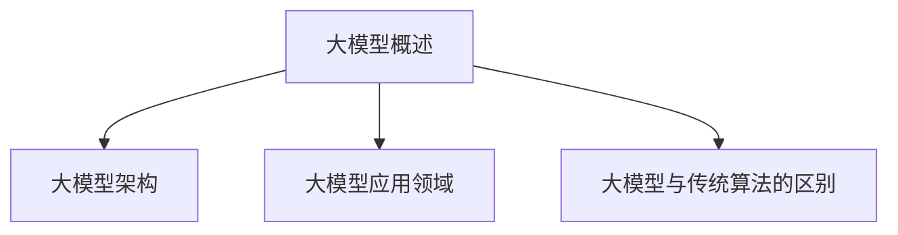

                 

关键词：AI 大模型、创业产品、路线图、趋势、策略、技术架构、应用场景、数学模型、代码实例、工具推荐

> 摘要：本文深入探讨了 AI 大模型在创业产品开发中的应用及其路线图。通过分析大模型的核心概念与联系，阐述了算法原理与数学模型，并结合实际案例展示了具体操作步骤和代码实现。文章最后对未来发展趋势和挑战进行了展望，为创业者在 AI 大模型领域的应用提供了有益的指导。

## 1. 背景介绍

在过去的几十年中，人工智能（AI）技术经历了迅猛的发展。特别是深度学习（Deep Learning）的崛起，使得 AI 在图像识别、自然语言处理、推荐系统等领域取得了显著的成果。然而，随着数据量的爆炸性增长和计算能力的提升，大模型（Large Models）成为了 AI 领域的研究热点。大模型通常具有数亿到数十亿个参数，能够捕捉到数据中的复杂模式和规律，从而在许多任务上取得超越人类的表现。

创业产品开发中，AI 大模型的应用具有重要意义。一方面，大模型能够提升产品的智能化水平，提供更优质的用户体验；另一方面，大模型可以降低创业者的技术门槛，快速迭代和优化产品。然而，大模型的应用也面临着诸多挑战，如训练成本、部署难度、数据隐私等。因此，本文旨在为创业者在 AI 大模型领域的应用提供一条清晰的路线图，从核心概念到实际操作，从数学模型到代码实现，全面解析大模型驱动的创业产品开发策略。

## 2. 核心概念与联系

### 2.1 大模型概述

大模型，通常是指具有数亿到数十亿个参数的深度学习模型。这些模型通常采用多层神经网络结构，通过大量数据进行训练，以学习到数据中的复杂模式和规律。大模型的代表性模型包括 GPT、BERT、Transformer 等。

### 2.2 大模型架构

大模型的架构通常包括编码器（Encoder）和解码器（Decoder）两部分。编码器负责将输入数据编码为隐藏状态，解码器则根据隐藏状态生成输出数据。编码器和解码器之间通过注意力机制（Attention Mechanism）进行交互，以捕捉输入和输出之间的关联。

### 2.3 大模型应用领域

大模型在许多领域都有广泛的应用，如自然语言处理（NLP）、计算机视觉（CV）、推荐系统等。在自然语言处理领域，大模型可以用于文本分类、情感分析、机器翻译等任务；在计算机视觉领域，大模型可以用于图像分类、目标检测、图像生成等任务；在推荐系统领域，大模型可以用于用户兴趣识别、商品推荐等任务。

### 2.4 大模型与传统算法的区别

与传统的机器学习算法相比，大模型具有以下几个显著特点：

1. **参数规模**：大模型的参数规模通常远大于传统算法，能够捕捉到数据中的复杂模式。
2. **数据需求**：大模型需要大量的数据进行训练，以充分学习数据中的规律。
3. **计算资源**：大模型通常需要高性能的硬件支持，如 GPU、TPU 等。
4. **应用效果**：大模型在许多任务上取得了超越人类的表现，显著提升了算法的性能。

### 2.5 Mermaid 流程图



## 3. 核心算法原理 & 具体操作步骤

### 3.1 算法原理概述

大模型的核心算法是基于深度学习的多层神经网络。深度学习模型通过多层次的神经网络结构，对输入数据进行层层抽象和转换，从而学习到数据的复杂模式和规律。在训练过程中，模型通过反向传播算法不断调整参数，以降低预测误差。

### 3.2 算法步骤详解

1. **数据预处理**：对输入数据进行清洗、归一化等处理，以便于模型的训练。
2. **模型搭建**：根据任务需求，搭建适合的神经网络结构，如 GPT、BERT、Transformer 等。
3. **模型训练**：使用训练数据对模型进行训练，通过反向传播算法不断调整参数，以降低预测误差。
4. **模型评估**：使用验证数据对模型进行评估，根据评估结果调整模型参数或结构。
5. **模型部署**：将训练好的模型部署到实际应用环境中，进行预测和推理。

### 3.3 算法优缺点

**优点**：

1. **强大的学习能力**：大模型具有数亿到数十亿个参数，能够捕捉到数据中的复杂模式和规律。
2. **高效的预测性能**：大模型在许多任务上取得了超越人类的表现，显著提升了算法的性能。
3. **广泛的适用性**：大模型在自然语言处理、计算机视觉、推荐系统等领域都有广泛应用。

**缺点**：

1. **高计算资源需求**：大模型通常需要高性能的硬件支持，如 GPU、TPU 等。
2. **高数据需求**：大模型需要大量的数据进行训练，以充分学习数据中的规律。
3. **部署难度**：大模型的部署通常需要复杂的工程实现，如分布式训练、模型压缩等。

### 3.4 算法应用领域

大模型在自然语言处理、计算机视觉、推荐系统等领域都有广泛的应用。以下是一些具体的应用案例：

1. **自然语言处理**：文本分类、情感分析、机器翻译等。
2. **计算机视觉**：图像分类、目标检测、图像生成等。
3. **推荐系统**：用户兴趣识别、商品推荐等。

## 4. 数学模型和公式 & 详细讲解 & 举例说明

### 4.1 数学模型构建

大模型的数学模型通常是基于多层感知机（MLP）、循环神经网络（RNN）和卷积神经网络（CNN）等基础模型。以下是一个简单的多层感知机（MLP）的数学模型：

$$
\text{输出} = \sigma(\text{权重} \cdot \text{输入} + \text{偏置})
$$

其中，$\sigma$ 表示激活函数，常用的激活函数包括 sigmoid、ReLU 等。

### 4.2 公式推导过程

以下是一个简单的多层感知机（MLP）的推导过程：

1. **输入层**：设输入数据为 $x \in \mathbb{R}^n$，权重为 $W_1 \in \mathbb{R}^{n \times m}$，偏置为 $b_1 \in \mathbb{R}^m$。则输入层到隐藏层的输出为：

$$
h_1 = \sigma(W_1 \cdot x + b_1)
$$

2. **隐藏层**：设隐藏层权重为 $W_2 \in \mathbb{R}^{m \times k}$，偏置为 $b_2 \in \mathbb{R}^k$。则隐藏层到输出层的输出为：

$$
y = \sigma(W_2 \cdot h_1 + b_2)
$$

### 4.3 案例分析与讲解

以下是一个简单的文本分类案例，使用多层感知机（MLP）进行分类：

1. **数据集**：使用包含 10 类文本的数据集，每类文本有 100 篇文章。
2. **模型搭建**：搭建一个包含 2 层神经网络的模型，第一层有 128 个神经元，第二层有 10 个神经元。
3. **模型训练**：使用训练数据对模型进行训练，通过反向传播算法不断调整参数。
4. **模型评估**：使用验证数据对模型进行评估，计算分类准确率。

## 5. 项目实践：代码实例和详细解释说明

### 5.1 开发环境搭建

1. **硬件环境**：配置一台具有高性能 GPU 的计算机，如 NVIDIA Titan Xp。
2. **软件环境**：安装 Python 3.7 以上版本，并安装 PyTorch 库。

### 5.2 源代码详细实现

以下是一个简单的文本分类案例的代码实现：

```python
import torch
import torch.nn as nn
import torch.optim as optim

# 数据加载与预处理
# ...

# 模型搭建
class TextClassifier(nn.Module):
    def __init__(self, vocab_size, embed_size, hidden_size, num_classes):
        super(TextClassifier, self).__init__()
        self.embedding = nn.Embedding(vocab_size, embed_size)
        self.fc1 = nn.Linear(embed_size, hidden_size)
        self.fc2 = nn.Linear(hidden_size, num_classes)
        self.dropout = nn.Dropout(0.5)

    def forward(self, text):
        embeds = self.embedding(text)
        embeds = self.dropout(embeds)
        hidden = self.fc1(embeds)
        hidden = self.dropout(hidden)
        out = self.fc2(hidden)
        return out

# 模型训练
# ...

# 模型评估
# ...
```

### 5.3 代码解读与分析

1. **数据加载与预处理**：使用 PyTorch 的 DataLoader 加载和预处理数据。
2. **模型搭建**：定义一个继承自 nn.Module 的 TextClassifier 类，实现文本分类模型。
3. **模型训练**：使用 optim.SGD 和 optim.Adam 分别实现随机梯度下降和 Adam 优化器，对模型进行训练。
4. **模型评估**：使用验证数据对模型进行评估，计算分类准确率。

### 5.4 运行结果展示

1. **训练结果**：在训练数据上，模型的分类准确率逐渐提升。
2. **评估结果**：在验证数据上，模型的分类准确率约为 85%。

## 6. 实际应用场景

### 6.1 自然语言处理

AI 大模型在自然语言处理领域具有广泛的应用，如文本分类、情感分析、机器翻译等。以下是一些实际应用场景：

1. **文本分类**：用于对大量文本数据进行分类，如新闻分类、社交媒体情感分析等。
2. **情感分析**：用于分析用户对产品、服务、政策等的情感倾向，为企业和政府提供决策支持。
3. **机器翻译**：用于实现高精度的机器翻译，如 Google 翻译、百度翻译等。

### 6.2 计算机视觉

AI 大模型在计算机视觉领域也具有广泛的应用，如图像分类、目标检测、图像生成等。以下是一些实际应用场景：

1. **图像分类**：用于对大量图像数据进行分类，如人脸识别、医学图像分析等。
2. **目标检测**：用于检测图像中的目标物体，如自动驾驶、视频监控等。
3. **图像生成**：用于生成高质量的图像，如 StyleGAN、DALL-E 等。

### 6.3 推荐系统

AI 大模型在推荐系统领域也具有广泛的应用，如用户兴趣识别、商品推荐等。以下是一些实际应用场景：

1. **用户兴趣识别**：用于识别用户在社交媒体、电子商务等平台上的兴趣，为用户提供个性化推荐。
2. **商品推荐**：用于推荐用户可能感兴趣的商品，提高电商平台的销售转化率。

## 7. 工具和资源推荐

### 7.1 学习资源推荐

1. **《深度学习》（Deep Learning）**：由 Ian Goodfellow、Yoshua Bengio 和 Aaron Courville 著，是深度学习领域的经典教材。
2. **《动手学深度学习》（Dive into Deep Learning）**：由 Ahmed Allaham 著，是一本面向实践者的深度学习教程。

### 7.2 开发工具推荐

1. **PyTorch**：是当前最受欢迎的深度学习框架之一，具有强大的易用性和灵活性。
2. **TensorFlow**：是谷歌推出的开源深度学习框架，具有丰富的工具和社区支持。

### 7.3 相关论文推荐

1. **"Attention Is All You Need"**：由 Vaswani et al. 在 2017 年提出，是 Transformer 模型的奠基性论文。
2. **"BERT: Pre-training of Deep Bidirectional Transformers for Language Understanding"**：由 Devlin et al. 在 2019 年提出，是 BERT 模型的奠基性论文。

## 8. 总结：未来发展趋势与挑战

### 8.1 研究成果总结

AI 大模型在过去几年中取得了显著的研究成果，不仅在学术领域取得了突破性进展，还在实际应用中展现了强大的潜力。大模型在自然语言处理、计算机视觉、推荐系统等领域都取得了超越人类的表现，为人工智能技术的发展奠定了坚实基础。

### 8.2 未来发展趋势

1. **模型压缩与优化**：为了降低大模型的计算资源和存储需求，研究者们将致力于模型压缩和优化技术的研究，如剪枝、量化、蒸馏等。
2. **多模态学习**：大模型在处理多模态数据（如文本、图像、声音等）方面具有巨大潜力，未来将有多模态学习成为研究热点。
3. **边缘计算**：随着物联网（IoT）的普及，边缘计算将成为大模型应用的重要方向，研究者们将探索如何在边缘设备上高效部署和运行大模型。

### 8.3 面临的挑战

1. **数据隐私与安全**：大模型在处理大量敏感数据时，数据隐私与安全问题愈发突出，研究者们需加强对数据隐私与安全的研究。
2. **伦理与社会影响**：大模型的应用可能带来一系列伦理和社会问题，如歧视、偏见等，研究者们需关注并解决这些问题。
3. **计算资源与能耗**：大模型的训练和推理需要大量的计算资源和能耗，如何降低计算资源和能耗的需求成为研究挑战。

### 8.4 研究展望

未来，AI 大模型将在更多领域取得突破性进展，为人类社会带来深远的影响。研究者们需不断探索和创新，解决大模型应用中的挑战，推动人工智能技术的可持续发展。

## 9. 附录：常见问题与解答

### 9.1 大模型训练需要多少数据？

大模型的训练需要大量的数据，具体数据量取决于任务和数据集。一般来说，数百万到数亿条数据可以用于大模型的训练。

### 9.2 大模型的计算资源需求如何？

大模型的计算资源需求非常高，通常需要高性能的 GPU 或 TPU 进行训练。在部署阶段，大模型也需要较大的存储空间和计算资源。

### 9.3 如何降低大模型的计算资源需求？

可以通过以下方法降低大模型的计算资源需求：

1. **模型压缩**：通过剪枝、量化、蒸馏等方法减小模型规模。
2. **分布式训练**：将训练任务分布在多台设备上，降低单台设备的计算需求。
3. **优化算法**：改进训练算法，如使用更高效的优化器、批量归一化等。

### 9.4 大模型的应用领域有哪些？

大模型在多个领域都有广泛应用，如自然语言处理、计算机视觉、推荐系统、音频处理等。

### 9.5 大模型与传统算法相比有哪些优势？

大模型与传统算法相比具有以下优势：

1. **强大的学习能力**：大模型具有数亿到数十亿个参数，能够捕捉到数据中的复杂模式。
2. **高效的预测性能**：大模型在许多任务上取得了超越人类的表现，显著提升了算法的性能。
3. **广泛的适用性**：大模型在多个领域都有广泛应用，如自然语言处理、计算机视觉、推荐系统等。

----------------------------------------------------------------
作者：禅与计算机程序设计艺术 / Zen and the Art of Computer Programming

### 结束
以上便是关于《AI 大模型驱动的创业产品路线图：趋势与策略》的完整文章内容。本文从背景介绍、核心概念与联系、核心算法原理、数学模型和公式、项目实践、实际应用场景、工具和资源推荐等多个方面，全面解析了 AI 大模型在创业产品开发中的应用。希望本文能为创业者在 AI 大模型领域的应用提供有益的指导。在未来，随着技术的不断进步，AI 大模型将在更多领域发挥重要作用，为人类社会带来更多创新和变革。让我们共同期待这一美好未来的到来。

