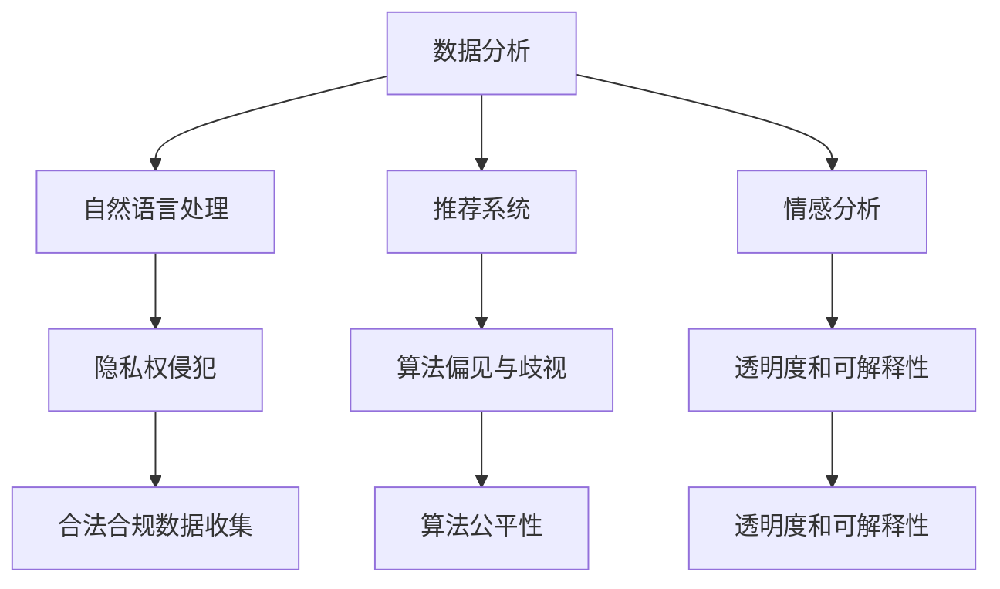

                 

关键词：AI技术，电商搜索导购，伦理问题，技术应用边界

> 摘要：随着人工智能技术的不断发展，电商搜索导购领域迎来了前所未有的变革。然而，AI技术在提升用户体验和销售额的同时，也引发了一系列伦理问题。本文将探讨AI技术在电商搜索导购中的伦理问题，分析其技术应用边界，并提出相应的解决方案。

## 1. 背景介绍

随着互联网技术的飞速发展，电商行业成为全球经济增长的重要驱动力。消费者对个性化、高效便捷的购物体验需求日益增长，推动着电商企业不断优化搜索导购系统。在此背景下，人工智能（AI）技术逐渐成为电商企业提升竞争力的关键因素。AI技术通过大数据分析、自然语言处理、推荐系统等方法，实现了对用户购物行为的精准预测和个性化推荐，极大地提升了电商平台的用户体验和销售额。

然而，AI技术的广泛应用也带来了诸多伦理问题。首先，AI技术在数据收集和处理过程中可能侵犯用户的隐私权。其次，AI算法在决策过程中可能存在偏见和歧视，导致某些用户群体受到不公平对待。此外，AI技术在商业应用中的透明度和可解释性也备受争议。这些问题不仅影响了消费者的信任度，也对整个电商行业的可持续发展构成挑战。

本文旨在探讨AI技术在电商搜索导购中的伦理问题，分析其技术应用边界，并提出相应的解决方案，以期为电商行业的发展提供有益的参考。

## 2. 核心概念与联系

### 2.1 AI技术在电商搜索导购中的应用

AI技术在电商搜索导购中的应用主要包括以下几个方面：

#### 2.1.1 数据分析

通过大数据分析，电商企业可以了解用户的购物行为、偏好和需求，从而为用户提供更加个性化的推荐。

#### 2.1.2 自然语言处理

自然语言处理技术可以理解和解析用户的搜索意图，提高搜索结果的准确性和相关性。

#### 2.1.3 推荐系统

基于用户的历史行为和偏好，推荐系统可以为用户推荐感兴趣的商品和服务。

#### 2.1.4 情感分析

通过对用户评论和反馈的情感分析，电商企业可以了解用户对商品和服务的满意度，及时调整营销策略。

### 2.2 伦理问题分析

#### 2.2.1 隐私权侵犯

AI技术在数据收集和处理过程中，可能涉及用户的个人隐私信息，如购物记录、浏览历史等。未经用户同意，擅自收集和使用这些信息，可能侵犯用户的隐私权。

#### 2.2.2 算法偏见与歧视

AI算法在训练过程中，可能受到训练数据偏差的影响，导致算法在决策过程中存在偏见和歧视。例如，对某些用户群体的推荐结果不公平，或者对特定商品的价格歧视。

#### 2.2.3 透明度和可解释性

AI算法在商业应用中具有较高的透明度和可解释性。用户难以理解算法的决策过程，可能导致对算法的不信任。

### 2.3 应用场景与边界

#### 2.3.1 数据收集与使用

电商企业应在合法合规的前提下，收集和处理用户数据。在收集用户数据时，应明确告知用户数据用途，并尊重用户的知情权和选择权。

#### 2.3.2 算法公平性

电商企业应关注算法公平性，确保算法在决策过程中不受训练数据偏差的影响，为所有用户提供公平的推荐和服务。

#### 2.3.3 透明度和可解释性

电商企业应提高算法的透明度和可解释性，使用户了解算法的决策过程，增加用户对算法的信任。

### 2.4 Mermaid 流程图

## 3. 核心算法原理 & 具体操作步骤

### 3.1 算法原理概述

在电商搜索导购中，AI算法的核心作用是通过对用户数据的分析和处理，实现个性化推荐和精准营销。以下是几种常见的AI算法原理：

#### 3.1.1 大数据分析

大数据分析通过对海量用户数据的挖掘和分析，发现用户购物行为和偏好的规律，为个性化推荐提供数据支持。

#### 3.1.2 自然语言处理

自然语言处理技术通过理解用户的搜索意图，提高搜索结果的准确性和相关性。

#### 3.1.3 推荐系统

基于用户的历史行为和偏好，推荐系统可以为用户推荐感兴趣的商品和服务。

#### 3.1.4 情感分析

情感分析通过对用户评论和反馈的情感分析，了解用户对商品和服务的满意度，为营销策略调整提供依据。

### 3.2 算法步骤详解

#### 3.2.1 数据收集

电商企业通过网站日志、用户浏览记录、购买记录等多种渠道收集用户数据。

#### 3.2.2 数据清洗

对收集到的用户数据进行清洗和预处理，去除无效和重复数据，保证数据质量。

#### 3.2.3 数据分析

通过大数据分析，挖掘用户购物行为和偏好，为个性化推荐提供数据支持。

#### 3.2.4 自然语言处理

使用自然语言处理技术，理解用户的搜索意图，提高搜索结果的准确性和相关性。

#### 3.2.5 推荐系统

基于用户的历史行为和偏好，构建推荐模型，为用户推荐感兴趣的商品和服务。

#### 3.2.6 情感分析

通过对用户评论和反馈的情感分析，了解用户对商品和服务的满意度，为营销策略调整提供依据。

### 3.3 算法优缺点

#### 3.3.1 优点

1. 提高用户体验：通过个性化推荐和精准营销，满足用户个性化需求，提高用户满意度。
2. 提升销售额：通过推荐系统和情感分析，促进用户购买行为，提升销售额。
3. 降低营销成本：通过大数据分析和自然语言处理，优化营销策略，降低营销成本。

#### 3.3.2 缺点

1. 隐私权侵犯：在数据收集和处理过程中，可能侵犯用户隐私权。
2. 算法偏见与歧视：算法在训练过程中可能受到数据偏差影响，导致不公平推荐。
3. 透明度和可解释性：用户难以理解算法的决策过程，可能导致对算法的不信任。

### 3.4 算法应用领域

AI技术在电商搜索导购中的应用非常广泛，包括但不限于：

1. 个性化推荐：根据用户的历史行为和偏好，为用户推荐感兴趣的商品和服务。
2. 搜索优化：通过自然语言处理技术，提高搜索结果的准确性和相关性。
3. 情感分析：分析用户评论和反馈，了解用户对商品和服务的满意度。
4. 营销策略调整：根据用户数据和反馈，优化营销策略，提高营销效果。

## 4. 数学模型和公式 & 详细讲解 & 举例说明

### 4.1 数学模型构建

在电商搜索导购中，常用的数学模型包括推荐系统模型、自然语言处理模型和情感分析模型。以下是这些模型的构建方法：

#### 4.1.1 推荐系统模型

推荐系统模型通常基于协同过滤算法，如基于用户的协同过滤（User-based Collaborative Filtering）和基于项目的协同过滤（Item-based Collaborative Filtering）。

1. 基于用户的协同过滤：

$$
\text{相似度} = \frac{\sum_{i \in \text{common items}} r_{ui} r_{uj}}{\sqrt{\sum_{i \in \text{common items}} r_{ui}^2} \sqrt{\sum_{i \in \text{common items}} r_{uj}^2}}
$$

其中，$r_{ui}$和$r_{uj}$分别表示用户$i$和用户$j$对项目$i$和项目$j$的评分。

2. 基于项目的协同过滤：

$$
\text{相似度} = \frac{\sum_{i \in \text{common users}} r_{ui} r_{uj}}{\sqrt{\sum_{i \in \text{common users}} r_{ui}^2} \sqrt{\sum_{i \in \text{common users}} r_{uj}^2}}
$$

其中，$r_{ui}$和$r_{uj}$分别表示用户$i$和用户$j$对项目$i$和项目$j$的评分。

#### 4.1.2 自然语言处理模型

自然语言处理模型通常基于深度学习技术，如循环神经网络（RNN）和长短期记忆网络（LSTM）。

1. RNN模型：

$$
h_t = \sigma(W_h \cdot [h_{t-1}, x_t] + b_h)
$$

其中，$h_t$表示第$t$个时间步的隐藏状态，$x_t$表示第$t$个时间步的输入特征，$\sigma$表示激活函数。

2. LSTM模型：

$$
i_t = \sigma(W_i \cdot [h_{t-1}, x_t] + b_i)
$$
$$
f_t = \sigma(W_f \cdot [h_{t-1}, x_t] + b_f)
$$
$$
g_t = \sigma(W_g \cdot [h_{t-1}, x_t] + b_g)
$$
$$
o_t = \sigma(W_o \cdot [h_{t-1}, g_t] + b_o)
$$
$$
h_t = o_t \odot \text{sigmoid}(f_t \odot h_{t-1}) + (1 - o_t) \odot g_t
$$

其中，$i_t$、$f_t$、$g_t$、$o_t$分别表示输入门、遗忘门、生成门和输出门的状态，$\text{sigmoid}$表示激活函数。

#### 4.1.3 情感分析模型

情感分析模型通常基于朴素贝叶斯分类器、支持向量机（SVM）和深度学习等技术。

1. 朴素贝叶斯分类器：

$$
P(\text{positive} | x) = \frac{P(x | \text{positive}) P(\text{positive})}{P(x)}
$$

其中，$P(\text{positive})$表示正类概率，$P(x | \text{positive})$表示特征$x$在正类上的概率。

2. 支持向量机：

$$
\max_{\textbf{w}, b} \frac{1}{2} \sum_{i=1}^{n} (\textbf{w} \cdot \textbf{x}_i - y_i)^2
$$

其中，$\textbf{w}$表示权重向量，$b$表示偏置项，$\textbf{x}_i$表示第$i$个特征，$y_i$表示第$i$个样本的标签。

### 4.2 公式推导过程

以下是推荐系统模型中的协同过滤算法的推导过程：

#### 4.2.1 基于用户的协同过滤

1. 计算用户之间的相似度：

$$
\text{相似度} = \frac{\sum_{i \in \text{common items}} r_{ui} r_{uj}}{\sqrt{\sum_{i \in \text{common items}} r_{ui}^2} \sqrt{\sum_{i \in \text{common items}} r_{uj}^2}}
$$

2. 根据相似度计算预测分数：

$$
\hat{r}_{ui} = \sum_{j \in \text{neighb

