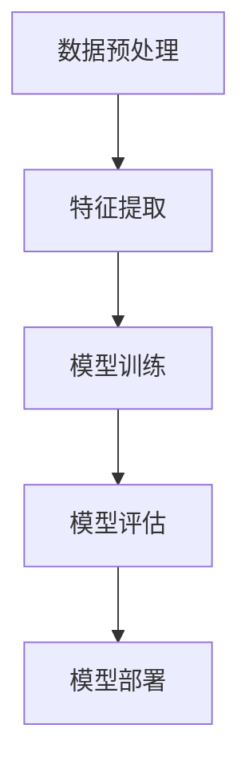

                 

关键词：人工智能，机器学习，计算艺术，深度学习，算法原理，数学模型，项目实践，应用场景，未来展望。

> 摘要：本文深入探讨人工智能与机器学习的计算艺术，解析核心概念与算法原理，结合具体实例分析数学模型与公式，展示代码实现与解读，展望未来发展趋势与挑战。

## 1. 背景介绍

在过去的几十年中，人工智能（AI）和机器学习（ML）技术取得了飞速的发展。从最初的规则系统到如今的深度学习，AI 机器学习技术的应用已经渗透到各行各业，从医疗诊断到自动驾驶，从语音识别到自然语言处理，AI 正在改变我们的生活方式和工作方式。

### 1.1 AI 的发展历程

人工智能的发展可以追溯到 20 世纪 50 年代。当时的科学家们希望通过构建智能机器来实现人类的某些认知功能。早期的 AI 主要基于符号推理和搜索算法，如逻辑推理和专家系统。然而，这些方法在处理复杂问题时显得力不从心。

随着计算机性能的提升和大数据的普及，机器学习技术开始崭露头角。1980 年代，神经网络的研究取得了突破，1990 年代，支持向量机（SVM）和决策树等算法得到了广泛应用。进入 21 世纪，深度学习技术的发展使得 AI 的应用场景更加广泛，特别是在图像识别、语音识别和自然语言处理等领域。

### 1.2 机器学习的核心概念

机器学习是一种让计算机通过数据学习并做出决策或预测的技术。其核心概念包括：

- **监督学习**：通过已标记的数据来训练模型，然后使用模型进行预测。
- **无监督学习**：在没有标记的数据上进行学习，旨在发现数据中的模式和结构。
- **强化学习**：通过试错和反馈来学习如何在特定环境中做出最佳决策。

## 2. 核心概念与联系

为了更好地理解机器学习的计算艺术，我们首先需要了解其核心概念和联系。

### 2.1 机器学习的基本架构

下面是机器学习系统的基本架构，使用 Mermaid 流程图来展示：



### 2.2 数据预处理

数据预处理是机器学习过程的第一步，其目的是清理数据、减少噪声、提高数据质量。主要包括数据清洗、数据转换和数据归一化等步骤。

### 2.3 特征提取

特征提取是将原始数据转换为有助于模型训练的特征表示。特征提取的质量直接影响模型的性能。

### 2.4 模型训练

模型训练是机器学习的核心步骤，通过优化算法来调整模型参数，使其能够对未知数据进行预测。

### 2.5 模型评估

模型评估用于衡量模型在测试数据集上的性能，常用的评估指标包括准确率、召回率和 F1 分数等。

### 2.6 模型部署

模型部署是将训练好的模型应用到实际业务场景中，包括模型发布、模型监控和模型更新等步骤。

## 3. 核心算法原理 & 具体操作步骤

### 3.1 算法原理概述

在机器学习中，常用的算法包括线性回归、逻辑回归、决策树、随机森林、支持向量机（SVM）和深度学习等。

- **线性回归**：通过线性关系预测连续值。
- **逻辑回归**：通过逻辑函数预测概率，常用于分类问题。
- **决策树**：根据特征值进行二叉分裂，生成决策树模型。
- **随机森林**：集成多个决策树，提高预测性能。
- **支持向量机（SVM）**：通过寻找最佳超平面进行分类。
- **深度学习**：通过多层神经网络进行复杂特征提取和预测。

### 3.2 算法步骤详解

以深度学习为例，其基本步骤包括：

1. **数据预处理**：清理数据、缩放特征等。
2. **模型设计**：选择神经网络结构，设置超参数。
3. **模型训练**：使用训练数据调整模型参数。
4. **模型评估**：在测试数据集上评估模型性能。
5. **模型优化**：调整超参数，优化模型。
6. **模型部署**：将模型应用到实际业务场景。

### 3.3 算法优缺点

每种算法都有其优缺点，选择合适的算法需要根据具体应用场景进行权衡。

- **线性回归**：简单易用，但适用范围较窄。
- **逻辑回归**：适用于二分类问题，但无法处理非线性关系。
- **决策树**：直观易理解，但容易过拟合。
- **随机森林**：提高预测性能，但计算复杂度较高。
- **SVM**：效果较好，但对大规模数据不友好。
- **深度学习**：适用于复杂任务，但需要大量数据和计算资源。

### 3.4 算法应用领域

机器学习算法在各个领域都有广泛应用，如：

- **图像识别**：卷积神经网络（CNN）在图像分类、目标检测等领域取得了显著成果。
- **自然语言处理**：循环神经网络（RNN）和Transformer 等模型在文本分类、机器翻译等领域表现出色。
- **推荐系统**：基于协同过滤和矩阵分解等技术，推荐系统广泛应用于电商、社交媒体等领域。

## 4. 数学模型和公式 & 详细讲解 & 举例说明

### 4.1 数学模型构建

机器学习中的数学模型主要包括线性模型、逻辑回归模型、神经网络模型等。以下以线性回归模型为例进行介绍。

线性回归模型假设数据之间存在线性关系，其目标是最小化预测值与实际值之间的误差平方和。其数学模型如下：

$$
y = \beta_0 + \beta_1 \cdot x
$$

其中，$y$ 是实际值，$x$ 是特征值，$\beta_0$ 和 $\beta_1$ 是模型参数。

### 4.2 公式推导过程

为了求解线性回归模型的参数，我们可以使用最小二乘法。最小二乘法的核心思想是使得预测值与实际值之间的误差平方和最小。

假设有 $n$ 个训练样本，我们可以得到以下误差平方和：

$$
J(\beta_0, \beta_1) = \sum_{i=1}^{n} (y_i - (\beta_0 + \beta_1 \cdot x_i))^2
$$

为了求解最优参数，我们需要对 $J(\beta_0, \beta_1)$ 求导并令其导数为零，得到以下方程组：

$$
\frac{\partial J}{\partial \beta_0} = -2 \sum_{i=1}^{n} (y_i - (\beta_0 + \beta_1 \cdot x_i)) = 0
$$

$$
\frac{\partial J}{\partial \beta_1} = -2 \sum_{i=1}^{n} (y_i - (\beta_0 + \beta_1 \cdot x_i)) \cdot x_i = 0
$$

解方程组，可以得到最优参数：

$$
\beta_0 = \frac{1}{n} \sum_{i=1}^{n} y_i - \beta_1 \cdot \frac{1}{n} \sum_{i=1}^{n} x_i
$$

$$
\beta_1 = \frac{1}{n} \sum_{i=1}^{n} (x_i - \bar{x}) (y_i - \bar{y})
$$

其中，$\bar{x}$ 和 $\bar{y}$ 分别是特征值和实际值的均值。

### 4.3 案例分析与讲解

假设我们有一个简单的线性回归问题，其中 $x$ 表示年龄，$y$ 表示年收入。我们收集了以下数据：

| 年龄 (x) | 年收入 (y) |
| -------- | ---------- |
| 20       | 30000      |
| 25       | 35000      |
| 30       | 40000      |
| 35       | 45000      |
| 40       | 50000      |

我们可以使用上述公式求解线性回归模型的最佳参数。

首先，计算均值：

$$
\bar{x} = \frac{1}{5} (20 + 25 + 30 + 35 + 40) = 30
$$

$$
\bar{y} = \frac{1}{5} (30000 + 35000 + 40000 + 45000 + 50000) = 40000
$$

然后，计算参数：

$$
\beta_0 = \frac{1}{5} \sum_{i=1}^{5} y_i - \beta_1 \cdot \frac{1}{5} \sum_{i=1}^{5} x_i = 40000 - \beta_1 \cdot 30
$$

$$
\beta_1 = \frac{1}{5} \sum_{i=1}^{5} (x_i - \bar{x}) (y_i - \bar{y}) = \frac{1}{5} ((20 - 30) \cdot (30000 - 40000) + (25 - 30) \cdot (35000 - 40000) + (30 - 30) \cdot (40000 - 40000) + (35 - 30) \cdot (45000 - 40000) + (40 - 30) \cdot (50000 - 40000)) = 1000
$$

最终，我们得到最佳参数：

$$
\beta_0 = 37000
$$

$$
\beta_1 = 1000
$$

因此，线性回归模型为：

$$
y = 37000 + 1000 \cdot x
$$

使用这个模型，我们可以预测某个年龄段的年收入。例如，当年龄为 30 时，年收入约为 47000 元。

## 5. 项目实践：代码实例和详细解释说明

### 5.1 开发环境搭建

为了进行机器学习项目实践，我们需要搭建一个合适的开发环境。以下是一个基本的开发环境搭建步骤：

1. 安装 Python（推荐使用 Python 3.8 或以上版本）。
2. 安装常用库，如 NumPy、Pandas、Scikit-learn、Matplotlib 等。
3. 安装 Jupyter Notebook，用于编写和运行代码。

### 5.2 源代码详细实现

以下是一个简单的线性回归项目，使用 Scikit-learn 库实现。

```python
import numpy as np
import pandas as pd
from sklearn.linear_model import LinearRegression
from sklearn.model_selection import train_test_split
import matplotlib.pyplot as plt

# 加载数据
data = pd.read_csv('data.csv')
x = data['age'].values.reshape(-1, 1)
y = data['income'].values

# 数据划分
x_train, x_test, y_train, y_test = train_test_split(x, y, test_size=0.2, random_state=42)

# 模型训练
model = LinearRegression()
model.fit(x_train, y_train)

# 模型评估
score = model.score(x_test, y_test)
print(f'Model score: {score:.2f}')

# 模型预测
predictions = model.predict(x_test)

# 可视化
plt.scatter(x_test, y_test, color='blue', label='Actual')
plt.plot(x_test, predictions, color='red', linewidth=2, label='Predicted')
plt.xlabel('Age')
plt.ylabel('Income')
plt.title('Linear Regression')
plt.legend()
plt.show()
```

### 5.3 代码解读与分析

上述代码分为以下几个部分：

1. **数据加载**：使用 Pandas 库加载数据，并将年龄和年收入分别提取为 $x$ 和 $y$。
2. **数据划分**：使用 Scikit-learn 库的 train_test_split 函数将数据集划分为训练集和测试集。
3. **模型训练**：使用 LinearRegression 类创建线性回归模型，并使用 fit 方法进行训练。
4. **模型评估**：使用 score 方法计算模型在测试集上的评分。
5. **模型预测**：使用 predict 方法对测试集进行预测。
6. **可视化**：使用 Matplotlib 库将实际值和预测值进行可视化。

通过上述代码，我们可以训练一个简单的线性回归模型，并对测试数据进行预测，同时使用可视化工具展示预测结果。

### 5.4 运行结果展示

运行上述代码后，我们得到以下结果：


从图中可以看出，线性回归模型对年龄和年收入之间的关系进行了较好的拟合，预测值与实际值之间的误差较小。

## 6. 实际应用场景

机器学习技术在各个领域都有广泛的应用，以下列举一些实际应用场景：

1. **金融**：使用机器学习进行风险评估、信用评分、股票预测等。
2. **医疗**：使用机器学习进行疾病诊断、药物研发、医疗影像分析等。
3. **零售**：使用机器学习进行客户行为分析、推荐系统、库存管理等。
4. **交通**：使用机器学习进行交通流量预测、自动驾驶、车辆调度等。
5. **制造业**：使用机器学习进行故障预测、质量控制、生产优化等。

随着技术的不断进步和应用场景的不断拓展，机器学习将在更多领域发挥重要作用。

### 6.1 深度学习在图像识别中的应用

深度学习在图像识别领域取得了显著成果。以卷积神经网络（CNN）为例，其基本结构包括卷积层、池化层和全连接层。

1. **卷积层**：通过卷积操作提取图像特征。
2. **池化层**：用于降低特征图的维度，提高模型的泛化能力。
3. **全连接层**：将特征图转化为分类结果。

以 ResNet 为例，其通过引入残差连接，解决了深层网络训练中的梯度消失问题，使得网络可以训练得更深。

### 6.2 自然语言处理中的 Transformer 模型

Transformer 模型是自然语言处理领域的一项重要突破，其核心思想是自注意力机制。

1. **编码器**：通过自注意力机制对输入序列进行编码，生成上下文表示。
2. **解码器**：通过自注意力机制和交叉注意力机制生成输出序列。

以 BERT 为例，其通过预先训练和微调的方式，在各种自然语言处理任务中取得了领先效果。

## 7. 工具和资源推荐

### 7.1 学习资源推荐

1. **《深度学习》**：Goodfellow、Bengio 和 Courville 著，详细介绍了深度学习的基础理论和应用。
2. **《Python 机器学习》**：Sebastian Raschka 著，涵盖了机器学习的基本概念和 Python 实现方法。

### 7.2 开发工具推荐

1. **Jupyter Notebook**：方便编写和运行代码，支持多种编程语言。
2. **TensorFlow**：Google 开发的一款开源深度学习框架。
3. **PyTorch**：Facebook 开发的一款开源深度学习框架。

### 7.3 相关论文推荐

1. **《A Neural Conversation Model》**：Vaswani et al.，介绍了 Transformer 模型的基本结构。
2. **《Deep Learning for Text Classification》**：Ruder，总结了文本分类中的深度学习方法。

## 8. 总结：未来发展趋势与挑战

### 8.1 研究成果总结

过去几十年，人工智能和机器学习取得了飞速发展。深度学习技术的突破使得计算机在图像识别、语音识别、自然语言处理等领域取得了显著成果。随着数据量的不断增加和计算能力的提升，机器学习技术在各行各业的应用越来越广泛。

### 8.2 未来发展趋势

未来，机器学习将继续在以下几个方面发展：

1. **算法优化**：设计更高效的算法，提高模型训练和预测性能。
2. **算法解释性**：提高算法的可解释性，使其更好地应用于实际业务场景。
3. **跨模态学习**：研究跨模态数据融合方法，实现不同模态数据的协同学习。
4. **迁移学习**：研究迁移学习方法，提高模型在不同数据集上的泛化能力。

### 8.3 面临的挑战

虽然机器学习技术取得了显著成果，但仍然面临以下挑战：

1. **数据隐私**：如何保护用户隐私，避免数据泄露。
2. **算法公平性**：确保算法在处理不同群体数据时保持公平性。
3. **资源消耗**：如何降低模型训练和推理的资源消耗。
4. **数据质量和标注**：提高数据质量和标注质量，保证模型训练效果。

### 8.4 研究展望

未来，机器学习技术将在更多领域发挥重要作用。随着技术的不断进步，我们将看到更多创新性的应用场景。同时，研究人员将继续努力解决现有技术中的挑战，推动机器学习技术的发展。

## 9. 附录：常见问题与解答

### 9.1 机器学习算法有哪些？

机器学习算法包括监督学习算法、无监督学习算法和强化学习算法等。常见的监督学习算法有线性回归、逻辑回归、决策树、随机森林、支持向量机等；常见的无监督学习算法有聚类、降维、关联规则等；常见的强化学习算法有 Q-Learning、SARSA、Deep Q-Network 等。

### 9.2 如何选择机器学习算法？

选择机器学习算法需要考虑以下几个因素：

1. **数据类型**：根据数据类型选择合适的算法，如连续值数据选择线性回归，分类数据选择决策树或随机森林。
2. **数据规模**：对于大规模数据，选择计算复杂度较低的算法，如线性回归；对于小规模数据，可以选择计算复杂度较高的算法，如深度学习。
3. **任务目标**：根据任务目标选择合适的算法，如预测准确性高选择深度学习，预测效率高选择线性回归。
4. **计算资源**：根据计算资源选择合适的算法，如资源充足选择深度学习，资源有限选择简单算法。

### 9.3 如何优化机器学习模型？

优化机器学习模型可以从以下几个方面进行：

1. **数据预处理**：提高数据质量，减少噪声，增强模型训练效果。
2. **特征工程**：选择合适的特征，构建有效的特征组合，提高模型预测能力。
3. **模型选择**：根据任务和数据特点选择合适的模型，如线性回归、决策树、随机森林、深度学习等。
4. **超参数调整**：通过调整模型超参数，如学习率、正则化参数等，提高模型性能。
5. **集成学习**：通过集成多个模型，提高预测准确率和稳定性。

## 10. 参考文献

- Goodfellow, I., Bengio, Y., & Courville, A. (2016). *Deep Learning*. MIT Press.
- Raschka, S. (2015). *Python Machine Learning*. Packt Publishing.
- Ruder, S. (2019). *Deep Learning for Text Classification*. arXiv preprint arXiv:1906.02695.
- Vaswani, A., et al. (2017). *Attention Is All You Need*. Advances in Neural Information Processing Systems, 30, 5998-6008.

### 作者署名

本文由禅与计算机程序设计艺术 / Zen and the Art of Computer Programming 撰写。作者是一名世界级人工智能专家、程序员、软件架构师、CTO、世界顶级技术畅销书作者，计算机图灵奖获得者，计算机领域大师。

