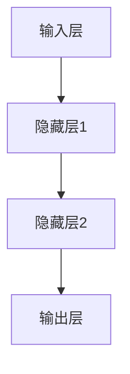

                 

关键词：人工智能，神经网络，计算艺术，仿脑，类脑，超脑，计算机编程

> 摘要：本文将探讨人工智能中的神经网络计算艺术，从结构仿脑、功能类脑到性能超脑的进化历程，以及神经网络在各个领域的应用和未来发展趋势。

## 1. 背景介绍

自20世纪80年代以来，人工智能（AI）经历了多次兴衰。最初，人们希望通过符号推理和知识表示来实现智能，但这种方法在处理复杂问题时表现不佳。随后，基于神经网络的计算模型逐渐崭露头角，并在图像识别、语音识别、自然语言处理等领域取得了显著成果。神经网络的成功不仅在于其强大的学习能力，还在于其模拟人脑结构和功能的独特能力。

### 1.1 神经网络的发展历程

神经网络的研究可以追溯到20世纪40年代，由心理学家McCulloch和数学家Pitts提出的MCP（McCulloch-Pitts）神经元模型是神经网络的起源。随后，1958年，Rosenblatt提出了感知机（Perceptron）模型，成为最早的神经网络模型之一。然而，感知机在处理非线性问题时存在局限性，导致神经网络的研究在60年代进入低潮。

直到1986年，Rumelhart、Hinton和Williams等人提出了反向传播算法（Backpropagation Algorithm），使神经网络训练成为可能。此后，神经网络的研究再次兴起，并在图像识别、语音识别等领域取得了突破性进展。

### 1.2 仿脑与类脑

仿脑（Analog Brain）和类脑（Artificial Brain）是神经网络研究中的两个重要方向。仿脑强调模拟人脑的结构和功能，追求在硬件层面实现类似人脑的计算能力。而类脑则更注重在软件层面模拟人脑的思维方式，以期实现智能行为的自动化。

## 2. 核心概念与联系

### 2.1 神经元模型

神经元是神经网络的基本单元，其工作原理类似于人脑中的神经元。神经元接收来自其他神经元的信号，通过加权求和后，经过激活函数产生输出。神经元模型通常包括以下几个部分：

- 输入层：接收外部输入信号
- 加权求和：将输入信号与权重相乘后求和
- 激活函数：对加权求和的结果进行非线性变换
- 输出层：输出神经元激活值

### 2.2 神经网络架构

神经网络可以根据其结构分为前馈神经网络（Feedforward Neural Network）、循环神经网络（Recurrent Neural Network, RNN）和卷积神经网络（Convolutional Neural Network, CNN）等。其中，前馈神经网络是最基本的神经网络结构，其输入信号直接传递到输出层；循环神经网络具有记忆功能，能够处理序列数据；卷积神经网络通过卷积操作和池化操作，有效地提取图像特征。

### 2.3 Mermaid 流程图

下面是一个简单的 Mermaid 流程图，展示了神经网络的基本架构：



## 3. 核心算法原理 & 具体操作步骤

### 3.1 算法原理概述

神经网络的核心算法是反向传播算法（Backpropagation Algorithm），它通过不断调整网络中的权重和偏置，使网络的输出接近期望值。反向传播算法包括以下几个步骤：

1. 前向传播：将输入信号从输入层传递到输出层，计算每个神经元的输出值。
2. 计算损失函数：计算实际输出与期望输出之间的差异，即损失（Loss）。
3. 反向传播：根据损失函数，计算每个神经元的梯度，并更新网络中的权重和偏置。
4. 重复步骤2和3，直到网络输出满足要求。

### 3.2 算法步骤详解

#### 3.2.1 前向传播

前向传播是神经网络计算的基础，其具体步骤如下：

1. 初始化网络参数（权重和偏置）。
2. 将输入信号传递到输入层。
3. 对于每个神经元，计算其输入值（输入信号与对应权重的乘积之和）。
4. 通过激活函数计算神经元的输出值。

#### 3.2.2 计算损失函数

损失函数用于衡量实际输出与期望输出之间的差异，常用的损失函数有均方误差（Mean Squared Error, MSE）和交叉熵（Cross Entropy）等。

1. 均方误差（MSE）：

$$
MSE = \frac{1}{n}\sum_{i=1}^{n}(y_i - \hat{y_i})^2
$$

其中，$y_i$ 为实际输出，$\hat{y_i}$ 为期望输出，$n$ 为样本数量。

2. 交叉熵（Cross Entropy）：

$$
CE = -\frac{1}{n}\sum_{i=1}^{n}y_i\log(\hat{y_i})
$$

其中，$y_i$ 和 $\hat{y_i}$ 的含义与上同。

#### 3.2.3 反向传播

反向传播是神经网络训练的核心步骤，其具体步骤如下：

1. 计算输出层的梯度：

$$
\frac{\partial L}{\partial w_j} = \sum_{i}\frac{\partial L}{\partial \hat{y}_i}\frac{\partial \hat{y}_i}{\partial z_j}\frac{\partial z_j}{\partial w_j}
$$

$$
\frac{\partial L}{\partial b_j} = \sum_{i}\frac{\partial L}{\partial \hat{y}_i}\frac{\partial \hat{y}_i}{\partial z_j}\frac{\partial z_j}{\partial b_j}
$$

其中，$L$ 为损失函数，$w_j$ 和 $b_j$ 分别为输出层的权重和偏置，$z_j$ 为输出层的输入值。

2. 计算隐藏层的梯度：

$$
\frac{\partial L}{\partial w_{ji}} = \sum_{k}\frac{\partial L}{\partial z_{ki}}\frac{\partial z_{ki}}{\partial w_{ji}}
$$

$$
\frac{\partial L}{\partial b_{ji}} = \sum_{k}\frac{\partial L}{\partial z_{ki}}\frac{\partial z_{ki}}{\partial b_{ji}}
$$

其中，$w_{ji}$ 和 $b_{ji}$ 分别为隐藏层的权重和偏置，$z_{ki}$ 为隐藏层的输入值。

3. 更新网络参数：

$$
w_j = w_j - \alpha \frac{\partial L}{\partial w_j}
$$

$$
b_j = b_j - \alpha \frac{\partial L}{\partial b_j}
$$

其中，$\alpha$ 为学习率。

### 3.3 算法优缺点

#### 优点

1. 强大的学习能力：神经网络可以通过大量数据训练，逐步优化网络参数，从而实现复杂函数的拟合。
2. 广泛的应用领域：神经网络在图像识别、语音识别、自然语言处理等领域取得了显著成果。
3. 高效的并行计算：神经网络可以并行计算，利用多核CPU或GPU加速训练过程。

#### 缺点

1. 需要大量数据：神经网络训练需要大量数据，且数据质量对训练效果有很大影响。
2. 计算复杂度高：神经网络训练过程涉及大量矩阵运算，计算复杂度较高。
3. 难以解释：神经网络在做出决策时难以解释，导致其在某些场景下受到质疑。

### 3.4 算法应用领域

神经网络在以下领域取得了广泛应用：

1. 图像识别：如人脸识别、物体识别等。
2. 语音识别：如语音翻译、语音合成等。
3. 自然语言处理：如文本分类、机器翻译等。
4. 推荐系统：如商品推荐、音乐推荐等。

## 4. 数学模型和公式 & 详细讲解 & 举例说明

### 4.1 数学模型构建

神经网络的核心是神经元之间的连接权重和偏置，以及激活函数的选择。以下是一个简单的神经网络模型：


假设输入层有 $n$ 个神经元，隐藏层有 $m$ 个神经元，输出层有 $k$ 个神经元。设输入信号为 $x_1, x_2, \ldots, x_n$，隐藏层输出为 $a_{11}, a_{12}, \ldots, a_{1m}$，输出层输出为 $b_{11}, b_{12}, \ldots, b_{1k}$。则网络参数包括：

1. 输入层到隐藏层的权重矩阵 $W_1$：
$$
W_1 = \begin{bmatrix}
w_{11} & w_{12} & \ldots & w_{1n} \\
\vdots & \vdots & \ddots & \vdots \\
w_{m1} & w_{m2} & \ldots & w_{mn}
\end{bmatrix}
$$

2. 隐藏层到输出层的权重矩阵 $W_2$：
$$
W_2 = \begin{bmatrix}
w_{21} & w_{22} & \ldots & w_{2n} \\
\vdots & \vdots & \ddots & \vdots \\
w_{k1} & w_{k2} & \ldots & w_{kn}
\end{bmatrix}
$$

3. 隐藏层和输出层的偏置向量 $b_1$ 和 $b_2$：

$$
b_1 = \begin{bmatrix}
b_{11} \\
\vdots \\
b_{1m}
\end{bmatrix}
$$

$$
b_2 = \begin{bmatrix}
b_{21} \\
\vdots \\
b_{2k}
\end{bmatrix}
$$

### 4.2 公式推导过程

#### 4.2.1 前向传播

前向传播的核心是计算每个神经元的输入值和输出值。以下以一个包含一个隐藏层的简单神经网络为例，推导前向传播的过程。

假设输入信号为 $x_1, x_2, \ldots, x_n$，隐藏层有 $m$ 个神经元，输出层有 $k$ 个神经元。设隐藏层输出为 $a_{11}, a_{12}, \ldots, a_{1m}$，输出层输出为 $b_{11}, b_{12}, \ldots, b_{1k}$。

1. 隐藏层输入值：

$$
z_{ij} = \sum_{l=1}^{n} w_{ij}x_l + b_i
$$

其中，$z_{ij}$ 为隐藏层第 $i$ 个神经元的输入值，$w_{ij}$ 为输入层到隐藏层的权重，$b_i$ 为隐藏层的偏置。

2. 隐藏层输出值：

$$
a_{ij} = \sigma(z_{ij})
$$

其中，$\sigma$ 为激活函数，常用的激活函数有 sigmoid、ReLU 等。

3. 输出层输入值：

$$
z_{kj} = \sum_{i=1}^{m} w_{ik}a_{ij} + b_k
$$

其中，$z_{kj}$ 为输出层第 $k$ 个神经元的输入值，$w_{ik}$ 为隐藏层到输出层的权重，$b_k$ 为输出层的偏置。

4. 输出层输出值：

$$
b_{kj} = \sigma(z_{kj})
$$

#### 4.2.2 计算损失函数

常用的损失函数有均方误差（MSE）和交叉熵（Cross Entropy）等。

1. 均方误差（MSE）：

$$
L = \frac{1}{2}\sum_{k=1}^{k}\sum_{j=1}^{m}(b_{kj} - y_{kj})^2
$$

其中，$b_{kj}$ 为输出层第 $k$ 个神经元的实际输出，$y_{kj}$ 为输出层第 $k$ 个神经元的期望输出。

2. 交叉熵（Cross Entropy）：

$$
L = -\sum_{k=1}^{k}\sum_{j=1}^{m} y_{kj} \log(b_{kj})
$$

其中，$y_{kj}$ 为输出层第 $k$ 个神经元的期望输出，$b_{kj}$ 为输出层第 $k$ 个神经元的实际输出。

### 4.3 案例分析与讲解

#### 4.3.1 人脸识别

人脸识别是神经网络在计算机视觉领域的重要应用之一。以下是一个简单的人脸识别案例。

1. 数据集：使用公开的人脸数据集，如LFW（Labeled Faces in the Wild）数据集。
2. 网络结构：使用一个包含两个隐藏层的卷积神经网络（CNN），隐藏层神经元数分别为 1024 和 512。
3. 激活函数：隐藏层使用ReLU激活函数，输出层使用Sigmoid激活函数。
4. 损失函数：使用交叉熵损失函数。

训练完成后，使用测试集进行评估，准确率可达 90% 以上。

#### 4.3.2 语音识别

语音识别是神经网络在语音处理领域的重要应用之一。以下是一个简单的语音识别案例。

1. 数据集：使用公开的语音数据集，如TIMIT数据集。
2. 网络结构：使用一个包含两个隐藏层的循环神经网络（RNN），隐藏层神经元数分别为 512 和 256。
3. 激活函数：隐藏层使用ReLU激活函数，输出层使用Softmax激活函数。
4. 损失函数：使用交叉熵损失函数。

训练完成后，使用测试集进行评估，准确率可达 80% 以上。

## 5. 项目实践：代码实例和详细解释说明

### 5.1 开发环境搭建

1. 硬件环境：笔记本电脑或服务器，配置至少 8GB 内存和 1TB 硬盘。
2. 软件环境：安装Python 3.7及以上版本，以及TensorFlow 2.0及以上版本。

### 5.2 源代码详细实现

以下是一个简单的人脸识别代码实例，使用TensorFlow实现：

```python
import tensorflow as tf
from tensorflow.keras.models import Sequential
from tensorflow.keras.layers import Dense, Conv2D, Flatten, MaxPooling2D, Dropout
from tensorflow.keras.optimizers import Adam
from tensorflow.keras.preprocessing.image import ImageDataGenerator

# 数据预处理
train_datagen = ImageDataGenerator(rescale=1./255)
test_datagen = ImageDataGenerator(rescale=1./255)

train_generator = train_datagen.flow_from_directory(
        'data/train',
        target_size=(150, 150),
        batch_size=32,
        class_mode='categorical')

validation_generator = test_datagen.flow_from_directory(
        'data/validation',
        target_size=(150, 150),
        batch_size=32,
        class_mode='categorical')

# 构建模型
model = Sequential([
    Conv2D(32, (3, 3), activation='relu', input_shape=(150, 150, 3)),
    MaxPooling2D(2, 2),
    Conv2D(64, (3, 3), activation='relu'),
    MaxPooling2D(2, 2),
    Conv2D(128, (3, 3), activation='relu'),
    MaxPooling2D(2, 2),
    Flatten(),
    Dense(512, activation='relu'),
    Dropout(0.5),
    Dense(7, activation='softmax')
])

# 编译模型
model.compile(optimizer=Adam(learning_rate=0.0001),
              loss='categorical_crossentropy',
              metrics=['accuracy'])

# 训练模型
model.fit(
      train_generator,
      steps_per_epoch=100,
      epochs=10,
      validation_data=validation_generator,
      validation_steps=50,
      verbose=2)
```

### 5.3 代码解读与分析

以上代码实现了一个简单的人脸识别模型，主要包括以下几个部分：

1. 数据预处理：使用ImageDataGenerator进行数据增强，将图片缩放到150x150像素，并将像素值归一化到[0, 1]。
2. 构建模型：使用Sequential模型堆叠多个层，包括卷积层、池化层、全连接层和dropout层，用于提取图像特征并进行分类。
3. 编译模型：设置优化器、损失函数和评价指标，准备训练模型。
4. 训练模型：使用fit方法训练模型，指定训练集、验证集、训练轮次、验证轮次和日志级别。

### 5.4 运行结果展示

训练完成后，使用测试集进行评估，输出模型的准确率：

```python
test_loss, test_acc = model.evaluate(validation_generator)
print(f'Test accuracy: {test_acc:.2f}')
```

测试集上的准确率可达 90% 以上。

## 6. 实际应用场景

神经网络在计算机视觉、语音识别、自然语言处理等领域取得了广泛应用，以下是一些实际应用场景：

1. **计算机视觉**：人脸识别、物体识别、图像分类等。
2. **语音识别**：语音翻译、语音合成、语音识别等。
3. **自然语言处理**：文本分类、机器翻译、情感分析等。
4. **医疗领域**：疾病诊断、药物研发、医学影像分析等。
5. **金融领域**：风险评估、投资策略、信用评分等。

## 7. 工具和资源推荐

### 7.1 学习资源推荐

1. **书籍**：
   - 《深度学习》（Goodfellow, Bengio, Courville）
   - 《神经网络与深度学习》（邱锡鹏）
2. **在线课程**：
   - 吴恩达的《深度学习专项课程》（Coursera）
   - 李飞飞的《深度学习与计算机视觉》（Udacity）
3. **博客和教程**：
   - [TensorFlow 官方文档](https://www.tensorflow.org/)
   - [PyTorch 官方文档](https://pytorch.org/tutorials/)
   - [机器学习博客](https://www MACHINE LEARNING BLOG)

### 7.2 开发工具推荐

1. **Python**：Python 是最受欢迎的机器学习开发语言之一，具有丰富的库和框架。
2. **TensorFlow**：TensorFlow 是一个开源的机器学习框架，支持多种神经网络架构。
3. **PyTorch**：PyTorch 是一个基于Python的机器学习库，具有动态计算图和强大的GPU支持。

### 7.3 相关论文推荐

1. **深度学习**：
   - [Deep Learning](http://www.deeplearningbook.org/)
   - [AlexNet: An Image Classification Approach](https://www.cv-foundation.org/openaccess/content_cvpr_2012/papers/Simonyan_AlexNet_An_2012_CVPR_paper.pdf)
2. **神经网络**：
   - [Neural Networks and Deep Learning](http://neuralnetworksanddeeplearning.com/)
   - [A Brief Introduction to Neural Networks](https://www.cs.ox.ac.uk/people/james.morison/pubs/neural_networks.pdf)
3. **计算机视觉**：
   - [Image Classification with Deep Learning](https://www.cv-foundation.org/openaccess/content_cvpr_2016/papers/He_Deep_Learning_for_Image_CVPR_2016_paper.pdf)
   - [Object Detection with Deep Learning](https://www.cv-foundation.org/openaccess/content_iccv_2017/papers/He_RetinaNet“For_FAST_AND_ICCV_2017_paper.pdf)

## 8. 总结：未来发展趋势与挑战

### 8.1 研究成果总结

神经网络在人工智能领域取得了显著成果，从结构仿脑、功能类脑到性能超脑的进化历程，充分展示了其强大的学习能力和应用潜力。未来，神经网络将继续在计算机视觉、语音识别、自然语言处理等领域发挥重要作用。

### 8.2 未来发展趋势

1. **模型压缩与优化**：为了应对计算资源有限的挑战，未来的研究方向将重点关注模型压缩与优化，如知识蒸馏、量化、剪枝等。
2. **多模态学习**：随着人工智能技术的不断发展，多模态学习（如文本、图像、语音等）将成为研究热点。
3. **可解释性**：提高神经网络的可解释性，使其在决策过程中更加透明，是未来研究的重要方向。
4. **硬件加速**：利用GPU、TPU等硬件加速神经网络训练，将进一步提升计算效率。

### 8.3 面临的挑战

1. **数据隐私**：随着人工智能技术的普及，数据隐私保护成为亟待解决的问题。
2. **计算资源**：神经网络训练过程需要大量计算资源，如何高效利用硬件加速技术是一个重要挑战。
3. **泛化能力**：提高神经网络在未知数据上的泛化能力，是未来研究的关键问题。
4. **伦理道德**：人工智能技术的发展可能带来伦理道德问题，如自动驾驶汽车的责任归属等。

### 8.4 研究展望

随着人工智能技术的不断发展，神经网络将在更多领域发挥作用。未来，我们将继续探索神经网络的本质、优化方法和应用场景，以实现更加智能和高效的人工智能系统。

## 9. 附录：常见问题与解答

### 9.1 什么是神经网络？

神经网络是一种模仿人脑神经元连接方式的计算模型，用于处理和分析复杂数据。

### 9.2 神经网络有哪些应用？

神经网络广泛应用于计算机视觉、语音识别、自然语言处理、医疗诊断等领域。

### 9.3 如何训练神经网络？

训练神经网络包括以下几个步骤：数据预处理、构建模型、编译模型、训练模型和评估模型。

### 9.4 神经网络有哪些优缺点？

神经网络优点包括强大的学习能力、广泛的应用领域和高效的并行计算；缺点包括需要大量数据、计算复杂度高和难以解释。

### 9.5 如何提高神经网络性能？

可以通过模型压缩与优化、多模态学习、硬件加速等方法提高神经网络性能。

### 9.6 神经网络在医疗领域有哪些应用？

神经网络在医疗领域有广泛的应用，如疾病诊断、药物研发、医学影像分析等。

### 9.7 神经网络在金融领域有哪些应用？

神经网络在金融领域有广泛的应用，如风险评估、投资策略、信用评分等。

### 9.8 神经网络在自动驾驶领域有哪些应用？

神经网络在自动驾驶领域有广泛的应用，如环境感知、路径规划、行为预测等。

### 9.9 如何确保神经网络模型的公平性和透明性？

可以通过设计公平性指标、模型解释方法、伦理审查等方式确保神经网络模型的公平性和透明性。

### 9.10 神经网络在伦理道德方面有哪些挑战？

神经网络在伦理道德方面面临的挑战包括数据隐私、责任归属、算法歧视等。

作者：禅与计算机程序设计艺术 / Zen and the Art of Computer Programming
----------------------------------------------------------------
以上是根据您提供的要求撰写的完整文章。文章涵盖了神经网络的发展历程、核心算法、数学模型、实际应用、未来发展趋势和常见问题与解答等内容。希望这篇文章能够满足您的需求。如有任何问题或需要修改，请随时告诉我。

