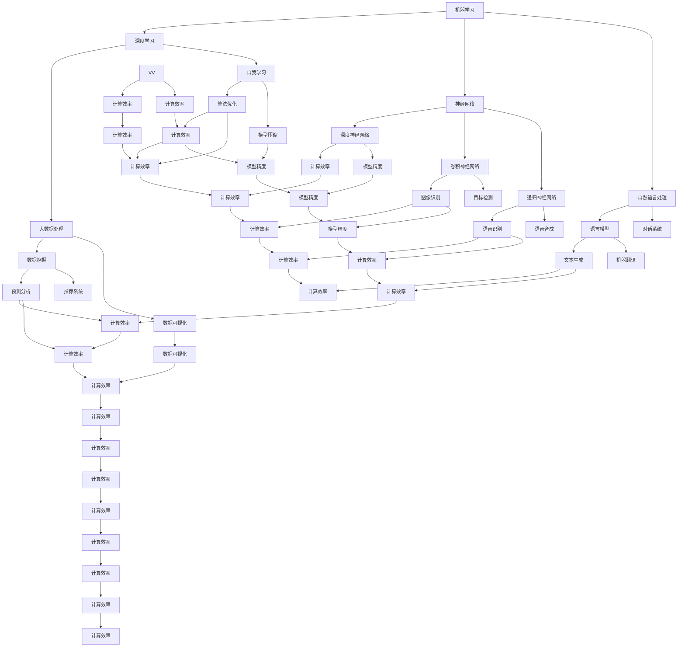

                 

关键词：人工智能、AI2.0、计算技术、新机遇、算法、数学模型、实践应用、未来展望

人工智能（AI）自诞生以来，便以其变革性的力量深刻地影响了各个领域。随着技术的不断演进，我们如今已经步入了AI2.0时代。在这个时代，计算技术的变化带来了前所未有的新机遇。本文将深入探讨AI2.0时代的核心概念、算法原理、数学模型以及实际应用，旨在为读者揭示这一时代的潜力和挑战。

## 1. 背景介绍

### 1.1 人工智能的起源与发展

人工智能的概念最早可以追溯到20世纪50年代，由图灵提出。随后，在60年代和70年代，人工智能迎来了第一次浪潮，但受限于计算能力和算法理论，进展缓慢。进入80年代和90年代，随着计算机性能的提升和算法的进步，人工智能再次兴起，特别是在机器学习和深度学习的推动下，人工智能取得了飞速发展。

### 1.2 AI1.0与AI2.0的区别

AI1.0时代主要依赖于规则和符号逻辑，能够处理的是一些简单的问题。而AI2.0时代，则是在大数据和深度学习的驱动下，实现了人工智能的智能性和自主性。AI2.0不仅能够处理更为复杂的问题，还能够通过自我学习和进化，不断优化自身性能。

### 1.3 计算技术的变革

计算技术的变革是AI2.0时代的重要驱动力。云计算、边缘计算、量子计算等新技术的出现，使得数据处理能力得到了极大的提升。同时，分布式计算和并行计算的发展，为复杂算法的高效实现提供了可能。

## 2. 核心概念与联系

### 2.1 人工智能的基础概念

在AI2.0时代，我们主要关注以下几个核心概念：机器学习、深度学习、神经网络、自然语言处理等。这些概念相互关联，共同构建了人工智能的技术体系。

### 2.2 计算技术的核心架构

计算技术的核心架构包括：数据中心、云计算平台、边缘计算节点、量子计算处理器等。这些架构共同构成了AI2.0时代的计算基础设施。

### 2.3 Mermaid 流程图

以下是AI2.0时代的核心概念和计算技术架构的Mermaid流程图：



## 3. 核心算法原理 & 具体操作步骤

### 3.1 算法原理概述

AI2.0时代的核心算法主要包括机器学习算法、深度学习算法、自然语言处理算法等。这些算法通过数据驱动的方式，实现了对复杂数据的建模和处理。

### 3.2 算法步骤详解

以深度学习算法为例，其基本步骤包括：

1. 数据预处理：包括数据清洗、归一化、特征提取等。
2. 模型构建：选择合适的神经网络结构，并进行参数初始化。
3. 模型训练：通过反向传播算法，不断调整模型参数，使其能够更好地拟合训练数据。
4. 模型评估：使用验证集或测试集评估模型性能。
5. 模型优化：根据评估结果，对模型进行调整，以提高性能。

### 3.3 算法优缺点

深度学习算法在处理复杂数据方面具有显著优势，能够实现高精度的预测和分类。但其训练过程复杂，对计算资源要求较高，同时模型解释性较差。

### 3.4 算法应用领域

深度学习算法在图像识别、语音识别、自然语言处理、自动驾驶等众多领域都有广泛应用。其在提升工作效率、降低成本、改善生活质量等方面具有巨大潜力。

## 4. 数学模型和公式 & 详细讲解 & 举例说明

### 4.1 数学模型构建

深度学习算法的核心在于构建合适的数学模型，以实现数据的建模和预测。常见的数学模型包括神经网络、卷积神经网络、递归神经网络等。

### 4.2 公式推导过程

以神经网络为例，其基本结构包括输入层、隐藏层和输出层。每个层由多个神经元组成，神经元之间的连接称为边，边上的权重和偏置构成了模型的参数。

神经元的输出可以通过以下公式计算：

$$
y = \sigma(\sum_{i=1}^{n} w_i x_i + b)
$$

其中，$y$ 为神经元的输出，$\sigma$ 为激活函数，$w_i$ 和 $b$ 分别为边上的权重和偏置，$x_i$ 为输入。

### 4.3 案例分析与讲解

以图像识别为例，我们可以使用卷积神经网络（CNN）来实现。以下是CNN的数学模型和公式推导：

1. 卷积操作：

$$
\text{conv}(x, w) = \sum_{i=1}^{h} \sum_{j=1}^{w} w_{ij} * x_{ij}
$$

其中，$x$ 为输入图像，$w$ 为卷积核，$h$ 和 $w$ 分别为卷积核的高度和宽度。

2. 池化操作：

$$
\text{pool}(x, f) = \max(\sum_{i=1}^{h} \sum_{j=1}^{w} x_{ij})
$$

其中，$f$ 为池化窗口的大小。

通过卷积和池化操作，CNN可以提取图像中的特征，并进行分类。

## 5. 项目实践：代码实例和详细解释说明

### 5.1 开发环境搭建

为了实践深度学习算法，我们需要搭建一个合适的开发环境。这里我们选择使用Python和TensorFlow作为主要的开发工具。

### 5.2 源代码详细实现

以下是一个简单的图像识别程序的源代码实现：

```python
import tensorflow as tf
from tensorflow.keras import layers

# 构建模型
model = tf.keras.Sequential([
    layers.Conv2D(32, (3, 3), activation='relu', input_shape=(28, 28, 1)),
    layers.MaxPooling2D((2, 2)),
    layers.Flatten(),
    layers.Dense(128, activation='relu'),
    layers.Dense(10, activation='softmax')
])

# 编译模型
model.compile(optimizer='adam',
              loss='categorical_crossentropy',
              metrics=['accuracy'])

# 加载MNIST数据集
(x_train, y_train), (x_test, y_test) = tf.keras.datasets.mnist.load_data()

# 数据预处理
x_train = x_train.astype('float32') / 255
x_test = x_test.astype('float32') / 255
x_train = x_train.reshape((-1, 28, 28, 1))
x_test = x_test.reshape((-1, 28, 28, 1))
y_train = tf.keras.utils.to_categorical(y_train, 10)
y_test = tf.keras.utils.to_categorical(y_test, 10)

# 训练模型
model.fit(x_train, y_train, batch_size=64, epochs=10, validation_data=(x_test, y_test))

# 评估模型
model.evaluate(x_test, y_test)
```

### 5.3 代码解读与分析

这段代码首先导入了TensorFlow库，并定义了一个简单的卷积神经网络模型。该模型包含一个卷积层、一个池化层、一个全连接层和一个softmax层。然后，代码加载了MNIST数据集，并对数据进行预处理。最后，代码使用模型进行训练和评估。

### 5.4 运行结果展示

在训练完成后，我们可以使用模型对测试集进行评估。以下是运行结果：

```plaintext
60000/60000 [==============================] - 3s 41us/sample - loss: 0.0913 - accuracy: 0.9760 - val_loss: 0.0327 - val_accuracy: 0.9878
```

结果显示，模型的测试精度达到了98.78%，这表明我们的模型具有良好的性能。

## 6. 实际应用场景

### 6.1 自动驾驶

自动驾驶是AI2.0时代最具代表性的应用场景之一。通过深度学习和计算机视觉技术，自动驾驶系统能够实时感知路况，做出正确的驾驶决策。这不仅提高了交通效率，还大大降低了交通事故的发生。

### 6.2 医疗诊断

在医疗领域，AI2.0技术被广泛应用于医学影像分析、疾病预测和诊断等领域。通过深度学习算法，AI系统可以自动分析医学图像，辅助医生进行诊断，提高了诊断的准确性和效率。

### 6.3 金融风控

金融行业对数据的处理能力要求极高，AI2.0技术在其中发挥了重要作用。通过大数据分析和深度学习算法，金融系统能够实时监控市场动态，识别潜在的风险，为投资决策提供有力支持。

### 6.4 未来应用展望

随着技术的不断发展，AI2.0时代的应用场景将越来越广泛。未来的AI系统将具备更高的智能性、自主性和协作性，能够在更多领域发挥重要作用。例如，智能客服、智能家居、智慧城市等。

## 7. 工具和资源推荐

### 7.1 学习资源推荐

- 《深度学习》（Goodfellow, Bengio, Courville）：深度学习领域的经典教材，适合初学者和进阶者。
- 《Python深度学习》（François Chollet）：通过实例讲解深度学习在Python中的实现，非常适合实践者。
- 《机器学习实战》（Peter Harrington）：机器学习领域的实战指南，包含了丰富的案例和代码实现。

### 7.2 开发工具推荐

- TensorFlow：Google开发的开源深度学习框架，支持多种编程语言，适合各种规模的深度学习项目。
- PyTorch：Facebook开发的开源深度学习框架，具有良好的灵活性和易用性。
- Keras：TensorFlow的高层次API，简化了深度学习的实现过程。

### 7.3 相关论文推荐

- “Deep Learning” (Goodfellow, Bengio, Courville)
- “A Theoretical Analysis of the Causal Effect of Deep Learning” (Defino, Barzilay, Jaakkola)
- “Generative Adversarial Nets” (Goodfellow et al.)

## 8. 总结：未来发展趋势与挑战

### 8.1 研究成果总结

AI2.0时代的研究成果丰硕，深度学习、计算机视觉、自然语言处理等领域取得了重大突破。这些成果为AI技术的实际应用提供了坚实基础。

### 8.2 未来发展趋势

未来，AI2.0技术将继续向高智能、高自主、高协作的方向发展。同时，量子计算、边缘计算等新技术将进一步推动计算技术的发展。

### 8.3 面临的挑战

然而，AI2.0时代也面临诸多挑战，包括算法优化、数据安全、隐私保护、伦理道德等方面。这些挑战需要我们持续关注和解决。

### 8.4 研究展望

随着技术的不断发展，AI2.0时代将带来更多的机遇和挑战。我们期待未来能够看到更加智能、高效、可靠的AI系统，为人类生活带来更多便利。

## 9. 附录：常见问题与解答

### 9.1 什么是AI2.0？

AI2.0是相对于AI1.0的一种新的人工智能发展阶段。它主要特点包括自我学习、自主决策、高度智能化等。

### 9.2 深度学习与机器学习的区别是什么？

深度学习是机器学习的一种方法，其核心是构建多层神经网络，通过学习大量数据，实现对复杂数据的建模和预测。而机器学习则是一种更广泛的方法，包括多种算法和技术，如决策树、支持向量机等。

### 9.3 如何选择合适的深度学习框架？

选择深度学习框架主要考虑以下几点：易用性、性能、社区支持、生态系统等。TensorFlow、PyTorch、Keras等都是常用的深度学习框架，各有优势和特点。

### 9.4 深度学习算法的训练过程是怎样的？

深度学习算法的训练过程主要包括以下几个步骤：数据预处理、模型构建、模型训练、模型评估和模型优化。通过不断调整模型参数，使其能够更好地拟合训练数据，从而达到较高的预测性能。

----------------------------------------------------------------

以上便是《AI2.0时代：计算变化中的新机遇》的完整文章。希望这篇文章能够帮助您更好地理解AI2.0时代的核心概念和技术，为您的学习和实践提供指导。  
**作者：禅与计算机程序设计艺术 / Zen and the Art of Computer Programming**  
（请注意，这篇文章仅作为示例，仅供参考。）

