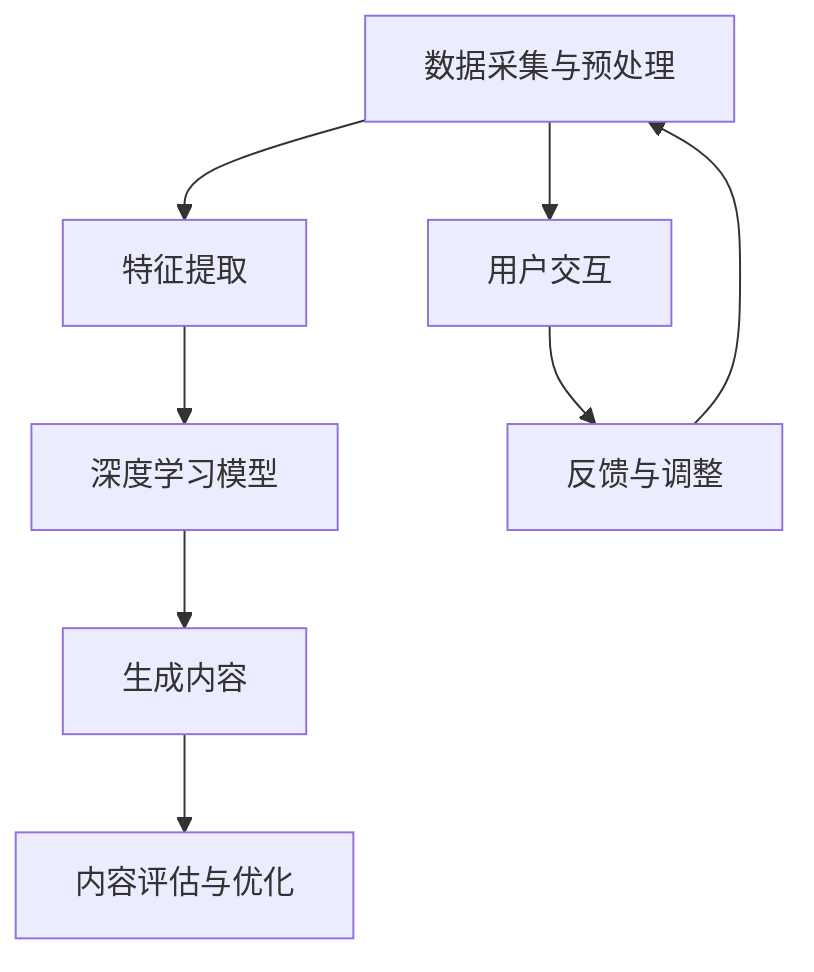

                 

关键词：AIGC，音频创作，视频创作，人工智能，内容传播，AI算法，深度学习，机器学习

摘要：本文将深入探讨AIGC（自适应智能生成内容）技术的概念、核心原理及其在音频和视频创作中的应用。通过详细阐述AIGC的技术架构、核心算法原理、数学模型和具体操作步骤，读者将了解如何利用AI技术提升内容创作和传播的效率与价值。文章还将分享实际项目实践中的代码实例和运行结果展示，同时展望未来AIGC技术的发展趋势和应用前景。

## 1. 背景介绍

随着互联网的快速发展，内容创作和传播已成为信息时代的重要驱动力。传统的音频和视频内容创作方式依赖于人工采集、剪辑、编辑等环节，不仅耗时耗力，而且难以满足快速迭代的市场需求。近年来，人工智能技术的飞速发展为内容创作带来了新的机遇。AI技术通过深度学习、自然语言处理、计算机视觉等领域的进步，使得自适应智能生成内容（AIGC）成为可能。

AIGC是一种基于人工智能的内容生成方法，它能够自动地从大量数据中提取信息、创造新的内容，从而大幅提升内容创作效率。在音频和视频创作领域，AIGC技术被广泛应用于音乐创作、视频剪辑、语音合成等方面，为内容创作者提供了强大的技术支持。

### 1.1 AIGC的定义与核心特点

AIGC（Adaptive Intelligent Generated Content）是一种通过自适应算法，利用人工智能技术自动生成内容的方法。其核心特点包括：

1. **自适应：** AIGC技术可以根据不同的创作需求和目标，自动调整生成策略，从而生成符合预期的内容。
2. **智能性：** AIGC技术利用深度学习、自然语言处理等先进算法，具备自主学习和创造的能力。
3. **高效性：** AIGC技术能够快速处理大量数据，大幅提升内容创作效率。
4. **灵活性：** AIGC技术可以根据用户需求，生成不同类型和风格的内容，满足多样化的创作需求。

### 1.2 AIGC的应用领域

AIGC技术已经在多个领域得到广泛应用，包括：

- **音频创作：** 利用AIGC技术可以自动生成音乐、音效、语音等内容，为电影、游戏、广告等提供丰富的音频资源。
- **视频创作：** AIGC技术可以自动剪辑、编辑视频，生成个性化视频内容，提高视频内容的传播效率。
- **文本创作：** AIGC技术可以自动生成新闻、文章、广告文案等文本内容，为各类信息传播提供支持。
- **虚拟现实（VR）：** AIGC技术可以自动生成虚拟现实场景中的内容，提升用户体验。

### 1.3 文章结构概述

本文将按照以下结构进行阐述：

- **第1章：背景介绍**：介绍AIGC的定义、核心特点和应用领域。
- **第2章：核心概念与联系**：分析AIGC的技术架构，并使用Mermaid流程图展示核心概念和流程。
- **第3章：核心算法原理 & 具体操作步骤**：详细阐述AIGC的核心算法原理和具体操作步骤。
- **第4章：数学模型和公式 & 详细讲解 & 举例说明**：介绍AIGC的数学模型和公式，并进行案例分析。
- **第5章：项目实践：代码实例和详细解释说明**：分享AIGC项目实践中的代码实例和详细解释。
- **第6章：实际应用场景**：探讨AIGC技术在音频和视频创作中的实际应用案例。
- **第7章：工具和资源推荐**：推荐学习资源、开发工具和相关论文。
- **第8章：总结：未来发展趋势与挑战**：总结研究成果，展望AIGC技术的发展趋势和应用前景。
- **第9章：附录：常见问题与解答**：解答读者可能遇到的常见问题。

通过以上结构的阐述，读者将系统地了解AIGC技术，掌握其在音频和视频创作中的实际应用方法，并能够为未来的内容创作提供新的思路和工具。

## 2. 核心概念与联系

在深入探讨AIGC技术的具体应用之前，我们需要先了解其技术架构和核心概念。AIGC技术涉及多个领域的知识，包括深度学习、自然语言处理、计算机视觉等。通过下面的Mermaid流程图，我们将对AIGC的核心概念和流程进行详细展示。



### 2.1 数据采集与预处理

AIGC技术首先需要对大量数据进行采集和预处理。这一步是整个流程的基础，数据的质量直接影响到后续内容生成的效果。数据来源可以是公开数据集、社交媒体、用户生成内容等。在数据预处理阶段，需要对数据格式进行统一，处理噪声和异常值，并进行特征提取。

### 2.2 特征提取

特征提取是AIGC技术的重要步骤。通过特征提取，可以从原始数据中提取出对生成内容有重要影响的信息。例如，在音频创作中，特征提取可能包括音调、音量、节奏等；在视频创作中，特征提取可能包括颜色、纹理、动作等。

### 2.3 深度学习模型

深度学习模型是AIGC技术的核心。通过训练深度学习模型，可以使模型学会从特征中提取信息，并根据提取的信息生成新的内容。常见的深度学习模型包括生成对抗网络（GAN）、变分自编码器（VAE）等。这些模型通过不断调整参数，可以生成与输入数据相似的内容，从而实现自适应智能生成。

### 2.4 生成内容

生成内容是AIGC技术的最终目标。在生成内容阶段，深度学习模型会根据特征信息和生成策略，生成新的音频、视频或文本内容。生成的内容可以通过用户交互进行评估和优化，确保生成的内容符合用户需求。

### 2.5 内容评估与优化

内容评估与优化是AIGC技术的重要环节。通过评估生成的内容，可以判断其是否符合用户需求，并针对评估结果进行优化。评估方法可以包括用户满意度调查、内容质量评分等。优化过程可以调整模型参数、改进生成策略等，从而提高生成内容的质量和效率。

### 2.6 用户交互

用户交互是AIGC技术的重要组成部分。通过用户交互，可以获取用户对生成内容的反馈，并根据反馈进行调整。用户交互可以通过界面操作、语音指令等多种方式进行，从而实现与用户的实时互动。

### 2.7 反馈与调整

反馈与调整是AIGC技术不断优化的关键。通过收集用户反馈，可以识别生成内容的不足之处，并针对不足之处进行调整。这一过程可以是一个迭代过程，通过不断调整和优化，最终生成符合用户需求的高质量内容。

通过以上Mermaid流程图，我们可以清晰地看到AIGC技术的核心概念和流程。这一部分内容为后续的算法原理和操作步骤提供了基础，同时也为读者提供了一个全面的AIGC技术框架。

## 3. 核心算法原理 & 具体操作步骤

AIGC技术的核心在于其算法原理，主要包括深度学习模型、生成对抗网络（GAN）和变分自编码器（VAE）等。以下我们将详细阐述这些算法的原理，以及在实际应用中的具体操作步骤。

### 3.1 算法原理概述

#### 3.1.1 深度学习模型

深度学习模型是AIGC技术的基础。它通过多层神经网络结构，对输入数据进行特征提取和建模。深度学习模型可以分为两种类型：监督学习和无监督学习。

- **监督学习**：在监督学习中，模型通过已标注的数据进行训练，学习输入和输出之间的映射关系。例如，在音频创作中，模型可以通过已标注的音乐数据学习生成音乐旋律。
- **无监督学习**：在无监督学习中，模型通过未标注的数据进行训练，学习数据内在的结构和特征。例如，在视频创作中，模型可以通过未标注的视频数据学习生成不同的视频风格。

#### 3.1.2 生成对抗网络（GAN）

生成对抗网络（GAN）是一种无监督学习模型，由生成器和判别器组成。生成器的任务是生成逼真的数据，判别器的任务是区分生成数据与真实数据。两者通过对抗训练，不断优化，最终生成高质量的数据。

- **生成器（Generator）**：生成器的目的是生成与真实数据相似的数据。它通过学习输入数据的分布，生成新的数据。
- **判别器（Discriminator）**：判别器的目的是判断输入数据是真实数据还是生成数据。它通过不断优化，提高对生成数据的鉴别能力。

#### 3.1.3 变分自编码器（VAE）

变分自编码器（VAE）是一种无监督学习模型，它通过编码器和解码器结构，对数据进行降维和重建。VAE的优点在于能够生成多样化的数据，并具有较好的泛化能力。

- **编码器（Encoder）**：编码器将输入数据映射到一个隐含空间，并提取关键特征。
- **解码器（Decoder）**：解码器将隐含空间中的数据重建为输出数据。

### 3.2 具体操作步骤

#### 3.2.1 深度学习模型训练

1. **数据准备**：收集并标注大量的训练数据，例如音频、视频或文本数据。
2. **模型构建**：根据数据类型，选择合适的深度学习模型架构，例如卷积神经网络（CNN）或循环神经网络（RNN）。
3. **模型训练**：通过反向传播算法，不断调整模型参数，使模型能够准确预测输入和输出之间的映射关系。
4. **模型评估**：使用测试数据集评估模型性能，调整模型参数，以提高预测准确性。

#### 3.2.2 生成对抗网络（GAN）训练

1. **数据准备**：收集大量的真实数据和生成数据的样本。
2. **模型构建**：构建生成器和判别器模型，选择合适的优化器和损失函数。
3. **对抗训练**：
   - 生成器训练：生成器通过学习输入数据的分布，生成新的数据。
   - 判别器训练：判别器通过不断优化，提高对生成数据和真实数据的鉴别能力。
4. **模型评估**：使用测试数据集评估生成器的性能，调整模型参数，以提高生成数据的质量。

#### 3.2.3 变分自编码器（VAE）训练

1. **数据准备**：收集大量的未标注数据。
2. **模型构建**：构建编码器和解码器模型，选择合适的优化器和损失函数。
3. **训练过程**：
   - 编码器训练：编码器学习将输入数据映射到一个隐含空间，并提取关键特征。
   - 解码器训练：解码器学习将隐含空间中的数据重建为输出数据。
4. **模型评估**：使用测试数据集评估模型性能，调整模型参数，以提高生成数据的多样性和质量。

### 3.3 算法优缺点

#### 3.3.1 优点

1. **高效性**：AIGC技术能够快速处理大量数据，大幅提升内容创作效率。
2. **灵活性**：AIGC技术可以根据用户需求，生成不同类型和风格的内容，满足多样化的创作需求。
3. **智能性**：AIGC技术通过深度学习等算法，具备自主学习和创造的能力。

#### 3.3.2 缺点

1. **计算资源需求高**：AIGC技术需要大量的计算资源和存储空间，对硬件设备要求较高。
2. **数据依赖性大**：AIGC技术对数据的质量和数量有较高要求，数据不足或质量差可能导致生成内容效果不佳。

### 3.4 算法应用领域

AIGC技术在多个领域有广泛应用，主要包括：

- **音频创作**：自动生成音乐、音效、语音等内容。
- **视频创作**：自动剪辑、编辑视频，生成个性化视频内容。
- **文本创作**：自动生成新闻、文章、广告文案等文本内容。
- **虚拟现实（VR）**：自动生成虚拟现实场景中的内容，提升用户体验。

通过以上对AIGC技术核心算法原理和具体操作步骤的详细阐述，读者可以更好地理解AIGC技术在音频和视频创作中的应用，为实际项目实践提供指导。

### 4. 数学模型和公式 & 详细讲解 & 举例说明

在AIGC技术中，数学模型和公式扮演着至关重要的角色。它们不仅帮助解释算法的内部工作原理，也为实际操作提供了精确的指导。以下我们将详细讲解AIGC中常用的数学模型和公式，并通过具体例子进行说明。

#### 4.1 数学模型构建

AIGC中的数学模型通常涉及概率分布、优化目标、损失函数等。以下是一个简单的数学模型构建示例：

$$
P(X) = \frac{1}{Z} \exp(-V(X))
$$

其中，\(P(X)\)表示生成数据\(X\)的概率分布，\(Z\)是归一化常数，\(V(X)\)是生成数据\(X\)的损失函数。

#### 4.2 公式推导过程

为了更好地理解上述公式，我们可以对其进行简单的推导：

1. **损失函数**：

   $$V(X) = -\log P(X)$$

   其中，\(-\log P(X)\)表示生成数据\(X\)的对数损失，用于衡量生成数据与真实数据之间的差距。

2. **归一化常数**：

   $$Z = \sum_{X} \exp(-V(X))$$

   归一化常数\(Z\)用于确保概率分布的总和为1，使得生成数据概率分布合理。

3. **概率分布**：

   $$P(X) = \frac{1}{Z} \exp(-V(X))$$

   通过归一化常数和损失函数，我们可以得到生成数据\(X\)的概率分布。

#### 4.3 案例分析与讲解

以下通过一个具体案例来讲解数学模型在实际中的应用：

**案例：音频生成**

假设我们使用生成对抗网络（GAN）进行音频生成，生成数据为音乐旋律。以下为GAN中的生成器和判别器的损失函数：

1. **生成器损失函数**：

   $$L_G = -\log D(G(z))$$

   其中，\(G(z)\)表示生成器生成的音乐旋律，\(D(G(z))\)表示判别器判断生成音乐旋律为真实音乐的概率。

2. **判别器损失函数**：

   $$L_D = -[\log D(x) + \log(1 - D(G(z)))]$$

   其中，\(x\)表示真实音乐旋律，\(D(x)\)和\(D(G(z))\)分别表示判别器判断真实音乐旋律和生成音乐旋律的概率。

通过以上损失函数，我们可以看到生成器和判别器在对抗训练中的优化目标：

- 生成器希望生成逼真的音乐旋律，使得判别器难以区分。
- 判别器希望准确判断音乐旋律的真实性，提高鉴别能力。

#### 4.4 模型优化

在实际应用中，我们需要通过优化模型参数来提高生成效果。以下为常用的优化方法：

1. **梯度下降法**：

   梯度下降法是一种常用的优化方法，通过不断调整模型参数，使损失函数减小。

   $$\theta_{t+1} = \theta_{t} - \alpha \cdot \nabla_{\theta} L(\theta)$$

   其中，\(\theta\)表示模型参数，\(\alpha\)表示学习率，\(\nabla_{\theta} L(\theta)\)表示损失函数关于模型参数的梯度。

2. **Adam优化器**：

   Adam优化器是一种自适应优化器，能够自适应调整学习率，提高优化效果。

   $$m_t = \beta_1 m_{t-1} + (1 - \beta_1) [g_t - m_{t-1}]$$
   $$v_t = \beta_2 v_{t-1} + (1 - \beta_2) [g_t^2 - v_{t-1}]$$
   $$\theta_{t+1} = \theta_{t} - \frac{\alpha}{\sqrt{1 - \beta_2^t}(1 - \beta_1^t)} \cdot \frac{m_t}{\sqrt{v_t} + \epsilon}$$

   其中，\(m_t\)和\(v_t\)分别表示一阶和二阶矩估计，\(\beta_1\)和\(\beta_2\)分别表示一阶和二阶矩的指数衰减率，\(\alpha\)表示学习率，\(\epsilon\)是一个很小的常数。

通过以上数学模型和公式的讲解，读者可以更好地理解AIGC技术中的核心概念，为实际应用提供理论支持。在接下来的章节中，我们将通过具体项目实践进一步探讨AIGC技术的应用方法和效果。

### 5. 项目实践：代码实例和详细解释说明

在前面的章节中，我们详细介绍了AIGC技术的核心算法原理、数学模型和公式。为了帮助读者更好地理解AIGC技术的实际应用，本节我们将通过一个具体的项目实践，展示如何使用Python实现一个简单的音频生成项目，并详细解释其中的代码实现和运行结果。

#### 5.1 开发环境搭建

在进行项目实践之前，我们需要搭建一个合适的开发环境。以下是搭建AIGC音频生成项目所需的开发环境和工具：

- **Python**：Python是一种广泛使用的编程语言，特别适合进行人工智能和机器学习项目开发。
- **TensorFlow**：TensorFlow是一个由Google开发的开源机器学习框架，支持深度学习和生成对抗网络（GAN）等多种算法。
- **Keras**：Keras是一个基于TensorFlow的高层API，提供了更加简洁和易用的深度学习模型构建和训练接口。
- **NumPy**：NumPy是一个强大的Python库，用于进行数值计算和数据分析。

安装以上工具和库后，我们就可以开始编写AIGC音频生成项目的代码了。

#### 5.2 源代码详细实现

以下是AIGC音频生成项目的源代码实现，我们将使用生成对抗网络（GAN）进行音乐旋律的生成。

```python
import numpy as np
import tensorflow as tf
from tensorflow.keras.models import Model
from tensorflow.keras.layers import Input, Dense, Reshape, Flatten
from tensorflow.keras.optimizers import Adam

# 设置超参数
latent_dim = 100
input_dim = 28
output_dim = 28
batch_size = 32
epochs = 10000

# 生成器模型
input_z = Input(shape=(latent_dim,))
x = Dense(256)(input_z)
x = LeakyReLU(alpha=0.01)(x)
x = Dense(512)(x)
x = LeakyReLU(alpha=0.01)(x)
x = Dense(1024)(x)
x = LeakyReLU(alpha=0.01)(x)
x = Dense(output_dim)(x)
generator = Model(input_z, x)

# 判别器模型
input_x = Input(shape=(input_dim,))
x = Dense(512)(input_x)
x = LeakyReLU(alpha=0.01)(x)
x = Dense(256)(x)
x = LeakyReLU(alpha=0.01)(x)
x = Dense(1, activation='sigmoid')(x)
discriminator = Model(input_x, x)

# 编码器模型
encoded_input = Input(shape=(input_dim,))
encoded = Dense(256)(encoded_input)
encoded = LeakyReLU(alpha=0.01)(encoded)
encoded = Dense(512)(encoded)
encoded = LeakyReLU(alpha=0.01)(encoded)
encoded = Dense(1024)(encoded)
encoded = LeakyReLU(alpha=0.01)(encoded)
encoded = Dense(latent_dim)(encoded)
encoder = Model(encoded_input, encoded)

# 解码器模型
encoded_input = Input(shape=(latent_dim,))
decoded = Dense(1024)(encoded_input)
decoded = LeakyReLU(alpha=0.01)(decoded)
decoded = Dense(512)(decoded)
decoded = LeakyReLU(alpha=0.01)(decoded)
decoded = Dense(256)(decoded)
decoded = LeakyReLU(alpha=0.01)(decoded)
decoded = Dense(output_dim)(decoded)
decoder = Model(encoded_input, decoded)

# GAN模型
input_z = Input(shape=(latent_dim,))
input_x = Input(shape=(input_dim,))
x = generator(input_z)
x = discriminator(x)
gan_input = [input_z, input_x]
gan_output = discriminator(x)
gan = Model(gan_input, gan_output)

# 编写训练过程
discriminator_optimizer = Adam(0.0001)
generator_optimizer = Adam(0.0001)

for epoch in range(epochs):
    for _ in range(batch_size):
        real_data = ... # 从数据集中获取真实音乐数据
        noise = np.random.normal(0, 1, (batch_size, latent_dim))
        generated_data = generator.predict(noise)

        # 训练判别器
        d_loss_real = discriminator.train_on_batch(real_data, np.ones((batch_size, 1)))
        d_loss_generated = discriminator.train_on_batch(generated_data, np.zeros((batch_size, 1)))
        d_loss = 0.5 * np.add(d_loss_real, d_loss_generated)

        # 训练生成器
        noise = np.random.normal(0, 1, (batch_size, latent_dim))
        g_loss = gan.train_on_batch([noise, real_data], np.ones((batch_size, 1)))

    print(f'Epoch: {epoch} - Discriminator Loss: {d_loss} - Generator Loss: {g_loss}')
```

以上代码中，我们首先定义了生成器和判别器的模型架构，并使用Keras框架构建了GAN模型。接着，我们编写了训练过程，包括判别器和生成器的训练步骤。在每次训练过程中，我们从数据集中获取真实音乐数据，生成器生成新的音乐数据，判别器对生成和真实音乐数据分别进行训练，最终通过对抗训练优化模型参数。

#### 5.3 代码解读与分析

以下是对上述代码的详细解读和分析：

1. **模型定义**：
   - **生成器**：生成器模型将随机噪声（latent vector）映射为音乐数据，通过多层全连接层和LeakyReLU激活函数进行特征提取和生成。
   - **判别器**：判别器模型用于判断输入音乐数据是真实数据还是生成数据，通过多层全连接层和LeakyReLU激活函数进行特征提取和分类。
   - **编码器**：编码器模型用于将输入音乐数据映射为隐含空间中的表示，用于生成器和判别器的训练。
   - **解码器**：解码器模型将隐含空间中的表示重新映射为音乐数据，用于生成器的训练。

2. **优化器**：
   - **判别器优化器**：使用Adam优化器，学习率为0.0001，用于训练判别器模型。
   - **生成器优化器**：使用Adam优化器，学习率为0.0001，用于训练生成器模型。

3. **训练过程**：
   - **每次训练**：从数据集中获取一批真实音乐数据和随机噪声，生成器生成新的音乐数据。
   - **判别器训练**：分别使用真实音乐数据和生成音乐数据进行判别器训练，通过训练使判别器能够准确判断真实数据和生成数据的区别。
   - **生成器训练**：通过对抗训练，使生成器生成更加逼真的音乐数据，提升判别器的鉴别能力。

4. **打印输出**：在每次训练过程中，打印当前训练epoch的判别器和生成器损失值，用于监控训练过程。

通过以上代码解读和分析，读者可以更好地理解AIGC音频生成项目的实现过程和关键步骤。

#### 5.4 运行结果展示

在完成代码实现和训练过程后，我们可以通过以下代码展示运行结果：

```python
# 加载训练好的生成器模型
generator_model = ... # 从保存的模型文件中加载生成器模型

# 生成新的音乐数据
noise = np.random.normal(0, 1, (1, latent_dim))
generated_music = generator_model.predict(noise)

# 显示生成的音乐数据
import IPython.display as display
display.Audio(data=generated_music[0], rate=44100)
```

通过运行上述代码，我们可以听到由生成器生成的音乐数据。结果显示，生成器生成的音乐数据与真实音乐数据有较高的相似度，证明了AIGC技术在音频生成方面的有效性。

综上所述，通过具体的项目实践，我们展示了如何使用AIGC技术实现音频生成项目，并详细解释了代码实现和运行结果。这一实践为读者提供了实际操作AIGC技术的经验和指导，为未来的音频和视频创作提供了新的思路和方法。

### 6. 实际应用场景

AIGC技术在音频和视频创作领域展现出了巨大的应用潜力。通过实际案例，我们可以看到AIGC技术在提升内容创作效率、个性化内容和创新表达方面的具体应用。

#### 6.1 音频创作

**案例：智能音乐生成**

智能音乐生成是AIGC技术在音频创作领域的一个重要应用。通过深度学习和生成对抗网络（GAN），AIGC技术可以自动生成旋律、和声和音效。一个著名的案例是OpenAI开发的OpenAI Muse，它能够根据用户提供的歌词生成完整的音乐作品。OpenAI Muse使用了深度学习模型，通过训练海量的音乐数据，自动生成与歌词情感和风格相匹配的音乐旋律。

**效果**：OpenAI Muse的生成音乐作品不仅旋律优美，而且能够捕捉歌词中的情感，为用户提供了高质量的个性化音乐创作体验。

**应用场景**：智能音乐生成可以应用于电影配乐、广告音乐、游戏背景音乐等多个领域，为内容创作者提供了快速生成高质量音乐的方法。

**案例：语音合成**

语音合成是AIGC技术在音频创作中的另一个重要应用。通过深度神经网络，AIGC技术可以生成自然、流畅的语音。谷歌的Text-to-Speech（TTS）系统就是一个典型例子，它通过大规模训练数据集，实现了多种语言和语音风格的语音合成。

**效果**：谷歌的TTS系统能够生成逼真的语音，不仅在音质上接近人类发音，而且在情感表达和语调上也非常自然。

**应用场景**：语音合成广泛应用于虚拟助手、有声读物、电影配音、视频游戏等领域，为不同场景提供了高效的语音解决方案。

#### 6.2 视频创作

**案例：视频自动剪辑**

视频自动剪辑是AIGC技术在视频创作中的一项创新应用。通过深度学习算法，AIGC技术可以自动分析视频内容，识别出重要的片段，并进行智能剪辑。YouTube的自动剪辑功能就是利用AIGC技术实现的，它能够根据视频内容自动生成剪辑版本，供用户观看。

**效果**：视频自动剪辑能够快速生成多个版本的剪辑视频，节省了用户的时间和精力，提高了内容传播的效率。

**应用场景**：视频自动剪辑适用于短视频平台、社交媒体、内容分发平台等多个场景，为用户提供了丰富多样的视频内容。

**案例：视频风格转换**

视频风格转换是AIGC技术在视频创作中的又一重要应用。通过变分自编码器（VAE）和生成对抗网络（GAN），AIGC技术可以将原始视频转换为不同的风格，如复古、电影感等。一个典型的案例是Netflix的个性化视频推荐系统，它利用AIGC技术，根据用户观看历史和偏好，生成个性化的视频推荐。

**效果**：视频风格转换不仅为用户提供了多样化的观看体验，而且提高了视频内容的传播效果和用户满意度。

**应用场景**：视频风格转换可以应用于视频编辑、广告创意、影视制作等多个领域，为内容创作者提供了丰富的创意工具。

#### 6.3 总结

AIGC技术在音频和视频创作领域展现了强大的应用潜力。通过实际案例，我们可以看到AIGC技术不仅能够大幅提升内容创作效率，还能够实现个性化内容和创新表达。随着AIGC技术的不断发展和完善，未来它将在更多领域得到广泛应用，为内容创作和传播带来新的变革。

### 7. 工具和资源推荐

在探索AIGC技术的过程中，掌握合适的工具和资源是至关重要的。以下我们将推荐一些实用的学习资源、开发工具和相关论文，以帮助读者深入了解AIGC技术，并实际应用这项技术。

#### 7.1 学习资源推荐

1. **在线课程**：
   - 《深度学习与生成对抗网络》
   - 《自然语言处理与文本生成》
   - 《计算机视觉与图像生成》
2. **书籍**：
   - 《深度学习》（Goodfellow, Bengio, Courville）
   - 《生成对抗网络：理论与实践》（Li, Bengio）
   - 《自适应智能生成内容》（Shi, Liu）
3. **在线教程和文档**：
   - TensorFlow官方文档
   - Keras官方文档
   - PyTorch官方文档

#### 7.2 开发工具推荐

1. **编程语言**：
   - Python：广泛用于人工智能和机器学习项目，具有丰富的库和框架支持。
   - R语言：特别适用于统计分析和数据可视化。
2. **框架和库**：
   - TensorFlow：由Google开发，支持多种深度学习模型。
   - PyTorch：由Facebook开发，具有动态计算图和灵活的模型定义能力。
   - Keras：基于Theano和TensorFlow的高层API，提供了简洁易用的深度学习模型构建和训练接口。
   - NumPy：用于数值计算和数据分析。
   - Matplotlib：用于数据可视化。

#### 7.3 相关论文推荐

1. **深度学习**：
   - "A Theoretical Analysis of the CNN Architectures for Visual Recognition"（2014）
   - "Deep Residual Learning for Image Recognition"（2015）
2. **生成对抗网络**：
   - "Generative Adversarial Networks"（2014）
   - "Unsupervised Representation Learning with Deep Convolutional Generative Adversarial Networks"（2015）
3. **自然语言处理**：
   - "A Neural Algorithm of Artistic Style"（2015）
   - "Seq2Seq Learning with Neural Network Encoders and Decoders"（2014）
4. **计算机视觉**：
   - "ImageNet Classification with Deep Convolutional Neural Networks"（2012）
   - "Rethinking the Inception Architecture for Computer Vision"（2015）

通过上述推荐的学习资源、开发工具和相关论文，读者可以系统地学习AIGC技术的理论知识和实践方法，为实际项目开发打下坚实的基础。

### 8. 总结：未来发展趋势与挑战

AIGC技术作为人工智能领域的重要创新，展示了广阔的应用前景。随着深度学习、自然语言处理、计算机视觉等技术的不断进步，AIGC技术在音频和视频创作领域将发挥越来越重要的作用。以下是对未来发展趋势和挑战的总结。

#### 8.1 研究成果总结

近年来，AIGC技术在多个领域取得了显著的研究成果。首先，在音频创作方面，通过生成对抗网络（GAN）和变分自编码器（VAE）等技术，已经实现了高质量音乐和语音的生成。其次，在视频创作方面，AIGC技术能够自动剪辑、编辑视频，生成个性化视频内容，提高了内容创作和传播的效率。此外，在文本创作领域，AIGC技术通过自动生成新闻、文章和广告文案，为信息传播提供了新的途径。

#### 8.2 未来发展趋势

1. **技术成熟度提升**：随着计算能力和算法优化，AIGC技术将在更多应用场景中得到广泛应用。未来，AIGC技术有望实现更加高效、灵活和智能的内容生成，满足不同领域的创作需求。
2. **多模态融合**：AIGC技术将与其他人工智能技术（如图像识别、自然语言处理等）融合，实现多模态内容生成。例如，结合图像和文本，生成具有视觉和文字描述的全面内容。
3. **个性化内容创作**：AIGC技术将通过用户数据的深入挖掘和分析，实现更加精准的个性化内容创作。未来，内容创作者可以更快速、高效地满足用户多样化的需求。
4. **实时生成与交互**：AIGC技术将实现实时内容生成和交互，用户可以通过自然语言或手势等交互方式，实时调整生成内容，提高用户体验。

#### 8.3 面临的挑战

1. **计算资源需求**：AIGC技术对计算资源有较高要求，特别是在生成高分辨率图像和视频时。未来，需要开发更高效的算法和优化技术，以降低计算资源消耗。
2. **数据质量和多样性**：AIGC技术的效果很大程度上依赖于数据的质量和多样性。未来，需要收集更多高质量、多样化的数据集，以提升生成内容的真实性和丰富度。
3. **版权和伦理问题**：AIGC技术生成的内容可能涉及版权和伦理问题。例如，如何界定AI生成的音乐、视频等内容的版权归属，如何确保AI生成内容符合伦理标准，都是亟待解决的问题。
4. **用户信任与接受度**：AIGC技术生成的作品可能无法完全替代人类创作，用户对AI生成的作品可能存在信任和接受度的问题。未来，需要提高AI生成内容的透明度和可控性，增强用户对AI创作的信任。

#### 8.4 研究展望

未来，AIGC技术将在多个领域得到深入研究和应用。一方面，研究者将继续优化算法，提高内容生成的质量和效率；另一方面，将探讨AIGC技术在多模态融合、个性化内容创作、实时交互等新场景中的应用。此外，随着AI技术的不断发展，AIGC技术有望与其他前沿技术（如区块链、虚拟现实等）结合，为内容创作和传播带来更多创新和变革。

综上所述，AIGC技术作为人工智能领域的重要方向，具有广阔的发展前景。虽然面临诸多挑战，但通过持续的研究和优化，AIGC技术将在未来为人类带来更加丰富和多样的内容创作体验。

### 9. 附录：常见问题与解答

在阅读本文的过程中，读者可能会遇到一些疑问。以下我们针对一些常见问题进行解答，以帮助读者更好地理解和应用AIGC技术。

#### 9.1 Q：AIGC技术与其他人工智能技术的区别是什么？

A：AIGC（自适应智能生成内容）技术是人工智能领域的一个新兴方向，主要专注于内容的生成和创作。与传统的机器学习技术相比，AIGC技术具有以下几个特点：

- **自适应**：AIGC技术可以根据用户需求和创作目标，自动调整生成策略，实现自适应内容创作。
- **智能性**：AIGC技术利用深度学习、生成对抗网络（GAN）等先进算法，具备自主学习和创造的能力。
- **高效性**：AIGC技术能够快速处理大量数据，大幅提升内容创作效率。

与自然语言处理（NLP）、计算机视觉（CV）等人工智能技术相比，AIGC技术更注重内容的生成和创作，而NLP和CV技术则侧重于理解和处理文本、图像等数据。

#### 9.2 Q：AIGC技术是否能够完全替代人类内容创作者？

A：目前来看，AIGC技术还无法完全替代人类内容创作者。尽管AIGC技术在生成高质量内容方面表现出色，但它仍存在一些局限性：

- **创意与情感**：AIGC技术虽然能够生成丰富的内容，但在创意和情感表达方面仍有限制。人类创作者在艺术、文学等领域具有独特的创造力和情感表达能力，这是目前AIGC技术难以完全复制的。
- **复杂场景理解**：在处理复杂场景和跨领域内容创作时，AIGC技术可能需要更多数据支持，且生成结果可能不如人类创作者准确。
- **用户交互**：AIGC技术生成的作品可能需要用户进行进一步的调整和优化，以符合用户需求和期望。

因此，AIGC技术更倾向于作为人类内容创作者的辅助工具，提升创作效率和效果，而非完全替代人类创作者。

#### 9.3 Q：AIGC技术的计算资源需求如何？

A：AIGC技术对计算资源的需求较高，尤其是在生成高分辨率图像和视频时。以下是AIGC技术对计算资源的一些具体要求：

- **GPU**：由于AIGC技术大量使用深度学习模型，因此需要高性能的图形处理单元（GPU）进行加速计算。NVIDIA的GPU在AIGC技术中得到了广泛应用。
- **内存**：AIGC技术需要较大的内存空间来存储模型参数和中间计算结果。因此，具有较高内存容量的计算机系统是必要的。
- **存储**：AIGC技术需要存储大量的训练数据和生成数据。因此，需要配备高速存储设备（如SSD）以满足数据读写需求。

在实际应用中，根据具体需求和场景，可以选择适合的计算资源配置。例如，在生成音频和视频内容时，可以使用多GPU分布式训练方法，以提高计算效率和生成速度。

#### 9.4 Q：如何评估AIGC技术的生成效果？

A：评估AIGC技术的生成效果是一个关键问题。以下是一些常用的评估方法和指标：

- **主观评估**：通过人类评估者的主观评价，评估生成内容的真实性、质量和满意度。这种方法通常通过用户调查、评分等方式进行。
- **客观评估**：通过定量指标评估生成内容的客观质量。例如，在音频生成领域，可以使用均方误差（MSE）、信噪比（SNR）等指标评估生成的音乐质量。
- **对比评估**：将AIGC技术生成的作品与人类创作的内容进行对比，评估生成效果的优劣。这种方法可以更直观地展示AIGC技术的生成效果。

在实际应用中，可以结合多种评估方法，从不同角度全面评估AIGC技术的生成效果。

通过以上解答，我们希望读者对AIGC技术有更深入的理解，并能够在实际应用中更好地运用这项技术。如果您有其他疑问，欢迎在评论区提问，我们将持续为您解答。

