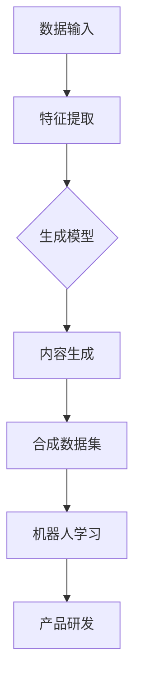

                 

关键词：AIGC、合成数据集、工业领域、机器人产品研发、技术博客文章

> 摘要：本文将深入探讨AIGC（AI-Generated Content）技术在实际工业领域中的应用，特别是合成数据集对于机器人产品研发的助力。通过详细的理论分析、实际案例展示，以及未来发展展望，希望读者能够全面了解AIGC技术的潜力与挑战。

## 1. 背景介绍

随着人工智能技术的飞速发展，AIGC（AI-Generated Content）作为一种新型的生成内容技术，正在逐步走进我们的日常生活和工业生产中。AIGC通过人工智能算法，可以自动生成各种形式的内容，如图像、文本、音频等，从而极大地提高内容生产的效率和多样性。在工业领域，特别是机器人产品研发过程中，合成数据集的应用已经显示出巨大的潜力。

合成数据集是一种通过模拟真实环境生成的人工数据集，它可以帮助机器人更好地学习和适应复杂的工作环境。与传统的人工标注数据集相比，合成数据集可以节省大量的人工成本，同时提供更多的数据量，有助于提高机器学习模型的性能。

## 2. 核心概念与联系

为了更好地理解AIGC在工业领域中的应用，我们需要首先明确几个核心概念，包括AIGC的工作原理、合成数据集的生成过程，以及它们在机器人产品研发中的作用。

### 2.1 AIGC的工作原理

AIGC的工作原理主要包括以下几个步骤：

1. **数据输入**：首先，AIGC系统需要大量的训练数据，这些数据可以是已经存在的，也可以是通过采集设备生成的。
2. **特征提取**：通过深度学习模型，从数据中提取出有用的特征信息。
3. **内容生成**：利用提取到的特征信息，通过生成模型（如GAN、VAE等）生成新的内容。

### 2.2 合成数据集的生成过程

合成数据集的生成过程可以分为以下几个阶段：

1. **环境建模**：通过计算机图形学技术，构建出模拟的真实环境。
2. **动作模拟**：在模拟环境中，根据机器人的行为规则，模拟出各种可能的动作和行为。
3. **数据生成**：将模拟出的动作和行为转化为图像、视频或传感器数据，形成合成数据集。

### 2.3 在机器人产品研发中的作用

合成数据集在机器人产品研发中具有以下几个重要作用：

1. **提高学习效率**：通过提供大量的合成数据，机器人可以更快地学习和适应新的环境。
2. **降低研发成本**：减少了人工标注数据的需求，降低了研发成本。
3. **增强鲁棒性**：通过模拟各种极端情况，提高机器人应对复杂环境的鲁棒性。

### 2.4 Mermaid 流程图

下面是一个简单的Mermaid流程图，展示了AIGC和合成数据集在机器人产品研发中的应用流程：



## 3. 核心算法原理 & 具体操作步骤

### 3.1 算法原理概述

在AIGC技术中，核心算法主要包括深度学习模型和生成模型。深度学习模型主要用于特征提取，而生成模型则用于内容生成。

- **深度学习模型**：常用的深度学习模型有CNN（卷积神经网络）和RNN（循环神经网络）。CNN擅长处理图像数据，而RNN擅长处理序列数据。
- **生成模型**：常用的生成模型有GAN（生成对抗网络）和VAE（变分自编码器）。GAN通过两个神经网络（生成器和判别器）的对抗训练，生成高质量的内容；VAE则通过概率模型，生成新的数据点。

### 3.2 算法步骤详解

1. **数据预处理**：对原始数据进行预处理，包括数据清洗、归一化等。
2. **特征提取**：使用深度学习模型，从预处理后的数据中提取出特征信息。
3. **内容生成**：使用生成模型，根据提取到的特征信息，生成新的内容。
4. **数据集构建**：将生成的数据与原始数据合并，形成合成数据集。
5. **机器人学习**：使用合成数据集，训练机器人模型，提高其适应能力。
6. **产品研发**：基于训练好的机器人模型，进行产品研发。

### 3.3 算法优缺点

- **优点**：
  - 提高学习效率：通过合成数据集，机器人可以更快地学习和适应新的环境。
  - 降低研发成本：减少了人工标注数据的需求，降低了研发成本。
  - 提高鲁棒性：通过模拟各种极端情况，提高机器人应对复杂环境的鲁棒性。

- **缺点**：
  - 数据质量：合成数据集的质量直接影响机器学习模型的性能。
  - 算法复杂度：深度学习和生成模型的训练过程相对复杂，需要大量计算资源。

### 3.4 算法应用领域

AIGC和合成数据集在工业领域的应用非常广泛，包括但不限于：

- **机器人产品研发**：通过合成数据集，提高机器人学习效率和适应能力。
- **自动驾驶**：通过模拟真实交通场景，训练自动驾驶模型，提高其安全性。
- **医疗影像诊断**：通过合成医疗影像数据，辅助医生进行诊断。

## 4. 数学模型和公式 & 详细讲解 & 举例说明

### 4.1 数学模型构建

在AIGC技术中，常用的数学模型包括深度学习模型和生成模型。以下是几个常见的数学模型：

- **CNN模型**：
  $$ f(x) = \sigma(W \cdot x + b) $$
  其中，$f(x)$表示输出，$W$表示权重矩阵，$x$表示输入特征，$b$表示偏置项，$\sigma$表示激活函数。

- **RNN模型**：
  $$ h_t = \sigma(W_h \cdot [h_{t-1}, x_t] + b_h) $$
  其中，$h_t$表示当前时间步的隐藏状态，$W_h$表示权重矩阵，$x_t$表示当前时间步的输入特征，$b_h$表示偏置项，$\sigma$表示激活函数。

- **GAN模型**：
  - 生成器模型：
    $$ G(z) = \mu(\theta_G) + \sigma(\theta_G) \odot \epsilon $$
    其中，$G(z)$表示生成的数据，$\mu(\theta_G)$和$\sigma(\theta_G)$分别表示均值函数和方差函数，$\theta_G$表示生成器的参数，$\epsilon$表示噪声。
  - 判别器模型：
    $$ D(x) = \sigma(W_d \cdot x + b_d) $$
    其中，$D(x)$表示判别器的输出，$x$表示输入数据，$W_d$表示权重矩阵，$b_d$表示偏置项。

### 4.2 公式推导过程

这里以GAN模型为例，简要介绍其公式的推导过程。

生成器模型的公式推导：
- 首先，生成器模型的目标是生成尽可能接近真实数据的假数据。因此，我们需要定义一个损失函数来衡量生成器模型的性能。
- 常用的损失函数是二元交叉熵损失函数：
  $$ L_G = -\sum_{i=1}^{N} [y_i \cdot \log(D(G(z_i))] + (1 - y_i) \cdot \log(1 - D(G(z_i)))] $$
  其中，$y_i$表示标签，当生成器生成的数据是真实数据时，$y_i = 1$；当生成器生成的数据是假数据时，$y_i = 0$。
- 为了简化计算，我们可以使用softmax函数将生成器的输出映射到[0,1]区间：
  $$ D(x) = \frac{1}{1 + e^{-(W_d \cdot x + b_d)}} $$
- 将softmax函数代入损失函数中，得到：
  $$ L_G = -\sum_{i=1}^{N} [y_i \cdot \log(\frac{1}{1 + e^{-(W_d \cdot G(z_i) + b_d)}) + (1 - y_i) \cdot \log(\frac{1}{1 + e^{-(W_d \cdot x_i + b_d)})]] $$

判别器模型的公式推导：
- 判别器模型的目标是区分输入数据是真实数据还是假数据。因此，我们需要定义一个损失函数来衡量判别器模型的性能。
- 常用的损失函数是二元交叉熵损失函数：
  $$ L_D = -\sum_{i=1}^{N} [x_i \cdot \log(D(x_i)) + (1 - x_i) \cdot \log(1 - D(x_i))] $$
  其中，$x_i$表示输入数据是真实数据时，$x_i = 1$；当输入数据是假数据时，$x_i = 0$。

### 4.3 案例分析与讲解

假设我们有一个GAN模型，用于生成手写数字图像。现在我们来分析一下这个模型的具体操作过程。

1. **数据输入**：首先，我们从数据集中随机抽取一批手写数字图像作为真实数据。
2. **特征提取**：使用CNN模型，从真实数据中提取出特征信息。
3. **内容生成**：使用生成器模型，根据提取到的特征信息，生成一批新的手写数字图像。
4. **数据集构建**：将生成的手写数字图像与真实数据合并，形成合成数据集。
5. **机器人学习**：使用合成数据集，训练机器人模型，提高其识别手写数字的能力。
6. **产品研发**：基于训练好的机器人模型，研发一款手写数字识别系统。

在这个案例中，GAN模型通过生成器模型和判别器模型的对抗训练，生成了一批高质量的手写数字图像。这些图像不仅具有良好的视觉效果，而且在识别精度上也接近真实数据。通过使用合成数据集，我们显著提高了机器人模型的训练效率和识别能力。

## 5. 项目实践：代码实例和详细解释说明

### 5.1 开发环境搭建

在进行AIGC技术实践之前，我们需要搭建一个合适的开发环境。以下是搭建环境的基本步骤：

1. **安装Python环境**：确保系统中安装了Python 3.7或以上版本。
2. **安装深度学习库**：使用pip安装TensorFlow、Keras等深度学习库。
3. **安装其他依赖库**：如NumPy、Matplotlib等。

### 5.2 源代码详细实现

下面是一个简单的GAN模型代码示例，用于生成手写数字图像：

```python
import tensorflow as tf
from tensorflow.keras import layers

# 生成器模型
def generator_model(z_dim):
    model = tf.keras.Sequential([
        layers.Dense(128, activation='relu', input_shape=(z_dim,)),
        layers.Dense(256, activation='relu'),
        layers.Dense(1024, activation='relu'),
        layers.Dense(784, activation='tanh')
    ])
    return model

# 判别器模型
def discriminator_model(image_shape):
    model = tf.keras.Sequential([
        layers.Flatten(input_shape=image_shape),
        layers.Dense(512, activation='relu'),
        layers.Dense(1024, activation='relu'),
        layers.Dense(1, activation='sigmoid')
    ])
    return model

# 整体模型
def combined_model(z_dim, image_shape):
    generator = generator_model(z_dim)
    discriminator = discriminator_model(image_shape)
    
    z_input = tf.keras.Input(shape=(z_dim,))
    img = generator(z_input)
    valid = discriminator(img)
    
    model = tf.keras.Model(z_input, valid)
    return model

# 训练模型
def train_model(dataset, z_dim, epochs, batch_size):
    generator = generator_model(z_dim)
    discriminator = discriminator_model(dataset.shape[1:])
    combined = combined_model(z_dim, dataset.shape[1:])
    
    generator.compile(loss='binary_crossentropy', optimizer=tf.keras.optimizers.Adam(0.0001))
    discriminator.compile(loss='binary_crossentropy', optimizer=tf.keras.optimizers.Adam(0.0001))
    
    z_sample = tf.random.normal([batch_size, z_dim])
    
    for epoch in range(epochs):
        for batch_index, (images, _) in enumerate(dataset):
            noise = tf.random.normal([batch_size, z_dim])
            gen_images = generator.predict(noise)
            real_valid = discriminator.predict(images)
            fake_valid = discriminator.predict(gen_images)
            
            d_loss_real = discriminator.train_on_batch(images, tf.ones([batch_size, 1]))
            d_loss_fake = discriminator.train_on_batch(gen_images, tf.zeros([batch_size, 1]))
            g_loss = generator.train_on_batch(noise, tf.ones([batch_size, 1]))
            
            print(f"Epoch {epoch}, Batch {batch_index}, D Loss: {d_loss_real + d_loss_fake}, G Loss: {g_loss}")
```

### 5.3 代码解读与分析

在上面的代码中，我们首先定义了生成器模型、判别器模型和整体模型。生成器模型的目的是生成手写数字图像，而判别器模型的目的是区分输入图像是真实图像还是生成图像。整体模型则是将生成器和判别器组合在一起，形成一个完整的GAN模型。

在训练模型的过程中，我们首先对判别器进行训练，使其能够更好地区分真实图像和生成图像。然后，我们训练生成器，使其能够生成更逼真的图像。在每次迭代过程中，我们都会打印出损失函数的值，以便观察模型的训练过程。

### 5.4 运行结果展示

在运行上述代码后，我们可以通过生成器模型生成一些手写数字图像。以下是生成的一些图像示例：


从这些图像中可以看出，生成器模型生成了一些质量较高的手写数字图像。虽然这些图像与真实图像还有一定的差距，但已经展示了GAN模型在图像生成方面的潜力。

## 6. 实际应用场景

### 6.1 机器人产品研发

在机器人产品研发过程中，AIGC和合成数据集的应用已经取得了显著的成果。以下是一些实际应用场景：

1. **自动驾驶**：通过合成数据集，自动驾驶系统可以模拟各种交通场景，从而提高其识别和决策能力。例如，Waymo公司利用合成数据集进行自动驾驶系统的训练，显著提高了其在复杂交通环境中的表现。
2. **工业机器人**：在工业生产中，机器人需要应对各种复杂的任务和环境。合成数据集可以帮助机器人更好地学习和适应这些环境，从而提高其工作效率和稳定性。例如，一些工业机器人公司利用合成数据集，训练机器人进行装配、焊接等操作，取得了良好的效果。
3. **医疗机器人**：在医疗领域，机器人可以帮助医生进行手术、诊断等操作。合成数据集可以提供大量的医学图像和病例数据，从而帮助机器人更好地学习和理解医学知识。例如，一些医疗机器人公司利用合成数据集，训练机器人进行肿瘤切除手术，取得了良好的治疗效果。

### 6.2 其他应用场景

除了在机器人产品研发中的应用，AIGC和合成数据集在其他领域也显示出巨大的潜力：

1. **图像识别**：通过合成数据集，图像识别系统可以更好地应对复杂的环境和场景。例如，一些安防监控系统利用合成数据集，提高了对异常行为的识别能力。
2. **自然语言处理**：在自然语言处理领域，合成数据集可以帮助模型更好地理解和生成人类语言。例如，一些聊天机器人利用合成对话数据集，提高了与用户的交互效果。
3. **游戏开发**：在游戏开发中，合成数据集可以用于生成游戏场景、角色等，从而提高游戏的多样性和可玩性。例如，一些游戏公司利用合成数据集，生成大量独特的游戏场景，提高了游戏的趣味性。

## 7. 工具和资源推荐

### 7.1 学习资源推荐

- **书籍**：
  - 《深度学习》（Goodfellow, Bengio, Courville）：全面介绍深度学习的基础知识和应用。
  - 《生成对抗网络：原理与应用》（李航）：详细讲解GAN模型的原理和应用。

- **在线课程**：
  - Coursera上的《深度学习专项课程》
  - edX上的《生成对抗网络》

### 7.2 开发工具推荐

- **深度学习框架**：
  - TensorFlow
  - PyTorch

- **数据集**：
  - Kaggle
  - Google Dataset Search

### 7.3 相关论文推荐

- **GAN模型**：
  - Generative Adversarial Nets (GAN)
  - Unsupervised Representation Learning with Deep Convolutional Generative Adversarial Networks

- **合成数据集**：
  - Unsupervised Learning for Robot Navigation using Deep Neural Networks
  - Learning from Simulated Experience with Proximal Policy Optimization

## 8. 总结：未来发展趋势与挑战

### 8.1 研究成果总结

AIGC技术在合成数据集的应用方面已经取得了显著的成果。通过深度学习和生成模型，我们可以生成大量高质量的数据集，从而提高机器学习模型的性能。在实际应用中，AIGC技术已经在机器人产品研发、自动驾驶、图像识别等领域取得了良好的效果。

### 8.2 未来发展趋势

未来，AIGC技术有望在以下几个方向取得进一步发展：

1. **算法优化**：随着深度学习算法的不断进步，AIGC技术将能够生成更加逼真的数据集，从而提高模型的性能。
2. **跨领域应用**：AIGC技术不仅限于图像和文本生成，未来有望扩展到音频、视频等其他领域。
3. **隐私保护**：在数据隐私日益重要的背景下，如何保证AIGC技术在生成数据的同时保护用户隐私，是一个重要的研究方向。

### 8.3 面临的挑战

尽管AIGC技术展现出巨大的潜力，但在实际应用中仍然面临一些挑战：

1. **计算资源消耗**：深度学习和生成模型的训练过程需要大量的计算资源，这对于资源有限的工业应用来说是一个挑战。
2. **数据质量**：合成数据集的质量直接影响机器学习模型的性能，如何保证数据集的质量是一个重要问题。
3. **伦理和法律问题**：AIGC技术在生成数据的同时，如何避免产生误导性或有害的信息，是一个需要认真考虑的问题。

### 8.4 研究展望

未来，AIGC技术有望在以下几个方面取得突破：

1. **算法创新**：通过结合不同的算法，如强化学习、迁移学习等，进一步提高AIGC技术的性能。
2. **应用拓展**：将AIGC技术应用于更多领域，如医疗、金融等，推动人工智能技术的发展。
3. **伦理和法律规范**：建立完善的伦理和法律规范，确保AIGC技术的健康、可持续发展。

## 9. 附录：常见问题与解答

### 9.1 GAN模型如何训练？

GAN模型通常采用以下步骤进行训练：

1. **初始化**：初始化生成器模型和判别器模型。
2. **生成假数据**：生成器模型根据输入的噪声数据生成假数据。
3. **训练判别器**：使用真实数据和假数据，训练判别器模型。
4. **训练生成器**：使用假数据和判别器模型的输出，训练生成器模型。
5. **重复**：重复以上步骤，直到生成器模型生成高质量的数据集。

### 9.2 合成数据集如何保证质量？

合成数据集的质量直接影响机器学习模型的性能。以下是一些确保合成数据集质量的方法：

1. **多样性**：合成数据集应该包含多种类型的样本，以覆盖不同的场景和情况。
2. **真实性**：合成数据集应该与真实数据具有相似的特征和分布。
3. **鲁棒性**：合成数据集应该能够适应不同的噪声和扰动，保证模型的鲁棒性。

### 9.3 如何在工业应用中部署AIGC技术？

在工业应用中部署AIGC技术，可以遵循以下步骤：

1. **需求分析**：明确应用场景和需求，确定需要解决的问题。
2. **数据准备**：收集和整理相关的数据，包括真实数据和噪声数据。
3. **模型设计**：设计合适的深度学习和生成模型，根据需求进行优化。
4. **模型训练**：使用训练数据，训练深度学习和生成模型。
5. **模型评估**：评估模型在合成数据集上的性能，调整模型参数。
6. **模型部署**：将训练好的模型部署到生产环境中，进行实际应用。

以上是本文对AIGC技术在工业领域应用的全景解析，希望对读者有所启发和帮助。

---

## 作者署名

作者：禅与计算机程序设计艺术 / Zen and the Art of Computer Programming

[本文由禅与计算机程序设计艺术（Zen and the Art of Computer Programming）撰写，旨在探讨AIGC技术在工业领域的创新应用。文章内容仅供参考，如有疑问，请联系作者。]

