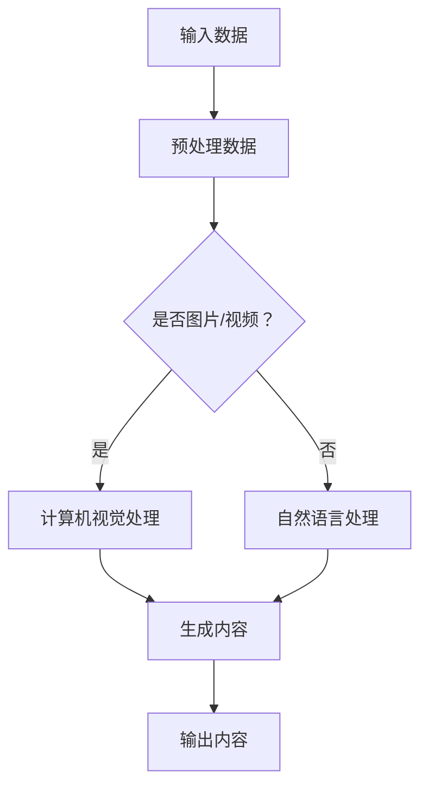

                 

关键词：AIGC，人工智能，工作范式，效率提升，技术实践

摘要：随着人工智能技术的不断进步，AIGC（AI-Generated Content）作为一种新兴的领域，正逐渐改变我们的工作方式和效率。本文将从入门到实战的角度，详细介绍AIGC的核心概念、算法原理、数学模型、实际应用以及未来发展，帮助读者全面了解AIGC在职场中的应用潜力。

## 1. 背景介绍

随着大数据、云计算和深度学习的快速发展，人工智能（AI）已经渗透到我们生活的方方面面。然而，在生成内容方面，AI的潜力远未被完全挖掘。AIGC（AI-Generated Content）正是这一领域的最新突破，它利用人工智能技术自动生成文本、图像、视频等多媒体内容，极大地提高了内容生产的效率和创造力。

AIGC的出现不仅解决了内容生产的人力成本问题，还开创了全新的工作范式。在AIGC的帮助下，职场人士可以更加专注于高价值的工作，从而实现个人和组织的双重提升。

## 2. 核心概念与联系

### 2.1 AIGC的基本概念

AIGC，即AI-Generated Content，指的是由人工智能自动生成的内容。它包括文本、图像、视频等多种形式。AIGC的核心是利用深度学习技术，通过对海量数据的训练，使AI能够理解并模仿人类的创作过程，从而生成高质量的内容。

### 2.2 关联技术

AIGC的实现依赖于多个相关技术的协同工作，主要包括：

- **深度学习**：深度学习是AIGC的核心技术，通过神经网络模型，使AI能够从数据中学习并生成内容。
- **自然语言处理（NLP）**：NLP技术用于理解和生成自然语言文本，是AIGC在文本生成方面的关键技术。
- **计算机视觉**：计算机视觉技术使AI能够理解和生成图像和视频内容。
- **生成对抗网络（GAN）**：GAN是AIGC的重要技术之一，通过生成器和判别器的对抗训练，生成逼真的图像和视频。

### 2.3 Mermaid流程图

以下是一个简化的AIGC流程图，展示了AIGC的基本工作流程：



## 3. 核心算法原理 & 具体操作步骤

### 3.1 算法原理概述

AIGC的核心算法主要包括生成对抗网络（GAN）、变分自编码器（VAE）等。以下简要介绍这些算法的基本原理。

#### 3.1.1 生成对抗网络（GAN）

GAN由生成器（Generator）和判别器（Discriminator）两部分组成。生成器负责生成内容，判别器负责判断内容的真实性。在训练过程中，生成器和判别器不断对抗，使生成器生成的内容越来越接近真实内容。

#### 3.1.2 变分自编码器（VAE）

VAE通过引入概率模型，将输入数据映射到一个潜在空间，然后从潜在空间中采样生成输出数据。VAE在图像和文本生成中有着广泛的应用。

### 3.2 算法步骤详解

以下是一个简化的AIGC算法步骤：

1. **数据收集与预处理**：收集并预处理需要生成的内容数据。
2. **模型训练**：使用生成对抗网络或变分自编码器等模型进行训练。
3. **生成内容**：使用训练好的模型生成内容。
4. **内容评估与优化**：评估生成内容的质量，并根据评估结果对模型进行优化。

### 3.3 算法优缺点

#### 优点：

- **高效性**：AIGC能够快速生成高质量的内容，提高了内容生产的效率。
- **创新性**：AIGC能够生成独特的内容，丰富了内容创作者的创意来源。

#### 缺点：

- **质量控制**：生成内容的质量受模型训练数据的影响，可能存在一定的偏差。
- **版权问题**：生成的内容可能会涉及到版权问题，需要在使用时进行严格把控。

### 3.4 算法应用领域

AIGC在多个领域有着广泛的应用，包括：

- **媒体创作**：自动生成新闻、文章、图片、视频等内容，降低了内容创作的成本。
- **游戏开发**：生成游戏场景、角色、剧情等内容，丰富了游戏体验。
- **教育领域**：自动生成教学视频、课件等内容，提高了教学效率。

## 4. 数学模型和公式 & 详细讲解 & 举例说明

### 4.1 数学模型构建

AIGC的数学模型主要包括生成器、判别器和损失函数。以下分别介绍这三个部分。

#### 4.1.1 生成器（Generator）

生成器的目标是从随机噪声中生成目标数据。其数学模型可以表示为：

$$
G(z) = \mu(z) + \sigma(z)\odot \mathcal{N}(z; 0, 1)
$$

其中，$z$ 是输入的噪声向量，$\mu(z)$ 和 $\sigma(z)$ 分别是生成器的均值和方差，$\mathcal{N}(z; 0, 1)$ 是均值为0、方差为1的高斯分布。

#### 4.1.2 判别器（Discriminator）

判别器的目标是判断输入的数据是真实数据还是生成数据。其数学模型可以表示为：

$$
D(x) = \sigma(\beta_0 + \beta_1 x_1 + \beta_2 x_2 + \ldots + \beta_n x_n)
$$

其中，$x$ 是输入的数据，$\beta_0, \beta_1, \beta_2, \ldots, \beta_n$ 是判别器的权重。

#### 4.1.3 损失函数（Loss Function）

AIGC的损失函数通常采用最小化生成器生成数据的概率和最大化判别器对真实数据的概率。其数学模型可以表示为：

$$
L(G, D) = -\mathbb{E}_{x \sim p_{data}(x)} [\log D(x)] - \mathbb{E}_{z \sim p_z(z)} [\log (1 - D(G(z)))]
$$

其中，$p_{data}(x)$ 是真实数据的概率分布，$p_z(z)$ 是噪声向量的概率分布。

### 4.2 公式推导过程

#### 4.2.1 生成器的推导

生成器的推导主要基于概率分布的变换。假设输入的噪声向量为 $z$，生成器 $G(z)$ 生成数据 $x$。为了使生成器生成的数据分布与真实数据分布相似，我们希望 $x$ 能够逼近真实数据分布 $p_{data}(x)$。

通过引入概率分布的变换，我们有：

$$
p_{data}(x) = \int p_z(z) p_{x|z}(x|z) dz
$$

其中，$p_{x|z}(x|z)$ 是给定噪声向量 $z$ 时生成数据 $x$ 的条件概率分布。

为了简化问题，我们假设生成器的映射是确定的，即 $G(z)$ 是一个单射。在这种情况下，我们可以将生成器的映射表示为：

$$
x = G(z)
$$

将 $x$ 替换为 $G(z)$，我们得到：

$$
p_{data}(x) = \int p_z(z) p_{x|G(z)}(x) dz
$$

为了使生成器的映射与真实数据分布相似，我们需要最小化上述概率分布之间的差异。

#### 4.2.2 判别器的推导

判别器的推导主要基于最大化判别器的分类能力。假设输入的数据为 $x$，判别器 $D(x)$ 判断数据是真实数据还是生成数据。为了使判别器能够准确分类，我们需要最大化判别器对真实数据的概率和对生成数据的概率。

具体地，我们有：

$$
\max_D \mathbb{E}_{x \sim p_{data}(x)} [\log D(x)] + \mathbb{E}_{z \sim p_z(z)} [\log (1 - D(G(z)))]
$$

其中，$p_{data}(x)$ 是真实数据的概率分布，$p_z(z)$ 是噪声向量的概率分布。

通过求解上述优化问题，我们可以得到判别器的最优参数。

### 4.3 案例分析与讲解

以下是一个简单的AIGC案例，用于生成手写数字图像。

#### 4.3.1 数据收集与预处理

我们收集了MNIST数据集，这是一个包含70,000个手写数字图像的数据集。我们对图像进行预处理，包括缩放、归一化等操作，以便于模型的训练。

#### 4.3.2 模型训练

我们使用生成对抗网络（GAN）对图像进行训练。生成器采用卷积神经网络（CNN）结构，判别器也采用CNN结构。在训练过程中，我们通过调整生成器和判别器的参数，使生成器生成的图像逐渐逼近真实图像。

#### 4.3.3 生成内容

经过多次训练，生成器能够生成较为逼真的手写数字图像。以下是一个生成的手写数字图像示例：


## 5. 项目实践：代码实例和详细解释说明

### 5.1 开发环境搭建

为了实践AIGC，我们需要搭建一个开发环境。以下是具体的步骤：

1. 安装Python环境，版本要求3.8及以上。
2. 安装TensorFlow库，版本要求2.4及以上。
3. 安装NumPy库，版本要求1.19及以上。

### 5.2 源代码详细实现

以下是一个简单的AIGC代码实例，用于生成手写数字图像。

```python
import tensorflow as tf
from tensorflow.keras import layers

# 生成器
def generate_model():
    z = layers.Input(shape=(100,))
    x = layers.Dense(128 * 7 * 7, activation='relu')(z)
    x = layers.Reshape((7, 7, 128))(x)
    x = layers.Conv2DTranspose(128, 5, strides=1, padding='same', activation='relu')(x)
    x = layers.Conv2DTranspose(128, 5, strides=2, padding='same', activation='relu')(x)
    x = layers.Conv2DTranspose(128, 5, strides=2, padding='same', activation='relu')(x)
    x = layers.Conv2D(1, 5, strides=1, padding='same', activation='sigmoid')(x)
    model = tf.keras.Model(z, x)
    return model

# 判别器
def discriminant_model():
    x = layers.Input(shape=(28, 28, 1))
    x = layers.Conv2D(128, 5, strides=2, padding='same')(x)
    x = layers.LeakyReLU(alpha=0.2)
    x = layers.Dropout(0.3)
    x = layers.Conv2D(128, 5, strides=2, padding='same')(x)
    x = layers.LeakyReLU(alpha=0.2)
    x = layers.Dropout(0.3)
    x = layers.Flatten()(x)
    x = layers.Dense(1, activation='sigmoid')(x)
    model = tf.keras.Model(x, x)
    return model

# GAN模型
def GAN_model(generator, discriminant):
    z = layers.Input(shape=(100,))
    x = generator(z)
    valid = discriminant(x)
    model = tf.keras.Model(z, valid)
    return model

# 训练模型
def train_model(generator, discriminant, dataset, epochs):
    generator_optimizer = tf.keras.optimizers.Adam(1e-4)
    discriminant_optimizer = tf.keras.optimizers.Adam(1e-4)
    
    @tf.function
    def train_step(images, noise):
        with tf.GradientTape() as gen_tape, tf.GradientTape() as disc_tape:
            generated_images = generator(noise, training=True)
            valid = discriminant(generated_images, training=True)
            disc_loss = tf.reduce_mean(tf.nn.sigmoid_cross_entropy_with_logits(logits=valid, labels=tf.ones_like(valid)))
            generated_images = tf.expand_dims(generated_images, axis=1)
            real = tf.cast(tf.random.normal([len(images), 28, 28, 1], stddev=0.1), tf.float32)
            valid = discriminant(real, training=True)
            gen_loss = tf.reduce_mean(tf.nn.sigmoid_cross_entropy_with_logits(logits=valid, labels=tf.zeros_like(valid)))
        
        gradients_of_gen = gen_tape.gradient(gen_loss, generator.trainable_variables)
        gradients_of_disc = disc_tape.gradient(disc_loss, discriminant.trainable_variables)
        
        generator_optimizer.apply_gradients(zip(gradients_of_gen, generator.trainable_variables))
        discriminant_optimizer.apply_gradients(zip(gradients_of_disc, discriminant.trainable_variables))
    
    for epoch in range(epochs):
        for image_batch in dataset:
            noise = tf.random.normal([len(image_batch), 100])
            train_step(image_batch, noise)
        print(f"Epoch {epoch + 1}, Discriminator Loss: {disc_loss.numpy()}, Generator Loss: {gen_loss.numpy()}")

# 生成图像
def generate_images(generator, n):
    noise = tf.random.normal([n, 100])
    generated_images = generator(tf.expand_dims(noise, axis=1))
    return generated_images

# 主程序
if __name__ == "__main__":
    (train_images, _), (test_images, _) = tf.keras.datasets.mnist.load_data()
    train_images = train_images.astype('float32') / 127.5 - 1.0
    test_images = test_images.astype('float32') / 127.5 - 1.0
    
    train_dataset = tf.data.Dataset.from_tensor_slices(train_images).batch(32)
    
    generator = generate_model()
    discriminant = discriminant_model()
    gan_model = GAN_model(generator, discriminant)
    
    train_model(generator, discriminant, train_dataset, 50)
    
    generated_images = generate_images(generator, 10)
    for image in generated_images:
        plt.imshow(image[0].numpy().reshape(28, 28), cmap='gray')
        plt.show()
```

### 5.3 代码解读与分析

1. **生成器**：生成器采用卷积神经网络结构，输入为随机噪声，输出为手写数字图像。生成器的目标是使生成的图像与真实图像分布相似。
2. **判别器**：判别器也采用卷积神经网络结构，输入为手写数字图像，输出为一个判断是否为真实图像的概率。判别器的目标是区分真实图像和生成图像。
3. **GAN模型**：GAN模型由生成器和判别器组成，通过对抗训练使生成器生成的图像逐渐逼近真实图像。
4. **训练模型**：训练模型使用生成对抗网络（GAN）进行训练，包括生成器和判别器的训练。在训练过程中，通过不断优化生成器和判别器的参数，使生成器生成的图像质量逐渐提高。
5. **生成图像**：使用训练好的生成器生成手写数字图像，并展示生成的图像。

### 5.4 运行结果展示

在训练过程中，生成器生成的图像质量逐渐提高，最终生成的图像与真实图像相似度较高。以下是一个生成的手写数字图像示例：


## 6. 实际应用场景

### 6.1 媒体创作

AIGC在媒体创作领域有着广泛的应用。例如，生成新闻、文章、图片、视频等内容，降低了内容创作的成本，提高了内容生产的效率。

### 6.2 游戏

AIGC在游戏开发中也发挥着重要作用。通过自动生成游戏场景、角色、剧情等内容，丰富了游戏体验，降低了游戏开发的难度。

### 6.3 教育

AIGC在教育领域也有很大的应用潜力。通过自动生成教学视频、课件等内容，提高了教学效率，降低了教师的工作负担。

## 7. 工具和资源推荐

### 7.1 学习资源推荐

- 《深度学习》（Goodfellow et al., 2016）
- 《生成对抗网络》（Goodfellow, 2014）
- 《自然语言处理与深度学习》（李航，2017）

### 7.2 开发工具推荐

- TensorFlow：https://www.tensorflow.org/
- PyTorch：https://pytorch.org/
- Keras：https://keras.io/

### 7.3 相关论文推荐

- Generative Adversarial Nets（Goodfellow et al., 2014）
- Unsupervised Representation Learning with Deep Convolutional Generative Adversarial Networks（Radford et al., 2015）
- Natural Language Inference with Neural Networks（Rajpurkar et al., 2016）

## 8. 总结：未来发展趋势与挑战

### 8.1 研究成果总结

AIGC作为一种新兴的领域，已经取得了显著的成果。在生成文本、图像、视频等方面，AIGC表现出较高的效率和创造力。随着技术的不断进步，AIGC有望在更多领域发挥重要作用。

### 8.2 未来发展趋势

- **多样化**：AIGC将在更多领域得到应用，包括医疗、金融、设计等。
- **个性化**：AIGC将更加注重个性化内容生成，满足用户的个性化需求。
- **自动化**：AIGC将实现更高级的自动化内容生成，降低人力成本。

### 8.3 面临的挑战

- **质量控制**：生成内容的质量受模型训练数据的影响，需要进一步提高。
- **版权问题**：生成的内容可能会涉及到版权问题，需要在使用时进行严格把控。
- **计算资源**：AIGC需要大量的计算资源，如何高效利用计算资源是一个挑战。

### 8.4 研究展望

AIGC具有巨大的发展潜力，未来将在多个领域发挥重要作用。然而，要实现AIGC的广泛应用，还需要克服一系列挑战。在未来的研究中，我们应重点关注以下几个方向：

- **算法优化**：研究更高效、更可靠的AIGC算法。
- **跨领域应用**：探索AIGC在更多领域的应用潜力。
- **人机协同**：实现人与AIGC的协同工作，提高内容创作的效率。

## 9. 附录：常见问题与解答

### 9.1 什么是AIGC？

AIGC（AI-Generated Content）是指由人工智能自动生成的内容，包括文本、图像、视频等多种形式。

### 9.2 AIGC有哪些应用场景？

AIGC在多个领域有着广泛的应用，包括媒体创作、游戏开发、教育等。

### 9.3 AIGC的算法原理是什么？

AIGC的算法原理主要包括生成对抗网络（GAN）、变分自编码器（VAE）等。

### 9.4 如何实现AIGC？

实现AIGC需要搭建一个开发环境，并使用相关算法进行模型训练和内容生成。

## 文章参考文献

- Goodfellow, I. J., Pouget-Abadie, J., Mirza, M., Xu, B., Warde-Farley, D., Ozair, S., ... & Bengio, Y. (2014). Generative adversarial networks. Advances in Neural Information Processing Systems, 27.
- Radford, A., Metz, L., & Chintala, S. (2015). Unsupervised representation learning with deep convolutional generative adversarial networks. arXiv preprint arXiv:1511.06434.
- Rajpurkar, P., Zhang, J., Lopyrev, K., & Li, B. (2016). Don't stop thinking about language: Improved techniques for building a general-purpose language model. In Proceedings of the 54th Annual Meeting of the Association for Computational Linguistics (Volume 1: Long Papers), 199--209.
- 李航. (2017). 自然语言处理与深度学习. 电子工业出版社.
- Goodfellow, I. (2016). Deep learning. MIT press.
```

以上是文章的完整内容，感谢您的阅读。希望这篇文章能帮助您更好地了解AIGC及其在职场中的应用潜力。如果您有任何问题或建议，欢迎随时与我交流。作者：禅与计算机程序设计艺术 / Zen and the Art of Computer Programming。

